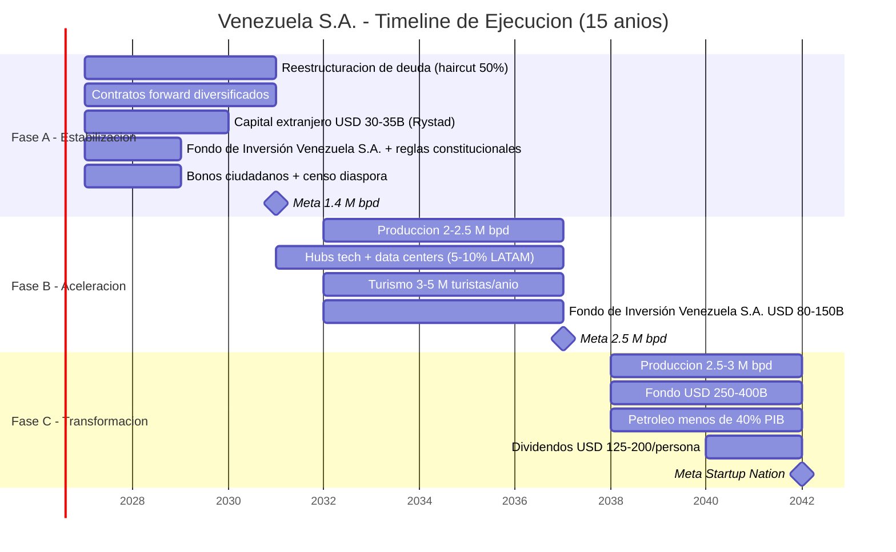
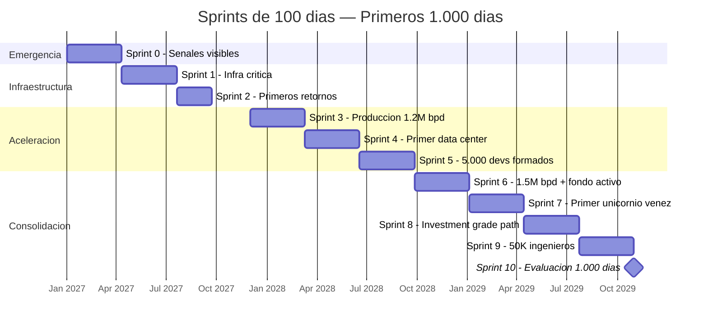
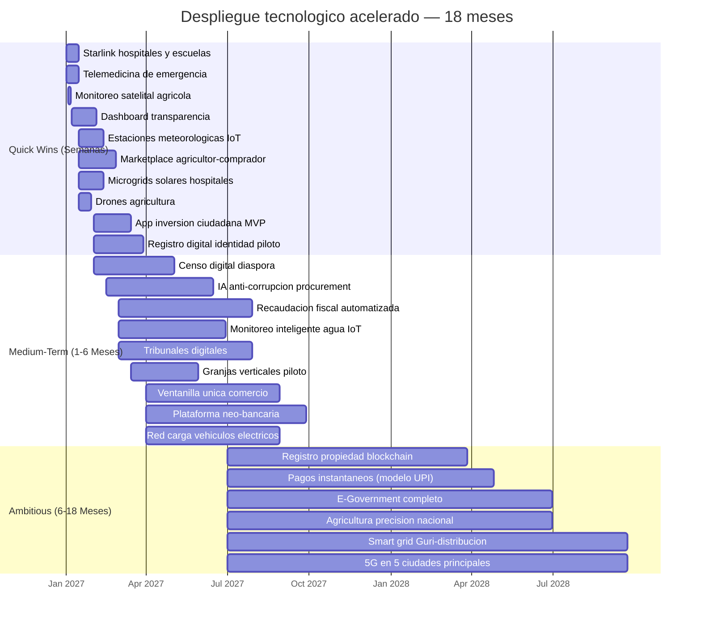

# Timeline Realista (Basado en Rystad Energy)

:::caution Fechas ilustrativas — las fases se activan por KPIs, no por calendario
Las referencias a "Año X" en este documento son **ilustrativas**. Las fases reales se activan por condiciones verificables (PIB/cápita, formalización, pobreza). Ver [KPIs de Activación](/07-ejecucion/kpis-activacion).
:::

## Fase A: Estabilización (Años 1–4)
- Reestructurar deuda (haircut 50%, [modelo Citigroup](https://www.cnbc.com/2026/01/04/venezuelas-billions-in-distressed-debt-who-is-in-line-to-collect.html))
- Contratos forward con compradores diversificados
- USD 30–35.000 M capital extranjero inicial ([Rystad](https://www.rigzone.com/news/could_venezuela_production_get_back_to_3mm_barrels_per_day-08-jan-2026-182716-article/))
- Fondo de Inversión Venezuela S.A. + reglas constitucionales
- Bonos ciudadanos + censo global diáspora
- **Meta: 1,4 M bpd**

## Fase B: Aceleración (Años 5–10)
- Producción: 2–2,5 M bpd (ver [Petróleo y Gas](/10-oportunidades/petroleo-gas))
- Hubs tech + data centers (5–10% mercado LATAM) (ver [Data Centers e IA](/10-oportunidades/data-centers-ia))
- Turismo: 3–5 M turistas/año (ver [Turismo](/10-oportunidades/turismo))
- Fondo de Inversión Venezuela S.A.: USD 80–150.000 M

## Fase C: Transformación (Años 11–15+)
- Producción: 2,5–3 M bpd
- Fondo: USD 250–400.000 M
- Petróleo <40% PIB
- Dividendos: USD 125–200/persona/año

---

## Primeros 1.000 Días: Sprints con Resultados Visibles

:::danger Lección Bukele + Musk
Los evaluadores coinciden: un plan de 15 años sin resultados visibles en los primeros 365 días pierde legitimidad. Bukele transformó la percepción de El Salvador en 1.000 días. Musk comprime timelines 3-5x. El plan necesita **sprints de 100 días** con entregables medibles y visibles.
:::

### Sprint 0: Días 1–100 — Emergencia y Señales

| # | Entregable | Métrica | Responsable |
|---|-----------|---------|-------------|
| 1 | **Hospital funcional** — al menos 1 hospital público rehabilitado con estándares internacionales | Camas operativas, quirófanos, insumos | Min. Salud + OPS |
| 2 | **Calle segura** — 3 zonas piloto con seguridad 24/7 (Caracas, Maracaibo, Valencia) | Homicidios -50% en zona piloto | Policía reformada + cooperación internacional |
| 3 | **Mercado abastecido** — cadena de suministro de alimentos rehabilitada en 10 ciudades | Precios estables, estantes llenos, 0 CLAP | Sector privado + importación emergencia |
| 4 | **Internet funcional** — Starlink en 50 puntos públicos (plazas, escuelas, hubs) | 100+ Mbps disponible (puntos de acceso público) | Starlink + gobierno |
| 5 | **Dashboard público** — plataforma web con presupuesto, gastos, avance en tiempo real | Online, accesible, actualizado diariamente | Equipo tech |
| 6 | **Primer contrato forward firmado** — señal al mercado de que el plan es real | USD 1-3B en adelantos | Agencia Petrolera |

### Sprint 1: Días 101–200 — Infraestructura Crítica

| # | Entregable | Métrica |
|---|-----------|---------|
| 1 | **Guri rehabilitado** — primera turbina reparada, uptime > 80% | MW recuperados |
| 2 | **5 coworkings tech** operativos con Starlink + fibra | Puestos disponibles, velocidad Mbps |
| 3 | **Primer bootcamp** de software lanzado (1.000 estudiantes) | Inscritos, tasa de permanencia |
| 4 | ~~Licencia OFAC expandida~~ **CUMPLIDO:** [Licencia 46B emitida 14-mar-2026](https://www.infobae.com/venezuela/2026/03/14/eeuu-autorizo-a-las-empresas-estadounidenses-realizar-negocios-con-el-sector-petrolero-venezolano/) — todas las empresas de EE.UU. autorizadas | COMPLETADO |
| 5 | **Censo digital** de diáspora lanzado | Registrados en plataforma |

### Sprint 2: Días 201–365 — Primeros Retornos

| # | Entregable | Métrica |
|---|-----------|---------|
| 1 | **Producción a 1.1-1.2M bpd** | bpd verificados |
| 2 | **Primer JV con major** firmado (post-Chevron) | USD invertidos |
| 3 | **10.000 policías** nuevos graduados y desplegados | Cobertura territorial |
| 4 | **Primer bono ciudadano** emitido (piloto USD 10-50) | Ciudadanos participantes |
| 5 | **3 bootcamps** operativos en 3 ciudades | Graduados primer cohorte |

### Sprint 3-10: Días 366–1.000

### Compresión del timeline: 15 → 10 años operativos

| Mecanismo de compresión | Ahorro estimado | Modelo |
|------------------------|----------------|--------|
| **Ejecución paralela** (no secuencial) — petróleo + tech + seguridad simultáneo | 2-3 años | Musk: "todo en paralelo, nunca en serie" |
| **Starlink** en vez de rehabilitar fibra terrestre | 1-2 años | Conectividad inmediata vs. 3-5 años de obra civil |
| **Prefabricación modular** para infraestructura | 1-2 años | China construye hospitales en 10 días |
| **Design-Build** (contratista único diseña + construye) | 6-12 meses | vs. licitación separada de diseño y construcción |
| **Permisos paralelos** (no esperar uno para empezar otro) | 6-12 meses | Singapur: permiso en 26 días vs. LATAM ~180 días |
| **24/7 en proyectos críticos** | 30-50% más rápido | UAE: turnos de 24h en proyectos clave |

:::tip El plan real es de 10 años con buffer de 5
Si se ejecuta con velocidad Musk/Bukele (todo en paralelo, resultados cada 100 días, sin burocracia), el plan se comprime a **10 años operativos**. Los 5 años restantes son buffer para imprevistos. Si no hay imprevistos graves, Venezuela llega al destino en 2037, no en 2042.
:::

---

## Lo Que Se Puede Construir en Días, No en Años

La pregunta no es "¿qué hay que hacer?" — eso está en las 200 páginas anteriores. La pregunta es: **¿cuánto de esto se puede desplegar con tecnología actual en días o semanas en vez de años?**

La respuesta: mucho más de lo que el paradigma de obra pública tradicional asume.

Estonia construyó su estado digital en los 2000s con la tecnología de los 2000s. India desplegó [UPI](https://www.npci.org.in/what-we-do/upi/product-overview) a **300M de usuarios en 3 años** (2016-2019). Kenya llevó [M-Pesa](https://www.vodafone.com/about-vodafone/what-we-do/consumer-products-and-services/m-pesa) al **90% de la población adulta** en una década. Rwanda pasó de genocidio a [crecimiento de 7,5% anual por 20 años](https://data.worldbank.org/country/rwanda) con señalización secuencial. La tecnología de 2027 permite comprimir esos timelines **3-5x**.

:::danger Principio operativo
Lo que tomaba 5 años en 2010 toma 6 meses en 2027. Cloud, satélites LEO, IA, fintech, IoT, drones, contenedores solares — todo es off-the-shelf. La limitante no es la tecnología. Es la voluntad de desplegar sin burocracia.
:::

### Quick Wins (Días a Semanas)

Acciones que se despliegan con tecnología existente, sin desarrollo custom, sin obra civil mayor.

| Acción | Timeline | Costo Est. | Tecnología | Impacto | Precedente |
|--------|----------|-----------|------------|---------|------------|
| **Starlink en hospitales y escuelas** | 1-2 semanas | USD 18-35M/año ([ver cálculo](/06-realidad/infraestructura-basica#starlink--conectividad-inmediata)) | 3.500 terminales Starlink Business + Residencial | Internet 100-350 Mbps en puntos sin conectividad | Ucrania desplegó Starlink en días durante la guerra (2022) |
| **Telemedicina de emergencia** | 1-2 semanas | USD 1-3M (licencias + tablets) | Zoom/WhatsApp + plataformas como [Teladoc](https://www.teladoc.com/) o [Docplanner](https://www.docplanner.com/) | Consultas médicas remotas para zonas sin hospital | Brasil: [Conexa Saúde](https://www.conexasaude.com.br/) alcanzó 4M+ teleconsultas/año [Requiere investigación] |
| **Dashboard de transparencia** | 2-4 semanas | USD 200-500K | Open-source (React/Next.js + APIs de datos abiertos) | Cada bolívar rastreado desde día 1. Ver [Estado Digital](/06-realidad/estado-digital) | Ucrania [ProZorro](https://prozorro.gov.ua/en): online en meses |
| **Monitoreo satelital agrícola** | 1-3 días (suscripción) | USD 50-200K/año | [Planet Labs](https://www.planet.com/) (imágenes diarias) + [Farmonaut](https://www.farmonaut.com/) (análisis IA) | Cobertura de 100% de superficie agrícola de los Llanos desde día 1 | India: [Fasal](https://fasal.co/) monitorea 100K+ hectáreas vía satélite |
| **Red de estaciones meteorológicas IoT** | 2-4 semanas | USD 500K-2M (100-500 estaciones) | [Davis Instruments](https://www.davisinstruments.com/) / [Tempest](https://weatherflow.com/tempest-weather-system/) + transmisión Starlink | Datos climáticos en tiempo real para agricultura de precisión y alertas | Rwanda desplegó [300 estaciones IoT](https://www.wmo.int/) en meses [Requiere investigación] |
| **Marketplace digital agricultor→comprador** | 3-6 semanas | USD 300K-1M (MVP) | App móvil (React Native/Flutter) + pasarela de pago | Elimina intermediarios, conecta 500K+ productores con mercado | Kenya: [Twiga Foods](https://twiga.com/) conectó 100K+ agricultores con compradores en 3 años |
| **App de inversión ciudadana (MVP)** | 4-6 semanas | USD 500K-2M | Fintech white-label ([Rapyd](https://www.rapyd.net/) / [Stripe](https://stripe.com/)) + KYC digital | Bonos desde USD 10 para 40M de accionistas. Ver [Diáspora](/03-ciudadanos/diaspora) | Brasil: [Nubank](https://www.nubank.com/) llegó a 70M+ clientes en 8 años |
| **Microgrids solares para hospitales** | 2-4 semanas (contenedorizados) | USD 50-150K por hospital | [BoxPower](https://boxpower.io/) / [Bboxx](https://www.bboxx.com/) (contenedores solares prefabricados) | Hospitales con energía 24/7 independiente de la red eléctrica | Puerto Rico post-María: microgrids solares desplegadas en semanas |
| **Drones para agricultura** | 1-2 semanas (compra + capacitación) | USD 2-5M (flota de 100-200 drones) | [DJI Agras](https://www.dji.com/ag) / [XAG](https://www.xa.com/) | Fumigación, siembra, mapeo — 10x más eficiente que manual | Brasil: +100K drones agrícolas operando ([Embrapa 2024](https://www.embrapa.br/)) [Requiere investigación] |
| **Registro digital de identidad** | 4-8 semanas (piloto) | USD 2-5M | Biométricos (huella + facial) + base de datos cloud | Base para todo lo demás: voto, impuestos, salud, propiedad | India [Aadhaar](https://uidai.gov.in/): 1.300M registrados, arrancó como piloto en 2009 |

:::tip Los 3 quick wins más transformacionales
1. **Starlink + telemedicina** = salud inmediata para zonas sin hospital ni internet. Costo: ~USD 20M/año. Impacto: millones de personas con acceso a un médico por primera vez en años.
2. **Dashboard de transparencia** = señal de credibilidad al inversor internacional y al ciudadano. Costo: <USD 500K. Impacto: confianza.
3. **App de inversión ciudadana** = los 40M de accionistas se vuelven reales. Costo: ~USD 1M. Impacto: capital + legitimidad social.
:::

### Medium-Term Builds (1-6 Meses)

Requieren desarrollo custom, integración de sistemas o hardware especializado, pero no obra civil de años.

| Acción | Timeline | Costo Est. | Tecnología | Impacto | Precedente |
|--------|----------|-----------|------------|---------|------------|
| **Plataforma neo-bancaria** | 3-6 meses | USD 5-15M | Core bancario cloud ([Mambu](https://www.mambu.com/) / [Temenos](https://www.temenos.com/)) + wallet digital | Inclusión financiera sin sucursales físicas. Leapfrogging bancario. Ver [Sistema Financiero](/06-realidad/sistema-financiero) | Kenya M-Pesa: 70%+ inclusión financiera vía móvil |
| **IA anti-corrupción en procurement** | 2-4 meses | USD 3-8M | ML sobre datos de licitaciones + graph neural networks + [ProZorro](https://prozorro.gov.ua/en) como modelo | Detección automática de sobrecostos, proveedores fantasma, redes de testaferros. Ver [Transparencia](/06-realidad/estado-digital#transparencia-total-blockchain--ia-anti-corrupción) | Ucrania ProZorro: ahorro USD 6B en 3 años |
| **Ventanilla única de comercio digital** | 3-6 meses | USD 5-10M | [ASYCUDA](https://asycuda.org/) (UNCTAD) + APIs de aduanas + firma digital | Tiempo de despacho aduanero: de días a horas. Clave para exportaciones | Singapur [TradeNet](https://www.tradenet.gov.sg/): despacho en 10 minutos |
| **Monitoreo inteligente de agua** | 2-4 meses | USD 3-8M (1.000+ sensores) | Sensores IoT en plantas de tratamiento + SCADA + dashboards | Detección de fugas en tiempo real. Red de agua pierde >50% por fugas | Israel: [TaKaDu](https://www.takadu.com/) redujo pérdidas de agua 15-30% |
| **Red de carga para vehículos eléctricos** | 3-6 meses (corredores clave) | USD 10-25M (200-500 cargadores) | [Tesla Supercharger](https://www.tesla.com/supercharger) / [ABB](https://new.abb.com/ev-charging) + energía de Guri | Corredores Caracas-Valencia, Caracas-La Guaira. Señal de modernidad | China: 2.7M+ puntos de carga desplegados en 5 años ([IEA 2025](https://www.iea.org/)) [Requiere investigación] |
| **Granjas verticales piloto** | 2-3 meses (contenedores) | USD 1-3M (5-10 contenedores) | [Freight Farms](https://www.freightfarms.com/) / [Infarm](https://www.infarm.com/) — contenedores de cultivo hidropónico | Producción de hortalizas 365 días/año, independiente de clima. Complementa Llanos | Singapur: granjas verticales producen 10% de hortalizas del país [Requiere investigación] |
| **Tribunales digitales** | 3-6 meses | USD 3-8M | Video-audiencias + expediente digital + firma electrónica + IA para clasificación | Reducir backlog judicial. Ver [Estado Digital](/06-realidad/estado-digital) | Singapur: [e-Litigation](https://www.judiciary.gov.sg/) — 100% expediente digital |
| **Recaudación fiscal automatizada** | 3-6 meses | USD 5-15M | 15% flat tax + 12% IVA = sistema simple. Portal digital + facturación electrónica + IA | Impuestos en 3 minutos (modelo Estonia). Ver [Transición Fiscal](/02-motor-financiero/transicion-fiscal) | Estonia: declaración de impuestos en 3 minutos |
| **Censo digital de diáspora** | 1-3 meses | USD 3-8M | Plataforma web/app + verificación biométrica + mapa de talento | Mapear 7.9M venezolanos: ubicación, profesión, disposición a invertir/retornar. Ver [Diáspora](/03-ciudadanos/diaspora) | Estonia [e-Residency](https://www.e-resident.gov.ee/): 100K+ residentes digitales de 170+ países |

:::info Efecto multiplicador
Cada una de estas plataformas digitales elimina burocracia y habilita la siguiente. Censo digital → app de inversión → neo-banca → recaudación fiscal → dashboard de transparencia. Es un **stack**, no proyectos aislados. El modelo Estonia demuestra que la interoperabilidad ([X-Road](https://e-estonia.com/solutions/interoperability-services/x-road/)) es lo que hace que todo funcione en conjunto.
:::

### Ambitious but Feasible (6-18 Meses)

Proyectos que en otro contexto tomarían 3-5 años, pero con ejecución paralela y tecnología actual se comprimen a 6-18 meses.

| Acción | Timeline | Costo Est. | Tecnología | Impacto | Precedente |
|--------|----------|-----------|------------|---------|------------|
| **E-Government completo** (identidad + impuestos + salud + justicia + registro empresas) | 12-18 meses | USD 200-500M | X-Road venezolano + cloud nacional + biométricos + blockchain para auditoría | 95% de trámites online, 0 filas, 2% PIB en ahorro. Ver [Estado Digital](/06-realidad/estado-digital) | Estonia: 2 años en los 2000s. Con tech de 2027 y su código abierto, 12-18 meses es realista |
| **Agricultura de precisión nacional** (Llanos + zonas agrícolas) | 12-18 meses | USD 50-150M | Satélite (Planet Labs) + drones + IoT + IA para recomendaciones de siembra | Productividad agrícola +30-50%. Reducir importación de alimentos de 70% a <40%. Ver [Agricultura](/06-realidad/infraestructura-basica#agricultura-y-soberanía-alimentaria) | Brasil: agricultura de precisión cubre 70%+ de soja ([Embrapa](https://www.embrapa.br/)) |
| **Modernización de red eléctrica** (smart grid Guri→distribución) | 12-18 meses (fase 1) | USD 500M-1B | Smart meters + SCADA + automatización de subestaciones + predictive maintenance IA | Reducir pérdidas técnicas de >30% a <15%. Guri tiene 18.000 MW — el problema es distribución. Ver [Infraestructura](/06-realidad/infraestructura-basica) | Colombia: [Enel/Codensa](https://www.enel.com.co/) redujo pérdidas técnicas a 8% con smart grid |
| **Registro de propiedad en blockchain** | 6-12 meses | USD 20-50M | Blockchain permissionada + integración catastral + biométricos | Seguridad jurídica para inversión. Formalizar propiedad de millones de familias | Georgia: [blockchain para títulos de tierra](https://www.transparency.org/) desde 2016 |
| **5G en 5 ciudades principales** (Caracas, Maracaibo, Valencia, Barquisimeto, Pto. Ordaz) | 12-18 meses (cobertura inicial) | USD 500M-1B | Ericsson/Nokia/Samsung ([ver proveedores aprobados](/06-realidad/infraestructura-basica#proveedores-de-telecoms-aliados-no-huawei)) + Starlink backhaul rural | Velocidad 1+ Gbps para ZEETs, data centers, startups | Arabia Saudita: cobertura 5G en principales ciudades en 18 meses ([STC 2019-2021](https://www.stc.com.sa/)) [Requiere investigación] |
| **Plataforma de pagos instantáneos** (modelo UPI/Pix) | 6-12 meses | USD 10-30M | Infraestructura de pagos del banco central + APIs abiertas + interoperabilidad | Transacciones USD 0 costo, instantáneas, 24/7. Ver [Sistema Financiero](/06-realidad/sistema-financiero) | India UPI: [10B transacciones/mes](https://www.npci.org.in/what-we-do/upi/product-overview), lanzado en 2016 |

### Gantt de Despliegue Paralelo

### Inversión Total del Despliegue Acelerado

| Categoría | Inversión (rango) | # Proyectos | Plazo |
|-----------|-------------------|-------------|-------|
| Quick Wins | **USD 25-55M** | 10 | Semanas |
| Medium-Term | **USD 35-95M** | 9 | 1-6 meses |
| Ambitious | **USD 1.300-2.700M** | 6 | 6-18 meses |
| **TOTAL** | **USD 1.360-2.850M** | **25** | **18 meses** |

:::tip ROI del despliegue acelerado
Los quick wins cuestan **USD 25-55M** — menos del 0,01% de la inversión total del plan (USD 550-750B). Pero generan las **señales de credibilidad** que desbloquean todo lo demás. El dashboard de transparencia cuesta USD 500K y puede desbloquear USD 30B en inversión extranjera. La telemedicina cuesta USD 3M y llega a millones de personas sin hospital. El ROI de las señales tempranas es incalculable.
:::

### Precedentes Internacionales: No Es Teoría

| País | Qué hicieron | En cuánto tiempo | Resultado | Fuente |
|------|-------------|------------------|-----------|--------|
| **Estonia** | Estado digital completo (e-Residency, X-Road, identidad digital) | ~2 años (2001-2003 base) | 100% servicios online, 2% PIB ahorrado, #1 ONU e-gobierno | [e-Estonia](https://e-estonia.com/) |
| **India** | UPI — sistema de pagos instantáneos universal | 3 años para 300M usuarios (2016-2019) | **10B transacciones/mes**, USD 0 costo | [NPCI](https://www.npci.org.in/what-we-do/upi/product-overview) |
| **Kenya** | M-Pesa — banca móvil sin bancos | 10 años para 90% penetración | **70%+ inclusión financiera** desde casi cero | [Vodafone M-Pesa](https://www.vodafone.com/about-vodafone/what-we-do/consumer-products-and-services/m-pesa) |
| **Rwanda** | Reconstrucción post-genocidio con señalización secuencial | 20 años de crecimiento 7,5%/año | De país destruido a "Singapur de África" | [World Bank](https://data.worldbank.org/country/rwanda) |
| **El Salvador** | Transformación de seguridad + Bitcoin como legal tender | 1.000 días (percepción de seguridad) | Homicidios -70%, turismo +50% | [Bukele government data](https://www.presidencia.gob.sv/) [Requiere investigación] |
| **Ucrania** | Starlink en zona de guerra + ProZorro anti-corrupción | Starlink: días. ProZorro: 2 años | Conectividad en guerra; USD 6B ahorrados en procurement | [ProZorro](https://prozorro.gov.ua/en) |
| **Georgia (2004)** | Policía nueva + digitalización + anti-corrupción radical | 2-3 años | De más corrupto del Cáucaso a top reformador mundial | [Transparency International](https://www.transparency.org/) |

:::danger La ventana se está cerrando
El [principio 6](/) del plan lo dice claro: **el petróleo es un activo depreciante**. Para 2040 solar será más barato que extraer crudo de la Faja. Cada mes de demora en desplegar estas tecnologías es un mes menos de ventana petrolera para financiarlas. El despliegue acelerado no es una opción — es la única estrategia compatible con una ventana de 10-15 años. Ver los análisis detallados por sector en [Oportunidades de Inversión](/10-oportunidades/modelo-concesiones).
:::
