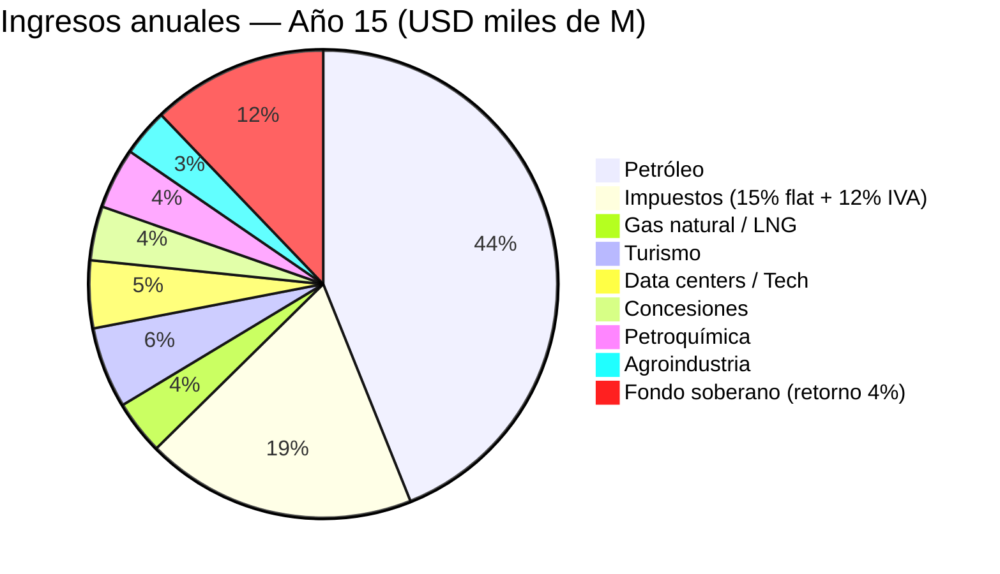
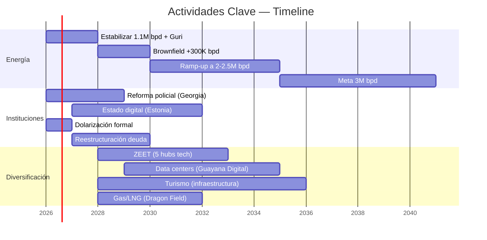
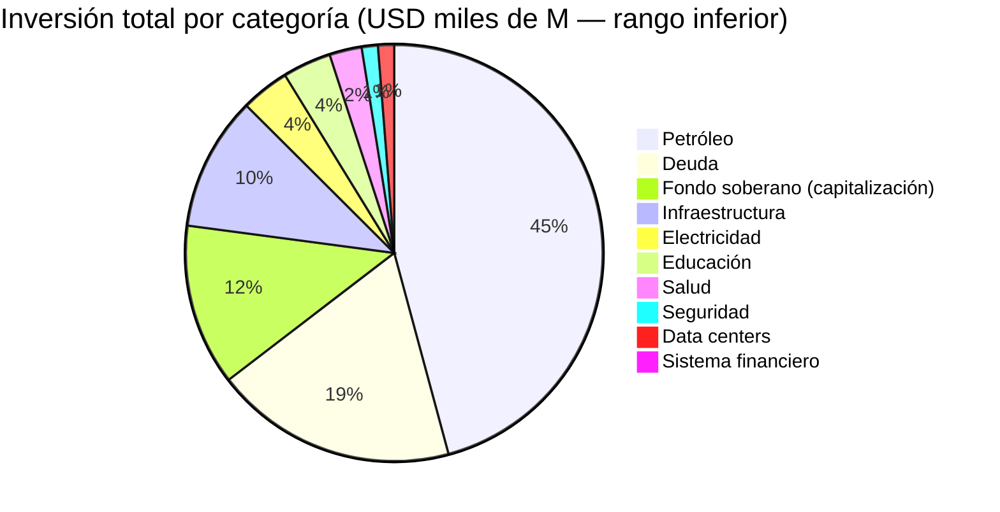

# Business Model Canvas — Venezuela S.A.

```mermaid
flowchart TB
    subgraph KP["🤝 Key Partners"]
        KP1["Oil majors (Chevron, Shell, TotalEnergies)"]
        KP2["BigTech (AWS, Google, Microsoft)"]
        KP3["Multilaterales (FMI, BM, BID)"]
        KP4["EE.UU. (control oil sales actual)"]
        KP5["Trinidad & Tobago (gas/LNG)"]
        KP6["Colombia/Brasil (comercio + energía)"]
    end

    subgraph KA["⚙️ Key Activities"]
        KA1["Reconstruir producción petrolera (1→3M bpd)"]
        KA2["Rehabilitar hidroeléctrica (18 GW)"]
        KA3["Crear 5 hubs tech (ZEET)"]
        KA4["Reestructurar deuda (USD 150-170B)"]
        KA5["Reforma institucional (Georgia model)"]
        KA6["Estado digital (Estonia model)"]
    end

    subgraph VP["💎 Value Proposition"]
        VP1["CIUDADANOS: Dividendo + servicios + propiedad"]
        VP2["INVERSORES: Acceso a 303B bbl + energía barata"]
        VP3["BIGTECH: Electricidad más barata de LATAM"]
        VP4["DIÁSPORA: Participación desde USD 10 + retorno"]
    end

    subgraph CR["❤️ Customer Relationships"]
        CR1["Accionista (dividendo automático)"]
        CR2["Transparencia total (dashboard blockchain)"]
        CR3["Gobierno digital (0 burocracia)"]
        CR4["Whistleblower + anticorrupción"]
    end

    subgraph CS["👥 Customer Segments"]
        CS1["28-32M venezolanos en el país"]
        CS2["7,9M diáspora"]
        CS3["Oil majors internacionales"]
        CS4["BigTech / data center operators"]
        CS5["Inversores institucionales"]
        CS6["Turistas (meta: 5-10M/año)"]
    end

    subgraph KR["🏗️ Key Resources"]
        KR1["303.000M bbl reservas petroleras (#1 mundial)"]
        KR2["18 GW potencial hidroeléctrico"]
        KR3["5.500 BCM gas natural (#7 mundial)"]
        KR4["7,9M diáspora capacitada"]
        KR5["Posición geográfica (Caribe + cercanía EE.UU.)"]
        KR6["Tierras fértiles (Llanos + Orinoco)"]
    end

    subgraph CH["📢 Channels"]
        CH1["App inversión ciudadana (desde USD 10)"]
        CH2["Bonos soberanos"]
        CH3["ZEET (5 zonas tech con beneficios fiscales)"]
        CH4["Acuerdos bilaterales (JVs, forwards)"]
        CH5["Plataforma diáspora (censo + matching)"]
    end

    subgraph COST["💰 Cost Structure"]
        COST1["Petróleo: USD 183.000M (Rystad, 15 años)"]
        COST2["Infraestructura: USD 41.500-81.000M"]
        COST3["Deuda: USD 75-85.000M (reestructuración)"]
        COST4["Educación: USD 15-25.000M"]
        COST5["Seguridad: USD 5-8.000M"]
        COST6["Total: USD 550-750.000M / 15 años"]
    end

    subgraph REV["💵 Revenue Streams"]
        REV1["Petróleo: USD 40-55.000M/año (año 15)"]
        REV2["Impuestos: 15% flat + 12% IVA"]
        REV3["Concesiones (infraestructura, telecom)"]
        REV4["ZEET fees + corporate tax 15%"]
        REV5["Fondo soberano: 4-7% retorno anual"]
        REV6["Gas/LNG: USD 3-5.000M/año"]
        REV7["Turismo: USD 4-8.000M/año"]
    end
```

---

## Los 9 Bloques en Detalle

### 1. Segmentos de Clientes

| Segmento | Tamaño | Necesidad | Oferta |
|----------|--------|-----------|--------|
| Venezolanos en el país | 28–32 M | Servicios básicos, empleo, dignidad | Dividendo + servicios + oportunidad |
| Diáspora | 7,9 M | Participar, invertir, retornar | Bonos desde USD 10 + programa retorno |
| Oil majors | 5–10 empresas | Acceso a reservas | JVs con marco legal estable |
| BigTech | AWS, Google, MS, Oracle | Electricidad barata para data centers | ZEET con energía a costo marginal |
| Inversores institucionales | Fondos globales | Retorno en mercados frontera | Bonos soberanos + VIN |
| Turistas | Meta: 5–10 M/año | Caribe, naturaleza, aventura | Salto Ángel, Los Roques, Canaima |

### 2. Propuesta de Valor

**Para ciudadanos:**
- Dividendo automático del fondo soberano (USD 15→200/año)
- Salud universal + pensión digna
- Estado digital sin burocracia
- Propiedad real sobre recursos nacionales

**Para inversores:**
- Acceso a las mayores reservas petroleras del planeta
- Electricidad hidroeléctrica más barata de LATAM
- Tax holiday 10 años en ZEET (0% corporate, 0% capital gains)
- Marco legal estable (dolarización + arbitraje internacional)

**Para la diáspora:**
- Inversión desde USD 10 con retorno real
- Programa de retorno con incentivos (empleo, housing, crédito)
- Participación remota sin necesidad de regresar físicamente

### 3. Canales

| Canal | Función | Target |
|-------|---------|--------|
| App inversión ciudadana | Bonos, dividendos, portafolio | Ciudadanos + diáspora |
| Dashboard blockchain | Transparencia del fondo | Todos |
| ZEET (5 zonas tech) | Atracción de inversión | BigTech + startups |
| Contratos forward | Capital inicial | Oil majors + traders |
| Acuerdos bilaterales | Comercio + cooperación | Gobiernos + multilaterales |
| Plataforma diáspora | Censo + matching talento | 7,9M en el exterior |

### 4. Relaciones con Clientes

| Tipo | Mecanismo | Modelo |
|------|-----------|--------|
| Accionista universal | Dividendo automático, sin trámites | Alaska PFD |
| Transparencia radical | Cada dólar trazable en blockchain | NBIM (Noruega) |
| Gobierno digital | 100% trámites online, 0 filas | Estonia X-Road |
| Anticorrupción by design | Whistleblower 10–30% recompensa | SEC / Singapore CPIB |
| Participación directa | Votación en decisiones del fondo | Democracia accionarial |

### 5. Fuentes de Ingreso

| Fuente | Año 5 | Año 10 | Año 15 |
|--------|-------|--------|--------|
| Petróleo (neto) | USD 14.000 M | USD 18.000 M | USD 30.000+ M |
| Impuestos | USD 5.000 M | USD 12.000 M | USD 20.000 M |
| Gas natural | USD 500 M | USD 2.000 M | USD 4.000 M |
| Fondo soberano (retorno) | USD 1.500 M | USD 5.000 M | USD 13.000 M |
| Tech + turismo + agro | USD 2.000 M | USD 8.000 M | USD 15.000 M |

### 6. Recursos Clave

| Recurso | Valor | Comparación |
|---------|-------|-------------|
| Reservas petroleras | 303.000 M barriles | #1 mundial (Arabia Saudita: 258B) |
| Hidroeléctrica | 18.000 MW (Caroní) | Más que Paraguay entero |
| Gas natural | 5.500 BCM | #7 mundial |
| Diáspora | 7,9 M + USD 10.600 M/año contribución | Mayor de Sudamérica |
| Geografía | Caribe + 2.800 km costa + cercanía EE.UU. | Hub natural para data centers |
| Tierra cultivable | Llanos + Delta Orinoco | Una de las llanuras más fértiles del continente |

### 7. Actividades Clave

### 8. Partners Clave

| Partner | Rol | Qué aporta | Qué recibe |
|---------|-----|-----------|------------|
| Chevron | JV petrolera (ya operando) | Capital + tecnología | Acceso a reservas |
| EE.UU. (gobierno) | Control actual de ventas | Legitimidad + mercado | Aliado energético + democrático |
| FMI / Banco Mundial | Financiamiento post-reestructuración | USD 20–40.000 M | Estabilidad regional |
| AWS / Google / Microsoft | Data centers en ZEET | USD 5–10.000 M | Energía barata + mercado LATAM |
| Trinidad y Tobago | Socio LNG (Dragon Field) | Capacidad de licuefacción | Gas feed de Venezuela |
| Colombia / Brasil | Comercio + interconexión eléctrica | Mercados + infraestructura | Estabilidad vecinal |

### 9. Estructura de Costos

| Categoría | Inversión | % del Total | Fuente principal |
|-----------|-----------|-------------|------------------|
| Petróleo | USD 183.000 M | 33% | Oil majors (JVs) + forwards |
| Deuda reestructurada | USD 75–85.000 M | 14% | Haircut 50% (Citigroup model) |
| Fondo soberano | USD 50–100.000 M | 11% | Ingresos petroleros + rendimientos |
| Infraestructura | USD 41.500–81.000 M | 10% | Concesiones + multilaterales |
| Electricidad | USD 15–25.000 M | 3% | Concesiones + gobierno |
| Educación | USD 15–25.000 M | 3% | Presupuesto público |
| Salud | USD 10–20.000 M | 2% | Presupuesto + concesiones |
| Todo lo demás | USD 20–30.000 M | 5% | Mixto |

---

## Unit Economics: Por Venezolano

| Métrica | Cálculo | Valor |
|---------|---------|-------|
| **Inversión total / persona** | USD 650.000 M ÷ 40 M | **USD 16.250** |
| **PIB/cápita hoy** | USD 82.800 M ÷ 32 M | **USD 2.588** |
| **PIB/cápita meta (año 15)** | USD 425.000 M ÷ 35 M | **USD 12.143** |
| **Multiplicador** | USD 12.143 ÷ USD 2.588 | **4,7x** |
| **Dividendo anual (año 15)** | 10% ingresos fondo ÷ 40 M | **USD 125–200** |
| **Valor fondo / cápita** | USD 325.000 M ÷ 40 M | **USD 8.125** |

Comparación: Noruega tiene USD 2.2T ÷ 5,5M = **USD 400.000/cápita** en su fondo. Venezuela aspira a USD 8.125/cápita en 15 años. Modesto, pero transforma un país donde hoy el fondo soberano es **USD 0**.
