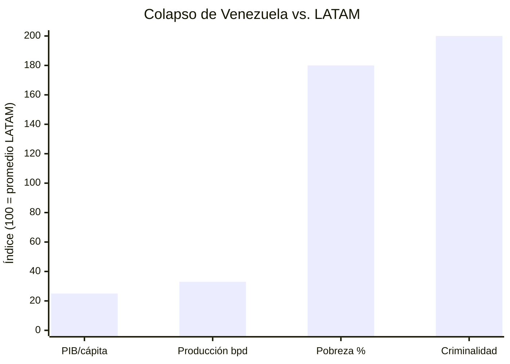
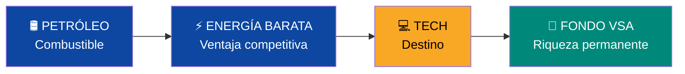
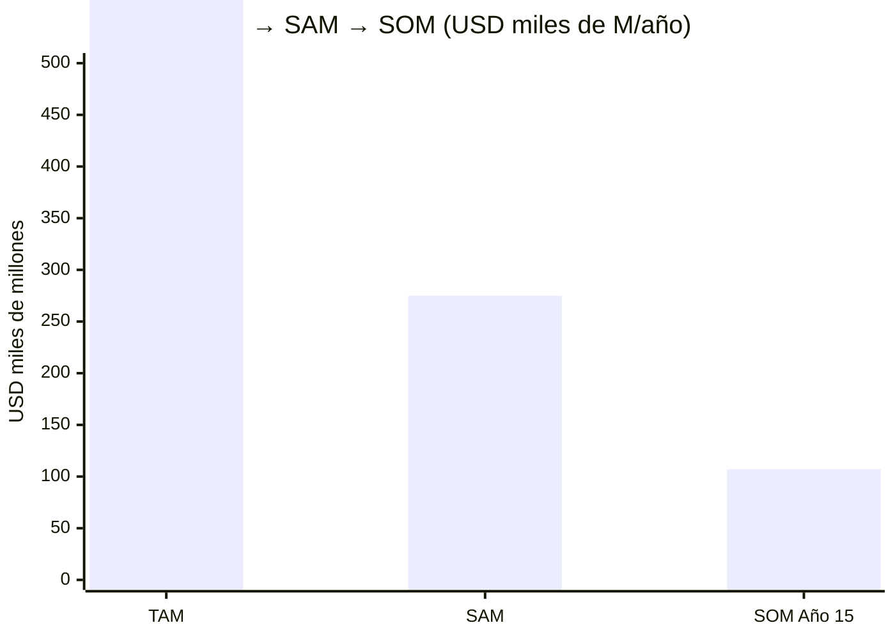
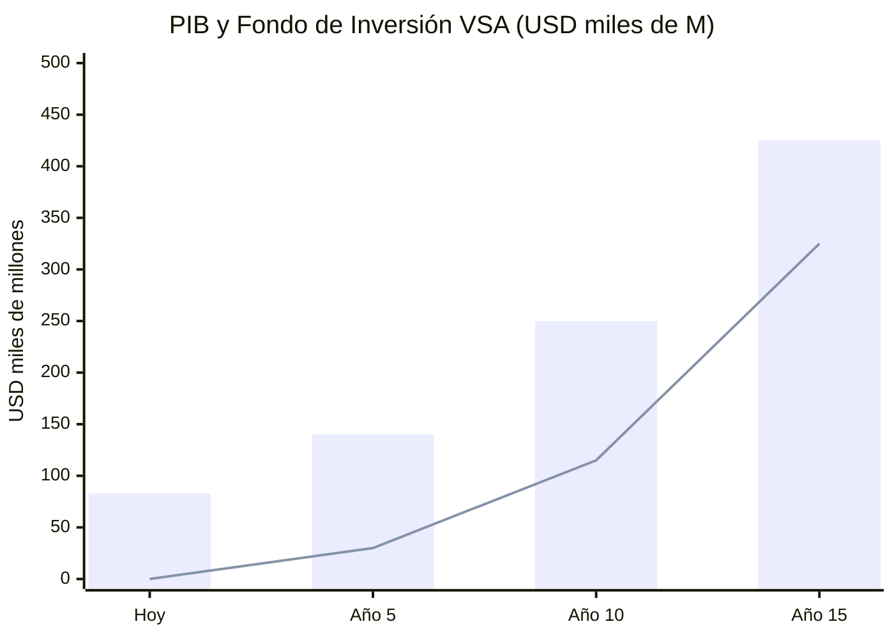

# Pitch Deck — Venezuela S.A.

> 12 slides. Cada slide es un argumento. Todo con datos verificables.

---

## Slide 1: El Problema

- PIB/cápita: **USD 2.588** (LATAM promedio: ~USD 10.000)
- Producción petrolera: **1M bpd** (pico: 3,3M)
- Pobreza: **82,8%** (LATAM promedio: ~29%)
- Criminalidad: **#1 mundial** (Numbeo: 80,7)
- Deuda: **USD 150–170.000 M**
- Diáspora: **7,9M personas** (20% de la población emigró)

**El país con más recursos del continente es el más pobre.**

---

## Slide 2: La Oportunidad

| Recurso | Venezuela | Ranking mundial |
|---------|-----------|----------------|
| Reservas petroleras | 303.000 M barriles | **#1** |
| Gas natural | 5.500 BCM | **#7** |
| Hidroeléctrica | 18.000 MW (Caroní) | Top 10 |
| Tierra cultivable | Llanos + Delta Orinoco | Top de LATAM |
| Diáspora capacitada | 7,9M personas | Mayor de Sudamérica |

**Valor subyacente:** USD 7–10 trillones en activos bajo tierra.
**PIB actual:** USD 83.000 M.
**Gap:** 100x entre potencial y realidad.

---

## Slide 3: La Tesis

> **El petróleo es el combustible. La tecnología es el destino.**

Petróleo genera ingresos → Hidro genera electricidad barata → BigTech viene por la energía (Amazon: $4B en Chile) → Ecosistema tech diversifica economía → Fondo de Inversión VSA convierte recurso finito en riqueza infinita.

---

## Slide 4: El Modelo de Negocio

| Bloque | Venezuela S.A. |
|--------|---------------|
| **Clientes** | 40M ciudadanos + 7,9M diáspora + oil majors + BigTech |
| **Propuesta de valor** | FCV desde nacimiento (retiro 8% + salud 7% + vivienda 4% + educación 2% + cesantía 2% = 23%) + energía barata + voucher educativo (escala con PIB/cápita) + tax-free zones |
| **Ingresos** | Petróleo + impuestos + gas + tech + turismo + fondo |
| **Recursos clave** | 303B bbl + 18GW hidro + 7,9M diáspora + geografía |
| **Ventaja competitiva** | Energía más barata de LATAM + reservas #1 + greenfield tech |

---

## Slide 5: Las Rondas

:::caution Las rondas se activan por KPIs y condiciones, no por calendario
:::

| Ronda | Monto | Fuente | Timeline |
|-------|-------|--------|----------|
| **Pre-Seed** | USD 25–60M | Diáspora (sin gobierno) | Día 1 |
| **Seed** | USD 1–5B | Bonos + forwards | Años 1–2 |
| **Series A** | USD 30–50B | Majors + forwards | Años 2–4 |
| **Series B** | USD 50–100B | Ingresos + BigTech | Años 4–8 |
| **IPO** | USD 10–30B+ | VIN a mercados | Años 8–12 |

**El Pre-Seed NO necesita gobierno.** Si 1% de 7,9M diáspora invierte USD 500 = USD 39,5M. Alcanzable.

---

## Slide 6: Tracción

| Métrica | Estado |
|---------|--------|
| **Licencia 46B de OFAC (14-mar-2026)** | **TODAS las empresas de EE.UU. autorizadas a operar en petróleo + oro + fertilizantes** |
| Chevron operando JV en Venezuela | Activo |
| EE.UU. controlando ventas de petróleo | >USD 1.000 M generados |
| Producción petrolera | >1M bpd (+10% crecimiento) |
| Dragon Field (gas con Trinidad) | Alianza 30 años firmada |
| Plan documentado con 100+ fuentes | Publicado y auditable |
| Evaluado por 21 perspectivas | **Score: 7.4/10** |
| Diáspora | 7,9M listos para participar |

---

## Slide 7: Mercado (TAM/SAM/SOM)

| Nivel | Valor | Incluye |
|-------|-------|---------|
| **TAM** | USD 3.500.000 M/año | Petróleo global + gas + DC LATAM + turismo + agro |
| **SAM** | USD 200–350.000 M/año | 3M bpd + DC LATAM share + Caribe turismo + gas regional |
| **SOM** | USD 80–120.000 M/año | 2,75M bpd + 5% DC + 5M turistas + gas + agro |

---

## Slide 8: Proyecciones Financieras

| Año | PIB | Fondo | Dividendo/persona | Petróleo % export |
|-----|-----|-------|-------------------|-------------------|
| Hoy | USD 83B | USD 0 | USD 0 | 95% |
| 5 | USD 140B | USD 30B | USD 20 | 75% |
| 10 | USD 250B | USD 115B | USD 50 | 45% |
| 15 | USD 425B | USD 325B | USD 162 | <35% |

**Base conservadora: USD 60/barril.** Cada dólar por encima es upside al fondo.

---

## Slide 9: Ventaja Competitiva (Moat)

| Moat | Detalle | Duración |
|------|---------|----------|
| **Reservas #1** | 303.000 M bbl (nadie tiene más) | 50–100 años |
| **Hidro 24/7** | 18 GW Caroní — solar/eólica no compiten en confiabilidad | Permanente |
| **Diáspora 7,9M** | Capital humano + financiero distribuido globalmente | 10–20 años |
| **Greenfield** | Sin legacy tech = construir desde cero (Estonia 1991) | 10 años |
| **Geografía** | Caribe + costa + cercanía cable submarino | Permanente |

---

## Slide 10: El Equipo

| Rol | Perfil necesario |
|-----|-----------------|
| **CEO / Director del Plan** | Líder con experiencia en restructuraciones soberanas o M&A a escala nacional |
| **CFO / Financial Architect** | Expertise en reestructuración de deuda soberana + sovereign wealth funds |
| **CTO / Digital Government** | Experiencia tipo Estonia e-gov o Singapore GovTech |
| **COO / Infrastructure** | Track record en concesiones público-privadas (Chile/Colombia model) |
| **Diaspora Lead** | Acceso a redes venezolanas globales, tech background |
| **Advisors** | Ex-ministros de finanzas de Chile/Georgia/Estonia, oil & gas executives |

:::caution Equipo por construir
Este plan es open source. El equipo se construye con el Pre-Seed. La diáspora tiene el talento — hay venezolanos en Goldman Sachs, Google, McKinsey, Shell. El plan busca reunirlos.
:::

---

## Slide 11: El Ask

| Concepto | Monto |
|----------|-------|
| **Pre-Seed (ahora)** | USD 25–60 M |
| **Uso del Pre-Seed** | App inversión, censo digital, legal, transparencia, matching |
| **Seed (año 1-2)** | USD 1–5.000 M |
| **Total (15 años)** | USD 550–750.000 M |

**Lo que NO necesitamos para empezar:** gobierno, petróleo, permiso de nadie. Solo 79.000 venezolanos invirtiendo USD 500 cada uno.

---

## Slide 12: La Visión

> **Venezuela no es un problema a resolver. Es un negocio a construir.**
>
> **Y cada venezolano es un accionista fundador.**

| Meta Año 15 | Valor |
|-------------|-------|
| PIB | USD 350–500.000 M (top 3 LATAM) |
| PIB/cápita | USD 10.000–14.000 (nivel Chile/Colombia) |
| Fondo soberano | USD 250–400.000 M |
| FCV acumulado (salario mín.) | USD 463.508 a los 65 años (23% de salario × 40 años × 5% compuesto anual. [Cálculo detallado](/04-gobernanza/modelo-estado#anexo-ejemplo--ciclo-de-vida-del-fcv-con-salario-mínimo)) |
| Pensión (salario mín.) | USD 1.408/mes (FCV Retiro + Pilar 1) |
| Ministerios | 10 (hoy: 34). Empleados: 265K (hoy: 2,7M) |
| Petróleo % exportaciones | <35% (hoy: 95%) |
| Tasa homicidios | <5/100K (hoy: ~30-40) |
| Score del plan | 7.4/10 (21 perspectivas — Milei a Piketty + Freddy Vega) |

**Cada venezolano tiene cuenta FCV desde que nace (5 subcuentas, 23% del salario). Cada niño tiene voucher (escala con PIB/cápita). Cada familia elige su colegio y su hospital — acreditación comunitaria vía app, sin burócratas. El Estado financia y supervisa. Venezuela S.A. hace negocios. Los ciudadanos son los dueños. Open banking + fintech desde el Día 1. Todo apoyo es crédito o equity — nada es gratis.**
