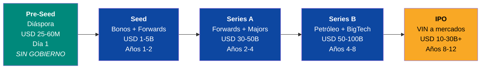
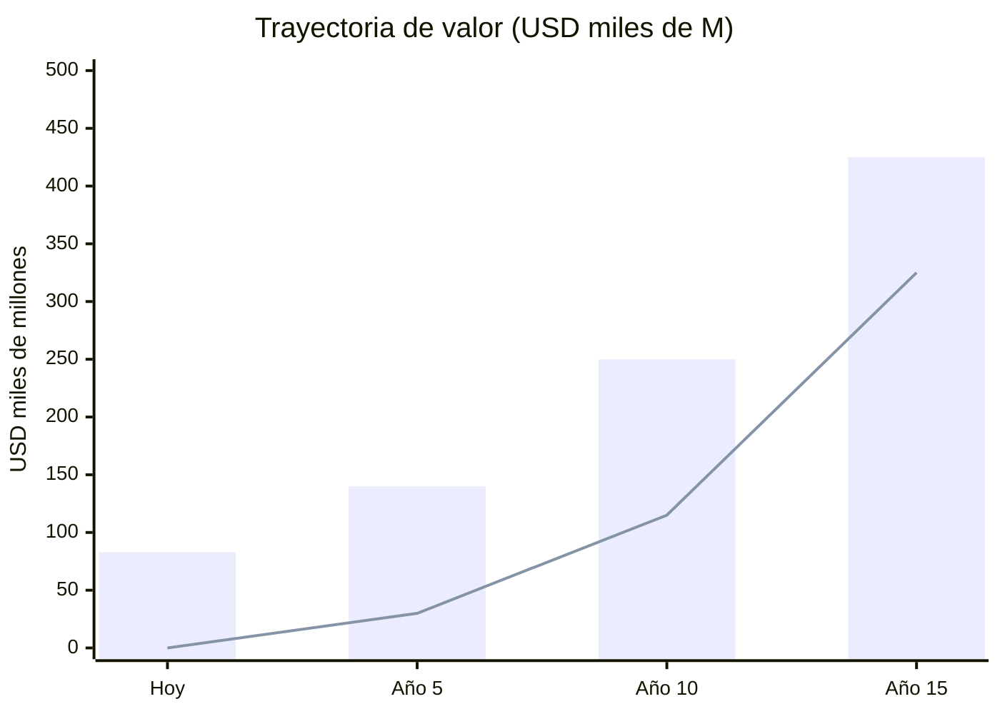

# Resumen Ejecutivo — Venezuela S.A.

> **Una oración:** Un plan de reconstrucción nacional donde 40 millones de venezolanos son accionistas de la transformación de un petroestado colapsado en una potencia tecnológica alimentada por la energía más barata del continente.

---

## El Problema

| Indicador | Dato | Fuente |
|-----------|------|--------|
| PIB nominal | USD 82.800 M (pico: ~USD 480.000 M en 2014) | [FMI](https://www.imf.org) |
| Producción petrolera | 0,9–1,1 M bpd (pico: 3,3 M en 1998) | [OPEP 2025](https://www.opec.org) |
| Deuda externa | USD 150–170.000 M | [Reuters/CNBC](https://www.cnbc.com/2026/01/04/venezuelas-billions-in-distressed-debt-who-is-in-line-to-collect.html) |
| Pobreza | 82,8% | [ENCOVI 2023](https://crisisresponse.iom.int/response/venezuela-bolivarian-republic-crisis-response-plan-2024) |
| Diáspora | 7,9 M personas (20% de la población) | [UNHCR, dic. 2025](https://www.unhcr.org/us/emergencies/venezuela-situation) |
| Criminalidad | #1 mundial (Numbeo Crime Index: 80,7) | [World Population Review](https://worldpopulationreview.com/country-rankings/crime-rate-by-country) |
| Internet | <1 Mbps promedio (LATAM: ~20 Mbps) | [SIGCOMM/Northwestern 2024](https://estcarisimo.github.io/assets/pdf/papers/2024-sigcomm-venezuela.pdf) |

**Venezuela tiene la mayor reserva petrolera del planeta (303.000 M barriles) y 18 GW de potencial hidroeléctrico, pero opera como un estado fallido.**

---

## La Solución

**El petróleo es el combustible. La tecnología es el destino. El FCV es el vehículo.**

El petróleo genera ingresos. La hidroeléctrica genera electricidad barata. BigTech viene por la energía (Amazon: [USD 4.000 M en Chile](https://www.mordorintelligence.com/industry-reports/south-america-data-center-market)). El ecosistema diversifica la economía. El **Fondo Ciudadano Venezuela (FCV)** — cuenta unificada tipo [Singapur CPF](https://www.cpf.gov.sg/) con 4 subcuentas (retiro + salud + vivienda + educación = 21% del salario) — convierte a cada ciudadano en dueño de su futuro. El Estado se reduce a **10 ministerios (265K empleados)** que solo supervisan. La educación funciona con **voucher universal** (sistema de puntos). La salud es universal y contributiva (nadie queda fuera).

---

## Las Rondas de Financiamiento

| Ronda | Fuente | Monto | Uso | Plazo |
|-------|--------|-------|-----|-------|
| **Pre-Seed** | Diáspora (privada) | USD 25–60 M | Plataformas, censo, legal, app | Día 1 (sin gobierno) |
| **Seed** | Bonos + forwards | USD 1–5.000 M | Estabilización + energía | Años 1–2 |
| **Series A** | Forwards + majors | USD 30–50.000 M | Producción 1,4M bpd + Guri | Años 2–4 |
| **Series B** | Ingresos + BigTech | USD 50–100.000 M | Hubs tech, data centers | Años 4–8 |
| **IPO** | VIN a mercados | USD 10–30.000 M+ | Portafolio tech listado | Años 8–12 |

---

## Proyecciones (Base USD 60/barril)

| Indicador | Hoy | Año 5 | Año 10 | Año 15 |
|-----------|-----|-------|--------|--------|
| PIB | USD 83.000 M | 140.000 M | 250.000 M | 425.000 M |
| Producción | 1 M bpd | 1,75 M | 2,25 M | 2,75 M |
| Fondo Soberano | USD 0 | 30.000 M | 115.000 M | 325.000 M |
| Dividendo/persona | USD 0 | USD 20 | USD 50 | USD 162 |
| Petróleo % export | 95% | 75% | 45% | <35% |

---

## Retorno por Tipo de Stakeholder

| Stakeholder | Inversión | Retorno | Horizonte |
|-------------|-----------|---------|-----------|
| **Ciudadano** (40M) | USD 0 (FCV desde nacimiento) | FCV: USD 463K a los 65 (salario mín.) + pensión USD 1.408/mes + casa propia + dividendo | Desde el Día 1 |
| **Diáspora** (7,9M) | USD 10–5.000 (bonos/VIN) | 4–8% anual + dividendo + programa retorno | Año 1→15 |
| **Oil Major** (Chevron, Shell, etc.) | USD 30–50.000 M (JVs) | Acceso a 303.000 M barriles | Año 2→30 |
| **BigTech** (AWS, Google, etc.) | USD 5–10.000 M (data centers) | Energía más barata de LATAM | Año 4→20 |
| **Multilateral** (FMI, BM) | USD 20–40.000 M (préstamos) | Estabilidad regional + repago | Año 2→15 |
| **Gobierno EE.UU.** | Control oil sales → transición | Aliado democrático + energético | Actual→Año 5 |

---

## Ventajas Competitivas (Moat)

| Ventaja | Detalle | Competidores |
|---------|---------|-------------|
| **Reservas petroleras #1** | 303.000 M barriles | Arabia Saudita (258B), Irán (209B) |
| **Hidroeléctrica barata** | 18 GW Caroní, 74% matriz renovable | Chile (solar), Brasil (hidro compartida) |
| **Posición geográfica** | Caribe + cercanía EE.UU. + cable submarino | Colombia, Panamá |
| **Diáspora capacitada** | 7,9M con experiencia en LATAM/EE.UU./Europa | Ningún competidor tiene esto |
| **Greenfield tech** | Sin legacy systems = construir desde cero | Estonia hizo esto en 1991 |
| **Gas natural** | 5.500 BCM (7mo mundial), cero exportaciones | Trinidad y Tobago (capacidad LNG) |

---

## El Ask

| Concepto | Monto |
|----------|-------|
| **Inversión total (15 años)** | USD 550.000–750.000 M |
| **Capital inicial (años 1–3)** | USD 30.000–50.000 M |
| **Pre-Seed (diáspora, día 1)** | USD 25–60 M |

**Lo que se entrega:** Un país transformado donde cada venezolano recibe dividendos de un fondo soberano meta USD 250.000–400.000 M, petróleo baja de 95% a <35% de exportaciones, y la economía se diversifica en 6 motores de crecimiento.

---

## Riesgos Principales

| Riesgo | Probabilidad | Mitigación |
|--------|-------------|------------|
| Precio petróleo <USD 50 | Media | Floor en contratos forward (USD 55) + fondo estabilización |
| Resistencia política | Alta | Pre-Seed arranca SIN gobierno + presión internacional |
| Corrupción | Alta | Modelo Georgia + Singapore CPIB + blockchain + whistleblower |
| Fuga de cerebros continua | Media | Programa retorno "Venezuela Te Espera" + remote work |
| Conflicto armado interno | Media-Baja | DDR (modelo Colombia) + reforma policial (modelo Georgia) |

:::info 85+ fuentes verificables
Cada dato tiene una fuente real con URL. Ver [Referencias Completas](/referencias).
:::
