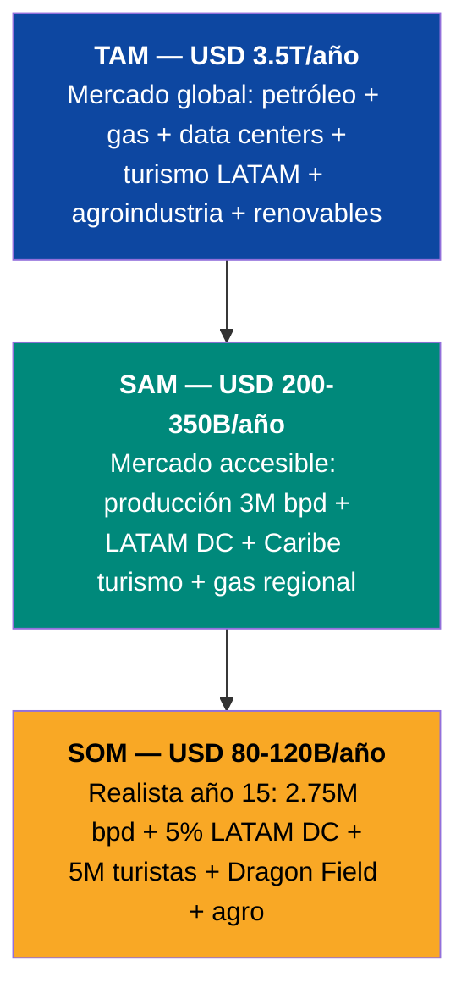
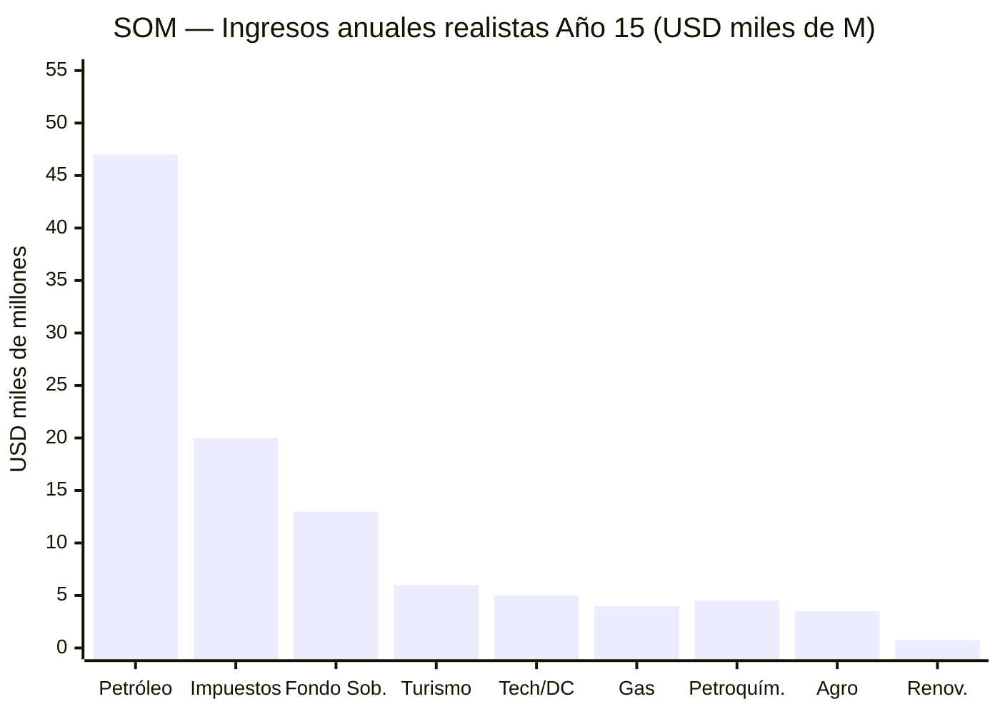
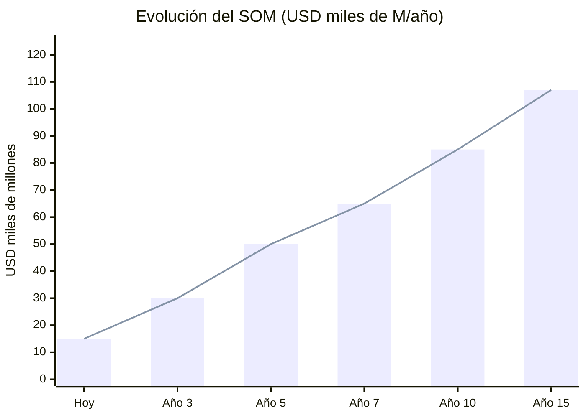

# Mercado Total: TAM / SAM / SOM

> Venezuela S.A. no opera en un solo mercado. Opera en 6 mercados simultáneos, todos habilitados por el mismo recurso: energía barata.

---

## Visión General

---

## TAM — Total Addressable Market

El mercado total al que Venezuela tiene acceso natural por sus recursos.

| Mercado | TAM Global/Regional | Fuente |
|---------|---------------------|--------|
| Petróleo crudo | USD 2.000.000 M/año (~80M bpd × ~$70) | [EIA](https://www.eia.gov/outlooks/steo/) |
| Gas natural (global) | USD 400.000 M/año | [IEA](https://www.iea.org) |
| Data centers LATAM | USD 7.160→14.300 M/año (2024→2030) | [ResearchAndMarkets](https://www.businesswire.com/news/home/20250505397648/en/) |
| Turismo Caribe + LATAM | USD 100.000+ M/año | OMT |
| Agroindustria LATAM | USD 250.000+ M/año | FAO |
| Renovables (exportación eléctrica) | USD 50.000+ M/año (regional) | IRENA |
| **TAM TOTAL** | **~USD 3.500.000 M/año** | — |

---

## SAM — Serviceable Addressable Market

El mercado que Venezuela puede servir con sus recursos, geografía y capacidad instalable en 15 años.

| Mercado | SAM | Supuesto |
|---------|-----|----------|
| Petróleo | USD 60.000–110.000 M/año | 2,5–3M bpd a USD 60–80/bbl |
| Gas natural / LNG | USD 3.000–5.000 M/año | Dragon Field + exportación Colombia |
| Data centers | USD 700–2.000 M/año | 5–15% del mercado LATAM |
| Turismo | USD 4.000–8.000 M/año | 5–10M turistas (nivel Colombia/Costa Rica) |
| Petroquímica | USD 3.000–6.000 M/año | Refinerías rehabilitadas + plantas nuevas |
| Agroindustria | USD 2.000–5.000 M/año | Soberanía alimentaria + exportación Caribe |
| Renovables | USD 500–1.000 M/año | Exportación eléctrica a Colombia/Brasil |
| **SAM TOTAL** | **USD 200.000–350.000 M/año** | — |

---

## SOM — Serviceable Obtainable Market

Lo que es realista capturar al año 15, con ejecución del plan.

| Mercado | SOM Año 15 | % del SAM | Justificación |
|---------|-----------|-----------|---------------|
| Petróleo | USD 40.000–55.000 M | 50–65% | 2,75M bpd (Rystad timeline) |
| Impuestos | USD 15.000–20.000 M | N/A | 15% flat + 12% IVA sobre PIB creciente |
| Fondo soberano (retorno) | USD 10.000–16.000 M | N/A | 4% de USD 250–400.000 M |
| Gas natural | USD 3.000–4.000 M | 70–80% | Dragon Field + Colombia activos |
| Data centers / Tech | USD 3.000–5.000 M | 35–50% | 2–3 ZEET operativas |
| Turismo | USD 4.000–6.000 M | 60–75% | 5–7M turistas con infraestructura |
| Petroquímica | USD 3.000–4.500 M | 60–75% | Refinerías al 60%+ capacidad |
| Agroindustria | USD 2.000–3.500 M | 60–70% | Soberanía parcial + exportación |
| Renovables | USD 500–750 M | 50–75% | Interconexión activa |
| **SOM TOTAL** | **USD 80.000–120.000 M/año** | — | — |

---

## Crecimiento del SOM en el Tiempo

| Periodo | SOM | Driver principal |
|---------|-----|-----------------|
| Hoy | ~USD 15.000 M | Solo petróleo a baja capacidad |
| Año 3 | USD 30.000 M | Brownfield +300K bpd + inicio gas |
| Año 5 | USD 50.000 M | 1,75M bpd + impuestos + turismo incipiente |
| Año 7 | USD 65.000 M | 2M bpd + ZEET operativas + gas Dragon |
| Año 10 | USD 85.000 M | 2,25M bpd + tech ecosistema + fondo rindiendo |
| Año 15 | USD 107.000 M | 2,75M bpd + 6 motores activos + fondo maduro |

---

## Comparación: SOM vs. Países Similares

| País | PIB actual | Población | PIB/cápita |
|------|-----------|-----------|------------|
| Colombia | USD 363.000 M | 52 M | USD 6.981 |
| Chile | USD 335.000 M | 20 M | USD 16.750 |
| Perú | USD 268.000 M | 34 M | USD 7.882 |
| **Venezuela Año 15** | **USD 350–500.000 M** | **35 M** | **USD 10.000–14.286** |
| Venezuela hoy | USD 82.800 M | 32 M | USD 2.588 |

:::tip Venezuela en el top 3 de LATAM
Si el plan se ejecuta, Venezuela pasaría de ser la economía más colapsada de LATAM a estar en el top 3 por PIB y en rango Chile/Colombia por PIB per cápita. No es ciencia ficción — es lo que hacen los recursos + instituciones + capital.
:::
