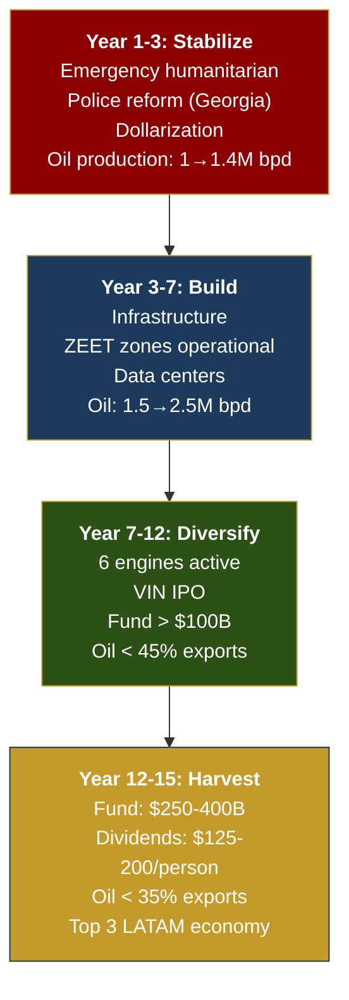

# Y Combinator Application — Venezuela S.A.

> Formato basado en la aplicación estándar de Y Combinator. Adaptado para un modelo de "Startup Nation" donde el producto es un país.

---

## Información Básica

| Campo | Respuesta |
|-------|-----------|
| **Company name** | Venezuela S.A. |
| **URL** | https://venezuela-s-a.github.io/venezuela-sa/ |
| **One-liner** | A national reconstruction platform where 40M Venezuelans are shareholders, turning the world's largest oil reserves into a tech-powered diversified economy. |
| **Category** | GovTech / FinTech / CleanTech / Infrastructure |
| **Stage** | Pre-Seed (diaspora-funded, no government needed) |
| **Location** | Venezuela (diaspora operations globally) |

---

## What does your company do? (50 characters)

**Turn Venezuela's oil into a tech-powered economy.**

---

## Describe what your company does in one paragraph.

Venezuela S.A. treats a nation of 40 million people as a startup. Venezuela sits on the world's largest oil reserves (303 billion barrels) and 18 GW of hydroelectric potential, yet 82.8% of its population lives in poverty. Our plan uses oil revenue as fuel — not as the business — to build the cheapest energy infrastructure in Latin America, attract BigTech data centers, create 5 special economic tech zones (ZEETs), and build a sovereign wealth fund that pays dividends to every citizen. The Pre-Seed round ($25-60M) is funded entirely by the 7.9M Venezuelan diaspora, requires zero government involvement, and builds the digital platforms (investment app, transparency dashboard, talent census) that enable everything else. By year 15, oil drops from 95% to <35% of exports, the sovereign fund reaches $250-400B, and every Venezuelan receives annual dividends.

---

## Who desperately needs this?

**40 million Venezuelans.** 82.8% live in poverty. 7.9M fled the country. Those who stayed have no access to basic services — <1 Mbps internet, collapsed healthcare, $30/month pensions vs. a $400+ basic basket. The country with the world's largest oil reserves has children dying of malnutrition.

But also: **oil majors** need access to 303B barrels with a stable framework. **BigTech** needs cheap 24/7 energy for data centers in LATAM. **The U.S. government** needs a democratic ally that stabilizes the region. Everyone wins — but only if someone builds the platform to coordinate it. That's Venezuela S.A.

---

## Why did you pick this idea to work on?

1. **The numbers demand it.** Venezuela has $7-10 trillion in underground assets (oil + gas + minerals) and a GDP of $83B. That's a 100x value gap between what's in the ground and what the economy produces. No other country on Earth has this ratio.

2. **The diaspora is the unlock.** 7.9M Venezuelans abroad contribute >$10.6B/year to other economies. They are educated, motivated, and have capital. If just 1% (79,000 people) invest $500 average, that's $39.5M — enough for the entire Pre-Seed. No government, no bureaucracy, day one.

3. **Energy is the moat.** Chile attracted $4B from Amazon because of cheap solar. Venezuela has 18 GW of hydroelectric (cleaner, 24/7, cheaper). The LATAM data center market grows from $7.16B to $14.3B by 2030. Venezuela can capture 5-15% of that with the cheapest electricity on the continent.

4. **The timing is now.** The U.S. controls Venezuelan oil sales. Sanctions are shifting. The political transition is underway. The diaspora is ready. The infrastructure exists (Guri Dam, refineries) — it just needs capital and governance.

---

## What's new about what you're making?

**No one has ever treated a country as a startup with actual shareholders.**

| Traditional approach | Venezuela S.A. approach |
|---------------------|------------------------|
| Government plans | Business plan with funding rounds |
| Citizens are beneficiaries | Citizens are shareholders |
| Foreign aid | Forward contracts + JV + investment |
| Promise-based | Data-driven with 85+ verifiable sources |
| Centralized control | Transparent fund (blockchain + dashboard) |
| Petro-dependent | Oil as fuel, tech as destination |

Alaska pays dividends from oil. Norway built a $2.2T sovereign fund. Estonia digitized government. Singapore created a $700B+ SWF. Georgia rebuilt its police in 2 years. Chile built infrastructure through concessions. **We combine all six models into one coherent national business plan.**

---

## Who are your competitors and what do you understand that they don't?

**Direct competitors:** None. No one has packaged national reconstruction as a startup.

**Indirect competitors (traditional approaches):**

| Competitor | What they do | What they miss |
|-----------|-------------|----------------|
| IMF/World Bank programs | Structural adjustment loans | Don't create ownership. Citizens don't benefit directly. Austerity creates backlash. |
| Government plans | Top-down reconstruction | Corruption captures value. No accountability to citizens. Political cycles kill continuity. |
| NGOs | Humanitarian aid | Treat symptoms, not causes. Create dependency, not investment. |
| Oil majors (JVs) | Extract resources | Value leaves the country. No tech diversification. |

**Our insight:** The diaspora is the most underutilized asset. 7.9M people with skills, capital, and motivation — and zero dependency on any government to start mobilizing them. Every other approach starts with "first, we need a functioning government." We start with "first, we need 79,000 people to invest $500 each."

---

## How do you make money?

Venezuela S.A. is not a traditional for-profit company. It's a sovereign wealth vehicle. Revenue comes from:

| Source | Mechanism | Year 15 target |
|--------|-----------|----------------|
| Oil production | 2.75M bpd × $60/bbl net margin | USD 30B+/year |
| Tax revenue | 15% flat income + 12% VAT | USD 20B/year |
| Sovereign fund returns | 4% of $325B fund | USD 13B/year |
| Gas/LNG | Dragon Field + Colombia exports | USD 4B/year |
| Tech zones (ZEET) | Corporate tax + fees | USD 5B/year |
| Tourism | 5-7M visitors/year | USD 6B/year |
| **Total** | | **USD 80-120B/year** |

**Value capture for "shareholders" (citizens):**
- Direct dividends: 10% of fund net income → USD 125-200/person/year
- Universal services: healthcare, pension, education, security
- Economic opportunity: jobs in 6 diversified sectors

---

## How many users/customers do you have?

| Metric | Number | Status |
|--------|--------|--------|
| Potential shareholders | 40M (all Venezuelans) | Target |
| Diaspora (immediate audience) | 7.9M | Ready to mobilize |
| Pre-Seed target participants | 79.000 (1% of diaspora) | Needed |
| Average Pre-Seed investment | USD 500 | |
| Oil major already operating | Chevron (active JV) | In place |
| GitHub stars / contributors | Growing | Live |

---

## What is your burn rate and runway?

| Phase | Cost | Funded by | Runway |
|-------|------|-----------|--------|
| Pre-Seed platforms | USD 25-60M | Diaspora (1% × $500) | 12-18 months |
| Seed (stabilization) | USD 1-5B | Bonds + forwards | 24 months |
| Series A (production) | USD 30-50B | Majors + forwards | 24-36 months |

The Pre-Seed specifically does NOT require government funding or oil revenue. It's entirely diaspora-funded and builds: investment app, digital census, transparency dashboard, legal structure, talent-matching platform, anonymous whistleblower system.

---

## Where do you see your company in 5 years?

**Year 5 milestones:**

| Metric | Target |
|--------|--------|
| Oil production | 1.75M bpd (from 1M today) |
| GDP | USD 120-160B (from $83B) |
| Sovereign fund | USD 20-40B |
| Dividends/person | USD 15-25/year |
| ZEET hubs operational | 2 of 5 |
| Homicide rate | <20/100K (from ~30-40 today) |
| Internet speed | 15 Mbps average (from <1 Mbps) |
| Diaspora returnees | 100K+ |
| Oil as % of exports | 75% (from 95%) |

---

## What is the long-term vision?

**The endgame:** Venezuela becomes a tech-powered, diversified economy where oil is <35% of GDP, every citizen receives dividends from a sovereign fund of $250-400B, the state operates on moderate taxes (not oil), and the country is the cheapest clean energy provider in the Americas. The Guri Dam alone can power more data centers than any other single facility in Latin America.

---

## Why now?

| Factor | Why it enables action now |
|--------|--------------------------|
| U.S. controls Venezuelan oil | Revenue going to controlled accounts creates accountability |
| Political transition underway | Window for institutional reform is open |
| Diaspora at 7.9M peak | Maximum talent + capital abroad, ready to invest/return |
| LATAM data center boom | $7.16B→$14.3B market, and Venezuela has the cheapest energy |
| Oil price at $60-70 | Sweet spot: enough revenue to fund, not enough to create complacency |
| AI revolution | Creates demand for data centers + clean energy at scale |
| Open source plan | 85+ verified sources, transparent, anyone can audit |

---

## TAM (Total Addressable Market)

**USD 3.5 trillion/year** across 6 markets: crude oil ($2T), natural gas ($400B), LATAM data centers ($14.3B by 2030), Caribbean+LATAM tourism ($100B+), agroindustry ($250B+), and renewables ($50B+).

**SOM (Year 15):** USD 80-120B/year — realistic capture with 2.75M bpd, 5% of LATAM data center market, 5-7M tourists, Dragon Field gas, and agro exports.

See [TAM/SAM/SOM](/08-pitch/tam-sam-som) for the full breakdown.

---

## Founder Team

:::caution Equipo por construir
Venezuela S.A. es un plan open source. El equipo fundador se construye con el Pre-Seed. La diáspora tiene el talento necesario en posiciones clave globales.

**Perfiles necesarios:**

| Rol | Perfil | Por qué |
|-----|--------|---------|
| CEO | Experiencia en reestructuraciones soberanas o M&A nacional | Liderazgo a escala país |
| CFO | Deuda soberana + sovereign wealth funds | Estructura financiera del fondo |
| CTO | Estonia e-gov o Singapore GovTech | Estado digital desde cero |
| COO | Concesiones público-privadas (Chile/Colombia) | Infraestructura a escala |
| Diaspora Lead | Redes venezolanas globales + tech | Movilización del Pre-Seed |

**Lo que los fundadores deben haber logrado:** reconstruido algo desde cero, manejado capital a escala, construido tecnología que sirvió a millones, o liderado reformas institucionales.
:::

---

## Tell us about a time you hacked a non-computer system to your advantage.

The entire plan IS the hack. Every other approach to Venezuelan reconstruction starts with "wait for a government." We reverse-engineered the problem:

1. **The hack:** Start with the diaspora (7.9M people with capital), NOT the government
2. **The system:** National reconstruction
3. **The exploit:** You don't need a government to build a citizen investment platform, a transparency dashboard, or a talent census. You need 79,000 people willing to invest $500
4. **The result:** By the time a government exists, the infrastructure to hold it accountable already exists too

It's the same insight as Bitcoin: you don't fix the financial system from within — you build a parallel system that makes the old one obsolete.

---

## 1-Minute Video (Recommended)

:::info Guion recomendado para el video
**0-10s:** "[Nombre], fundador de Venezuela S.A. — un plan open source donde 40 millones de venezolanos son accionistas."

**10-25s:** "Venezuela tiene las mayores reservas de petróleo del planeta y el 82.8% vive en pobreza. Nuestro plan usa el petróleo como combustible para construir una economía tech. La energía hidro más barata del continente atrae a BigTech. El ecosistema diversifica la economía. Y un fondo soberano paga dividendos a cada ciudadano."

**25-45s:** "Ya tenemos Chevron operando, USD 1B+ generados en ventas controladas por EE.UU., el proyecto Dragon Field con Trinidad firmado, y un plan con 85+ fuentes verificables publicado en GitHub."

**45-60s:** "El Pre-Seed de USD 25-60M viene de la diáspora. Sin gobierno. Si el 1% de 7.9 millones invierte USD 500, está listo. Venezuela no es un problema a resolver. Es un negocio a construir."
:::

---

## How did you hear about YC?

This is an open-source national reconstruction plan published on GitHub. We believe Y Combinator's model — build fast, measure, iterate, scale — is exactly what Venezuela needs. Not another government program. A startup with 40 million shareholders.

YC's 2025-2026 "Requests for Startups" includes government/defense tech, climate/energy, and financial infrastructure — Venezuela S.A. sits at the intersection of all three.
