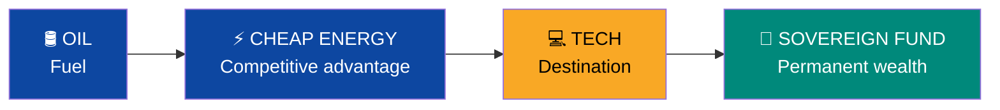
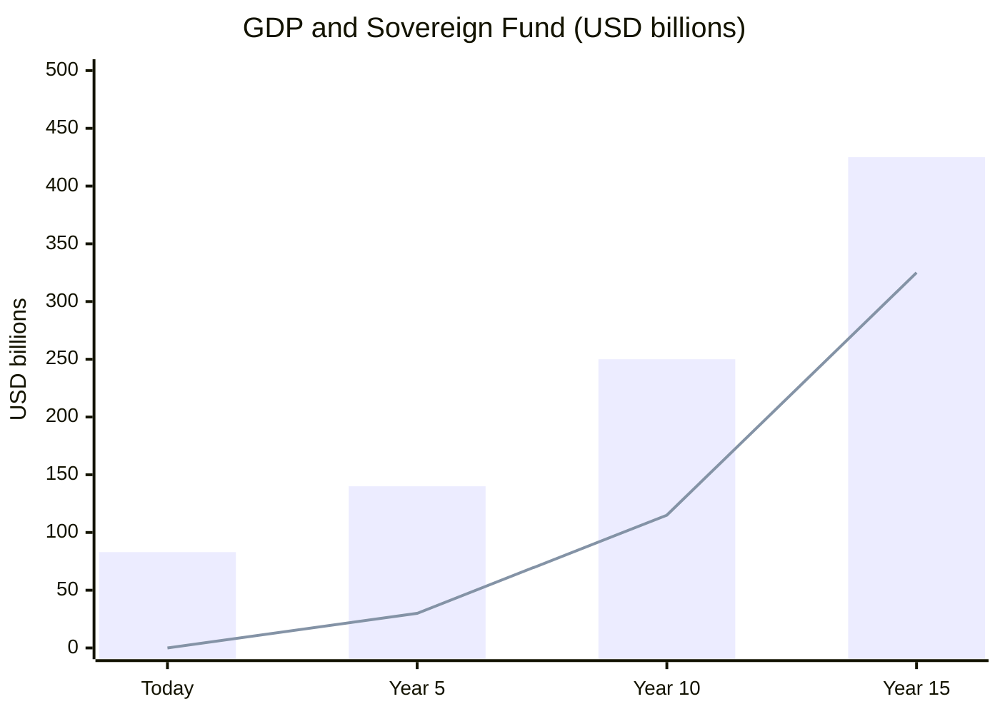

# Pitch Deck — Venezuela S.A.

> 12 slides. Each slide is an argument. All data verifiable.

---

## Slide 1: The Problem

- GDP/capita: **USD 2,588** (LATAM average: ~USD 10,000)
- Oil production: **1M bpd** (peak: 3.3M)
- Poverty: **82.8%** (LATAM average: ~29%)
- Crime: **#1 worldwide** (Numbeo: 80.7)
- Debt: **USD 150–170B**
- Diaspora: **7.9M people** (20% of population emigrated)

**The country with the most resources on the continent is the poorest.**

---

## Slide 2: The Opportunity

| Resource | Venezuela | World Ranking |
|----------|-----------|---------------|
| Oil reserves | 303B barrels | **#1** |
| Natural gas | 5,500 BCM | **#7** |
| Hydroelectric | 18,000 MW (Caroní) | Top 10 |
| Arable land | Llanos + Orinoco Delta | Top in LATAM |
| Skilled diaspora | 7.9M people | Largest in South America |

**Underlying value:** USD 7–10 trillion in underground assets.
**Current GDP:** USD 83B.
**Gap: 100x** between potential and reality.

---

## Slide 3: The Thesis

> **Oil is the fuel. Technology is the destination.**

Oil generates revenue → Hydro generates cheap electricity → BigTech comes for the energy (Amazon: $4B in Chile) → Tech ecosystem diversifies economy → Sovereign fund turns finite resource into infinite wealth.

---

## Slide 4: The Business Model

| Block | Venezuela S.A. |
|-------|---------------|
| **Customers** | 40M citizens + 7.9M diaspora + oil majors + BigTech |
| **Value prop** | Dividends + cheap energy + tax-free zones + return program |
| **Revenue** | Oil + taxes + gas + tech + tourism + fund returns |
| **Value proposition** | Citizen Fund (CFV) from birth (retirement 8% + health 7% + housing 4% + education 2% + severance 2% = 23%) + cheap energy + education voucher (scales with GDP/capita) + tax-free zones |
| **Key resources** | 303B bbl + 18GW hydro + 7.9M diaspora + geography |
| **Moat** | Cheapest energy in LATAM + reserves #1 + greenfield tech + CFV (Singapore CPF model) |

---

## Slide 5: Funding Rounds

:::caution Rounds activate by KPIs, not by calendar
:::

| Round | Amount | Source | Timeline |
|-------|--------|--------|----------|
| **Pre-Seed** | USD 25–60M | Diaspora (no government) | Day 1 |
| **Seed** | USD 1–5B | Bonds + forwards | Years 1–2 |
| **Series A** | USD 30–50B | Majors + forwards | Years 2–4 |
| **Series B** | USD 50–100B | Revenue + BigTech | Years 4–8 |
| **IPO** | USD 10–30B+ | VIN to markets | Years 8–12 |

**Pre-Seed needs NO government.** If 1% of 7.9M diaspora invests USD 500 = USD 39.5M.

---

## Slide 6: Traction

| Metric | Status |
|--------|--------|
| **OFAC License 46B (Mar 14, 2026)** | **ALL US companies authorized: oil + gold + fertilizers** |
| Chevron JV in Venezuela | Active |
| U.S. oil sales control | >USD 1B generated |
| Dragon Field gas (Trinidad) | 30-year alliance signed |
| Documented plan (85+ sources) | Published, auditable |
| Evaluated by 21 perspectives | **Score: 7.4/10** |
| LATAM DC market | USD 7.16B → 14.3B (2030) |
| Diaspora ready | 7.9M people |

---

## Slide 7: Market (TAM/SAM/SOM)

| Level | Value | Includes |
|-------|-------|----------|
| **TAM** | USD 3.5T/year | Global oil + gas + LATAM DC + tourism + agro |
| **SAM** | USD 200–350B/year | 3M bpd + LATAM DC share + Caribbean tourism |
| **SOM** | USD 80–120B/year | 2.75M bpd + 5% DC + 5M tourists + gas + agro |

---

## Slide 8: Financial Projections

| Year | GDP | Fund | Dividend/person | Oil % exports |
|------|-----|------|-----------------|---------------|
| Today | USD 83B | 0 | 0 | 95% |
| 5 | USD 140B | 30B | USD 20 | 75% |
| 10 | USD 250B | 115B | USD 50 | 45% |
| 15 | USD 425B | 325B | USD 162 | <35% |

**Conservative base: USD 60/barrel.** Every dollar above is upside to the fund.

---

## Slide 9: Competitive Moat

| Moat | Detail | Duration |
|------|--------|----------|
| **Reserves #1** | 303B bbl (no one has more) | 50–100 years |
| **24/7 Hydro** | 18 GW Caroní — solar/wind can't match reliability | Permanent |
| **7.9M Diaspora** | Human + financial capital distributed globally | 10–20 years |
| **Greenfield** | No legacy tech = build from scratch (Estonia 1991) | 10 years |
| **Geography** | Caribbean + coast + submarine cable proximity | Permanent |

---

## Slide 10: The Team

| Role | Required Profile |
|------|-----------------|
| **CEO** | Experience in sovereign restructurings or nation-scale M&A |
| **CFO** | Sovereign debt restructuring + wealth fund expertise |
| **CTO** | Estonia e-gov or Singapore GovTech background |
| **COO** | PPP concessions track record (Chile/Colombia model) |
| **Diaspora Lead** | Access to global Venezuelan networks, tech background |
| **Advisors** | Ex-finance ministers from Chile/Georgia/Estonia, O&G executives |

:::caution Team to be built
This plan is open source. The team is built with the Pre-Seed. The diaspora has the talent — Venezuelans at Goldman Sachs, Google, McKinsey, Shell. The plan brings them together.
:::

---

## Slide 11: The Ask

| Concept | Amount |
|---------|--------|
| **Pre-Seed (now)** | USD 25–60M |
| **Pre-Seed use** | Investment app, digital census, legal, transparency, matching |
| **Seed (years 1-2)** | USD 1–5B |
| **Total (15 years)** | USD 550–750B |

**What we DON'T need to start:** government, oil revenue, anyone's permission. Just 79,000 Venezuelans investing USD 500 each.

---

## Slide 12: The Vision

> **Venezuela is not a problem to solve. It's a business to build.**
>
> **And every Venezuelan is a founding shareholder.**

| Year 15 Target | Value |
|----------------|-------|
| GDP | USD 350–500B (top 3 LATAM) |
| GDP/capita | USD 10,000–14,000 (Chile/Colombia range) |
| Sovereign fund | USD 250–400B |
| Oil % of exports | <35% (today: 95%) |
| Dividend/person/year | USD 125–200 |
| CFV (min. wage worker) | USD 463K by age 65 (5 sub-accounts, 23% salary) |
| Homicide rate | <5/100K (today: ~30-40) |
| Internet | 50+ Mbps (today: <1 Mbps) |
| Direct tech jobs | 200,000+ (today: ~0) |
| Plan score | 7.4/10 (21 perspectives — Milei to Piketty + Freddy Vega) |

**Every Venezuelan has a CFV account from birth (5 sub-accounts, 23% of salary). Every child has a voucher (scales with GDP/capita). Every family chooses their school and hospital — community accreditation via app, no bureaucrats. The State funds and supervises. Venezuela S.A. does business. Citizens are the owners. Open banking + fintech from Day 1. All support is credit or equity — nothing is free.**
