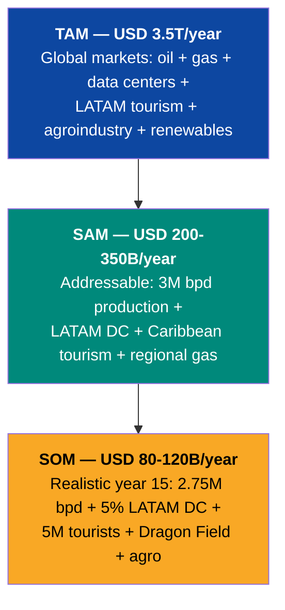
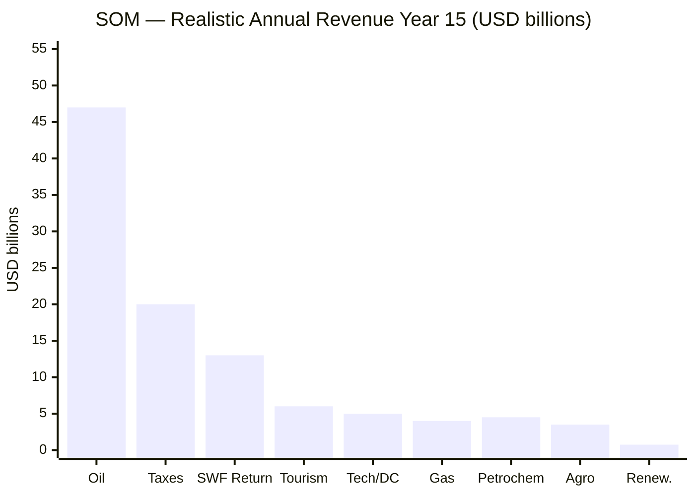
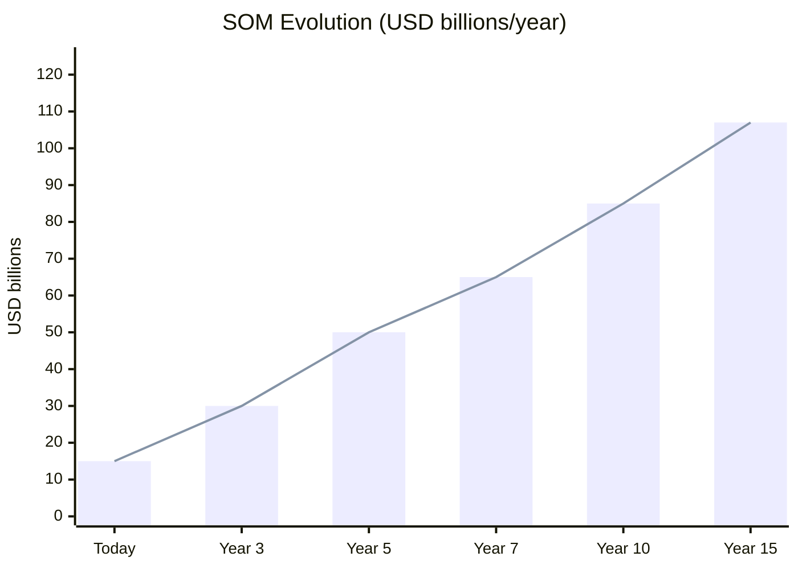

# Total Market: TAM / SAM / SOM

> Venezuela S.A. doesn't operate in a single market. It operates in 6 simultaneous markets, all enabled by the same resource: cheap energy.

---

## Overview

---

## TAM — Total Addressable Market

| Market | Global/Regional TAM | Source |
|--------|---------------------|--------|
| Crude oil | USD 2,000B/year (~80M bpd × ~$70) | [EIA](https://www.eia.gov/outlooks/steo/) |
| Natural gas (global) | USD 400B/year | [IEA](https://www.iea.org) |
| Data centers LATAM | USD 7.16→14.3B/year (2024→2030) | [ResearchAndMarkets](https://www.businesswire.com/news/home/20250505397648/en/) |
| Caribbean + LATAM tourism | USD 100B+/year | UNWTO |
| LATAM agroindustry | USD 250B+/year | FAO |
| Renewables (power export) | USD 50B+/year (regional) | IRENA |
| **TOTAL TAM** | **~USD 3,500B/year** | — |

---

## SAM — Serviceable Addressable Market

| Market | SAM | Assumption |
|--------|-----|------------|
| Oil | USD 60–110B/year | 2.5–3M bpd at USD 60–80/bbl |
| Natural gas / LNG | USD 3–5B/year | Dragon Field + Colombia exports |
| Data centers | USD 0.7–2B/year | 5–15% of LATAM market |
| Tourism | USD 4–8B/year | 5–10M tourists (Colombia/Costa Rica level) |
| Petrochemicals | USD 3–6B/year | Rehabilitated refineries + new plants |
| Agroindustry | USD 2–5B/year | Food sovereignty + Caribbean exports |
| Renewables | USD 0.5–1B/year | Power exports to Colombia/Brazil |
| **TOTAL SAM** | **USD 200–350B/year** | — |

---

## SOM — Serviceable Obtainable Market

What is realistically capturable by year 15 with plan execution.

| Market | Year 15 SOM | % of SAM | Justification |
|--------|------------|----------|---------------|
| Oil | USD 40–55B | 50–65% | 2.75M bpd (Rystad timeline) |
| Taxes | USD 15–20B | N/A | 15% flat + 12% VAT on growing GDP |
| Sovereign fund (return) | USD 10–16B | N/A | 4% of USD 250–400B |
| Natural gas | USD 3–4B | 70–80% | Dragon Field + Colombia active |
| Data centers / Tech | USD 3–5B | 35–50% | 2–3 ZEET zones operational |
| Tourism | USD 4–6B | 60–75% | 5–7M tourists with infrastructure |
| Petrochemicals | USD 3–4.5B | 60–75% | Refineries at 60%+ capacity |
| Agroindustry | USD 2–3.5B | 60–70% | Partial sovereignty + exports |
| Renewables | USD 0.5–0.75B | 50–75% | Active interconnection |
| **TOTAL SOM** | **USD 80–120B/year** | — | — |

---

## SOM Growth Over Time

| Period | SOM | Primary Driver |
|--------|-----|----------------|
| Today | ~USD 15B | Oil only at low capacity |
| Year 3 | USD 30B | Brownfield +300K bpd + gas start |
| Year 5 | USD 50B | 1.75M bpd + taxes + early tourism |
| Year 7 | USD 65B | 2M bpd + ZEET operational + Dragon gas |
| Year 10 | USD 85B | 2.25M bpd + tech ecosystem + fund returning |
| Year 15 | USD 107B | 2.75M bpd + 6 engines active + mature fund |

---

## Benchmark: SOM vs. Comparable Countries

| Country | Current GDP | Population | GDP/Capita |
|---------|-----------|------------|------------|
| Colombia | USD 363B | 52M | USD 6,981 |
| Chile | USD 335B | 20M | USD 16,750 |
| Peru | USD 268B | 34M | USD 7,882 |
| **Venezuela Year 15** | **USD 350–500B** | **35M** | **USD 10,000–14,286** |
| Venezuela today | USD 82.8B | 32M | USD 2,588 |

:::tip Top 3 LATAM economy
If the plan executes, Venezuela moves from LATAM's most collapsed economy to a top-3 GDP and Chile/Colombia-range GDP per capita. This isn't science fiction — it's what resources + institutions + capital produce.
:::
