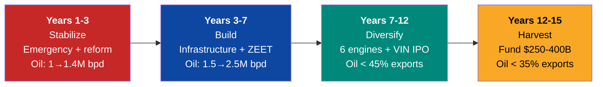

# Y Combinator Application — Venezuela S.A.

> Based on the standard Y Combinator application format.

---

## Basic Info

| Field | Answer |
|-------|--------|
| **Company name** | Venezuela S.A. |
| **URL** | https://venezuela-s-a.github.io/venezuela-sa/ |
| **One-liner** | A national reconstruction platform where 40M Venezuelans are shareholders, turning the world's largest oil reserves into a tech-powered diversified economy. |
| **Category** | GovTech / FinTech / CleanTech / Infrastructure |
| **Stage** | Pre-Seed (diaspora-funded, no government needed) |

---

## Describe what your company does in 50 characters.

**Turn Venezuela's oil into a tech-powered economy.**

---

## What does your company do? (One paragraph)

Venezuela S.A. treats a nation of 40 million people as a startup. Venezuela sits on the world's largest oil reserves (303 billion barrels) and 18 GW of hydroelectric potential, yet 82.8% of its population lives in poverty. Our plan uses oil revenue as fuel — not as the business — to build the cheapest energy infrastructure in Latin America, attract BigTech data centers, create 5 special economic tech zones, and build a sovereign wealth fund that pays dividends to every citizen. The Pre-Seed round ($25-60M) is funded entirely by the 7.9M Venezuelan diaspora, requires zero government involvement, and builds the digital platforms that enable everything else. By year 15, oil drops from 95% to <35% of exports, the sovereign fund reaches $250-400B, and every Venezuelan receives annual dividends.

---

## Who desperately needs this?

**40 million Venezuelans.** 82.8% live in poverty. 7.9M fled the country. Those who stayed have no access to basic services — <1 Mbps internet, collapsed healthcare, $30/month pensions vs. a $400+ basic basket. The country with the world's largest oil reserves has children dying of malnutrition.

But also: **oil majors** need access to 303B barrels with a stable framework. **BigTech** needs cheap 24/7 energy for data centers in LATAM. **The U.S. government** needs a democratic ally that stabilizes the region. Everyone wins — but only if someone builds the platform to coordinate it.

---

## Why did you pick this idea?

1. **The numbers demand it.** Venezuela has $7-10 trillion in underground assets and a GDP of $83B. That's a 100x gap between what's underground and what the economy produces.

2. **The diaspora is the unlock.** 7.9M Venezuelans abroad contribute >$10.6B/year to other economies. If just 1% (79,000 people) invest $500 average, that's $39.5M — enough for the entire Pre-Seed. No government needed.

3. **Energy is the moat.** Chile attracted $4B from Amazon for cheap solar. Venezuela has 18 GW hydroelectric (cleaner, 24/7, cheaper). The LATAM data center market grows to $14.3B by 2030.

4. **The timing is now.** U.S. controls Venezuelan oil sales. Political transition underway. Diaspora ready. Infrastructure exists (Guri Dam, refineries) — just needs capital and governance.

---

## What's new about what you're making?

**No one has ever treated a country as a startup with actual shareholders.**

| Traditional approach | Venezuela S.A. |
|---------------------|----------------|
| Government plans | Business plan with funding rounds |
| Citizens are beneficiaries | Citizens are shareholders |
| Foreign aid | Forward contracts + JVs + investment |
| Promise-based | Data-driven (85+ verifiable sources) |
| Centralized control | Blockchain transparency |
| Petro-dependent | Oil is fuel, tech is destination |

Alaska pays dividends from oil. Norway built a $2.2T fund. Estonia digitized government. Singapore created a $700B+ SWF. Georgia rebuilt police in 2 years. Chile built infrastructure through concessions. **We combine all six into one national business plan.**

---

## Who are your competitors?

**Direct:** None. No one has packaged national reconstruction as a startup.

| Indirect competitor | What they miss |
|--------------------|----------------|
| IMF/World Bank programs | Don't create ownership. Austerity backlash. |
| Government plans | Corruption captures value. Political cycles kill continuity. |
| NGOs | Treat symptoms, not causes. Create dependency. |
| Oil majors (standalone JVs) | Value leaves the country. No diversification. |

**Our insight:** The diaspora is the most underutilized asset. Every other approach starts with "first, we need a functioning government." We start with "first, we need 79,000 people to invest $500 each."

---

## How do you make money?

| Source | Mechanism | Year 15 target |
|--------|-----------|----------------|
| Oil production | 2.75M bpd × $60/bbl net margin | USD 30B+/year |
| Tax revenue | 15% flat income + 12% VAT | USD 20B/year |
| Sovereign fund returns | 4% of $325B fund | USD 13B/year |
| Gas/LNG | Dragon Field + Colombia | USD 4B/year |
| Tech zones (ZEET) | Corporate tax + fees | USD 5B/year |
| Tourism | 5-7M visitors/year | USD 6B/year |
| **Total** | | **USD 80-120B/year** |

---

## Traction

| Metric | Status |
|--------|--------|
| **OFAC License 46B (Mar 14, 2026)** | **ALL US companies authorized: oil + gold + fertilizers** |
| Chevron operating JV in Venezuela | Active |
| U.S. controlling oil sales | >USD 1B generated |
| Dragon Field gas (Trinidad) | 30-year alliance signed |
| Plan documented with 85+ sources | Published and auditable |
| Evaluated by 21 perspectives | **Score: 7.4/10** |
| LATAM data center market | $7.16B → $14.3B (2030) |
| Diaspora | 7.9M ready to participate |
| Open source on GitHub | Live |

---

## Where do you see the company in 5 years?

| Metric | Year 5 Target |
|--------|--------------|
| Oil production | 1.75M bpd (from 1M) |
| GDP | USD 120-160B (from $83B) |
| Sovereign fund | USD 20-40B |
| Dividends/person | USD 15-25/year |
| ZEET hubs operational | 2 of 5 |
| Homicide rate | <20/100K (from ~30-40) |
| Internet speed | 15 Mbps (from <1 Mbps) |
| Diaspora returnees | 100K+ |
| Oil % of exports | 75% (from 95%) |

---

## Long-term vision

**Endgame:** Venezuela becomes a tech-powered, diversified economy. Oil <35% of GDP. Every citizen receives dividends from a $250-400B sovereign fund. The state operates on moderate taxes, not oil. The country is the cheapest clean energy provider in the Americas.

---

## Why now?

| Factor | Why it enables action |
|--------|---------------------|
| U.S. controls oil sales | Revenue in controlled accounts = accountability |
| Political transition | Window for institutional reform is open |
| Diaspora at 7.9M peak | Maximum talent + capital abroad |
| LATAM data center boom | $14.3B market, Venezuela has cheapest energy |
| Oil at $60-70 | Enough to fund, not enough for complacency |
| AI revolution | Massive demand for data centers + clean energy |
| Open source plan | 85+ sources, transparent, auditable |

---

## TAM (Total Addressable Market)

**USD 3.5 trillion/year** across 6 markets: crude oil ($2T), natural gas ($400B), LATAM data centers ($14.3B by 2030), Caribbean+LATAM tourism ($100B+), agroindustry ($250B+), and renewables ($50B+).

**SOM (Year 15):** USD 80-120B/year with 2.75M bpd, 5% of LATAM data center market, 5-7M tourists, Dragon Field gas, and agro exports.

See [TAM/SAM/SOM](/09-investors/tam-sam-som) for the full breakdown.

---

## Founder Team

:::caution Team to be built
Venezuela S.A. is an open-source plan. The founding team is built with the Pre-Seed. The diaspora has the talent in key global positions.

| Role | Profile | Why |
|------|---------|-----|
| CEO | Sovereign restructuring or nation-scale M&A | Country-scale leadership |
| CFO | Sovereign debt + wealth fund expertise | Fund financial architecture |
| CTO | Estonia e-gov or Singapore GovTech | Digital state from scratch |
| COO | PPP concessions (Chile/Colombia model) | Infrastructure at scale |
| Diaspora Lead | Global Venezuelan networks + tech | Pre-Seed mobilization |

**What founders should have achieved:** rebuilt something from zero, managed capital at scale, built technology serving millions, or led institutional reform.
:::

---

## Tell us about a time you hacked a non-computer system to your advantage.

The entire plan IS the hack. Every other approach to Venezuelan reconstruction starts with "wait for a government." We reverse-engineered the problem:

1. **The hack:** Start with the diaspora (7.9M people with capital), NOT the government
2. **The system:** National reconstruction
3. **The exploit:** You don't need a government to build a citizen investment platform, a transparency dashboard, or a talent census. You need 79,000 people willing to invest $500
4. **The result:** By the time a government exists, the infrastructure to hold it accountable already exists too

Same insight as Bitcoin: don't fix the system from within — build a parallel system that makes the old one obsolete.

---

## 1-Minute Video (Recommended)

:::info Recommended video script
**0-10s:** "[Name], founder of Venezuela S.A. — an open-source plan where 40 million Venezuelans are shareholders."

**10-25s:** "Venezuela has the world's largest oil reserves and 82.8% poverty. Our plan uses oil as fuel to build a tech economy. The cheapest hydroelectric energy in the Americas attracts BigTech. The ecosystem diversifies the economy. A sovereign fund pays dividends to every citizen."

**25-45s:** "We already have Chevron operating, $1B+ generated in U.S.-controlled oil sales, Dragon Field gas with Trinidad signed, and a plan with 85+ verifiable sources published on GitHub."

**45-60s:** "The Pre-Seed of $25-60M comes from the diaspora. No government needed. If 1% of 7.9 million invest $500, it's done. Venezuela is not a problem to solve. It's a business to build."
:::

---

## How did you hear about YC?

This is an open-source national reconstruction plan published on GitHub. We believe Y Combinator's model — build fast, measure, iterate, scale — is exactly what Venezuela needs. Not another government program. A startup with 40 million shareholders.

YC's 2025-2026 "Requests for Startups" includes government/defense tech, climate/energy, and financial infrastructure — Venezuela S.A. sits at the intersection of all three.
