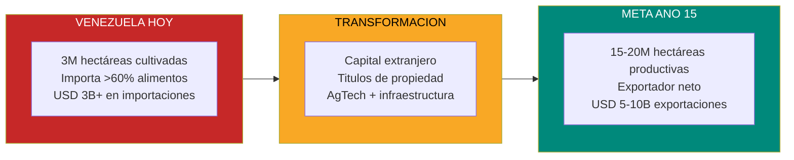
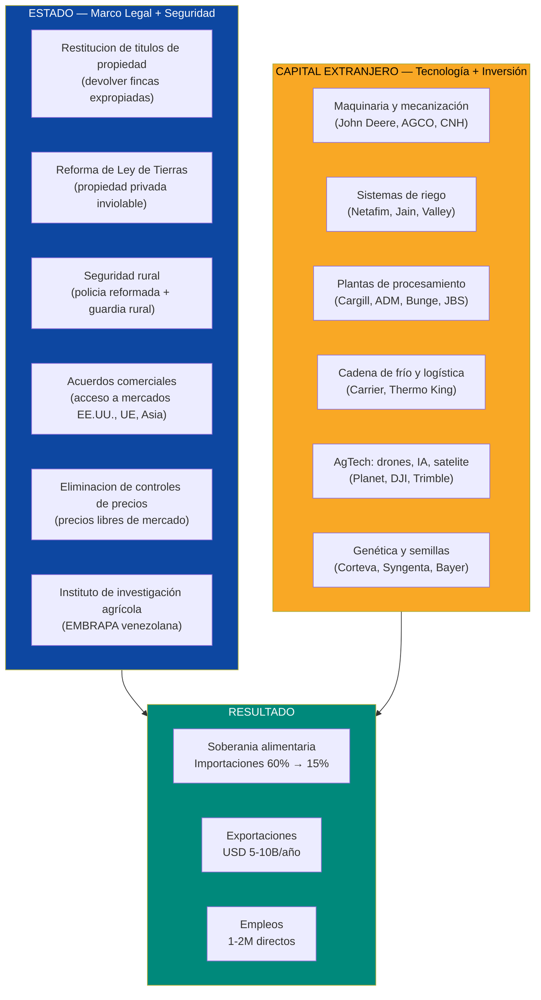
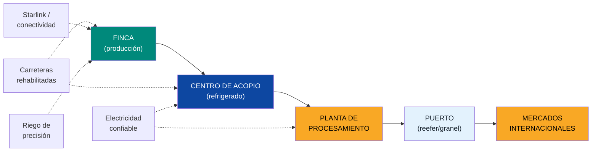
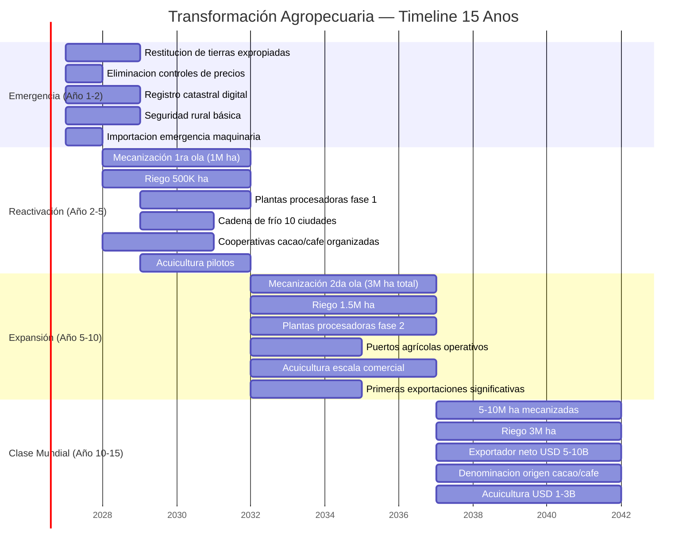
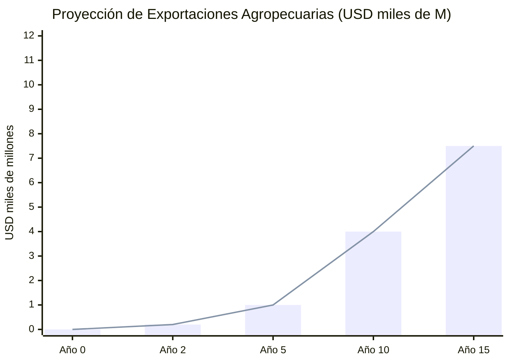

# Agro y Ganadería: De Importar el 70% a Exportar USD 5-10B

> Venezuela tiene **~30M de hectáreas agrícolas** de las cuales solo **~3M están cultivadas**. Importa **USD 3B+/año en alimentos** que podría producir localmente. Tiene los Llanos (la llanura fértil más grande del norte de Sudamérica), agua infinita (Orinoco), electricidad barata (Guri) y el mejor cacao del mundo. Brasil pasó de importador de alimentos a **3er exportador mundial** con EMBRAPA. Venezuela puede hacerlo en 15 años con tecnología, capital extranjero y títulos de propiedad.

---

## 1. La Oportunidad: 27M de Hectáreas Ociosas

:::danger El dato que define todo
Venezuela tiene **~30M de hectáreas aptas para agricultura y ganadería**. Solo **~3M están bajo cultivo activo**. Eso es un **90% de capacidad ociosa**. Mientras tanto, importa **USD 3B+/año en alimentos** ([USDA FAS, 2025](https://www.fas.usda.gov/data/venezuela-venezuela-agricultural-imports-grow-9-percent-2024-united-states-among-leading)) y **5,1M de personas necesitan asistencia alimentaria** ([WFP](https://www.wfp.org/emergencies/venezuela-emergency)). Es como tener una fábrica de USD 10B cerrada con candado mientras compras el producto a tu competidor.
:::

| Dato | Cifra | Fuente |
|------|-------|--------|
| Tierra agrícola total | **~30M hectáreas** (215.000 km2) | [Banco Mundial](https://data.worldbank.org/indicator/AG.LND.ARBL.ZS?locations=VE) |
| Tierra arable (cultivable) | **~2,6M hectáreas** bajo cultivo | [Banco Mundial, 2023](https://tradingeconomics.com/venezuela/arable-land-hectares-wb-data.html) |
| Tierra apta para pastoreo | **~17M hectáreas** | Encuesta gubernamental 1997 |
| Importacion de alimentos (2024) | **USD 3.000M** (+9% vs 2023) | [USDA FAS, 2025](https://www.fas.usda.gov/data/venezuela-venezuela-agricultural-imports-grow-9-percent-2024-united-states-among-leading) |
| Dependencia de importaciones | **>60%** de disponibilidad alimentaria | [USDA FAS, 2023](https://www.fas.usda.gov/regions/venezuela) |
| Personas con inseguridad alimentaria | **5,1M** | [WFP](https://www.wfp.org/emergencies/venezuela-emergency) |
| PIB agrícola como % del PIB total | **~5%** (vs 30%+ potencial) | [Banco Mundial](https://data.worldbank.org/) |
| Hato ganadero estimado | **~12M cabezas** | [USDA FAS, 2025](https://www.fas.usda.gov/data/venezuela-livestock-and-products-annual-6) |

### El precedente: Brasil y EMBRAPA

Brasil era **importador neto de alimentos** en los años 60. Creó EMBRAPA en 1972, invirtió en I+D tropical, abrió el Cerrado (sabana acida, similar a los Llanos) y en 40 años pasó a ser el **3er exportador mundial de alimentos**. En 2024 exportó **USD 164.400M en productos agrícolas** — un record histórico ([Brazilian Sugar Exporters](https://www.braziliansugarexporters.com/post/brazil-agricultural-exports)).

**La diferencia con Venezuela:** Brasil tardó 40 años porque tuvo que desarrollar la ciencia tropical desde cero. Hoy esa ciencia existe. Drones, IA, riego de precisión, genética adaptada al trópico — todo esta disponible. Venezuela no necesita 40 años. Con capital, tecnología y propiedad de la tierra, puede lograr soberanía alimentaria en **10 años** y ser exportador neto en **15**.

---

## 2. El Problema Actual: Por Que un Pais Fertil Importa Comida

Venezuela fue autosuficiente en muchos rubros antes de 1970. Hoy es uno de los mayores importadores de alimentos per capita de LATAM. No es un problema de tierra ni de clima — es un problema de política, propiedad y abandono.

| Obstáculo | Severidad | Descripción |
|-----------|-----------|-------------|
| **Expropiaciones masivas** | CRITICO | El gobierno expropió **>5M de hectáreas** de tierra productiva bajo la Ley de Tierras (2001) y Mision Zamora. La productividad colapsó en las tierras expropiadas — sin riego, sin asistencia técnica, sin crédito ([NPR, 2009](https://www.npr.org/2009/07/15/106620230/in-venezuela-land-redistribution-program-backfires)) |
| **Cero derechos de propiedad** | CRÍTICO | Venezuela tiene los **peores derechos de propiedad del mundo** según el International Property Rights Index. Sin título, no hay crédito. Sin crédito, no hay inversión. Sin inversión, no hay producción ([Property Rights Alliance](https://propertyrightsalliance.org/news/how-weak-property-rights-contribute-to-venezuelas-crisis/)) |
| **Invasiones criminales de fincas** | CRITICO | Bandas criminales queman fincas, destruyen equipos y matan ganado para expulsar a ganaderos de sus tierras. La producción de carne cayó **13% en 2025** ([USDA FAS, 2025](https://www.fas.usda.gov/data/venezuela-livestock-and-products-annual-6)) |
| **Cero mecanización** | ALTO | Parque de maquinaria destruido. No hay tractores, cosechadoras, ni sistemas de riego funcionales a escala |
| **Cadena de frío rota** | ALTO | Sin electricidad confiable (ver [Capacidad Eléctrica](./capacidad-electrica)), no hay cadena de frío. Se pierden 30-40% de los alimentos post-cosecha |
| **Sin crédito agrícola** | ALTO | Sistema financiero colapsado. Tasas de interés reales negativas. Ningún banco presta a un agricultor sin titulo |
| **Sin insumos** | ALTO | Semillas certificadas, fertilizantes, agroquímicos — todo importado, escaso y caro. Controles de precios destruyeron la cadena de distribución |
| **Infraestructura vial destruida** | ALTO | Carreteras a zonas agrícolas en estado deplorable. Costo de transporte duplica o triplica el de países vecinos (ver [Infraestructura](/06-realidad/infraestructura-basica)) |
| **Controles de precios** | MEDIO | Precios de alimentos regulados por debajo del costo de producción durante decadas. Resultado: no se produce, se importa |
| **Fuga de talento rural** | MEDIO | Agronomos, veterinarios, técnicos agrícolas — emigraron. Sin capital humano especializado |

:::caution La paradoja venezolana
Un pais con mas tierra cultivable que Colombia, mas agua dulce que Chile y mejor clima que Argentina... importa >60% de sus alimentos. No es un problema de recursos. Es un problema de **instituciones destruidas**. La tierra esta ahi. El agua esta ahi. Lo que falta es propiedad privada, seguridad jurídica y capital.
:::

---

## 3. La Solución: Estado Regula + Venezuela S.A. Invierte + Capital Extranjero Opera

La formula es clara: el Estado pone el **marco legal y la seguridad**. Venezuela S.A. aporta **tierra y permisos como equity** en los JVs agroindustriales. El capital extranjero pone la **tecnología, maquinaria e inversión**. Todo en paralelo — no secuencial.

### Lo que hace el Estado (costo: bajo, impacto: transformaciónal)

| Acción | Timeline | Costo | Impacto |
|--------|----------|-------|---------|
| **Restitucion de tierras expropiadas** | Meses 1-24 | USD 0 (devolución) | Restaura confianza de inversores y productores. Signal mas fuerte posible |
| **Reforma de Ley de Tierras** | Meses 1-12 | Legislativo | Propiedad privada plena, registro catastral digital, eliminación de "tierras ociosas" como causal de expropiación |
| **Registro catastral digital** | Meses 6-36 | USD 200-500M | Blockchain para titulos (modelo Georgia/Estonia). Sin titulo digital no hay crédito ni inversión |
| **Eliminacion de controles de precios** | Dia 1 | USD 0 | Precios libres = incentivo a producir |
| **Policia rural reformada** | Meses 6-24 | USD 100-300M | Seguridad en fincas. Sin seguridad, cero inversión rural |
| **Acuerdos fitosanitarios** | Meses 12-36 | Diplomatico | Acceso a mercados EE.UU. (USDA/APHIS), UE, Asia |
| **Instituto EMBRAPA Venezuela** | Año 1-3 | USD 50-200M | I+D tropical adaptado: suelos, semillas, plagas, prácticas |

### Lo que hace el capital privado (USD 10-20B en 15 años)

| Inversión | Monto | Timeline | Proveedores potenciales |
|-----------|-------|----------|------------------------|
| Mecanización (tractores, cosechadoras, equipos) | USD 2-4B | Años 1-10 | John Deere, AGCO, CNH Industrial, Kubota |
| Riego y agua | USD 1-3B | Años 2-10 | Netafim (Israel), Jain Irrigation, Valley |
| Plantas de procesamiento agroindustrial | USD 2-4B | Años 3-10 | Cargill, ADM, Bunge, Louis Dreyfus |
| Cadena de frío y logística | USD 1-2B | Años 2-8 | Carrier, Thermo King, DHL Cold Chain |
| Fertilizantes y agroquímicos (plantas locales) | USD 1-2B | Años 3-10 | Yara, Nutrien, Mosaic |
| AgTech y precisión agriculture | USD 500M-1B | Años 1-10 | Trimble, Planet Labs, DJI, Climate Corp |
| Genética animal y vegetal | USD 500M-1B | Años 1-10 | Corteva, Syngenta, Bayer, ABS Global |
| Infraestructura portuaria agrícola | USD 500M-1B | Años 3-8 | DP World, APM Terminals |
| **TOTAL** | **USD 10-20B** | **15 años** | |

---

## 4. Sub-Oportunidades: 7 Verticales de Inversión

### 4.1 Ganaderia Bovina — Los Llanos

> Los Llanos: **300.000 km2** de llanura (mas grande que Italia), con pasto natural, agua del Orinoco y tradicion ganadera centenaria. Hoy tiene **~12M de cabezas**. Con inversión, puede llegar a **18-25M**.

| Dato | Actual | Meta (Año 15) | Fuente |
|------|--------|----------------|--------|
| Hato ganadero | ~12M cabezas | 18-25M cabezas | [USDA FAS, 2025](https://www.fas.usda.gov/data/venezuela-livestock-and-products-annual-6) |
| Producción de carne | 267.000 TM/año | 800.000-1.200.000 TM/año | USDA FAS |
| Producción de leche | ~2.000M litros/año | 5.000-7.000M litros/año | [Requiere investigación] |
| Exportaciones de carne | ~USD 0 | USD 1.000-2.000M/año | Proyección propia |
| Empleos directos | ~200.000 | 400.000-600.000 | Proyección propia |

**El modelo:** Joint ventures con **JBS** (Brasil, #1 mundial en carne), **Minerva Foods**, **Marfrig** + ganaderos locales. Capital extranjero pone genética (Brahman, Nelore, Angus adaptado), manejo rotacional, feedlots modernos, frigorificos con certificación para exportación. Ganaderos locales ponen tierra, conocimiento local y mano de obra.

**Mercados objetivo:** EE.UU. (si se levantan sanciones), Colombia, Caribe, Medio Oriente (halal).

**Cadena de valor completa:**

| Segmento | Ingreso potencial | Inversión requerida |
|----------|-------------------|---------------------|
| Carne (cortes premium + commodity) | USD 1.000-2.000M/año | USD 2-3B (frigorificos, feedlots, genética) |
| Lacteos (queso, yogurt, leche en polvo) | USD 500-800M/año | USD 500M-1B (plantas procesadoras) |
| Cuero (industria, moda, exportación) | USD 200-400M/año | USD 200-500M (curtiembres) |
| **Total ganadería** | **USD 1.700-3.200M/año** | **USD 3-5B** |

---

### 4.2 Granos — Maiz, Arroz, Sorgo, Soya

> Venezuela produce **~1,36M TM de maiz** en **350.000 hectáreas** ([USDA FAS, 2025](https://ipad.fas.usda.gov/countrysummary/Default.aspx?id=VE)). Con 3-5M de hectáreas mecanizadas y agricultura de precisión, puede multiplicar producción por 5-8x.

| Cultivo | Producción actual | Meta (Año 10) | Hectáreas necesarias | Modelo |
|---------|-------------------|---------------|----------------------|--------|
| **Maiz** | ~1,36M TM | 5-7M TM | 1-1,5M ha | Argentina/Brasil |
| **Arroz** | ~600.000 TM | 2-3M TM | 400-600K ha | Colombia/Guyana |
| **Sorgo** | ~200.000 TM | 1-2M TM | 300-500K ha | EE.UU./Argentina |
| **Soya** | ~0 (prácticamente) | 2-4M TM | 500K-1M ha | Brasil (Cerrado → Llanos) |

**Inversión requerida:** USD 2-4B (mecanización masiva, riego, silos, centros de acopio, plantas de procesamiento).

**El pitch:** Cada millon de TM de maiz que Venezuela produzca localmente ahorra **~USD 200-250M en importaciones**. Pasar de 1,36M a 5M TM ahorra **USD 700M-1B/año** solo en maiz. Agregar soya abre el mercado de alimento para ganado y aceite vegetal.

:::tip Precision agriculture: el multiplicador
La diferencia entre agricultura venezolana actual (rendimiento ~3,5 TM/ha en maiz) y la de Brasil (rendimiento ~6 TM/ha) es **tecnología**: riego, semillas mejoradas, fertilizacion de precisión, drones para monitoreo, y GPS para siembra. Con la misma tierra, el rendimiento se duplica. Con mas tierra + tecnología, la producción se multiplica por 5-8x.
:::

---

### 4.3 Cacao Premium — El Mejor del Mundo

> Venezuela produce el **100% de su cacao como "fino de aroma"** — la única denominación premium reconocida internacionalmente. El cacao de Chuao es considerado el mejor del mundo. Precio: **USD 9.000-13.000/TM** vs. commodity a **USD 3.000-6.000/TM** ([ICCO](https://www.icco.org/statistics/); [Chocolate Trading Co](https://www.chocolatetradingco.com/magazine/features/chuao-chocolate)).

| Dato | Actual | Meta (Año 10) | Fuente |
|------|--------|----------------|--------|
| Producción total de cacao | ~20.000-25.000 TM/año | 80.000-120.000 TM/año | [ICCO](https://www.icco.org/statistics/) |
| Cacao de Chuao | ~20 TM/año | 50-100 TM/año | [Wikipedia/Chuao](https://en.wikipedia.org/wiki/Chuao) |
| Precio fino de aroma | USD 9.000-13.000/TM | USD 10.000-20.000/TM (con marca) | Mercado premium |
| Precio commodity (referencia) | USD 3.000-6.000/TM | Variable | [Trading Economics](https://tradingeconomics.com/commodity/cocoa) |
| Exportaciones de cacao | ~USD 50-100M/año | **USD 500-1.500M/año** | Proyección propia |

**La estrategia:** No competir con Costa de Marfil ni Ghana en volumen (commodity). Competir con Ecuador en **calidad premium**. Posicionar "Cacao de Venezuela" como denominación de origen tipo "Champagne" — precio 2-4x sobre commodity.

**Zonas clave:**

| Zona | Variedad | Característica | Potencial |
|------|----------|---------------|-----------|
| **Chuao** (Aragua) | Criollo puro | El mas fino del mundo. Denominacion de origen desde 2000 | Micro-producción ultra-premium. USD 15-25K/TM |
| **Sur del Lago** (Zulia) | Criollo/Trinitario | Historicamente la zona mas productiva | Volumen medio, calidad alta. 30-50K TM/año |
| **Barlovento** (Miranda) | Trinitario | Cuerpo robusto, notas frutales | Volumen alto, calidad media-alta. 20-30K TM/año |
| **Paria** (Sucre) | Trinitario | Complejo, notas florales | Volumen medio, calidad alta. 10-20K TM/año |

**Modelo de negocio:** Cooperativas de productores + marcas de chocolate bean-to-bar + exportación directa a fábricantes premium (Valrhona, Domori, Felchlin, Amedei). Procesamiento local (pasta, manteca, polvo) agrega 3-5x de valor vs. exportar grano crudo.

**Inversión:** USD 500M-1B (renovación de plantaciones, fermentación/secado, procesamiento, certificación, marketing).

---

### 4.4 Cafe Especial — Merida, Tachira, Trujillo

> Venezuela fue el **3er exportador mundial de cafe** en el siglo XIX. Los cafes "Maracaibos" (Merida, Tachira, Trujillo) eran reconocidos mundialmente. Los controles de precios de Chavez (2003) destruyeron la producción. El mercado global de cafe especial vale **USD 111.500M** en 2025 ([Grand View Research](https://www.grandviewresearch.com/industry-analysis/specialty-coffee-market-report)) y crece al **10,4% anual**.

| Dato | Actual | Meta (Año 10) | Fuente |
|------|--------|----------------|--------|
| Producción de cafe | ~50.000-70.000 TM/año(est.) | 150.000-200.000 TM/año | [Wikipedia/Coffee Venezuela](https://en.wikipedia.org/wiki/Coffee_production_in_Venezuela) |
| Exportaciones | Practicamente cero (consumo interno) | USD 300-800M/año | Proyección propia |
| Precio cafe especial | USD 5-15/lb (vs commodity USD 2-4/lb) | Premium por origen | Mercado specialty |
| Mercado global specialty | **USD 111.500M** (2025) | USD 183.000M (2030) | [Grand View Research](https://www.grandviewresearch.com/industry-analysis/specialty-coffee-market-report) |

**Zonas clave:**
- **Merida:** Altitud 1.200-1.800 msnm. Cuerpo medio, dulce, notas de chocolate. Potencial para cafes de **85+ puntos SCA**.
- **Tachira:** Similar a cafes colombianos. Acidez brillante, cuerpo medio. Frontera con Norte de Santander (Colombia), misma zona cafetera.
- **Trujillo:** Perfil frutal y floral. Zona menos explorada con potencial de descubrimiento.

**Modelo:** Cooperativas + marcas directas + exportación a tostadores de especialidad (Blue Bottle, Intelligentsia, Counter Culture). Certificaciones Fair Trade, Rainforest Alliance, orgánico. La altitud y el terroir venezolano pueden producir cafes de **88-92 puntos SCA** — rango ultra-premium.

**Inversión:** USD 300-600M (renovación de cafetales, beneficios húmedos, certificaciones, branding).

---

### 4.5 Acuicultura — Modelo Ecuador

> Ecuador exportó **USD 7.500M en camarón** en 2025, superando al petróleo como su principal exportación ([SeafoodSource, 2026](https://www.seafoodsource.com/news/supply-trade/ecuador-shrimp-exports-reach-usd-7-5-billion-in-2025)). Ecuador construyó esa industria en 25 años desde prácticamente cero. Venezuela tiene costa caribe, Delta del Orinoco, y agua dulce abundante.

| Especie | Zona | Potencial | Modelo |
|---------|------|-----------|--------|
| **Camaron** | Costa de Zulia, Falcon, Sucre | USD 500-2.000M/año | Ecuador (USD 7.500M/año en 25 años) |
| **Tilapia** | Llanos (estanques), Orinoco | USD 200-500M/año | Brasil, Honduras |
| **Cachama** | Llanos, Orinoco | USD 100-300M/año | Especie nativa, demanda regional |
| **Pargo / robalo** | Costa caribe, jaulas marinas | USD 100-300M/año | Chile (salmon), Noruega |
| **Total acuicultura** | | **USD 900-3.100M/año** | **15-20 años** |

**Timeline realista:** Ecuador tardó 25 años en llegar a USD 7.500M. Venezuela, con tecnología moderna y capital, puede llegar a USD 1-3B en 15-20 años. El camarón es la oportunidad mas grande: margen alto, demanda global creciente, Venezuela tiene la costa y el clima.

**Inversión:** USD 1-3B (estanques, laboratorios de larvas, plantas de procesamiento, cadena de frío, certificaciones).

---

### 4.6 Frutas Tropicales — Exportacion a Norteamerica y Europa

> Venezuela produce mango, papaya, pina, guanabana, maracuya, platano, aguacate. Tiene clima estable sin huracanes (ventaja sobre Centroamerica y Caribe). El mercado global de mango vale **USD 20.000M+** con CAGR de 4,9% ([FAO](https://www.fao.org/markets-and-trade/publications/major-tropical-fruits-archive/2/en)).

| Fruta | Zona | Mercado objetivo | Potencial exportación |
|-------|------|-------------------|----------------------|
| **Mango** | Zulia, Falcon, Lara | EE.UU., Europa, Asia | USD 200-500M/año |
| **Pina** | Lara (~15.000 ha actuales) | EE.UU., Europa | USD 100-300M/año |
| **Aguacate (Hass)** | Andes, valles | EE.UU., Europa, Asia | USD 200-500M/año |
| **Platano/Banana** | Sur del Lago, Barlovento | Caribe, Europa | USD 100-300M/año |
| **Maracuya / Guanabana** | Nacional | Procesados, jugos, pulpa | USD 50-200M/año |
| **Total frutas** | | | **USD 650-1.800M/año** |

**Ventaja competitiva:** Producción durante todo el año(sin estaciones marcadas en zona tropical baja). Proximidad a EE.UU. (3-5 dias por barco vs. 15-20 desde Asia). Electricidad barata para procesamiento (pulpas, jugos, congelados, deshidratados).

**Inversión:** USD 500M-1,5B (certificaciones fitosanitarias, plantas de procesamiento, empaque para exportación, cadena de frío, logística marítima).

---

### 4.7 AgTech — Drones, IA, Satelite, Riego Inteligente

> La agricultura de precisión global vale **USD 12.000M+** y crece al **13% anual** ([Coherent Market Insights](https://www.coherentmarketinsights.com/industry-reports/precisión-farming-market)). Venezuela, empezando desde cero, puede saltar directamente a agricultura 4.0 — sin pasar por las etapas intermedias.

| Tecnología | Aplicación | Proveedor | Impacto |
|------------|-----------|-----------|---------|
| **Drones de monitoreo** | Mapeo de cultivos, detección de plagas, conteo de ganado | DJI, senseFly, Parrot | Reducción 20-30% en uso de agroquímicos |
| **Satelite (imagenes multiespectrales)** | Salud de cultivos, humedad de suelo, predicción de cosecha | Planet Labs, Maxar | Monitoreo de millones de hectáreas en tiempo real |
| **IA predictiva** | Prediccion de rendimiento, optimización de riego, detección temprana de enfermedades | Climate Corp (Bayer), Granular | Aumento 15-25% en rendimiento |
| **Riego de precisión** | Goteo, pivot central con sensores, riego variable | Netafim, Valley, Lindsay | Ahorro 40-60% de agua, aumento 20-30% producción |
| **GPS y autoguiado** | Siembra de precisión, aplicación variable de insumos | Trimble, John Deere, Topcon | Reducción 10-15% en insumos, aumento de cobertura |
| **Starlink para conectividad rural** | Internet en fincas remotas para telemetria y gestion | SpaceX | Habilita todas las tecnologías anteriores en zonas sin fibra |
| **Blockchain para trazabilidad** | Certificacion de origen, cadena de custodia | IBM Food Trust, SAP | Premium de precio por trazabilidad verificable |

**El salto tecnológico:** Venezuela puede saltarse 30 años de desarrollo incremental e implementar agricultura 4.0 directamente. Un drone cuesta USD 5.000-15.000. Un sistema de riego por goteo cuesta USD 2.000-5.000/ha. Starlink cuesta USD 120/mes. La inversión por hectárea para modernizar es **USD 500-2.000** — factible con crédito y JVs.

**Inversión:** USD 500M-1B (infraestructura AgTech, centros de capacitación, laboratorios, conectividad).

---

## 5. Infraestructura Requerida

Sin infraestructura, la producción no sale de la finca. Este es el enabler que conecta campo con mercado.

| Componente | Que se necesita | Costo estimado | Timeline | Referencia |
|------------|----------------|----------------|----------|-----------|
| **Carreteras rurales** | 10.000-20.000 km de vias rehabilitadas/nuevas a zonas agrícolas | USD 3-6B | 5-10 años | Ver [Infraestructura](/06-realidad/infraestructura-basica) |
| **Cadena de frío** | 500+ centros de acopio refrigerados, camiones refrigerados, puertos con cold storage | USD 1-2B | 3-8 años | Colombia, Chile |
| **Plantas de procesamiento** | Frigorificos, molinos, extractoras de aceite, procesadoras de frutas, chocolateras | USD 2-4B | 3-10 años | Cargill, ADM, JBS |
| **Riego** | 1-3M hectáreas con riego (pivot, goteo, aspersion) | USD 2-5B | 5-15 años | Israel (modelo) |
| **Silos y almacenamiento** | Capacidad para 5-10M TM de granos | USD 1-2B | 3-8 años | Argentina, Brasil |
| **Puertos agrícolas** | 2-3 terminales especializadas (graneleros, reefer, contenedores) | USD 500M-1B | 3-7 años | DP World, APM Terminals |
| **Electricidad rural** | Red de distribución a zonas agrícolas + energía solar off-grid | USD 1-2B | 3-10 años | Ver [Capacidad Eléctrica](./capacidad-electrica) |
| **Conectividad rural** | Starlink + fibra a centros de acopio + 4G/5G en zonas productivas | USD 200-500M | 1-5 años | SpaceX, Ericsson |
| **TOTAL** | | **USD 11-22B** | **5-15 años** | |

:::info La infraestructura agro se solapa con la general
Gran parte de esta inversión ya esta contemplada en el plan general de infraestructura (ver [Infraestructura Básica](/06-realidad/infraestructura-basica)). Las carreteras rurales, la electricidad y la conectividad sirven a múltiples sectores. El costo *incremental* específico para agro es USD 5-10B (cadena de frío, riego, procesamiento, silos, puertos).
:::

---

## 6. Modelo de Negocio: Concesiones + JVs + Cooperativas

No es un modelo estatal. No es INTI (Instituto Nacional de Tierras) repartiendo parcelas sin asistencia. Es un ecosistema donde conviven **grandes agroindustriales internacionales**, **medianos productores nacionales** y **pequeños agricultores organizados** — todos con titulos de propiedad y acceso a mercados.

### Estructura del ecosistema

| Segmento | Modelo | Ejemplo | % de producción (meta) |
|----------|--------|---------|------------------------|
| **Grande** (>5.000 ha) | JV entre empresa internacional + productores locales. Empresa pone capital/tech, local pone tierra/conocimiento | JBS + ganaderos de Apure; Cargill + productores de Portuguesa | 40-50% |
| **Mediano** (100-5.000 ha) | Productor independiente con crédito bancario + asistencia técnica de cooperativa o empresa ancla | Modelo colombiaño(Federacion de Cafeteros) | 30-35% |
| **Pequeno** (<100 ha) | Cooperativa con marca colectiva + acceso a procesamiento/exportación del grande | Cacao de Chuao, cafe de Merida | 15-25% |

### Flujos de ingreso

| Fuente de ingreso | Monto estimado (Año 15) | Tipo |
|--------------------|-----------------------------|------|
| Exportacion de carne y lacteos | USD 1.500-3.000M | Directo |
| Exportacion de cacao premium | USD 500-1.500M | Directo |
| Exportacion de cafe especial | USD 300-800M | Directo |
| Exportacion de frutas y procesados | USD 500-1.500M | Directo |
| Acuicultura (camarón, pescado) | USD 500-2.000M | Directo |
| Granos (sustitución de importaciones) | USD 1.500-3.000M ahorro | Indirecto |
| AgTech servicios a terceros | USD 100-300M | Directo |
| **TOTAL** | **USD 5.000-12.000M/año** | |

### Impacto fiscal

| Concepto | Ingreso fiscal estimado |
|----------|------------------------|
| IVA (12%) sobre ventas internas | USD 300-600M/año |
| Impuesto sobre la renta (15% flat) | USD 200-500M/año |
| Aranceles de exportación (minimos) | USD 50-100M/año |
| **Total fiscal agro** | **USD 550-1.200M/año** |

---

## 7. Proyección: 15 Añosde Transformación

### Métricas clave por ano

| Indicador | Año 0 | Año 2 | Año 5 | Año 10 | Año 15 |
|-----------|-------|-------|-------|--------|--------|
| **Hectáreas cultivadas** | ~3M | 4M | 7M | 12M | 15-20M |
| **Importacion de alimentos** | USD 3B+ | USD 2,5B | USD 1,5B | USD 500M | ~USD 0 (autosuficiente) |
| **Exportaciones agro** | ~USD 0 | USD 200M | USD 1B | USD 3-5B | **USD 5-10B** |
| **Producción maiz (TM)** | 1,36M | 2M | 4M | 6M | 7-8M |
| **Hato ganadero (cabezas)** | 12M | 13M | 15M | 20M | 22-25M |
| **Producción cacao (TM)** | 20-25K | 30K | 50K | 80K | 100-120K |
| **Producción cafe (TM)** | 50-70K | 70K | 100K | 150K | 180-200K |
| **Acuicultura (TM)** | ~0 | 5K | 30K | 100K | 200-300K |
| **Empleos directos** | ~500K | 600K | 800K | 1,2M | **1,5-2M** |
| **Inversión acumulada** | 0 | USD 2B | USD 6B | USD 12B | USD 18-25B |

:::caution Supuestos de la proyeccion
- **Precios base:** Maiz USD 180/TM, carne bovina USD 4.000-5.000/TM, cacao fino USD 10.000/TM, cafe especial USD 8.000-12.000/TM, camarón USD 6.000-8.000/TM.
- **Rendimientos:** Convergencia gradual a promedios de Brasil/Colombia en 10-15 años.
- **Hectáreas:** Incorporación de 1-1,5M hectáreas/año desde año 3.
- **Tipo de cambio:** Dolarizacion parcial o tipo de cambio libre y estable.
- **Acceso a mercados:** Acuerdos fitosanitarios con EE.UU. (APHIS), UE y Asia completados en años 3-5.
- **Seguridad:** Invasiones de fincas eliminadas como riesgo sistematico.
:::

---

## 8. Comparables Internacionales

### Brasil — EMBRAPA: El Gold Standard

| Dato | Brasil 1970 | Brasil 2025 | Tiempo | Fuente |
|------|-------------|-------------|--------|--------|
| Status | Importador de alimentos | **3er exportador mundial** | 50 años | [USDA ERS](https://www.ers.usda.gov/topics/international-markets-us-trade/countries-regions/brazil) |
| Exportaciones agro | ~USD 2B | **USD 164.400M** (record 2024) | 50 años | [Brazilian Sugar Exporters](https://www.braziliansugarexporters.com/post/brazil-agricultural-exports) |
| Producción soya | ~1M TM | ~155M TM | 50 años | USDA |
| Hato ganadero | ~80M | ~230M cabezas | 50 años | USDA |
| Clave del éxito | **EMBRAPA** — USD 2-3B/año en I+D tropical. Convirtió el Cerrado (ácido, infértil) en la zona mas productiva del mundo | | | [CEPR](https://cepr.org/voxeu/columns/public-rd-and-brazils-agricultural-revolution) |

**Lección para Venezuela:** EMBRAPA probó que la ciencia puede transformar sabanas tropicales en tierra productiva. Los Llanos venezolanos tienen mejores condiciones que el Cerrado brasileño (mas agua, mejor suelo base). Con un instituto similar + capital privado, el ramp-up sería más rápido.

### Ecuador — Camaron: De Cero a USD 7.500M

| Dato | Ecuador 2000 | Ecuador 2025 | Fuente |
|------|-------------|-------------|--------|
| Exportaciones camarón | ~USD 800M | **USD 7.500M** | [SeafoodSource](https://www.seafoodsource.com/news/supply-trade/ecuador-shrimp-exports-reach-usd-7-5-billion-in-2025) |
| Volumen | ~100K TM | ~1.400K TM | SeafoodSource |
| Status | Producto secundario | **#1 exportación** (superó al petróleo) | [Reuters](https://www.investing.com/news/economy-news/ecuadorean-shrimp-sales-rebound-in-2025-surpass-oil-exportsproducers-association-4507677) |

**Lección para Venezuela:** Ecuador demostró que un pais petrolero puede diversificar con acuicultura hasta superar al petróleo como exportación principal. Venezuela tiene costa caribe, clima similar, y puede replicar el modelo.

### Colombia — Post-Conflicto: Tierra + Paz = Producción

| Dato | Colombia pre-2016 | Colombia 2025 | Fuente |
|------|-------------------|---------------|--------|
| Exportaciones agro | ~USD 7B | **~USD 10B+** | [OECD](https://www.oecd.org/en/publications/2025/10/agricultural-policy-monitoring-and-evaluation-2025_354e7040/full-report/colombia_ae928a2f.html) |
| Tierra cultivada | ~25% de arable | En expansion | OECD |
| Reforma agraria | Acuerdo de paz 2016 → acceso a tierra | Implementacion gradual | [FAO](https://www.fao.org/newsroom/detail/Rural-development-as-a-path-to-peace-in-Colombia-is-an-example-for-the-world/en) |

**Lección para Venezuela:** Colombia mostro que resolver el conflicto armado y dar acceso a tierra productiva impulsa la agricultura. Venezuela tiene un problema similar (invasiones, inseguridad rural) con la misma solucion: seguridad + titulos + capital.

### Uruguay — Smart Agriculture: Tecnología en Pais Pequeno

| Dato | Uruguay | Fuente |
|------|---------|--------|
| Exportaciones agro | ~USD 8B (pais de 3,5M habitantes) | [Trade.gov](https://www.trade.gov/country-commercial-guides/uruguay-agricultural-equipment) |
| Modelo | Ganaderia de precisión + trazabilidad 100% del hato | INAC Uruguay |
| Riego | Ley de 2017 incentiva riego con beneficios fiscales | [Trade.gov](https://www.trade.gov/country-commercial-guides/uruguay-agricultural-equipment) |
| AgTech | GPS, sensores, drones en adopcion creciente | Trade.gov |

**Lección para Venezuela:** Uruguay exporta USD 8B con solo 3,5M de habitantes y 16M de hectáreas. Venezuela tiene 10x la tierra y 8x la población. Con la misma intensidad tecnológica, el potencial es exponencialmente mayor.

---

## 9. Riesgos y Mitigaciónes

| # | Riesgo | Prob. | Impacto | Mitigación |
|---|--------|-------|---------|------------|
| 1 | **No se restituyen tierras** — gobierno no devuelve fincas expropiadas | Media | Crítico | Sin restitución no hay plan agro. Es condición sine qua non. Presión diplomática + condiciónamiento de ayuda multilateral |
| 2 | **Inseguridad rural persiste** — invasiones, robo de ganado, extorsión | Alta | Crítico | Policia rural reformada + guardia rural privada (modelo fazendas Brasil) + tecnología (drones, camaras, GPS en ganado) |
| 3 | **Sequia / cambio climatico** — El Nino afecta lluvias en Llanos | Media | Alto | Riego de precisión (1-3M ha). Diversificación de zonas. Seguros agrícolas parametricos |
| 4 | **Plagas y enfermedades** — sin control fitosanitario | Media | Alto | Instituto EMBRAPA Venezuela + estaciones experimentales + cooperación con EMBRAPA Brasil, CIAT Colombia |
| 5 | **Inversión insuficiente** — capital no llega | Media | Alto | Garantias multilaterales (IFC, CAF, BID). BIT con países inversores. Arbitraje ICSID |
| 6 | **No se consigue talento** — agronomos y veterinarios emigraron | Alta | Medio | Retorno diaspora con incentivos. Formacion acelerada (18-24 meses). Cooperacion con universidades brasilenas/colombianas |
| 7 | **Acceso a mercados bloqueado** — sanciones o barreras fitosanitarias | Media | Alto | Certificaciones fitosanitarias desde año 1. Diversificación de mercados (Caribe, LATAM, Medio Oriente, Asia) |
| 8 | **Controles de precios regresan** — populismo revierte liberación | Baja-Media | Crítico | Constitución / ley orgánica que prohiba controles de precios en alimentos. Clausulas en tratados de inversión |
| 9 | **Competencia regional** — Brasil, Colombia, Argentina ya dominan | Alta | Medio | Competir en nichos premium (cacao fino, cafe especial) + ventaja de costo (electricidad barata para procesamiento) |
| 10 | **Corrupcion en créditos/subsidios** | Alta | Medio | Creditos via banca privada (no estatal). Auditoria Big 4. Blockchain para trazabilidad de subsidios |

---

## 10. Aliados Potenciales

| Empresa / Entidad | Pais | Capacidad | Rol potencial |
|--------------------|------|-----------|---------------|
| **JBS** | Brasil | #1 mundial en carne bovina | JV ganadería en Llanos. Frigorificos de exportación |
| **Cargill** | EE.UU. | Granos, procesamiento, trading | Infraestructura de granos, silos, trading, procesamiento |
| **ADM** | EE.UU. | Procesamiento agrícola, trading | Plantas de procesamiento, cadena de suministro |
| **Bunge** | EE.UU. | Granos, oleaginosas | Soya, aceite, alimento para ganado |
| **Corteva / Syngenta / Bayer** | Global | Semillas, agroquímicos, biotech | Insumos agrícolas, genética adaptada al trópico |
| **Netafim** | Israel | #1 en riego por goteo | Sistemas de riego de precisión |
| **John Deere / AGCO** | EE.UU. | Maquinaria agrícola | Mecanización masiva, precisión agriculture |
| **EMBRAPA** | Brasil | I+D agrícola tropical | Cooperacion técnica, transferencia de conocimiento |
| **Valrhona / Domori** | Francia/Italia | Chocolate premium | Compradores ancla de cacao fino |
| **Planet Labs** | EE.UU. | Imagenes satelitales | Monitoreo de cultivos a escala nacional |
| **BID / CAF / IFC** | Multilateral | Financiamiento de desarrollo | Credito agrícola, garantias, asistencia técnica |
| **FAO / IICA** | Multilateral | Asistencia técnica agrícola | Programas de soberanía alimentaria, normas fitosanitarias |
| **Federacion Nacional de Cafeteros** | Colombia | Modelo de cooperativa éxitosa | Asesor para estructura cooperativa de cafe venezolaño|

---

## 11. Call to Action: Para Inversores

### El pitch en 30 segundos

Venezuela tiene **27M de hectáreas ociosas**, el **mejor cacao del mundo**, agua infinita, electricidad a **USD 0,02/kWh** para procesamiento, y un mercado interno de **30M de personas** que hoy importa >60% de su comida. Ecuador demostró que puedes construir una industria de **USD 7.500M** (camarón) en 25 años desde cero. Brasil demostró que puedes convertir sabana tropical en la zona mas productiva del mundo. La tierra, el agua y el clima estánahi. Lo que faltaba era propiedad privada y seguridad jurídica. Eso se esta resolviendo.

### Para un fondo de agribusiness

| Criterio | Venezuela Agro |
|----------|----------------|
| **TAM** | USD 1,3T (mercado global de alimentos procesados) |
| **SAM** | USD 50-80B (agro exports LATAM norte + Caribe) |
| **SOM** | USD 5-10B/año con 15-20M ha productivas |
| **Ventaja competitiva** | Tierra abundante + agua + electricidad barata + cacao/cafe premium |
| **Moat** | Denominacion de origen cacao Criollo (no replicable). Costo de procesamiento 3-5x mas barato que competidores por electricidad hidro |
| **Riesgo principal** | Propiedad de la tierra y seguridad. Mitigado con restitución + BIT + MIGA + seguridad privada |
| **Comparable** | Ecuador: camarón de USD 0 a USD 7.500M. Brasil: EMBRAPA convirtió Cerrado en potencia. Uruguay: USD 8B con 3,5M habitantes |
| **Exit** | IPO de holding agro. Venta a Cargill/JBS/ADM. REIT de tierras productivas |

### Siguiente paso concreto

1. **MoU con gobierno** para restitución de tierras en zona piloto (Portuguesa, Barinas, Apure)
2. **Estudio de factibilidad** de 90 dias: suelos, agua, infraestructura existente, rutas de acceso
3. **JV piloto** con productor local para 5.000-10.000 ha mecanizadas (USD 10-20M)
4. **Acuerdos fitosanitarios** prioritarios con USDA/APHIS y UE
5. **Term sheet** para Fase 1: USD 200-500M, estructura JV, protección BIT + MIGA

---

## Resumen Ejecutivo

| Parámetro | Valor |
|-----------|-------|
| **Inversión total** | USD 18-25B en 15 años |
| **Hectáreas productivas (meta año 15)** | 15-20M (vs ~3M hoy) |
| **Importaciones de alimentos** | De USD 3B+ a ~USD 0 (autosuficiencia) |
| **Exportaciones agro (año 15)** | **USD 5-10B/año** |
| **Empleos directos** | **1,5-2M** |
| **Verticales principales** | Ganaderia, granos, cacao, cafe, acuicultura, frutas, AgTech |
| **Modelo** | JVs con agroindustriales + cooperativas + productores independientes |
| **Prerequisito #1** | Restitucion de tierras + titulos de propiedad |
| **Prerequisito #2** | Seguridad rural |
| **Comparable** | Brasil (EMBRAPA), Ecuador (camarón), Colombia (post-conflicto), Uruguay (AgTech) |

:::tip El agro es el sector con mayor impacto social
Cada empleo agro genera **2-3 empleos indirectos** (transporte, procesamiento, comercio, servicios). Con 1,5-2M empleos directos, el sector genera **4-6M de empleos totales** — eso es ~20% de la población economicamente activa. Ningún otro sector del plan tiene ese multiplicador. El agro no solo alimenta al pais — lo emplea.
:::

---

## Documentos Relacionados

- [Agua y Saneamiento](./agua-saneamiento) — Riego, infraestructura hídrica y gestión de cuencas para producción agrícola
- [Vialidad y Logística](./vialidad-logistica) — Caminos rurales, cadena de frío y corredores de transporte de productos agrícolas
- [Capacidad Eléctrica](./capacidad-electrica) — Electricidad barata para procesamiento agroindustrial y cadena de frío
- [Energía Renovable](./energia-renovable) — Bombeo solar para riego y electrificación rural
- [Transporte Marítimo](./transporte-maritimo) — Puertos agrícolas y barcazas del Orinoco para exportación
- [Manufactura Industrial](./manufactura-industrial) — Procesamiento agroindustrial y producción de insumos
- [Modelo de Concesiones](./modelo-concesiones) — Marco de concesión para silos, plantas procesadoras y puertos agrícolas

---

## Fuentes Consolidadas

| # | Fuente | URL | Dato |
|---|--------|-----|------|
| 1 | Banco Mundial | [data.worldbank.org](https://data.worldbank.org/indicator/AG.LND.ARBL.ZS?locations=VE) | Tierra agrícola Venezuela |
| 2 | Trading Economics / Banco Mundial | [tradingeconomics.com](https://tradingeconomics.com/venezuela/arable-land-hectares-wb-data.html) | 2,6M ha arables (2023) |
| 3 | USDA FAS | [fas.usda.gov](https://www.fas.usda.gov/data/venezuela-venezuela-agricultural-imports-grow-9-percent-2024-united-states-among-leading) | Importaciones agro USD 3B (2024), +9% |
| 4 | USDA FAS | [fas.usda.gov](https://www.fas.usda.gov/data/venezuela-livestock-and-products-annual-6) | Hato ~12M cabezas, carne 267K TM (2025) |
| 5 | USDA FAS / IPAD | [ipad.fas.usda.gov](https://ipad.fas.usda.gov/countrysummary/Default.aspx?id=VE) | Maiz 1,36M TM en 350K ha |
| 6 | ICCO | [icco.org](https://www.icco.org/statistics/) | Estadisticas globales de cacao |
| 7 | Grand View Research | [grandviewresearch.com](https://www.grandviewresearch.com/industry-analysis/specialty-coffee-market-report) | Mercado cafe especial USD 111.500M (2025) |
| 8 | SeafoodSource | [seafoodsource.com](https://www.seafoodsource.com/news/supply-trade/ecuador-shrimp-exports-reach-usd-7-5-billion-in-2025) | Ecuador camarón USD 7.500M (2025) |
| 9 | Brazilian Sugar Exporters | [braziliansugarexporters.com](https://www.braziliansugarexporters.com/post/brazil-agricultural-exports) | Brasil agro exports USD 164.400M (2024) |
| 10 | CEPR | [cepr.org](https://cepr.org/voxeu/columns/public-rd-and-brazils-agricultural-revolution) | EMBRAPA y revolucion agrícola brasilena |
| 11 | USDA ERS | [ers.usda.gov](https://www.ers.usda.gov/topics/international-markets-us-trade/countries-regions/brazil) | Brasil como proveedor agrícola global |
| 12 | NPR | [npr.org](https://www.npr.org/2009/07/15/106620230/in-venezuela-land-redistribution-program-backfires) | Fracaso reforma agraria Venezuela |
| 13 | Property Rights Alliance | [propertyrightsalliance.org](https://propertyrightsalliance.org/news/how-weak-property-rights-contribute-to-venezuelas-crisis/) | Venezuela peores derechos de propiedad |
| 14 | FAO | [fao.org](https://www.fao.org/markets-and-trade/publications/major-tropical-fruits-archive/2/en) | Mercado global frutas tropicales |
| 15 | OECD | [oecd.org](https://www.oecd.org/en/publications/2025/10/agricultural-policy-monitoring-and-evaluation-2025_354e7040/full-report/colombia_ae928a2f.html) | Colombia política agrícola 2025 |
| 16 | FAO | [fao.org](https://www.fao.org/newsroom/detail/Rural-development-as-a-path-to-peace-in-Colombia-is-an-example-for-the-world/en) | Colombia desarrollo rural post-conflicto |
| 17 | Trade.gov | [trade.gov](https://www.trade.gov/country-commercial-guides/uruguay-agricultural-equipment) | Uruguay equipos agrícolas |
| 18 | Trading Economics | [tradingeconomics.com](https://tradingeconomics.com/commodity/cocoa) | Precios globales cacao |
| 19 | Chocolate Trading Co | [chocolatetradingco.com](https://www.chocolatetradingco.com/magazine/features/chuao-chocolate) | Cacao Chuao premium |
| 20 | Wikipedia | [en.wikipedia.org](https://en.wikipedia.org/wiki/Coffee_production_in_Venezuela) | Historia cafe Venezuela |
| 21 | Coherent Market Insights | [coherentmarketinsights.com](https://www.coherentmarketinsights.com/industry-reports/precisión-farming-market) | Mercado precisión farming |
| 22 | WFP | [wfp.org](https://www.wfp.org/emergencies/venezuela-emergency) | Inseguridad alimentaria Venezuela |
