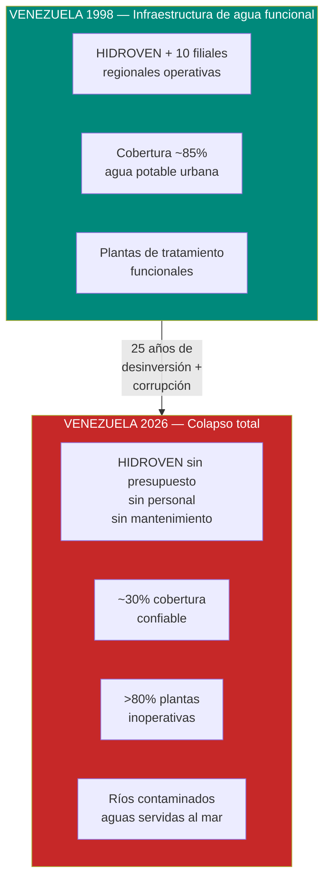
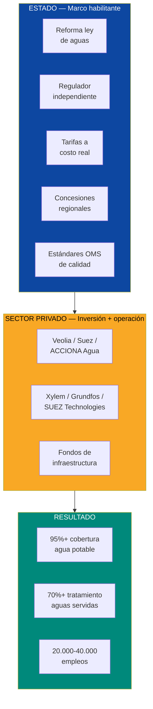
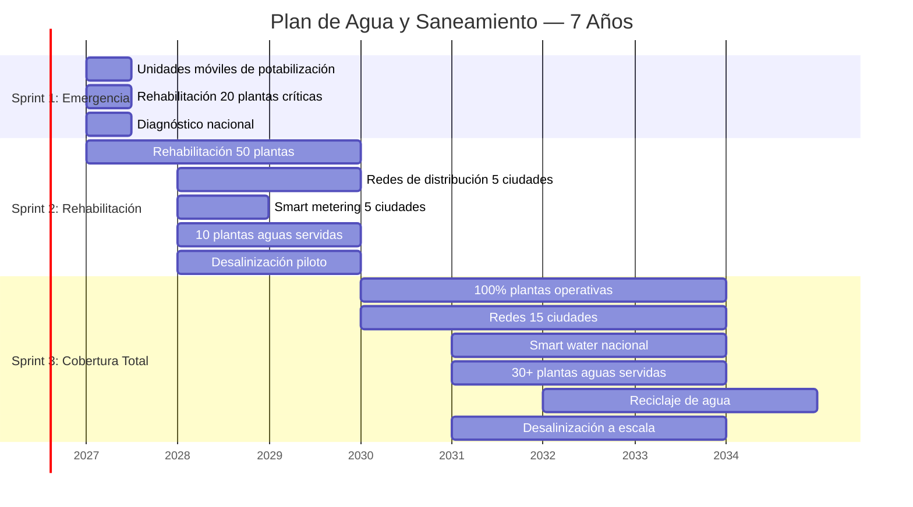
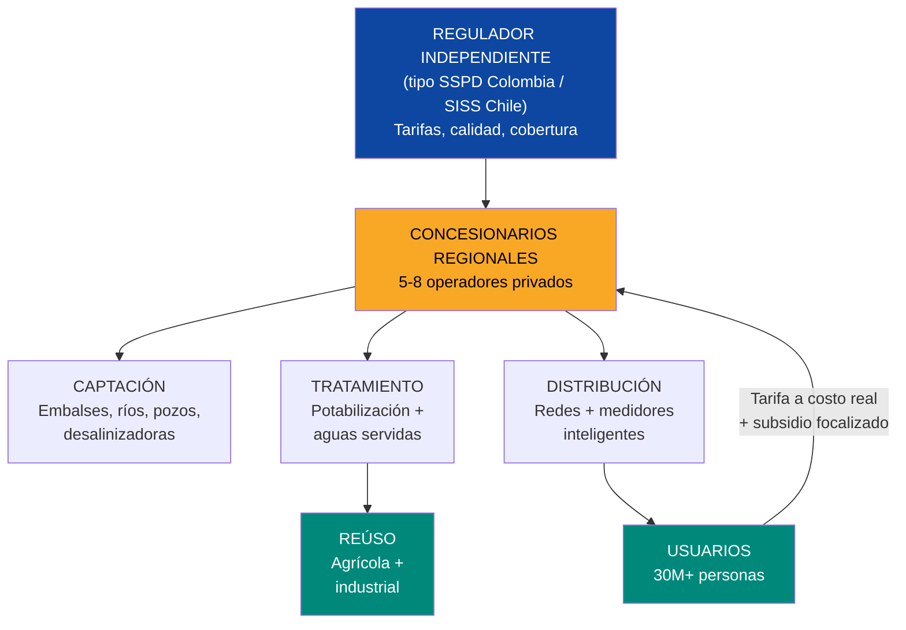
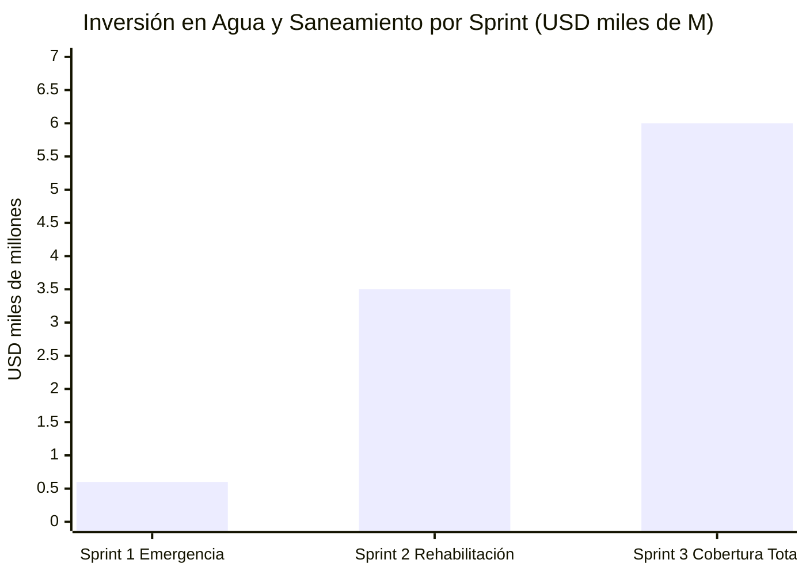
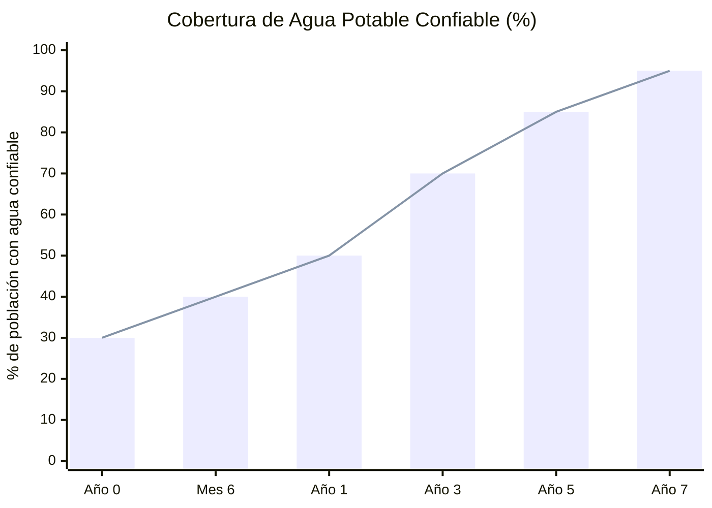

# Agua y Saneamiento: Lo Más Básico que Falta

:::caution Fechas ilustrativas — las fases se activan por KPIs, no por calendario
Las referencias a "Año X" en este documento son **ilustrativas**. Las fases reales se activan por condiciones verificables (PIB/cápita, formalización, pobreza). Ver [KPIs de Activación](/07-ejecucion/kpis-activacion).
:::

> No puedes hablar de data centers, hubs tech o fondos soberanos si la gente no tiene agua limpia para beber. El agua es la inversión más básica y la más urgente. Y también es un negocio: **USD 3-5B en concesiones** esperando a quien las opere.

---

## 1. La Crisis: 7,6 Millones de Personas Sin Servicios Básicos

:::danger Radiografía del desastre
**7,6 millones de personas** carecen de acceso confiable a servicios básicos en Venezuela — [IOM Crisis Response Plan 2025](https://crisisresponse.iom.int/response/venezuela-bolivarian-republic-crisis-response-plan-2025). Solo un estimado del **30% de la población** tiene acceso confiable a agua potable. El **80%+ de las plantas de tratamiento de agua** no están operativas o funcionan a capacidad mínima. Las aguas servidas van directamente a ríos y al Caribe **sin tratamiento**.
:::

| Indicador | Venezuela (actual) | Promedio LATAM | Meta año 5 | Meta año 10 |
|-----------|-------------------|----------------|-----------|------------|
| Acceso confiable a agua potable | **~30%** | ~85% | 70% | 95%+ |
| Plantas de tratamiento operativas | **<20%** | ~70% | 60% | 90%+ |
| Tratamiento de aguas servidas | **<10%** | ~40% | 30% | 70%+ |
| Pérdidas en redes de distribución | **>50%** | ~35% | 35% | <20% |
| Cobertura de alcantarillado | **~60%** (urbano), **<20%** (rural) | ~80% | 75% | 90%+ |

Fuentes: [IOM 2025](https://crisisresponse.iom.int/response/venezuela-bolivarian-republic-crisis-response-plan-2025); [UNICEF WASH Venezuela](https://www.unicef.org/venezuela/); estimaciones propias basadas en reportes 2024-2025.

### Lo que se destruyó

### El costo humano

| Impacto | Dato | Fuente |
|---------|------|--------|
| **Enfermedades hídricas** | Brotes de cólera, hepatitis A, diarrea crónica | [OPS/OMS Venezuela](https://www.paho.org/en/topics/cholera) |
| **Mortalidad infantil asociada** | Venezuela regresó a niveles de los años 80 en mortalidad infantil | [UNICEF](https://www.unicef.org/venezuela/) |
| **Horas perdidas buscando agua** | Familias dedican 2-6 horas diarias a buscar agua (cisternas, camiones) | [HRW 2024](https://www.hrw.org/world-report/2024/country-chapters/venezuela) |
| **Contaminación del Lago de Maracaibo** | Aguas servidas + derrames petroleros → eutrofización + lemna | [Mongabay 2023](https://news.mongabay.com/) |
| **Ríos contaminados** | Guaire, Caroní, Orinoco reciben aguas servidas sin tratamiento | [Requiere investigación: datos de calidad de agua 2025] |

---

## 2. La Oportunidad: USD 3-5B en un Mercado Cautivo

:::info No es caridad — es negocio
30 millones de personas necesitan agua limpia. Están dispuestas a pagar tarifas razonables. Las plantas de tratamiento ya existen (necesitan rehabilitación, no construcción desde cero en la mayoría de casos). Las concesiones de agua son **ingresos estables, predecibles y de largo plazo** — exactamente lo que buscan los fondos de infraestructura. El agua es el utility más seguro del mundo.
:::

| Segmento de mercado | Tamaño estimado | Modelo |
|---------------------|-----------------|--------|
| **Rehabilitación de plantas de tratamiento** | USD 1-2B | Concesión BOT (Build-Operate-Transfer) |
| **Rehabilitación de redes de distribución** | USD 2-4B | Concesión de distribución (modelo Colombia) |
| **Desalinización (costa caribeña)** | USD 500M-1B | PPP con tarifas de agua desalinizada |
| **Smart water (IoT, medidores, SCADA)** | USD 200-500M | Contrato de servicios con operador |
| **Saneamiento (aguas servidas)** | USD 1-2B | Concesión de tratamiento + reúso |
| **Agua embotellada / purificada** | USD 200-500M | Inversión privada directa |
| **TOTAL** | **USD 5-10B** | |

---

## 3. La Solución: Tres Sprints + Concesiones Privadas

### Principio rector: el Estado regula, Venezuela S.A. invierte, el sector privado opera

### Sprint 1: Emergencia (Semana 1 - Mes 6)

**Objetivo:** Que nadie se muera por falta de agua limpia.

| Acción | Qué resuelve | Costo Est. | Proveedor | Timeline |
|--------|-------------|------------|-----------|----------|
| **500+ unidades móviles de potabilización** | Agua limpia inmediata para comunidades sin servicio | USD 50-100M | Xylem (Watergen), BWT, UNICEF kits | Semana 1-4 |
| **Rehabilitación de 20 plantas críticas** (hospitales, ciudades >500K) | Cobertura mínima para 5M+ personas | USD 200-400M | Veolia, Suez (emergency response) | Mes 1-6 |
| **Tanques cisterna + distribución de emergencia** | Zonas sin red ni planta | USD 30-50M | Logística + flota | Semana 1-6 |
| **Pastillas potabilizadoras + filtros domésticos** | Solución individual para familias rurales | USD 10-20M | P&G Purifier of Water, LifeStraw | Semana 1-4 |
| **Diagnóstico nacional de infraestructura** | Saber qué se puede rehabilitar y qué hay que reemplazar | USD 20-40M | Consultoras internacionales | Mes 1-6 |
| **TOTAL SPRINT 1** | | **USD 300-600M** | | |

:::caution Esto no espera — Sprint 1 arranca el día 1
Las unidades móviles de potabilización (tipo Xylem Watergen o los kits de emergencia de UNICEF) se despliegan en **horas, no meses**. Una unidad produce 5.000-10.000 litros/día de agua potable. 500 unidades = agua limpia para 1-2 millones de personas como puente mientras se rehabilitan plantas. Se financia con el primer tramo de forwards petroleros o crédito de emergencia BID/CAF.
:::

### Sprint 2: Rehabilitación (Mes 6 - Año 3)

**Objetivo:** Rehabilitar el 60% de la infraestructura existente.

| Acción | Meta | Costo Est. | Modelo |
|--------|------|------------|--------|
| **Rehabilitación de 50 plantas de tratamiento de agua potable** | Cubrir 60% de población con agua tratada | USD 500M-1B | Concesiones BOT regionales |
| **Rehabilitación de redes de distribución** (5 ciudades principales) | Reducir pérdidas de >50% a 35% | USD 800M-1,5B | Concesión de distribución |
| **Smart metering en 5 ciudades** | Medición real del consumo, detección de fugas, facturación | USD 100-200M | Contrato de servicios (Xylem, Sensus) |
| **10 plantas de tratamiento de aguas servidas** | Dejar de verter aguas negras a ríos | USD 300-500M | Concesiones de saneamiento |
| **Desalinización piloto** (Margarita, Zulia costero) | Agua para islas y zonas costeras áridas | USD 200-400M | PPP con operador especializado |
| **TOTAL SPRINT 2** | | **USD 2-3,5B** | |

### Sprint 3: Cobertura Total (Año 3 - Año 7)

**Objetivo:** 95%+ cobertura de agua potable, 70%+ tratamiento de aguas servidas.

| Acción | Meta | Costo Est. | Referencia |
|--------|------|------------|-----------|
| **100% plantas de agua potable operativas** | 95%+ cobertura nacional | USD 500M-1B | Chile: 100% cobertura urbana |
| **Redes de distribución rehabilitadas** (15 ciudades) | Pérdidas <20% | USD 1-2B | Colombia: Acueducto de Bogotá |
| **Smart water nacional** | IoT + SCADA en todo el sistema | USD 200-500M | Singapur: Smart Water Grid |
| **30+ plantas de tratamiento de aguas servidas** | 70%+ de aguas servidas tratadas | USD 500M-1B | Chile: 100% tratamiento urbano |
| **Reciclaje de agua** (reúso agrícola e industrial) | 20%+ del agua tratada se reutiliza | USD 200-400M | Israel: 90% de reciclaje |
| **Desalinización a escala** (3-5 plantas costeras) | 500.000+ m3/día de agua desalinizada | USD 500M-1B | Israel: Sorek, la mayor desalinizadora del mundo |
| **TOTAL SPRINT 3** | | **USD 3-6B** | |

---

## 4. Modelo de Negocio: Concesiones Regionales

:::danger HIDROVEN no funciona
HIDROVEN (Hidrológica de Venezuela) y sus filiales (HIDROCAPITAL, HIDROCENTRO, etc.) siguen el mismo patrón que CORPOELEC y PDVSA: empresa estatal colapsada por politización, corrupción, desinversión y fuga de talento. HIDROVEN se disuelve y sus activos se transfieren a Venezuela S.A., que los aporta como equity en JVs con operadores privados. El modelo de reconstrucción es **concesiones privadas con regulación estatal, con Venezuela S.A. como accionista en la infraestructura base** — el agua no se privatiza ni se estatiza, se concesiona la operación mientras Venezuela S.A. retiene participación accionaria en nombre de los ciudadanos.
:::

### Estructura propuesta

### Comparación de modelos

| Aspecto | HIDROVEN (actual) | Concesiones (propuesta) | Referencia |
|---------|-------------------|------------------------|-----------|
| **Operador** | Estado (HIDROVEN + filiales) | Privado con contrato de 25-30 años | Chile: Aguas Andinas (Suez) |
| **Inversión** | Cero (presupuesto desviado) | Operador invierte + recupera vía tarifas | Colombia: AAA Barranquilla |
| **Tarifas** | Subsidiadas a cero (populismo) | Costo real + subsidio focalizado para pobres | Chile: SISS regula tarifas |
| **Calidad** | Sin monitoreo | Estándares OMS + multas por incumplimiento | Singapur: PUB |
| **Cobertura** | ~30% confiable | Contrato exige 95%+ en 7 años | Chile: logró 100% urbano |
| **Pérdidas** | >50% | Operador tiene incentivo de reducir (menos pérdida = más ingreso) | — |
| **Capital humano** | Fuga masiva | Operador trae expertise + capacita local | Modelo estándar |

### Tarifas: realismo + protección social

| Segmento | Tarifa propuesta | Subsidio | Referencia |
|----------|-----------------|----------|-----------|
| **Residencial básico** (<15 m3/mes) | USD 0,30-0,50/m3 | Subsidio 50-70% para quintiles 1-2 | Chile: tarifa diferenciada |
| **Residencial medio** (15-30 m3/mes) | USD 0,50-1,00/m3 | Sin subsidio | — |
| **Comercial** | USD 1,00-2,00/m3 | Sin subsidio | — |
| **Industrial** | USD 1,50-3,00/m3 | Sin subsidio | — |
| **Ingreso promedio por m3** | **USD 0,60-1,00** | — | Promedio LATAM: USD 0,50-1,50 |

:::tip Las tarifas subsidiadas a cero son la causa del colapso
Cuando el agua es "gratis", nadie invierte en infraestructura, nadie repara fugas, nadie ahorra. Venezuela subsidió el agua hasta matarla. La tarifa a costo real con subsidio focalizado (no universal) es la única forma de tener un sistema sostenible. Chile cobra USD 0,80-1,50/m3 y tiene 100% de cobertura. Venezuela cobra USD 0 y tiene 30%. La conclusión es obvia.
:::

---

## 5. Tecnología: Smart Water y Desalinización

### Smart Water: el agua del siglo XXI

| Tecnología | Función | Ahorro/Beneficio | Proveedor |
|------------|---------|-----------------|-----------|
| **Medidores inteligentes (AMI)** | Medición en tiempo real del consumo + detección de fugas | Reducción de pérdidas de 50% a <20% | Xylem, Sensus, Itron |
| **SCADA para redes de agua** | Control centralizado de bombeo, presión, tratamiento | Optimización 20-30% del consumo eléctrico | Siemens, ABB, Schneider |
| **Sensores IoT en tuberías** | Detección predictiva de fugas y roturas | Reducción de emergencias en 60-70% | TaKaDu, Fracta, Syrinix |
| **IA para gestión de demanda** | Predicción de consumo, optimización de distribución | Ahorro de 10-15% en costos operativos | IBM Watson, Suez Digital |
| **Drones para inspección** | Inspección de embalses, ríos, infraestructura | Reducción de costos de inspección 50% | DJI, senseFly |
| **GIS para mapeo de redes** | Inventario digital de toda la infraestructura | Base para gestión de activos | ESRI ArcGIS |

### Desalinización: agua del mar para la costa

| Planta propuesta | Ubicación | Capacidad | Costo Est. | Tecnología | Población servida |
|-----------------|-----------|-----------|-----------|------------|-------------------|
| **Margarita I** | Isla de Margarita | 50.000 m3/día | USD 100-200M | Ósmosis inversa | 500.000 |
| **Zulia Costero** | Costa occidental | 100.000 m3/día | USD 200-300M | Ósmosis inversa | 800.000 |
| **Falcón** | Paraguaná | 30.000 m3/día | USD 60-100M | Ósmosis inversa | 300.000 |
| **Vargas / La Guaira** | Litoral central | 80.000 m3/día | USD 150-250M | Ósmosis inversa | 600.000 |
| **TOTAL** | — | **260.000 m3/día** | **USD 500M-850M** | — | **2,2M personas** |

:::info Desalinización + solar = agua casi infinita
El costo de desalinización ha caído de USD 1,50/m3 (2005) a **USD 0,40-0,60/m3** (2025) con las últimas plantas de ósmosis inversa — [DesalData](https://www.desaldata.com/). Alimentar una desalinizadora con energía solar reduce el costo energético (50% del costo total) a la mitad. Israel produce el **80% de su agua potable por desalinización** y es el país con la gestión de agua más eficiente del mundo. Venezuela tiene sol, tiene costa caribeña, y tiene déficit hídrico costero. La ecuación es directa.
:::

### Singapur NEWater: el futuro del agua reciclada

Singapur recicla el **40% de sus aguas servidas** en agua potable de alta pureza (NEWater). El proceso (microfiltración + ósmosis inversa + UV) produce agua más pura que la de embalse. Venezuela puede adoptar este modelo para:

- **Reúso agrícola:** agua tratada para irrigación (reducir presión sobre fuentes naturales)
- **Reúso industrial:** agua para enfriamiento de data centers, procesos industriales
- **Potabilización indirecta:** inyección en acuíferos para recarga

---

## 6. Comparables: Quién Lo Ha Hecho

### Chile: de 60% a 100% de cobertura en 15 años

| Indicador | Chile 1990 | Chile 2025 | Cómo |
|-----------|-----------|-----------|------|
| Cobertura agua potable urbana | ~60% | **100%** | Privatización de operadores (Aguas Andinas/Suez, Esval/Agbar) |
| Tratamiento aguas servidas | <20% | **100%** | Ley de concesiones + regulador SISS |
| Pérdidas en distribución | >40% | **<25%** | Incentivos contractuales + inversión privada |
| Tarifa promedio | Subsidiada | USD 0,80-1,50/m3 | Costo real + subsidio focalizado |

Fuente: [Superintendencia de Servicios Sanitarios (SISS)](https://www.siss.gob.cl/).

**Lección:** Chile privatizó la operación (no la propiedad del agua) y reguló con el SISS. Resultado: de 60% a 100% de cobertura en 15 años. El regulador fija tarifas, el operador invierte y opera, el Estado supervisa. Venezuela puede replicar este modelo exacto.

### Colombia: concesiones de agua exitosas

| Operador | Ciudad | Resultado |
|----------|--------|-----------|
| **Triple A** (Barranquilla) | 2M habitantes | Cobertura de 65% a 99%, pérdidas de 60% a 30% |
| **Acueducto de Bogotá** (EAAB) | 8M habitantes | Empresa pública eficiente, modelo corporativo |
| **Aguas de Cartagena** (ACUACAR) | 1M habitantes | Joint venture Agbar + municipio, cobertura 99% |

Fuente: [SSPD Colombia](https://www.superservicios.gov.co/).

**Lección:** Colombia usa un mix de concesiones privadas y empresas públicas corporatizadas. La regulación (SSPD + CRA) es la clave. El modelo de Barranquilla (Triple A) es especialmente relevante para Venezuela: ciudad con infraestructura colapsada, rehabilitada por operador privado con concesión de 20 años.

### Israel: el maestro del agua

| Indicador | Israel | Relevancia para Venezuela |
|-----------|--------|--------------------------|
| % agua desalinizada | **80%** del agua potable | Venezuela: costa caribeña extensa + irradiación solar alta |
| Reciclaje de aguas servidas | **90%** (reúso agrícola) | Venezuela: sector agrícola necesita riego |
| Pérdidas en distribución | **<10%** | Venezuela: >50% — smart water puede cerrar brecha |
| Riego por goteo (inventado en Israel) | 75%+ del riego | Venezuela: Llanos y Zulia son zonas agrícolas |

Fuente: [Israel Water Authority](https://www.gov.il/en/departments/water_authority).

### Singapur: NEWater y gestión 100% urbana

| Innovación | Descripción | Aplicabilidad Venezuela |
|-----------|-------------|------------------------|
| **NEWater** | Agua reciclada de ultra-alta pureza (40% del suministro) | Reúso industrial + agrícola |
| **Catchment management** | 2/3 de la isla es zona de captación | Protección de cuencas del Caroní, Orinoco |
| **PUB** (Public Utilities Board) | Regulador + operador integrado, clase mundial | Modelo de regulador |
| **Desalinización** | 25% del suministro por 2060 | Costa caribeña de Venezuela |

Fuente: [PUB Singapore](https://www.pub.gov.sg/).

---

## 7. Inversión Total y Fuentes de Financiamiento

### Resumen de inversión por sprint

| Sprint | Inversión | Timeline | Resultado |
|--------|-----------|----------|-----------|
| Sprint 1: Emergencia | USD 300-600M | Semana 1 - Mes 6 | Nadie muere por falta de agua, diagnóstico completo |
| Sprint 2: Rehabilitación | USD 2-3,5B | Mes 6 - Año 3 | 60% cobertura, 10 plantas de aguas servidas |
| Sprint 3: Cobertura Total | USD 3-6B | Año 3 - Año 7 | 95%+ cobertura, 70%+ tratamiento, smart water |
| **TOTAL** | **USD 5-10B** | **7 años** | **Sistema de agua de primer nivel** |

### Fuentes de financiamiento

| Fuente | Monto Est. | Mecanismo | Probabilidad |
|--------|-----------|-----------|-------------|
| **Banco Mundial / IFC** | USD 1-2B | Préstamos de desarrollo + Scaling Infrastructure | Alta (agua es prioridad #1 de World Bank) |
| **BID / CAF** | USD 1-2B | Crédito regional para infraestructura hídrica | Alta (mandato regional + precedentes LATAM) |
| **DFC (EE.UU.)** | USD 500M-1B | Financiamiento de infraestructura aliada | Alta post-transición |
| **Concesionarios privados** | USD 1-3B | Inversión del operador, recuperada vía tarifas | Media-alta (depende de marco legal) |
| **Bonos verdes / azules** | USD 500M-1B | Mercado de deuda para agua y saneamiento | Media (requiere rating crediticio) |
| **Cooperación bilateral** | USD 500M-1B | Israel (desalinización), Japón (JICA), UE | Media |
| **UNICEF / PNUD** | USD 200-500M | Cooperación de emergencia (Sprint 1) | Alta |
| **TOTAL FUENTES** | **USD 5-10B** | | |

---

## 8. Aliados Potenciales

| Empresa/Entidad | País | Experiencia | Rol en Venezuela |
|------------------|------|------------|-----------------|
| **Veolia** | Francia | #1 mundial en gestión de agua. Opera en 50+ países | Concesionario de agua + aguas servidas |
| **Suez (Engie)** | Francia | #2 mundial. Aguas Andinas (Chile), Aguas de Cartagena (Colombia) | Concesionario + desalinización |
| **ACCIONA Agua** | España | Líder en desalinización (Al Jubail III, Arabia Saudita: 600.000 m3/día) | Desalinizadoras + tratamiento |
| **Xylem** | EE.UU. | Líder en smart water + unidades de emergencia | Smart metering + IoT + emergencia |
| **Grundfos** | Dinamarca | Bombas y soluciones de agua para mercados emergentes | Equipos de bombeo eficientes |
| **IDE Technologies** | Israel | Desalinización de clase mundial (Sorek I y II) | Plantas de desalinización |
| **Mekorot** | Israel | Empresa nacional de agua de Israel. Expertise en reciclaje + riego | Asistencia técnica + diseño |
| **Itron / Sensus** | EE.UU. | Medidores inteligentes de agua + AMI | Smart metering nacional |
| **Banco Mundial** | Multilateral | Mayor financiador de agua en el mundo | Préstamos + asistencia técnica |
| **BID Invest** | Multilateral | Financiamiento de concesiones de agua en LATAM | Estructura financiera de concesiones |
| **UNICEF** | Multilateral | Respuesta WASH en emergencias | Sprint 1: unidades móviles + potabilización |

---

## 9. Generación de Empleo

| Categoría | Sprint 1 | Sprint 2 | Sprint 3 (acumulado) |
|-----------|----------|----------|----------------------|
| **Construcción y rehabilitación** | 2.000-4.000 | 8.000-15.000 | 15.000-25.000 |
| **Operación y mantenimiento** | 500-1.000 | 3.000-5.000 | 8.000-12.000 |
| **Ingeniería y diseño** | 200-500 | 1.000-2.000 | 2.000-3.000 |
| **Técnicos de laboratorio / calidad** | 100-200 | 500-1.000 | 1.000-2.000 |
| **Smart water (IoT, datos, software)** | 0 | 200-500 | 500-1.000 |
| **Empleos indirectos** | 1.000-2.000 | 5.000-10.000 | 10.000-15.000 |
| **TOTAL** | **3.800-7.700** | **17.700-33.500** | **36.500-58.000** |

---

## 10. Riesgos y Mitigaciones

| # | Riesgo | Prob. | Impacto | Mitigación |
|---|--------|-------|---------|------------|
| 1 | **Resistencia política a tarifas reales** — populismo de "agua gratis" | Alta | Crítico | Subsidio focalizado (no universal). Comunicar: tarifa = inversión = agua 24/7 vs. gratis = 0 agua. Ejemplo Chile |
| 2 | **Marco legal insuficiente para concesiones** | Alta | Alto | Ley de concesiones de agua como prioridad legislativa. Modelo: Chile Ley 382/1988 + Reglamento SISS |
| 3 | **Infraestructura irrecuperable** — algunas plantas/redes destruidas sin reparación | Media | Alto | Diagnóstico completo en Sprint 1. Donde no se pueda rehabilitar, construir nuevo (más caro pero necesario) |
| 4 | **Contaminación de fuentes** — minería ilegal, agroquímicos, aguas servidas | Alta | Alto | Protección de cuencas + tratamiento avanzado. Remediación del Caroní como prioridad ambiental |
| 5 | **Sequía / cambio climático** | Media | Alto | Desalinización como fuente alternativa + reciclaje de agua (modelo Israel) + almacenamiento en embalses |
| 6 | **Corrupción en contratos de concesión** | Alta | Medio | Licitaciones internacionales con veeduría multilateral (Banco Mundial + BID). Transparencia + auditoría |
| 7 | **Escasez de técnicos de agua** | Alta | Medio | Programas de formación acelerada (12-18 meses) + repatriación de ingenieros hidráulicos de la diáspora |
| 8 | **Hurto de infraestructura** (válvulas, medidores, tuberías) | Alta | Medio | Seguridad perimetral + smart meters (alertan manipulación) + comunidad como aliada |

---

## 11. Proyección a 7 Años

| Indicador | Año 0 (actual) | Mes 6 | Año 1 | Año 3 | Año 5 | Año 7 |
|-----------|----------------|-------|-------|-------|-------|-------|
| **Cobertura agua potable confiable** | ~30% | 40% | 50% | 70% | 85% | 95%+ |
| **Plantas de tratamiento operativas** | <20% | 30% | 45% | 65% | 80% | 90%+ |
| **Tratamiento aguas servidas** | <10% | 10% | 15% | 30% | 50% | 70%+ |
| **Pérdidas distribución** | >50% | 48% | 42% | 35% | 28% | <20% |
| **Smart meters (millones)** | 0 | 0 | 0,2 | 1 | 3 | 5+ |
| **Desalinización (m3/día)** | 0 | 0 | 0 | 50.000 | 150.000 | 260.000 |
| **Inversión acumulada (USD M)** | 0 | 500 | 1.200 | 3.500 | 6.000 | 9.000 |
| **Empleos directos** | ~10.000 | 12.000 | 15.000 | 25.000 | 35.000 | 40.000+ |
| **Ingreso bruto sector (USD M/año)** | ~200 | 250 | 400 | 800 | 1.200 | 1.800 |

---

## 12. Contribución al Plan Venezuela S.A.

| Parámetro | Valor |
|-----------|-------|
| **Inversión total** | USD 5-10B en 7 años |
| **Meta de cobertura** | 95%+ agua potable, 70%+ saneamiento |
| **Modelo** | Concesiones privadas + regulador independiente (no HIDROVEN) |
| **Empleos** | 36.000-58.000 directos + indirectos |
| **Ingreso bruto año 7** | USD 1,5-2B/año (autosostenible vía tarifas) |
| **Impacto en salud** | Reducción de 60-80% en enfermedades hídricas |
| **Impacto en productividad** | 2-6 horas/día recuperadas por familias que dejaron de buscar agua |
| **Sinergia con data centers** | Agua del Caroní para enfriamiento de DCs (río frío, abundante) |

:::tip El agua es la infraestructura invisible que habilita todo
Sin agua limpia: no hay hospitales funcionales (infecciones), no hay escuelas (ausentismo por enfermedad), no hay turismo (ningún turista va a un país donde no puede tomar agua del grifo), no hay industria alimentaria (seguridad alimentaria), no hay data centers (enfriamiento requiere agua).

**USD 5-10B en agua habilitan USD 550-750B del plan total.** Junto con la electricidad, es la mejor inversión del presupuesto.
:::

---

## Documentos Relacionados

- [Capacidad Electrica](./capacidad-electrica) — Electricidad confiable para bombeo y plantas de tratamiento de agua
- [Construccion e Inmobiliaria](./construccion-inmobiliaria) — Agua potable como prerequisito para nuevas urbanizaciones y vivienda
- [Salud y Telemedicina](./salud-telemedicina) — Agua limpia reduce enfermedades hidricas, prerequisito para hospitales funcionales
- [Turismo](./turismo) — Agua y saneamiento en destinos costeros e insulares
- [Agro y Ganaderia](./agro-ganaderia) — Riego y gestion de agua para agricultura
- [Modelo de Concesiones](./modelo-concesiones) — Concesiones de agua y saneamiento (100 anos, estandar Dutch Delta)

---

## Fuentes

| # | Fuente | Dato |
|---|--------|------|
| 1 | [IOM Crisis Response Plan 2025](https://crisisresponse.iom.int/response/venezuela-bolivarian-republic-crisis-response-plan-2025) | 7,6M personas sin servicios básicos |
| 2 | [UNICEF WASH Venezuela](https://www.unicef.org/venezuela/) | Acceso a agua potable y saneamiento |
| 3 | [SISS Chile](https://www.siss.gob.cl/) | Chile: 100% cobertura urbana agua + saneamiento |
| 4 | [SSPD Colombia](https://www.superservicios.gov.co/) | Modelo de regulación colombiano |
| 5 | [PUB Singapore](https://www.pub.gov.sg/) | NEWater, gestión integrada del agua |
| 6 | [Israel Water Authority](https://www.gov.il/en/departments/water_authority) | 80% desalinización, 90% reciclaje |
| 7 | [DesalData](https://www.desaldata.com/) | Costo desalinización USD 0,40-0,60/m3 |
| 8 | [HRW World Report 2024](https://www.hrw.org/world-report/2024/country-chapters/venezuela) | Impacto humano de la crisis de agua |
| 9 | [OPS/OMS](https://www.paho.org/en/topics/cholera) | Enfermedades hídricas en Venezuela |
| 10 | [McKinsey — Smart Water](https://www.mckinsey.com/) | IoT y smart water en utilities |
| 11 | [ACCIONA Agua — Al Jubail III](https://www.acciona.com/) | Desalinización 600.000 m3/día |
| 12 | [IDE Technologies — Sorek](https://www.ide-tech.com/) | Mayor desalinizadora del mundo |
