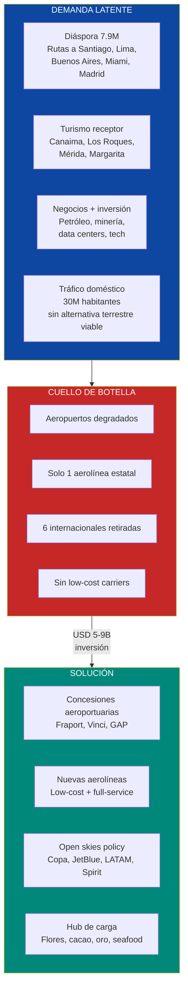
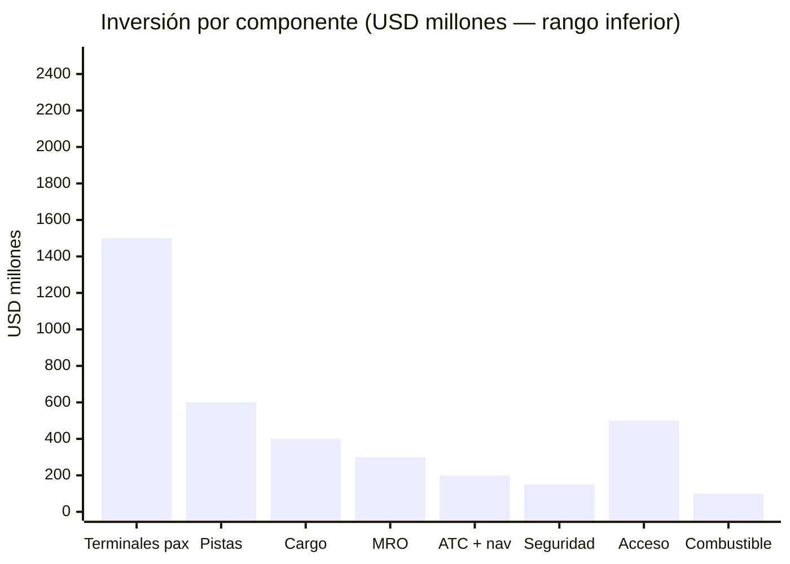
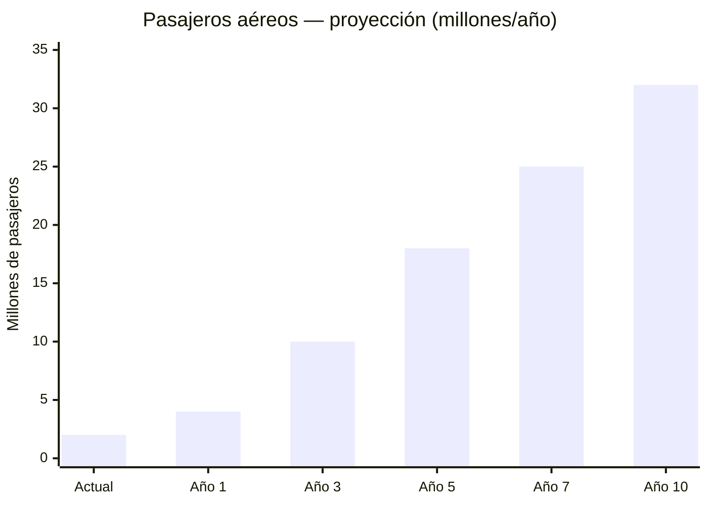

# Aviación Comercial y Aeropuertos: La Puerta al Mundo

:::caution Fechas ilustrativas — las fases se activan por KPIs, no por calendario
Las referencias a "Año X" en este documento son **ilustrativas**. Las fases reales se activan por condiciones verificables (PIB/cápita, formalización, pobreza). Ver [KPIs de Activación](/07-ejecucion/kpis-activacion).
:::

> Venezuela tuvo **8M+ pasajeros aéreos/año** antes de la crisis. Hoy apenas mueve ~2M. En noviembre 2025, **6 aerolíneas internacionales retiraron sus permisos** de Maiquetía. Los aeropuertos existen pero están degradados. Las aerolíneas domésticas se redujeron a una sola (estatal, con servicio deficiente). El país con la posición geográfica más privilegiada del Caribe — a 3-5 horas de vuelo de todas las Américas y 8-10 horas de Europa — está desconectado del mundo. Reconectar Venezuela no es un lujo — es la condición para que el turismo, la inversión, la diáspora y el comercio exterior funcionen.

---

## 1. La Oportunidad: Hub Aéreo del Caribe

:::info Posición geográfica irremplazable
Venezuela está a **3-5 horas de vuelo de toda América** (Norte, Central, Sur y Caribe) y a **8-10 horas de las principales capitales europeas**. Es la puerta natural de entrada al continente suramericano desde el Caribe. Ningún otro país de la región combina esta posición con una población de **30M**, una diáspora de **7.9M** ([UNHCR, dic. 2025](https://www.unhcr.org/venezuela-emergency.html)) y reservas de petróleo de **303B barriles** ([OPEP ASB 2025](https://www.opec.org/opec_web/en/publications/202.htm)).
:::

| Factor | Dato | Implicación |
|--------|------|-------------|
| **Pasajeros pre-crisis** | 8M+/año (2013) | Demanda probada antes del colapso |
| **Pasajeros actuales** | ~2M/año (est. 2025) | Caída de **75%** — piso, no techo |
| **Mercado potencial** | **30M+ pasajeros/año** | Población 30M + 7.9M diáspora + turismo + negocios |
| **Aerolíneas retiradas (nov. 2025)** | 6 internacionales | [Wikipedia — Simón Bolívar International Airport](https://en.wikipedia.org/wiki/Sim%C3%B3n_Bol%C3%ADvar_International_Airport_(Venezuela)) |
| **Distancia a Miami** | ~3h vuelo | Ruta #1 de diáspora y negocios |
| **Distancia a Madrid** | ~8-9h vuelo | Puerta a Europa |
| **Distancia a Bogotá** | ~1.5h vuelo | Corredor comercial CAN |
| **Distancia a Panamá** | ~2.5h vuelo | Conexión hub de las Américas |
| **Aeropuertos existentes** | 6 principales + regionales | Infraestructura degradada pero existente — no se parte de cero |

### Por qué 30M+ pasajeros/año es alcanzable

| Comparable | Población | Pasajeros aéreos/año | Pasajeros/habitante |
|-----------|-----------|---------------------|---------------------|
| **Colombia** | 52M | **40M+** (2024) | 0,77 |
| **Chile** | 19M | **28M+** (2024) | 1,47 |
| **Perú** | 34M | **25M+** (2024) | 0,74 |
| **Panamá** | 4.4M | **17M+** (2024) | 3,86 |
| **Rep. Dominicana** | 11M | **15M+** (2024) | 1,36 |
| **Venezuela (actual)** | 30M | ~2M | **0,07** |
| **Venezuela (meta año 10)** | 30M | **30M+** | 1,00 |

Fuentes: [IATA — Air Transport Statistics](https://www.iata.org/en/iata-repository/publications/economic-reports/); [Requiere investigación] para cifras individuales por país 2024.

:::tip El rebote es inevitable
Con 0,07 pasajeros/habitante, Venezuela está **10-20x por debajo** de cualquier comparable regional. Solo normalizar a niveles colombianos (0,77 pax/hab) significaría **23M pasajeros/año**. Agregar turismo, diáspora y carga empuja a **30M+**. El mercado existe — lo que falta es la infraestructura y las aerolíneas.
:::

### Cargo aéreo: el multiplicador silencioso

| Producto exportable | Modelo de referencia | Valor exportación referencia | Fuente |
|--------------------|---------------------|------------------------------|--------|
| **Flores cortadas** | Colombia | **USD 2.2B/año** (2do exportador mundial) | [Asocolflores](https://asocolflores.org/) |
| **Cacao fino de aroma** | Ecuador | USD 900M+/año | [ICCO](https://www.icco.org/) |
| **Camarones / seafood** | Ecuador | USD 7B+/año | [CNA Ecuador](https://www.cna-ecuador.com/) |
| **Oro / metales preciosos** | Transporte seguro especializado | Depende de producción formalizada | [Requiere investigación] |
| **E-commerce (fulfillment)** | Panamá (Copa Cargo), Miami | USD 500M-1B en fees logísticos | [Requiere investigación] |
| **Farmacéuticos** | Panamá, Costa Rica | Creciente | [Requiere investigación] |

:::info Venezuela tiene condiciones ideales para flores
Colombia exporta **USD 2.2B/año en flores** desde aeropuertos como Eldorado (Bogotá) y Rionegro (Medellín). Venezuela tiene clima similar, cercanía a Miami (mercado #1), mano de obra competitiva y tierras aptas en los estados Mérida, Táchira y Lara. Un aeropuerto de carga con cadena de frío certificada IATA CEIV Fresh podría capturar una porción de este mercado — [Asocolflores](https://asocolflores.org/).
:::

---

## 2. Sub-Oportunidades de Inversión

### A. Concesiones Aeroportuarias

:::danger Principio rector
El Estado pone el marco legal, la seguridad y el control de tráfico aéreo. Venezuela S.A. aporta terrenos e infraestructura aeroportuaria como equity y cobra regalías como accionista del holding ciudadano. El capital privado internacional pone la inversión, la tecnología, la ejecución y la operación. Estándar: **ICAO Annex 14 + IATA Level of Service C mínimo + Skytrax 5-star como meta**. Concesiones BOT/BOOT de **25-30 años** con contratos FIDIC Silver/Gold Book.
:::

| Aeropuerto | Ciudad | Código IATA | Inversión estimada | Capacidad meta | Rol estratégico | Timeline |
|-----------|--------|-------------|-------------------|----------------|-----------------|----------|
| **Maiquetía (Simón Bolívar)** | Caracas | CCS | **USD 1.5-2.5B** | **15-20M pax/año** | Hub internacional principal | Años 1-5 |
| **Arturo Michelena** | Valencia | VLN | **USD 500M-1B** | **5-8M pax/año** | Segundo hub + carga industrial | Años 2-6 |
| **Santiago Mariño** | Porlamar (Margarita) | PMV | **USD 300-500M** | **3-5M pax/año** | Gateway turístico Caribe | Años 2-5 |
| **La Chinita** | Maracaibo | MAR | **USD 400-700M** | **4-6M pax/año** | Petrolero + minero + corredor Colombia | Años 2-6 |
| **Manuel Carlos Piar** | Puerto Ordaz | PZO | **USD 200-400M** | **2-3M pax/año** | Minería + data centers (Guri) | Años 2-5 |
| **José Antonio Anzoátegui** | Barcelona | BLA | **USD 200-400M** | **2-3M pax/año** | Corredor petrolero oriental + turismo | Años 3-7 |
| **TOTAL** | | | **USD 3-5B** | **31-45M pax/año** | | |

#### Maiquetía: el hub que Venezuela necesita

| Parámetro | Actual | Meta (año 7) |
|-----------|--------|-------------|
| **Pasajeros/año** | ~2M (todo el país) | **15-20M** |
| **Aerolíneas internacionales** | Reducidas (6 retiraron permisos) | **25-35 aerolíneas** |
| **Gates** | [Requiere investigación] | **40-60 gates** |
| **Terminal de carga** | Limitada, sin cadena de frío | **IATA CEIV Fresh + Pharma** |
| **Pistas** | 2 (operativas con mantenimiento diferido) | **2 rehabilitadas + preparación para 3ra** |
| **Nivel de servicio** | Por debajo de IATA C | **IATA Level C mínimo, meta B** |
| **Skytrax rating** | Sin calificación | **Meta: 4-star (año 5), 5-star (año 10)** |
| **Duty-free / comercial** | Mínimo | **50-60% de ingresos non-aeronautical** |
| **Conexión terrestre** | Autopista Caracas-La Guaira (deteriorada) | **Autopista rehabilitada + tren expreso (fase 2)** |

Fuentes: [Wikipedia — Simón Bolívar International Airport](https://en.wikipedia.org/wiki/Sim%C3%B3n_Bol%C3%ADvar_International_Airport_(Venezuela)); [Requiere investigación] para datos operativos actuales.

#### Operadores aeroportuarios de referencia

| Operador | País | Aeropuertos operados | Referencia clave |
|----------|------|---------------------|-----------------|
| **Fraport** | Alemania | Frankfurt + 30 globales | [Fraport](https://www.fraport.com/en.html) |
| **Vinci Airports** | Francia | 70+ aeropuertos en 13 países | [Vinci Airports](https://www.vinci-airports.com/) |
| **Grupo Aeroportuario del Pacífico (GAP)** | México | 12 aeropuertos + Jamaica | [GAP](https://www.aeropuertosgap.com.mx/) |
| **Corporación América (CAAP)** | Argentina | 50+ aeropuertos en 7 países | [Corporación América](https://www.corporacionamerica.com/) |
| **Changi Airport Group** | Singapur | Changi (#1 Skytrax 13 veces) | [CAG](https://www.changiairport.com/) |
| **OPAIN** | Colombia | El Dorado (Bogotá) — 40M+ pax | [OPAIN](https://eldorado.aero/) |

:::tip Modelo OPAIN El Dorado: de desastre a referente
El Dorado de Bogotá era un aeropuerto caótico hasta que Colombia lo concesionó a OPAIN (consorcio liderado por Odinsa). Resultado: inversión de **USD 1.2B**, nueva terminal, capacidad de **40M+ pasajeros/año**, y se convirtió en el **aeropuerto #1 de Sudamérica en carga** (1M+ ton/año). Maiquetía puede replicar este modelo — [OPAIN](https://eldorado.aero/).
:::

### B. Líneas Aéreas Domésticas e Internacionales

| Parámetro | Estado actual | Oportunidad |
|-----------|--------------|-------------|
| **Aerolíneas domésticas** | Solo Conviasa (estatal, servicio deficiente, flota limitada) | **2-3 carriers privados** (low-cost + full-service) |
| **Rutas domésticas** | <10 operativas regularmente | **15-20 rutas conectando todas las ciudades principales** |
| **Rutas internacionales** | Reducidas drásticamente | **30+ rutas a diáspora + turismo + negocios** |
| **Flota total país** | <20 aviones operativos (est.) | **60-100 aviones** |
| **Política de cielos** | Restrictiva, bilateral obsoleta | **Open skies con EE.UU., UE, LATAM** |

#### Modelo low-cost carrier: replicar el éxito de Colombia y Brasil

| Aerolínea comparable | País | Modelo | Flota | Resultado |
|---------------------|------|--------|-------|-----------|
| **Viva Air** (hoy Viva) | Colombia | Ultra low-cost (ULCC) | A320 | Democratizó el vuelo doméstico; ~8M pax/año antes de reestructuración |
| **Wingo** | Colombia/Panamá | Low-cost (Copa Group) | 737-800 | Rutas regionales competitivas |
| **Azul** | Brasil | Low-cost híbrido | 180+ aviones (A320neo + E-Jets) | **38M+ pax/año**, conectó 150+ ciudades |
| **GOL** | Brasil | Low-cost | 130+ aviones (737 MAX) | 30M+ pax/año |
| **JetSMART** | Chile/Argentina | ULCC | A320neo | Expansión agresiva en Cono Sur |
| **Flybondi** | Argentina | ULCC | 737-800 | Rompió monopolio de Aerolíneas Argentinas |

Fuentes: [CAPA — Centre for Aviation](https://centreforaviation.com/); datos de flota por aerolínea disponibles en sus reportes anuales.

#### Rutas prioritarias

| Categoría | Rutas | Demanda estimada | Frecuencia meta |
|-----------|-------|-----------------|-----------------|
| **Domésticas críticas** | CCS-MAR, CCS-VLN, CCS-PMV, CCS-PZO, CCS-BLA | Alta — sin alternativa terrestre viable para varias | 3-5 vuelos diarios cada una |
| **Diáspora top** | CCS-MIA, CCS-MAD, CCS-SCL, CCS-LIM, CCS-BOG, CCS-PTY, CCS-EZE | Muy alta — 7.9M venezolanos en exterior | 1-3 vuelos diarios cada una |
| **Turismo receptor** | CCS-JFK, CCS-ORD, CCS-YYZ, CCS-GRU, PMV-MIA, PMV-BOG | Alta — mercado turístico por desarrollar | 1-2 vuelos diarios |
| **Carga** | CCS-MIA (cargo), VLN-MIA (cargo), CCS-AMS (flores), CCS-MAD (cargo) | Media-alta — depende de desarrollo agroindustrial | 3-5 vuelos semanales cargo |

#### Flota recomendada

| Tipo de aeronave | Cantidad | Inversión estimada | Uso principal |
|-----------------|----------|-------------------|---------------|
| **Airbus A320neo** | 15-25 | USD 750M-1.25B (list price ~USD 50M c/u) | Doméstico + regional LATAM |
| **Boeing 737 MAX 8** | 10-15 | USD 500M-750M (list price ~USD 50M c/u) | Doméstico + Caribe + EE.UU. |
| **Airbus A321XLR** | 5-10 | USD 325M-650M (list price ~USD 65M c/u) | Rutas transatlánticas (Madrid, Lisboa) |
| **ATR 72-600** | 5-10 | USD 130M-260M (list price ~USD 26M c/u) | Rutas regionales cortas + turísticas |
| **Total flota** | **35-60** | **USD 1.7-2.9B** (list price; leasing reduce capital inicial) | |

:::caution List price vs. realidad
Los precios de lista son referencia. Las aerolíneas obtienen descuentos de **40-60%** en órdenes grandes. Además, el **leasing operativo** (GECAS, AerCap, Avolon) permite operar sin comprar: USD 300-450K/mes por A320neo. Una flota de 30 aviones en leasing requiere ~USD 120-160M/año en renta, no USD 1.5B en capital — [Requiere investigación] para términos actuales de leasing.
:::

#### Política de Open Skies

| Acción | Detalle | Impacto |
|--------|---------|---------|
| **Firma de acuerdos Open Skies** | Con EE.UU., UE, Canadá, Colombia, Panamá, Chile, Brasil, México | Permite a cualquier aerolínea operar rutas sin restricciones |
| **Eliminación de restricciones de frecuencia** | Abolir sistema bilateral restrictivo actual | Más vuelos = más competencia = menores precios |
| **Aerolíneas internacionales a atraer** | Copa, JetBlue, LATAM, American, Avianca, Spirit, Air Europa, Iberia, Air France | Cada aerolínea nueva agrega 2-5 rutas |
| **Incentivos de aterrizaje** | Exención de tasas aeroportuarias por 2-3 años para nuevas rutas | Modelo Irlanda (Ryanair en Shannon/Dublin) |

:::info Open Skies transformó a Colombia
Tras la firma del acuerdo Open Skies con EE.UU. en 2011, Colombia pasó de **15M a 40M+ pasajeros/año** en una década. Las rutas directas a EE.UU. se multiplicaron. VivaColombia (ahora Viva) nació como la primera ULCC del país. El mismo efecto es replicable en Venezuela — [Aerocivil Colombia](https://www.aerocivil.gov.co/).
:::

### C. Cargo Aéreo y Logística

| Componente | Inversión estimada | Estándar | Meta |
|-----------|-------------------|----------|------|
| **Terminal de carga Maiquetía** (modernización) | USD 200-300M | IATA CEIV Fresh + CEIV Pharma | 200K+ ton/año |
| **Terminal de carga Valencia** (nuevo) | USD 150-250M | IATA CEIV Fresh | 100K+ ton/año — zona industrial |
| **Hub cargo Puerto Cabello** (integrado air-sea) | USD 100-200M | IATA CEIV + GDP compliance | Multimodal: avión-barco en <24h |
| **Cadena de frío nacional** (cold chain) | USD 50-100M | GDP, HACCP | Flores, seafood, cacao, farmacéuticos |
| **Centro fulfillment e-commerce** | USD 50-100M | Estándar Amazon/MercadoLibre | Distribución LATAM norte |
| **TOTAL CARGO** | **USD 550M-950M** | | |

#### Potencial de exportación por aire

| Producto | Volumen potencial (año 10) | Valor estimado | Modelo de referencia | Fuente |
|----------|---------------------------|---------------|---------------------|--------|
| **Flores cortadas** | 50K-100K ton/año | **USD 500M-1B/año** | Colombia: USD 2.2B/año | [Asocolflores](https://asocolflores.org/) |
| **Cacao fino de aroma** | 30K-50K ton/año | **USD 200-400M/año** | Ecuador: USD 900M+ | [ICCO](https://www.icco.org/) |
| **Camarones / seafood** | 20K-40K ton/año | **USD 200-500M/año** | Ecuador: USD 7B+ (total seafood) | [CNA Ecuador](https://www.cna-ecuador.com/) |
| **Frutas tropicales** | 30K-60K ton/año | **USD 100-300M/año** | Costa Rica, Perú | [Requiere investigación] |
| **Oro / metales (transporte seguro)** | Según producción formalizada | Variable | Seguridad especial + seguros | [Requiere investigación] |
| **Farmacéuticos / e-commerce** | 10K-20K ton/año | **USD 100-200M/año** | Panamá (Copa Cargo), Miami | [Requiere investigación] |
| **Total exportaciones aéreas** | **170K-320K ton/año** | **USD 1.1-2.4B/año** | | |

### D. Mantenimiento Aeronáutico (MRO)

:::info Oportunidad MRO: USD 10B+ de mercado regional
El mercado MRO de LATAM y Caribe es de **USD 10B+/año** y está concentrado en Brasil (LATAM MRO, GOL Aerotech) y México (Mexicana MRO, Aeroman). Venezuela tuvo capacidad MRO a través de PDVSA Aviación. Con mano de obra técnica formable, costo laboral competitivo y posición geográfica central, un centro MRO certificado puede capturar **USD 200-400M/año** en contratos regionales — [Oliver Wyman MRO Forecast](https://www.oliverwyman.com/our-expertise/insights/2024/apr/fleet-and-mro-forecast-2024-2034.html).
:::

| Parámetro | Detalle |
|-----------|---------|
| **Ubicación** | Maiquetía (CCS) o Valencia (VLN) — hangar dedicado |
| **Certificaciones requeridas** | **EASA Part 145 + FAA 14 CFR Part 145** (dual certification) |
| **Tipo de trabajos** | C-Checks, D-Checks, reparación de componentes, pintura, modificaciones |
| **Flota target** | A320 family + 737 family (dominan LATAM con 70%+ de la flota) |
| **Inversión** | **USD 300-500M** (hangares, tooling, equipos, capacitación) |
| **Empleos directos** | **3,000-5,000** (técnicos certificados, ingenieros, soporte) |
| **Ingreso estimado (año 5+)** | **USD 200-400M/año** |
| **Timeline** | Años 3-7 (requiere 2-3 años para certificación + capacitación) |
| **Socios potenciales** | Airbus (joint venture), Boeing, Lufthansa Technik, ST Engineering |

#### Comparables MRO en LATAM

| Centro MRO | País | Capacidad | Certificaciones | Empleos |
|-----------|------|-----------|-----------------|---------|
| **LATAM MRO** | Brasil/Chile | Mayor de LATAM | EASA + FAA + ANAC | 3,000+ |
| **Aeroman** (ST Engineering) | El Salvador | 12 bahías wide-body | EASA + FAA | 3,500+ |
| **GOL Aerotech** | Brasil | Foco en 737 | ANAC + FAA | 2,500+ |
| **Mexicana MRO** | México | Wide + narrow body | FAA + DGAC | 2,000+ |

Fuentes: [Oliver Wyman — MRO Forecast 2024-2034](https://www.oliverwyman.com/our-expertise/insights/2024/apr/fleet-and-mro-forecast-2024-2034.html); [Aviation Week MRO](https://aviationweek.com/mro).

---

## 3. Infraestructura Requerida

| Componente | Inversión estimada | Estándar | Responsable |
|-----------|-------------------|----------|-------------|
| **Pistas y calles de rodaje** (rehabilitación 6 aeropuertos) | USD 600M-1B | ICAO Annex 14, FAA AC 150/5300 | Concesionario |
| **Terminales de pasajeros** (nuevas + expansión) | USD 1.5-2.5B | IATA Level of Service C mínimo, meta B | Concesionario |
| **Terminales de carga** (3 principales) | USD 400-600M | IATA CEIV Fresh + Pharma + GDP | Concesionario |
| **Torres de control + navegación aérea** | USD 200-300M | ICAO Annex 10, Eurocontrol estándares | Estado (INAC renovado) |
| **Sistemas de seguridad** (screening, CCTV, biométricos) | USD 150-250M | TSA equivalente + ECAC | Concesionario + Estado |
| **Acceso terrestre** (autopistas, tren expreso a CCS) | USD 500M-1B | Integrado con plan vial | PPP separada |
| **Servicios de combustible** (farm de kerosene Jet-A1) | USD 100-200M | IATA + JIG standards | Privado (Shell, BP, Vitol) |
| **Hangares MRO** | USD 300-500M | EASA Part 145 + FAA Part 145 | Privado (JV con OEM) |
| **TOTAL INFRAESTRUCTURA** | **USD 3.75-6.35B** | | |

---

## 4. Modelo de Negocio

### 4.1 Concesiones aeroportuarias — quién pone qué

| Rol | Gobierno | Concesionario privado |
|-----|----------|----------------------|
| **Propiedad del terreno** | Venezuela S.A. (accionista en JV) | Uso bajo concesión |
| **Marco legal** | Ley de concesiones aeroportuarias | Cumplimiento regulatorio |
| **Seguridad perimetral** | Policía + INAC | Seguridad interna (TSA-equivalent) |
| **Control de tráfico aéreo** | Estado (INAC renovado) | N/A |
| **Inversión en infraestructura** | Máximo 10-15% (subsidio en aeropuertos regionales) | **85-100% del capex** |
| **Operación** | Supervisión + regulación | **100% operación** |
| **Mantenimiento** | Supervisión de estándares | **100% mantenimiento** |
| **Ingresos** | Canon anual (% del ingreso bruto) | Tasas aeroportuarias + comercial |
| **Duración** | N/A | **25-30 años** (renovable) |
| **Arbitraje** | ICSID + Panel de Expertos | ICSID + Panel de Expertos |

### 4.2 Estructura de ingresos aeroportuarios

| Fuente de ingreso | % del total (meta) | Detalle |
|--------------------|-------------------|---------|
| **Tasas aeroportuarias** | 40-50% | Tasa de aterrizaje, tasa de pasajero, cargo handling |
| **Comercial (non-aero)** | 50-60% | Duty-free, F&B, retail, parking, lounge, publicidad |
| **Inmobiliario** | 5-10% | Hoteles, oficinas, centros logísticos en zona aeroportuaria |

:::tip Los mejores aeropuertos ganan más de tiendas que de aviones
Changi (Singapur) genera **60%+ de ingresos de fuentes non-aeronautical** — duty-free, retail, F&B, entertainment. Incheon (Corea) similar. El modelo moderno de aeropuerto es un **centro comercial con pistas de aterrizaje**. Maiquetía con 15-20M pasajeros/año y operación comercial de clase mundial puede generar USD 300-500M/año solo en non-aero — [Changi Airport Group Annual Report](https://www.changiairport.com/corporate/media-centre/resources/publication.html).
:::

### 4.3 Aerolíneas — modelo de negocio

| Parámetro | Low-cost carrier (LCC) | Full-service carrier |
|-----------|----------------------|---------------------|
| **Modelo** | ULCC estilo JetSMART/Flybondi | Estilo Copa/Avianca |
| **Ingreso principal** | Tarifa base baja + ancillary (equipaje, asientos, comida) | Tarifa inclusiva + business class |
| **CASK objetivo** | USD 0,04-0,06/ASK | USD 0,06-0,09/ASK |
| **Load factor meta** | 85-90% | 80-85% |
| **Ancillary revenue** | 30-40% del ingreso total | 10-15% del ingreso total |
| **Flota** | Un solo tipo (A320neo o 737 MAX) | Mixta (narrow + wide body) |
| **Inversión privada** | USD 500M-1B (leasing-heavy) | USD 500M-2B |

### 4.4 Cargo — modelo de ingresos

| Servicio | Tarifa estimada | Volumen meta (año 10) | Ingreso anual |
|----------|----------------|----------------------|---------------|
| **Handling de carga general** | USD 0,15-0,25/kg | 100K ton/año | USD 15-25M |
| **Cadena de frío (perecederos)** | USD 0,30-0,50/kg | 80K ton/año | USD 24-40M |
| **Transporte seguro (oro/valores)** | USD 1-5/kg | 5K ton/año | USD 5-25M |
| **E-commerce fulfillment** | USD 0,20-0,40/kg | 30K ton/año | USD 6-12M |
| **Ground handling fees** | Fijo por operación | 5K-10K operaciones/año | USD 10-20M |
| **Total cargo revenue (aeropuertos)** | | | **USD 60-120M/año** |

---

## 5. Proyección 10 Años

| Indicador | Actual | Año 1 | Año 3 | Año 5 | Año 7 | Año 10 |
|-----------|--------|-------|-------|-------|-------|--------|
| **Pasajeros aéreos (M/año)** | ~2 | 4 | 10 | 18 | 25 | **32** |
| **Aerolíneas operando** | ~5 | 10 | 18 | 25 | 30 | **35+** |
| **Rutas domésticas** | <10 | 12 | 18 | 22 | 25 | **25+** |
| **Rutas internacionales** | <15 | 20 | 35 | 50 | 65 | **80+** |
| **Carga aérea (K ton/año)** | ~30 | 50 | 100 | 180 | 250 | **320** |
| **Inversión acumulada** | 0 | USD 1B | USD 3B | USD 5B | USD 7B | **USD 9B** |
| **Ingresos aeroportuarios** | ~USD 50M | USD 150M | USD 500M | USD 1.2B | USD 2B | **USD 3.5B** |
| **Ingresos aerolíneas** | [Req. inv.] | USD 200M | USD 800M | USD 2B | USD 3.5B | **USD 5B+** |
| **Ingresos cargo** | ~USD 10M | USD 30M | USD 100M | USD 300M | USD 500M | **USD 800M** |
| **Ingresos MRO** | 0 | 0 | USD 50M | USD 150M | USD 250M | **USD 400M** |
| **Ingreso total sector** | ~USD 60M | USD 380M | USD 1.45B | USD 3.65B | USD 6.25B | **USD 9.7B** |
| **Empleos directos** | ~5K | 10K | 25K | 45K | 60K | **80K** |
| **Contribución fiscal (15% flat)** | ~USD 3M | USD 20M | USD 80M | USD 200M | USD 400M | **USD 700M** |

:::caution Estas proyecciones asumen normalización política y económica
El escenario requiere: (1) levantamiento progresivo de sanciones, (2) estabilidad macroeconómica, (3) ejecución de concesiones aeroportuarias en años 1-3, (4) política de Open Skies activa. Sin estos prerequisitos, el timeline se extiende 3-5 años.
:::

### Proyección financiera consolidada

| Métrica | Año 3 | Año 5 | Año 7 | Año 10 |
|---------|-------|-------|-------|--------|
| **Inversión total acumulada** | USD 3B | USD 5B | USD 7B | **USD 9B** |
| **Ingreso bruto anual** | USD 1.45B | USD 3.65B | USD 6.25B | **USD 9.7B** |
| **EBITDA estimado (25-30%)** | USD 360-435M | USD 910M-1.1B | USD 1.56-1.88B | **USD 2.4-2.9B** |
| **Canon a Venezuela S.A.** | USD 70-100M | USD 180-250M | USD 310-440M | **USD 480-680M** |
| **Empleos directos** | 25K | 45K | 60K | **80K** |
| **Empleos indirectos (2.5x)** | 63K | 113K | 150K | **200K** |

---

## 6. Comparables Internacionales

### Colombia — OPAIN / El Dorado (Bogotá)

| Métrica | Antes (2007) | Después (2025) | Cómo |
|---------|-------------|----------------|------|
| **Pasajeros/año** | ~12M | **40M+** | Concesión a OPAIN (Odinsa) |
| **Inversión** | Mínima pública | **USD 1.2B** privada | BOT 20 años |
| **Carga** | ~500K ton | **1M+ ton** (#1 en Sudamérica en carga) |  Terminal dedicada |
| **Aerolíneas** | ~15 | **30+** | Open Skies + hub Copa/Avianca |
| **Calidad** | Caótico | **Skytrax 3-star** | Operación profesional |

Fuente: [OPAIN — El Dorado](https://eldorado.aero/).

### Chile — SCL (Santiago)

| Métrica | Antes (2015) | Después (2025) | Cómo |
|---------|-------------|----------------|------|
| **Pasajeros/año** | ~18M | **28M+** | Concesión a Nuevo Pudahuel (Vinci + ADP + Astaldi) |
| **Inversión** | Terminal vieja | **USD 1.1B** en nueva terminal | BOT 20 años |
| **Terminal nueva** | No existía | **230.000 m², 38 gates** | Diseño Skytrax 4-star |

Fuente: [Nuevo Pudahuel](https://www.nuevopudahuel.cl/).

### Panamá — Tocumen (PTY)

| Métrica | Antes (2010) | Después (2025) | Cómo |
|---------|-------------|----------------|------|
| **Pasajeros/año** | ~6M | **17M+** | Hub de Copa Airlines |
| **Terminal 2** | No existía | **USD 900M, 20 gates** | Inversión público-privada |
| **Conectividad** | ~50 destinos | **80+ destinos** | Copa como aerolínea bandera |
| **Cargo** | Limitado | Hub cargo para Americas | Zona libre integrada |

Fuente: [Tocumen International Airport](https://www.tocumenpanama.aero/).

### Rep. Dominicana — Punta Cana (PUJ)

| Métrica | Antes (2000) | Después (2025) | Cómo |
|---------|-------------|----------------|------|
| **Pasajeros/año** | ~2M | **8M+** | Primer aeropuerto 100% privado de las Américas |
| **Inversión** | Privada desde el inicio | **USD 500M+** acumulada | Grupo Puntacana (Frank Rainieri) |
| **Modelo** | Privado — no concesión, propiedad total | Aeropuerto + resort integrado | Exitoso sin intervención estatal |

Fuente: [Punta Cana International Airport](https://www.puntacanainternationalairport.com/).

### Emiratos Árabes — Dubai (DXB)

| Métrica | 1990 | 2025 | Cómo |
|---------|------|------|------|
| **Pasajeros/año** | ~5M | **90M+** (#1 del mundo en tráfico internacional) | Hub de Emirates + Open Skies total |
| **Inversión acumulada** | Mínima | **USD 30B+** | Gobierno + privado |
| **Duty-free** | Modesto | **USD 2B+/año en ventas** | Modelo comercial agresivo |
| **Empleos** | Pocos miles | **90,000+ directos** | Aviación como motor económico |

Fuente: [Dubai Airports](https://www.dubaiairports.ae/).

:::tip Dubai demostró que la aviación puede ser EL motor económico
Dubai no tiene petróleo significativo (se agotó). Su PIB de **USD 100B+** depende en gran parte de la aviación, turismo y logística. Emirates genera **USD 30B+/año** en ingresos. El aeropuerto DXB emplea a 90,000+ personas. Venezuela no necesita ser Dubai, pero el ejemplo demuestra que la aviación es un **multiplicador económico**, no un costo — [Emirates Group Annual Report](https://www.theemiratesgroup.com/english/our-company/annual-report.aspx).
:::

---

## 7. Aliados Potenciales

| Empresa / Entidad | País | Especialidad | Rol potencial |
|-------------------|------|-------------|---------------|
| **Fraport** | Alemania | Operador aeroportuario (Frankfurt + 30 globales) | Concesión Maiquetía — gestión de hub |
| **Vinci Airports** | Francia | 70+ aeropuertos en 13 países | Concesión aeropuertos regionales |
| **GAP** (Grupo Aeroportuario del Pacífico) | México | 12 aeropuertos en México + Jamaica | Concesión Valencia o Maracaibo |
| **Corporación América (CAAP)** | Argentina | 50+ aeropuertos en 7 países (Armenia, Brasil, Ecuador, Uruguay, Italia) | Multi-aeropuerto package |
| **Changi Airport Group** | Singapur | Consultoría + operación (#1 Skytrax) | Asesoría de diseño + operación Skytrax 5-star |
| **Copa Airlines** | Panamá | Hub de las Américas, 80+ destinos | Socio aéreo — hub feeding desde CCS |
| **JetBlue** | EE.UU. | Caribe + LATAM norte, bajo costo con calidad | Rutas CCS-JFK, CCS-FLL |
| **LATAM Airlines** | Chile/Brasil | Mayor aerolínea de LATAM | Rutas a Sudamérica + alianza oneworld |
| **Avianca** | Colombia | Red regional CAN + Centroamérica | Rutas CCS-BOG, CCS-MDE, CCS-PTY |
| **Spirit / Frontier** | EE.UU. | ULCC con fuerte presencia Caribe/LATAM | Rutas low-cost a Florida |
| **Airbus** | Europa | OEM — A320neo family | Proveedor de flota + partner MRO |
| **Boeing** | EE.UU. | OEM — 737 MAX family | Proveedor de flota + partner MRO |
| **Lufthansa Technik** | Alemania | MRO líder global | Joint venture para centro MRO |
| **ST Engineering** | Singapur | MRO (opera Aeroman en El Salvador) | Centro MRO certificado EASA+FAA |
| **AerCap / GECAS / Avolon** | Global | Leasing de aeronaves | Financiamiento de flota vía leasing |
| **BID / CAF** | Multilateral | Financiamiento infraestructura | Préstamos para modernización aeroportuaria |
| **DFC** (EE.UU.) | EE.UU. | Financiamiento de desarrollo | Infraestructura aeroportuaria en aliados |
| **IFC** (Banco Mundial) | Multilateral | Project finance + asistencia técnica | Estructuración de PPPs aeroportuarias |
| **IATA** | Global | Estándares de la industria aérea | Certificaciones CEIV, estándares de servicio |

---

## 8. Riesgos y Mitigaciones

| # | Riesgo | Prob. | Impacto | Mitigación |
|---|--------|-------|---------|------------|
| 1 | **Sanciones impiden operaciones de aerolíneas de EE.UU./UE** | Media-Alta | Crítico | Roadmap de sanciones del plan; licencias OFAC específicas para aviación civil; priorizar aerolíneas de países sin régimen sancionatorio |
| 2 | **Tráfico de pasajeros menor al proyectado** | Media | Alto | Garantía de ingreso mínimo (MRG) en concesiones; contratos con piso de tráfico; incentivos a nuevas rutas |
| 3 | **Aerolíneas no quieren operar en Venezuela** (riesgo reputacional) | Media | Alto | Gobierno transparente + seguros de aviación + precedente Copa/LATAM en mercados difíciles |
| 4 | **Corrupción en adjudicación de concesiones** | Alta | Alto | Licitaciones internacionales abiertas + auditoría Big 4 + supervisión multilateral (BID/CAF). [Sistema anticorrupción del plan](/04-gobernanza/anticorrupcion-checklist) |
| 5 | **Inseguridad en zonas aeroportuarias** (robos, narcotráfico) | Media-Alta | Alto | Policía aeroportuaria dedicada + sistemas biométricos + control antinarcóticos (DEA/Interpol cooperation) |
| 6 | **Escasez de pilotos y técnicos** | Alta | Medio | Escuelas de aviación (partnership con IATA Training) + repatriación de profesionales de diáspora + contratos con pilotos extranjeros (años 1-3) |
| 7 | **Precio del combustible Jet-A1** | Media | Medio | Venezuela produce petróleo; refinar Jet-A1 localmente reduce dependencia de importación. Hedging de combustible |
| 8 | **Desastres naturales / clima** | Baja-Media | Medio | Diseño ICAO Annex 14 para condiciones tropicales; seguros de infraestructura; redundancia operativa |
| 9 | **Competencia regional** (Bogotá, Panamá, Miami como hubs) | Media | Medio | No competir frontalmente — posición como hub complementario + Open Skies + costos operativos menores |
| 10 | **Gobierno futuro revoca concesiones** | Media | Crítico | Cláusulas ICSID + BIT (bilateral investment treaties) + compensación por terminación anticipada + SPV offshore |

---

## 9. Fuentes

| # | Fuente | Dato utilizado |
|---|--------|---------------|
| 1 | [Wikipedia — Simón Bolívar International Airport](https://en.wikipedia.org/wiki/Sim%C3%B3n_Bol%C3%ADvar_International_Airport_(Venezuela)) | 6 aerolíneas retiraron permisos (nov. 2025); datos de Maiquetía |
| 2 | [UNHCR — Venezuela Emergency](https://www.unhcr.org/venezuela-emergency.html) | 7.9M de diáspora (dic. 2025) |
| 3 | [OPEP ASB 2025](https://www.opec.org/opec_web/en/publications/202.htm) | 303B barriles de reservas |
| 4 | [IATA — Air Transport Statistics](https://www.iata.org/en/iata-repository/publications/economic-reports/) | Estadísticas de tráfico aéreo global |
| 5 | [Asocolflores](https://asocolflores.org/) | Colombia: USD 2.2B/año en exportación de flores |
| 6 | [ICCO — International Cocoa Organization](https://www.icco.org/) | Ecuador: USD 900M+ en cacao |
| 7 | [CNA Ecuador](https://www.cna-ecuador.com/) | Ecuador: USD 7B+ en seafood |
| 8 | [OPAIN — El Dorado](https://eldorado.aero/) | Concesión El Dorado: USD 1.2B, 40M+ pax |
| 9 | [Nuevo Pudahuel](https://www.nuevopudahuel.cl/) | Concesión SCL: USD 1.1B, 28M+ pax |
| 10 | [Tocumen International Airport](https://www.tocumenpanama.aero/) | Hub Copa: 17M+ pax, 80+ destinos |
| 11 | [Punta Cana International Airport](https://www.puntacanainternationalairport.com/) | Primer aeropuerto 100% privado de las Américas |
| 12 | [Dubai Airports](https://www.dubaiairports.ae/) | DXB: 90M+ pax, #1 internacional |
| 13 | [Emirates Group Annual Report](https://www.theemiratesgroup.com/english/our-company/annual-report.aspx) | Emirates: USD 30B+/año ingresos |
| 14 | [Oliver Wyman — MRO Forecast 2024-2034](https://www.oliverwyman.com/our-expertise/insights/2024/apr/fleet-and-mro-forecast-2024-2034.html) | Mercado MRO LATAM: USD 10B+/año |
| 15 | [CAPA — Centre for Aviation](https://centreforaviation.com/) | Datos de aerolíneas low-cost LATAM |
| 16 | [Aerocivil Colombia](https://www.aerocivil.gov.co/) | Open Skies Colombia: 15M→40M+ pax en una década |
| 17 | [Changi Airport Group — Annual Report](https://www.changiairport.com/corporate/media-centre/resources/publication.html) | 60%+ ingresos non-aeronautical |
| 18 | [Fraport](https://www.fraport.com/en.html) | Operador: Frankfurt + 30 globales |
| 19 | [Vinci Airports](https://www.vinci-airports.com/) | Operador: 70+ aeropuertos, 13 países |
| 20 | [Grupo Aeroportuario del Pacífico](https://www.aeropuertosgap.com.mx/) | Operador: 12 aeropuertos México + Jamaica |
| 21 | [Aviation Week MRO](https://aviationweek.com/mro) | Datos de mercado MRO global |

---

## Resumen Ejecutivo

| Parámetro | Valor |
|-----------|-------|
| **Inversión total** | **USD 5-9B** |
| **Timeline** | 10 años (grueso en años 1-7) |
| **Empleos directos** | **40,000-80,000** |
| **Empleos totales** (directos + indirectos) | **100,000-200,000** |
| **Ingreso anual a escala (año 10)** | **USD 4-8B/año** (conservador: USD 5-6B) |
| **Pasajeros/año (meta año 10)** | **30M+** |
| **Carga aérea (meta año 10)** | **300K+ ton/año** |
| **Modelo** | Concesiones PPP (BOT/BOOT) 25-30 años — cero operación estatal |
| **Estándar** | ICAO Annex 14 + IATA LoS C + Skytrax 5-star (meta) |
| **Referencia principal** | Colombia (OPAIN El Dorado) + Chile (SCL) + Panamá (Tocumen) + Dubai (DXB) |
| **ROI** | Autofinanciable — tasas aeroportuarias + comercial + cargo + MRO |

:::tip Cada avión que aterriza trae inversores, turistas, diáspora y carga
Sin aeropuertos funcionales no llegan los inversionistas a ver los data centers. No llegan los turistas a Los Roques. No regresan los 7.9M de la diáspora a visitar a sus familias. No salen las flores ni el cacao ni el oro. La aviación no es un sector aislado — es el **sistema nervioso** que conecta a Venezuela con el mundo. USD 5-9B en aviación habilitan los USD 550-750B del plan total.
:::
