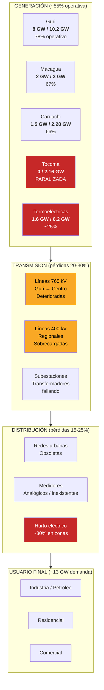
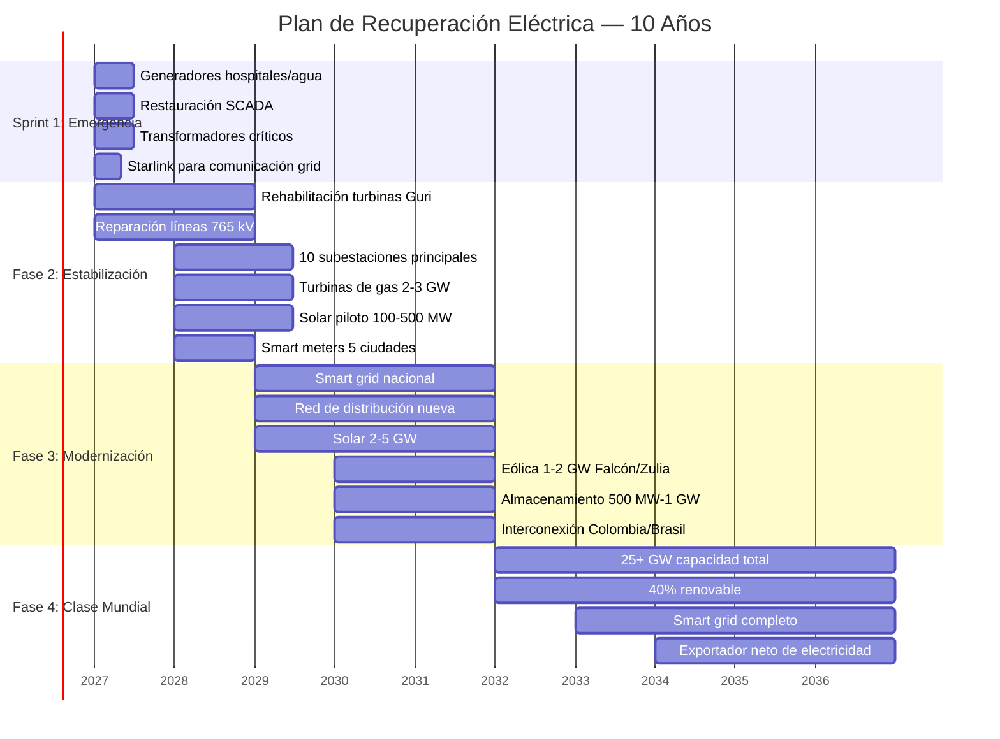
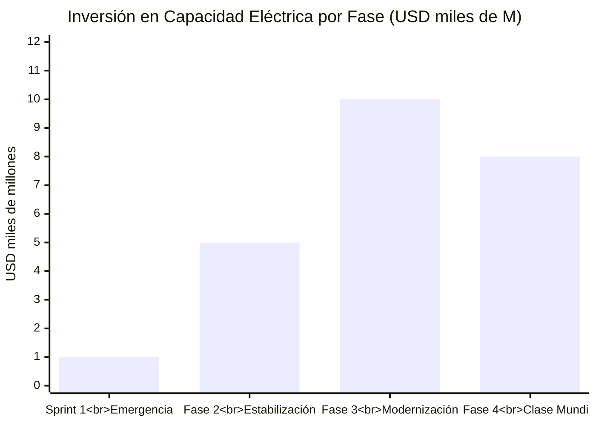
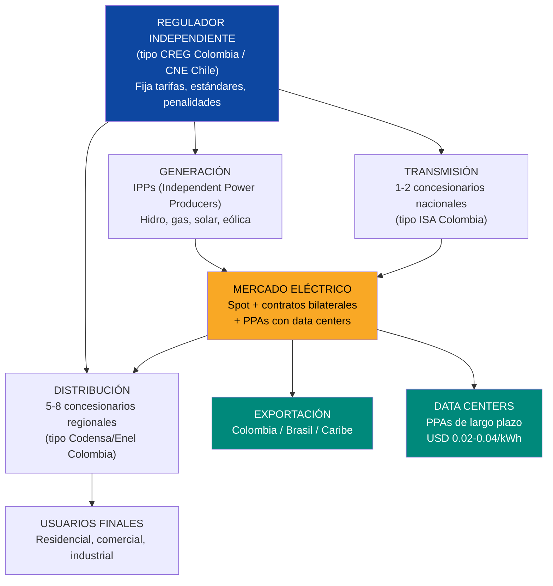
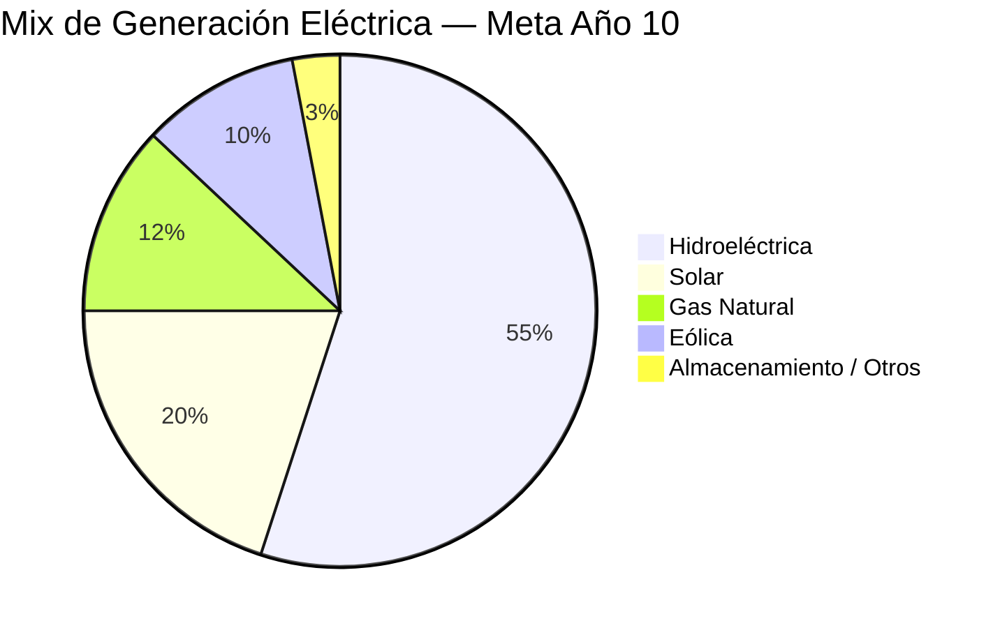
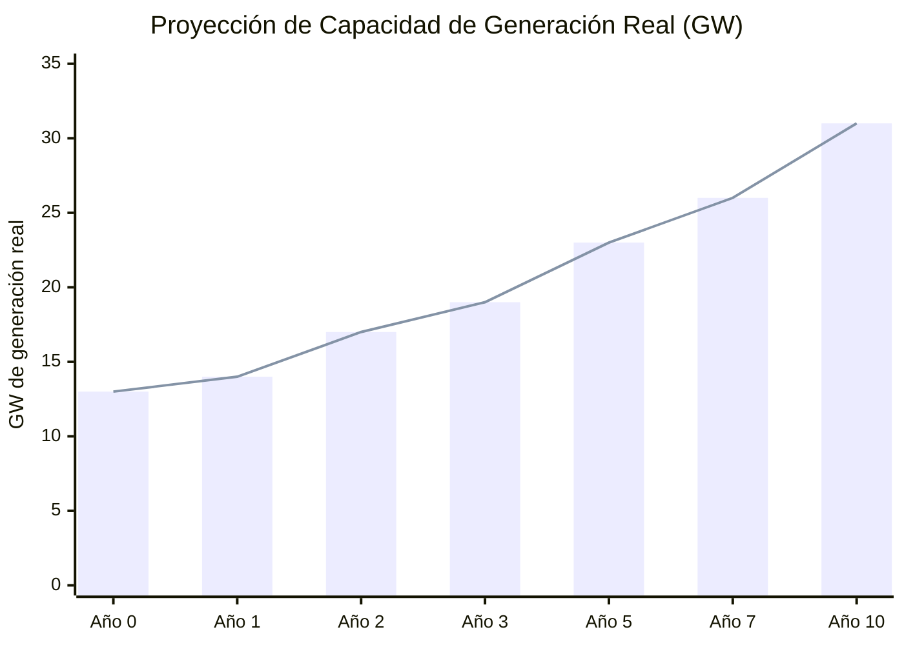

# Capacidad Eléctrica: Sin Luz No Hay Plan

> **"El sistema eléctrico es el cuello de botella más crítico para la recuperación de Venezuela."**
> — [U.S. Department of Energy, 2025](https://www.energy.gov/)

Sin electricidad confiable no hay data centers. No hay producción petrolera. No hay estado digital. No hay cadena de frío para alimentos. No hay hospitales funcionando. No hay inversión extranjera.

**Cada dólar invertido en electricidad habilita USD 5-10 en inversión privada en otros sectores.** Es la infraestructura que habilita todas las demás.

---

## 1. La Oportunidad

Venezuela tiene algo que la mayoría de países en desarrollo matarían por tener: **17 GW de capacidad hidroeléctrica instalada** en la Cascada del Caroní. Eso es más que toda la capacidad renovable de Chile. El problema no es la capacidad — es que el sistema se dejó caer.

| Lo que tiene Venezuela | Lo que necesita |
|------------------------|-----------------|
| 17 GW hidro instalados | Rehabilitar para producir >14 GW reales |
| Irradiación solar 5-6 kWh/m2/día (top Americas) | Instalar paneles y plantas solares |
| 5.500 BCM de gas natural (7mo mundial) | Turbinas de gas para respaldo/picos |
| Fronteras con Colombia y Brasil | Infraestructura de interconexión para exportar |
| Demanda interna de solo ~13 GW | Capacidad de sobra para data centers + exportación |

La oportunidad no es solo reparar. Es **modernizar a estándares de smart grid** y convertir la electricidad en un **producto de exportación** y un **imán para inversión tech**.

---

## 2. El Estado Actual: Radiografía de un Colapso

:::danger Sistema en estado crítico
El sistema eléctrico venezolano ha perdido **>30% de su capacidad de generación** por falta de mantenimiento, corrupción y fuga de personal calificado. [CORPOELEC](https://es.wikipedia.org/wiki/Corpoelec) opera con menos del 50% de su personal técnico original. Los apagones son crónicos: en 2019 un blackout nacional duró 5 días; desde entonces, cortes diarios afectan a 23 de 24 estados.
:::

### Plantas principales — Estado actual

| Planta | Tipo | Capacidad Instalada | Producción Real Est. | % Operativo | Problema Principal |
|--------|------|---------------------|----------------------|-------------|-------------------|
| **Guri** (Simón Bolívar) | Hidro | 10.200 MW | ~8.000 MW | ~78% | Turbinas sin mantenimiento, SCADA obsoleto, sedimentación |
| **Macagua I, II, III** | Hidro | 3.000 MW | ~2.000 MW | ~67% | Turbinas deterioradas, transformadores fallando |
| **Caruachi** | Hidro | 2.280 MW | ~1.500 MW | ~66% | Mantenimiento diferido, control electrónico obsoleto |
| **Tocoma** (inconclusa) | Hidro | 2.160 MW (diseño) | **0 MW** | **0%** | Obra paralizada desde 2016, USD 10B+ invertidos sin terminar |
| **Planta Centro** | Termo (gas/fuel) | 2.000 MW | ~400 MW | ~20% | Calderas dañadas, falta de combustible, corrosión |
| **Tacoa** (Josefa Camejo) | Termo (gas/fuel) | 1.700 MW | ~500 MW | ~29% | Explosiones previas, equipos obsoletos, fuel oil escaso |
| **Termo Zulia** | Termo (gas) | 470 MW | ~150 MW | ~32% | Turbinas fuera de servicio, gas insuficiente |
| **Otras termoeléctricas** | Varias | ~2.000 MW | ~500 MW | ~25% | Abandono generalizado |
| **TOTAL** | — | **~23.800 MW** | **~13.050 MW** | **~55%** | — |

Fuentes: [Power Technology](https://www.power-technology.com/projects/gurihydroelectric/) (Guri); [Mongabay 2023](https://news.mongabay.com/2023/08/hydropower-in-the-pan-amazon-the-guri-complex-and-the-caroni-cascade/) (Cascada Caroní); [Columbia CGEP](https://www.energypolicy.columbia.edu/more-efficient-use-of-venezuelas-natural-gas-could-strengthen-the-regions-energy-security-and-the-countrys-electricity-sector/) (gas y electricidad); estimaciones propias basadas en reportes 2024-2025.

### El mapa del problema

### Pérdidas en cascada: de generación a usuario final

| Etapa | Capacidad / Energía | Pérdida | Causa |
|-------|---------------------|---------|-------|
| Generación (instalada) | 23.800 MW | — | — |
| Generación (real) | ~13.050 MW | **-45%** | Plantas fuera de servicio, mantenimiento diferido |
| Transmisión | ~9.800 MW | **-25%** | Líneas deterioradas, transformadores fallando |
| Distribución | ~7.800 MW | **-20%** | Redes obsoletas, hurto eléctrico |
| **Llega al usuario** | **~7.800 MW** | **-67% del total** | Un tercio de lo instalado |

**Traducción:** de cada 3 MW instalados, solo 1 llega al usuario final. Un sistema bien mantenido pierde 8-12%, no 67%.

---

## 3. Lo Que Se Necesita — Plan de Recuperación Eléctrica

### Sprint 1 (Meses 1-6): Emergencia

**Objetivo:** Que no se muera gente por falta de electricidad.

| Acción | Qué resuelve | Costo Est. | Proveedor potencial |
|--------|-------------|------------|---------------------|
| Generadores de emergencia para 500+ hospitales y plantas de agua | Vidas humanas, cadena de frío | USD 150-300M | Caterpillar, Cummins, Aggreko |
| Restauración de SCADA en Guri + Macagua | Control y supervisión de generación | USD 50-100M | Siemens Energy, ABB, GE Vernova |
| Reemplazo de 50+ transformadores críticos | Subestaciones colapsadas | USD 200-400M | Hitachi Energy, Siemens, ABB |
| Starlink para backbone de comunicación del grid | Monitoreo remoto de la red | USD 5-10M | SpaceX/Starlink |
| Equipos de reparación de emergencia (brigadas) | Respuesta rápida a fallas | USD 50-100M | Personal + equipo |
| **TOTAL SPRINT 1** | | **USD 500M-1B** | |

:::caution Esto no espera
El Sprint 1 arranca el día 1 de la transición. No requiere reformas legales complejas ni reestructuración de CORPOELEC. Se financia con el primer tramo de forwards petroleros o crédito de emergencia del BID/CAF. Son generadores y transformadores — se compran y se instalan.
:::

### Fase 2 (Meses 6-24): Estabilización

**Objetivo:** Recuperar el 80% de la capacidad instalada y agregar respaldo térmico.

| Acción | Meta | Costo Est. | Impacto |
|--------|------|------------|---------|
| Rehabilitación de turbinas Guri (todas las unidades) | Restaurar de 8 GW a **10 GW** | USD 800M-1.5B | +2 GW de generación limpia |
| Rehabilitación Macagua + Caruachi | Restaurar a **4.5 GW** combinados | USD 500M-1B | +3 GW de generación limpia |
| Reparación líneas 765 kV (Guri → centro del país) | Reducir pérdidas de transmisión a <15% | USD 500M-1B | Más energía llega al norte |
| Upgrade de 10 subestaciones principales | Transformadores nuevos, protecciones | USD 300-600M | Menos apagones urbanos |
| Instalación de turbinas de gas (**2-3 GW** de capacidad de pico) | Respaldo para picos y emergencias | USD 1-2B | Eliminación de racionamiento |
| Solar piloto: **100-500 MW** en Falcón, Zulia, Lara | Diversificación de fuente | USD 100-400M | Generación descentralizada |
| Smart meters en 5 ciudades principales | Control de pérdidas, medición real | USD 100-200M | Reducción de hurto eléctrico |
| **TOTAL FASE 2** | | **USD 3-5B** | |

:::info Turbinas de gas: el respaldo que Venezuela necesita
Venezuela tiene **5.500 BCM de reservas de gas natural** (7mo mundial, [U.S. CRS](https://www.congress.gov/crs-product/IF12448)). El 80% es gas asociado a petróleo — se quema o se ventea. Convertir ese gas en electricidad con turbinas modernas (GE HA, Siemens SGT-8000H) resuelve dos problemas: (1) respaldo eléctrico para picos de demanda, (2) ingresos en vez de desperdicio. Una turbina de ciclo combinado de 400 MW cuesta ~USD 300-400M y se instala en 18-24 meses.
:::

### Fase 3 (Año 2-5): Modernización

**Objetivo:** Smart grid + renovables + interconexión regional.

| Acción | Meta | Costo Est. | Referencia |
|--------|------|------------|-----------|
| Despliegue de smart grid nacional | Monitoreo en tiempo real, autodiagnóstico, respuesta automática | USD 1-2B | [Smart grid market USD 52B → 154B](https://www.grandviewresearch.com/industry-analysis/smart-grid-market) (CAGR 16.8%) |
| Reconstrucción de red de distribución | Pérdidas <10%, confiabilidad 99%+ | USD 1.5-3B | Colombia: concesiones de distribución |
| Plantas solares **2-5 GW** | Generación distribuida + exportación | USD 1.5-3B | Chile: de importador neto a potencia solar en 10 años |
| Parques eólicos **1-2 GW** (Falcón, Zulia, La Guajira) | Complemento a hidro y solar | USD 1-2B | Colombia: La Guajira (mismo corredor de viento) |
| Almacenamiento en baterías **500 MW-1 GW** | Estabilización de red, peak shaving | USD 500M-1B | Australia: Hornsdale Power Reserve (Tesla) |
| Terminación de Tocoma | +2.16 GW de hidro | USD 1-2B | [Requiere investigación: estado actual de obra] |
| Interconexión eléctrica con Colombia y Brasil | Exportación + respaldo mutuo | USD 300-500M | SIEPAC (América Central): modelo de interconexión |
| **TOTAL FASE 3** | | **USD 5-10B** | |

### Fase 4 (Año 5-10): Clase Mundial

**Objetivo:** 25+ GW de capacidad, 40% renovable, exportador neto.

| Acción | Meta | Costo Est. |
|--------|------|------------|
| Expansión solar a **5-8 GW** total | Solar como segunda fuente después de hidro | USD 2-4B |
| Expansión eólica a **2-3 GW** total | Tres corredores eólicos operativos | USD 1-2B |
| Almacenamiento avanzado **2-3 GW** (baterías + hidro reversible) | Estabilización total del grid | USD 1-2B |
| Red de distribución inteligente completa | Smart meters en 100% de conexiones | USD 500M-1B |
| Data center corridor powered (Bolívar) | 500 MW-1 GW dedicados a DCs | Inversión privada |
| Exportación a Colombia, Brasil, Caribe | Revenue stream | USD 500M-1B (infraestructura) |
| **TOTAL FASE 4** | | **USD 5-8B** |

---

## 4. Inversión Total y Fuentes

### Resumen de inversión por fase

| Fase | Inversión | Timeline | Resultado |
|------|-----------|----------|-----------|
| Sprint 1: Emergencia | USD 500M-1B | Meses 1-6 | Hospitales y agua con luz, SCADA restaurado |
| Fase 2: Estabilización | USD 3-5B | Meses 6-24 | 80% capacidad restaurada, gas como respaldo |
| Fase 3: Modernización | USD 5-10B | Año 2-5 | Smart grid, renovables, interconexión |
| Fase 4: Clase Mundial | USD 5-8B | Año 5-10 | 25+ GW, exportador neto, DC corridor |
| **TOTAL** | **USD 15-25B** | **10 años** | **Sistema eléctrico de primer nivel** |

### Fuentes de financiamiento

| Fuente | Monto Est. | Mecanismo | Probabilidad |
|--------|-----------|-----------|-------------|
| **DFC / OPIC (EE.UU.)** | USD 3-5B | Crédito soberano + garantías | Alta (alineado con control de Wright sobre ventas petroleras) |
| **Banco Mundial / IFC** | USD 2-4B | Préstamos de desarrollo + asistencia técnica | Alta (infraestructura crítica) |
| **BID / CAF** | USD 2-3B | Crédito multilateral | Alta (mandato regional) |
| **Forwards petroleros** | USD 2-4B | Ingresos petroleros reinvertidos | Media-alta (depende de producción) |
| **PPP / IPP privados** | USD 3-5B | Concesiones de generación y distribución | Media (depende de marco legal) |
| **Bonos verdes** | USD 1-3B | Mercado de deuda verde (solar + eólica) | Media (requiere rating crediticio) |
| **Cooperación bilateral** | USD 1-2B | Japón (JICA), Corea (KOICA), UE | Media |
| **TOTAL FUENTES** | **USD 15-25B** | | |

:::tip Revenue: la electricidad se paga sola
A diferencia de carreteras o escuelas, la electricidad genera ingresos directos. Con tarifas ajustadas a costo real (no subsidio populista), el sector eléctrico es autosostenible. A USD 0.06-0.08/kWh promedio y 80 TWh/año de ventas, los ingresos brutos son **USD 5-6B/año**. Eso cubre operación + servicio de deuda + expansión. Agregar exportación a Colombia/Brasil (USD 300-500M/año) y ventas a data centers (USD 200-500M/año) y el sector es rentable.
:::

---

## 5. Modelo de Negocio: Concesiones, No CORPOELEC

:::danger CORPOELEC no funciona
CORPOELEC es el ejemplo perfecto de por qué el Estado no debe operar utilities. Fusionó 14 empresas eléctricas en 2007, eliminó competencia, politizó la gestión, perdió talento y dejó la red en ruinas. CORPOELEC se disuelve y sus activos se transfieren a Venezuela S.A., que los aporta como equity en JVs con operadores privados internacionales. El modelo de reconstrucción es **concesiones privadas con regulación estatal, con Venezuela S.A. como accionista en la infraestructura base** — exactamente lo que funciona en Colombia, Chile y Perú.
:::

### Estructura propuesta

### Componentes del modelo

| Componente | Modelo | Referencia | Por qué funciona |
|-----------|--------|-----------|-----------------|
| **Regulador independiente** | CREG (Colombia), CNE (Chile) | [CREG Colombia](https://www.creg.gov.co/) | Tarifas basadas en costo real, no política. Autonomía del ejecutivo |
| **Generación: IPPs** | Licitaciones competitivas | Colombia: 30+ generadores privados | Competencia baja precios, mejora calidad |
| **Transmisión: concesión nacional** | ISA (Colombia, ahora Ecopetrol) | [ISA](https://www.isa.co/) | Red troncal como monopolio natural regulado |
| **Distribución: concesiones regionales** | Enel, AES, Celsia (Colombia) | [Enel Américas](https://www.enel.com/) | Operador privado con estándares de servicio medibles |
| **PPAs con data centers** | Contratos 10-20 años a precio fijo | Chile: PPAs solares para minería | Ingreso predecible, atrae inversión |
| **Mercado eléctrico spot** | Bolsa de energía | Colombia: XM (operador del mercado) | Precio transparente, eficiencia |

### PPAs: el contrato que atrae data centers

Un **Power Purchase Agreement (PPA)** de largo plazo es lo que los hyperscalers necesitan para justificar USD 500M-2B en un data center.

| Término del PPA | Venezuela (propuesta) | Chile (referencia) | EE.UU. (Virginia) |
|-----------------|----------------------|--------------------|--------------------|
| Precio | **USD 0.02-0.04/kWh** | USD 0.04-0.06/kWh | USD 0.06-0.10/kWh |
| Duración | 15-20 años | 10-15 años | 10-15 años |
| Fuente | Hidro + solar | Solar | Gas + nuclear |
| Penalidad por incumplimiento | Sí (estándar ISDA) | Sí | Sí |
| Garantía de suministro | 99.5%+ (con respaldo gas) | 99.9% | 99.99% |

**Ahorro para un DC de 100 MW:** USD 30-50M/año vs. Chile, USD 50-80M/año vs. EE.UU. Sobre un PPA de 15 años: **USD 450M-1.2B de ahorro** por cada 100 MW.

---

## 6. Potencial Renovable: Solar + Eólica + Hidro

### Solar: uno de los mejores recursos del hemisferio

| Dato | Valor | Referencia |
|------|-------|-----------|
| Irradiación solar promedio | **5-6 kWh/m2/día** | [Global Solar Atlas](https://globalsolaratlas.info/) |
| Mejores zonas | Falcón, Zulia, Lara, Nueva Esparta | Irradiación >6 kWh/m2/día |
| Comparación con Chile (Atacama) | Chile: 6-7 kWh/m2/día | Venezuela es comparable en zonas costeras |
| Costo de solar utility-scale (global 2025) | **USD 30-40/MWh** | [IRENA 2024](https://www.irena.org/) |
| Factor de capacidad esperado | 20-25% | Estándar tropical |

:::info Solar + hidro = combinación perfecta
La hidro genera 24/7 pero depende de lluvias. La solar genera de día cuando la demanda es máxima. Juntas, cubren >90% del perfil de demanda sin necesidad de almacenamiento masivo. El gas entra como respaldo para el 10% restante. Es la misma combinación que hace a Brasil uno de los grids más limpios del mundo.
:::

### Eólica: el corredor de La Guajira

Falcón, Zulia y la Península de La Guajira (compartida con Colombia) tienen vientos de **7-9 m/s promedio anual** — entre los mejores de LATAM. Colombia ya tiene proyectos en su lado de La Guajira. Venezuela no tiene un solo parque eólico operativo de escala.

| Zona | Velocidad de viento | Potencial estimado | Factor de capacidad |
|------|---------------------|--------------------|---------------------|
| Falcón (Paraguaná) | 7-9 m/s | 1-2 GW | 30-40% |
| Zulia (Guajira venezolana) | 7-8 m/s | 500 MW-1 GW | 28-35% |
| Nueva Esparta (offshore futuro) | 6-8 m/s | 500 MW-1 GW | 25-35% |

### Mix energético proyectado (Año 10)

| Fuente | Capacidad (GW) | % de generación | Rol |
|--------|----------------|-----------------|-----|
| Hidroeléctrica | 14-16 GW | 55% | Base load, 24/7 |
| Solar | 5-8 GW | 20% | Pico diurno, distribuida |
| Gas natural | 3-4 GW | 12% | Respaldo, picos, balanceo |
| Eólica | 2-3 GW | 10% | Complemento, especialmente nocturno |
| Almacenamiento (baterías + hidro reversible) | 2-3 GW | 3% | Estabilización, peak shaving |
| **TOTAL** | **26-34 GW** | **100%** | **88% renovable (hidro+solar+eólica)** |

---

## 7. Seguridad de Infraestructura Crítica

El grid eléctrico es la infraestructura más crítica del país. Un ataque cibernético o físico puede paralizar todo — hospitales, agua, telecoms, petróleo, defensa. La reconstrucción debe incluir seguridad desde el diseño.

| Dominio | Estándar de referencia | Aplicación en Venezuela |
|---------|----------------------|------------------------|
| **Ciberseguridad del grid** | [NERC CIP](https://www.nerc.com/pa/Stand/Pages/CIPStandards.aspx) (EE.UU.) | Estándar obligatorio para todo operador del grid |
| **Seguridad física** | IEEE 1402 | Protección perimetral de subestaciones y plantas |
| **Comunicaciones de control** | IEC 62351 | Encriptación de comunicaciones SCADA |
| **Resiliencia ante desastres** | IEEE 1366 (SAIDI/SAIFI) | Métricas de confiabilidad y tiempo de restauración |
| **Centro de operaciones** | SOC 24/7 | Centro de ciberseguridad para el sector eléctrico |

### Plan de seguridad

| Acción | Costo Est. | Timeline |
|--------|-----------|----------|
| Implementación NERC CIP en generación y transmisión | USD 50-100M | Años 1-3 |
| Seguridad física de 50 subestaciones críticas | USD 100-200M | Años 1-2 |
| Centro de Ciberseguridad Eléctrica (SOC) | USD 20-50M | Año 1 |
| Red de comunicaciones redundante (fibra + Starlink) | USD 30-60M | Años 1-2 |
| Plan de respuesta a incidentes y simulacros | USD 10-20M/año | Continuo |
| **TOTAL** | **USD 200-400M** | |

---

## 8. Capital Humano: El Problema Invisible

:::danger Sin ingenieros no hay grid
Venezuela ha perdido el **60-70% de sus ingenieros eléctricos y técnicos** por emigración. CORPOELEC opera con personal sub-calificado, mal pagado y sin herramientas. No puedes reconstruir un grid de 25 GW sin gente que sepa operarlo.
:::

| Necesidad | Cantidad | Timeline | Cómo |
|-----------|----------|----------|------|
| Ingenieros eléctricos senior | 2.000-3.000 | Años 1-5 | Retorno de diáspora (salarios competitivos USD 3.000-8.000/mes) |
| Técnicos de línea y subestaciones | 5.000-8.000 | Años 1-5 | Programas de formación acelerada (12-18 meses) |
| Especialistas SCADA / smart grid | 500-1.000 | Años 2-5 | Certificaciones Siemens/ABB/GE + diáspora |
| Operadores de planta | 1.000-2.000 | Años 1-3 | Reentrenamiento de personal existente |
| Especialistas en ciberseguridad OT | 200-500 | Años 2-5 | Programas con SANS Institute, ISA/IEC |
| **TOTAL** | **10.000-15.000** | **5 años** | |

**Inversión en capital humano:** USD 200-500M en 5 años (salarios, formación, certificaciones, equipos).

---

## 9. Exportación de Electricidad: Revenue Stream

Venezuela puede ser **exportador neto de electricidad** hacia Colombia, Brasil y el Caribe. La infraestructura de interconexión es relativamente barata comparada con generación.

| Destino | Capacidad exportable | Ingreso anual est. | Infraestructura necesaria | Costo |
|---------|---------------------|---------------------|---------------------------|-------|
| **Colombia** | 500-1.000 MW | USD 200-400M/año | Línea 500 kV Zulia → Norte de Santander | USD 200-300M |
| **Brasil** | 300-500 MW | USD 100-200M/año | Línea 500 kV Bolívar → Roraima | USD 150-250M |
| **Caribe** (cable submarino) | 100-200 MW | USD 50-100M/año | Cable submarino a Trinidad/Curazao | USD 200-400M |
| **TOTAL** | **1.000-1.700 MW** | **USD 350-700M/año** | | **USD 500M-1B** |

:::info Colombia ya importa electricidad
Colombia importa electricidad de Ecuador cuando la sequía afecta sus embalses. Venezuela, con Guri y la Cascada del Caroní restaurados, puede ser el proveedor natural por proximidad geográfica. Brasil (estado de Roraima) no tiene conexión al grid nacional brasileño — se alimenta de generadores diésel. Una línea desde Bolívar resolvería eso a costo competitivo.
:::

---

## 10. Aliados Potenciales

| Empresa / Entidad | País | Capacidad | Rol potencial |
|-------------------|------|-----------|---------------|
| **Siemens Energy** | Alemania | Turbinas gas, SCADA, smart grid | Rehabilitación Guri, turbinas de gas, control |
| **ABB** | Suiza | Transformadores, transmisión, automatización | Subestaciones, SCADA, smart grid |
| **GE Vernova** | EE.UU. | Turbinas gas/hidro, grid solutions | Turbinas de gas, rehabilitación hidro |
| **Hitachi Energy** | Japón/Suiza | Transformadores, HVDC, grid | Transmisión de alta tensión, transformadores |
| **Schneider Electric** | Francia | Distribución, smart grid, EMS | Distribución, smart meters, gestión energía |
| **AES Corporation** | EE.UU. | IPP, almacenamiento, renovables | Operador de generación/distribución |
| **Enel** | Italia | IPP, distribución, renovables | Concesionario de distribución |
| **Iberdrola** | España | Renovables, distribución | Operador eólico/solar, distribución |
| **U.S. DOE** | EE.UU. | Asistencia técnica, financiamiento | Ya engaged (Wright visitó Caracas) |
| **Banco Mundial / IFC** | Multilateral | Financiamiento, asistencia técnica | Préstamos de desarrollo eléctrico |
| **BID / CAF** | Multilateral | Financiamiento regional | Crédito para infraestructura |

---

## 11. Comparables: Quién Lo Ha Hecho

### Colombia: de apagones a grid confiable

| Antes (1990s) | Después (2000s+) | Cómo |
|---------------|------------------|------|
| Racionamiento eléctrico por meses | 99.5%+ de confiabilidad | Privatización de generación y distribución |
| Hidroeléctrica concentrada (vulnerable a El Nino) | Mix diversificado (hidro + gas + solar + eólica) | Subastas de energía firme |
| Tarifas políticas subsidiadas | Tarifas a costo real con subsidio focalizado | CREG como regulador independiente |
| ICEL (empresa estatal, ineficiente) | ISA, Celsia, EPM, Enel (competencia) | Ley de Servicios Públicos 142/1994 |

**Lección:** Colombia tomó 10-15 años pero pasó de racionamiento a exportador de electricidad. El regulador independiente (CREG) fue clave.

### Chile: de importador a potencia solar

| Dato | Chile 2010 | Chile 2025 | Fuente |
|------|-----------|-----------|--------|
| Generación solar | ~0 MW | **8.000+ MW** | [CNE Chile](https://www.cne.cl/) |
| Costo solar | N/A | **USD 30-40/MWh** | IRENA |
| % renovable (excl. hidro) | <5% | **35%+** | [Coordinador Eléctrico Nacional](https://www.coordinador.cl/) |
| Exporta electricidad | No | Estudia exportar a Argentina | — |

**Lección:** Chile demostró que un país con alto recurso solar puede transformar su matriz en 10 años con subastas competitivas y regulación predecible. Venezuela tiene recurso solar comparable y además tiene hidro.

### Ruanda: smart grid en país en desarrollo

| Dato | Ruanda 2010 | Ruanda 2025 | Fuente |
|------|-----------|-----------|--------|
| Acceso a electricidad | 10% | **75%+** | [Banco Mundial](https://www.worldbank.org/) |
| Smart meters instalados | 0 | **500.000+** | [Rwanda Energy Group](https://www.reg.rw/) |
| Pérdidas en distribución | 25%+ | **<15%** | Banco Mundial |
| Tiempo de conexión nueva | Meses | **<7 días** | Doing Business |

**Lección:** Si Ruanda pudo desplegar smart meters y smart grid con un PIB de USD 14B, Venezuela con USD 82B y 17 GW de hidro puede hacerlo mejor y más rápido.

---

## 12. Riesgos y Mitigaciones

| Riesgo | Probabilidad | Impacto | Mitigación |
|--------|-------------|---------|-----------|
| **Sequía severa reduce generación hidro** | Media | Alto | Diversificación: gas + solar + eólica reducen dependencia hidro de 78% a 55% |
| **Inversión insuficiente / retrasos** | Media-alta | Alto | Financiamiento multilateral + forwards petroleros aseguran capital. Fases independientes |
| **Sabotaje o ataque al grid** | Media | Muy alto | NERC CIP + seguridad física + redundancia + SOC 24/7 |
| **Fuga continua de capital humano** | Alta | Alto | Salarios competitivos (USD 3.000-8.000/mes), certificaciones, carrera técnica |
| **Marco legal inadecuado para IPPs** | Media | Alto | Ley de concesiones eléctricas como prioridad legislativa (modelo Colombia Ley 142/1994) |
| **Corrupción en contratos** | Alta | Alto | Licitaciones internacionales, veeduría multilateral (Banco Mundial + BID), transparencia EITI |
| **Resistencia sindical / política a privatización** | Media | Medio | Modelo de transición: retirar/capacitar/emprender. No despidos masivos |
| **Volatilidad del precio del gas** | Media | Medio | Gas doméstico a precio regulado. PPAs de largo plazo para solar/eólica |
| **Tocoma: obra irrecuperable** | Media | Medio | Evaluación independiente. Si no es viable, reasignar fondos a solar/eólica |

---

## 13. Proyección a 10 Años

| Indicador | Año 0 (actual) | Año 1 | Año 2 | Año 3 | Año 5 | Año 7 | Año 10 |
|-----------|----------------|-------|-------|-------|-------|-------|--------|
| **Generación real (GW)** | ~13 | 14 | 17 | 19 | 23 | 26 | 28-34 |
| **Capacidad instalada (GW)** | ~24 | 25 | 27 | 29 | 33 | 37 | 40-45 |
| **Pérdidas transmisión** | 25-30% | 22% | 18% | 15% | 12% | 10% | 8% |
| **Pérdidas distribución** | 20-25% | 20% | 17% | 14% | 10% | 8% | 6% |
| **Confiabilidad (SAIDI hrs/año)** | >100 | 80 | 50 | 30 | 15 | 8 | <4 |
| **% renovable (hidro+solar+eólica)** | 78% (solo hidro) | 78% | 80% | 82% | 85% | 87% | 88% |
| **Inversión acumulada (USD B)** | 0 | 1 | 5 | 8 | 15 | 20 | 25 |
| **Smart meters (millones)** | 0 | 0.1 | 0.5 | 1.5 | 4 | 7 | 10+ |
| **Exportación (MW)** | 0 | 0 | 0 | 100 | 500 | 1.000 | 1.500+ |
| **Empleos directos en sector** | ~15.000 | 20.000 | 30.000 | 40.000 | 55.000 | 65.000 | 75.000+ |
| **Ingreso bruto sector (USD B/año)** | ~1 | 1.5 | 2.5 | 3.5 | 5 | 6 | 7-8 |

---

## Resumen Ejecutivo

| Parámetro | Valor |
|-----------|-------|
| **Inversión total** | USD 15-25B en 10 años |
| **Capacidad meta (año 10)** | 28-34 GW de generación real |
| **Mix renovable** | 88% (hidro 55% + solar 20% + eólica 10% + almacenamiento 3%) |
| **Exportación** | 1.500+ MW a Colombia, Brasil, Caribe |
| **Ingreso bruto año 10** | USD 7-8B/año |
| **Empleos directos** | 75.000+ |
| **Modelo** | Concesiones privadas + regulador independiente (no CORPOELEC) |
| **ROI** | Sector autosostenible desde año 3-4 con tarifas a costo real |

:::tip La electricidad es el prerequisito de todo
Sin electricidad confiable: no hay data centers (USD 0 de inversión tech), no hay producción petrolera estable (PDVSA pierde USD 500M-1B/año por apagones), no hay estado digital (Estonia no funciona sin luz), no hay cadena de frío (alimentos se pierden), no hay hospitales funcionando.

**USD 15-25B en electricidad habilitan USD 550-750B del plan total.** Es el mejor ROI de todo el presupuesto.
:::

---

## Documentos Relacionados

- [Data Centers IA](./data-centers-ia) — Data centers como principal cliente de la energia hidroelectrica excedente de Guri
- [Energia Renovable](./energia-renovable) — Solar y eolica complementan la base hidroelectrica para un mix 85%+ renovable
- [Minerales Criticos](./minerales-criticos) — Fundiciones de aluminio y plantas de hierro como grandes consumidores industriales de electricidad
- [Manufactura Industrial](./manufactura-industrial) — Electricidad confiable como prerequisito para reactivacion industrial
- [Telecomunicaciones](./telecomunicaciones) — Torres de telecoms y estaciones base requieren electricidad estable
- [Modelo de Concesiones](./modelo-concesiones) — Concesiones de generacion, transmision y distribucion electrica (50-80 anos)

---

Fuentes principales: [Power Technology](https://www.power-technology.com/projects/gurihydroelectric/); [Mongabay 2023](https://news.mongabay.com/2023/08/hydropower-in-the-pan-amazon-the-guri-complex-and-the-caroni-cascade/); [Columbia CGEP](https://www.energypolicy.columbia.edu/more-efficient-use-of-venezuelas-natural-gas-could-strengthen-the-regions-energy-security-and-the-countrys-electricity-sector/); [U.S. CRS — Venezuela Natural Gas](https://www.congress.gov/crs-product/IF12448); [CREG Colombia](https://www.creg.gov.co/); [IRENA](https://www.irena.org/); [Grand View Research — Smart Grid](https://www.grandviewresearch.com/industry-analysis/smart-grid-market); [Global Solar Atlas](https://globalsolaratlas.info/); [NERC CIP Standards](https://www.nerc.com/pa/Stand/Pages/CIPStandards.aspx).
