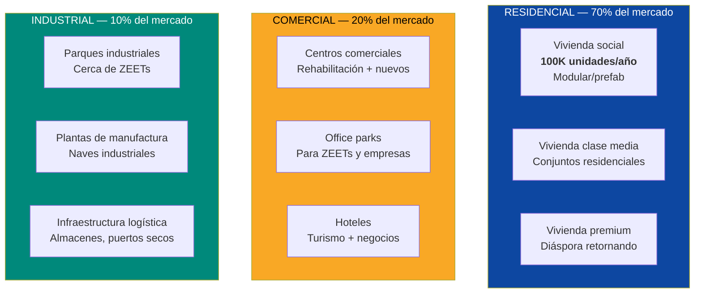
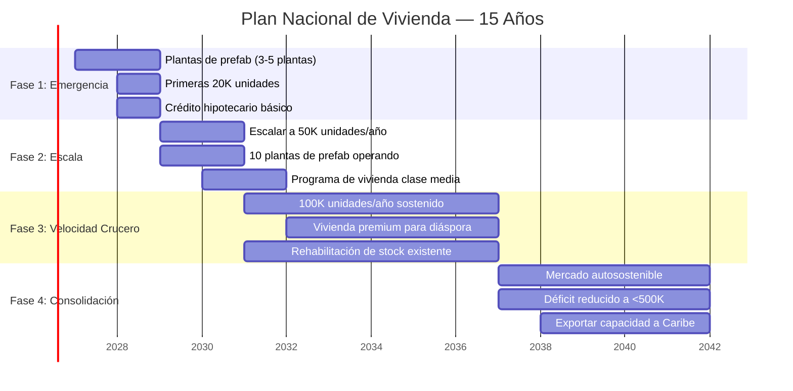
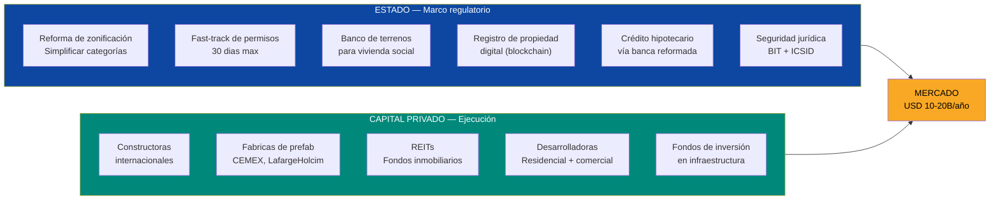
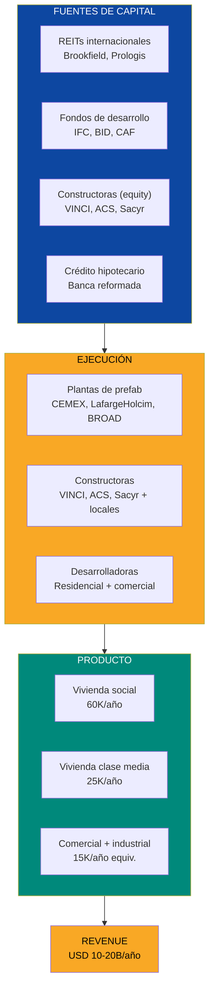
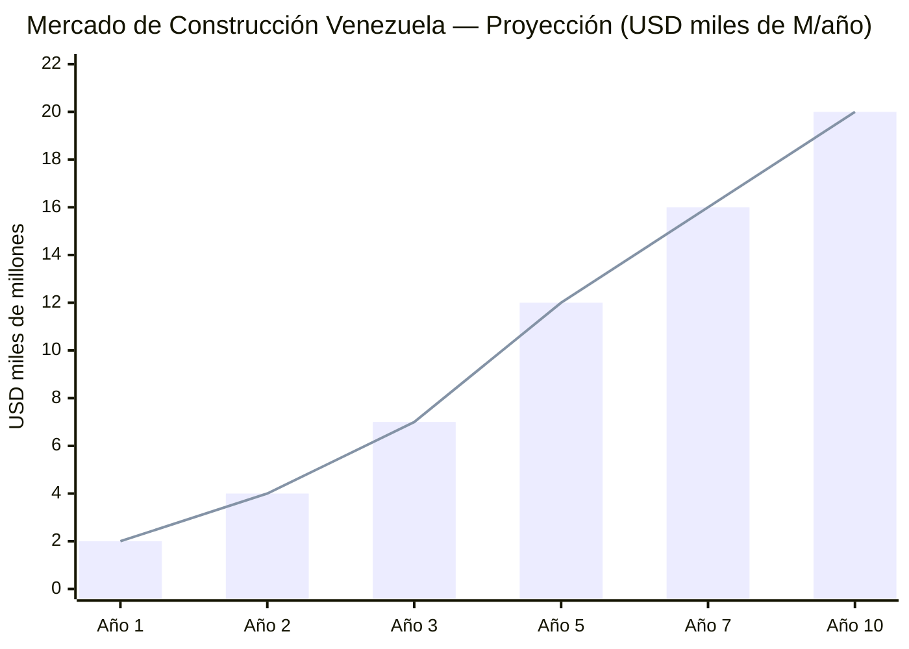

# Construcción e Inmobiliaria: Reconstruir un País Entero

> Venezuela necesita entre **3 y 4 millones de viviendas**. Cada edificio comercial que no se cayó fue abandonado. Cada centro comercial que no cerró fue saqueado. No hay cemento, no hay cabilla, no hay grúas. La industria de la construcción colapsó al mismo ritmo que el país. Eso no es solo un problema — es el mercado de construcción más grande de América Latina esperando a ser desbloqueado.

---

## 1. La Oportunidad: USD 10-20B/Año en un Mercado Virgen

:::danger Déficit habitacional crítico
Venezuela tiene un déficit acumulado de **3-4 millones de viviendas** — [Requiere investigación: cifra exacta post-2020]. La Gran Misión Vivienda Venezuela (GMVV) construyó ~3,9 millones de unidades según cifras oficiales, pero la calidad es cuestionable (estructuras sin servicios, sin urbanismo, sin mantenimiento) y la demanda creció más rápido que la oferta. Con 7,9 millones de emigrantes ([UNHCR, dic. 2025](https://www.unhcr.org/us/emergencies/venezuela-situation)) potencialmente retornando, el déficit real podría alcanzar **5 millones de unidades**.
:::

| Dato | Cifra | Fuente |
|------|-------|--------|
| Déficit habitacional estimado | **3-4 millones de unidades** | [Requiere investigación] |
| Viviendas GMVV construidas (2011-2025) | ~3,9 M (calidad cuestionable) | Gobierno Venezuela |
| Diáspora potencial retorno | **7,9 M personas** | [UNHCR, dic. 2025](https://www.unhcr.org/us/emergencies/venezuela-situation) |
| Mercado construcción LATAM (2025) | **USD 430.000 M** | [Requiere investigación] |
| Mercado construcción Venezuela pre-crisis (2012) | ~USD 15.000 M/año | [Requiere investigación] |
| Mercado construcción Venezuela actual | **<USD 1.000 M/año** | [Requiere investigación] |
| Mercado potencial reconstruido | **USD 10-20.000 M/año** | Proyección propia basada en comparables regionales |

**Traducción para no-técnicos:** Imagina un país del tamaño de Texas donde no se ha construido nada en 15 años. Todo está roto, abandonado o en ruinas. Ahora imagina que 8 millones de personas quieren volver y necesitan donde vivir. Eso es Venezuela hoy. El constructor que entre primero captura el mercado más grande del hemisferio.

### Sectores de oportunidad

---

## 2. El Problema: Por Qué No Se Construye Nada

La industria de la construcción venezolana no está debilitada — está **muerta**. Entender por qué es requisito para diseñar la solución.

| Problema | Severidad | Descripción |
|----------|-----------|-------------|
| **Cero materiales de construcción** | CRÍTICO | Plantas de cemento nacionalizadas y paralizadas. Producción de cabilla al <10%. No hay vidrio, no hay cerámica, no hay pintura industrial |
| **Sin maquinaria** | CRÍTICO | Grúas, excavadoras, mezcladoras — todo se fue con las empresas que expropiaron. [Requiere investigación] |
| **Sin mano de obra calificada** | CRÍTICO | Albañiles, electricistas, plomeros, ingenieros civiles — emigraron o cambiaron de oficio |
| **Sin crédito hipotecario** | CRÍTICO | Sistema bancario colapsado. No existe financiamiento a largo plazo para vivienda |
| **Permisos y burocracia** | ALTO | Permiso de construcción puede tomar 2+ años. Cadena de sobornos en cada nivel |
| **Propiedad sobre terrenos** | ALTO | Registro de propiedad destruido/corrupto. Invasiones de terrenos. Inseguridad jurídica |
| **Expropiaciones pasadas** | ALTO | El gobierno expropió constructoras (Cementos Lafarge, Holcim), materiales y terrenos. Los inversores tienen memoria |

:::caution La lección de las expropiaciones
Entre 2007-2012, el gobierno de Chávez/Maduro expropió **cementeras** (Lafarge, Holcim, CEMEX), **siderúrgicas** (Sidor/Ternium), **constructoras privadas** y miles de terrenos. Resultado: producción de cemento cayó de **10 M ton/año a <2 M ton/año**. Producción de cabilla cayó de **1,5 M ton a <200K ton/año**. **Ninguna empresa internacional invertirá sin garantías jurídicas blindadas** — ver [Roadmap de Sanciones](/04-gobernanza/roadmap-sanciones).
:::

### Cadena de suministro destruida

---

## 3. La Solución: Construcción Modular a Escala Nacional

### Principio rector

> Ni el Estado ni Venezuela S.A. construyen directamente. El Estado regula el marco legal y la seguridad. Venezuela S.A. aporta terrenos como equity en JVs de construcción y cobra regalías como accionista del holding ciudadano. El capital privado financia. Las constructoras internacionales ejecutan. La tecnología modular/prefab acelera.

### Por qué construcción modular

La construcción tradicional toma 18-36 meses por proyecto residencial. Venezuela no puede esperar. La construcción **modular/prefabricada** reduce tiempos a **3-6 meses** por edificio y permite producción en serie.

| Métrica | Construcción tradicional | Construcción modular | Ventaja |
|---------|-------------------------|----------------------|---------|
| Tiempo de construcción | 18-36 meses | **3-6 meses** | 4-6x más rápido |
| Costo por m2 | USD 600-1.000 | **USD 400-700** | 20-40% más barato |
| Desperdicio de materiales | 20-30% | **5-10%** | Menos residuos |
| Calidad | Variable | **Controlada en fábrica** | Estándar garantizado |
| Escalabilidad | Limitada | **Producción en serie** | 100K unidades/año posible |

Fuentes: [McKinsey — Modular construction report](https://www.mckinsey.com/business-functions/operations/our-insights/modular-construction-from-projects-to-products) (2019); [World Economic Forum](https://www.weforum.org/agenda/2023/08/what-is-modular-construction-and-could-it-fix-the-housing-crisis/) (2023).

### Plan de vivienda: 100K unidades/año durante 15 años

| Fase | Unidades/año | Inversión anual est. | Empleos directos | Producto |
|------|-------------|---------------------|------------------|----------|
| **Fase 1** (Año 1-2) | 20.000 | USD 2-3B | 50.000-80.000 | Vivienda social + emergencia |
| **Fase 2** (Año 3-4) | 50.000 | USD 5-7B | 150.000-200.000 | Social + clase media |
| **Fase 3** (Año 5-10) | 100.000 | USD 10-15B | 400.000-600.000 | Todas las categorías |
| **Fase 4** (Año 11-15) | 100.000 | USD 10-15B | 500.000-700.000 | Mercado maduro |
| **Total 15 años** | **1.500.000** | **USD 120-200B** | — | Déficit reducido en 50%+ |

:::tip 100K viviendas/año: ambicioso pero factible
China construye **~10 millones de viviendas/año**. Colombia construye **~200.000/año** con un PIB similar al que Venezuela tendrá en la recuperación. Turquía construyó **~800.000/año** después del terremoto de 2023. Con plantas de prefab modernas y capital internacional, **100K/año es conservador** para un déficit de 4+ millones.
:::

---

## 4. Segmentos de Mercado

### 4.1 Vivienda social (60% del mercado)

| Parámetro | Detalle |
|-----------|---------|
| **Unidades objetivo** | 60.000/año (en velocidad crucero) |
| **Tipo** | Apartamentos de 50-70 m2, edificios de 4-8 pisos, conjuntos urbanizados |
| **Costo por unidad** | USD 25.000-40.000 |
| **Precio de venta** | USD 20.000-35.000 |
| **Financiamiento** | Subcuenta Vivienda del FCV (4-5% del salario) como pago inicial + crédito hipotecario a 15-20 años. Subsidio focalizado solo para extrema pobreza |
| **Ubicación** | Periferias urbanas de Caracas, Maracaibo, Valencia, Barquisimeto, Ciudad Guayana |
| **Modelo** | FCV acumula el enganche. Banca privada presta con garantía de Venezuela S.A. Subsidio directo solo para familias en extrema pobreza verificada — el Estado no construye, no subsidia universalmente |

### 4.2 Vivienda clase media (25% del mercado)

| Parámetro | Detalle |
|-----------|---------|
| **Unidades objetivo** | 25.000/año |
| **Tipo** | Casas adosadas y apartamentos de 70-120 m2, conjuntos con amenidades |
| **Costo por unidad** | USD 50.000-120.000 |
| **Financiamiento** | Crédito hipotecario comercial a 15-30 años |
| **Demanda principal** | Diáspora retornando, profesionales, familias en crecimiento |

### 4.3 Vivienda premium y comercial (15% del mercado)

| Parámetro | Detalle |
|-----------|---------|
| **Tipo** | Residencias premium, office parks, hoteles, centros comerciales |
| **Inversión por proyecto** | USD 20-200M |
| **Demanda** | Empresas entrando al mercado, diáspora con capital, turismo de negocios |
| **Formato** | Desarrollo mixto (residencial + comercial + retail) |

### 4.4 Parques industriales (vinculado a ZEETs)

| Parámetro | Detalle |
|-----------|---------|
| **Ubicación** | Junto a ZEETs ([Hubs Tech](/05-transformacion/hubs-tech)) en Valencia, Puerto La Cruz, Ciudad Guayana, Punto Fijo |
| **Tipo** | Naves industriales, almacenes, centros logísticos, oficinas tech |
| **Superficie** | 500-2.000 hectáreas por parque |
| **Inversión por parque** | USD 200-500M |
| **Modelo** | Build-to-suit + especulativo. Concesión a 30-50 años |

---

## 5. Qué Provee el Estado vs. Qué Provee el Capital Privado

### Lo que el Estado DEBE hacer (y SOLO eso)

| Acción del Estado | Qué resuelve | Timeline | Costo |
|---------------------|-------------|----------|-------|
| **Reforma de zonificación** | Categorización simple: residencial, comercial, industrial, mixto. Eliminación de 47 categorías actuales | 6 meses | USD 5-10M (consultoría) |
| **Fast-track de permisos** | Permiso de construcción en **30 días max** (hoy: 2+ años). Ventanilla única digital | 12 meses | USD 20-50M (sistema digital) |
| **Banco nacional de terrenos** | Inventario de terrenos públicos disponibles para vivienda social. Cesión a largo plazo a constructoras | 12-18 meses | USD 10-20M (catastro) |
| **Registro de propiedad digital** | Blockchain para títulos de propiedad. Resolución de disputas. Fin de invasiones | 18-24 meses | USD 50-100M |
| **Ley de crédito hipotecario** | Marco legal para hipotecas a 15-30 años en USD. Garantía vía Venezuela S.A. (tipo FHA de EE.UU.) | 12 meses | Garantías: USD 500M-1B |
| **Protección al inversor** | Reingreso a ICSID. BIT con EE.UU. Ley anti-expropiación con rango constitucional | 12-24 meses | USD 5-10M (legal) |

:::info Modelo FHA: cómo EE.UU. resolvió su déficit de vivienda
La **Federal Housing Administration (FHA)** de EE.UU. no construye casas. Garantiza hipotecas para que los bancos presten a compradores de bajos ingresos. Resultado: acceso a vivienda para millones sin que el gobierno ponga un solo ladrillo. Venezuela necesita un mecanismo idéntico — Venezuela S.A. garantiza (deuda corporativa, no soberana), el banco presta, el comprador paga, la constructora construye.
:::

---

## 6. Materiales: Reconstruir la Cadena de Suministro

Sin cemento, cabilla, vidrio y cerámica, no hay construcción. La cadena de suministro se reconstruye en paralelo a la construcción misma.

### Cemento: el cuello de botella #1

| Dato | Valor | Fuente |
|------|-------|--------|
| Producción actual | **<2 M ton/año** | [Requiere investigación] |
| Capacidad instalada (plantas nacionalizadas) | ~10 M ton/año | [Requiere investigación] |
| Necesidad para 100K viviendas/año | **10-15 M ton/año** | Estimación propia |
| Costo de rehabilitación de plantas | USD 500M-1B | Estimación basada en comparables |
| Operadores potenciales | CEMEX, LafargeHolcim, Argos, Votorantim | — |

**Solución:** Devolver plantas cementeras a operadores internacionales vía concesión a 30 años. CEMEX y LafargeHolcim tenían operaciones en Venezuela antes de la expropiación. Compensar expropiaciones (USD 1-2B) como parte del paquete de reestructuración de deuda. A cambio, se comprometen a producir **10+ M ton/año** en 3 años.

### Acero y cabilla

| Dato | Valor | Fuente |
|------|-------|--------|
| Producción actual de cabilla | **<200K ton/año** | [Requiere investigación] |
| Capacidad instalada (Sidor) | ~4,3 M ton/año acero | [Global Energy Monitor](https://www.gem.wiki/CVG_Ferrominera_Orinoco_DRI_plant) |
| Necesidad para construcción | **1-2 M ton/año cabilla** | Estimación propia |
| Solución | JV para reactivación de Sidor + importación temporal | — |

---

## 7. Aliados Potenciales

| Empresa / Entidad | Pais | Capacidad | Rol potencial |
|-------------------|------|-----------|---------------|
| **VINCI Construction** | Francia | Mayor constructora del mundo. Infraestructura + vivienda | EPC para proyectos de vivienda masiva y parques industriales |
| **ACS Group** | España | #2 mundial en construcción. Opera Hochtief, Turner, CIMIC | Megaproyectos de infraestructura, office parks, centros comerciales |
| **Sacyr** | España | Infraestructura LATAM. Opera en 15+ países | Vivienda social, infraestructura urbana, concesiones |
| **CEMEX** | México | Top 3 global en cemento. Operaba en Venezuela antes de expropiación | Rehabilitar plantas cementeras. Suministro de materiales |
| **LafargeHolcim** | Suiza | #1 mundial en materiales de construcción. Expropiada en Venezuela | Ídem CEMEX. Plantas de prefab + cemento |
| **Argos** | Colombia | Líder en cemento en Colombia/LATAM | Suministro desde Colombia como puente + nuevas plantas |
| **BROAD Group** | China | Prefab modular: edificio de 10 pisos en 28 horas | Tecnología de construcción modular a escala |
| **Contech (China)** | China | Prefab y modular para mercados emergentes | Plantas de producción de módulos |
| **Prologis** | EE.UU. | Mayor REIT industrial del mundo | Parques industriales y logísticos cerca de ZEETs |
| **Brookfield Asset Management** | Canadá | USD 925B AUM. Infraestructura + real estate | Fondo de inversión inmobiliaria para Venezuela |
| **IFC / Banco Mundial** | Multilateral | Financiamiento de vivienda social | Crédito + asistencia técnica |
| **BID / CAF** | Multilateral | Financiamiento regional | Programas de vivienda social |
| **Habitat for Humanity** | EE.UU. | Vivienda para familias de bajos ingresos | Complemento para comunidades rurales y vulnerables |

---

## 8. Modelo de Negocio

### Estructura: concesiones + REITs + crédito hipotecario

### Flujos de ingreso

| Línea de negocio | Descripción | Ingreso estimado (velocidad crucero) |
|-----------------|-------------|--------------------------------------|
| **Vivienda social** | 60K unidades/año a USD 30K promedio | USD 1,8B/año |
| **Vivienda clase media** | 25K unidades/año a USD 80K promedio | USD 2B/año |
| **Vivienda premium** | 5K unidades/año a USD 200K promedio | USD 1B/año |
| **Comercial** (oficinas, retail, hoteles) | Desarrollo + alquiler | USD 2-4B/año |
| **Industrial** (parques, naves, logística) | Desarrollo + alquiler | USD 1-3B/año |
| **Materiales** (cemento, cabilla, prefab) | Producción para mercado interno + exportación | USD 2-5B/año |
| **Servicios** (arquitectura, ingeniería, supervisión) | Fees profesionales | USD 500M-1B/año |
| **TOTAL** | | **USD 10-20B/año** |

### Generación de empleo: el mayor empleador del país

| Categoría | Empleos en velocidad crucero |
|-----------|------------------------------|
| **Albañiles y obreros** | 200.000-300.000 |
| **Técnicos especializados** (electricistas, plomeros, soldadores) | 100.000-150.000 |
| **Ingenieros civiles y arquitectos** | 20.000-30.000 |
| **Operadores de maquinaria** | 30.000-50.000 |
| **Fábricas de materiales** (cemento, cabilla, prefab) | 50.000-80.000 |
| **Logística y transporte** | 30.000-50.000 |
| **Ventas, crédito, administración** | 20.000-40.000 |
| **Empleos indirectos** | 300.000-500.000 |
| **TOTAL** | **750.000-1.200.000** |

:::tip Construcción = el programa de empleo más rápido
No existe sector que genere más empleo por dólar invertido que la construcción. Un albañil se capacita en semanas, no años. Cada vivienda construida genera **5-8 empleos directos** durante la obra y **2-3 empleos permanentes** en servicios. Para un país con desempleo de 40-50% (real, no oficial), la construcción es la respuesta inmediata al empleo masivo.
:::

---

## 9. Crédito Hipotecario: La Pieza Faltante

Sin crédito hipotecario no hay mercado inmobiliario. Y Venezuela no tiene crédito hipotecario funcional.

| Parámetro | Venezuela actual | Meta (Año 3-5) | Referencia |
|-----------|-----------------|-----------------|-----------|
| Créditos hipotecarios activos | ~0 funcionales | **500.000+** | Colombia: 1,5 M hipotecas activas |
| Plazo máximo | N/A | **15-30 años** | Colombia/Chile: 15-30 años estándar |
| Moneda | Bolívares (sin valor) | **USD o indexado** | Dolarización de facto |
| Tasa de interés | N/A | **6-10%** (con subsidio: 4-6%) | Colombia: 8-12% |
| Enganche mínimo | N/A | **10-20%** | Colombia: 10-30% |
| Garantía de Venezuela S.A. | No existe | **Fondo de garantía tipo FHA** | EE.UU.: FHA. Colombia: FNA |

### Estructura del sistema hipotecario

| Componente | Modelo | Referencia |
|-----------|--------|-----------|
| **Fondo Nacional de Garantías** | Garantiza 80% del crédito para vivienda social | Colombia: Fondo Nacional de Garantías |
| **Subsidio al comprador** (no al constructor) | Subsidio directo de USD 5.000-15.000 por familia de bajos ingresos | Colombia: Mi Casa Ya |
| **Banca privada** | Presta con garantía de Venezuela S.A. Compite por clientes | Chile: modelo bancario de vivienda |
| **Titularización** | Hipotecas empaquetadas en bonos (MBS) para atraer capital internacional | EE.UU.: Fannie Mae/Freddie Mac |

---

## 10. Comparables Internacionales

| País | Programa | Unidades/año | Qué funcionó | Lección para Venezuela |
|------|----------|-------------|-------------|------------------------|
| **Colombia** | Mi Casa Ya | ~200.000 | Subsidio al comprador (no al constructor). USD 6.000-12.000 por familia. Crédito a 20 años | Modelo directo. Gobierno subsidia demanda, sector privado construye. Funciona desde 2015 |
| **Chile** | Programa DS1/DS49 | ~100.000 | Subsidio escalonado por ingreso. Mixtura social obligatoria. Crédito hipotecario a 20-30 años | Integración social + calidad de construcción. Chile pasó de 25% déficit a <10% en 20 años |
| **China** | Prefab industrial | **~10.000.000** | BROAD Group: edificio de 57 pisos en 19 días. Producción en fábrica, ensamblaje en sitio | Velocidad y escala. Venezuela necesita plantas de prefab para alcanzar 100K/año |
| **Turquía** | TOKI (post-terremoto) | ~300.000 (2023-2025) | Agencia estatal coordina, sector privado construye. Velocidad de respuesta | Velocidad post-desastre. Venezuela no tuvo terremoto pero el desastre fue político |
| **Etiopía** | Programa de vivienda Addis Abeba | ~200.000 | Vivienda social masiva con ahorro obligatorio del comprador (10-40% del salario por 5 años) | Modelo de ahorro forzado. Adaptable para Venezuela con menos coerción |

Fuentes: [Colombia Mi Casa Ya](https://minvivienda.gov.co/); [Chile MINVU](https://www.minvu.gob.cl/); [BROAD Group](https://www.broad.com/); [TOKI Turquia](https://www.toki.gov.tr/); [Banco Mundial — vivienda](https://www.worldbank.org/en/topic/housingfinance).

---

## 11. Riesgos y Mitigaciones

| Riesgo | Probabilidad | Impacto | Mitigación |
|--------|-------------|---------|-----------|
| **Constructoras no entran por miedo a expropiación** | Alta | Crítico | Ley anti-expropiación con rango constitucional. Reingreso a ICSID. BIT con EE.UU. Compensación de expropiaciones pasadas como prerequisito |
| **No hay materiales** (cemento, cabilla) | Alta | Crítico | Importación temporal durante 2-3 años. Rehabilitación de plantas en paralelo. Plantas de prefab reducen dependencia de materiales tradicionales |
| **Invasión de terrenos / inseguridad jurídica** | Alta | Alto | Registro digital de propiedad (blockchain). Policía dedicada anti-invasión. Tribunales express para disputas |
| **Déficit de mano de obra calificada** | Media-alta | Alto | Programa de formación acelerada (SENA Colombia como modelo). Repatriación de diáspora con incentivos. Permisos de trabajo para obreros colombianos/peruanos |
| **Burbuja inmobiliaria** | Media | Alto | Regulación de precios en vivienda social. Límites de financiamiento. Supervisión bancaria robusta |
| **Corrupción en permisos y contratos** | Alta | Alto | Ventanilla única digital (sin contacto humano). Licitaciones internacionales transparentes. Auditoría Big 4 |
| **Capacidad fiscal para subsidios** | Media | Medio | Subsidios financiados con ingresos petroleros vía Fondo de Inversión Venezuela S.A.. Techo de USD 1-2B/año en subsidios |

---

## 12. Proyección Financiera (10 Años)

| Indicador | Año 1 | Año 3 | Año 5 | Año 10 |
|-----------|-------|-------|-------|--------|
| **Viviendas construidas (acum.)** | 20.000 | 120.000 | 320.000 | 820.000 |
| **Mercado construcción (USD B/año)** | 2 | 7 | 12 | 20 |
| **Empleos directos** | 80.000 | 300.000 | 600.000 | 1.000.000 |
| **Empleos totales (dir. + ind.)** | 150.000 | 500.000 | 1.000.000 | 1.500.000 |
| **Créditos hipotecarios activos** | 5.000 | 80.000 | 250.000 | 700.000 |
| **Producción cemento (M ton/año)** | 3 | 7 | 10 | 15 |
| **Plantas de prefab operando** | 3 | 8 | 12 | 15+ |
| **Inversión acumulada (USD B)** | 2 | 15 | 35 | 100 |

### Contribución al plan Venezuela S.A.

| Métrica | Valor |
|---------|-------|
| **Ingreso anual (año 10)** | USD 15-20B |
| **% del PIB meta (año 10: ~USD 200B)** | 7-10% |
| **Empleos directos** | 750K-1.2M (mayor empleador del país) |
| **Contribución fiscal** | USD 2-3B/año (15% flat + IVA) |
| **Viviendas construidas (15 años)** | 1,5 millones |
| **Déficit habitacional restante** | Reducido de 4M a <2M |

:::danger El reloj corre
Cada año sin construir, el déficit crece en **~100.000 unidades** por crecimiento demográfico + deterioro del stock existente. Si Venezuela espera 5 años para arrancar, el déficit será de **5+ millones**. La construcción debe ser simultánea con la transición, no posterior. Los forwards petroleros ([ver Motor Financiero](/02-motor-financiero/contratos-forward)) financian las primeras fases.
:::

---

## Documentos Relacionados

- [Agua y Saneamiento](./agua-saneamiento) — Agua potable y alcantarillado como prerequisito para nuevas urbanizaciones
- [Capacidad Eléctrica](./capacidad-electrica) — Red eléctrica confiable para viviendas y edificios
- [Vialidad y Logística](./vialidad-logistica) — Carreteras y transporte para conectar nuevos desarrollos habitacionales
- [Manufactura Industrial](./manufactura-industrial) — Producción local de materiales de construcción (cemento, cabilla, aluminio)
- [Minerales Críticos](./minerales-criticos) — Hierro y aluminio venezolano como insumos para construcción
- [Telecomunicaciones](./telecomunicaciones) — Fibra óptica y conectividad en nuevos desarrollos
- [Modelo de Concesiones](./modelo-concesiones) — Marco de concesiones para construcción y vivienda (Eurocode + Passivhaus, 100 años)

---

## Fuentes

| # | Fuente | Dato utilizado |
|---|--------|---------------|
| 1 | [UNHCR, dic. 2025](https://www.unhcr.org/us/emergencies/venezuela-situation) | 7,9M diáspora |
| 2 | [McKinsey — Modular Construction](https://www.mckinsey.com/business-functions/operations/our-insights/modular-construction-from-projects-to-products) | Ventajas de construcción modular |
| 3 | [World Economic Forum — Modular Construction](https://www.weforum.org/agenda/2023/08/what-is-modular-construction-and-could-it-fix-the-housing-crisis/) | Potencial para crisis de vivienda |
| 4 | [Colombia Mi Casa Ya](https://minvivienda.gov.co/) | Programa de vivienda social |
| 5 | [Chile MINVU](https://www.minvu.gob.cl/) | Programas DS1/DS49 |
| 6 | [Global Energy Monitor — CVG Ferrominera](https://www.gem.wiki/CVG_Ferrominera_Orinoco_DRI_plant) | Capacidad siderúrgica |
| 7 | [Banco Mundial — Housing Finance](https://www.worldbank.org/en/topic/housingfinance) | Modelos de crédito hipotecario |
| 8 | Déficit habitacional Venezuela | [Requiere investigación: cifra actualizada post-2020] |
| 9 | Producción de cemento y cabilla actual | [Requiere investigación: datos actualizados] |
| 10 | Parque de maquinaria de construcción | [Requiere investigación] |
