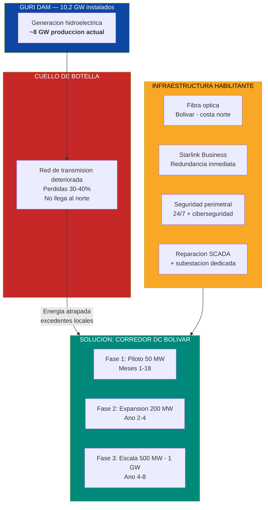
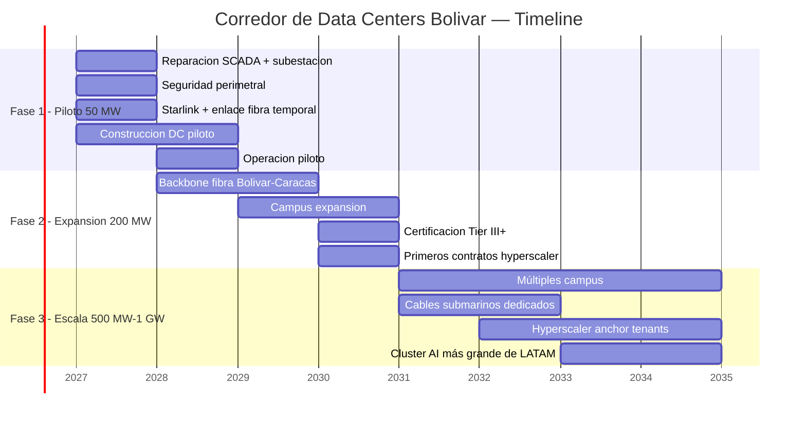
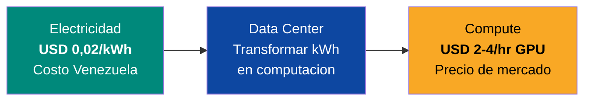

# Data Centers para IA: La Ventaja Energetica que el Mundo Necesita

> El mundo tiene un problema: necesita energía limpia, barata y abundante para entrenar IA. Venezuela tiene la solución: **17 GW de hidroeléctrica**, con excedentes atrapados en Bolívar que literalmente no tienen a dónde ir. La pregunta no es si Venezuela puede competir en data centers de IA — es cuántos meses de ventana le quedan antes de que Chile, Brasil y México absorban toda la demanda LATAM.

---

## 1. La Oportunidad: USD 1,7 Trillones Buscan Dónde Enchufarse

:::danger La crisis global de energía para IA
Los hyperscalers (Amazon, Microsoft, Google, Meta) invertirán **USD 602B solo en 2026** — el **75% para infraestructura de IA**. Para 2030, el capex global en data centers alcanzará **USD 1,7 TRILLONES**. El cuello de botella no es capital, no son chips — es **energía limpia y barata**. El mundo necesita **75-100 GW de nueva generación** para 2030 y no sabe de dónde sacarlos.
:::

| Dato | Cifra | Fuente |
|------|-------|--------|
| Capex hyperscalers 2026 | **USD 602B** (+36% vs 2025) | [Dell'Oro Group](https://www.delloro.com/) |
| % de capex para IA | **75%** | [Bloomberg](https://www.bloomberg.com/) |
| Capex global DCs para 2030 | **USD 1,7T** | [Dell'Oro Group](https://www.delloro.com/) |
| Demanda DC en EE.UU. (2028) | **74 GW** — déficit de **49 GW** | [Morgan Stanley](https://www.morganstanley.com/) |
| Nueva generación necesaria (2030) | **75-100 GW** | [Goldman Sachs](https://www.goldmansachs.com/) |
| DCs como % electricidad EE.UU. (2028) | **12-15%** (vs 4% en 2023) | [Morgan Stanley](https://www.morganstanley.com/) |
| Capacidad AI DC en LATAM 2026 | **443 MW** | [Requiere investigación] |
| Capacidad AI DC en LATAM 2031 | **1,6 GW** | [Requiere investigación] |
| Inversión DCs Chile (2026) | **>USD 4B** comprometidos | [Google Cloud](https://cloud.google.com/) |

**Traducción para no-técnicos:** Imagina que el mundo quiere construir 100 fábricas gigantes que consumen tanta electricidad como ciudades enteras. Solo hay suficiente energía limpia para 50. Quien tenga electricidad barata y verde, gana. Venezuela tiene la electricidad más barata del hemisferio y el 90% es hidroeléctrica.

### Por qué LATAM es el siguiente frente

LATAM pasará de **443 MW a 1,6 GW** de capacidad de data centers de IA para 2031. Chile lidera con >USD 4B comprometidos de Google, AWS y Microsoft. Brasil tiene el proyecto Rio AI City respaldado por Goldman Sachs. México atrae a Microsoft y Amazon.

Pero todos tienen el mismo problema: **electricidad cara**.

| País | Costo eléctrico | Fuente principal | Inversión DC comprometida | Latencia a Miami |
|------|-----------------|------------------|---------------------------|------------------|
| **Venezuela** | **<USD 0,02/kWh** | Hidro (90%) | USD 0 | ~30 ms |
| Chile | USD 0,05-0,08/kWh | Solar + eólica | **>USD 4B** | ~150 ms |
| Brasil | USD 0,06-0,09/kWh | Hidro + solar | **>USD 5B** | ~120 ms |
| México | USD 0,07-0,10/kWh | Gas + solar | **>USD 3B** | ~40 ms |
| EE.UU. (Virginia) | USD 0,08-0,12/kWh | Gas + nuclear | **>USD 50B** | ~10 ms |

Fuentes: costos de electricidad — [Global Energy Monitor](https://globalenergymonitor.org/), [Americas Quarterly](https://www.americasquarterly.org/); inversiones DC — reportes corporativos 2025-2026.

**La ventaja de Venezuela:** electricidad **3-6x más barata** que la competencia, 100% renovable (créditos de carbono), y latencia competitiva a Miami (~30 ms). El diferencial de costo eléctrico en un data center de 100 MW es **USD 50-80M/año** vs. EE.UU.

---

## 2. El Problema Actual: Por Qué Venezuela Tiene USD 0 en Data Centers

Venezuela tiene la energía, pero no tiene nada más. Ser honestos sobre los obstáculos es el primer paso para resolverlos.

| Obstáculo | Severidad | Descripción |
|-----------|-----------|-------------|
| **Red de transmisión destruida** | CRITICO | Guri produce ~8 GW pero las líneas de transmisión al norte pierden 30-40%. Excedentes en Bolívar no llegan a donde se necesitan |
| **CORPOELEC colapsada** | CRITICO | Empresa estatal eléctrica sin mantenimiento, sin inversión, sin personal calificado. SCADA deteriorado en Guri |
| **Cero infraestructura de internet** | CRITICO | Velocidad promedio <1 Mbps. Sin fibra troncal de alta capacidad. [Solo 48% de hogares con internet](https://freedomhouse.org/country/venezuela/freedom-net/2024) |
| **Seguridad física** | CRITICO | [Índice de criminalidad más alto del mundo](https://worldpopulationreview.com/country-rankings/crime-rate-by-country) (80,7 Numbeo). Ningún hyperscaler invierte donde hay riesgo de secuestro |
| **Sin marco regulatorio** | ALTO | No existe ley de data centers, protección de datos, ni estándares de certificación |
| **Sanciones activas** | ALTO | OFAC restringe transacciones. Hyperscalers estadounidenses necesitan licencias específicas |
| **Riesgo país extremo** | ALTO | Sin BIT vigentes, sin arbitraje ICSID activo, sin seguridad jurídica |
| **Sin talento local** | MEDIO | Fuga de cerebros: 7,9M emigraron. Técnicos de data centers hay que importar o repatriar |

:::caution Realidad sin maquillaje
Ningún fondo serio mete dinero en un país con el índice de criminalidad más alto del mundo, internet a 1 Mbps y una empresa eléctrica que no puede mantener las luces encendidas. **Cada uno de estos obstáculos debe resolverse explícitamente.** Las secciones siguientes lo hacen.
:::

---

## 3. La Solucion — Corredor de Data Centers Bolivar

La estrategia: no esperar a que se arregle todo el país. Construir **junto a Guri**, consumir la energía atrapada localmente, y crear una zona de excepción con seguridad, conectividad e infraestructura de primer mundo en un perímetro controlado.

### Fase 1: Piloto 50 MW (Meses 1-18)

**Objetivo:** Proof of concept. Demostrar que se puede operar un data center de clase mundial en Venezuela.

| Componente | Detalle |
|------------|---------|
| **Ubicacion** | Ciudad Guayana, Estado Bolívar — a <50 km de la represa de Guri |
| **Energia** | Conexión directa a subestación de Guri. Sin depender de la red nacional deteriorada. 50 MW dedicados con backup diesel |
| **Conectividad** | Starlink Business (350+ Mbps) como puente inmediato + enlace de fibra dedicado al cable submarino en la costa norte |
| **Tipo de carga** | AI training (batch processing) — tolerante a latencia, maximiza arbitraje energético |
| **Clientes objetivo** | Startups de IA, empresas de GPU-as-a-Service (CoreWeave, Lambda, Together AI), minería de Bitcoin como carga flexible |
| **Seguridad física** | Zona perimetral cerrada 24/7 con contratistas privados especializados (modelo campo petrolero). Cámaras, drones, control de acceso biométrico |
| **Ciberseguridad** | SOC 2 Type II desde día 1. Infraestructura air-gapped para clientes que lo requieran |
| **Certificación** | Tier II+ (Uptime Institute). No se apunta a Tier IV en piloto — sería overengineering |
| **Empleos directos** | 200-500 |
| **Inversión** | USD 300-500M |
| **Ingreso anual estimado** | USD 150-250M |

:::tip Despliegue rápido: la energía atrapada ya existe
No hace falta esperar la reconstrucción de la red eléctrica nacional. Los excedentes de Guri en Bolívar ya están ahí. Con reparación de SCADA + subestación dedicada + fibra + seguridad, un data center piloto puede estar operativo en **12-18 meses**. Eso pone a Venezuela en el mapa ANTES de que Chile y Brasil absorban toda la demanda LATAM.
:::

### Fase 2: Expansion 200 MW (Ano 2-4)

| Componente | Detalle |
|------------|---------|
| **Infraestructura** | Múltiples edificios campus. Subestaciones redundantes. Generación de respaldo solar + baterías |
| **Conectividad** | Backbone de fibra óptica Bolívar-Caracas-Valencia operativo. Cables submarinos con capacidad dedicada |
| **Certificación** | Tier III+ (Uptime Institute) — SLA 99,982% uptime |
| **Clientes** | Empresas de IA medianas + primeros contactos con hyperscalers para pruebas de concepto |
| **Seguridad** | Zona económica especial con marco legal propio. Tribunal arbitral para disputas comerciales |
| **Empleos directos** | 1.000-2.000 |
| **Inversión acumulada** | USD 1-2B |
| **Ingreso anual estimado** | USD 600M-1B |

### Fase 3: Escala 500 MW - 1 GW (Ano 4-8)

| Componente | Detalle |
|------------|---------|
| **Ambición** | El cluster de computación de IA más grande de América Latina |
| **Infraestructura** | Múltiples campus con subestaciones dedicadas. Red de fibra redundante con múltiples cables submarinos |
| **Certificación** | Tier III/IV según cliente. Cumplimiento SOC 2, ISO 27001, CMMC Level 3 |
| **Clientes** | Hyperscalers (AWS, Azure, GCP) como anchor tenants + AI labs + gobierno de EE.UU. (si sanciones se levantan) |
| **Energia verde** | 100% hidro → calificación para créditos de carbono y Green Data Center premium |
| **Empleos directos** | 3.000-5.000 |
| **Inversión acumulada** | USD 3-6B |
| **Ingreso anual estimado** | USD 1,5-3B |

---

## 4. Infraestructura Requerida

| Componente | Qué se necesita | Costo estimado | Timeline | Quién lo provee |
|------------|----------------|----------------|----------|-----------------|
| **Reparación SCADA + subestación** | Rehabilitar sistema de control de Guri. Subestación dedicada para campus DC | USD 50-200M | 6-12 meses | Siemens / ABB / GE |
| **Transmisión local** | Líneas de alto voltaje Guri → campus DC (<50 km) | USD 100-300M | 12-18 meses | ABB / Siemens |
| **Reparación red nacional** | Rehabilitación de líneas de transmisión al norte (765 kV) + transformadores | USD 2-5B | 3-7 años | US DOE + consorcio internacional |
| **Fibra óptica backbone** | Tendido Bolívar → Caracas → costa norte. Conexión a cables submarinos existentes | USD 200-500M | 18-36 meses | Ericsson / Nokia / Huawei |
| **Cables submarinos** | Capacidad dedicada o nuevo cable a Miami/Caribe | USD 200-500M | 24-48 meses | SubCom / Alcatel Submarine |
| **Campus data center** | Edificios, racks, UPS, generadores, cooling | USD 1-3B | 12-60 meses (por fases) | Equinix / Digital Realty / Edgeconnex |
| **Sistemas de enfriamiento** | Enfriamiento por agua (río Caroní, abundante y frío) + sistemas evaporativos | USD 100-300M | Paralelo a construcción | Vertiv / Schneider Electric |
| **Seguridad perimetral** | Cercado, torres de vigilancia, drones, control de acceso, SOC 24/7 | USD 50-100M | 6-12 meses | G4S / Securitas / contratistas especializados |
| **Ciberseguridad** | SOC, SIEM, firewalls, detección de intrusos, air-gap para datos sensibles | USD 20-50M | Paralelo | Palo Alto / CrowdStrike / Fortinet |
| **Starlink (redundancia)** | 50-200 terminales Business para conectividad inmediata y backup | USD 5-10M | 1-3 meses | SpaceX |
| **TOTAL** | | **USD 3,7-9,9B** | **1-8 años** | |

:::info El US DOE ya está en Venezuela
El Departamento de Energía de EE.UU. ha priorizado la [reconstrucción de la red eléctrica venezolana](https://abcnews.go.com/US/energy-secretary-wright-details-plans-us-control-venezuelan/story?id=128979604) como parte de la estrategia energética post-transición. Esto alinea intereses: EE.UU. necesita energía para IA, Venezuela necesita reparar su red. La reparación de SCADA y transmisión no es solo para data centers — beneficia a todo el país.
:::

### Enfriamiento: ventaja natural del río Caroní

Los data centers de IA generan cantidades masivas de calor. El enfriamiento representa **30-40% del costo operativo** de un DC típico. Ciudad Guayana está junto al río Caroní, que ofrece:

- **Agua abundante y fría** para enfriamiento directo/indirecto
- **Temperatura promedio del agua: 24-26 C** — más fría que la mayoría de fuentes tropicales por ser agua de represa
- **Reducción de costos de enfriamiento en 40-60%** vs. enfriamiento tradicional por aire

Comparables: Noruega usa fiordos para enfriar data centers de manera natural. Islandia usa agua glacial. Venezuela puede usar el Caroní.

---

## 5. Modelo de Negocio

### Flujos de ingreso

| Línea de negocio | Descripción | Ingreso estimado (a escala 500 MW) |
|-----------------|-------------|-------------------------------------|
| **Colocation** | Alquiler de espacio, energía y conectividad a clientes que traen su hardware | USD 400-800M/año |
| **GPU-as-a-Service** | Alquiler de GPUs (NVIDIA H100/B200+) por hora para entrenamiento de IA | USD 500M-1B/año |
| **AI Training gestionado** | Servicio completo: datos + compute + monitoreo para empresas que quieren entrenar modelos | USD 200-500M/año |
| **Créditos de carbono** | 100% hidroeléctrica = certificación de data center verde. Premium de 10-15% sobre precio de mercado | USD 50-100M/año |
| **Bitcoin mining (carga flexible)** | Minería como carga que absorbe excedentes cuando los DC no están al 100%. Ingreso variable | USD 50-200M/año |
| **TOTAL a escala** | | **USD 1,2-2,6B/año** |

### El arbitraje energético: el núcleo del pitch

| Métrica | Venezuela | EE.UU. (Virginia) | Diferencia |
|---------|-----------|-------------------|------------|
| Costo eléctrico por 100 MW/año | **USD 17M** | USD 70-100M | **USD 53-83M de ahorro/año** |
| Costo eléctrico por 500 MW/año | **USD 87M** | USD 350-500M | **USD 263-413M de ahorro/año** |
| Costo eléctrico por 1 GW/año | **USD 175M** | USD 700M-1B | **USD 525-825M de ahorro/año** |

**Traducción:** Por cada GW de capacidad, Venezuela ahorra **más de medio billón de dólares al año** en electricidad vs. Virginia. Eso es suficiente para absorber el riesgo país y aún ser más rentable.

### Generación de empleo

| Categoría | Fase 1 (50 MW) | Fase 2 (200 MW) | Fase 3 (500 MW-1 GW) |
|-----------|----------------|------------------|-----------------------|
| **Ingenieros data center** | 50-100 | 200-400 | 500-1.000 |
| **Técnicos de operaciones** | 100-200 | 400-800 | 1.000-2.000 |
| **Seguridad** | 50-100 | 200-400 | 500-1.000 |
| **Construcción** | 200-500 | 500-1.000 | 1.000-2.000 |
| **Servicios de soporte** | 50-100 | 200-400 | 500-1.000 |
| **Empleos indirectos** | 500-1.000 | 2.000-4.000 | 5.000-10.000 |
| **TOTAL** | **950-2.000** | **3.500-7.000** | **8.500-17.000** |

---

## 6. Seguridad — El Factor Critico

:::danger Sin seguridad, cero inversión
Ningún hyperscaler pone USD 1B en infraestructura donde existe riesgo de sabotaje, secuestro o robo de hardware. La seguridad no es un componente más — es **el prerequisito existencial** del proyecto. Si no se resuelve, nada más importa.
:::

### Seguridad física

| Capa | Solución | Modelo de referencia | Costo estimado |
|------|----------|---------------------|----------------|
| **Perímetro exterior** (5 km) | Cercado electrificado, torres de vigilancia, sensores sísmicos, drones autónomos de patrullaje | Campos petroleros en Irak/Nigeria — [G4S](https://www.g4s.com/) y Securitas operan en zonas de conflicto activo | USD 15-30M |
| **Perímetro interior** (campus) | Control de acceso biométrico, mantraps, CCTV con IA, vehículos blindados | Data centers Tier IV en EE.UU. (Equinix, Digital Realty) | USD 10-20M |
| **Personal** | Contratistas privados especializados en infraestructura crítica + unidades FANB reformadas bajo supervisión civil | Modelo Academi/Triple Canopy en Medio Oriente; modelo Georgia de policía reformada | USD 20-40M/año |
| **Inteligencia** | Monitoreo 24/7 de amenazas locales, coordinación con fuerzas de seguridad estatales y federales | Centro de fusión de inteligencia tipo US NORTHCOM | USD 5-10M/año |
| **Comunidad** | Programas de empleo local, inversión en infraestructura comunitaria — la mejor seguridad es que la comunidad proteja la inversión | Modelo minería responsable (Botswana/Diamantes, Chile/Cobre) | USD 10-20M/año |

### Ciberseguridad

| Estándar | Nivel | Descripción | Timeline |
|----------|-------|-------------|----------|
| **SOC 2 Type II** | Obligatorio desde día 1 | Controles de seguridad auditados por terceros. Sin esto, cero clientes enterprise | Mes 1-12 |
| **ISO 27001** | Fase 2 | Sistema de gestión de seguridad de la información. Requerido por clientes europeos y asiáticos | Año 2-3 |
| **CMMC Level 3** | Fase 3 | Cybersecurity Maturity Model Certification. Requerido para contratos con gobierno de EE.UU. y defensa | Año 3-5 |
| **PCI DSS** | Si aplica | Para clientes fintech/banca | Según demanda |
| **Air-gap** | Disponible | Infraestructura aislada de internet para clientes con datos ultra-sensibles (IA militar, gobierno) | Fase 1 |

### Protección legal para inversores

| Instrumento | Función | Estado |
|-------------|---------|--------|
| **BIT (Bilateral Investment Treaty)** | Protección contra expropiación, trato injusto, restricciones de transferencia | Requiere negociación con EE.UU., UE, Japón, Corea. [Requiere investigación] sobre BITs vigentes |
| **Arbitraje ICSID** | Resolución de disputas inversor-Estado ante el Banco Mundial | Venezuela se retiró en 2012. Reingreso es señal fuerte al mercado |
| **Seguro MIGA** | Seguro del Banco Mundial contra riesgos políticos (guerra, expropiación, incumplimiento) | Disponible para proyectos en países en transición |
| **Zona Económica Especial** | Marco legal independiente para el corredor DC: tribunales comerciales, ley de protección de datos, régimen fiscal especial | Requiere legislación específica |
| **Estructura offshore** | SPV en jurisdicción neutral (Delaware, Luxemburgo, Singapur) que posee los activos venezolanos | Estándar en inversiones en mercados frontera |

---

## 7. Aliados Potenciales

| Empresa/Entidad | Rol | Por qué participarían |
|------------------|-----|----------------------|
| **Amazon AWS** | Anchor tenant / co-inversor | Buscan agresivamente energía verde barata. Han comprometido USD 100B+ en capex 2026. Necesitan sitios fuera de EE.UU. por diversificación |
| **Microsoft Azure** | Anchor tenant / co-inversor | Inversiones DC en >60 regiones. Han anunciado expansión LATAM (México, Brasil, Chile). Venezuela sería el sitio más barato |
| **Google Cloud** | Anchor tenant | Ya invirtieron >USD 4B en Chile. Venezuela les ofrece electricidad 3-4x más barata |
| **Meta** | Anchor tenant para AI training | Llama requiere clusters masivos de GPUs. La electricidad barata reduce el costo de entrenamiento |
| **CoreWeave / Lambda / Together AI** | Primeros clientes (Fase 1) | GPU cloud providers. Más ágiles que hyperscalers. Hambrientos de energía barata para competir. Perfil de riesgo más alto |
| **Chevron** | Socio energético + credibilidad | [Ya opera en Venezuela](https://www.chevron.com/worldwide/venezuela) con licencia OFAC. Conoce el terreno. Puede proveer generación de respaldo con gas |
| **Siemens / ABB / GE** | Equipos de transmisión y SCADA | Proveedores naturales para reparación de subestaciones y SCADA de Guri. Contratos de servicio a largo plazo |
| **Ericsson / Nokia** | Backbone de fibra óptica | Experiencia en tendido de fibra en mercados emergentes. Pueden financiar parcialmente con contratos de operación |
| **SubCom / Alcatel Submarine** | Cables submarinos | Los 2 mayores fabricantes de cables submarinos. Venezuela necesita capacidad dedicada a Miami |
| **G4S / Securitas** | Seguridad física | Operan en zonas de conflicto globalmente. Experiencia en protección de infraestructura crítica (minas, plataformas petroleras) |
| **US DFC (ex-OPIC)** | Financiamiento de desarrollo | Financian infraestructura en países aliados. Post-transición, Venezuela califica. Seguros contra riesgo político |
| **US DOE** | Reconstrucción de red eléctrica | Ya [priorizó la red venezolana](https://abcnews.go.com/US/energy-secretary-wright-details-plans-us-control-venezuelan/story?id=128979604). Alinea intereses: red eléctrica funcional habilita DCs que procesan IA para empresas americanas |
| **NVIDIA** | Proveedor de GPUs + validación | Programa NVIDIA DGX Cloud. Certificación como NVIDIA Partner amplifica credibilidad. Podrían proveer GPUs con financiamiento |
| **BID / CAF** | Financiamiento multilateral | Bancos de desarrollo para infraestructura habilitante (fibra, transmisión, agua) |

---

## 8. Riesgos y Mitigaciones

| # | Riesgo | Prob. | Impacto | Mitigación |
|---|--------|-------|---------|------------|
| 1 | **Inestabilidad política** — transición se revierte, nuevo gobierno expropia | Alta | Crítico | Estructura SPV offshore + seguro MIGA + BIT + cláusulas de arbitraje ICSID. 51% propiedad privada no-venezolana |
| 2 | **Sanciones OFAC no se levantan** — hyperscalers no pueden operar | Media-Alta | Crítico | Fase 1 con empresas no-estadounidenses o con licencias OFAC específicas (modelo Chevron). Clientes de GPU-as-a-Service sin restricciones |
| 3 | **Sabotaje/ataque a infraestructura** — grupos criminales o actores estatales | Media | Crítico | Seguridad militar-grade. Perímetro de 5 km. Drones autónomos. Inversión comunitaria para alineación de incentivos |
| 4 | **CORPOELEC no puede mantener Guri** — fallas de generación | Media | Alto | Contrato de operación y mantenimiento con Siemens/ABB para Guri. Generación de respaldo con gas (Chevron). Baterías |
| 5 | **Conectividad insuficiente** — fibra no se despliega a tiempo | Media | Alto | Starlink como puente. Foco en cargas tolerantes a latencia (AI training batch) en Fase 1. Fibra para Fase 2+ |
| 6 | **Sequía reduce capacidad de Guri** — cambio climático | Media-Baja | Alto | Diversificación: solar en Zulia/Falcón, gas natural como backup. Guri tiene embalse de 135 km2 — buffer significativo |
| 7 | **Competencia regional captura demanda** — Chile/Brasil se mueven más rápido | Alta | Medio | Competir en precio (3-6x más barato). Posicionarse para la segunda ola cuando Chile/Brasil se llenen |
| 8 | **No se consigue talento** — ingenieros de DC no quieren ir a Venezuela | Media-Alta | Medio | Paquetes de expatriados competitivos (modelo petroleras en Medio Oriente). Campus con vivienda, escuela, hospital. Programas de formación local acelerada |
| 9 | **Corrupción en contratos** — sobrecostos, desvíos | Alta | Medio | Gobernanza tipo Santiago Principles. Auditoría Big 4 obligatoria. Transparencia EITI. Whistleblower con recompensa 10-30% |
| 10 | **Desastre natural** — terremoto, inundación | Baja | Alto | Ciudad Guayana tiene bajo riesgo sísmico. Diseño anti-inundación. Seguros de infraestructura |

---

## 9. Comparables Internacionales

| País | Modelo | Energía | Inversión DC | Lección para Venezuela |
|------|--------|---------|-------------|------------------------|
| **Chile** | Google, AWS, Microsoft invirtiendo >USD 4B en DCs | Solar + eólica, USD 0,05-0,08/kWh | >USD 4B (2024-2026) | Demanda probada en LATAM. Chile muestra que hyperscalers QUIEREN estar en la región. Venezuela ofrece energía 3-4x más barata |
| **Noruega** | Green Mountain, DigiPlex — DCs enfriados por fiordos | Hidro 99%, ~USD 0,03-0,05/kWh | >USD 2B | Modelo casi idéntico: hidro barata + enfriamiento natural por agua. Noruega cobra premium por certificación verde |
| **Islandia** | Verne Global, atNorth — DCs con geotérmica | Geotérmica + hidro, ~USD 0,02-0,04/kWh | >USD 1B | Energía ultra-barata en país pequeño. Atrajo a BMW, Porsche, DeepMind para AI training. Prueba de que el precio de energía compensa la lejanía |
| **Paraguay** | Bitfarms, Penguin Solutions — Bitcoin mining con Itaipú | Hidro (Itaipú), ~USD 0,01-0,03/kWh | >USD 500M en mining | Hidro barata → primero Bitcoin, después DCs más sofisticados. Venezuela puede seguir esta secuencia |
| **Singapur** | Equinix, Digital Realty — hub de DCs del Sudeste Asiático | Mix (importada), USD 0,10-0,15/kWh | >USD 10B | Cero energía barata pero mejor conectividad y seguridad jurídica del mundo. Venezuela necesita cerrar esa brecha |
| **Omán / Arabia Saudita** | NEOM, Oman Data Park — DCs en desierto | Solar + gas, USD 0,03-0,06/kWh | >USD 5B planeados | Países petroleros diversificando hacia DCs. Modelo de zona económica especial con seguridad privada. Marco aplicable a Venezuela |

Fuentes: [Green Mountain](https://www.greenmountain.no/), [Verne Global](https://verneglobal.com/), [Bitfarms](https://bitfarms.com/), reportes corporativos 2025-2026. Costos de energía: [IEA](https://www.iea.org/), [Global Energy Monitor](https://globalenergymonitor.org/).

:::tip La lección de Paraguay
Paraguay tenía el mismo activo que Venezuela: hidroeléctrica absurdamente barata (Itaipú, USD 0,01-0,03/kWh) sin demanda local suficiente. Primero llegaron los mineros de Bitcoin. Después, empresas como Penguin Solutions empezaron a construir infraestructura de cómputo más sofisticada. Venezuela puede seguir exactamente esta secuencia: Bitcoin mining como primer cliente (tolerante a todo), luego GPU-as-a-Service, luego hyperscalers.
:::

---

## 10. Proyeccion Financiera

### Proyección a 8 años

| Año | Capacidad (MW) | Inversión acumulada | Ingreso anual | EBITDA estimado | Empleos (directos + indirectos) | Clientes tipo |
|-----|---------------|--------------------|--------------|-----------------|---------------------------------|---------------|
| **1** | 10 MW | USD 150M | USD 30-50M | USD 10-20M | 300-500 | Bitcoin miners, GPU startups |
| **2** | 50 MW | USD 500M | USD 150-250M | USD 60-100M | 950-2.000 | CoreWeave, Lambda, startups IA |
| **3** | 100 MW | USD 1B | USD 300-500M | USD 120-200M | 2.000-4.000 | Empresas IA medianas, primeros enterprise |
| **4** | 200 MW | USD 2B | USD 600M-1B | USD 250-400M | 3.500-7.000 | Enterprise + primeros hyperscalers (PoC) |
| **5** | 300 MW | USD 3B | USD 900M-1,5B | USD 400-600M | 5.000-10.000 | Hyperscalers con contratos piloto |
| **6** | 500 MW | USD 4,5B | USD 1,2-2B | USD 500-800M | 8.500-14.000 | AWS/Azure/GCP anchor tenants |
| **7** | 750 MW | USD 6B | USD 1,8-2,8B | USD 750M-1,1B | 12.000-18.000 | Múltiples hyperscalers + gobierno |
| **8** | 1 GW | USD 8B | USD 2,5-3,5B | USD 1-1,4B | 15.000-22.000 | Hub AI de LATAM |

:::caution Supuestos de la proyección
- Precio de electricidad: USD 0,02/kWh (constante, contrato a largo plazo con gobierno/CORPOELEC reformada)
- Tasa de ocupación: 50% año 1, escalando a 85% en año 5+
- Revenue por MW: USD 3-5M/año en colocation, USD 5-8M/año en GPU-as-a-Service
- EBITDA margin: 35-45% (comparable a Equinix/Digital Realty en mercados emergentes)
- No incluye ingresos por créditos de carbono ni Bitcoin mining (upside adicional)
- Inversión incluye infraestructura habilitante (fibra, transmisión, seguridad)
:::

### Retorno de inversión

| Métrica | Valor estimado |
|---------|---------------|
| Inversión total (8 años) | **USD 6-8B** |
| Ingreso acumulado (8 años) | **USD 7,5-11B** |
| EBITDA acumulado (8 años) | **USD 3-4,5B** |
| Payback estimado | **Año 5-6** |
| IRR estimado | **18-25%** |
| Empleos año 8 | **15.000-22.000** (directos + indirectos) |
| Contribución fiscal anual (año 8) | **USD 150-300M** (15% flat sobre ganancias) |

---

## 11. Call to Action: Que Necesita Ver un Inversor

### Para un hyperscaler (AWS, Azure, GCP)

| Requisito | Estado | Quién lo resuelve |
|-----------|--------|-------------------|
| Contrato de energía a largo plazo (PPA) a <USD 0,03/kWh | Negociable con CORPOELEC reformada / gobierno de transición | Gobierno + operador DC |
| Certificación Uptime Institute (Tier III+) | En proceso con construcción | Operador DC + Uptime Institute |
| Conectividad <50 ms a Miami | Factible con fibra + cable submarino | Ericsson/Nokia + SubCom |
| SOC 2 Type II + ISO 27001 | Implementable en 12-18 meses | Operador DC |
| BIT o protección legal equivalente | Requiere negociación con gobierno | Gobierno + cancillería |
| Seguro MIGA contra riesgo político | Disponible vía Banco Mundial | Operador DC + MIGA |
| Licencia OFAC (si aplica) | Requiere levantamiento de sanciones o licencia específica | Gobierno de EE.UU. |

### Para un inversor financiero (PE/VC/DFC)

| Criterio | Venezuela DC Corridor |
|----------|-----------------------|
| **TAM** | USD 1,7T capex global DCs para 2030 |
| **SAM** | USD 14,3B LATAM DC market para 2028 ([Arizton](https://www.businesswire.com/news/home/20250505397648/en/)) |
| **SOM** | USD 2-3,5B/año con 500 MW-1 GW (10-25% del mercado LATAM) |
| **Ventaja competitiva** | Energía 3-6x más barata que competidores. 100% hidro (green premium). Río Caroní para enfriamiento |
| **Moat** | Acceso a energía hidroeléctrica no replicable. Guri es la 4ta represa más grande del mundo por capacidad |
| **Riesgo principal** | Riesgo político y de seguridad. Mitigado con SPV offshore + MIGA + BIT + seguridad privada |
| **Comparable** | Noruega: hidro barata → green DCs → USD 2B+ invertidos. Paraguay: hidro barata → mining → compute |
| **Exit** | Venta a hyperscaler, REIT de infraestructura, o IPO del operador DC |

### Siguiente paso concreto

1. **Memorándum de Entendimiento (MoU)** con gobierno de transición para PPA a USD 0,02/kWh y zona económica especial
2. **Estudio de factibilidad** de 90 días: evaluación técnica de subestación Guri, ruta de fibra, terreno para campus
3. **Licencia OFAC** (o plan de contingencia con operadores no-estadounidenses)
4. **Compromiso de seguridad** con contratista internacional de infraestructura crítica
5. **Term sheet** para Fase 1 (50 MW): USD 300-500M, estructura SPV, protección MIGA

:::info Este no es un pitch teórico
La energía está ahí. Los excedentes de Guri están ahí. La demanda global de compute para IA está creciendo exponencialmente. Lo que falta es el framework legal, la seguridad y la conectividad. Tres problemas solucionables. La pregunta es si Venezuela actúa en los próximos 24 meses o deja que Chile, Brasil y México capturen la oportunidad de la generación.
:::

---

## Documentos Relacionados

- [Capacidad Electrica](./capacidad-electrica) — Rehabilitacion de Guri y red de transmision, prerequisito para alimentar data centers con hidroelectrica a <USD 0,02/kWh
- [Telecomunicaciones](./telecomunicaciones) — Fibra optica, cables submarinos y 5G necesarios para conectividad de data centers
- [Energia Renovable](./energia-renovable) — Solar y eolica como complemento a la hidroelectrica para data centers 100% verdes
- [Manufactura Industrial](./manufactura-industrial) — Sinergias con zonas industriales y demanda electrica compartida
- [Modelo de Concesiones](./modelo-concesiones) — Marco universal de concesiones BOT/BOOT aplicable a data centers (Tier IV, 25-30 anos)

---

## Fuentes Consolidadas

| # | Fuente | URL | Dato |
|---|--------|-----|------|
| 1 | Dell'Oro Group | [delloro.com](https://www.delloro.com/) | Capex global DC USD 1,7T para 2030; hyperscalers USD 602B en 2026 |
| 2 | Bloomberg | [bloomberg.com](https://www.bloomberg.com/) | 75% de capex hyperscalers para IA |
| 3 | Morgan Stanley | [morganstanley.com](https://www.morganstanley.com/) | DC 12-15% electricidad EE.UU. 2028; demanda 74 GW, déficit 49 GW |
| 4 | Goldman Sachs | [goldmansachs.com](https://www.goldmansachs.com/) | 75-100 GW nueva generación para 2030; Rio AI City Brasil |
| 5 | Google Cloud | [cloud.google.com](https://cloud.google.com/) | >USD 4B en Chile |
| 6 | Global Energy Monitor | [globalenergymonitor.org](https://globalenergymonitor.org/) | Costos de electricidad globales |
| 7 | Americas Quarterly | [americasquarterly.org](https://www.americasquarterly.org/) | DCs en LATAM |
| 8 | Arizton/ResearchAndMarkets | [businesswire.com](https://www.businesswire.com/news/home/20250505397648/en/) | LATAM DC USD 7,16B → 14,3B |
| 9 | Power Technology | [power-technology.com](https://www.power-technology.com/projects/gurihydroelectric/) | Guri 10.200 MW |
| 10 | Mongabay 2023 | [mongabay.com](https://news.mongabay.com/2023/08/hydropower-in-the-pan-amazon-the-guri-complex-and-the-caroni-cascade/) | Cascada Caroní 18 GW |
| 11 | Freedom House 2024 | [freedomhouse.org](https://freedomhouse.org/country/venezuela/freedom-net/2024) | 48% hogares con internet, <1 Mbps |
| 12 | SIGCOMM/Northwestern 2024 | [estcarisimo.github.io](https://estcarisimo.github.io/assets/pdf/papers/2024-sigcomm-venezuela.pdf) | Velocidad internet Venezuela |
| 13 | ABC News 2026 | [abcnews.go.com](https://abcnews.go.com/US/energy-secretary-wright-details-plans-us-control-venezuelan/story?id=128979604) | US DOE prioriza red eléctrica Venezuela |
| 14 | Numbeo Crime Index | [worldpopulationreview.com](https://worldpopulationreview.com/country-rankings/crime-rate-by-country) | Venezuela #1 índice criminalidad (80,7) |
| 15 | Green Mountain (Noruega) | [greenmountain.no](https://www.greenmountain.no/) | DCs verdes con hidro y enfriamiento por fjordos |
| 16 | Bitfarms (Paraguay) | [bitfarms.com](https://bitfarms.com/) | Mining con hidro de Itaipú |
| 17 | IEA | [iea.org](https://www.iea.org/) | Costos energía globales |
| 18 | Chevron Venezuela | [chevron.com](https://www.chevron.com/worldwide/venezuela) | Operaciones con licencia OFAC |
