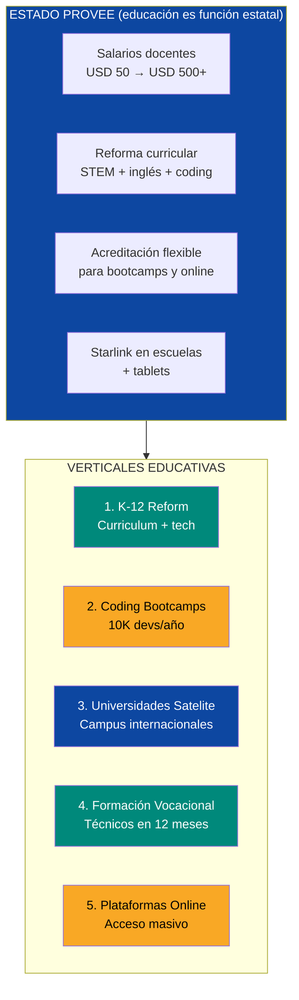
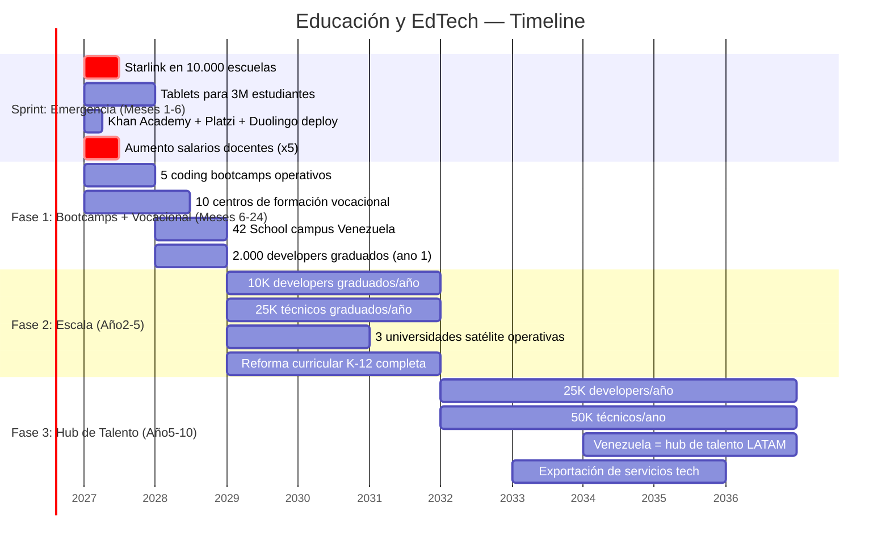
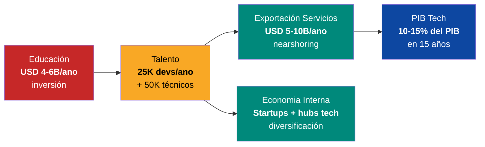

# Educación y EdTech: De Fuga de Cerebros a Fábrica de Talento

> Venezuela necesita **50.000 ingenieros** para ejecutar este plan. Hoy produce ~5.000/año y pierde la mitad a la emigración. El 50% de los estudiantes abandonan la escuela. Los maestros ganan menos de USD 50/mes. El curriculum no ha cambiado desde los 90. Eso no es un sistema educativo — es una máquina de exportar talento sin retorno. La solución: el Estado reforma el marco legal y sube salarios (educación es una de las 5 funciones del Estado). Venezuela S.A. invierte en infraestructura educativa base. El capital privado trae plataformas, bootcamps y universidades satélite. En 10 años, Venezuela pasa de importar talento a exportar 50.000 developers/año al mercado global.

---

## 1. La Crisis Educativa: Números Sin Maquillaje

:::danger Sistema educativo en caída libre
Venezuela tenía la segunda tasa de matrícula universitaria más alta de LATAM (2010). Hoy tiene una de las más altas tasas de deserción. Los maestros son los profesionales peor pagados del país. Las universidades públicas operan sin presupuesto, sin internet, sin laboratorios. El resultado: una generación entera sin formación adecuada para competir en la economía del siglo XXI.
:::

| Indicador | Venezuela (actual) | LATAM promedio | País referencia | Fuente |
|-----------|-------------------|----------------|-----------------|--------|
| Tasa de deserción escolar | **~50%** (antes de completar secundaria) | ~20% | Chile: 5% | [UNICEF 2024](https://www.unicef.org/) |
| Salario docente mensual | **<USD 50** | USD 500-1.500 | Chile: USD 2.000, Colombia: USD 800 | [Requiere investigación] |
| Ingenieros graduados/año | **~5.000** | — | Colombia: ~30.000, México: ~120.000 | [Requiere investigación] |
| Puntaje PISA | **No participa** desde 2009 | 400 (promedio LATAM) | Chile: 412, Uruguay: 407 | [OECD PISA 2022](https://www.oecd.org/pisa/) |
| Gasto educación % PIB | **~2%** | 4,5% | Costa Rica: 7,4% | [Banco Mundial 2024](https://data.worldbank.org/) |
| Matrícula universitaria | **~1,5M** (cayendo) | — | Pico 2010: ~2,8M | [Requiere investigación] |
| Universidades públicas funcionales | **<50%** operatividad | — | — | [Requiere investigación] |
| Acceso a internet en escuelas | **<10%** | ~60% | Uruguay: 100% (Plan Ceibal) | [Requiere investigación] |
| Profesores que emigraron | **>100.000** estimado | — | — | [Requiere investigación] |

**Traducción:** Un maestro venezolano gana menos en un mes que un maestro colombiano en dos días. La mitad de los estudiantes no terminan la secundaria. Las universidades producen 5.000 ingenieros/año cuando el plan necesita 50.000. Y no hay internet en las escuelas.

### La brecha de talento: lo que el plan necesita vs. lo que existe

| Perfil | Necesidad del plan (15 años) | Producción actual/año | Déficit anual | Urgencia |
|--------|-----------------------------|-----------------------|---------------|----------|
| **Ingenieros de software** | 50.000 | ~2.000 | **-48.000** | CRÍTICA |
| **Ingenieros petroleros** | 15.000 | ~500 | **-14.500** | CRÍTICA |
| **Ingenieros eléctricos** | 10.000 | ~300 | **-9.700** | CRÍTICA |
| **Técnicos de infraestructura** | 30.000 | ~3.000 | **-27.000** | ALTA |
| **Profesionales de salud** | 40.000 | ~5.000 | **-35.000** | CRÍTICA |
| **Administradores y gerentes** | 20.000 | ~2.000 | **-18.000** | ALTA |
| **TOTAL** | **165.000** | **~12.800** | **-152.200** | |

:::caution A la tasa actual, cerrar la brecha toma 100+ años
Con una producción de 12.800 profesionales/año (de los cuales la mitad emigra), Venezuela necesitaría **más de un siglo** para cubrir la demanda del plan. La única forma de cerrar la brecha en 10-15 años es multiplicar la producción por 5x y reducir la emigración. Eso requiere salarios competitivos + oportunidades reales + edtech a escala.
:::

---

## 2. La Oportunidad: Construir el Sistema Desde Cero

| Oportunidad | Tamaño | Por quéahora |
|-------------|--------|--------------|
| **Mercado edtech LATAM** | **USD 3B (2024) → USD 12B+ (2030)**, CAGR ~25% | [HolonIQ 2024](https://www.holoniq.com/) |
| **Mercado global edtech** | **USD 400B+ para 2030** | [HolonIQ 2024](https://www.holoniq.com/) |
| **Talento tech LATAM** | Déficit de **1M+ developers** en la región | [LinkedIn/Coursera 2024](https://www.coursera.org/) |
| **Nearshoring** | Empresas de EE.UU. buscan talento tech en LATAM (50% más barato) | [Requiere investigación] |
| **Venezuela: costo de vida bajo** | Un developer venezolano a USD 1.500/mes es competitivo vs. México (USD 3.000) o Colombia (USD 2.500) | Realidad de mercado actual |

### Las 5 verticales

---

## 3. Vertical 1: Reforma K-12 — La Base de Todo

### Sprint: Conectividad + Contenido (Días1-180)

:::tip Starlink + tablets + Khan Academy = escuela digital en 30 días
No hay que esperar a construir escuelas nuevas. Con **Starlink en cada escuela**, **tablets para estudiantes** y **contenido gratuito** (Khan Academy, Platzi, Wikipedia offline), se puede dar acceso a educación de calidad a millones de estudiantes ANTES de reformar el curriculum completo. Es un puente, no la solución final — pero es un puente que salva una generación.
:::

| Acción | Resultado | Costo | Timeline |
|--------|----------|-------|----------|
| Starlink en 10.000 escuelas | Internet de 100+ Mbps en cada escuela | USD 50-100M | 3-6 meses |
| Tablets para 3M estudiantes | 1 tablet por estudiante (USD 100-150 entry-level) | USD 300-450M | 6-12 meses |
| Despliegue Khan Academy + contenido offline | Matemáticas, ciencias, inglés en español. Funciona sin internet 100% | USD 5-10M (implementación) | 1-3 meses |
| Platzi licencias para secundaria | Cursos de programación, emprendimiento, diseño | USD 10-20M/ano | 3-6 meses |
| Capacitación docente básica en tech | 50.000 maestros formados en herramientas digitales | USD 20-50M | 6-12 meses |
| **TOTAL SPRINT** | | **USD 400-650M** | |

:::caution Starlink en escuelas no basta — falta conectividad en casa
Si el estudiante tiene internet en la escuela pero no en casa, no puede practicar, no puede hacer tareas, no puede usar plataformas online fuera de horario escolar. Solución: (1) WiFi comunitario en plazas y centros vecinales (USD 10-20M), (2) planes de datos subsidiados para familias con estudiantes — Tramo A/B del FCV (USD 5-10/mes por familia), (3) contenido offline precargado en tablets (Khan Academy funciona sin internet). La conectividad domiciliaria se activa cuando la formalización supere 40% y haya operadores de telecoms en competencia.
:::

### Reforma curricular (Año1-3)

| Componente actual | Problema | Reforma propuesta | Referencia |
|-------------------|---------|-------------------|-----------|
| **Sin programación** | Graduados no saben escribir una línea de código | Coding obligatorio desde 5to grado. Python, pensamiento computacional | Estonia: coding desde 1er grado ([ProgeTiger](https://www.hitsa.ee/)) |
| **Inglés deficiente** | <10% habla inglés funcional. Excluidos del mercado global | Inglés intensivo: 10 hrs/semana. Profesores nativos via video | Corea del Sur: programa EPIK de profesores nativos |
| **Matemáticas débiles** | Por debajo de estándar LATAM | Curriculum alineado a Singapore Math + Khan Academy | Singapur: #1 mundial en PISA matemáticas |
| **Sin educación financiera** | País que vivió hiperinflación sin entender por qué | Finanzas personales + economía básica desde 7mo grado | Australia: financial literacy en curriculum nacional |
| **Sin pensamiento crítico** | Curriculum memorístico | Project-based learning, debate, investigación | Finlandia: modelo centrado en competencias |
| **Sin STEM aplicado** | Laboratorios destruidos | Makerspaces con impresión 3D, electrónica básica, robótica | Fab Labs del MIT — 2.500+ en 125+ países |

### Salarios docentes: el prerequisito irrenunciable

:::danger Sin salarios dignos, no hay reforma educativa posible
Ningún curriculum, ninguna tablet, ninguna plataforma funciona si el maestro gana USD 50/mes y necesita 3 trabajos para sobrevivir. **El primer acto de la reforma educativa es multiplicar los salarios docentes por 10x.** De USD 50 a USD 500-800/mes. Es caro. Es necesario. Es no negociable.
:::

| Nivel | Salario actual | Salario propuesto | Costo total/año | Financiamiento |
|-------|---------------|-------------------|-----------------|----------------|
| Maestro K-12 | USD 20-50/mes | **USD 500-800/mes** | USD 2-3B/ano (300K maestros) | Impuestos (15% flat + 12% IVA) |
| Profesor universitario | USD 30-100/mes | **USD 1.000-2.000/mes** | USD 500M-1B/ano (50K profesores) | Presupuesto educativo |
| Director escolar | USD 50-100/mes | **USD 1.000-1.500/mes** | USD 100-200M/ano | Presupuesto educativo |
| **TOTAL** | | | **USD 2,5-4B/ano** | 5-6% del PIB |

**Referencia:** Chile gastó 5,4% del PIB en educación y es el país con mejores resultados PISA en LATAM. Costa Rica gasta 7,4%. Venezuela gasta ~2%. Subir a 5-6% del PIB financia salarios + infraestructura + tech.

### Formar a los formadores: prerrequisito #2

:::danger Sin formadores no hay reforma curricular
El plan propone coding desde 3er grado, inglés 10 hrs/semana, robótica, STEM. Pero 100.000+ profesores emigraron y los que quedan no saben escribir un if-else. **Antes de reformar el currículo, hay que formar 50.000 docentes en las herramientas del currículo nuevo.**
:::

| Programa | Duración | Meta | Costo | Aliados |
|----------|----------|------|-------|---------|
| Certificación docente en herramientas digitales | 6 meses | 30.000 docentes | USD 50-80M | [Platzi](https://platzi.com/) + [Google for Education](https://edu.google.com/) |
| Certificación en coding básico para maestros K-12 | 3-6 meses | 10.000 docentes | USD 20-30M | [Code.org](https://code.org/) + [freeCodeCamp](https://www.freecodecamp.org/) |
| Certificación en inglés funcional (B2+) para docentes | 12 meses | 10.000 docentes | USD 30-50M | [Duolingo](https://www.duolingo.com/) + profesores nativos vía video |
| **TOTAL Train the Trainers** | **12-18 meses** | **50.000 docentes** | **USD 100-160M** | |

**Secuencia correcta:** (1) Subir salarios → (2) Train the Trainers → (3) Reforma curricular. No al revés.

---

## 4. Vertical 2: Coding Bootcamps — 10.000 Developers/Año

### El problema y la oportunidad

| Dato | Cifra |
|------|-------|
| Developers que Venezuela necesita (15 años) | **50.000** |
| Developers que produce/ano | **~2.000** (universidades) |
| Tiempo de formación universitaria | 5 años |
| Tiempo de formación bootcamp | **4-6 meses** |
| Salario entry-level developer (remoto, LATAM) | **USD 1.500-3.000/mes** |
| Salario entry-level developer (remoto, EE.UU.) | **USD 3.000-6.000/mes** |
| Costo de vida en Venezuela | **USD 300-500/mes** |
| Margen para el developer | **5-10x su costo de vida** |

### Modelo: producción en escala

| Componente | Detalle |
|------------|---------|
| **Meta** | 10.000 developers graduados/año para ano 3, 25.000/ano para ano 7 |
| **Formato** | Bootcamps de 4-6 meses, tiempo completo. Presencial + remoto híbrido |
| **Curriculum** | Full-stack web, mobile, data science, IA/ML, cloud, ciberseguridad |
| **Modelo de pago** | ISA (Income Share Agreement): pagas cuando consigas trabajo (15-20% del salario por 2 años) |
| **Empleabilidad** | 80%+ colocación en 6 meses (estándar de bootcamps top) |
| **Ubicación** | 5 ciudades: Caracas, Valencia, Maracaibo, Barquisimeto, Ciudad Guayana |
| **Revenue por estudiante** | USD 3.000-8.000 (ISA) o USD 2.000-5.000 (upfront) |
| **Revenue total (ano 5)** | USD 50-100M/ano (10K graduados x USD 5K promedio) |

### Operadores de bootcamps

| Operador | País | Modelo | Por quépara Venezuela |
|----------|------|--------|----------------------|
| **Platzi** | Colombia | 5M+ estudiantes online. Cursos tech en español. YC-backed | Ya tiene contenido en español. Puede abrir campus físicos |
| **Holberton School** | EE.UU./Colombia | Software engineering school. ISA model. 2 años. Opera en Colombia | Modelo ISA probado en LATAM. Alta empleabilidad |
| **42 School** | Francia | Gratuita. Sin profesores. Peer-to-peer learning. 50+ campus globales | Modelo de costo cero para el estudiante. Respaldado por Xavier Niel |
| **Lambda School / BloomTech** | EE.UU. | Pionero de ISA. Data science + web dev. 6 meses | Modelo ISA a escala |
| **Laboratoria** | Perú/LATAM | Bootcamp para mujeres en tech. Opera en Perú, Chile, México, Brasil, Colombia | Inclusion + tech. 4.000+ graduadas con 80%+ empleabilidad |
| **Henry** | Argentina | Bootcamp full-stack. ISA model. Opera en LATAM | Modelo ISA en español. 10K+ graduados |
| **Microverse** | Global | 100% remoto. Pair programming. ISA. Enfocado en mercados emergentes | Sin necesidad de campus físico. Escala inmediata |
| **Ironhack** | España/LATAM | Web dev, UX/UI, data analytics. Campuses en México, Colombia, Brasil | Campus presenciales + online. Brand reconocido |

---

## 5. Vertical 3: Universidades Satelite — Campus Internacionales

:::info Venezuela tenía universidades de clase mundial. Puede volver a tenerlas.
La UCV, la USB y la ULA formaban ingenieros de nivel mundial en los 80-90. Hoy no tienen presupuesto, profesores ni laboratorios. Mientras se reconstruyen, **universidades internacionales pueden abrir campus satélite** que produzcan graduados de clase mundial en 3-5 años. No es reemplazar a la UCV — es complementar mientras se recupera.
:::

| Universidad | País | Modelo satélite | Por quévendrían |
|-------------|------|-----------------|-----------------|
| **Georgia Tech** | EE.UU. | Tiene campus en Francia, China, Singapur. Online MSCS por USD 7.000 | OMSCS (Master online) puede desplegarse inmediatamente. Campus satélite en 2-3 años |
| **MIT (OpenCourseWare + MITx)** | EE.UU. | Todo el curriculum online gratis. MicroMasters acreditados | Contenido ya disponible. Programas de certificación partnership |
| **Tecnologico de Monterrey** | México | 33 campus en México. Expansión a Colombia, Perú. Online masivo | Experiencia en expansion LATAM. Curriculum relevante para la región |
| **42 School** | Francia | 50+ campus en 30+ países. Gratuita. Peer-to-peer. Sin profesores | Modelo de cero costo. Xavier Niel financia. Venezuela como campus #51 |
| **Arizona State University** | EE.UU. | Mayor universidad online de EE.UU. Partnerships globales. Starbucks scholarship model | Modelo online a escala. Accesible. Acreditada |
| **University of the People** | Global | 100% online, casi gratuita (USD 100-200/curso). Acreditada. 130.000+ estudiantes de 200 países | Modelo de mínimo costo. Ideal para acceso masivo |
| **African Leadership University** | Ruanda/Mauricio | Universidad creada post-genocidio. 25 campus planeados en Africa. Enfoque en emprendimiento + tech | Modelo de universidad de nueva creación en país post-crisis. Exactamente lo que Venezuela necesita |

### Hub de universidades: Zona Educativa Especial

| Componente | Detalle |
|------------|---------|
| **Concepto** | Campus compartido donde 3-5 universidades internacionales operan con infraestructura común |
| **Ubicación** | Caracas + una ciudad tech hub (Valencia o Barquisimeto) |
| **Infraestructura** | Data center local, Starlink + fibra, laboratorios compartidos, vivienda estudiantil |
| **Capacidad** | 10.000-20.000 estudiantes por campus |
| **Inversión** | USD 200-500M por campus |
| **Modelo** | Universidad internacional pone marca + curriculum + profesores. Venezuela pone terreno + infraestructura + incentivos fiscales |
| **Incentivos** | Exención de impuestos por 10 años para campus universitarios internacionales |

:::tip Online primero, campus después
Con USD 500M por campus satélite (10K-20K estudiantes), se atiende a 50K-100K personas en 5 años. Con USD 50-80M/año en licencias ilimitadas de plataformas online (Platzi + Coursera + freeCodeCamp + edX), se atiende a **5 millones** de personas desde el Día 1. Propuesta: arrancar con 2 campus satélite (no 5) y redirigir USD 300-600M a una **mega-plataforma online nacional** con acceso gratuito para todo venezolano menor de 30 años. Los campus físicos se agregan cuando los KPIs de empleabilidad online superen el 70%.
:::

---

## 6. Vertical 4: Formación Vocacional — Técnicos en 12 Meses

:::caution Los bootcamps no resuelven todo
Venezuela no solo necesita developers. Necesita **electricistas, plomeros, soldadores, técnicos de data centers, operadores de maquinaria, técnicos de telecomunicaciones, mecánicos de turbinas**. Estos perfiles se forman en 6-12 meses, no en 5 años. Y son los que construyen físicamente la infraestructura del plan.
:::

| Programa | Duración | Graduados/año (meta) | Salario esperado | Demanda |
|----------|----------|---------------------|------------------|---------|
| **Técnico en data centers** | 6 meses | 2.000 | USD 800-1.500/mes | Corredor DC Bolivar |
| **Técnico electricista certificado** | 12 meses | 5.000 | USD 600-1.200/mes | Red eléctrica + construcción |
| **Técnico en telecomunicaciones** | 9 meses | 3.000 | USD 700-1.300/mes | Fibra óptica + Starlink |
| **Soldador certificado (AWS)** | 6 meses | 3.000 | USD 800-1.500/mes | Petróleo + infraestructura |
| **Técnico en energías renovables** | 9 meses | 2.000 | USD 700-1.200/mes | Solar + eólica |
| **Operador de maquinaria pesada** | 6 meses | 3.000 | USD 600-1.000/mes | Construcción + minería |
| **Técnico de enfermería** | 12 meses | 5.000 | USD 500-800/mes | Hospitales + telemedicina |
| **Técnico agropecuario** | 9 meses | 3.000 | USD 400-800/mes | Agroindustria |
| **TOTAL/AÑO** | | **26.000** | | |

### Operadores de formación vocacional

| Operador | País | Modelo | Aplicación |
|----------|------|--------|-----------|
| **SENA** | Colombia | Servicio Nacional de Aprendizaje. 12M+ alumnos/año. Gratuito. Financiado por parafiscales (2% nómina) | Modelo replicable. Venezuela puede crear equivalente financiado por impuesto a nómina |
| **SENAI** | Brasil | Similar a SENA. Industria financia. 2,6M alumnos/año | Modelo industria-financia-formación |
| **Lincoln Electric Welding School** | EE.UU. | Formación de soldadores de clase mundial en 6 meses | Partnership para certificar soldadores para industria petrolera |
| **Schneider Electric / Siemens** | Global | Programas de formación de técnicos certificados en sus equipos | Forman a los técnicos que operarán la infraestructura que venden |
| **CISCO Networking Academy** | Global | 10M+ estudiantes. Certificaciones de red (CCNA). Gratuito o low-cost | Certificaciones reconocidas globalmente para técnicos de red |

---

## 7. Vertical 5: Plataformas Online — Acceso Masivo

| Plataforma | Tipo | Usuarios globales | Costo | Aplicación Venezuela |
|-----------|------|-------------------|-------|---------------------|
| **Khan Academy** | K-12 + universidad básica | 150M+ | Gratuita | Contenido en español. Despliegue masivo en escuelas |
| **Platzi** | Tech + negocios | 5M+ | USD 25-50/mes | Licencias masivas para estudiantes + maestros |
| **Coursera** | Universidad online (200+ universidades) | 130M+ | USD 50-80/mes (o gratuito con Coursera for Campus) | Acceso a cursos de Stanford, Google, IBM |
| **Duolingo** | Idiomas | 500M+ | Gratuita (premium USD 7/mes) | Inglés para 30M venezolanos. Prerequisito para mercado global |
| **edX** | Universidad online (Harvard, MIT) | 40M+ | Gratuito (certificado USD 50-300) | MicroMasters y certificaciónes profesionales |
| **Udemy** | Cursos profesionales | 70M+ | USD 10-20/curso | Formación profesional on-demand |
| **freeCodeCamp** | Desarrollo web | 40M+ | 100% gratuita | Curriculum completo de desarrollo web. Certificaciones gratuitas |

### Programa nacional de acceso

| Componente | Detalle | Costo |
|-----------|---------|-------|
| Licencia nacional Platzi (ilimitada para estudiantes <25 años) | 3M+ estudiantes con acceso | USD 20-30M/ano |
| Coursera for Campus en universidades públicas | 50+ universidades con acceso a 5.000+ cursos | USD 10-20M/ano |
| Khan Academy deployment nacional | Contenido offline en tablets de escuelas | USD 5M (setup) |
| Duolingo schools en 10.000 escuelas | Inglés gamificado para K-12 | USD 5-10M/ano |
| freeCodeCamp + hackathons nacionales | Comunidad de developers + competencias | USD 2-5M/ano |
| **TOTAL/AÑO** | | **USD 40-65M/ano** |

---

## 8. Lo Que el Estado Provee (Educación Es Función del Estado)

| El Estado provee | Detalle | Referencia |
|-------------------|---------|-----------|
| **Salarios docentes competitivos** | USD 500-800/mes para K-12, USD 1.000-2.000 para universidad. Financiado por impuestos | Chile: salario docente de USD 2.000/mes. Colombia: USD 800/mes |
| **Reforma curricular** | STEM + inglés + coding + pensamiento crítico + finanzas. Alíneado a estándares internacionales | Singapur, Estonia, Finlandia como modelos |
| **Acreditación flexible** | Reconocimiento de certificaciónes de bootcamps, plataformas online, universidades internacionales | UK: degree apprenticeships. Australia: VET system |
| **Conectividad** | Starlink en 10.000+ escuelas. Tablets para 3M+ estudiantes | Uruguay: Plan Ceibal (1 laptop por niño desde 2007) |
| **Incentivos fiscales** | Exención 10 años para universidades internacionales que abran campus. Deducción de impuestos por capacitación empresarial | Irlanda: 12,5% tax rate atrajo hubs educativos de Google, Facebook |
| **Programa de retorno de docentes** | Visas de retorno, salarios competitivos, vivienda | Ruanda: programa de retorno post-genocidio |

:::info Financiamiento: FCV + Voucher con sistema de puntos
La educación K-12 se financia con **voucher universal** (sistema de puntos con tope). Cada niño recibe puntos que cubren: matrícula + comedor + transporte + 1 deporte + 1 arte/actividad extra. Los colegios y proveedores extracurriculares compiten por los puntos. La educación universitaria se financia con **voucher por mérito** + **Subcuenta Educación del FCV** (2-3% del salario). Ver modelo completo en [Modelo de Estado: FCV](/04-gobernanza/modelo-estado#fondo-ciudadano-venezuela-fcv-una-sola-cuenta-cero-burocracia).
:::

| Lo que el Estado NO hace | Por qué|
|---------------------------|---------|
| Operar bootcamps | El Estado no es operador educativo de vanguardia. Los privados innovan más rápido |
| Crear universidades nuevas | Las que existen necesitan presupuesto, no competencia estatal. Las nuevas son internacionales |
| Definir el curriculum de bootcamps | El mercado define qué se necesita. La acreditación verifica calidad, no contenido |
| Subsidiar plataformas de forma permanente | Subsidio por 3-5 años como kickstart. Después, el mercado se sostiene |

---

## 9. Sprint de Implementación

---

## 10. Modelo Financiero: Venezuela como Hub de Talento

### La tesis económica

### Proyección de producción de talento

| Métrica | Año1 | Año3 | Año5 | Año7 | Año10 |
|---------|-------|-------|-------|-------|--------|
| Developers graduados/año | 2.000 | 5.000 | 10.000 | 18.000 | 25.000 |
| Técnicos graduados/año | 5.000 | 15.000 | 25.000 | 40.000 | 50.000 |
| Estudiantes K-12 con coding | 100K | 500K | 1M | 2M | 3M+ |
| Estudiantes con inglés funcional | 50K | 300K | 1M | 2M | 5M |
| Universidades satélite | 1 | 3 | 5 | 7 | 10 |
| Estudiantes universitarios (campus int'l) | 2.000 | 10.000 | 25.000 | 40.000 | 60.000 |

### Revenue de la economía de talento

| Fuente de revenue | Año3 | Año5 | Año10 |
|-------------------|-------|-------|--------|
| **Nearshoring/outsourcing (developers remoto)** | USD 500M | USD 2B | USD 5-8B |
| **Bootcamps (matrícula + ISAs)** | USD 30M | USD 80M | USD 200M |
| **Universidades internacionales** | USD 50M | USD 200M | USD 500M |
| **Plataformas edtech locales** | USD 10M | USD 50M | USD 200M |
| **TOTAL** | **USD 590M** | **USD 2.3B** | **USD 6-9B** |

:::tip El modelo India: de exportador de mano de obra a potencia tech
India produce **1,5 millones de ingenieros/año**. Su industria de servicios IT genera **USD 245B/ano** (2024) y emplea 5,4M personas. Empezó con outsourcing barato en los 90s. Hoy tiene Infosys, Wipro, TCS — empresas de USD 50-100B+ de valoración. Venezuela no necesita 1,5M ingenieros. Necesita 50.000 — y con eso puede generar USD 5-10B/ano en servicios tech. Es el 0,3% del modelo India.
:::

### Generación de empleo

| Categoría | Año1 | Año3 | Año5 | Año10 |
|-----------|-------|-------|-------|--------|
| **Docentes K-12 (existentes + nuevos)** | 300.000 | 320.000 | 340.000 | 370.000 |
| **Instructores bootcamps** | 200 | 1.000 | 2.500 | 5.000 |
| **Profesores universitarios** | 50.000 | 55.000 | 60.000 | 70.000 |
| **Developers empleados** | 5.000 | 15.000 | 40.000 | 100.000 |
| **Técnicos empleados** | 10.000 | 30.000 | 60.000 | 120.000 |
| **Edtech (plataformas + soporte)** | 1.000 | 3.000 | 5.000 | 10.000 |
| **TOTAL ecosistema educativo** | **366.000** | **424.000** | **507.000** | **675.000** |

---

## 11. VenDev: Marketplace Nacional de Talento Tech

El plan produce developers y técnicos, pero necesita conectarlos con empleo. **VenDev** es la plataforma que cierra el ciclo: educas → certificas → colocas.

| Componente | Detalle |
|-----------|---------|
| **Qué es** | Marketplace que conecta developers/técnicos venezolanos con empresas de nearshoring (EE.UU., Europa, LATAM) |
| **Modelo** | Comisión de colocación 10-15% del primer año de salario |
| **Propiedad** | Venezuela S.A. como accionista minoritario + operador privado (concurso) |
| **Credenciales** | Cada graduado tiene badge digital verificable (blockchain/Open Badges) — las empresas validan competencias en 5 segundos |
| **Meta Año 3** | 5.000 developers colocados/año |
| **Meta Año 7** | 20.000 developers + 30.000 técnicos colocados/año |
| **Revenue Año 7** | USD 100-200M/año (20K × USD 1.500 salario promedio × 12 meses × 12% comisión) |
| **Referencia** | [Turing.com](https://www.turing.com/) (USD 1.1B valuación), [Andela](https://www.andela.com/) (USD 1.5B), [Torre.ai](https://torre.ai/) (LATAM) |

:::tip Sin placement, el ecosistema no genera valor
Puedes producir 25.000 developers por año, pero si no saben dónde buscar trabajo o las empresas no saben que existen, el talento se pierde. VenDev cierra ese gap. Es la diferencia entre "tenemos developers" y "tenemos una industria de servicios tech de USD 5-10B/año."
:::

---

## 12. Inversión Requerida

| Componente | Inversión (10 años) | Revenue asociado | ROI |
|------------|---------------------|-----------------|-----|
| **Salarios docentes K-12** | USD 20-30B (acumulado 10 años) | Indirecto: productividad futura | No cuantificable directamente |
| **Conectividad + tablets** | USD 1-2B | Indirecto: habilitante | — |
| **Bootcamps + vocacional** | USD 500M-1B | USD 200M/ano (matrículas) | 3-5 años payback |
| **Universidades satélite** | USD 1-3B | USD 500M/ano (matrículas + servicios) | 5-7 años payback |
| **Plataformas online (licencias)** | USD 300-500M (acumulado) | Indirecto: habilitante | — |
| **TOTAL** | **USD 23-37B** | **USD 6-9B/ano** (ano 10 en revenue de talento) | |

:::caution USD 23-37B en educación parece imposible. No lo es.
USD 23-37B en 10 años = USD 2,3-3,7B/ano. Eso es **3-5% del PIB proyectado** (USD 82B y creciendo). Chile gasta 5,4% del PIB en educación. Costa Rica gasta 7,4%. El presupuesto no es el problema — es la prioridad. Un país que gasta 2% del PIB en educación está **eligiendo** no tener futuro. Subir a 5% es una decisión, no una imposibilidad.
:::

---

## 13. Comparables Internacionales

| País | Modelo | Resultado | Lección para Venezuela |
|------|--------|-----------|----------------------|
| **India (IITs + outsourcing)** | 23 IITs (Institutos Indios de Tecnología) como base + industria IT outsourcing desde los 90s | 1,5M ingenieros/año. USD 245B/ano en servicios IT. 5,4M empleos tech. Infosys, TCS, Wipro | No necesitas 23 IITs. Necesitas 5-10 instituciones de excelencia + bootcamps a escala. El outsourcing es el primer paso hacia empresas propias |
| **Ruanda (coding academies)** | Post-genocidio: Andela, ALU (African Leadership University), kLab. Enfoque en tech + emprendimiento | De cero a hub tech de Africa Oriental en 15 años. Carnegie Mellon abrió campus en Kigali | Si Ruanda con PIB de USD 14B puede tener un campus de Carnegie Mellon, Venezuela con USD 82B puede tener 5 universidades satélite |
| **42 School (Francia)** | Escuela de programación gratuita, sin profesores, sin título, peer-to-peer. 50+ campus en 30+ países | 18.000+ estudiantes globales. 100% empleabilidad. Financiada por Xavier Niel (billonario telecom) | Modelo de cero costo para el estudiante. Venezuela puede tener un campus con 1.000+ estudiantes en 12 meses |
| **Estonia (educación digital)** | ProgeTiger: coding desde 1er grado. E-schoolbag: todo el material educativo digital. 100% escuelas con internet | #1 en Europa en PISA (ciencias). 100% de estudiantes con acceso digital. Gobierno invirtió <USD 100M | Con 1,3M de personas, Estonia logró transformar su educación con poco presupuesto. Venezuela tiene 23x la población pero también 23x más PIB |
| **Uruguay (Plan Ceibal)** | 1 laptop por niño desde 2007. 100% de escuelas con internet. Plataforma de contenido digital | 100% de estudiantes de primaria con dispositivo. Brecha digital eliminada en 5 años | Modelo exactamente replicable. Uruguay invirtió ~USD 200M en 10 años. Venezuela puede escalar proporcionalmente |
| **Corea del Sur (de pobre a STEM)** | En 1960, PIB per capita similar a Ghana. Inversión masiva en educación (6-8% PIB por décadas). KAIST, POSTECH | PIB per capita USD 35.000. Samsung, Hyundai, SK. #2 en PISA matemáticas | La educación como política de Estado a largo plazo transforma países en 30 años. Corea es la prueba de concepto |
| **Colombia (SENA)** | Servicio Nacional de Aprendizaje: formación vocacional gratuita financiada por parafiscales. 12M+ alumnos/año | Mayor sistema de formación vocacional de LATAM. Reduce desempleo juvenil. Industria tiene personal calificado | Modelo de formación vocacional a escala financiado por impuesto a nómina. Venezuela puede crear equivalente |

Fuentes: [IIT System](https://www.iitsystem.ac.in/); [Rwanda ICT Chamber](https://www.ictchamber.rw/); [42 Network](https://42.fr/); [ProgeTiger Estonia](https://www.hitsa.ee/); [Plan Ceibal Uruguay](https://www.ceibal.edu.uy/); [KAIST Korea](https://www.kaist.ac.kr/); [SENA Colombia](https://www.sena.edu.co/).

---

## 14. Riesgos y Mitigaciones

| # | Riesgo | Prob. | Impacto | Mitigación |
|---|--------|-------|---------|-----------|
| 1 | **Presupuesto insuficiente para salarios docentes** | Alta | Crítico | Reforma fiscal primero (15% flat + 12% IVA). Sin base tributaria no hay educación. Priorizar educación en presupuesto (5%+ del PIB) |
| 2 | **Graduados emigran en vez de quedarse** | Alta | Crítico | Crear oportunidades laborales reales (nearshoring, hubs tech, startups). Si hay trabajo bien pagado, se quedan. ISAs con cláusula de permanencia |
| 3 | **Universidades internacionales no vienen** | Media | Alto | Incentivos fiscales + campus construido + demanda garantizada. Si 42 School abre en 30+ países incluyendo Yerevan y Kuala Lumpur, puede abrir en Caracas |
| 4 | **Resistencia sindical a reforma curricular** | Alta | Medio | Reforma gradual. Profesores actuales se capacitan y se les sube el salario. No hay despidos — hay upgrade |
| 5 | **Connectivity insuficiente para edtech** | Media | Alto | Starlink como puente. Contenido offline (Khan Academy funciona sin internet). Tablets con contenido precargado |
| 6 | **Bootcamps producen calidad baja** | Media | Medio | Acreditación basada en empleabilidad (>80% colocación en 6 meses). Si no colocan, pierden licencia. Mercado disciplina |
| 7 | **Cultura de "título universitario o nada"** | Alta | Medio | Campañas de comunicación mostrando salarios de bootcamp grads (USD 1.500-3.000/mes) vs. salarios de profesionales con título (USD 200-500/mes en Venezuela). El mercado convence |
| 8 | **Infraestructura eléctrica no soporta escuelas conectadas** | Alta | Medio | Solar + baterías por escuela (USD 5-10K por instalación). Tablets con 10+ hrs batería. Contenido offline |

---

## 15. Resumen Ejecutivo

| Parámetro | Valor |
|-----------|-------|
| **Crisis** | 50% deserción, docentes a USD 50/mes, 5K ingenieros/año vs. 50K necesarios |
| **Inversión total (10 años)** | **USD 23-37B** (incluye salarios docentes) |
| **Revenue talento tech (ano 10)** | **USD 6-9B/ano** en nearshoring + servicios |
| **Developers/ano (ano 10)** | **25.000** |
| **Técnicos/ano (ano 10)** | **50.000** |
| **Sprint** | Starlink + tablets + Khan Academy en **30-180 días** |
| **Salarios docentes** | De USD 50 a **USD 500-800/mes** (no negociable) |
| **Universidades satélite** | 5-10 campus internacionales en 5-7 años |
| **Modelo** | Gobierno reforma + financia K-12. Privados operan bootcamps + universidades satélite |
| **Comparable** | India: 1,5M ingenieros/año → USD 245B en servicios IT. Venezuela necesita 0,3% de eso |

:::danger La educación no es fase 3. Es día 1.
Cada año que un estudiante venezolano pasa sin acceso a internet, sin inglés, sin programación y sin un maestro que gane un salario digno — es un año perdido para siempre. No se recupera. No hay shortcut. No hay IA que reemplace 12 años de educación básica.

**Si el petróleo es el combustible y la tecnología es el destino, la educación es el motor.** Sin motor, ni el combustible ni el destino importan.

La diferencia entre Venezuela en 2040 siendo un hub de talento que exporta USD 10B/año en servicios tech — o seguir siendo un exportador de petróleo con cerebros emigrados — se decide en los primeros 1.000 días de la transición. El primer cheque que se firme debe ser el aumento de salarios docentes.
:::

---

## Documentos Relacionados

- [Telecomunicaciónes](./telecomunicaciones) — Conectividad escolar y acceso a plataformas EdTech
- [Data Centers e IA](./data-centers-ia) — Infraestructura cloud para plataformas educativas y contenido digital
- [Fintech y Banca Digital](./fintech-banca-digital) — Becas digitales, pagos a docentes y financiamiento educativo
- [Salud y Telemedicina](./salud-telemedicina) — Programas de educación sanitaria y formación de personal médico
- [Modelo de Concesiones](./modelo-concesiones) — Marco para universidades satélite, bootcamps y escuelas técnicas concesionadas

---

Fuentes principales: [UNICEF](https://www.unicef.org/); [Banco Mundial](https://data.worldbank.org/); [OECD PISA](https://www.oecd.org/pisa/); [HolonIQ](https://www.holoniq.com/); [Plan Ceibal](https://www.ceibal.edu.uy/); [42 Network](https://42.fr/); [SENA Colombia](https://www.sena.edu.co/); [Platzi](https://platzi.com/); [Coursera](https://www.coursera.org/); [NASSCOM India IT Industry](https://nasscom.in/).
