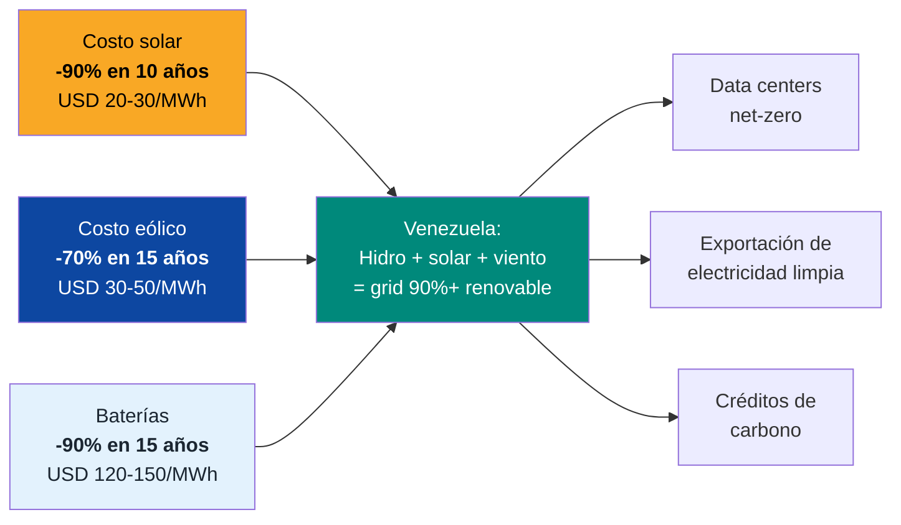
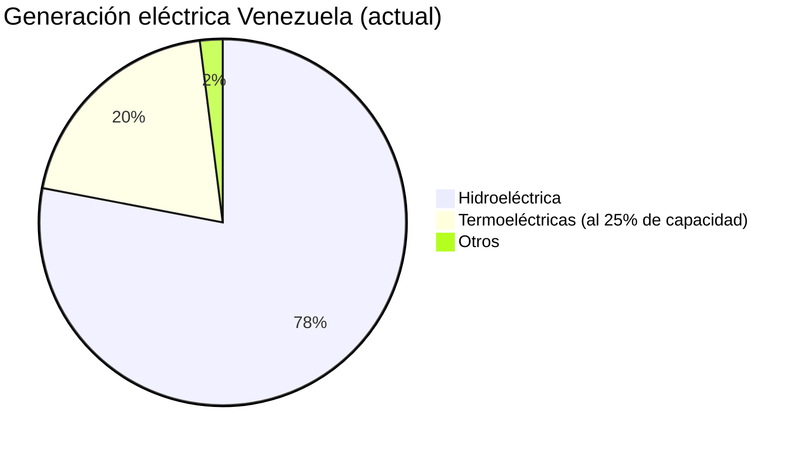
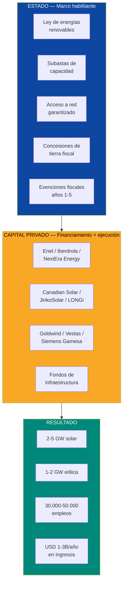
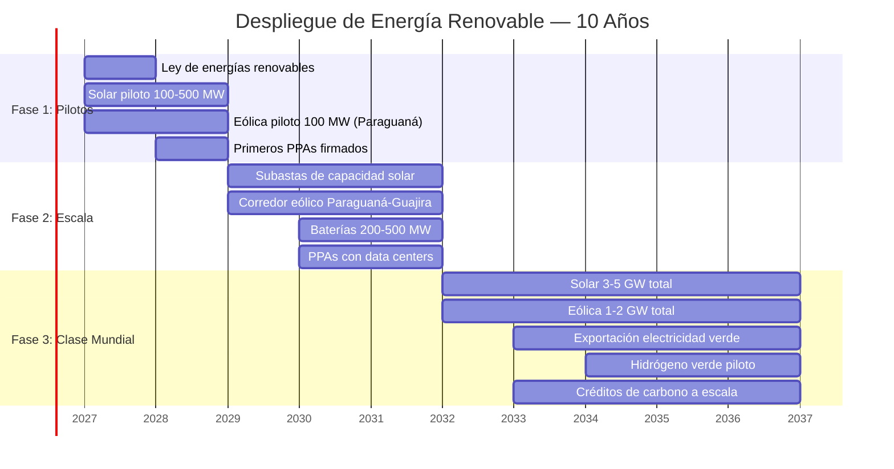
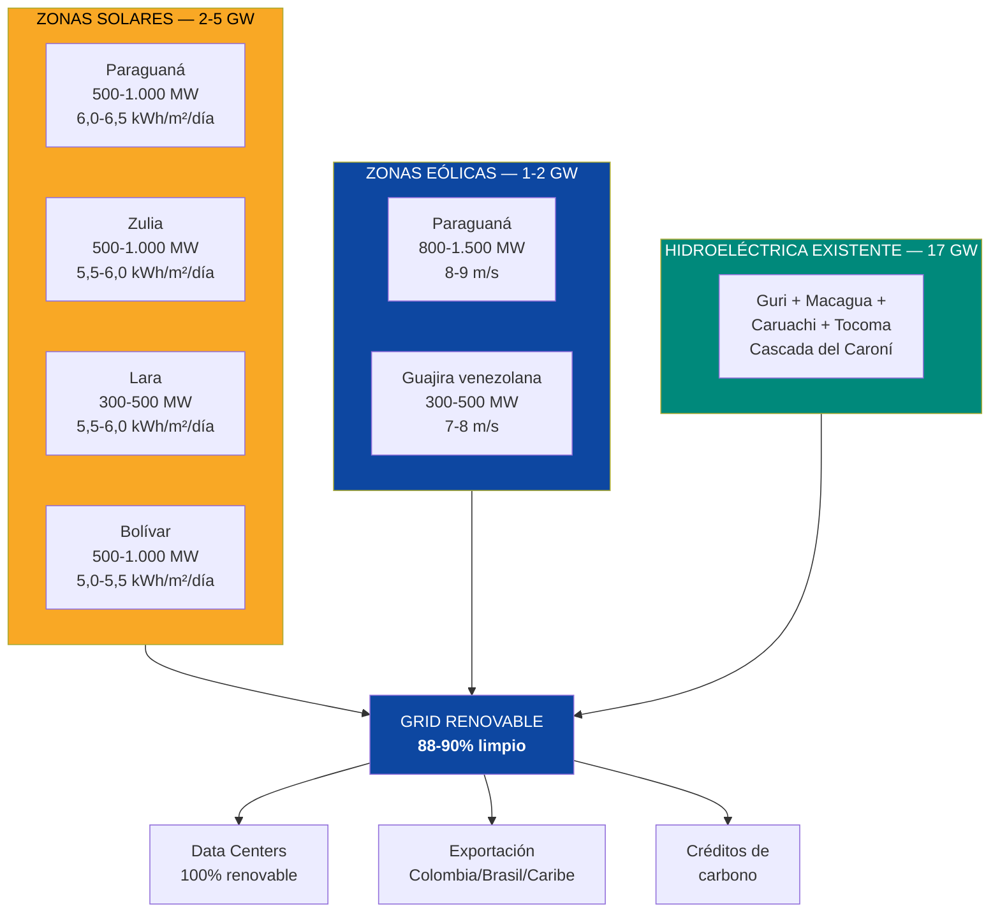
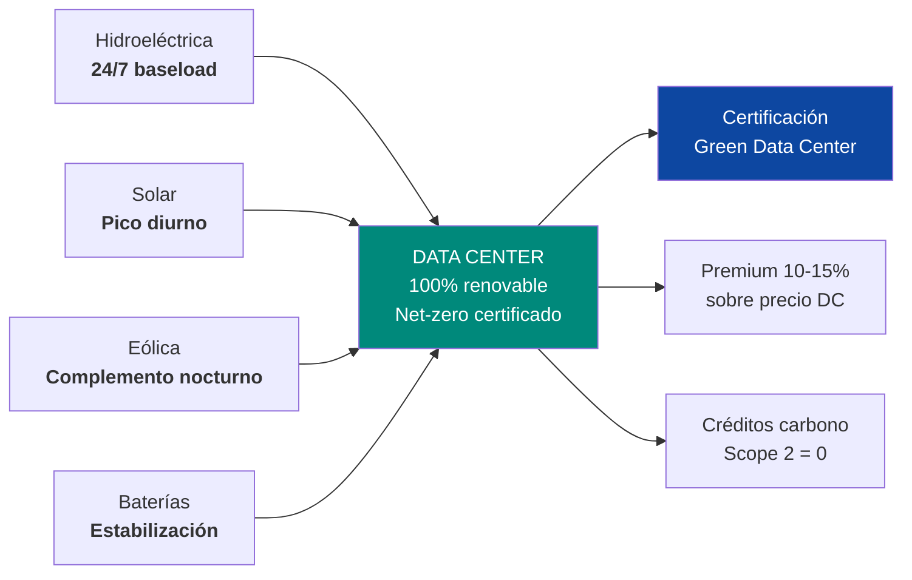
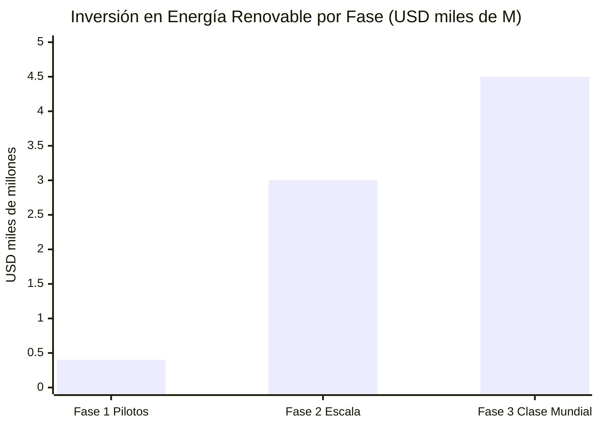
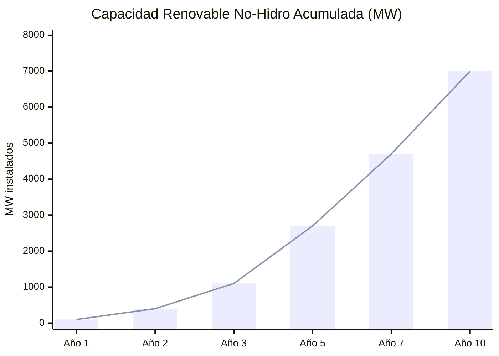
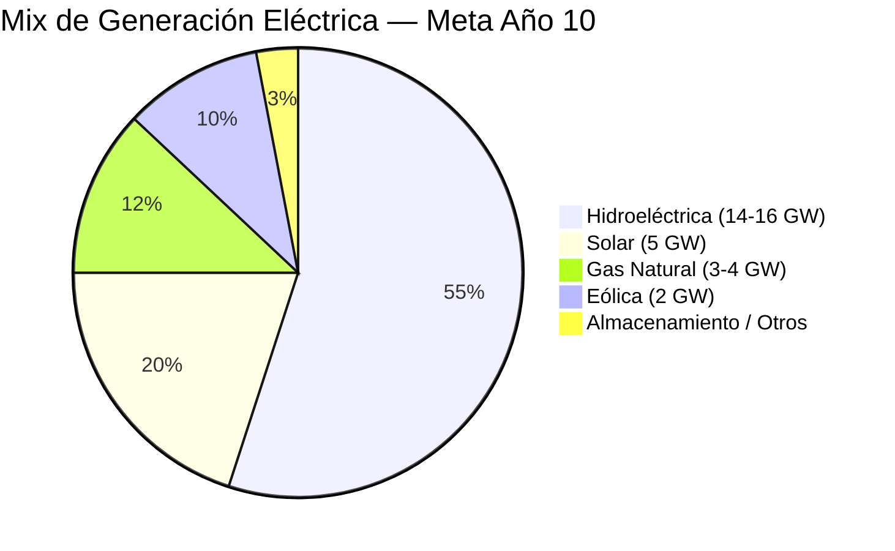

# Energia Renovable: El Combustible que No Se Acaba

:::caution Fechas ilustrativas — las fases se activan por KPIs, no por calendario
Las referencias a "Año X" en este documento son **ilustrativas**. Las fases reales se activan por condiciones verificables (PIB/cápita, formalización, pobreza). Ver [KPIs de Activación](/07-ejecucion/kpis-activacion).
:::

> Venezuela tiene petróleo para 15 años de ventana real. Tiene sol y viento para siempre. La pregunta no es si vale la pena invertir en renovables — es cuánto dinero estamos dejando en la mesa cada día que no lo hacemos.

---

## 1. La Oportunidad: Sol, Viento y la Hidroeléctrica Más Barata del Hemisferio

:::info Venezuela: ventajas naturales que la mayoría de países no tienen
Venezuela combina tres cosas que rara vez coinciden: **17 GW de hidroeléctrica instalada**, irradiación solar entre las más altas de las Américas (**5-6 kWh/m2/día**), y corredores de viento consistentes en Falcón y Zulia (**7-9 m/s**). La mayoría de los países tienen una de estas tres. Venezuela tiene las tres.
:::

| Recurso | Dato clave | Fuente |
|---------|-----------|--------|
| **Irradiación solar** | **5-6 kWh/m2/día** (Falcón, Zulia, Lara, Nueva Esparta: >6 kWh/m2/día) | [Global Solar Atlas](https://globalsolaratlas.info/) |
| **Viento** (Falcón, Paraguaná, Guajira) | **7-9 m/s** promedio anual | [Global Wind Atlas](https://globalwindatlas.info/) |
| **Hidroeléctrica existente** | 17 GW instalados (Cascada del Caroní) | [Mongabay 2023](https://news.mongabay.com/2023/08/hydropower-in-the-pan-amazon-the-guri-complex-and-the-caroni-cascade/) |
| **Costo solar global (2025)** | **USD 20-30/MWh** (caída del 90% en 10 años) | [IRENA Renewable Power Generation Costs 2024](https://www.irena.org/publications/2024/Sep/Renewable-Power-Generation-Costs-in-2023) |
| **Costo eólico onshore global** | **USD 30-50/MWh** | [IRENA 2024](https://www.irena.org/) |
| **Potencial solar Venezuela** | **2-5 GW** instalables en zonas óptimas | Estimaciones propias basadas en Global Solar Atlas |
| **Potencial eólico Venezuela** | **1-2 GW** (Falcón + Zulia + La Guajira venezolana) | [Global Wind Atlas](https://globalwindatlas.info/) |

### Por qué ahora

**Traducción para no-técnicos:** Hace 10 años instalar un panel solar costaba 10x lo que cuesta hoy. La solar ya es más barata que el gas y el carbón en la mayoría del mundo. Venezuela tiene uno de los mejores recursos solares de las Américas y no tiene un solo panel industrial instalado. Eso es como tener el campo petrolero más productivo del mundo y no haber perforado un solo pozo.

---

## 2. El Estado Actual: Cero Renovables a Escala

:::danger Venezuela: 0 MW de solar y eólica industrial
Venezuela no tiene **ninguna planta solar ni parque eólico de escala comercial** operativo. Depende al 78% de la hidroeléctrica del Caroní, con termoeléctricas al 25% de capacidad como "respaldo" que no respalda nada. Cuando hay sequía, hay apagones. Cuando falla Guri, falla todo. Esto es lo opuesto a resiliencia.
:::

| Indicador | Venezuela | Chile | Colombia | Brasil |
|-----------|-----------|-------|----------|--------|
| Capacidad solar instalada | **0 MW** | **8.000+ MW** | **800+ MW** | **15.000+ MW** |
| Capacidad eólica instalada | **0 MW** | **4.000+ MW** | **3.000+ MW** | **30.000+ MW** |
| % renovable en generación (excl. hidro) | **<1%** | **35%+** | **15%+** | **25%+** |
| Marco regulatorio para renovables | **Inexistente** | Ley 20.698 + subastas | Ley 1715 + subastas | Subastas desde 2009 |

Fuentes: capacidades instaladas — [IRENA Renewable Capacity Statistics 2025](https://www.irena.org/Publications/2025/Mar/Renewable-capacity-statistics-2025); [CNE Chile](https://www.cne.cl/); [UPME Colombia](https://www.upme.gov.co/).

### El problema de depender solo de hidro

| Riesgo | Descripción | Impacto |
|--------|-------------|---------|
| **Sequía / El Niño** | Guri depende del embalse. Sequía severa (2009-2010, 2015-2016) redujo producción hasta 40% | Apagones masivos, racionamiento |
| **Cambio climático** | Patrones de lluvia menos predecibles | Guri como fuente única se vuelve más riesgoso |
| **Concentración geográfica** | 90% de generación en un solo corredor (Caroní) | Una falla en transmisión = blackout nacional (marzo 2019) |
| **Cero redundancia** | Termoeléctricas no funcionan como backup real | Cuando falla hidro, no hay plan B |

**Solar y eólica resuelven estos cuatro riesgos:** generan donde se consume (descentralizadas), no dependen de agua, tienen patrones complementarios a la hidro (sol de día, viento fuerte en sequía), y diversifican geográficamente la generación.

---

## 3. La Solucion: 3-7 GW de Solar + Eolica en 10 Años

### Estrategia: el Estado regula, Venezuela S.A. invierte, el capital privado opera

### Fase 1: Pilotos (Año 1-2) — 100-500 MW solar + 100 MW eólica

| Componente | Detalle |
|------------|---------|
| **Solar piloto** | 3-5 plantas de 30-100 MW en Falcón, Zulia, Lara |
| **Eólica piloto** | 1 parque de 100 MW en Paraguaná (Falcón) |
| **Tecnología solar** | Paneles bifaciales de última generación (eficiencia 22-24%) + trackers de eje simple |
| **Tecnología eólica** | Turbinas de 4-6 MW (Vestas V162, Siemens Gamesa SG 6.6-170) |
| **PPAs** | Contratos de 15-20 años con CORPOELEC reformada / distribuidores privados |
| **Inversión** | USD 100-400M (solar: USD 0,4-0,6M/MW; eólica: USD 1-1,2M/MW) |
| **Empleos** | 2.000-5.000 (construcción) + 500-1.000 (operación) |
| **Ingreso anual** | USD 30-80M |

:::tip Velocidad de despliegue: solar es la energía más rápida de instalar
Una planta solar de 100 MW se construye en **6-12 meses**. Comparar con: una hidroeléctrica (5-10 años), una nuclear (10-15 años), o una termoeléctrica (2-4 años). Solar es el sprint energético perfecto para un país que necesita megawatts ahora.
:::

### Fase 2: Escala (Año 2-5) — 1-3 GW solar + 500 MW-1 GW eólica

| Componente | Detalle |
|------------|---------|
| **Solar a escala** | Subastas de capacidad de 200-500 MW por ronda (modelo Chile/Colombia) |
| **Eólica a escala** | Desarrollo del corredor eólico Paraguaná-La Guajira venezolana |
| **Almacenamiento** | Baterías de litio 200-500 MW (peak shaving, estabilización de red) |
| **Integración con hidro** | Solar genera de día, hidro se reserva para noche y picos |
| **PPAs para data centers** | Contratos específicos: solar + hidro = 100% renovable |
| **Inversión** | USD 1-3B |
| **Empleos** | 10.000-20.000 (construcción) + 3.000-5.000 (operación) |
| **Ingreso anual** | USD 200-600M |

### Fase 3: Clase Mundial (Año 5-10) — 3-5 GW solar + 1-2 GW eólica

| Componente | Detalle |
|------------|---------|
| **Capacidad total** | 3-5 GW solar + 1-2 GW eólica = **4-7 GW renovable no-hidro** |
| **Almacenamiento** | 1-2 GW (baterías + posible hidro reversible) |
| **Exportación** | Electricidad verde a Colombia, Brasil, Caribe |
| **Créditos de carbono** | Venta de RECs y créditos en mercado voluntario |
| **Hidrógeno verde** | Piloto de producción con excedentes renovables (electrólisis) |
| **Inversión acumulada** | USD 3-7B |
| **Empleos totales** | 30.000-50.000 (directos + indirectos) |
| **Ingreso anual** | USD 1-3B |

---

## 4. Zonas Optimas: Donde Poner los Paneles y las Turbinas

### Solar: los mejores sitios

| Zona | Estado | Irradiación (kWh/m2/día) | Potencial (MW) | Ventajas |
|------|--------|--------------------------|----------------|----------|
| **Paraguaná** | Falcón | **6,0-6,5** | 500-1.000 | Terreno plano, baja densidad, acceso a puertos |
| **Costa occidental Zulia** | Zulia | **5,5-6,0** | 500-1.000 | Cercanía a Maracaibo (demanda), terreno disponible |
| **Valle de Quíbor/Barquisimeto** | Lara | **5,5-6,0** | 300-500 | Zona semiárida, baja nubosidad |
| **Isla de Margarita** | Nueva Esparta | **5,5-6,0** | 100-200 | Turismo + desalinización solar |
| **Sur de Bolívar** | Bolívar | **5,0-5,5** | 500-1.000 | Cercanía a data centers (Corredor DC) |

### Eólica: los corredores de viento

| Zona | Estado | Velocidad (m/s) | Potencial (MW) | Factor capacidad | Referencia |
|------|--------|-----------------|----------------|------------------|-----------|
| **Paraguaná** | Falcón | **8-9** | 800-1.500 | 35-45% | Entre los mejores de LATAM |
| **Guajira venezolana** | Zulia | **7-8** | 300-500 | 30-38% | Mismo corredor que La Guajira colombiana |
| **Costa de Sucre** | Sucre | **6-7** | 200-300 | 25-32% | Complementa solar diurno |

:::info Paraguaná: el sitio eólico premium de Venezuela
La Península de Paraguaná tiene vientos de **8-9 m/s promedio anual** — comparables con los mejores sitios de Brasil (que tiene **30 GW** de eólica instalada). Un factor de capacidad de 35-45% significa que cada turbina produce electricidad el **35-45% del tiempo** — significativamente por encima del promedio global (28-35%). Un parque de 500 MW en Paraguaná generaría energía equivalente para **300.000-400.000 hogares**.
:::

---

## 5. Modelo de Negocio: Concesiones, Subastas y PPAs

### Estructura: el Estado regula, Venezuela S.A. invierte en grid, el privado opera

| Rol | Estado | Venezuela S.A. | Capital privado |
|-----|--------|----------------|-----------------|
| **Ley de renovables** | Aprueba y aplica | — | Aporta expertise para diseño |
| **Regulador independiente** | Crea y supervisa (modelo CREG/CNE) | — | Se somete a regulación |
| **Subastas de capacidad** | — | Diseña y adjudica como holding | Compite por contratos |
| **Terrenos** | — | Venezuela S.A. aporta tierra como equity en JVs | Arrienda a Venezuela S.A. |
| **Acceso a red** | Garantiza por ley | Invierte en grid de transmisión | Paga tarifa de transmisión |
| **Exenciones fiscales** | 5 años tax holiday para renovables | Atrae inversión |
| **Construcción y operación** | **NO** | 100% privado |
| **Regulación ambiental** | Aplica estándares (EIA obligatorio) | Cumple |

### Flujos de ingreso

| Línea de negocio | Descripción | Ingreso estimado (a escala 5 GW solar + 2 GW eólica) |
|-----------------|-------------|-------------------------------------------------------|
| **Venta de electricidad (PPAs)** | Contratos de 15-20 años con distribuidores y grandes consumidores | USD 500M-1,5B/año |
| **PPAs con data centers** | Solar + hidro = 100% renovable para DCs. Premium de green energy | USD 100-300M/año |
| **Exportación (Colombia/Brasil/Caribe)** | Electricidad verde exportada por interconexión | USD 100-300M/año |
| **Créditos de carbono (RECs)** | Certificados de energía renovable + créditos voluntarios | USD 50-200M/año |
| **Almacenamiento (peak shaving)** | Baterías venden energía en horario pico a precio premium | USD 50-150M/año |
| **Hidrógeno verde** (futuro) | Electrólisis con excedentes renovables | USD 50-200M/año (post-2035) |
| **TOTAL a escala** | | **USD 1-3B/año** |

### Data centers net-zero: la sinergia perfecta

**El pitch:** Los hyperscalers (AWS, Azure, GCP, Meta) se comprometieron a ser **100% renovables para 2030**. Necesitan desesperadamente sitios donde la electricidad sea limpia, barata y abundante. Venezuela con hidro + solar + eólica ofrece un data center **net-zero por defecto** — sin necesidad de comprar RECs en otro mercado. El premium de "green data center" es **10-15% sobre precio estándar**.

---

## 6. Comparables: Quién Ya Lo Hizo

### Chile: de 0 a 30 GW renovables en 10 años

| Indicador | Chile 2013 | Chile 2025 | Cómo lo hicieron |
|-----------|-----------|-----------|-----------------|
| Capacidad solar | ~0 MW | **8.000+ MW** | Subastas de energía + ley ERNC |
| Capacidad eólica | ~300 MW | **4.000+ MW** | PPAs con mineras + regulación predecible |
| % renovable (excl. hidro) | <5% | **35%+** | Desierto de Atacama = irradiación 6-7 kWh/m2/día |
| Costo de generación solar | >USD 100/MWh | **USD 25-35/MWh** | Competencia + escala |
| Inversión atraída | ~USD 0 | **>USD 30B** acumulados | Marco legal estable |

Fuentes: [CNE Chile](https://www.cne.cl/); [Coordinador Eléctrico Nacional](https://www.coordinador.cl/); [IRENA](https://www.irena.org/).

**Lección para Venezuela:** Chile demostró que un país sin industria renovable puede construir una en 10 años con dos cosas: recurso natural (Atacama = sol, Venezuela = sol + viento + hidro) y marco regulatorio predecible (subastas + PPAs de largo plazo). Venezuela tiene mejor recurso combinado que Chile — lo que le falta es la ley y las subastas.

### Brasil: boom eólico desde los Llanos hasta el Nordeste

| Indicador | Brasil 2010 | Brasil 2025 | Fuente |
|-----------|-----------|-----------|--------|
| Capacidad eólica | 1.000 MW | **30.000+ MW** | [ABEEÓLICA](https://abeeolica.org.br/) |
| Inversión acumulada | ~USD 2B | **>USD 40B** | [Bloomberg NEF](https://about.bnef.com/) |
| Empleos directos eólica | ~5.000 | **300.000+** | ABEEÓLICA |
| Exportación de equipos | Cero | Fábricas de palas/nacelles (Wobben, Vestas) | Producción local |

**Lección para Venezuela:** Brasil partió de 1 GW en 2010 y llegó a 30 GW en 15 años. El nordeste brasileño tiene vientos comparables a los de Paraguaná (7-9 m/s). La diferencia: Brasil tenía subastas de energía desde 2009. Venezuela tiene 0 MW y 0 subastas.

### Marruecos: renovables en país petrolero emergente

| Indicador | Marruecos 2015 | Marruecos 2025 | Fuente |
|-----------|---------------|---------------|--------|
| Capacidad solar | ~0 MW | **4.500+ MW** | [MASEN](https://www.masen.ma/) |
| % renovable en generación | <10% | **>40%** | IEA |
| Noor Ouarzazate | N/A | **580 MW** (solar CSP + PV, la mayor de África) | [Power Technology](https://www.power-technology.com/) |
| Meta 2030 | N/A | **52% renovable** | Gobierno de Marruecos |

**Lección para Venezuela:** Marruecos es un país con menos recursos que Venezuela (sin hidro) y logró 40%+ renovable en 10 años. La agencia MASEN (Moroccan Agency for Sustainable Energy) actúa como facilitador — licitaciones + PPAs + terreno. Venezuela necesita su propio MASEN.

---

## 7. Créditos de Carbono: Revenue Stream Adicional

:::tip Los créditos de carbono no son limosna — son un negocio
El mercado voluntario de carbono alcanzó **USD 2.000M en 2024** y proyecta **USD 40-100B para 2030** ([McKinsey](https://www.mckinsey.com/capabilities/sustainability/our-insights/a-blueprint-for-scaling-voluntary-carbon-markets-to-meet-the-climate-challenge)). Cada MWh de solar o eólica que desplaza generación fósil produce un crédito de ~0,5 toneladas de CO2 evitadas. A USD 20-50/ton, un parque solar de 1 GW genera **USD 20-40M/año** en créditos de carbono — sobre el ingreso normal de venta de electricidad.
:::

| Fuente de créditos | Volumen estimado (a escala) | Precio estimado | Ingreso anual |
|--------------------|-----------------------------|-----------------|---------------|
| **Solar 5 GW** | 3-5 M toneladas CO2/año | USD 20-50/ton | USD 60-250M |
| **Eólica 2 GW** | 1-2 M toneladas CO2/año | USD 20-50/ton | USD 20-100M |
| **Data centers net-zero** | Premium de certificación verde | 10-15% sobre precio DC | USD 30-100M |
| **TOTAL** | **4-7 M toneladas CO2/año** | | **USD 110-450M/año** |

### Certificaciones requeridas

| Estándar | Qué certifica | Por qué importa |
|----------|---------------|-----------------|
| **[Gold Standard](https://www.goldstandard.org/)** | Créditos de carbono con co-beneficios sociales | Premium de 30-50% sobre créditos genéricos |
| **[Verra VCS](https://verra.org/)** | Reducción verificada de emisiones | Estándar más usado en mercado voluntario |
| **I-REC** | Certificados de energía renovable | Requerido por corporaciones para reportar Scope 2 |
| **RE100** | 100% electricidad renovable para corporaciones | 400+ empresas comprometidas (Apple, Google, Microsoft, etc.) |

---

## 8. Aliados Potenciales

| Empresa/Entidad | País | Experiencia | Rol en Venezuela |
|------------------|------|------------|-----------------|
| **Enel Green Power** | Italia | 60+ GW renovables en 30 países | Desarrollador + operador solar y eólico |
| **Iberdrola** | España | Líder global eólico onshore + offshore | Parques eólicos Falcón/Zulia + distribución |
| **NextEra Energy** | EE.UU. | Mayor generador de solar y eólica del mundo | Anchor developer + financiamiento |
| **Canadian Solar** | Canadá | Top 5 fabricante de paneles + desarrollador | Proveedor de módulos + desarrollo de plantas |
| **Goldwind** | China | 3er fabricante de turbinas del mundo | Turbinas eólicas (si no hay restricción geopolítica) |
| **Vestas** | Dinamarca | Mayor fabricante de turbinas eólicas | Turbinas para corredores de Falcón/Zulia |
| **Siemens Gamesa** | España/Alemania | Turbinas eólicas + servicios | Alternativa a Vestas/Goldwind |
| **LONGi Green Energy** | China | Mayor fabricante de paneles del mundo | Módulos para plantas solares |
| **AES Corporation** | EE.UU. | IPP con operaciones en 14 países LATAM | Desarrollador + operador integrado |
| **Acciona Energía** | España | 14+ GW renovables en 40 países | Desarrollo solar + eólico |
| **BID / CAF** | Multilateral | Financiamiento de energía renovable en LATAM | Préstamos concesionales + asistencia técnica |
| **IFC (World Bank)** | Multilateral | Scaling Solar program (50+ países) | Estructura de subastas + financiamiento |
| **Green Climate Fund** | Multilateral | USD 13B+ movilizados para países en desarrollo | Co-financiamiento de proyectos |

:::caution Sobre proveedores chinos (LONGi, Goldwind, JinkoSolar)
Los paneles solares chinos son los más baratos del mundo y dominan el 80%+ del mercado. Para paneles (producto manufacturado), no hay restricción geopolítica comparable a Huawei/5G. Sin embargo, para turbinas eólicas con software de control integrado, la sensibilidad es mayor. **Recomendación:** paneles solares chinos son aceptables; turbinas eólicas preferir Vestas/Siemens Gamesa para evitar fricciones con EE.UU.
:::

---

## 9. Inversión Total y Generación de Empleo

### Inversión por fase

| Fase | Inversión | Capacidad | Timeline | Empleos |
|------|-----------|-----------|----------|---------|
| Fase 1: Pilotos | USD 100-400M | 200-600 MW | Año 1-2 | 3.000-6.000 |
| Fase 2: Escala | USD 1-3B | 1,5-4 GW acumulados | Año 2-5 | 13.000-25.000 |
| Fase 3: Clase Mundial | USD 2-4B | 4-7 GW acumulados | Año 5-10 | 30.000-50.000 |
| **TOTAL** | **USD 3-7B** | **4-7 GW** | **10 años** | **30.000-50.000** |

### Generación de empleo por categoría

| Categoría | Fase 1 | Fase 2 | Fase 3 (acumulado) |
|-----------|--------|--------|---------------------|
| **Construcción** | 2.000-4.000 | 8.000-15.000 | Rotativo |
| **Operación y mantenimiento** | 500-1.000 | 3.000-5.000 | 8.000-12.000 |
| **Ingeniería y diseño** | 200-500 | 1.000-2.000 | 2.000-3.000 |
| **Manufactura local** (ensamblaje, estructuras) | 0 | 1.000-3.000 | 5.000-10.000 |
| **Empleos indirectos** | 1.000-2.000 | 5.000-10.000 | 15.000-25.000 |
| **TOTAL** | **3.000-6.000** | **13.000-25.000** | **30.000-50.000** |

:::info Manufactura local: no solo instalar, sino fabricar
Chile y Brasil lograron que fabricantes de turbinas (Vestas, Wobben) y paneles abrieran plantas locales cuando el mercado creció lo suficiente (>5 GW). Venezuela puede negociar contenido local mínimo (30-50%) en las subastas, creando una industria de manufactura de estructuras metálicas, cableado, inversores y eventualmente ensamblaje de paneles.
:::

---

## 10. Riesgos y Mitigaciones

| # | Riesgo | Prob. | Impacto | Mitigación |
|---|--------|-------|---------|------------|
| 1 | **Sin marco legal de renovables** — no hay ley, no hay subastas, no hay inversión | Alta | Crítico | Ley de renovables como prioridad legislativa (año 1). Modelo: Chile Ley 20.698 o Colombia Ley 1715 |
| 2 | **Red de transmisión no soporta** — generación renovable sin red que la evacúe | Alta | Alto | Inversión en transmisión es paralela. Ver [Capacidad Eléctrica](./capacidad-electrica). Solar distribuida reduce presión sobre transmisión |
| 3 | **Riesgo país ahuyenta capital** | Alta | Alto | PPAs denominados en USD + estructura SPV offshore + seguro MIGA. Los PPAs de 15-20 años dan certidumbre |
| 4 | **Competencia regional** — Chile/Colombia/Brasil ya capturaron los mejores desarrolladores | Media | Medio | Venezuela compite en costo de energía (hidro backup gratuito) y en la combinación hidro + solar + viento que pocos tienen |
| 5 | **Intermitencia** — sol de día, viento variable | Media | Medio | Hidro como backup natural (modula producción según solar/eólica). Baterías para estabilización. Complementariedad solar-eólica |
| 6 | **Cadena de suministro** — paneles y turbinas son importados | Media | Medio | Inventario estratégico. Diversificación de proveedores (chinos + europeos). Manufactura local a mediano plazo |
| 7 | **Oposición local** — comunidades que rechazan plantas solares/eólicas en su territorio | Media | Medio | Consulta previa + beneficios compartidos (empleos, electricidad gratis, regalías locales). Modelo: Colombia consulta previa para eólica en La Guajira |
| 8 | **Corrupción en subastas** | Alta | Medio | Subastas internacionales con veeduría multilateral (IFC/BID). Transparencia total. Penalidades por colusión |

---

## 11. Proyección Financiera a 10 Años

| Indicador | Año 1 | Año 2 | Año 3 | Año 5 | Año 7 | Año 10 |
|-----------|-------|-------|-------|-------|-------|--------|
| **Capacidad solar (MW)** | 100 | 300 | 800 | 2.000 | 3.500 | 5.000 |
| **Capacidad eólica (MW)** | 0 | 100 | 300 | 700 | 1.200 | 2.000 |
| **Capacidad total renovable no-hidro (MW)** | 100 | 400 | 1.100 | 2.700 | 4.700 | 7.000 |
| **Generación anual (TWh)** | 0,2 | 0,7 | 2,0 | 5,0 | 8,5 | 13,0 |
| **Inversión acumulada (USD M)** | 100 | 350 | 900 | 2.500 | 4.500 | 7.000 |
| **Ingreso anual (USD M)** | 10 | 40 | 120 | 350 | 700 | 1.500 |
| **Créditos de carbono (USD M/año)** | 2 | 8 | 25 | 70 | 140 | 300 |
| **Empleos directos** | 1.500 | 4.000 | 8.000 | 15.000 | 25.000 | 35.000 |
| **Empleos indirectos** | 1.000 | 3.000 | 6.000 | 12.000 | 20.000 | 30.000 |

### Retorno de inversión

| Métrica | Valor |
|---------|-------|
| **Inversión total (10 años)** | **USD 3-7B** |
| **Ingreso acumulado (10 años)** | **USD 3-5B** (electricidad + créditos) |
| **LCOE promedio** | **USD 25-40/MWh** (competitivo globalmente) |
| **Payback** | **Año 6-8** (con PPAs de largo plazo) |
| **IRR estimado** | **12-18%** |
| **Vida útil de activos** | **25-30 años** (paneles solares), **20-25 años** (turbinas) |
| **Valor residual** | Activos siguen generando 15-20 años después del payback |

---

## 12. Contribución al Plan Venezuela S.A.

### Mix energético meta (Año 10)

| Parámetro | Valor |
|-----------|-------|
| **Grid renovable total** | **88%** (hidro 55% + solar 20% + eólica 10% + almacenamiento 3%) |
| **Inversión en renovables no-hidro** | USD 3-7B de USD 15-25B en electricidad total |
| **Data centers 100% renovables** | Hidro + solar + eólica = net-zero sin RECs externos |
| **Exportación de electricidad verde** | USD 100-300M/año a Colombia, Brasil, Caribe |
| **Reducción de emisiones** | 4-7M toneladas CO2/año evitadas |
| **Empleos** | 30.000-50.000 directos + indirectos |
| **Ingreso anual (año 10)** | USD 1-3B (electricidad + créditos + exportación) |

:::tip La ecuación final
Venezuela + hidro + solar + eólica = el grid más limpio y barato de las Américas. Eso atrae data centers (USD 2-3B/año). Eso genera créditos de carbono (USD 100-450M/año). Eso habilita hidrógeno verde (futuro). Y todo eso sucede **sin quemar una gota de petróleo** — que se vende a USD 60/barril para el Fondo de Inversión Venezuela S.A..

**Petróleo es combustible. Las renovables son destino.**
:::

---

## Documentos Relacionados

- [Capacidad Electrica](./capacidad-electrica) — Solar y eolica complementan la base hidroelectrica en el mix energetico nacional
- [Data Centers IA](./data-centers-ia) — Renovables habilitan data centers 100% verdes con certificacion de creditos de carbono
- [Agro y Ganaderia](./agro-ganaderia) — Energia solar off-grid para bombeo de agua y electricidad rural en zonas agricolas
- [Minerales Criticos](./minerales-criticos) — Litio y tierras raras necesarios para baterias y turbinas eolicas
- [Manufactura Industrial](./manufactura-industrial) — Fabricacion local de componentes solares y eolicos
- [Modelo de Concesiones](./modelo-concesiones) — Concesiones de generacion renovable con PPAs de 15-20 anos (30-50 anos)

---

## Fuentes

| # | Fuente | Dato |
|---|--------|------|
| 1 | [Global Solar Atlas](https://globalsolaratlas.info/) | Irradiación solar Venezuela 5-6 kWh/m2/día |
| 2 | [Global Wind Atlas](https://globalwindatlas.info/) | Velocidad de viento Falcón/Zulia 7-9 m/s |
| 3 | [IRENA Renewable Power Generation Costs 2024](https://www.irena.org/publications/2024/Sep/Renewable-Power-Generation-Costs-in-2023) | Costo solar USD 20-30/MWh, caída 90% en 10 años |
| 4 | [IRENA Renewable Capacity Statistics 2025](https://www.irena.org/Publications/2025/Mar/Renewable-capacity-statistics-2025) | Capacidades instaladas Chile, Brasil, Colombia |
| 5 | [CNE Chile](https://www.cne.cl/) | Chile de 0 a 8.000+ MW solar en 10 años |
| 6 | [ABEEÓLICA Brasil](https://abeeolica.org.br/) | Brasil 30.000+ MW eólica, 300.000+ empleos |
| 7 | [MASEN Marruecos](https://www.masen.ma/) | Modelo de agencia de renovables |
| 8 | [McKinsey — Scaling Voluntary Carbon Markets](https://www.mckinsey.com/capabilities/sustainability/our-insights/a-blueprint-for-scaling-voluntary-carbon-markets-to-meet-the-climate-challenge) | Mercado de carbono USD 2B → USD 40-100B |
| 9 | [Mongabay 2023](https://news.mongabay.com/2023/08/hydropower-in-the-pan-amazon-the-guri-complex-and-the-caroni-cascade/) | Cascada Caroní 17 GW |
| 10 | [Coordinador Eléctrico Nacional Chile](https://www.coordinador.cl/) | Mix renovable Chile 35%+ |
| 11 | [Bloomberg NEF](https://about.bnef.com/) | Inversión acumulada renovables Brasil >USD 40B |
| 12 | [Gold Standard](https://www.goldstandard.org/) | Certificación de créditos de carbono premium |
| 13 | [IFC Scaling Solar](https://www.ifc.org/en/what-we-do/sector-expertise/infrastructure/scaling-solar) | Programa de subastas solares en 50+ países |
