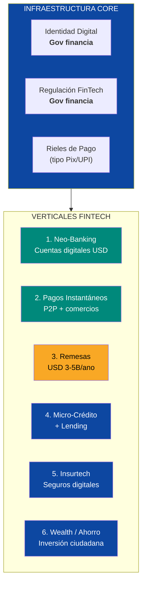
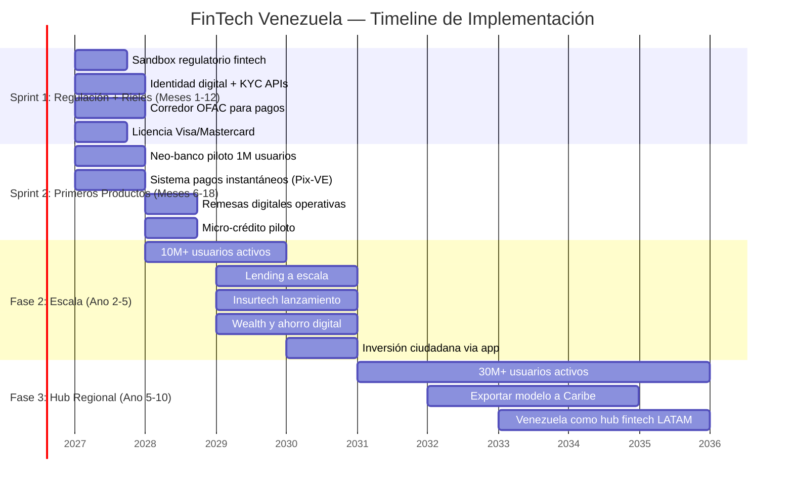
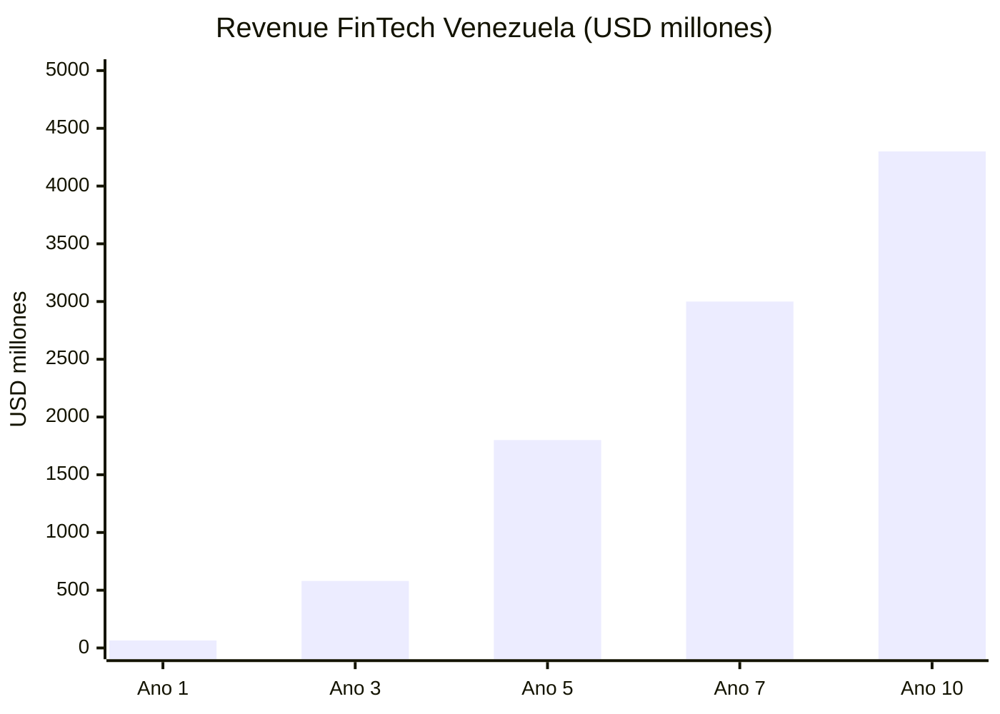
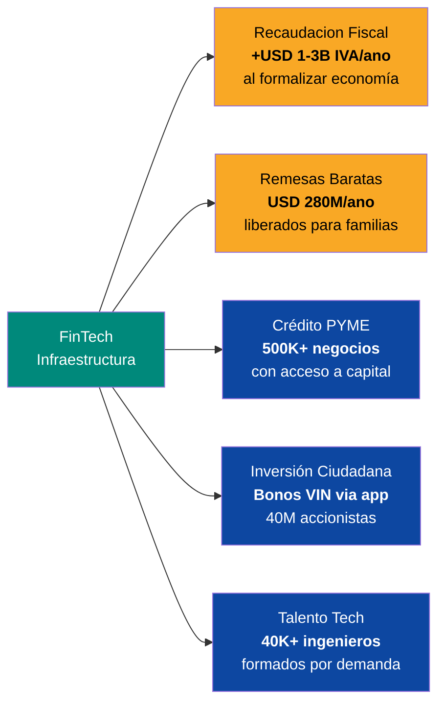

# FinTech y Banca Digital: 40 Millones de Clientes Sin Banco

> 40 millones de personas en una economía dolarizada sin infraestructura financiera moderna. Ni Zelle, ni Venmo, ni Pix, ni UPI. El mercado de pagos digitales más grande sin explotar en las Américas. El Estado pone el marco regulatorio y la identidad digital. Venezuela S.A. facilita la infraestructura de pagos como holding ciudadano. El capital privado pone la tecnología y opera. El resultado: un sistema financiero que nace digital, sin legacy bancario, directamente en el siglo XXI.

---

## 1. La Oportunidad: El Mayor Mercado Desbancarizado de las Américas

:::danger 40 millones de personas sin servicios financieros modernos
Venezuela tiene la **mayor población sin acceso a fintech** en las Americas. Los bancos locales operan con sistemas de los años 90. No hay pagos instantáneos. No hay neo-bancos. No hay micro-crédito digital. No hay seguros paramétricos. En un país**de facto dolarizado**, la infraestructura financiera sigue operando como si estuviera en 1998. Eso no es una crisis — es una **oportunidad de USD 5-15B**.
:::

| Dato | Cifra | Fuente |
|------|-------|--------|
| Poblacion total | **~30M** (residentes) + **7,9M** diaspora | [UNHCR, dic. 2025](https://www.unhcr.org/) |
| Penetración bancaria formal | **~45%** (cuentas básicas, sin funcionalidad real) | [Requiere investigacion] |
| Penetración smartphone | **~70%** | [GSMA Intelligence 2024](https://www.gsmaintelligence.com/) |
| Remesas anuales de diaspora | **USD 3-5B/ano** | [BID/FOMIN 2024](https://www.iadb.org/) |
| Comisión promedio remesas a Venezuela | **7-15%** (hasta 20% por canales informales) | [Remitly/World Bank 2024](https://remittanceprices.worldbank.org/) |
| Economía dolarizada de facto | **>65%** de transacciones en USD | [Ecoanalitica 2024](https://ecoanalitica.com/) |
| Mercado fintech LATAM (2024) | **USD 150B+** valoración combinada | [LAVCA 2024](https://lavca.org/) |
| Crecimiento fintech LATAM | **CAGR 25-30%** | [Americas Market Intelligence](https://americasmi.com/) |
| Usuarios Nubank (referencia) | **100M+** (de cero en 2013) | [Nubank IR 2025](https://investors.nu/) |

**Traducción para no-tecnicos:** Imagina que 40 millones de personas usan dólares pero no tienen donde guardarlos, enviarlos o recibirlos digitalmente. Pagan en efectivo, envian remesas por mulas (personas que cruzan fronteras con cash), y no tienen acceso a crédito, seguros ni ahorro digital. Eso es Venezuela hoy. Quien construya la infraestructura financiera digital captura a toda la población.

### Por que ahora y no antes

| Factor habilitante | Estado | Impacto |
|-------------------|--------|---------|
| **Dolarización de facto** | Activa desde 2019 | Elimina el problema de moneda local volátil. Fintech opera en USD desde dia 1 |
| **Penetración smartphone** | ~70% | El hardware ya esta en los bolsillos. Solo falta el software |
| **Starlink** | Desplegandose | Conectividad en zonas rurales donde bancos jamas abririan sucursales |
| **Diaspora conectada** | 7,9M personas con cuentas bancarias en países de destino | Canal de remesas + adopción tech + capital |
| **Cero incumbentes digitales** | Ningún neo-banco opera | First mover advantage total. No hay un Nubank, un Ualá ni un Nequi venezolano |
| **Poblacion joven** | Edad mediana ~28 años | Alta adopción tech, baja resistencia al cambio |

---

## 2. Los 6 Verticales de Oportunidad

### Vertical 1: Neo-Banking — Cuentas Digitales en USD

| Componente | Detalle |
|------------|---------|
| **Producto** | Cuenta digital en USD con tarjeta virtual/fisica (Visa/Mastercard). Sin sucursal, sin papeles, apertura en 5 minutos |
| **Mercado** | 30M residentes + 7,9M diaspora = **~38M clientes potenciales** |
| **Revenue** | Interchange fees (1,5-3%), cuentas premium, FX spread, intereses sobre depositos |
| **Revenue estimado (ano 5)** | **USD 500M-1B/ano** (a 15M usuarios activos con USD 200/ano ARPU) |
| **Referencia** | Nubank: USD 0 → USD 8B revenue en 10 años con 100M usuarios |
| **Operadores potenciales** | Nubank, Mercado Pago, Ualá, Nequi (Bancolombia), Block/Square, Revolut |

### Vertical 2: Pagos Instantáneos — El "Pix" Venezolano

| Componente | Detalle |
|------------|---------|
| **Producto** | Sistema de pagos instantáneos 24/7 entre personas, comercios, gobierno. Gratis para P2P, micro-fee para comercios |
| **Referencia** | Brasil Pix: **224M usuarios**, **4B transacciones/mes**, lanzo en nov. 2020 — [BCB 2025](https://www.bcb.gov.br/en/financialstability/pix_en) |
| **Referencia** | India UPI: **16B transacciones/mes**, **430M usuarios** — [NPCI 2025](https://www.npci.org.in/) |
| **Implementación** | Gobierno crea los rieles (banco central o entidad reguladora). Fintechs y bancos se conectan. Interoperabilidad obligatoria |
| **Revenue** | Indirecto: reduce economía informal (mas IVA recaudado), habilita lending (data de transacciones), reduce costos de cash handling |
| **Impacto fiscal** | **+USD 1-3B/ano en recaudación de IVA** al formalizar transacciones en efectivo |

:::tip El efecto Pix: lo que Brasil enseno al mundo
Pix se lanzo en noviembre 2020 y en 3 años tenia 224 millones de usuarios — mas que la población de Brasil. Gratis para personas, costo minimo para comercios. Resultado: cayo el uso de efectivo un 30%, aumento la recaudación fiscal, y los costos de transferencia bancaria bajaron de USD 2-5 a cero. Venezuela puede replicar esto en 12-18 meses con la ventaja de empezar desde cero — sin legacy systems que migrar.
:::

### Vertical 3: Remesas — USD 3-5B/ano con 15% de Comisión

| Componente | Detalle |
|------------|---------|
| **Mercado** | **USD 3-5B/ano** en remesas de 7,9M venezolanos en el exterior |
| **Problema** | Comisiones de **7-15%** (hasta 20% por canales informales). Western Union, Remitly, canales bancarios caros |
| **Oportunidad** | Reducir comisiones a **1-3%** con transferencias digitales directas |
| **Revenue** | A 3% de comisión sobre USD 4B = **USD 120M/ano**. A escala con cross-sell: **USD 300-500M/ano** |
| **Revenue pool liberado** | Si la comisión baja de 10% a 3%, se liberan **USD 280M/ano** que van al bolsillo de familias venezolanas |
| **Operadores potenciales** | Wise (TransferWise), Remitly, dLocal, Block/Square, stablecoins (USDC/USDT via Circle/Tether) |

### Vertical 4: Micro-Crédito y Lending

| Componente | Detalle |
|------------|---------|
| **Problema** | Cero acceso a crédito formal para ~80% de la población. Tasas de usura del 10-20% mensual en mercado informal |
| **Oportunidad** | Micro-créditos (USD 50-5.000) con scoring alternativo (data de smartphone, pagos, comercio) |
| **Revenue** | Spread de tasa (15-35% anual) + fees. A 5M prestamos promedio USD 500: **USD 375-875M/ano** en intereses |
| **Referencia** | M-Pesa + M-Shwari (Kenya): 30M prestamos en 5 años. Mercado Crédito (LATAM): USD 4B+ cartera |
| **Riesgo** | Default rates en mercados emergentes: 5-15%. Requiere scoring sofisticado y cobro digital |

### Vertical 5: Insurtech — Seguros Digitales

| Componente | Detalle |
|------------|---------|
| **Problema** | Penetración de seguros en Venezuela: **<2%** del PIB (LATAM promedio: 3,2%) |
| **Oportunidad** | Micro-seguros: salud (USD 5-15/mes), vida (USD 2-5/mes), agricola parametrico, vehiculos |
| **Revenue (ano 5)** | **USD 200-500M/ano** en primas |
| **Referencia** | BIMA (emergentes): 40M clientes en seguros mobile-first. Lemonade: seguro 100% digital |
| **Ventaja** | En un país donde el sistema de salud colapso, un micro-seguro de USD 10/mes que cubra emergencias es game-changer |

### Vertical 6: Wealth y Ahorro Digital

| Componente | Detalle |
|------------|---------|
| **Producto** | Cuentas de ahorro en USD con rendimiento, micro-inversiones (fracciones de ETFs/acciones), stablecoins |
| **Revenue (ano 5)** | **USD 100-300M/ano** en management fees + spread |
| **Referencia** | Nu Invest (Nubank): 10M+ inversores. Ualá: cuenta remunerada. GBM (México): inversiones accesibles |
| **Conexion con el plan** | Vehiculo para la **inversión ciudadana** (bonos VIN) — cada venezolano puede comprar participacion en el Fondo de Inversión Venezuela S.A. via app |

---

## 3. Lo Que el Estado Provee (y Lo Que NO Hace)

:::info Ni el Estado ni Venezuela S.A. operan fintechs. El Estado crea las reglas del juego. Venezuela S.A. facilita la infraestructura de pagos.
El rol del Estado es exactamente el mismo que en Estonia, Singapur o India: financiar identidad digital, regulación moderna, y rieles de pago. Venezuela S.A. puede invertir en la infraestructura base (rieles de pago, identidad digital) como accionista. El sector privado construye las apps, los productos y la experiencia de usuario. **Cero burocracia operando bancos.**
:::

| El Estado financia y supervisa | Detalle | Referencia |
|-------------------|---------|-----------|
| **Identidad digital** | Cedula biométrica + firma electrónica. Base de datos unica verificable via API. Sin esto, no hay KYC digital | Estonia: [e-Residency](https://e-resident.gov.ee/), India: [Aadhaar](https://uidai.gov.in/) (1.4B registros) |
| **Regulación fintech** | Sandbox regulatorio para nuevos productos. Licencias de pago, lending, seguros digitales. Proteccion al consumidor | UK: [FCA Sandbox](https://www.fca.org.uk/firms/innovation/regulatory-sandbox), Brasil: [BCB regulación Pix](https://www.bcb.gov.br/), México: [Ley Fintech 2018](https://www.gob.mx/) |
| **Rieles de pago** | Sistema de pagos instantáneos (tipo Pix/UPI) operado por entidad autonoma. Interoperabilidad obligatoria | Brasil Pix, India UPI, México CoDi/DiMo |
| **Anti-lavado (AML/KYC)** | Marco legal AML compatible con FATF/GAFI. Registro de beneficiarios finales. Reporte de transacciones sospechosas | [FATF Standards](https://www.fatf-gafi.org/) |
| **Corredor de sanciones** | Licencias OFAC para operadores fintech. Compliance claro para que Visa/Mastercard/Swift operen sin riesgo legal | Modelo licencia Chevron — [OFAC](https://ofac.treasury.gov/) |
| **Proteccion de datos** | Ley de protección de datos personales compatible con GDPR. Requisito para operar con datos financieros | EU GDPR, Brasil LGPD |

| Lo que ni el Estado ni Venezuela S.A. hacen | Por que |
|---------------------------------------------|---------|
| Operar bancos o fintechs | Ni el Estado ni Venezuela S.A. son bancos. PDVSA demostro que el Estado no opera negocios |
| Fijar tasas de interes | El mercado las determina. El regulador supervisa excesos |
| Subsidiar productos financieros | Distorsiona el mercado. El subsidio va directo al ciudadano, no al intermediario |
| Crear "moneda digital estatal" (CBDC) | El Petro demostro que no funciona. Stablecoins privadas (USDC) ya existen |
| Bloquear competencia extranjera | Mas operadores = mejores precios para el ciudadano |

---

## 4. Capital Extranjero: Quien Construye Esto

### Operadores fintech

| Empresa | País| Por que participarian | Rol |
|---------|------|----------------------|-----|
| **Nubank** | Brasil | 100M+ usuarios, expansion LATAM activa, expertise en mercados sin legacy | Neo-banco ancla. Cuentas USD, tarjetas, crédito |
| **Mercado Pago** | Argentina | Ya opera en 7 países LATAM. Integrado con e-commerce (Mercado Libre) | Pagos + lending + e-commerce financiero |
| **Block (Square/Cash App)** | EE.UU. | Cash App tiene 57M+ usuarios. Expertise en pagos P2P y crypto. Presencia en mercados emergentes via Afterpay | Pagos instantáneos + remesas + crypto |
| **Wise (TransferWise)** | UK | Lider global en transferencias internacionales baratas. 16M+ clientes. Comisiones <1% | Remesas + cuentas multi-divisa |
| **Revolut** | UK | 50M+ usuarios, licencia bancaria en multiples jurisdicciones | Neo-banco, crypto, trading |
| **Ualá** | Argentina | 8M+ usuarios en Argentina + México. Modelo low-cost para jovenes | Neo-banco para segmento joven/masivo |
| **dLocal** | Uruguay | Procesador de pagos para mercados emergentes. Conecta merchants globales con LATAM | Infraestructura de pagos cross-border |
| **Rappi** | Colombia | Super-app con 30M+ usuarios LATAM. RappiPay ya opera | Super-app financiera (pagos + crédito + seguros) |

### Venture Capital e inversores

| Fondo | Track record | Ticket estimado |
|-------|-------------|----------------|
| **Kaszek Ventures** | Mayor VC de LATAM. Invirtio en Nubank ($5M seed → $50B+ empresa) | USD 50-200M |
| **SoftBank Latin America** | Fund I + II = USD 8B+. Invirtio en Ualá, Kavak, Rappi | USD 100-500M |
| **Y Combinator** | 4.000+ startups financiadas. Pipeline de founders venezolanos en diaspora | Seed + growth |
| **a16z (Andreessen Horowitz)** | Fintech fund de USD 2.2B. Invirtio en Ramp, Plaid, Coinbase | USD 100-300M |
| **General Atlantic** | Invirtio en Nubank, dLocal. Expertise fintech emergentes | USD 200-500M |
| **Sequoia Capital** | Invirtio en Stripe, Klarna, Brex | USD 100-500M |
| **Tiger Global** | Invirtio en Nubank (USD 1B+), Ualá | USD 100-300M |

### Infraestructura financiera

| Empresa | Rol | Por que es critico |
|---------|-----|-------------------|
| **Visa** | Red de tarjetas, tokenizacion | Sin Visa no hay tarjetas. Requiere corredor OFAC limpio |
| **Mastercard** | Red de tarjetas, inclusion financiera | Mastercard Labs opera en mercados emergentes |
| **Stripe** | Procesamiento de pagos online, infraestructura API | Stripe Atlas permite crear empresas desde dia 1. Prerequisito para e-commerce |
| **Plaid** | Conexion entre apps y cuentas bancarias | Open banking infrastructure |
| **Circle (USDC)** | Stablecoin regulada. Transferencias en USD sin Swift | Alternativa a banking rails para remesas y pagos cross-border |
| **Chainalysis** | Compliance crypto y AML | Monitoreo de transacciones para cumplir FATF/OFAC |

---

## 5. Sprint de Implementación

### Sprint 1 (Meses 1-12): Las Bases

| Acción | Resultado | Costo | Quien |
|--------|----------|-------|-------|
| Crear sandbox regulatorio fintech | Licencias para neo-bancos, pagos, lending | USD 5-10M (setup regulatorio) | Gobierno + asesores internacionales (FCA UK, BCB Brasil) |
| Desplegar identidad digital con APIs de verificacion | KYC digital en 2 minutos, sin papeles | USD 50-100M | Gobierno + Thales/IDEMIA (proveedores ID) |
| Negociar corredor OFAC para servicios financieros | Visa/Mastercard/Swift pueden operar | USD 0 (diplomatico) | Gobierno + Dept. del Tesoro EE.UU. |
| Licencias Visa/Mastercard para emisores locales | Tarjetas fisicas y virtuales | USD 10-20M (setup) | Fintechs + Visa/Mastercard |
| Conectividad: Starlink en 1.000+ poblaciones rurales | 70%+ de población con internet | USD 20-30M | SpaceX/Starlink + gobierno |

### Sprint 2 (Meses 6-18): Primeros Productos

| Producto | Meta | Referencia |
|----------|------|-----------|
| Neo-banco piloto (1-2 operadores) | **1M usuarios** en 12 meses | Nubank: 1M en 18 meses (Brasil 2016) |
| Sistema de pagos instantáneos ("Pix-VE") | **5M transacciones/mes** | Pix: 1B transacciones/mes en ano 1 |
| Remesas digitales (2-3 operadores) | **USD 500M** procesados, comisión <3% | Wise: 16M clientes, <1% comisión |
| Micro-crédito piloto | **100.000 prestamos** de USD 100-1.000 | M-Shwari (Kenya): 200K prestamos/mes en ano 1 |

---

## 6. Modelo de Ingresos y Proyección

### Revenue por vertical (proyeccion a 10 años)

| Vertical | Ano 1 | Ano 3 | Ano 5 | Ano 10 |
|----------|-------|-------|-------|--------|
| **Neo-Banking** | USD 20M | USD 200M | USD 600M | USD 1.5B |
| **Pagos Instantáneos** | USD 10M | USD 80M | USD 200M | USD 500M |
| **Remesas** | USD 30M | USD 150M | USD 350M | USD 600M |
| **Micro-Crédito/Lending** | USD 5M | USD 100M | USD 400M | USD 1B |
| **Insurtech** | USD 0 | USD 30M | USD 150M | USD 400M |
| **Wealth/Ahorro** | USD 0 | USD 20M | USD 100M | USD 300M |
| **TOTAL** | **USD 65M** | **USD 580M** | **USD 1.8B** | **USD 4.3B** |

### Usuarios activos (proyeccion)

| Métrica | Ano 1 | Ano 3 | Ano 5 | Ano 10 |
|---------|-------|-------|-------|--------|
| Cuentas digitales | 2M | 10M | 20M | 30M+ |
| Transacciones/mes | 10M | 200M | 1B | 3B+ |
| Prestamos activos | 100K | 1M | 5M | 15M |
| Polizas de seguro | 0 | 500K | 3M | 10M |
| Volumen remesas digital | USD 500M | USD 2B | USD 3.5B | USD 5B+ |

### Generación de empleo

| Categoría | Ano 1 | Ano 3 | Ano 5 | Ano 10 |
|-----------|-------|-------|-------|--------|
| **Ingenieros de software** | 2.000 | 8.000 | 20.000 | 40.000 |
| **Soporte al cliente** | 1.000 | 5.000 | 15.000 | 30.000 |
| **Operaciones y compliance** | 500 | 2.000 | 5.000 | 10.000 |
| **Ventas y marketing** | 500 | 2.000 | 5.000 | 10.000 |
| **Indirectos** | 1.000 | 5.000 | 15.000 | 30.000 |
| **TOTAL** | **5.000** | **22.000** | **60.000** | **120.000** |

:::tip FinTech como generador de empleo tech
Cada neo-banco necesita cientos de ingenieros. Cada fintech necesita equipos de producto, datos, compliance, soporte. A 10 operadores fintechs de escala + 50 startups + ecosistema de soporte, el sector genera **50-120K empleos directos e indirectos** — la mayoría en ingenieria de software, el mismo talento que alimenta los hubs tech del plan.
:::

---

## 7. Infraestructura Requerida

| Componente | Estado actual | Lo que se necesita | Costo | Timeline |
|------------|--------------|-------------------|-------|----------|
| **Conectividad internet** | <1 Mbps promedio, 48% penetración | Starlink + fibra óptica urbana. Meta: 80%+ con 10+ Mbps | USD 500M-1B | 1-3 años |
| **Identidad digital** | Cedula fisica, registro fragmentado | Sistema biométrico centralizado con APIs. Modelo Aadhaar/e-Estonia | USD 50-100M | 6-18 meses |
| **Smartphones** | ~70% penetración | Programa de financiamiento de smartphones (USD 50-100 entry-level) | USD 200-500M (créditos/subsidios) | 1-3 años |
| **Data centers locales** | Inexistentes para fintech | Data centers Tier III para procesamiento local (regulación de datos) | USD 100-300M | 1-3 años |
| **Red electrica** | Inestable | Ver [Capacidad Electrica](./capacidad-electrica) | USD 15-25B | 1-10 años |

---

## 8. El Efecto Multiplicador: Fintech Habilita Todo

| Efecto multiplicador | Impacto | Por que importa |
|---------------------|---------|----------------|
| **Formalización de la economía** | +USD 1-3B/ano en recaudación IVA | Pagos digitales = transacciones visibles = base tributaria ampliada |
| **Remesas baratas** | USD 280M/ano liberados | De 10% comisión a 3% = mas dinero para familias, no intermediarios |
| **Crédito para PYMEs** | 500K+ negocios con acceso | Sin crédito no hay emprendimiento. Fintech desbloquea scoring alternativo |
| **Inversión ciudadana** | Bonos VIN via app | Cada venezolano puede comprar participacion en el Fondo de Inversión Venezuela S.A. desde su telefono |
| **Talento tech** | 40K+ ingenieros | La demanda de fintech crea la demanda de talento que alimenta los hubs tech |
| **Economía digital** | E-commerce, gig economy, freelancing | Sin pagos digitales no hay economía digital. Sin economía digital no hay diversificacion |

---

## 9. Riesgos y Mitigaciones

| # | Riesgo | Prob. | Impacto | Mitigacion |
|---|--------|-------|---------|-----------|
| 1 | **Sanciones OFAC impiden a Visa/Mastercard operar** | Media-Alta | Critico | Stablecoins (USDC) como alternativa a rails tradicionales. Operadores no-estadounidenses. Licencias especificas tipo Chevron |
| 2 | **Regulación mal disenada ahoga innovación** | Media | Alto | Sandbox regulatorio con 2 años de experimentacion antes de regulación final. Asesores FCA UK + BCB Brasil |
| 3 | **Fraude y lavado de dinero** | Alta | Alto | KYC biométrico obligatorio + monitoreo con Chainalysis + reportes FATF. Sanciones penales reales |
| 4 | **Baja adopción** | Media | Alto | Remesas como gancho: la diaspora obliga adopción. Pix-VE gratis. Incentivos de adopción (cashback) |
| 5 | **Default masivo en lending** | Media | Medio | Scoring conservador al inicio. Limites bajos (USD 100-500). Gradualidad. Provisiones 15-20% |
| 6 | **Inestabilidad electrica** | Alta | Alto | Apps offline-first. Transacciones cacheadas. Sincronizacion cuando hay conexión. Starlink como backup |
| 7 | **Competencia de crypto P2P ya existente** | Media | Medio | Venezuela es top 10 mundial en adopción crypto. Fintechs deben integrar, no competir con crypto. USDC como puente |
| 8 | **Fuga de datos personales** | Media | Alto | Ley de protección de datos (tipo GDPR). Infraestructura en data centers locales certificados. Auditorias obligatorias |

---

## 10. Comparables Internacionales

| País| Modelo | Resultado | Lección para Venezuela |
|------|--------|-----------|----------------------|
| **Brasil (Pix)** | Sistema de pagos instantáneos del banco central. Gratis para personas. Lanzado nov. 2020 | **224M usuarios, 4B transacciones/mes** en 3 años. Caida del 30% en uso de efectivo | Venezuela puede replicar con "Pix-VE". Empezar de cero es ventaja: no hay legacy que migrar |
| **India (UPI + Aadhaar)** | Identidad biométrica (1.4B registros) + pagos instantáneos. Gobierno financia rieles, privados construyen apps | **16B transacciones/mes**, inclusion financiera paso de 35% a 80% en 10 años | Identidad digital primero, fintech despues. Sin Aadhaar no habia UPI. Sin cedula digital no hay KYC |
| **Kenya (M-Pesa)** | Dinero movil via SMS (sin smartphone). Safaricom opero, gobierno regulo despues | **50M+ usuarios** en Africa. 65% del PIB de Kenya fluye por M-Pesa. De 26% inclusion financiera a 83% | En mercados sin bancos, el movil ES el banco. Venezuela con smartphones tiene mas capacidad que Kenya con SMS |
| **Filipinas (GCash)** | Wallet digital + remesas + lending. Globe Telecom + Ant Financial | **90M+ usuarios registrados** (de 110M población). USD 100B+ transacciones/ano | Remesas como gancho de adopción. OFWs (filipinos en exterior) adoptaron primero, luego el país|
| **México (Ley Fintech 2018)** | Primera ley fintech de LATAM. Sandbox regulatorio, licencias para crypto, open banking | 650+ fintechs operando, USD 10B+ mercado | Regulación clara desde el inicio atrae capital. México tiene mas fintechs que países con PIB 5x mayor |
| **Nubank (Brasil)** | Neo-banco: de cero a 100M usuarios en 10 años. IPO valoración USD 50B+ | **USD 8B+ revenue**, **20M+ clientes de crédito**, rentable desde 2023 | Se puede construir un banco de 100M clientes sin una sola sucursal. Solo necesitas smartphone + regulación |

Fuentes: [BCB — Pix](https://www.bcb.gov.br/en/financialstability/pix_en); [NPCI — UPI](https://www.npci.org.in/); [Safaricom — M-Pesa](https://www.safaricom.co.ke/personal/m-pesa); [GCash](https://www.gcash.com/); [CNBV México](https://www.gob.mx/cnbv); [Nubank IR](https://investors.nu/).

---

## 11. Resumen Ejecutivo

| Parámetro | Valor |
|-----------|-------|
| **Mercado** | 40M personas (30M residentes + 7,9M diaspora) sin fintech |
| **Revenue estimado (ano 5)** | **USD 1.8B/ano** |
| **Revenue estimado (ano 10)** | **USD 4-5B/ano** |
| **Inversión requerida del Estado** | USD 100-200M (regulación + identidad digital + rieles de pago) |
| **Inversión privada esperada** | USD 3-8B en 10 años (fintechs + VCs + infraestructura) |
| **Empleos (ano 10)** | **50-120K** directos e indirectos |
| **Impacto fiscal** | +USD 1-3B/ano en recaudación IVA por formalización |
| **Modelo** | Estado regula, privados operan. Cero bancos estatales |
| **Timeline primer producto** | 6-12 meses (neo-banco + remesas digitales) |
| **Comparable** | Nubank: 100M usuarios desde cero. Pix: 224M usuarios en 3 años |

:::info El fintech no es un lujo — es la infraestructura financiera básica
En un país donde el 65%+ de transacciones son en dólares cash, donde las remesas pierden 10-15% en comisiones, donde no existe crédito formal para el 80% de la población, y donde el sistema bancario opera con tecnologia de los años 90 — el fintech no es "innovación". Es **fontaneria financiera básica**. El equivalente a poner canerias de agua en una ciudad sin acueducto. Y como toda infraestructura básica: quien la construye primero, captura el mercado.
:::

---

## Documentos Relacionados

- [Telecomunicaciones](./telecomunicaciones) — Conectividad móvil y banda ancha que habilita pagos digitales y banca móvil
- [Capacidad Eléctrica](./capacidad-electrica) — Suministro eléctrico confiable para infraestructura financiera y puntos de venta
- [Data Centers e IA](./data-centers-ia) — Infraestructura cloud para procesamiento de transacciones y scoring crediticio
- [Educación y EdTech](./educacion-edtech) — Educación financiera digital y programas de inclusión
- [Salud y Telemedicina](./salud-telemedicina) — Seguros de salud digitales y micropagos médicos
- [Modelo de Concesiones](./modelo-concesiones) — Marco regulatorio para fintechs y licencias bancarias digitales

---

Fuentes principales: [BCB — Pix](https://www.bcb.gov.br/en/financialstability/pix_en); [NPCI — UPI](https://www.npci.org.in/); [Nubank IR](https://investors.nu/); [GSMA Intelligence](https://www.gsmaintelligence.com/); [UNHCR](https://www.unhcr.org/); [World Bank Remittance Prices](https://remittanceprices.worldbank.org/); [LAVCA](https://lavca.org/); [FATF](https://www.fatf-gafi.org/); [FCA Sandbox](https://www.fca.org.uk/firms/innovation/regulatory-sandbox).
