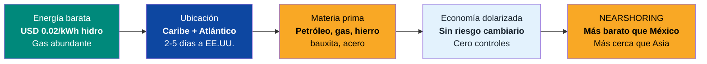
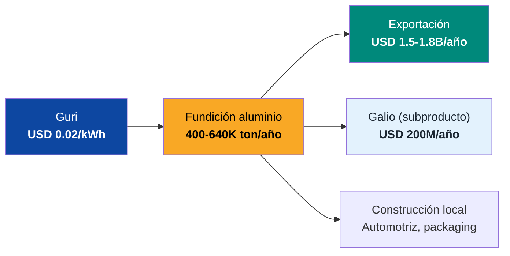
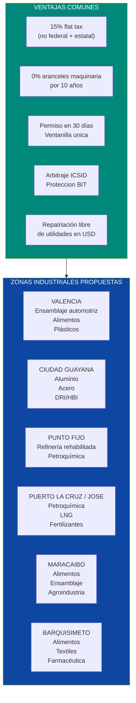
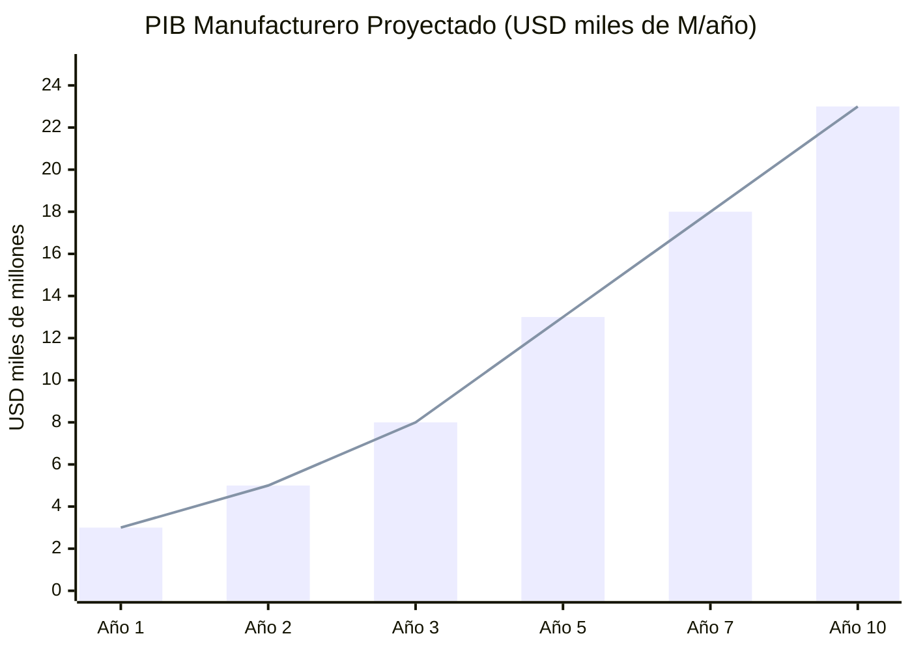

# Manufactura y Zonas Industriales: Revivir la Fábrica de LATAM

:::caution Fechas ilustrativas — las fases se activan por KPIs, no por calendario
Las referencias a "Año X" en este documento son **ilustrativas**. Las fases reales se activan por condiciones verificables (PIB/cápita, formalización, pobreza). Ver [KPIs de Activación](/07-ejecucion/kpis-activacion).
:::

> Venezuela ensamblaba Toyota, Ford y GM. Procesaba alimentos para Nestlé y PepsiCo. Fundía aluminio con la electricidad más barata del hemisferio. Producía petroquímicos con gas regalado. Todo eso desapareció. Hoy importa hasta la harina. Pero las ventajas competitivas que hicieron posible esa industria siguen ahí: **energía barata, petróleo y gas abundante, ubicación geográfica privilegiada y una economía dolarizada**. Lo que falta es el marco institucional para que el capital regrese.

---

## 1. La Oportunidad: USD 5-15B/Año y 300K-500K Empleos

:::danger Destrucción industrial total
Venezuela perdió el **90%+ de su capacidad industrial** entre 2007 y 2025. Expropiaciones, controles de cambio, controles de precio, inseguridad jurídica y fuga de talento destruyeron un sector que representaba el **15-18% del PIB** en los años 90. Hoy es **<5% de un PIB que ya colapsó 80%**. La producción manufacturera per cápita es la más baja de Sudamérica.
:::

| Dato | Pre-crisis (2000s) | Actual (2025) | Meta (Año 10) | Fuente |
|------|-------------------|---------------|----------------|--------|
| PIB manufacturero | ~USD 25.000 M | **<USD 3.000 M** | USD 15-25.000 M | [Requiere investigación] |
| % del PIB | 15-18% | <5% | 10-12% | [Requiere investigación] |
| Empleos manufactureros | ~600.000 | **<100.000** | 300.000-500.000 | [Requiere investigación] |
| Vehículos ensamblados/año | ~170.000 (2007) | **~0** | 50.000-100.000 | [Requiere investigación] |
| Aluminio producido (ton/año) | ~640.000 (2000s) | **<30.000** | 400.000-640.000 | [USGS](https://www.usgs.gov/) |
| Acero producido (ton/año) | ~4.300.000 | **<500.000** | 3.000.000-5.000.000 | [Global Energy Monitor](https://www.gem.wiki/CVG_Ferrominera_Orinoco_DRI_plant) |

**Traducción:** Venezuela teníauna base manufacturera comparable a la de Colombia o Perú. Hoy produce menos que Honduras. La reconstrucción no parte de cero — parte de la rehabilitación de capacidad que ya existió, con las mismas ventajas competitivas que la hicieron viable.

### La ventaja competitiva que sigue ahí

| Ventaja | Venezuela | México | Vietnam | Marruecos |
|---------|-----------|--------|---------|-----------|
| Costo electricidad industrial | **USD 0.02-0.04/kWh** | USD 0.07-0.10 | USD 0.06-0.08 | USD 0.08-0.12 |
| Distancia a EE.UU. (barco) | **2-5 días** | 1-3 días | 25-30 días | 10-15 días |
| Gas natural | **Abundante y barato** | Importa de EE.UU. | Importa LNG | Importa |
| Hierro/acero local | **Si (CVG)** | Importa | Importa | Importa |
| Aluminio local | **Si (Guri power)** | No | No | No |
| Moneda | **USD (dolarizado)** | MXN (volátil) | VND (controlado) | MAD |
| Salario mínimo mensual | ~USD 5-10 (actual) | ~USD 450 | ~USD 250 | ~USD 300 |
| Marco legal para inversores | **En reconstrucción** | Sólido | Sólido | Sólido |

Fuentes: costos de electricidad — [IEA](https://www.iea.org/), [Global Energy Monitor](https://globalenergymonitor.org/); distancias marítimas — [SeaRates](https://www.searates.com/).

:::tip Nearshoring: la ventana que se cierra
El nearshoring está redirigiendo USD 35-50B/año de inversión manufacturera de China hacia las Américas. México captura el 60%+ de ese flujo. Pero México ya tiene problemas: salarios subiendo, energía cara, infraestructura saturada, incertidumbre regulatoria. Venezuela ofrece **electricidad 3-5x más barata, gas abundante, materia prima local y una economía dolarizada**. Si establece el marco institucional correcto, puede capturar el **10-20% del nearshoring regional** — [Requiere investigación: cifras exactas de nearshoring LATAM].
:::

---

## 2. Sectores de Manufactura con Mayor Potencial

### 2.1 Aluminio: la joya de la corona

Venezuela fue el **8vo productor mundial de aluminio** y el mayor de LATAM. La razón: Guri produce electricidad a USD 0.02/kWh y la fundición de aluminio es **el proceso más electrointensivo** de la industria.

| Dato | Pre-crisis | Actual | Meta Año 10 | Fuente |
|------|-----------|--------|-------------|--------|
| Producción aluminio | **640.000 ton/año** | <30.000 ton/año | 400.000-640.000 ton/año | [USGS](https://www.usgs.gov/) |
| Plantas | CVG Alcasa + CVG Venalum | Ambas al 5-10% | Rehabilitadas con JV | [Requiere investigación] |
| Precio aluminio (2025) | — | **USD 2.400-2.800/ton** | — | [LME](https://www.lme.com/) |
| Ingreso potencial (640K ton) | — | — | **USD 1.500-1.800M/año** | Cálculo propio |
| Costo eléctrico vs. competencia | **USD 0.02/kWh** | — | — | Guri (no compite nadie en hemisferio) |
| Empleo directo | ~12.000 | ~1.500 | 10.000-15.000 | [Requiere investigación] |

**El pitch:** "Somos el único lugar en las Américas donde fundir aluminio es económicamente competitivo con China. La diferencia es que nuestra electricidad es hidroeléctrica (cero emisiones Scope 2), no carbón. Para un comprador europeo bajo CBAM, el aluminio venezolano vale **USD 200-400/ton mas** que el chino."

### 2.2 Ensamblaje automotriz

Venezuela ensambló vehículos para Toyota, GM, Ford, Chrysler, Mitsubishi y Hyundai hasta 2014-2016. Las plantas están cerradas pero la infraestructura básica existe.

| Dato | Pre-crisis | Actual | Meta Año 10 | Fuente |
|------|-----------|--------|-------------|--------|
| Vehículos ensamblados/año | **170.000** (2007) | **~0** | 50.000-100.000 | [Requiere investigación] |
| Marcas presentes | Toyota, GM, Ford, Chrysler, Mitsubishi, Hyundai | Ninguna activa | 3-5 marcas | [Requiere investigación] |
| Plantas existentes | Valencia, Barcelona, Mariara | Cerradas/abandonadas | Rehabilitadas | [Requiere investigación] |
| Empleo directo histórico | ~40.000 | ~0 | 15.000-30.000 | [Requiere investigación] |

**Oportunidad:** Ensamblar para mercado interno (demanda reprimida de millones de vehículos) + exportación a Caribe, Centroamérica y Andes. Toyota y GM ya tenían presencia — el costo de reentrada es menor que greenfield.

### 2.3 Procesamiento de alimentos

| Subsector | Potencial | Empresas históricas | Mercado |
|-----------|-----------|---------------------|---------|
| **Lácteos** | Producción lechera histórica en Barinas, Zulia, Portuguesa | Parmalat, Nestle | Interno + exportación |
| **Cereales y harinas** | Harina de maíz (P.A.N.) fue icono nacional | Polar (local), Cargill | Interno + díaspora |
| **Chocolate/cacao** | Cacao venezolano es premium mundial (Chuao, Porcelana) | Local + artisanal | Exportación premium |
| **Cafe** | Históricamente exportador. Hoy importa cafe | Local | Interno + exportación |
| **Cerveza/bebidas** | Polar era la mayor cervecera. Pepsi/Coca-Cola operaban | Polar, PepsiCo, Coca-Cola | Interno |
| **Carnes/aves** | Ganaderia histórica en Llanos. Producción avicola | Local, Cargill | Interno |
| **Pesca/acuicultura** | 2.800 km de costa + acuicultura potencial | [Requiere investigación] | Interno + exportación |

**Inversión estimada:** USD 3-5B para rehabilitar la cadena alimentaria industrial. **Ingreso potencial:** USD 5-10B/año.

### 2.4 Petroquímica

| Dato | Pre-crisis | Actual | Meta | Fuente |
|------|-----------|--------|------|--------|
| Producción petroquímica | ~8 M ton/año | <2 M ton/año | 5-8 M ton/año | [Requiere investigación] |
| Complejo Morón | Operativo | Al 20-30% | Rehabilitado via JV | Pequiven |
| Complejo El Tablazo | Operativo | Paralizado | Rehabilitado via JV | Pequiven |
| Complejo Jose | Operativo | Parcial | Expandido | Pequiven |
| Productos | Fertilizantes, plásticos, metanol, olefinas | Mínimo | Exportación diversificada | — |

**Ventaja:** Gas natural abundante y barato como feedstock. Proximidad a mercados de EE.UU. y Caribe. Infraestructura portuaria existente (deteriorada pero rehabilitable).

### 2.5 Acero y DRI/HBI

| Dato | Valor | Fuente |
|------|-------|--------|
| Capacidad instalada Sidor | **4,3 M ton/año** acero | [Global Energy Monitor](https://www.gem.wiki/CVG_Ferrominera_Orinoco_DRI_plant) |
| Producción actual | <500K ton/año | [Requiere investigación] |
| Reservas de hierro | **18.000 M ton** (Cerro Bolívar) | USGS |
| Ventaja | Gas barato para DRI + electricidad barata para EAF = **acero verde** | — |
| Producción meta Ano 10 | 3-5 M ton/año | Proyección propia |
| Ingreso potencial | USD 2.500-5.000 M/año | A USD 800-1.000/ton |
| JV activa | Jindal Steel (India) negociando operaciones | [MINING.COM](https://www.mining.com/web/indías-jindal-takes-on-operations-at-venezuelas-largest-iron-ore-mill/) |

### 2.6 Farmacéutica

| Oportunidad | Detalle |
|-------------|---------|
| **Demanda interna** | Venezuela importa >90% de medicamentos. El mercado interno es de USD 1-3B/año |
| **Manufactura de genéricos** | Plantas para antibióticos, analgésicos, antiretrovirales, vacunas básicas |
| **Modelo** | India: Cipla, Dr. Reddy's — genéricos para mercados emergentes |
| **Ventaja** | Mano de obra barata, mercado cautivo, potencial exportación Caribe/Centroamérica |
| **Inversión** | USD 500M-1B para 3-5 plantas |
| **Ingreso potencial** | USD 1-3B/año |

---

## 3. Zonas Industriales: Donde Ubicar la Manufactura

### Marco: ZEETs (Zonas Económicas Especiales de Tecnología)

Las ZEETs definidas en [Hubs Tech](/05-transformacion/hubs-tech) sirven como ancla para la manufactura. La manufactura se instala **dentro o adyacente** a las zonas económicas especiales, aprovechando el mismo marco fiscal y jurídico.

### Perfil de cada zona

| Zona | Ubicación | Sector ancla | Ventaja específica | Inversión est. | Empleos |
|------|-----------|-------------|-------------------|----------------|---------|
| **Valencia** | Carabobo | Automotriz, alimentos, plásticos | Plantas existentes (Toyota, GM, Ford). Corredor industrial más desarrollado | USD 2-5B | 50.000-100.000 |
| **Ciudad Guayana** | Bolívar | Aluminio, acero, DRI/HBI | Guri power USD 0.02/kWh. Hierro local. Rio Orinoco para transporte | USD 3-6B | 40.000-80.000 |
| **Punto Fijo** | Falcón | Refinería, petroquímica | Refinería Amuay (la mas grande de LATAM). Puerto natural | USD 2-4B | 20.000-40.000 |
| **Puerto La Cruz / Jose** | Anzoátegui | Petroquímica, LNG, fertilizantes | Complejo Jose. Gas natural abundante. Puerto | USD 2-4B | 20.000-40.000 |
| **Maracaibo** | Zulia | Alimentos, ensamblaje | Frontera con Colombia. Zona ganadera y agrícola | USD 1-3B | 30.000-50.000 |
| **Barquisimeto** | Lara | Alimentos, textiles, farmacéutica | Centro logístico del país. Clima ideal para agroindustria | USD 1-2B | 20.000-40.000 |

---

## 4. Qué Provee Cada Actor

| El Estado financia y supervisa (regula) | Venezuela S.A. provee (invierte) | El capital privado provee (opera) |
|--------------------------|----------------------------------|----------------------------------|
| Designación de zona industrial especial | Terrenos para parques industriales como equity en JVs | Inversión en plantas y maquinaria |
| Incentivos fiscales (15% flat, 0% arancel maquinaria 10 años) | Infraestructura base (carreteras, electricidad, agua) | Capital de trabajo y operación |
| Fast-track de permisos (30 días) | Permisos + acceso al mercado de 40M consumidores | Know-how y tecnología |
| Seguridad jurídica (BIT, ICSID, anti-expropiación) | Cobra regalías y dividendos como accionista | Construcción de naves industriales |
| Seguridad física (policía reformada) | Distribuye retornos a 40M ciudadanos-accionistas | Empleo y capacitación |

---

## 5. Aliados Potenciales

| Empresa | País| Sector | Historial Venezuela | Rol potencial |
|---------|------|--------|---------------------|---------------|
| **Toyota** | Japón | Automotriz | Operó planta de ensamblaje en Cumana hasta 2014 | Reabrir ensamblaje. Demanda reprimida masiva |
| **GM (General Motors)** | EE.UU. | Automotriz | Planta expropiada en Valencia (2017). Demandó | Reentrada con compensación + garantias |
| **Ford** | EE.UU. | Automotriz | Operó en Valencia | Ensamblaje para mercado interno + exportación |
| **Nestle** | Suiza | Alimentos | Presente históricamente | Procesamiento de alimentos, lácteos, cereales |
| **PepsiCo** | EE.UU. | Alimentos/bebidas | Operó via Empresas Polar (embotellado) | Bebidas, snacks, procesamiento |
| **Cargill** | EE.UU. | Agroindustria | Presente en aceites, harinas | Procesamiento de granos, oleaginosas |
| **Alcoa** | EE.UU. | Aluminio | Competidor potencial para rehabilitacion CVG | JV para fundición de aluminio con Guri power |
| **Rio Tinto** | Australia/UK | Aluminio/bauxita | — | JV para cadena bauxita-alumina-aluminio |
| **Jindal Steel** | India | Acero | En conversaciones para CVG Ferrominera | JV para operacion de Ferrominera y Sidor |
| **SABIC / LyondellBasell** | Arabia Saudita / EE.UU. | Petroquímica | — | JV para rehabilitacion de Pequiven |
| **Bayer / Cipla** | Alemania / India | Farmacéutica | — | Plantas de genéricos para LATAM |
| **Empresas Polar** | Venezuela | Alimentos | La mayor empresa privada venezolana. Opera parcialmente | Ancla de la reconstrucción alimentaria |
| **IFC / BID / CAF** | Multilateral | Financiamiento | — | Crédito para infraestructura industrial |

:::info Toyota y GM ya conocen el mercado
Toyota opero en Venezuela por **más de 30 años**. GM estuvo mas de **60 años**. Ambas se fueron por expropiaciones e inseguridad jurídica — no por falta de mercado. Con garantias jurídicas blindadas, la reentrada es cuestion de **condiciones, no de voluntad**. Venezuela tiene demanda reprimida de millones de vehículos y las plantas existentes (abandonadas) reducen el costo de reentrada vs. greenfield.
:::

---

## 6. Modelo de Negocio

### Estructura: Joint Ventures + concesiones industriales

| Parámetro | Modelo |
|-----------|--------|
| **Estructura JV** | Venezuela 20-49% (via Fondo de Inversión Venezuela S.A. o entidad pública) + operador internacional 51-80% |
| **Impuesto corporativo** | 15% flat |
| **Arancel de importación maquinaria** | 0% por 10 años |
| **Repatriación de utilidades** | 100% libre en USD |
| **Concesión** | 25-50 años renovable |
| **Requisito de empleo local** | Mínimo 70% fuerza laboral venezolana |
| **Procesamiento local** | Incentivo fiscal adicional por valor agregado en Venezuela |
| **Arbitraje** | ICSID obligatorio. BIT con país de origen del inversor |

### Proyección de ingresos por sector

| Sector | Inversión total est. | Ingreso año 10 (USD M/año) | Empleos directos |
|--------|---------------------|---------------------------|------------------|
| **Aluminio** | USD 2.000-4.000 M | 1.500-1.800 | 10.000-15.000 |
| **Acero / DRI / HBI** | USD 2.000-3.000 M | 2.500-5.000 | 15.000-25.000 |
| **Automotriz** | USD 1.500-3.000 M | 2.000-5.000 | 15.000-30.000 |
| **Alimentos** | USD 3.000-5.000 M | 5.000-10.000 | 80.000-120.000 |
| **Petroquímica** | USD 2.000-4.000 M | 3.000-5.000 | 10.000-20.000 |
| **Farmacéutica** | USD 500-1.000 M | 1.000-3.000 | 5.000-10.000 |
| **Otros (textiles, plásticos, cerámica)** | USD 1.000-2.000 M | 1.000-3.000 | 30.000-50.000 |
| **TOTAL** | **USD 12.000-22.000 M** | **USD 16.000-32.800 M** | **165.000-270.000** |

:::caution Nota sobre empleos
Los 165K-270K empleos directos generan **2-3x en empleos indirectos** (proveedores, servicios, transporte, comercio). Total incluyendo indirectos: **500K-800K empleos**. El sector manufacturero es el segundo mayor generador de empleo despues de la construcción.
:::

---

## 7. Nearshoring: Por Que Venezuela Puede Competir con México

### El contexto global

La guerra comercial EE.UU.-China está redirigiendo cadenas de suministro hacia las Américas. México captura la mayor parte, pero tiene limitaciones crecientes:

| Factor | México | Venezuela (potencial) |
|--------|--------|----------------------|
| Salario promedio manufactura | **~USD 450/mes** (y subiendo rápido) | ~USD 100-200/mes (crecera con recuperación) |
| Electricidad industrial | USD 0.07-0.10/kWh | **USD 0.02-0.04/kWh** |
| Gas natural | Importa de EE.UU. via pipeline | **Produce 5.500 BCM reserves propias** |
| Disponibilidad de terrenos industriales | Saturados en norte (Monterrey, Juarez) | **Amplios, baratos** |
| T-MEC / acuerdos comerciales | **Si (T-MEC con EE.UU./Canada)** | No (requiere negociación) |
| Inseguridad | Carteles en zonas industriales | Peor ahora, pero mejorable con reforma |
| Riesgo regulatorio | Creciente (reforma judicial, energética) | **En reconstrucción (greenfield regulatorio)** |

**La oportunidad:** Venezuela no reemplaza a México — lo complementa. Para sectores que requieren **energía intensiva** (aluminio, acero, petroquímica, data centers), Venezuela es imbatible. Para sectores que requieren **proximidad y T-MEC** (automotriz de exportación a EE.UU.), México sigue siendo mejor. La clave es posicionar a Venezuela como el hub de **manufactura electrointensiva** de las Américas.

:::info Acuerdo comercial con EE.UU.: el acelerador
Un **acuerdo de preferencias comerciales** (tipo ATPA/ATPDEA que tuvo con los Andes) o inclusión en un esquema de nearshoring eliminaría aranceles para manufactura venezolana exportada a EE.UU. Dado que EE.UU. ya controla las ventas de petróleo venezolano y tiene interés estratégico en minerales críticos, un acuerdo comercial es negociable — [Requiere investigación: status de negociaciónes comerciales].
:::

---

## 8. Infraestructura Requerida

| Componente | Qué se necesita | Costo est. | Quién lo provee | Sinergia |
|-----------|----------------|------------|-----------------|----------|
| **Electricidad confiable** | Rehabilitacion Guri + transmision a zonas industriales | Incluido en [Capacidad Electrica](./capacidad-electrica) | Siemens, ABB, GE | Data centers, mineria |
| **Puertos** | Rehabilitacion de Puerto Cabello, La Guaira, Puerto La Cruz, Maracaibo | USD 2-4B | APM Terminals, DP World, Hutchison | Comercio exterior |
| **Carreteras** | Rehabilitacion de autopistas + nuevas vias a zonas industriales | USD 3-5B | VINCI, ACS, constructoras | Turismo, comercio |
| **Gas natural** | Pipeline de gas a zonas industriales + plantas de gas | USD 1-2B | Chevron, Shell, Repsol | Petroquímica, electricidad |
| **Agua industrial** | Plantas de tratamiento para procesos industriales | USD 500M-1B | Veolia, Suez | Municipios |
| **Telecoms / fibra** | Conectividad de alta velocidad a zonas industriales | USD 500M-1B | Ericsson, Nokia | Data centers, estado digital |
| **Ferrocarril** | Rehabilitacion del tren Ciudad Guayana-Puerto Ordaz + nuevas lineas | USD 2-4B | CRRC (China), Alstom | Mineria, transporte |
| **TOTAL** | | **USD 10-17B** | | |

---

## 9. Comparables Internacionales

| País| Modelo | Que funciono | Resultado | Lección para Venezuela |
|------|--------|-------------|-----------|------------------------|
| **México (maquiladoras)** | Zonas libres de aranceles en frontera norte. Exención fiscal temporal. Mano de obra barata | Acceso preferencial a EE.UU. (T-MEC). Proximidad. Escala | **USD 500B+ en exportaciónes manufactureras/año**. 2,7 M empleos en maquilas | El marco fiscal y acceso a mercados importa más que el costo de mano de obra. Venezuela necesita acuerdo comercial con EE.UU. |
| **Vietnam** | De economía agraria a hub manufacturero en 20 años. Samsung, Intel, Nike, Foxconn | Zonas economicas especiales. Salarios bajos. Estabilidad politica. Acuerdos comerciales (CPTPP, EVFTA) | **PIB x10 en 20 años**. USD 400B en exportaciónes. 18M empleos industriales | Transformación rápida es posible con marco correcto. Vietnam no teníaventajas naturales — solo politica industrial consistente |
| **Marruecos (automotive hub)** | Zonas francas (Tanger Med). Renault y PSA ensamblando para Europa. 0% aranceles a UE | Proximidad a Europa. Puerto world-class. Mano de obra calificada a bajo costo | **700.000 vehículos/año**. USD 14B exportaciónes automotrices | Puerto rehabilitado + zona franca + OEM ancla = cluster automotriz. Valencia puede replicar para mercado Américas |
| **Ruanda (manufactura ligera)** | De genocidio a economía de clase media en 25 años. "Made in Rwanda" | Infraestructura digital, formación de talento, incentivos a manufactura local | Crecimiento PIB 7-8%/año sostenido | Un país puede reconstruir manufactura desde cero con voluntad politica y marco correcto |

Fuentes: [WTO Trade Statistics](https://www.wto.org/english/res_e/statis_e/statis_e.htm); [Vietnam Manufacturing Boom — McKinsey](https://www.mckinsey.com/featured-insights/asia-pacific/vietnams-manufacturing-miracle); [Morocco Automotive — AMDI](https://www.morocconow.com/).

---

## 10. Riesgos y Mitigaciones

| Riesgo | Probabilidad | Impacto | Mitigacion |
|--------|-------------|---------|-----------|
| **Empresas no entran por memoria de expropiaciones** | Alta | Critico | Ley anti-expropiación constitucional. ICSID. BIT. Compensacion de expropiaciones pasadas (GM, Holcim, Lafarge, Sidor). Estructura JV con mayoria privada |
| **Sin acuerdo comercial con EE.UU.** | Media | Alto | Manufactura para mercado interno primero (30M consumidores). Negociar preferencias tipo ATPA. Acuerdos con Caribe, Andes, UE |
| **Mano de obra no calificada** | Alta | Alto | Programas de formación acelerada (6-18 meses). Repatriación de tecnicos emigrados. Permisos para tecnicos extranjeros |
| **Infraestructura insuficiente** (puertos, carreteras, electricidad) | Alta | Alto | Inversiones en infraestructura en paralelo. Priorizar zonas con mejor infraestructura existente (Valencia, Puerto La Cruz) |
| **Competencia de México y Vietnam** | Alta | Medio | No competir en todo — focalizarse en **manufactura electrointensiva** donde Venezuela tiene ventaja inigualable |
| **Dutch Disease** | Media | Alto | Modelo fiscal que separa petróleo del presupuesto. Tipo de cambio no controlado. Ver [Enfermedad Holandesa](/02-motor-financiero/enfermedad-holandesa) |
| **Corrupcion en concesiones** | Alta | Alto | Licitaciones internacionales transparentes. Auditoria Big 4. Veeduria multilateral |
| **Sindicalismo destructivo** | Media | Medio | Ley laboral moderna (no la LOT de 2012). Flexibilidad de contratación. Formacion continua |

---

## 11. Proyección Financiera (10 Años)

| Indicador | Año1 | Año3 | Año5 | Año10 |
|-----------|-------|-------|-------|--------|
| **PIB manufacturero (USD B)** | 3 | 8 | 13 | 20-25 |
| **% del PIB total** | 3% | 6% | 8% | 10-12% |
| **Empleos directos** | 120.000 | 200.000 | 300.000 | 400.000-500.000 |
| **Empleos totales (dir. + ind.)** | 250.000 | 450.000 | 700.000 | 1.000.000-1.500.000 |
| **Exportaciónes manufactureras (USD B)** | 0.5 | 2 | 5 | 10-15 |
| **Vehículos ensamblados** | 5.000 | 20.000 | 50.000 | 100.000 |
| **Aluminio (K ton/año)** | 50 | 200 | 400 | 640 |
| **Acero (M ton/año)** | 1 | 2 | 3 | 5 |
| **Inversión acumulada (USD B)** | 2 | 8 | 15 | 25-30 |

### Contribución al plan Venezuela S.A.

| Métrica | Valor |
|---------|-------|
| **Ingreso anual manufactura (año10)** | USD 15-25B |
| **% del PIB meta** | 10-12% |
| **Empleos directos** | 400K-500K |
| **Exportaciónes** | USD 10-15B/año |
| **Contribución fiscal** | USD 2-4B/año (15% flat + IVA) |
| **Sectores ancla** | Aluminio, acero, automotriz, alimentos, petroquímica |
| **Ventaja diferencial** | Energía más barata del hemisferio + materia prima local |

:::tip Manufactura + construcción = full employment
Construcción genera **750K-1.2M empleos**. Manufactura genera **400K-500K directos + 600K-1M indirectos**. Juntos, estos dos sectores absorben **2-3 millones de trabajadores** — suficiente para reducir el desempleo real de 40-50% a **<10%** en 10 años. No hay programa social que compita con eso.
:::

---

## Documentos Relacionados

- [Capacidad Electrica](./capacidad-electrica) — Electricidad confiable y barata como ventaja competitiva para manufactura
- [Minerales Criticos](./minerales-criticos) — Hierro, aluminio y materias primas para manufactura pesada
- [Vialidad y Logistica](./vialidad-logistica) — Puertos y carreteras para exportación de productos manufacturados
- [Transporte Maritimo](./transporte-maritimo) — Puertos de carga para comercio exterior de manufactura
- [Construcción e Inmobiliaria](./construccion-inmobiliaria) — Materiales de construcción como vertical clave de manufactura
- [Agro y Ganaderia](./agro-ganaderia) — Agroindustria y procesamiento de alimentos como vertical de manufactura
- [Modelo de Concesiones](./modelo-concesiones) — Marco de concesiones para zonas industriales (ISO 9001/14001/45001)

---

## Fuentes

| # | Fuente | Dato utilizado |
|---|--------|---------------|
| 1 | [USGS — Aluminum Statistics](https://www.usgs.gov/) | Producción histórica de aluminio Venezuela |
| 2 | [Global Energy Monitor — CVG Ferrominera](https://www.gem.wiki/CVG_Ferrominera_Orinoco_DRI_plant) | Capacidad acero/hierro |
| 3 | [MINING.COM — Jindal in Venezuela](https://www.mining.com/web/indías-jindal-takes-on-operations-at-venezuelas-largest-iron-ore-mill/) | JV Jindal-Ferrominera |
| 4 | [IEA — Energy Prices](https://www.iea.org/) | Costos de electricidad comparados |
| 5 | [LME — Aluminium](https://www.lme.com/) | Precios de aluminio |
| 6 | [McKinsey — Vietnam Manufacturing](https://www.mckinsey.com/featured-insights/asia-pacific/vietnams-manufacturing-miracle) | Modelo Vietnam |
| 7 | [WTO — Trade Statistics](https://www.wto.org/english/res_e/statis_e/statis_e.htm) | Exportaciónes México y Vietnam |
| 8 | [Morocco Automotive — AMDI](https://www.morocconow.com/) | Hub automotriz Marruecos |
| 9 | Producción manufacturera Venezuela actual | [Requiere investigación: datos actualizados] |
| 10 | Status plantas automotrices | [Requiere investigación] |
| 11 | Producción petroquímica actual | [Requiere investigación] |
| 12 | Nearshoring flows LATAM | [Requiere investigación: cifras exactas] |
