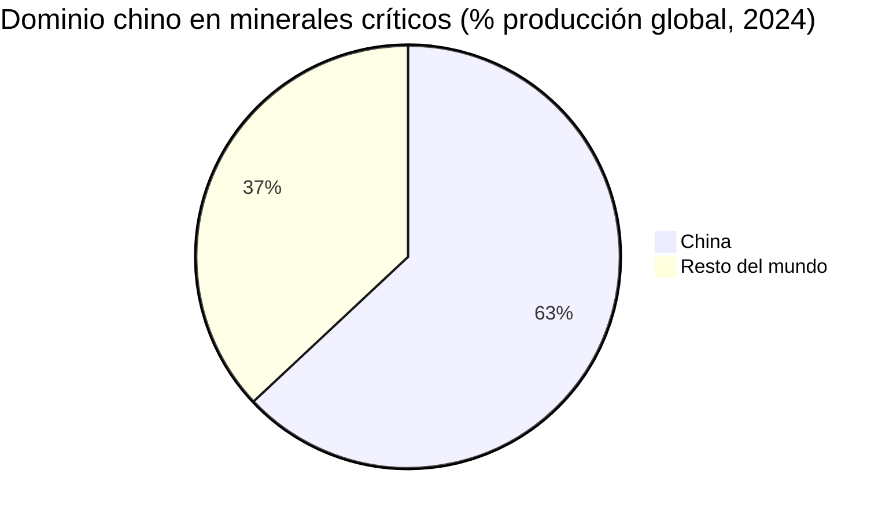
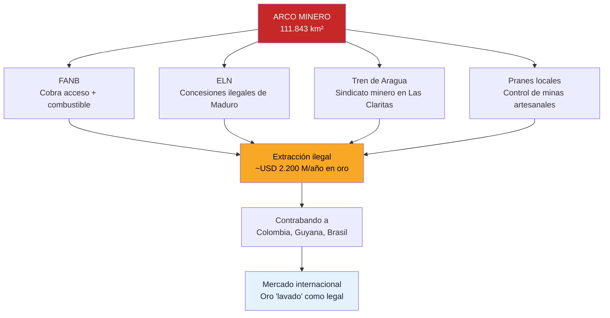
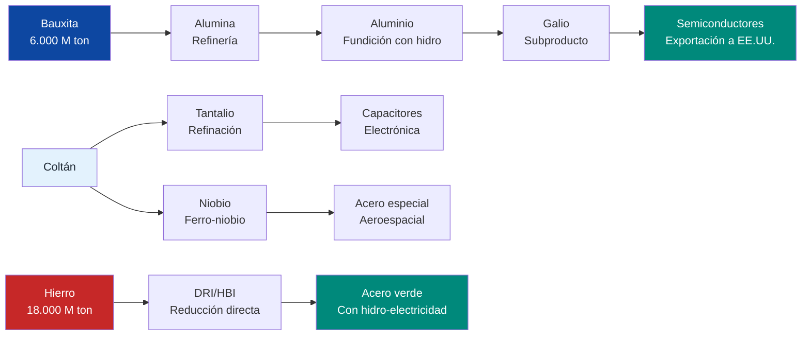
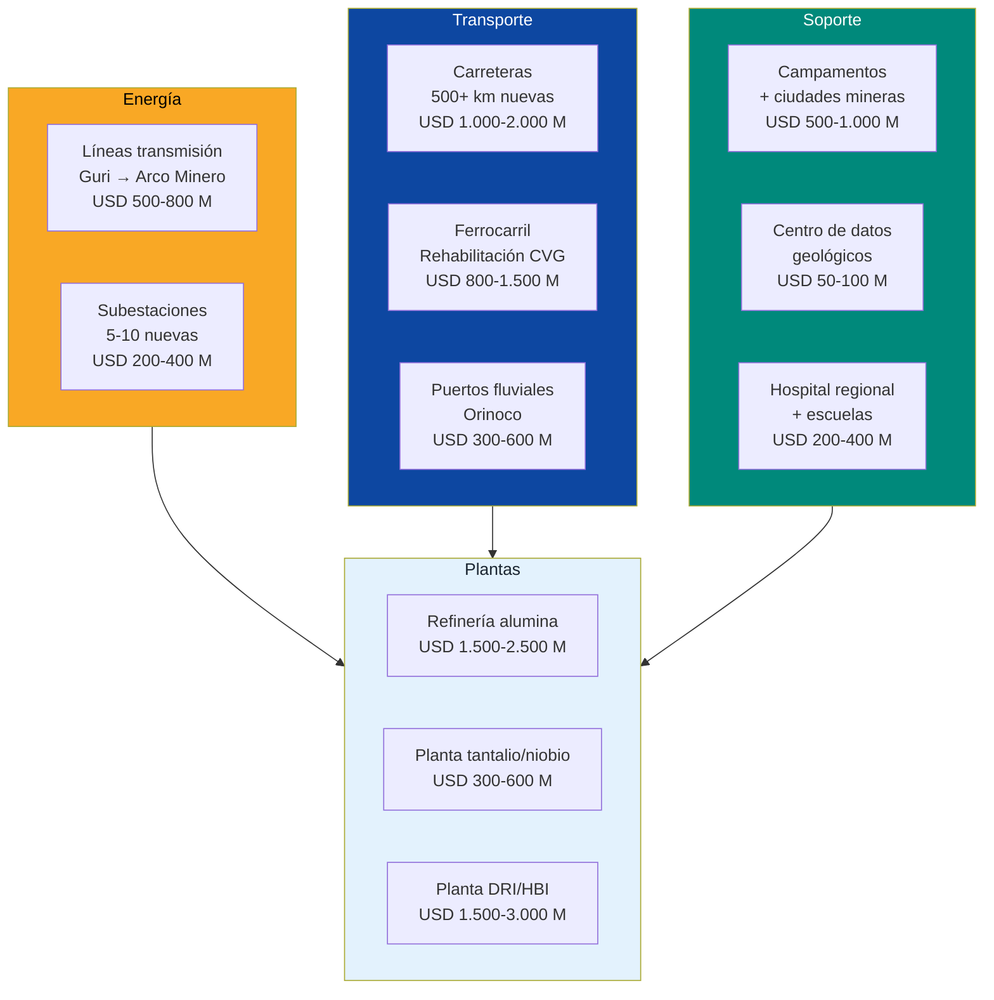
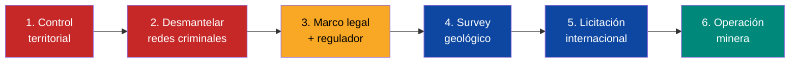
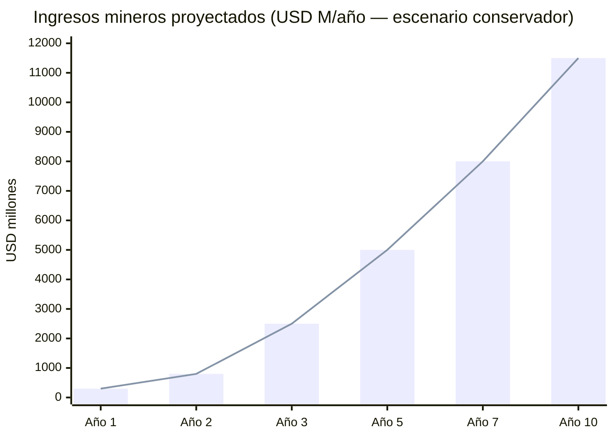
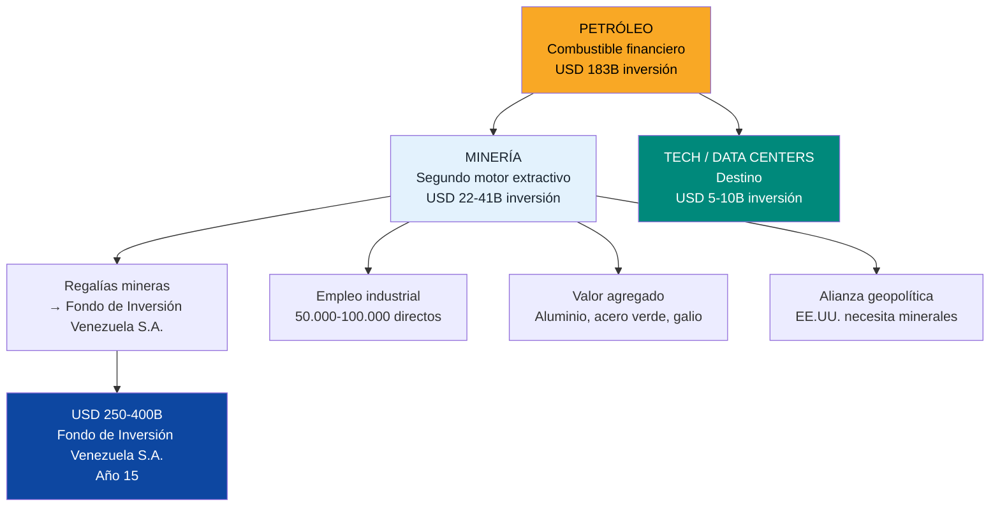

# Minerales Criticos: La Otra Mina de Oro

> Venezuela tiene debajo de sus pies lo que el mundo necesita para la transición energética. El problema no es geología — es gobernanza.

:::danger Realidad al 2026
- El [Arco Minero del Orinoco](https://en.wikipedia.org/wiki/Orinoco_Mining_Arc) es **12% del territorio nacional** — del tamaño de Portugal
- Grupos armados (ELN, Tren de Aragua) y la FANB controlan las zonas mineras — [International Crisis Group, 2024](https://www.crisisgroup.org/brf/latin-america-caribbean/andes/venezuela/b53-curse-gold-mining-and-violence-venezuelas-south)
- **Cero minería industrial** de coltán, tierras raras o bauxita procesada
- Devastación ambiental masiva por minería ilegal — mercurio en ríos, deforestación
- Las reservas **NO están verificadas independientemente** (JORC/NI 43-101)
- EE.UU. ya tiene delegaciones en Venezuela discutiendo minerales críticos — [US News, mar. 2026](https://www.usnews.com/news/us/articles/2026-03-04/us-interior-secretary-is-in-venezuela-to-discuss-critical-minerals)
:::

---

## 1. La Oportunidad: USD 328B en Mercado Global

El mercado global de minerales críticos alcanzó **USD 328.000 M en 2024** y proyecta **USD 587.000 M para 2032** (CAGR 7,5%) — [DataM Intelligence](https://www.datamintelligence.com/research-report/critical-minerals-market). La demanda para tecnologías limpias se **cuadruplicará para 2040**, alcanzando ~40 millones de toneladas anuales — [IEA Global Critical Minerals Outlook 2025](https://www.iea.org/reports/global-critical-minerals-outlook-2025).

Venezuela tiene depósitos confirmados o probables de **al menos 6 minerales** que aparecen en la lista de minerales críticos del USGS 2025.

### Inventario mineral de Venezuela

| Mineral | Reserva estimada | Producción actual | Producción histórica máx. | Estado | Fuente |
|---------|-----------------|-------------------|--------------------------|--------|--------|
| **Oro** | ~7.000 ton (gobierno) | ~480 kg formal (2021) + ~75 ton ilegal/año | N/A | Controlado por grupos armados | [State Dept., jun. 2025](https://www.state.gov/wp-content/uploads/2025/11/2025-Report-to-Congress-on-the-State-Sponsored-Extraction-and-Sale-of-Gold-from-Venezuelas-Orin.pdf) |
| **Hierro** | 18.000 M ton (Cerro Bolívar) | ~4,3 M ton/año (2025) | 20+ M ton/año | CVG Ferrominera al 10-20% de capacidad | [Global Energy Monitor](https://www.gem.wiki/CVG_Ferrominera_Orinoco_DRI_plant) |
| **Bauxita** | 570 M ton probadas (Los Pijiguaos) + **6.000 M ton probables** en la región | Suspendida/mínima | 5+ M ton/año | CVG Bauxilum paralizada | [CSIS, ene. 2026](https://www.csis.org/analysis/venezuela-critical-minerals-target) |
| **Coltán** (tantalio/niobio) | ~USD 100.000 M estimados (no verificado) | Cero industrial | N/A | Sin exploración moderna | [Mongabay, 2016](https://news.mongabay.com/2016/10/thirst-for-coltan-gold-threatens-venezuelan-forests-indigenous-lands/) |
| **Diamantes** | 3.000 M quilates (gobierno) | Artisanal mínima | N/A | Contrabando a Guyana/Brasil | Gobierno Venezuela |
| **Galio** (subproducto de bauxita) | Depende de producción aluminio | Cero | N/A | Potencial si se reactiva aluminio | [CSIS](https://www.csis.org/analysis/beyond-rare-earths-chinas-growing-threat-gallium-supply-chains) |
| **Tierras raras** | ~300.000 ton (gobierno, **NO verificado por USGS**) | Cero | N/A | Hipotético — requiere exploración | [Rare Earth Exchanges](https://rareearthexchanges.com/news/a-jungle-of-minerals-politics-and-unanswered-questions/) |

:::caution Verificación de reservas
Las cifras de reservas del gobierno venezolano (especialmente oro, coltán, tierras raras y diamantes) **NO cumplen estándares JORC/NI 43-101**. No son "bankable reserves" — son estimaciones políticas. El primer paso de cualquier operación seria es un **survey geológico independiente moderno**. La última evaluación USGS de Venezuela es de los años 90.
:::

### Contexto geopolítico: la guerra por minerales

| Mineral | Dominio chino | Aplicación clave | Alternativa Venezuela |
|---------|--------------|------------------|----------------------|
| **Tierras raras** | 70% producción, 90% procesamiento | Motores EV, turbinas eólicas, defensa | Potencial no verificado |
| **Galio** | **98% producción** | Semiconductores (GaN, GaAs), 5G, radar | Subproducto de bauxita venezolana |
| **Tantalio** (coltán) | 40% procesamiento | Capacitores, smartphones, misiles | Depósitos confirmados (no cuantificados) |
| **Niobio** | 10% (Brasil domina con 90%) | Acero de alta resistencia, superconductores | Depósitos asociados al coltán |
| **Aluminio** | 57% producción | Transporte, construcción, packaging | Capacidad instalada 640K ton/año |

**Traducción geopolítica:** China controla el **98% del galio** mundial. En diciembre 2024, [prohibió exportaciones de galio a EE.UU.](https://www.csis.org/analysis/beyond-rare-earths-chinas-growing-threat-gallium-supply-chains) El galio se extrae como subproducto del refinamiento de **bauxita → aluminio**. Venezuela tiene **6.000 M de toneladas de bauxita** y electricidad hidroeléctrica barata para fundición. La ecuación es obvia.

:::info Project Vault — EE.UU. ya se mueve
En febrero 2026, EE.UU. lanzó **Project Vault**: un [stockpile de minerales críticos de USD 12.000 M](https://www.latitudemedia.com/news/white-house-private-sector-closely-looking-at-venezuelan-critical-minerals/). En marzo 2026, el Secretario del Interior **Doug Burgum visitó Venezuela** con representantes de **más de 24 empresas mineras estadounidenses** — [US News](https://www.usnews.com/news/us/articles/2026-03-04/us-interior-secretary-is-in-venezuela-to-discuss-critical-minerals). La ventana está abierta. La pregunta es si Venezuela puede ofrecer las condiciones para capturarla.
:::

---

## 2. El Problema: Por Qué No Producimos Nada

Venezuela lleva **décadas alardeando** de riqueza mineral sin construir una sola operación minera de clase mundial. Las razones son estructurales:

### 2.1 Control criminal de las zonas mineras

| Actor | Rol en minería ilegal | Fuente |
|-------|----------------------|--------|
| **FANB** | Cobra a criminales por acceso; provee combustible y logística | [Mongabay, oct. 2025](https://news.mongabay.com/2025/10/amid-venezuelas-illegal-gold-heist-are-armed-groups-gangs-elites-report-says/) |
| **ELN** (guerrilla colombiana) | Controla concesiones dentro del Arco Minero | [International Crisis Group](https://www.crisisgroup.org/brf/latin-america-caribbean/andes/venezuela/b53-curse-gold-mining-and-violence-venezuelas-south) |
| **Tren de Aragua** | Opera como sindicato minero en Bolívar | [InSight Crime](https://insightcrime.org/venezuela-organized-crime-news/tren-de-aragua/) |
| **Estado (Maduro)** | Creó el Arco Minero en 2016 para generar ingresos fuera de sanciones | [Diálogo Américas](https://dialogo-americas.com/articles/the-mining-arc-the-silent-operation-that-sustains-the-maduro-regime/) |

### 2.2 Infraestructura colapsada

| Infraestructura | Estado | Necesidad |
|----------------|--------|-----------|
| **CVG Ferrominera** | Opera al 10-20% de capacidad (25 M ton instaladas) | Equipos, ferrocarril, suministro eléctrico |
| **CVG Bauxilum** | Operaciones suspendidas | Electricidad estable desde Guri |
| **CVG Alcasa/Venalum** | Fundiciones de aluminio al 10-15% | Electricidad + modernización |
| **Carreteras al Arco Minero** | Inexistentes o destruidas | Red vial desde Ciudad Guayana |
| **Líneas de transmisión** | Caídas desde Guri hasta el sur | Reconstrucción completa |
| **Puertos fluviales** | Degradados | Rehabilitación del Orinoco como vía de carga |

### 2.3 Cero datos geológicos modernos

- La última evaluación integral del USGS sobre Venezuela es de los **años 1990**
- No existen surveys aéreos electromagnéticos modernos (VTEM, ZTEM)
- No hay datos de perforación exploratoria para coltán o tierras raras
- Las "reservas" citadas por el gobierno son **estimaciones políticas, no geológicas**
- Sin datos JORC/NI 43-101, **ningún inversor institucional pondrá capital**

### 2.4 Devastación ambiental

- Contaminación por **mercurio** en ríos del Caroní y Orinoco
- Deforestación de **>12.000 km²** en el Arco Minero
- **Comunidades indígenas** (Pemón, Ye'kwana, Sanema) desplazadas
- Ejecuciones sumarias y trabajo forzado infantil — [Human Rights Watch](https://www.hrw.org/news/2022/04/29/venezuelan-tainted-gold)
- Venezuela es **inelegible para Fairmined o cadenas de suministro responsables** en su estado actual

---

## 3. La Solución: Minería Responsable con Estándares Internacionales

### Principio rector

> La minería es el SEGUNDO motor extractivo — no el primero. El petróleo financia la transición. La minería se hace BIEN o no se hace. Cero minería sin control territorial, marco legal y estándares ESG.

### Fase 1: Exploración y Seguridad (Año 1-2)

| Acción | Costo estimado | Responsable | Entregable |
|--------|---------------|-------------|------------|
| **Survey geológico nacional** con USGS + empresas privadas (aéreo + terrestre) | USD 200-500 M | JV USGS + consultoras (SRK, Hatch) | Mapa geológico JORC/NI 43-101 del Arco Minero |
| **Control territorial del Arco Minero** | Incluido en presupuesto de seguridad | Fuerza policial reformada + [DDR](/04-gobernanza/seguridad-fisica) | Desmantelamiento de operaciones ilegales |
| **Reforma del código minero** | USD 5-10 M (asesoría legal internacional) | Gobierno + IFC | Ley de minería compatible con EITI + estándares IRMA |
| **Evaluación ambiental baseline** | USD 50-100 M | Consultoras ambientales internacionales | Línea base de contaminación mercurio, deforestación, agua |
| **Consulta indígena (FPIC)** | USD 10-20 M | OIT + comunidades indígenas | Consentimiento libre, previo e informado |
| **Policía minera especializada** | USD 30-50 M (equipamiento + capacitación) | Modelo Georgia → [Seguridad Física](/04-gobernanza/seguridad-fisica) | Fuerza dedicada anti-minería ilegal |

**Inversión Fase 1: USD 300-700 M**

:::tip Modelo Botswana: seguridad + transparencia = confianza inversora
Botswana convirtió diamantes en desarrollo con un modelo simple: **50% gobierno / 50% De Beers** en Debswana, con el gobierno sentado en el board de De Beers. Resultado: PIB per cápita de USD 600 (1966) a USD 8.000+ (2024). El secreto no fue geología — fue **gobernanza** — [IMF, 2018](https://www.imf.org/en/News/Articles/2018/09/05/na090518Botswana).
:::

### Fase 2: Operaciones Piloto (Año 2-5)

| Operación | Modelo | Inversión | Producción meta | Ingreso estimado |
|-----------|--------|-----------|----------------|------------------|
| **Hierro: Reactivación CVG Ferrominera** | JV con Jindal Steel (ya en conversaciones) | USD 2.000-3.000 M | 15-20 M ton/año | USD 1.500-3.000 M/año |
| **Bauxita: Reactivación Los Pijiguaos + Bauxilum** | JV con Rio Tinto o Alcoa | USD 1.500-2.500 M | 5-8 M ton/año bauxita | USD 500-1.000 M/año |
| **Aluminio: Rehabilitación fundiciones (Alcasa/Venalum)** | JV con operador internacional | USD 2.000-4.000 M | 400-640K ton/año aluminio | USD 1.000-1.700 M/año |
| **Oro: Formalización minería artisanal** | Modelo Colombia CRAFT + Fairmined | USD 500-1.000 M | 30-50 ton/año (legal) | USD 4.500-7.500 M/año |
| **Coltán: Exploración + piloto industrial** | JV con empresa especializada | USD 300-800 M | Depende de survey | [Requiere investigación] |

**Inversión Fase 2: USD 6.300-11.300 M**

### Fase 3: Escala y Valor Agregado (Año 5-15)

| Producto de valor agregado | Inversión | Ventaja competitiva Venezuela | Mercado objetivo |
|---------------------------|-----------|------------------------------|-----------------|
| **Aluminio primario** (fundido con hidroeléctrica) | USD 2.000-4.000 M | Electricidad a **<USD 0,02/kWh** — la más barata del hemisferio | Global (USD 175.000 M/año) |
| **Galio** (extraído de alumina) | USD 100-300 M | Único productor hemisférico potencial; China produce 98% | EE.UU., Europa, Japón, Corea |
| **Ferro-niobio** | USD 500-1.000 M | Competir con CBMM (Brasil, 90% del mercado) | Acero de alta resistencia global |
| **Tantalio refinado** | USD 300-600 M | Alternativa a DRC (conflicto) y Ruanda | Electrónica, defensa, aeroespacial |
| **DRI/HBI** (hierro reducido directo) | USD 1.500-3.000 M | Gas natural + hierro + energía barata | Siderúrgicas globales (descarbonización) |
| **Acero verde** (hidro-powered) | USD 3.000-5.000 M | Cero emisiones de Scope 2 con Guri | Europa (CBAM), EE.UU. |

**Inversión Fase 3: USD 7.400-13.900 M**

---

## 4. Infraestructura Requerida

| Categoría | Inversión estimada | Prioridad | Sinergia con otros sectores |
|-----------|-------------------|-----------|---------------------------|
| **Energía** (transmisión desde Guri) | USD 700-1.200 M | Crítica | Data centers, aluminio, acero |
| **Transporte** (carreteras, ferrocarril, puertos) | USD 2.100-4.100 M | Crítica | Turismo (Canaima), comercio |
| **Plantas de procesamiento** | USD 3.300-6.100 M | Alta | Empleo industrial, exportaciones |
| **Infraestructura social** | USD 750-1.500 M | Alta | Comunidades locales, retención de talento |
| **Total infraestructura** | **USD 6.850-12.900 M** | — | — |

:::info Sinergia con data centers
La inversión en transmisión eléctrica desde Guri beneficia **simultáneamente** al corredor de data centers de Ciudad Guayana y a las operaciones mineras. Es la misma infraestructura para dos motores de diversificación. Ver [Hubs Tech](/05-transformacion/hubs-tech).
:::

---

## 5. Modelo de Negocio

### Estructura: Joint Ventures con socios internacionales

| Parámetro | Modelo propuesto | Referencia |
|-----------|-----------------|-----------|
| **Participación** | Venezuela 51% / Operador internacional 49% | Botswana-De Beers (Debswana) |
| **Operador** | Socio internacional opera con estándares IRMA | JV permite transferencia tecnológica |
| **Regalías** | 5-8% del ingreso bruto | Promedio LATAM mining royalties |
| **Impuesto corporativo** | 15% flat (modelo Estado lean) | Consistente con reforma fiscal |
| **Fondo de Inversión Venezuela S.A.** | 100% de regalías mineras → Fondo de Inversión Venezuela S.A. | Igual que petróleo |
| **Procesamiento local** | Obligatorio para minerales estratégicos | No exportar materia prima sin procesar |
| **Empleo local** | Mínimo 70% fuerza laboral venezolana | Capacitación incluida en JV |
| **Duración concesión** | 25-30 años renovables | Con auditoría cada 5 años |

### Comparación: exportar materia prima vs. valor agregado

| Mineral | Precio materia prima | Precio procesado | Multiplicador |
|---------|---------------------|-----------------|---------------|
| **Bauxita** | USD 90-130/ton | **Aluminio:** USD 2.400-2.800/ton | **~25x** |
| **Bauxita → Galio** | USD 90-130/ton | **Galio:** USD 725/kg | **~5.000x** |
| **Hierro** | USD 100-130/ton | **DRI/HBI:** USD 400-600/ton | **~4x** |
| **Hierro** | USD 100-130/ton | **Acero verde:** USD 800-1.200/ton | **~8x** |
| **Coltán (crudo)** | USD 30-60/kg | **Tantalio refinado:** USD 500/kg | **~10x** |

:::danger Regla inviolable: CERO exportación de materia prima sin procesar
Venezuela NO puede repetir el error petrolero: vender crudo a USD 60 cuando el barril refinado vale USD 120. Cada tonelada de bauxita que sale sin procesar es **25x de valor destruido**. El modelo de negocio exige procesamiento local — la electricidad barata de Guri es la ventaja que lo hace viable.
:::

---

## 6. Seguridad: Requisito Previo, No Posterior

### Secuencia obligatoria

**No hay minería responsable sin seguridad primero.** Esto no es negociable.

| Componente de seguridad | Modelo de referencia | Aplicación Venezuela |
|------------------------|---------------------|---------------------|
| **Policía minera dedicada** | [Georgia: 15.000 policías despedidos, crimen -66%](https://successfulsocieties.princeton.edu/sites/g/files/toruqf5601/files/Policy_Note_ID126.pdf) | Fuerza especializada anti-minería ilegal, reclutada y entrenada desde cero |
| **DDR para grupos armados** | Colombia post-FARC: [CRAFT Code para transición](https://www.responsiblemines.org/en/2026/02/craft-as-a-transition-mechanism-for-mining-formalization-in-colombia/) | Desarme, desmovilización, reintegración de mineros ilegales como fuerza laboral formal |
| **Control de perímetro** | Botswana Diamonds: zona de exclusión + patrullaje | Perímetro de seguridad alrededor de concesiones con tecnología (drones, sensores) |
| **Trazabilidad de minerales** | Kimberley Process (diamantes) + LBMA (oro) | Blockchain + certificación de origen para todo mineral exportado |
| **Formalización artisanal** | Colombia: 15-20% de oro es legal, resto informal — [ColombiaOne](https://colombiaone.com/2025/04/19/mining-colombia/) | Programa de transición: mineros artesanales → cooperativas formales con asistencia técnica |

:::caution Lección Arco Minero 2016: seguridad ANTES de concesiones
Maduro creó el Arco Minero en 2016 con decretos de concesión a empresas chinas, rusas y locales — **sin control territorial previo**. Resultado: las concesiones se las quedaron grupos armados. [CSIS concluye](https://www.csis.org/analysis/venezuela-critical-minerals-target): "Venezuela's mining sector could attract Western investment **only after** durable political, legal, and security reforms fundamentally alter the risk landscape."
:::

---

## 7. Sostenibilidad y ESG

### Remediación ambiental: deuda antes de inversión

| Problema ambiental | Escala | Costo remediación | Plazo |
|-------------------|--------|-------------------|-------|
| **Contaminación por mercurio** | Ríos Caroní, Paragua, Cuyuní | USD 500-1.000 M | 5-10 años |
| **Deforestación** | >12.000 km² en el Arco Minero | USD 300-600 M (reforestación) | 10-20 años |
| **Contaminación de acuíferos** | Múltiples cuencas en Bolívar/Amazonas | USD 200-400 M | 5-15 años |
| **Desplazamiento indígena** | Pemón, Ye'kwana, Sanema, Mapoyo | Programa de restitución + FPIC | Continuo |

**Total remediación: USD 1.000-2.000 M** — financiado parcialmente con regalías mineras.

### Certificaciones obligatorias

| Estándar | Qué cubre | Por qué importa |
|----------|-----------|-----------------|
| **[IRMA](https://responsiblemining.net/)** (Initiative for Responsible Mining Assurance) | 420+ requisitos: social, ambiental, gobernanza | Único estándar independiente multi-stakeholder; v2.0 en desarrollo (2025) |
| **[EITI](https://eiti.org/)** (Extractive Industries Transparency Initiative) | Transparencia de ingresos extractivos | Requisito para credibilidad internacional |
| **FPIC** (Free, Prior, and Informed Consent) | Derechos de pueblos indígenas | Obligación legal bajo ILO 169 |
| **[LBMA](https://www.lbma.org.uk/)** (London Bullion Market Association) | Cadena de custodia del oro | Sin LBMA, el oro venezolano no entra en mercados formales |
| **Fairmined** | Certificación oro artisanal responsable | Premium de 15-30% en precio |

### Ventaja competitiva ESG vs. China

| Factor ESG | China en minería | Venezuela (meta) |
|-----------|-----------------|-----------------|
| Emisiones Scope 2 | Carbón (70% de electricidad) | **Hidroeléctrica (90% limpia)** |
| Derechos laborales | Cuestionables en DRC, Myanmar | IRMA + ILO compliance |
| Transparencia | Opaca | EITI + blockchain |
| Comunidades indígenas | No consulta | FPIC obligatorio |

**El pitch para compradores occidentales:** "¿Prefiere galio refinado con carbón chino bajo cero estándares laborales, o galio refinado con hidroeléctrica venezolana bajo certificación IRMA?" La respuesta es obvia — si Venezuela ofrece las condiciones.

---

## 8. Aliados Potenciales

| Aliado | Interés | Rol potencial | Precedente |
|--------|---------|--------------|-----------|
| **US DOD/DOE** | Diversificar fuera de China | Financiamiento DPA (Defense Production Act), compras garantizadas | [Project Vault USD 12.000 M](https://www.latitudemedia.com/news/white-house-private-sector-closely-looking-at-venezuelan-critical-minerals/) |
| **USGS** | Datos geológicos hemisféricos | Survey geológico del Arco Minero | Cooperación histórica con Venezuela (años 90) |
| **Rio Tinto** | Bauxita/aluminio global | JV para Los Pijiguaos + fundición | Opera en 35+ países |
| **BHP** | Diversificación minerales críticos | Exploración coltán/tierras raras | Inversiones en LATAM (Chile, Perú) |
| **Freeport-McMoRan** | Cobre, oro, molibdeno | Operador con experiencia en mercados difíciles | Papua New Guinea, Indonesia, DRC |
| **Jindal Steel** | Hierro/acero | Ya negocia CVG Ferrominera | [Acuerdo 2024 para 600K ton/mes](https://www.mining.com/web/indias-jindal-takes-on-operations-at-venezuelas-largest-iron-ore-mill/) |
| **IFC / World Bank** | Gobernanza minera | Financiamiento + asistencia técnica | Minería responsable en 40+ países |
| **UNECE** | Estándares de clasificación de recursos | Verificación de reservas (UNFC) | Framework global |
| **Alcoa** | Aluminio/bauxita global | JV para Bauxilum | Operó en Brasil, Australia |
| **EXIM Bank (EE.UU.)** | Financiar cadenas de suministro aliadas | Préstamos preferenciales para JVs | Mandato expandido bajo CHIPS Act |

---

## 9. Riesgos y Mitigaciones

| Riesgo | Probabilidad | Impacto | Mitigación |
|--------|-------------|---------|-----------|
| **Reservas menores a lo estimado** (especialmente coltán, tierras raras) | Alta | Alto | Survey JORC/NI 43-101 ANTES de comprometer capital. No prometer lo que no se ha medido |
| **Incapacidad de establecer control territorial** | Media-Alta | Crítico | Sin seguridad → cero minería industrial. No hay atajo. Ver [Seguridad Física](/04-gobernanza/seguridad-fisica) |
| **Resistencia de comunidades indígenas** | Media | Alto | FPIC genuino (no simulado). Participación en beneficios. Derecho a veto en tierras ancestrales |
| **Caída de precios de minerales** | Media | Medio | Diversificación mineral (no depender de uno solo). Contratos de largo plazo con compradores |
| **Competencia de reciclaje** | Media | Medio | Valor agregado (no solo materia prima). El reciclaje no cubre la demanda creciente hasta 2040+ |
| **Presión ambiental internacional** | Alta | Medio | Certificaciones IRMA/EITI desde el día 1. Transparencia radical. Remediación visible |
| **Nacionalización/cambio de reglas** | Media | Crítico | Tratados bilaterales de inversión. Arbitraje ICSID. Estructura JV con protecciones contractuales |
| **Escasez de capital humano** | Alta | Alto | Programa de formación: ingenieros de minas, geólogos, metalurgistas. Repatriación de diáspora técnica |
| **China como spoiler** | Media | Alto | Alinear con intereses EE.UU./UE. Exclusión de entidades sancionadas de JVs |

:::danger Riesgo #1: el espejismo de las reservas
El gobierno venezolano ha citado cifras como "USD 2 trillones en minerales" (ex-ministro Roberto Mirabal). **Esto NO es un dato geológico** — es una declaración política. Hasta que no haya un survey independiente moderno, todas las cifras de reservas de coltán, tierras raras y diamantes deben tratarse como **hipótesis, no como activos**. El plan debe funcionar incluso si las reservas resultan ser 30-50% de lo estimado.
:::

---

## 10. Proyección Financiera (10 Años)

### Escenario conservador (reservas confirmadas al 50% de lo estimado)

| Mineral | Año 1-2 | Año 3-5 | Año 6-10 | Ingreso acumulado 10 años |
|---------|---------|---------|----------|--------------------------|
| **Hierro** (CVG Ferrominera) | USD 500 M | USD 1.500 M/año | USD 2.500 M/año | **USD 18.500 M** |
| **Oro** (formalización) | USD 200 M | USD 2.000 M/año | USD 5.000 M/año | **USD 31.200 M** |
| **Aluminio** (fundición con hidro) | USD 0 | USD 500 M/año | USD 1.500 M/año | **USD 9.000 M** |
| **Bauxita** (exportación + procesamiento) | USD 100 M | USD 500 M/año | USD 800 M/año | **USD 5.700 M** |
| **Coltán/tantalio** | USD 0 | USD 100 M/año | USD 500 M/año | **USD 2.800 M** |
| **Galio** (subproducto aluminio) | USD 0 | USD 50 M/año | USD 200 M/año | **USD 1.150 M** |
| **DRI/HBI + Acero verde** | USD 0 | USD 300 M/año | USD 1.000 M/año | **USD 5.900 M** |
| **Total** | **USD 800 M** | **USD 4.950 M/año** | **USD 11.500 M/año** | **USD 74.250 M** |

### Escenario optimista (reservas al 80% + precios favorables)

| Mineral | Ingreso acumulado 10 años |
|---------|--------------------------|
| **Hierro + DRI/HBI** | USD 35.000 M |
| **Oro** | USD 50.000 M |
| **Aluminio + Galio** | USD 20.000 M |
| **Bauxita** | USD 8.000 M |
| **Coltán/tantalio/niobio** | USD 6.000 M |
| **Total** | **USD 119.000 M** |

### Inversión total requerida vs. retorno

| Concepto | Monto (USD M) |
|----------|--------------|
| **Fase 1: Exploración + seguridad** | 300-700 |
| **Fase 2: Operaciones piloto** | 6.300-11.300 |
| **Fase 3: Escala + valor agregado** | 7.400-13.900 |
| **Infraestructura** | 6.850-12.900 |
| **Remediación ambiental** | 1.000-2.000 |
| **Total inversión** | **USD 21.850-40.800 M** |
| **Ingreso acumulado 10 años (conservador)** | **USD 74.250 M** |
| **ROI simple** | **1,8-3,4x** |

:::tip Comparación con petróleo
La inversión petrolera para llegar a 3M bpd es **USD 183.000 M en 15 años** ([Rystad Energy](https://www.rigzone.com/news/could_venezuela_production_get_back_to_3mm_barrels_per_day-08-jan-2026-182716-article/)). La inversión minera total es **USD 22-41.000 M en 10 años** — entre **4,5x y 8,3x más barata** — y genera un activo que NO se deprecia con la transición energética. Al contrario: los minerales críticos SON la transición energética.
:::

---

## 11. Contribución al Plan Venezuela S.A.

### Dónde encaja la minería en el modelo

| Métrica | Minería al año 10 |
|---------|-------------------|
| **Ingreso anual** | USD 8.000-11.500 M |
| **% del PIB** (meta año 10: ~USD 200.000 M) | 4-6% |
| **Empleos directos** | 50.000-100.000 |
| **Empleos indirectos** | 150.000-300.000 |
| **Contribución al Fondo de Inversión Venezuela S.A.** (regalías) | USD 400-920 M/año |
| **Valor agregado local** | >60% del mineral se procesa en Venezuela |

---

## Documentos Relacionados

- [Capacidad Electrica](./capacidad-electrica) — Energia hidroelectrica a costo marginal para fundiciones de aluminio, procesamiento de hierro y plantas de refinacion de minerales
- [Vialidad y Logistica](./vialidad-logistica) — Corredor fluvial del Orinoco para transporte de hierro y bauxita; carreteras a zonas mineras
- [Transporte Maritimo](./transporte-maritimo) — Puertos de exportacion de minerales y navegacion fluvial del Orinoco
- [Manufactura Industrial](./manufactura-industrial) — Procesamiento de minerales en productos de mayor valor agregado (acero, aluminio, tierras raras)
- [Agua y Saneamiento](./agua-saneamiento) — Gestion de agua en operaciones mineras y remediacion ambiental
- [Modelo de Concesiones](./modelo-concesiones) — Marco de concesiones para mineria responsable (IRMA 100 + EITI + FPIC)

---

## Fuentes

| # | Fuente | Dato utilizado |
|---|--------|---------------|
| 1 | [IEA Global Critical Minerals Outlook 2025](https://www.iea.org/reports/global-critical-minerals-outlook-2025) | Demanda 4x para 2040, mercado global |
| 2 | [DataM Intelligence — Critical Minerals Market](https://www.datamintelligence.com/research-report/critical-minerals-market) | USD 328B (2024) → USD 587B (2032) |
| 3 | [CSIS — Is Venezuela a Critical Minerals Target?](https://www.csis.org/analysis/venezuela-critical-minerals-target) | Análisis de viabilidad, requisitos previos |
| 4 | [CNN — Venezuela has something else America needs](https://www.cnn.com/2026/01/11/economy/minerals-rare-earths-oil-venezuela) | Contexto geopolítico minerales |
| 5 | [US News — Interior Secretary in Venezuela](https://www.usnews.com/news/us/articles/2026-03-04/us-interior-secretary-is-in-venezuela-to-discuss-critical-minerals) | Burgum + 24 empresas mineras en Venezuela (mar. 2026) |
| 6 | [Latitude Media — White House on Venezuelan minerals](https://www.latitudemedia.com/news/white-house-private-sector-closely-looking-at-venezuelan-critical-minerals/) | Project Vault USD 12B |
| 7 | [International Crisis Group — A Curse of Gold](https://www.crisisgroup.org/brf/latin-america-caribbean/andes/venezuela/b53-curse-gold-mining-and-violence-venezuelas-south) | Violencia y control criminal |
| 8 | [State Dept. Report to Congress, jun. 2025](https://www.state.gov/wp-content/uploads/2025/11/2025-Report-to-Congress-on-the-State-Sponsored-Extraction-and-Sale-of-Gold-from-Venezuelas-Orin.pdf) | USD 2.200 M/año extracción ilegal oro |
| 9 | [Global Energy Monitor — CVG Ferrominera](https://www.gem.wiki/CVG_Ferrominera_Orinoco_DRI_plant) | Capacidad 25M ton, opera al 10-20% |
| 10 | [CSIS — China's Gallium Dominance](https://www.csis.org/analysis/beyond-rare-earths-chinas-growing-threat-gallium-supply-chains) | China 98% produccion galio |
| 11 | [MINING.COM — Jindal takes on Ferrominera](https://www.mining.com/web/indias-jindal-takes-on-operations-at-venezuelas-largest-iron-ore-mill/) | JV India-Venezuela hierro |
| 12 | [IMF — Botswana Mining a New Growth Model](https://www.imf.org/en/News/Articles/2018/09/05/na090518Botswana) | Modelo de gobernanza minera |
| 13 | [Mongabay — Armed groups in gold mining](https://news.mongabay.com/2025/10/amid-venezuelas-illegal-gold-heist-are-armed-groups-gangs-elites-report-says/) | FANB, ELN, control criminal |
| 14 | [IRMA — Standard for Responsible Mining](https://responsiblemining.net/what-we-do/standard/irma-mining-standard/) | 420+ requisitos, v2.0 en desarrollo |
| 15 | [Futuremarketinsights — Tantalum and Niobium Market](https://www.futuremarketinsights.com/reports/tantalum-and-niobium-material-market) | USD 4.070 M (2025) → USD 8.157 M (2035) |
| 16 | [J.P. Morgan — Gold Price Forecast](https://www.jpmorgan.com/insights/global-research/commodities/gold-prices) | USD 5.055/oz promedio Q4 2026 |
| 17 | [Electropages — Gallium Market Growth](https://www.electropages.com/blog/2025/10/gallium-market-growth-driven-semiconductor-demand) | USD 2.450 M (2024) → USD 21.530 M (2034), CAGR 24% |
| 18 | [ARM — CRAFT Code Colombia](https://www.responsiblemines.org/en/2026/02/craft-as-a-transition-mechanism-for-mining-formalization-in-colombia/) | Modelo formalización artisanal |
| 19 | [Human Rights Watch — Venezuelan Tainted Gold](https://www.hrw.org/news/2022/04/29/venezuelan-tainted-gold) | Ejecuciones, trabajo infantil |
| 20 | [InvestorNews — Venezuela's Resource Paradox](https://investornews.com/market-opinion/venezuelas-resource-paradox-critical-minerals-oil-and-the-price-of-mismanagement/) | Paradoja de recursos |
| 21 | [Americas Quarterly — Post-Maduro Mining Outlook](https://www.americasquarterly.org/article/venezuela-the-post-maduro-oil-gas-and-mining-outlook/) | Perspectiva post-transición |
| 22 | [Rystad Energy, ene. 2026](https://www.rigzone.com/news/could_venezuela_production_get_back_to_3mm_barrels_per_day-08-jan-2026-182716-article/) | Comparación inversión petrolera USD 183B |
