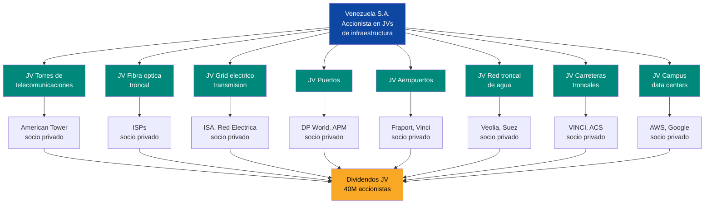
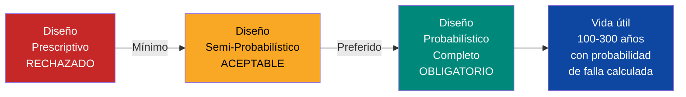
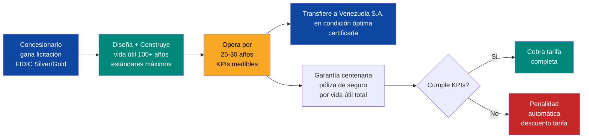
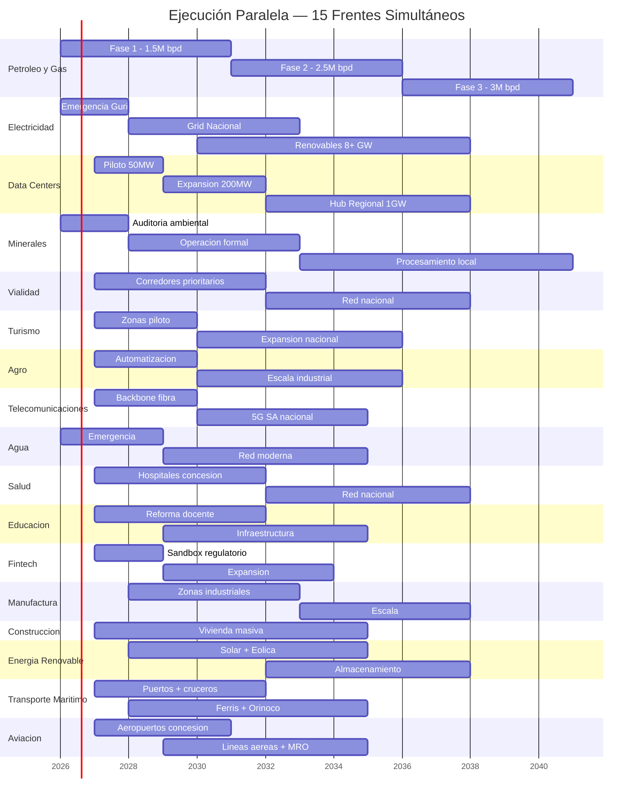
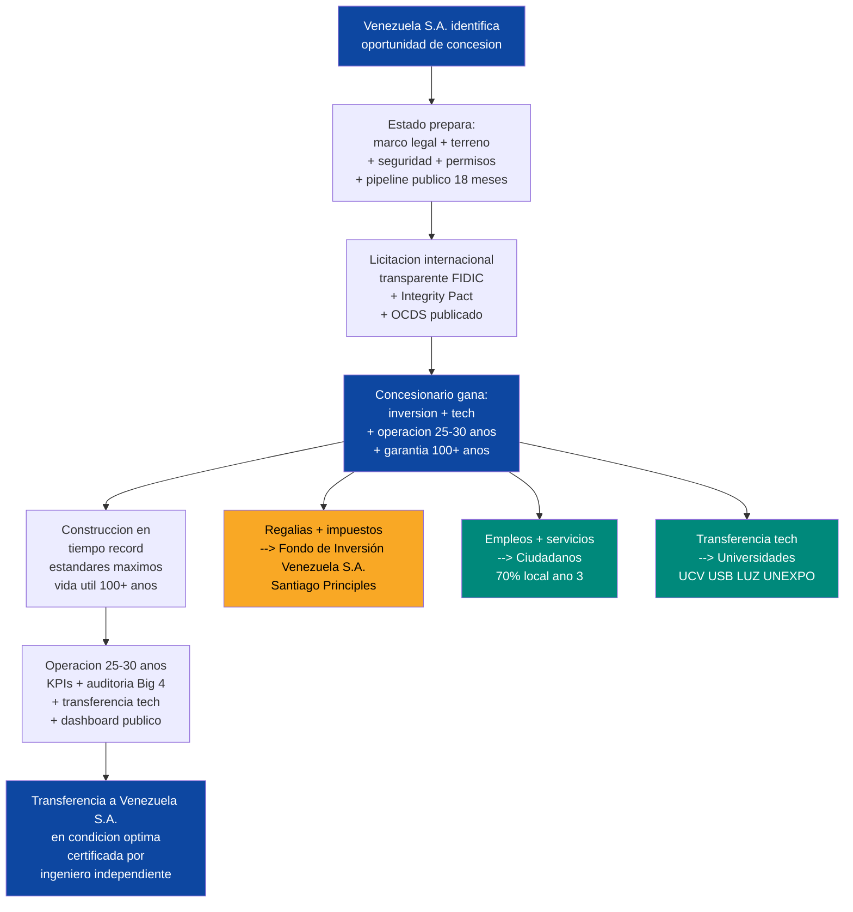

# Modelo de Concesiones: Estándares Máximos, 100+ Años, Ejecución Paralela

:::caution Fechas ilustrativas — las fases se activan por KPIs, no por calendario
Las referencias a "Año X" en este documento son **ilustrativas**. Las fases reales se activan por condiciones verificables (PIB/cápita, formalización, pobreza). Ver [KPIs de Activación](/07-ejecucion/kpis-activacion).
:::

:::danger Principio Inviolable
Toda obra, toda infraestructura, todo servicio en este plan debe ser de **calidad mundial máxima**. No la norma mínima — el **estándar más estricto que existe en cada categoría**. Venezuela no se reconstruye con parches ni con estándares mediocres — se reconstruye con lo mejor que la humanidad ha construido. Infraestructura para **100+ años**, no para 20.
:::

## La Tesis

Venezuela S.A. no es un gobierno que construye. Es una **plataforma que habilita la construcción más ambiciosa de infraestructura del siglo XXI** — y al mismo tiempo, es el **holding de 40 millones de accionistas** que participa como accionista en joint ventures de infraestructura y recibe dividendos perpetuos.

:::danger Distinción Fundamental: Estado vs. Venezuela S.A.
**El Estado NO es dueño de ninguna empresa.** Su rol es exclusivamente: gobierno, salud, justicia, educación y seguridad. **Venezuela S.A.** es la entidad corporativa de los ciudadanos — invierte en infraestructura base, cobra regalías, administra el Fondo de Inversión Venezuela S.A. y distribuye dividendos. Cuando una concesión paga, le paga a Venezuela S.A. (los ciudadanos), no al gobierno.
:::

| Rol | Quien | Que Hace |
|-----|-------|----------|
| **Estado** | Gobierno de transición | Regula, da permisos, seguridad, justicia, velocidad. **No posee empresas.** |
| **Venezuela S.A.** | Holding de 40M accionistas | Invierte en infraestructura base, cobra regalías y equity, administra Fondo de Inversión Venezuela S.A. |
| **Concesionario internacional** | Capital extranjero | Inversión, tecnología, know-how, ejecución, operación |
| **Ciudadano** | Accionista de Venezuela S.A. | Trabajo, consumo, supervisión, dividendo soberano |
| **Fondo de Inversión Venezuela S.A.** | Administrado por Venezuela S.A. | Regalías, impuestos, equity, ahorro intergeneracional |

### Venezuela S.A. como Accionista en Joint Ventures de Infraestructura

Venezuela S.A. no solo cobra regalías pasivamente. **Participa como accionista en joint ventures de infraestructura base** — aporta tierra, recursos y permisos como equity, y el socio privado aporta capital y tecnología. Los dividendos de cada JV fluyen a los 40M ciudadanos-accionistas:

| Infraestructura Base | Venezuela S.A. Invierte | Operadores Pagan | Modelo Referencia |
|---------------------|------------------------|------------------|-------------------|
| **Torres telecoms** | Accionista en JV con operador de torres | Operadores pagan arriendo → dividendo al JV | American Tower, SBA Communications |
| **Fibra óptica troncal** | Accionista en JV del backbone nacional (50,000+ km) | ISPs pagan acceso wholesale → dividendo al JV | Chorus (Nueva Zelanda), NBN (Australia) |
| **Grid eléctrico (transmisión)** | Accionista en JV de transmisión | Generadores y distribuidores pagan peaje → dividendo al JV | ISA (Colombia), Red Eléctrica (España) |
| **Puertos (terreno + infraestructura)** | Aporta terreno como equity en JV portuario | Operadores pagan concesión BOT → dividendo al JV | Port Authority NY/NJ, Rotterdam |
| **Aeropuertos** | Aporta terreno e infraestructura base como equity en JV | Operadores pagan concesión → dividendo al JV | ADP (París), AENA (España) |
| **Red troncal de agua** | Accionista en JV de acueductos y plantas | Operadores pagan concesión → dividendo al JV | Thames Water, Aguas Andinas (Chile) |
| **Carreteras troncales** | Aporta derecho de vía como equity en JV | Concesionarios operan peaje → dividendo al JV | MOP Chile, ANI Colombia |
| **Campus data centers** | Aporta terreno + energía como equity en JV | Hyperscalers pagan colocation → dividendo al JV | Equinix, Digital Realty |

:::info Dividendos recurrentes perpetuos
La infraestructura base dura **100+ años**. Los operadores rotan cada **25-30 años** vía nuevas licitaciones. Venezuela S.A., como accionista en cada JV, recibe dividendos perpetuos de activos reales que se aprecian con el tiempo. Modelo: **Debswana** (Botsuana 50% / De Beers 50%) — el socio público aporta el recurso, el privado aporta capital y expertise, ambos reciben dividendos del JV.
:::

### Cómo Financia Venezuela S.A. sus Posiciones en los Joint Ventures

Venezuela S.A. **no necesita cash propio** para la mayoría de sus inversiones. Aporta **en especie** — igual que un fundador de startup aporta la idea y el trabajo, y el VC aporta el capital:

| Mecanismo | Cómo Funciona | Cash Requerido |
|-----------|--------------|----------------|
| **Aporte en especie: tierra** | Venezuela S.A. aporta terreno como equity en el JV | USD 0 |
| **Aporte en especie: recurso natural** | Petróleo, minerales, agua, sol, viento = valor de equity | USD 0 |
| **Aporte en especie: permisos + mercado** | 40M consumidores + fast-track = valor negociable | USD 0 |
| **Forwards petroleros** | Pre-venta de crudo genera USD 15-25B upfront (ya en el plan) | Cash generado |
| **Regalías reinvertidas** | Primeras regalías de concesiones se reinvierten en infraestructura base | Cash de operación |
| **Bonos de infraestructura** | Bonos respaldados por flujo futuro de concesiones (deuda corporativa, no soberana) | Deuda VSA |
| **Inversión ciudadana** | 40M accionistas invierten desde USD 10 | Crowd-equity |
| **Diáspora** | 8M venezolanos afuera invierten en Venezuela S.A. | Remesas productivas |
| **Multilaterales** | BID, CAF, IFC, DFC prestan para infraestructura base | Deuda multilateral |

:::caution Venezuela S.A. es accionista, no dueña
Venezuela S.A. no "posee" infraestructura como un Estado socialista. Es **accionista** en joint ventures donde el socio privado aporta capital y tecnología, y Venezuela S.A. aporta tierra, recursos, permisos y acceso al mercado. Modelo: Debswana (Botsuana 50% / De Beers 50% — Botsuana aportó la concesión minera, De Beers aportó el capital). Resultado: Botsuana pasó de ser uno de los países más pobres del mundo a tener el PIB per cápita más alto de África.
:::

:::tip El benchmark NO es Latinoamérica — es el mejor del mundo
Si Noruega tiene el mejor Fondo de Inversión Venezuela S.A., copiamos a Noruega. Si Singapur tiene el mejor puerto, copiamos a Singapur. Si Japón tiene la mejor ingeniería antisísmica, copiamos a Japón. Si Australia diseña puentes para 300 años, copiamos a Australia. Si Holanda protege contra inundaciones 1-en-100,000 años, copiamos a Holanda. Venezuela no compite con Honduras — **compite con los mejores del planeta en cada categoría.**
:::

---

## Los 10 Principios de Toda Concesión

### 1. Diseño para 100+ Años — No para una Generación

:::danger La infraestructura no es para nosotros — es para nuestros bisnietos
Cada puente, cada planta, cada túnel, cada red eléctrica debe diseñarse para durar **mínimo 100 años**. Un puente de 50 años es un gasto. Un puente de 300 años es una inversión. Australia demostró con el Sir Leo Hielscher Bridge (300 años de vida útil) que el diseño centenario es **más económico** en ciclo de vida que el diseño convencional. Venezuela construye para siempre o no construye.
:::

| Tipo de Infraestructura | Vida Útil de Diseño | Estándar de Referencia | País Referencia |
|--------------------------|---------------------|------------------------|-----------------|
| **Puentes y túneles** | 200-300 años | EN 1990 Cat. 5 + fib Model Code probabilístico | Australia (300 años), Finlandia (200 años) |
| **Edificios monumentales** (hospitales, universidades) | 100 años | EN 1990 Cat. 5 + ISO 16204 | UE/UK |
| **Represas y presas** | 100+ años | ICOLD + fib probabilístico | Suiza, Noruega |
| **Redes eléctricas** (líneas, subestaciones) | 50-80 años | IEC 61936-1 + NERC TPL | Singapur, EE.UU. |
| **Autopistas** | 100 años | EN 1990 Cat. 5 + AASHTO LRFD 100-year | Australia, UE |
| **Puertos** | 100 años | PIANC + Rotterdam Class | Países Bajos, Singapur |
| **Plantas de tratamiento de agua** | 100 años | Dutch Delta Programme standards | Países Bajos |
| **Data centers** | 25-30 años (tecnología evoluciona) | Uptime Tier IV + ISO 27001 | Global |
| **Telecomunicaciones** (ductos, fibra) | 50+ años | ITU-T + 5G SA | Corea del Sur, UAE |
| **Vivienda social** | 75-100 años | Eurocode + Passivhaus | Alemania, Austria |

**Metodología de diseño obligatoria:** Análisis probabilístico completo según **fib Bulletin 34/76 + ISO 16204** — no el método prescriptivo (deemed-to-satisfy) sino el **método probabilístico completo** que calcula la probabilidad de falla a lo largo de toda la vida útil.

### 2. Estándares Máximos por Sector — Sin Excepción

No se usa el estándar mínimo. Se usa **el más exigente que existe en el mundo** para cada categoría:

| Sector | Estándar Máximo | Especificación | País Líder |
|--------|----------------|----------------|------------|
| **Ingeniería estructural** | EN 1990 Cat. 5 + fib probabilístico | 100-300 años vida útil, análisis probabilístico completo | Australia, UE, Finlandia |
| **Resistencia sísmica** | Japan Building Standards Act Grade 3 + aislamiento sísmico | Reduce vibración 70-80%, soporta intensidad JMA 6-7 | Japón |
| **Túneles** | SIA 198 (Suiza) | Primer código de túneles del mundo, refinado continuamente | Suiza |
| **Protección contra inundaciones** | Dutch Delta Programme | Protección 1-en-100,000 años (0.001% probabilidad anual) | Países Bajos |
| **Red eléctrica** | NERC TPL N-1-1 + SAIDI <1 min/año | Contingencia doble + confiabilidad clase Singapur (0.23 min/cliente/año) | Singapur, EE.UU. |
| **Data centers** | Uptime Tier IV | 99.995% disponibilidad, 2N+1 redundancia, tolerancia total a fallos | Global (no existe nivel superior) |
| **Minería** | IRMA 100 | 420+ requisitos auditables, cumplimiento total | Global (nivel máximo de IRMA) |
| **Puertos** | PIANC + Rotterdam Class | 24m calado, diseño eco-basado, IoT, sensores | Países Bajos, Singapur |
| **Aeropuertos** | ICAO Annex 14 + Changi Class (Skytrax 5-star) | 13x mejor aeropuerto del mundo | Singapur |
| **Salud** | JCI Gold Seal of Approval | Evaluación más rigurosa del mundo, 1,000+ orgs en 70+ países | Global (Joint Commission) |
| **Educación** | Finnish Model | Maestría obligatoria para TODOS los docentes, 10% tasa de aceptación | Finlandia |
| **Agua y saneamiento** | Dutch Delta Programme + WHO Guidelines | Protección 1:100,000 + tratamiento WHO | Países Bajos |
| **Telecomunicaciones** | 5G SA + FTTH 99%+ | Core 5G independiente + fibra hasta el hogar universal | Corea del Sur, UAE (99.3%) |
| **Sostenibilidad** | Envision Platinum (ISI) | 64 criterios en 5 categorías, revisión independiente | Global |
| **Gestión de activos** | ISO 55000 | Optimización de costo de ciclo de vida completo | Global |
| **Construcción verde** | BCA Green Mark Platinum SLE | 55%+ mejora energética sobre línea base | Singapur |
| **Contratos de ingeniería** | FIDIC Silver Book (EPC/Turnkey) | Máxima responsabilidad del contratista | Global |
| **Contratos de concesión** | FIDIC Gold Book (DBO) | Diseño + Construcción + Operación = responsabilidad total del ciclo | Global |
| **Calidad de gestión** | ISO 9001:2015 | Obligatorio para toda operación | Global |
| **Gestión ambiental** | ISO 14001:2015 + IFC Performance Standards | El más exigente de los dos aplica | Global |
| **Seguridad laboral** | ISO 45001 | Zero tolerance, trazabilidad total | Global |
| **Ciberseguridad** | NERC CIP + SOC 2 Type II + ISO 27001 + CMMC L3 | Stack completo para infraestructura crítica | EE.UU., Global |

:::info Australia demostró que 300 años es más barato que 50
El Sir Leo Hielscher Bridge en Brisbane fue diseñado para **300 años de vida útil** usando acero inoxidable dúplex. El análisis de costo de ciclo de vida demostró que infraestructura centenaria es **más económica** que estructuras de vida corta en casi todos los casos. Referencia: [Sustainable Bridges - 300 Year Design Life](https://www.researchgate.net/publication/343569224)
:::

### 3. Transferencia Tecnológica — Obligatoria y Progresiva

Todo concesionario debe incluir en su contrato un plan vinculante de transferencia:

| Componente | Requisito | Plazo | Referencia |
|------------|-----------|-------|------------|
| **Capacitación local** | Mínimo 70% fuerza laboral venezolana al año 3 | Progresivo | Modelo EMBRAER (Brasil) |
| **Centro de formación** | El concesionario opera un centro de entrenamiento en su sector | Año 1 | Condición de acceso al mercado |
| **Documentación técnica** | Manuales, procesos, SOPs en español, propiedad de Venezuela | Continuo | Know-how transferido |
| **Laboratorio/taller** | Capacidad de mantenimiento local, no dependencia de importación | Año 2-3 | Autosuficiencia |
| **Investigación aplicada** | Colaboración con universidades venezolanas (UCV, USB, LUZ, UNEXPO) | Año 2+ | I+D local |
| **Proveedores locales** | Mínimo 30% de insumos de proveedores locales al año 5 | Progresivo | Cadena de valor local |
| **Certificación de personal** | El concesionario certifica técnicos venezolanos a estándar internacional | Año 2+ | Capital humano exportable |
| **Patentes y propiedad intelectual** | Venezuela retiene derechos sobre mejoras desarrolladas localmente | Continuo | Soberanía tecnológica |

:::info Modelo EMBRAER (Brasil) + Hyundai (Corea)
Brasil exigió transferencia tecnológica en aviación. Hoy Embraer es el 3er fabricante de aviones del mundo. Corea del Sur hizo lo mismo con Hyundai y Samsung. La transferencia no es un favor — **es la condición de acceso a un mercado de 40 millones de personas y USD 300-400B en concesiones.**
:::

### 4. Concesión con Administración, Garantía y Responsabilidad Centenaria

El concesionario no solo construye — **opera, garantiza y responde por la vida útil completa**:

| Elemento | Detalle |
|----------|---------|
| **Modelo contractual** | FIDIC Silver Book (EPC) + FIDIC Gold Book (DBO) según sector |
| **Plazo de concesión** | 25-30 años de operación |
| **Vida útil de diseño** | 100-300 años según tipo de infraestructura |
| **KPIs contractuales** | Disponibilidad, calidad, satisfacción, mantenimiento — medidos en tiempo real |
| **Penalidades** | Automáticas por incumplimiento — no discrecionales, activadas por dashboard |
| **Performance bond** | 10-20% del valor del contrato en escrow |
| **Garantía estructural** | 15 años post-entrega para infraestructura crítica |
| **Garantía funcional** | 7 años post-entrega |
| **Seguro de vida útil** | Póliza (Lloyd's, Munich Re, Swiss Re) que cubre defectos latentes por la vida útil total de diseño |
| **Auditoría** | Internacional, independiente, anual — Big 4 con rotación cada 3 años |
| **Transferencia final** | El activo se devuelve a Venezuela S.A. (no al Estado) en condición operativa certificada por ingeniero independiente |
| **Financiamiento** | El concesionario asume el riesgo financiero (project finance, no deuda soberana). Venezuela S.A. puede emitir deuda corporativa propia respaldada por flujo de concesiones |
| **Defect liability** | 5-15 años según sector — el concesionario repara a su costo |

### 5. Ejecución Paralela — Velocidad como Ventaja Competitiva

:::danger La ventana es 10-15 años
El petróleo es un activo depreciante. Para 2040, solar será más barato que extraer crudo de la Faja. Cada mes de demora es un mes menos de financiamiento para diversificar. La velocidad no es un lujo — es supervivencia. Pero velocidad SIN calidad no es velocidad — es demolición futura.
:::

**El modelo de ejecución paralela** permite iniciar 15+ sectores simultáneamente sin sacrificar calidad:

**Cómo funciona la ejecución paralela:**

| Mecanismo | Implementación | Referencia |
|-----------|----------------|------------|
| **Autoridad central de coordinación** | Venezuela S.A. como PMO nacional con dashboard en tiempo real | Singapur LTA, UAE Dubai 2040 |
| **Ventanilla única digital** | Un solo punto de contacto para todos los permisos — silencio administrativo positivo (30 días = aprobado) | Estonia e-governance |
| **Licitaciones simultáneas** | 15 sectores licitan en paralelo, cada uno con su comité técnico | Chile MOP Concesiones |
| **Plataforma digital de entrega** | Common Data Environment (CDE) para todos los stakeholders | Singapur FulcrumHQ |
| **Estandarización de contratos** | Plantilla FIDIC única adaptada por sector — reduce negociación de 12 meses a 3 | FIDIC Silver/Gold |
| **Pipeline transparente** | Todos los proyectos publicados con 18 meses de anticipación para que el mercado se prepare | Australia Infrastructure |
| **Fast-track ambiental** | Evaluación IFC en 60 días máximo — no burocracia inventada | IFC Performance Standards |
| **Importación exenta** | Maquinaria de concesión con 0% arancel | Zona franca universal |

**Compromisos de velocidad de Venezuela S.A. + Estado:**

| Compromiso | Mecanismo | Plazo |
|------------|-----------|-------|
| **Permiso de construcción** | Ventanilla única digital, silencio positivo | 30 días máximo |
| **Evaluación ambiental** | Fast-track IFC Standards | 60 días máximo |
| **Visa de trabajo** | Fast-track para técnicos del concesionario | 15 días |
| **Importación de equipos** | Exención arancelaria para maquinaria de concesión | Inmediato |
| **Resolución de disputas** | ICSID (Banco Mundial), no tribunales locales | En contrato |
| **Seguridad del sitio** | Coordinación FANB reformada + contratistas privados | Desde día 1 |
| **Conectividad** | Starlink disponible en cualquier sitio de obra | Semana 1 |
| **Terrenos** | Venezuela S.A. aporta terrenos saneados como equity, sin conflictos de título | Pre-licitación |

### 6. Protección al Inversor — Arquitectura Legal Blindada

| Protección | Mecanismo | Detalle |
|------------|-----------|---------|
| **BIT (Bilateral Investment Treaty)** | Venezuela-EE.UU. (en negociación), Venezuela-UE, Venezuela-UK | Tratado supranacional |
| **ICSID** | Arbitraje internacional del Banco Mundial | No tribunales locales |
| **MIGA** | Seguro contra riesgo político (guerra, expropiación, incumplimiento) | Banco Mundial |
| **Estabilidad jurídica** | Cláusula de estabilización — cambios de ley no afectan contratos existentes | Contractual |
| **Repatriación de utilidades** | Garantizada en USD, sin restricciones cambiarias | Constitucional |
| **No expropiación** | Prohibición constitucional — requiere compensación a valor justo + lucro cesante | Supra-constitucional |
| **SPV offshore** | Estructura societaria en jurisdicción neutral (Delaware, Países Bajos, Singapur) | Project finance |
| **Lock anti-populista** | Modificación requiere 2/3 del Parlamento + referéndum | Anti-captura |

:::caution Lección de la historia
Venezuela expropió **USD 20B+** en activos entre 2007-2014. Cualquier inversor preguntará: "¿por qué esta vez es diferente?" La respuesta: BIT + ICSID + MIGA + cláusula de estabilización + Fondo de Inversión Venezuela S.A. offshore + locks supra-constitucionales. **No es confianza — es arquitectura legal que hace la expropiación económicamente irracional.**
:::

### 7. Transparencia Total — Anti-Corrupción de Clase Mundial

No basta con dashboards. Venezuela adopta los **4 marcos anti-corrupción más exigentes del mundo** simultáneamente:

| Marco | Alcance | Requisito Clave |
|-------|---------|-----------------|
| **UNCAC** | Único tratado anti-corrupción legalmente vinculante (180+ países) | Prevención, criminalización, cooperación, recuperación de activos |
| **CoST** (Infrastructure Transparency Initiative) | 25,000+ proyectos monitoreados globalmente | **40 datos públicos** por proyecto en todo el ciclo de vida |
| **OCDS** (Open Contracting Data Standard) | 50+ gobiernos implementando | Datos estructurados y legibles por máquina en todas las etapas |
| **EITI** (Extractive Industries Transparency Initiative) | Sector extractivo | Todos los contratos/licencias publicados, reporte de beneficiarios reales |

**Stack de transparencia para cada concesión:**

| Capa | Mecanismo | Frecuencia |
|------|-----------|------------|
| **Dashboard público** | Avance, gasto, KPIs, empleo, penalidades — visible para todos | Tiempo real |
| **Integrity Pact** (Transparency International) | Acuerdo público entre gobierno y licitantes con monitor civil independiente | Por licitación |
| **Clerk of Works** | Ingeniero independiente certifica calidad de construcción en sitio | Continuo |
| **Auditoría Big 4** | Deloitte, PwC, EY o KPMG — rotación cada 3 años | Trimestral |
| **Whistleblower channel** | Canal protegido legalmente con recompensas por denuncias verificadas | Permanente |
| **Open Contracting** | Todos los contratos publicados en formato OCDS | Al adjudicar |

| Métrica Pública | Visible para |
|-----------------|-------------|
| Avance de obra (%) | Todos |
| Gasto vs. presupuesto | Todos |
| KPIs de calidad | Todos |
| Empleo generado (local vs. extranjero) | Todos |
| Transferencia tecnológica (% cumplimiento) | Todos |
| Auditorías (resultados completos) | Todos |
| Incidentes ambientales | Todos |
| Penalidades aplicadas | Todos |
| Contratos completos (texto íntegro) | Todos |
| Beneficiarios reales de cada empresa | Todos |

### 8. Sostenibilidad y Resiliencia Climática

Toda infraestructura debe certificarse bajo **Envision Platinum** (ISI) — el estándar más alto de sostenibilidad para infraestructura:

| Categoría Envision | Criterios | Aplicación |
|--------------------|-----------|------------|
| **Calidad de vida** | Impacto comunitario, movilidad, salud pública | Todo proyecto |
| **Liderazgo** | Colaboración, gestión, planificación | Todo proyecto |
| **Asignación de recursos** | Materiales, energía, agua — ciclo de vida completo | Todo proyecto |
| **Mundo natural** | Hábitats, biodiversidad, suelos, agua | Todo proyecto |
| **Clima y resiliencia** | Emisiones, adaptación, riesgos a largo plazo | Todo proyecto |

Adicionalmente:

| Requisito | Estándar | Detalle |
|-----------|----------|---------|
| **Huella de carbono** | Net-zero en operación al año 10 | Compensación con energía hidroeléctrica |
| **Resiliencia a clima extremo** | Diseño para escenarios IPCC RCP 8.5 (peor caso) | Temperatura, precipitación, nivel del mar al 2100+ |
| **Gestión de residuos** | Zero waste en operación | Economía circular obligatoria |
| **Biodiversidad** | Net positive impact | Más biodiversidad post-proyecto que pre-proyecto |
| **Eficiencia energética** | BCA Green Mark Platinum SLE | 55%+ mejora sobre línea base 2005 |

### 9. Beneficio al Ciudadano — El Accionista Primero

| Beneficio | Mecanismo |
|-----------|-----------|
| **Empleo local** | Mínimo 70% fuerza laboral venezolana al año 3 |
| **Precios accesibles** | Tarifas reguladas para servicios esenciales (agua, electricidad, salud) |
| **Acceso universal** | Ninguna concesión puede excluir poblaciones vulnerables |
| **Dividendo soberano** | Regalías van al Fondo de Inversión Venezuela S.A. → dividendo ciudadano anual |
| **Participación comunitaria** | Consulta pública obligatoria (FPIC/ILO 169) antes de cada concesión |
| **Prioridad de compra** | Venezolanos pueden invertir en cada concesión desde USD 10 |
| **Capacitación gratuita** | Centro de formación del concesionario abierto a la comunidad |
| **Infraestructura permanente** | 100+ años de vida útil = beneficio intergeneracional |

### 10. Gestión de Activos — ISO 55000 para Todo

Cada activo construido bajo concesión se gestiona bajo **ISO 55000** (Asset Management) durante toda su vida útil:

| Fase | Actividad | Responsable |
|------|-----------|-------------|
| **Planificación** | Análisis de costo de ciclo de vida (100+ años) | Concesionario + Venezuela S.A. |
| **Construcción** | Trazabilidad total de materiales y procesos | Concesionario |
| **Operación** | Mantenimiento predictivo con IoT y sensores | Concesionario (25-30 años) |
| **Post-transferencia** | Plan de mantenimiento entregado con el activo | Venezuela S.A. + nuevo operador |
| **Renovación** | Protocolo definido para renovación/actualización | Venezuela S.A. |
| **Fin de vida** | Protocolo de demolición/reciclaje (economía circular) | Venezuela S.A. |

---

## Cómo Funciona en la Práctica

---

## Mapa de Oportunidades por Sector

| # | Sector | Inversión Estimada | Empleos | Concesionarios Tipo | Estándar Máximo | Vida Útil |
|---|--------|-------------------|---------|---------------------|-----------------|-----------|
| 1 | [Data Centers IA](./data-centers-ia) | USD 6-10B | 15-22K | AWS, Google, Microsoft | Tier IV + ISO 27001 + CMMC L3 | 25-30 años |
| 2 | [Minerales Críticos](./minerales-criticos) | USD 22-41B | 50-100K | Rio Tinto, BHP, Freeport | IRMA 100 + EITI + FPIC | 25-30 años |
| 3 | [Capacidad Eléctrica](./capacidad-electrica) | USD 15-25B | 30-50K | Siemens, AES, Enel | NERC CIP + SAIDI <1 min + N-1-1 | 50-80 años |
| 4 | [Turismo](./turismo) | USD 5-15B | 200-500K | Marriott, Hilton, Accor | Skytrax 5-star + Envision | 100 años |
| 5 | [Agro y Ganadería](./agro-ganaderia) | USD 18-25B | 500K-1M | Cargill, JBS, ADM | ISO 22000 + Precision Ag | 100 años |
| 6 | [Vialidad y Logística](./vialidad-logistica) | USD 15-25B | 300-500K | VINCI, ACS, Bechtel | EN 1990 Cat.5 + AASHTO 100yr | 100-300 años |
| 7 | [FinTech y Banca](./fintech-banca-digital) | USD 1-3B | 50-100K | Nubank, Square, Visa | PCI DSS + SOC 2 | 25 años |
| 8 | [Salud](./salud-telemedicina) | USD 5-10B | 100-200K | HCA, Rede D'Or, Pfizer | JCI Gold Seal + WHO/OPS | 100 años |
| 9 | [Educación](./educacion-edtech) | USD 2-5B | 50-100K | Platzi, Coursera, 42 | Finnish Model + Passivhaus | 100 años |
| 10 | [Energía Renovable](./energia-renovable) | USD 3-7B | 30-50K | Enel, Iberdrola, NextEra | IEA/IRENA + Envision Platinum | 30-50 años |
| 11 | [Agua y Saneamiento](./agua-saneamiento) | USD 5-10B | 20-40K | Veolia, Suez, Xylem | Dutch Delta 1:100,000 + WHO | 100 años |
| 12 | [Telecomunicaciones](./telecomunicaciones) | USD 5-10B | 50-80K | América Móvil, Millicom | 5G SA + FTTH 99%+ | 50 años |
| 13 | [Construcción](./construccion-inmobiliaria) | USD 30-50B | 500K-1M | VINCI, CEMEX, LafargeHolcim | Eurocode + Passivhaus + 100yr | 100 años |
| 14 | [Manufactura](./manufactura-industrial) | USD 12-22B | 300-500K | Toyota, Nestlé, PepsiCo | ISO 9001 + ISO 14001 + 45001 | 50-100 años |
| 15 | [Petróleo y Gas](./petroleo-gas) | USD 183B | 200-300K | Chevron, Shell, Total | API + ISO 14001 + EITI | 25-30 años |
| 16 | [Transporte Marítimo](./transporte-maritimo) | USD 6-12B | 50-100K | DP World, APM, Royal Caribbean | PIANC + IMO + Rotterdam Class | 100 años |
| 17 | [Aviación y Aeropuertos](./aviacion-aeropuertos) | USD 5-9B | 40-80K | Fraport, Vinci, Copa, JetBlue | ICAO Annex 14 + Skytrax 5-star | 100 años |
| | **TOTAL** | **USD 338-462B** | **2.6-4.7M** | | | |

:::tip USD 338-462B en concesiones = el plan se financia solo
El plan total es USD 550-750B en 15 años. Si las concesiones atraen USD 338-462B en capital privado, Venezuela S.A. solo necesita facilitar USD 88-288B — financiable con petróleo a USD 60/barril + multilaterales + Fondo de Inversión Venezuela S.A.. **El capital privado no es un complemento — es el motor principal. Venezuela S.A. participa como accionista en cada JV de infraestructura, recibe dividendos perpetuos, y los distribuye a los 40M ciudadanos-accionistas.**
:::

---

## Precedentes Internacionales

| País | Modelo | Qué Copiamos | Sector |
|------|--------|-------------|--------|
| **Australia** | 300 años vida útil (Sir Leo Hielscher Bridge) | Diseño centenario probabilístico | Puentes, túneles |
| **Finlandia** | 200 años (Kruunuvuori Bridge) | Componentes no-reemplazables para 200+ años | Infraestructura monumental |
| **Japón** | Grade 3 sísmica + aislamiento | Resistencia sísmica máxima | Todo (Venezuela tiene actividad sísmica) |
| **Suiza** | SIA 198 (primer código de túneles del mundo) | Estándares de túnel | Vialidad montañosa |
| **Países Bajos** | Delta Programme 1:100,000 | Protección contra inundaciones | Agua, presas, costa |
| **Singapur** | SAIDI 0.23 min/año + BCA Green Mark | Grid más confiable + construcción verde | Electricidad, edificios |
| **Chile** | 25+ años de concesiones exitosas (80% autopistas en BOT) | Marco de concesiones | Vialidad, infraestructura |
| **Noruega** | NBIM (USD 2.2T) + Santiago Principles | Gobernanza de Fondo de Inversión Venezuela S.A. | Fondo de Inversión Venezuela S.A. |
| **Estonia** | e-Governance, gobierno 100% digital | Ventanilla única, permisos digitales | Estado digital |
| **Corea del Sur** | 5-year plans + 5G SA + FTTH | Ejecución paralela de infraestructura | Telecoms, industria |
| **UAE** | Dubai 2040 (USD 177B en paralelo) | Ejecución masiva paralela coordinada | Multi-sector |
| **Rwanda** | Umuganda + gobierno disciplinado | Participación comunitaria + disciplina | Gobernanza |

---

## Fuentes

| # | Fuente | Dato |
|---|--------|------|
| 1 | [World Bank PPP Knowledge Lab](https://ppp.worldbank.org/) | Marcos de concesiones PPP |
| 2 | [IFC Performance Standards](https://www.ifc.org/en/insights-reports/2012/ifc-performance-standards) | Estándares sociales y ambientales |
| 3 | [FIDIC](https://fidic.org/) | Contratos de ingeniería Silver/Gold Book |
| 4 | [Chile MOP Concesiones](https://www.concesiones.cl/) | Modelo chileno de concesiones (25+ años) |
| 5 | [ICSID](https://icsid.worldbank.org/) | Arbitraje internacional |
| 6 | [MIGA](https://www.miga.org/) | Seguro contra riesgo político |
| 7 | [EN 1990 Eurocode](https://www.phd.eng.br/wp-content/uploads/2015/12/en.1990.2002.pdf) | Basis of Structural Design — Cat. 5 (100 años) |
| 8 | [fib Model Code](https://books.google.com/books/about/Model_Code_for_Service_Life_Design.html?id=CXHy2xew2aUC) | Service Life Design probabilístico |
| 9 | [ISO 16204:2012](https://cdn.standards.iteh.ai/samples/55862/8fad5efebadf4125998d7d7c358ac558/ISO-16204-2012.pdf) | Durability — Service Life Design of Concrete |
| 10 | [Sir Leo Hielscher Bridge — 300 Year Design](https://www.researchgate.net/publication/343569224) | Puente de 300 años, más económico en ciclo de vida |
| 11 | [Japan Building Standards Act](https://e-housing.jp/post/japans-earthquake-resistant-buildings-overview-history) | Grade 3 sísmica + aislamiento |
| 12 | [SIA 198 Swiss Tunnel Code](https://www.sia.ch/en/cms/services/standards-regulations) | Primer código de túneles del mundo |
| 13 | [Dutch Delta Programme](https://english.deltaprogramma.nl/) | Protección 1:100,000 años |
| 14 | [Singapore SAIDI](https://www.ema.gov.sg/) | 0.23 min/cliente/año (mejor del mundo) |
| 15 | [Uptime Institute Tier IV](https://uptimeinstitute.com/tier-certification) | 99.995% disponibilidad |
| 16 | [IRMA Standard v2.0](https://responsiblemining.net/) | 420+ requisitos auditables |
| 17 | [JCI Gold Seal](https://www.jointcommission.org/) | Acreditación hospitalaria más rigurosa |
| 18 | [Finnish Education](https://ncee.org/finland/) | Maestría obligatoria para docentes |
| 19 | [UNCAC](https://star.worldbank.org/focus-area/uncac) | Tratado anti-corrupción vinculante |
| 20 | [CoST](https://infrastructuretransparency.org/) | 40 datos públicos por proyecto |
| 21 | [OCDS](https://www.open-contracting.org/data-standard/) | Open Contracting Data Standard |
| 22 | [Envision ISI](https://sustainableinfrastructure.org/envision/) | Sostenibilidad de infraestructura — Platinum |
| 23 | [ISO 55000](https://www.iso.org/standard/83053.html) | Asset Management lifecycle |
| 24 | [Santiago Principles](https://www.ifswf.org/) | 33 principios para fondos soberanos |
| 25 | [Transparency International Integrity Pacts](https://www.transparency.org/en/projects/integrity-pact-global-standard) | Monitor civil independiente en licitaciones |
| 26 | [NERC TPL-001-5.1](https://www.nerc.com/) | Contingencia N-1-1 para transmisión |
| 27 | [BCA Green Mark](https://www1.bca.gov.sg/) | Platinum SLE — 55%+ mejora energética |
