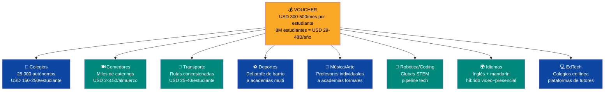

# Negocios del Voucher Educativo: 500.000+ Empleos, Miles de Empresas

> El voucher educativo no es solo un mecanismo de financiamiento escolar — es un **mercado de USD 10-30B/año** que crea oportunidades de negocio para cualquier venezolano con una habilidad enseñable. Desde el profesor de básquet del barrio hasta una cadena de colegios bilingües. Todos compiten por los puntos del voucher.

:::info El mercado más grande que nadie ve
8 millones de estudiantes × USD 300-500/mes de voucher = **USD 29-48B/año** fluyendo por el sistema educativo. Eso es más grande que el mercado petrolero doméstico. Cada dólar de ese voucher es un ingreso para alguien: un colegio, un cocinero, un chofer, un profesor de música, un instructor de karate. **El voucher convierte la educación en el sector económico más grande del país.**
:::

---

## 1. Colegio Autónomo (ex-público → empresa privada)

> Una comunidad educativa toma un colegio público y lo convierte en empresa autónoma que compite por vouchers.

| Métrica | Valor |
|---------|-------|
| **Inversión inicial** | USD 10.000-30.000 (modernización básica: pintura, internet, mobiliario) |
| **Estudiantes** | 375 (15 aulas × 25 estudiantes) |
| **Ingreso por voucher** | USD 150-250/mes por estudiante (matrícula) |
| **Ingreso mensual** | USD 56.250-93.750 |
| **Costos mensuales** | USD 38.000-52.000 (15 docentes + 4 admin + servicios + mantenimiento) |
| **Utilidad mensual** | USD 18.000-42.000 |
| **Utilidad anual (10 meses)** | USD 180.000-420.000 |
| **Margen** | ~32-45% |
| **Payback** | 1-2 meses |
| **Empleos directos** | 20-25 (docentes + admin + mantenimiento + cocina) |

**Cómo arranca:** El director y 5 profesores forman una cooperativa o SAS. Postulan ante la Agencia de Calidad para acreditación. Reciben fondos de modernización + asistencia técnica. Empiezan a recibir vouchers de los estudiantes del barrio. Si son buenos, atraen estudiantes de otros barrios.

**Riesgo principal:** Si la calidad baja, los padres mueven el voucher. Sin estudiantes = sin ingresos.

---

## 2. Cadena de Colegios Privados (modelo Bridge International)

> Un emprendedor o grupo inversor crea una red de colegios estandarizados con tecnología, currículo unificado y gestión centralizada.

| Métrica | Valor |
|---------|-------|
| **Inversión por colegio** | USD 100.000-300.000 (terreno + construcción modular + tech) |
| **Red inicial** | 5 colegios (1.875 estudiantes total) |
| **Inversión total** | USD 500.000-1.500.000 |
| **Ingreso mensual (5 colegios)** | USD 281.000-469.000 |
| **Costos mensuales** | USD 190.000-260.000 |
| **Utilidad mensual** | USD 91.000-209.000 |
| **Utilidad anual** | USD 910.000-2.090.000 |
| **Margen** | ~32-45% |
| **Payback** | 8-18 meses |
| **Empleos directos** | 100-125 |
| **Escalabilidad** | 20-50 colegios en 5 años = USD 4-10M utilidad/año |

**Modelo:** [Bridge International Academies](https://www.bridgeinternationalacademies.com/) (Kenya/India): colegios estandarizados de bajo costo con tecnología centralizada. Cada profesor recibe el plan de clase en una tablet. La calidad es consistente en toda la red.

**Referencia:** Bridge opera 500+ escuelas en África con 100K+ estudiantes. Financiado por Bill Gates, Zuckerberg, IFC.

---

## 3. Comedor Escolar (servicio de catering)

> Una empresa de catering prepara y entrega almuerzos a 3-5 colegios del sector.

| Métrica | Valor |
|---------|-------|
| **Inversión inicial** | USD 5.000-15.000 (cocina industrial + transporte + permisos) |
| **Colegios atendidos** | 3-5 |
| **Estudiantes** | 1.000-1.875 |
| **Ingreso por almuerzo** | USD 2.00-3.50 (pagado con puntos del voucher) |
| **Almuerzos/mes** | 22.000-41.250 (22 días × estudiantes) |
| **Ingreso mensual** | USD 44.000-144.375 |
| **Costos (ingredientes 40% + personal 25% + transporte 10% + otros 10%)** | USD 37.400-122.700 (85% del ingreso) |
| **Utilidad mensual** | USD 6.600-21.675 |
| **Utilidad anual (10 meses)** | USD 66.000-216.750 |
| **Margen** | ~15% |
| **Payback** | 1-3 meses |
| **Empleos directos** | 8-15 (cocineros + ayudantes + repartidores) |

**Cómo arranca:** Cocinero con experiencia alquila cocina industrial, obtiene permiso sanitario, ofrece menú a 3 colegios del sector. Los colegios lo contratan porque es más barato que operar su propia cocina. Paga con los puntos de comedor del voucher.

**Oportunidad de escala:** Una red de comedores que atienda 20 colegios (7.500 estudiantes) genera USD 1.3M/año con 50+ empleos.

---

## 4. Transporte Escolar (ruta concesionada)

> Un operador con 2-3 minibuses ofrece rutas escolares en un sector de la ciudad.

| Métrica | Valor |
|---------|-------|
| **Inversión inicial** | USD 15.000-40.000 (2-3 minibuses usados + GPS + seguro) |
| **Estudiantes por ruta** | 30-40 por bus |
| **Total estudiantes** | 60-120 |
| **Ingreso por estudiante** | USD 25-40/mes (pagado con puntos del voucher) |
| **Ingreso mensual** | USD 1.500-4.800 |
| **Costos (combustible + mantenimiento + chofer + seguro)** | USD 900-2.900 |
| **Utilidad mensual** | USD 600-1.900 |
| **Utilidad anual (10 meses)** | USD 6.000-19.000 |
| **Margen** | ~40% |
| **Payback** | 2-7 años (depende de inversión en buses) |
| **Empleos directos** | 2-3 (choferes) |

**Nota:** Margen bajo por estudiante individual, pero estable y predecible. Un operador con 10 buses y 400 estudiantes genera USD 63.000/año con 10 empleados.

**Requisito:** GPS en tiempo real, seguro obligatorio, verificación de antecedentes de choferes (estándar de seguridad del plan).

---

## 5. Profesor de Básquet del Barrio (microempresa deportiva)

> Un exjugador o entrenador aficionado da clases de básquet a niños del barrio, cobrando con puntos del voucher extracurricular.

| Métrica | Valor |
|---------|-------|
| **Inversión inicial** | USD 200-500 (balones + conos + silbato + registro como proveedor acreditado) |
| **Estudiantes** | 30-60 (2-4 grupos de 15) |
| **Ingreso por estudiante** | USD 15-25/mes (puntos extracurriculares) |
| **Ingreso mensual** | USD 450-1.500 |
| **Costos (cancha pública o alquiler + materiales)** | USD 100-400 |
| **Utilidad mensual** | USD 350-1.100 |
| **Utilidad anual** | USD 4.200-13.200 |
| **Margen** | ~73% |
| **Payback** | Inmediato (1 mes) |
| **Empleos** | 1 (el instructor) + posible asistente |

**Contexto:** En la Venezuela actual, un salario de USD 50/mes es normal. Este instructor gana USD 350-1.100/mes enseñando básquet. **Eso es 7-22x el salario mínimo.** El voucher convierte una pasión en un negocio viable.

**Escalabilidad:** Con 2 asistentes y 120 estudiantes → USD 2.200/mes. Agrega fútbol, béisbol, natación → academia multideportiva.

---

## 6. Academia Deportiva (fútbol, béisbol, natación, artes marciales)

> Una academia formal con instalaciones, múltiples deportes y programa estructurado.

| Métrica | Valor |
|---------|-------|
| **Inversión inicial** | USD 20.000-80.000 (cancha/dojo + equipos + oficina + marketing) |
| **Deportes** | 3-5 (fútbol, béisbol, natación, karate, boxeo) |
| **Estudiantes** | 200-500 |
| **Ingreso por estudiante** | USD 20-40/mes (puntos extracurriculares) |
| **Ingreso mensual** | USD 4.000-20.000 |
| **Costos (instructores 6-10 + instalación + materiales)** | USD 2.500-12.000 |
| **Utilidad mensual** | USD 1.500-8.000 |
| **Utilidad anual** | USD 18.000-96.000 |
| **Margen** | ~38-40% |
| **Payback** | 10-36 meses |
| **Empleos directos** | 6-12 (instructores + admin + mantenimiento) |

**Modelo:** El voucher paga la clase. Los padres eligen la academia por calidad. Las academias compiten por estudiantes — las mejores crecen, las malas cierran. **Es un mercado, no un programa gubernamental.**

---

## 7. Escuela de Música (profesor individual → academia)

### 7a. Profesor de música individual (guitarra, piano, canto)

| Métrica | Valor |
|---------|-------|
| **Inversión** | USD 100-300 (instrumento propio + material didáctico) |
| **Estudiantes** | 15-30 (clases individuales o grupos de 5) |
| **Ingreso por estudiante** | USD 20-35/mes |
| **Ingreso mensual** | USD 300-1.050 |
| **Costos** | USD 50-150 (espacio + cuerdas + materiales) |
| **Utilidad mensual** | USD 250-900 |
| **Empleos** | 1 |

### 7b. Academia de música (5+ instrumentos + canto + teoría)

| Métrica | Valor |
|---------|-------|
| **Inversión inicial** | USD 10.000-40.000 (instrumentos + local + insonorización) |
| **Estudiantes** | 100-300 |
| **Programas** | Guitarra, piano, batería, violín, canto, teoría musical |
| **Ingreso por estudiante** | USD 25-45/mes |
| **Ingreso mensual** | USD 2.500-13.500 |
| **Costos (profesores 5-8 + local + instrumentos)** | USD 1.500-8.000 |
| **Utilidad mensual** | USD 1.000-5.500 |
| **Utilidad anual** | USD 12.000-66.000 |
| **Margen** | ~40% |
| **Payback** | 8-36 meses |
| **Empleos** | 5-10 |

---

## 8. Escuela de Teatro y Artes Escénicas

| Métrica | Valor |
|---------|-------|
| **Inversión inicial** | USD 5.000-25.000 (espacio + vestuario + iluminación básica) |
| **Estudiantes** | 50-150 |
| **Programas** | Actuación, improvisación, danza, expresión corporal |
| **Ingreso por estudiante** | USD 20-40/mes |
| **Ingreso mensual** | USD 1.000-6.000 |
| **Costos** | USD 600-3.500 |
| **Utilidad mensual** | USD 400-2.500 |
| **Utilidad anual** | USD 4.800-30.000 |
| **Margen** | ~40% |
| **Payback** | 10-24 meses |
| **Empleos** | 3-6 |

**Revenue adicional:** Obras de teatro para la comunidad (entrada USD 2-5), talleres de verano, corporativos.

---

## 9. Taller de Artes Plásticas (pintura, escultura, cerámica)

| Métrica | Valor |
|---------|-------|
| **Inversión** | USD 3.000-15.000 (materiales + horno cerámica + local) |
| **Estudiantes** | 30-80 |
| **Ingreso por estudiante** | USD 20-35/mes |
| **Ingreso mensual** | USD 600-2.800 |
| **Costos** | USD 300-1.500 (materiales consumibles son el costo principal) |
| **Utilidad mensual** | USD 300-1.300 |
| **Utilidad anual** | USD 3.600-15.600 |
| **Margen** | ~46% |
| **Empleos** | 2-4 |

**Revenue adicional:** Venta de obras de los estudiantes, exposiciones, talleres para adultos (no voucher — pago directo).

---

## 10. Club de Robótica y Programación

| Métrica | Valor |
|---------|-------|
| **Inversión inicial** | USD 5.000-20.000 (kits Arduino/Raspberry Pi + laptops + impresora 3D) |
| **Estudiantes** | 40-100 |
| **Ingreso por estudiante** | USD 25-50/mes |
| **Ingreso mensual** | USD 1.000-5.000 |
| **Costos** | USD 500-2.500 |
| **Utilidad mensual** | USD 500-2.500 |
| **Utilidad anual** | USD 6.000-30.000 |
| **Margen** | ~50% |
| **Payback** | 4-18 meses |
| **Empleos** | 2-5 (instructores tech) |

**Diferenciador:** Los mejores estudiantes de estos clubes alimentan los bootcamps de coding del plan. Es el pipeline de talento tech que Freddy Vega pide.

---

## 11. Academia de Idiomas (inglés + mandarín/portugués)

| Métrica | Valor |
|---------|-------|
| **Inversión** | USD 5.000-20.000 (local + material + pantallas + software) |
| **Estudiantes** | 80-200 |
| **Ingreso por estudiante** | USD 25-45/mes |
| **Ingreso mensual** | USD 2.000-9.000 |
| **Costos** | USD 1.200-5.000 (profesores nativos vía video + locales + admin) |
| **Utilidad mensual** | USD 800-4.000 |
| **Utilidad anual** | USD 9.600-48.000 |
| **Margen** | ~40-44% |
| **Payback** | 5-24 meses |
| **Empleos** | 4-8 |

**Modelo híbrido:** Profesores nativos por video (USD 10-15/hora desde Filipinas o Nigeria) + tutor local presencial. Reduce costos, aumenta calidad.

---

## 12. Plataforma EdTech (colegios en línea + tutores)

| Métrica | Valor |
|---------|-------|
| **Inversión** | USD 50.000-200.000 (desarrollo plataforma + contenido + marketing) |
| **Estudiantes** | 1.000-10.000 (escala digital) |
| **Ingreso por estudiante** | USD 80-150/mes (voucher colegio en línea) |
| **Ingreso mensual** | USD 80.000-1.500.000 |
| **Costos (tech + tutores + contenido + soporte)** | USD 48.000-900.000 (60%) |
| **Utilidad mensual** | USD 32.000-600.000 |
| **Utilidad anual** | USD 384.000-7.200.000 |
| **Margen** | ~40% |
| **Payback** | 3-12 meses |
| **Empleos** | 20-100 (tech + tutores + soporte) |
| **Valuación potencial** | USD 5-50M |

**Este es el negocio de mayor escala.** Un colegio en línea acreditado que atienda 10K estudiantes con red de tutores es una startup de USD 50M+. Referencia: [2U](https://2u.com/), [Minerva University](https://www.minerva.edu/), [Platzi](https://platzi.com/).

---

## Resumen: El Ecosistema del Voucher

| Tipo de negocio | Inversión | Utilidad anual | Empleos | Barrera de entrada |
|----------------|-----------|---------------|---------|-------------------|
| **Profesor de barrio** (1 deporte/arte) | USD 200-500 | USD 4.200-13.200 | 1 | Mínima — solo acreditación |
| **Colegio autónomo** (ex-público) | USD 10.000-30.000 | USD 180.000-420.000 | 20-25 | Media — acreditación + equipo |
| **Comedor escolar** (3-5 colegios) | USD 5.000-15.000 | USD 66.000-216.000 | 8-15 | Baja — permiso sanitario |
| **Transporte escolar** (2-3 buses) | USD 15.000-40.000 | USD 6.000-19.000 | 2-3 | Media — vehículos + seguro |
| **Academia deportiva** | USD 20.000-80.000 | USD 18.000-96.000 | 6-12 | Media — instalación + instructores |
| **Academia de música** | USD 10.000-40.000 | USD 12.000-66.000 | 5-10 | Media — instrumentos + local |
| **Escuela de teatro** | USD 5.000-25.000 | USD 4.800-30.000 | 3-6 | Baja-media |
| **Taller de artes** | USD 3.000-15.000 | USD 3.600-15.600 | 2-4 | Baja |
| **Club robótica/coding** | USD 5.000-20.000 | USD 6.000-30.000 | 2-5 | Media — equipo tech |
| **Academia idiomas** | USD 5.000-20.000 | USD 9.600-48.000 | 4-8 | Media — profesores |
| **Cadena de colegios** | USD 500.000-1.500.000 | USD 910.000-2.090.000 | 100-125 | Alta — capital + gestión |
| **Plataforma EdTech** | USD 50.000-200.000 | USD 384.000-7.200.000 | 20-100 | Alta — tech + contenido |

:::tip El voucher democratiza el emprendimiento educativo
Un profesor de básquet del barrio con USD 200 de inversión puede ganar USD 350-1.100/mes — 7-22x el salario mínimo actual. No necesita título universitario. No necesita local propio. Solo necesita saber enseñar y estar acreditado. **El voucher convierte cada habilidad enseñable en un negocio viable.** Eso es capitalismo popular real — no retórica.
:::

---

## Fuentes

- [Bridge International Academies](https://www.bridgeinternationalacademies.com/) — Modelo de colegios estandarizados de bajo costo
- [Chile JUNAEB](https://www.junaeb.cl/) — Programa de alimentación escolar
- [Chile SEP](https://www.mineduc.cl/) — Subvención Escolar Preferencial
- [Platzi](https://platzi.com/) — Modelo de educación tech online en LATAM
- [ENCOVI/UCAB 2023](https://www.proyectoencovi.com/) — Datos de pobreza y empleo Venezuela
