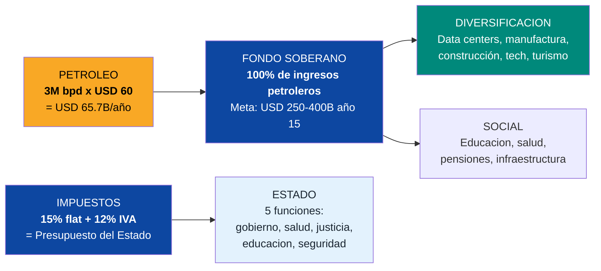
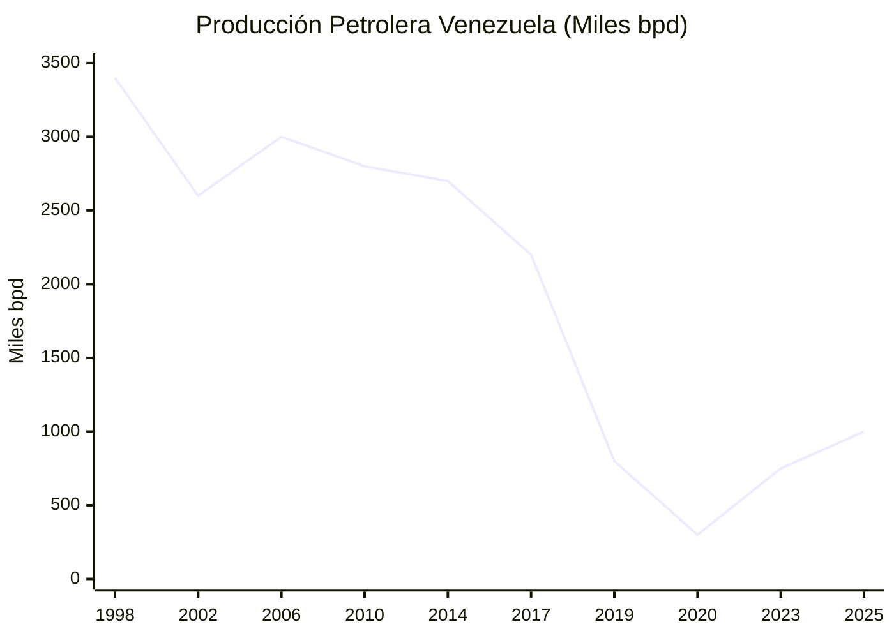
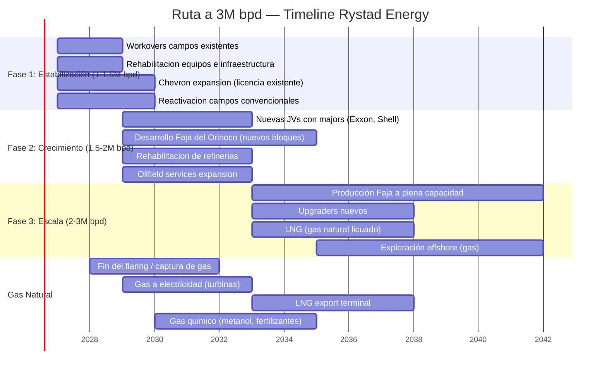
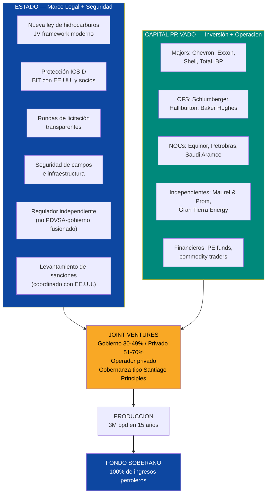
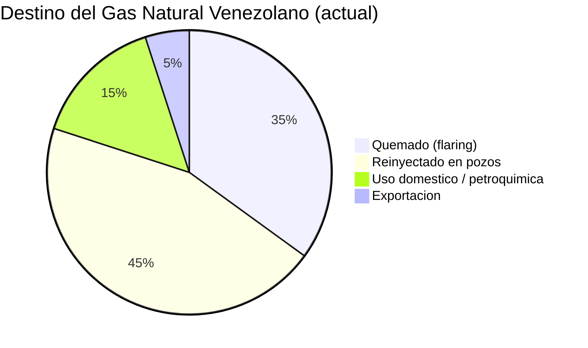
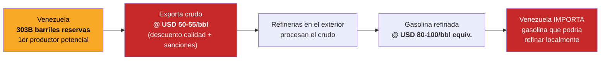
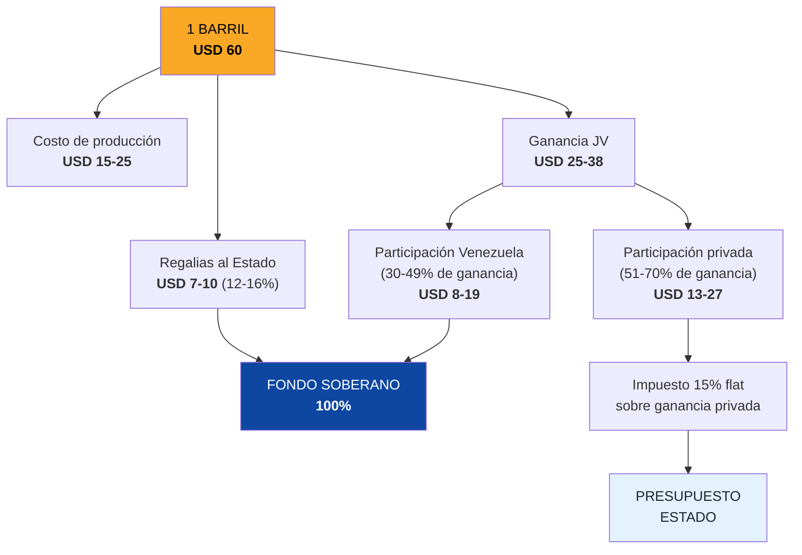
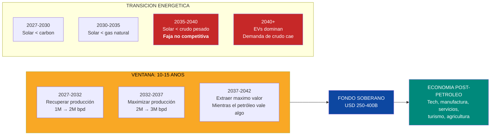
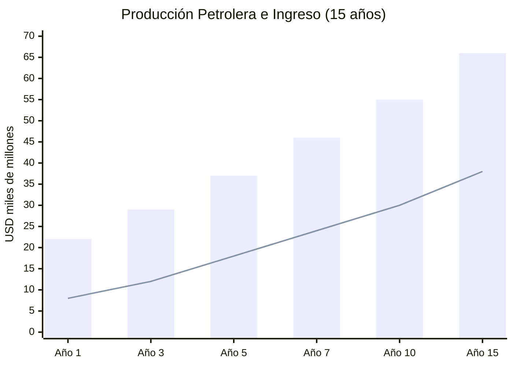

# Petróleo y Gas: El Motor que Enciende Todo lo Demás

> **303.000 millones de barriles.** Las reservas más grandes del planeta. Y Venezuela apenas produce **~1 millón de barriles por día** — una fracción de lo que producía en los 90s. El petróleo no es el destino de Venezuela. Es el **combustible**. Cada barril extraído financia viviendas, hospitales, data centers, educación y diversificación. Pero es un activo **depreciante**: para 2040, la energía solar será más barata que extraer crudo de la Faja del Orinoco. La ventana real es **10-15 años, no 30**. Hay que quemarlo rápido, inteligentemente, y con cada dólar yendo al Fondo de Inversión Venezuela S.A. y a la diversificación.

---

## 1. La Oportunidad: USD 60-80B/Año a 3M bpd

| Dato | Cifra | Fuente |
|------|-------|--------|
| Reservas probadas | **303.000 M barriles** (1ero mundial) | [OPEP ASB 2025](https://www.opec.org/assets/assetdb/asb-2025.pdf) |
| Reservas conservadoras (viables) | **100.000-110.000 M barriles** | [Monaldi, Rice University](https://finance.yahoo.com/news/venezuela-says-it-has-the-worlds-largest-reserves-of-crude-oil-making-it-viable-is-a-whole-other-problem-181512098.html) |
| Producción actual | **~0,9-1,1 M bpd** | [OPEP/IEA 2025](https://www.opec.org/) |
| Producción historica maxima | **3,4 M bpd** (1998) | [EIA](https://www.eia.gov/) |
| Meta: 3M bpd | **15 años** (Rystad Energy) | [Rystad, ene. 2026](https://www.rigzone.com/news/could_venezuela_production_get_back_to_3mm_barrels_per_day-08-jan-2026-182716-article/) |
| Inversión requerida para 3M bpd | **USD 183.000 M** | [Rystad Energy](https://www.rigzone.com/news/could_venezuela_production_get_back_to_3mm_barrels_per_day-08-jan-2026-182716-article/) |
| Precio base | **USD 60/barril** | [EIA STEO, mar. 2026](https://www.eia.gov/outlooks/steo/) |
| Ingreso bruto a 3M bpd @ USD 60 | **USD 65.700 M/ano** | Calculo: 3M x 365 x 60 |
| Ingreso bruto @ USD 80 | **USD 87.600 M/ano** | Upside al Fondo de Inversión Venezuela S.A. |
| Gas natural (reservas) | **5.500 BCM** (7mo mundial) | [U.S. CRS](https://www.congress.gov/crs-product/IF12448) |
| Gas natural (producción actual) | Mayormente quemado/venteado | [Columbia CGEP](https://www.energypolicy.columbia.edu/more-efficient-use-of-venezuelas-natural-gas-could-strengthen-the-regions-energy-security-and-the-countrys-electricity-sector/) |

:::danger Principio inviolable: petróleo es combustible, no destino
Cada dólar de ingreso petrolero va al **Fondo de Inversión Venezuela S.A.**, administrado por **Venezuela S.A.** (el holding de 40M ciudadaños-accionistas) — no por el Estado. El Estado vive de impuestos (15% flat + 12% IVA), no de petróleo. Venezuela S.A. cobra regalias, administra el fondo, y distribuye dividendos. Esto no es idealismo — es la única forma de evitar la Dutch Disease que destruyo a Venezuela la primera vez. Ver [Enfermedad Holandesa](/02-motor-financiero/enfermedad-holandesa) y [Fondo de Inversión Venezuela S.A.](/02-motor-financiero/fondo-soberano).
:::

### La ecuación simple

**Traducción:** El petróleo no paga al gobierno. El petróleo paga al Fondo de Inversión Venezuela S.A. administrado por Venezuela S.A., que invierte en el futuro. El Estado se paga con impuestos de la economia productiva. Así funciona Noruega. Así debe funcionar Venezuela.

### Contexto Marzo 2026: Crisis del Estrecho de Ormuz

:::danger El mayor shock de oferta desde los años 70
El 28 de febrero de 2026, EE.UU. e Israel ejecutaron un ataque coordinado contra Irán, eliminando a Khamenei y destruyendo infraestructura nuclear. Irán cerró el Estrecho de Ormuz en represalia — **20 millones de barriles diarios** de tránsito petrolero interrumpidos. Brent saltó a **USD 120/barril**. En cuestión de días, Venezuela pasó de paria energético a **socio crítico de seguridad energética de EE.UU.**
:::

| Evento | Fecha | Impacto en Venezuela |
|--------|-------|---------------------|
| Ataque a Irán, Khamenei eliminado | 28 feb. 2026 | Estrecho de Ormuz cerrado. 20M bpd interrumpidos |
| Precio del petróleo se dispara | Mar. 2026 | Brent a **USD 120/bbl** vs. base de USD 60 |
| Trump — State of the Union | Mar. 2026 | Llamó a Venezuela *"new friend and partner"* |
| Nuevos contratos petroleros firmados | 4 mar. 2026 | **USD 100.000 M** comprometidos por petroleras de EE.UU. |
| 5 majors autorizadas | Mar. 2026 | Chevron (existente) + **BP + ENI + Shell + Repsol** |
| Meta de producción acelerada | 2026-2028 | Aumento 30-40% en 2026, meta **3M bpd en 24 meses** |
| Control operativo de EE.UU. | 9 mar. 2026 | EE.UU. controla la comercialización del petróleo venezolano |

*Fuentes: [Requiere investigación]*

:::caution Precio base se mantiene en USD 60 — los USD 120 actuales son upside
Este plan **NO depende de precios altos**. El precio base sigue siendo **USD 60/barril**. Todo por encima de USD 60 va íntegramente al Fondo de Inversión Venezuela S.A. como upside. Si el Brent se mantiene en USD 120, el Fondo de Inversión Venezuela S.A. acumula el doble de rápido — pero el plan funciona igual a USD 60. La disciplina fiscal no se negocia ni en crisis.
:::

---

## 2. El Estado Actual: Radiografía de un Colapso Petrolero

:::danger De 3,4M bpd a 0,3M bpd — y de vuelta a 1M
PDVSA producía **3,4 millones de barriles diarios** en 1998. Para 2020, había caído a **0,3M bpd** — el nivel más bajo desde los años 40. Con licencias OFAC (especialmente Chevron) y algo de recuperación, ha subido a **~1M bpd**. Pero eso es con infraestructura degradada, sin inversión, sin personal calificado y con sanciones activas. El camino a 3M bpd requiere **USD 183.000 M y 15 años**.
:::

### Por qué colapsó

| Factor | Impacto | Detalle |
|--------|---------|---------|
| **Expropiación de JVs (2007)** | Crítico | Chávez forzó a ExxonMobil, ConocoPhillips, Total y otros a ceder mayoría a PDVSA. Los que no aceptaron fueron expropiados. Éxodo de capital y expertise |
| **Politización de PDVSA** | Crítico | De 40.000 empleados técnico-profesionales a organización política. Despido masivo en huelga 2002-2003 (18.000 empleados). Directivos sin experiencia petrolera |
| **Sanciones EE.UU. (2017-presente)** | Alto | OFAC restringe transacciones, exportaciones, equipos. Limita acceso a mercados y financiamiento |
| **Cero inversión en mantenimiento** | Alto | USD 0 en overhaul de refinerías. Equipos de los 80s sin repuestos. Corrosión masiva |
| **Fuga de talento** | Alto | 30.000+ profesionales petroleros emigraron. Ingenieros venezolanos operan pozos en Guyana, Colombia, EE.UU. |
| **Corrupción** | Alto | USD 28.000 M desviados vía PDVSA según US DOJ. Sobornos sistemáticos en contratos |
| **Deuda** | Alto | PDVSA debe **USD 35-60.000 M** entre bonos, deuda bilateral (China, Rusia) y laudos ICSID |

### Infraestructura petrolera: estado actual

| Infraestructura | Estado | Necesidad |
|----------------|--------|-----------|
| **Campos convencionales** (Zulia, Barinas) | Producción en declive, pozos abandonados | Rehabilitación + workover + perforación nueva |
| **Faja del Orinoco** (crudo extra-pesado) | Única área con potencial de crecimiento masivo | Upgraders, diluyentes, infraestructura |
| **Refinería Amuay** (645K bpd capacidad) | Opera al 10-20% | Rehabilitación integral USD 5-10B |
| **Refinería Cardón** (310K bpd capacidad) | Opera al 15-25% | Rehabilitación integral |
| **Refinería El Palito** (130K bpd capacidad) | Parcialmente operativa | Mantenimiento mayor |
| **Puerto José terminal** | Operativo parcialmente | Upgrade para mayores volúmenes |
| **Oleoductos** | Corrosión, fugas, falta de mantenimiento | Reemplazo de secciones críticas |
| **Sistema de inyección de agua** | Colapsado en campos maduros | Rehabilitación para mantener presión de yacimiento |

:::caution La paradoja absurda
Venezuela tiene las **reservas más grandes del mundo** y **importa gasolina**. Las refinerías que podrían procesar 1,1M bpd de crudo están paralizadas. El país exporta crudo a descuento (USD 10-15/barril menos que Brent por calidad y sanciones) y compra gasolina a precio de mercado. Cada día sin refinerías funcionando se pierden **USD 10-30M** en margen de refinación.
:::

---

## 3. El Plan: De 1M a 3M bpd en 15 Años

### Timeline Rystad Energy

:::info Escenario acelerado post-crisis Ormuz
Con **5 majors autorizadas** (Chevron + BP + ENI + Shell + Repsol) y **USD 100.000 M comprometidos**, el timeline Rystad de 15 años podría comprimirse a **8-10 años**. La crisis de Ormuz proveyó los dos ingredientes que faltaban: **voluntad política** (EE.UU. necesita el petróleo venezolano) y **compromiso de inversión** (las majors tienen contratos firmados). Sin embargo, el precio base se mantiene en **USD 60/barril** — el plan no depende de precios altos. Los USD 120 actuales son upside, no base.
:::

### Producción proyectada

| Ano | Producción (M bpd) | Ingreso bruto (@ USD 60) | Ingreso al Fondo de Inversión Venezuela S.A. | Inversión anual | Fuente principal |
|-----|---------------------|--------------------------|--------------------------|-----------------|------------------|
| **1** | 1.0 | USD 21.900 M | USD 15-18.000 M | USD 8-10.000 M | Campos existentes |
| **3** | 1.3 | USD 28.500 M | USD 20-23.000 M | USD 12-15.000 M | + Workovers + nuevas JVs |
| **5** | 1.7 | USD 37.200 M | USD 28-32.000 M | USD 15-18.000 M | + Faja del Orinoco |
| **7** | 2.1 | USD 46.000 M | USD 35-40.000 M | USD 14-16.000 M | + Expansion Faja |
| **10** | 2.5 | USD 54.800 M | USD 42-48.000 M | USD 12-14.000 M | + Nuevos bloques |
| **15** | 3.0 | USD 65.700 M | USD 50-58.000 M | USD 8-10.000 M | Capacidad plena |

:::caution Supuestos conservadores
- Precio base **USD 60/barril** constante (todo por encima va al Fondo de Inversión Venezuela S.A. como upside)
- Costo de producción: USD 15-25/barril en convencional, USD 25-35/barril en Faja (incluye upgrading)
- Descuento por calidad y transporte: USD 5-10/barril vs. Brent
- No asume levantamiento total de sanciones hasta ano 3-5
- Inversión total 15 años: **USD 183.000 M** (Rystad Energy)
:::

---

## 4. Segmentos de Inversión

### 4.1 Upstream: producción de crudo y gas

| Segmento | Inversión est. | Producción meta | Operadores potenciales |
|----------|---------------|----------------|------------------------|
| **Campos convencionales (Zulia, Barinas, Monagas)** | USD 20-30.000 M | 500K-700K bpd | Chevron (ya opera), Repsol, ENI |
| **Faja del Orinoco (extra-pesado)** | USD 80-100.000 M | 1.5-2M bpd | ExxonMobil, Shell, TotalEnergies, Chevron, CNPC |
| **Gas natural (asociado y libre)** | USD 15-25.000 M | 5-8 BCF/dia | Shell, BP, Trinidad model |
| **Offshore gas (Plataforma Deltana)** | USD 10-15.000 M | 2-3 BCF/dia (fase madura) | Shell, BP, Equinor |
| **EOR (Enhanced Oil Recovery)** | USD 10-15.000 M | +200-400K bpd adicionales | Schlumberger, Halliburton |
| **TOTAL UPSTREAM** | **USD 135-185.000 M** | **3M bpd crudo + 8-10 BCF/dia gas** | |

### 4.2 Midstream: transporte y procesamiento

| Segmento | Inversión est. | Que resuelve |
|----------|---------------|-------------|
| **Oleoductos** (rehabilitación + nuevos) | USD 5-10.000 M | Transporte de crudo desde Faja a puertos |
| **Upgraders** (crudo pesado → liviano) | USD 10-15.000 M | Faja produce crudo de 8-10 API; necesita upgrading a 32+ API para exportar |
| **Gas pipeline network** | USD 3-5.000 M | Distribucion de gas a electricidad, petroquimica, industria |
| **LNG terminal** (exportación) | USD 5-8.000 M | Monetizar gas via exportación de LNG |
| **Almacenamiento** (tanques, cavernas) | USD 2-3.000 M | Buffer para exportaciones y refinación |
| **TOTAL MIDSTREAM** | **USD 25-41.000 M** | |

### 4.3 Downstream: refinación y productos

| Refineria | Capacidad | Estado actual | Inversión rehabilitación | Meta |
|-----------|-----------|-------------|-------------------------|------|
| **Amuay** | 645K bpd | 10-20% operativo | USD 5-8.000 M | 80%+ operativo |
| **Cardon** | 310K bpd | 15-25% operativo | USD 3-5.000 M | 80%+ operativo |
| **El Palito** | 130K bpd | Parcial | USD 1-2.000 M | 90%+ operativo |
| **Puerto La Cruz** | 200K bpd | Parcial | USD 2-3.000 M | 80%+ operativo |
| **TOTAL REFINERIAS** | **1.285K bpd** | | **USD 11-18.000 M** | **Autosuficiencia en gasolina + exportación de productos refinados** |

:::tip Dejar de importar gasolina = USD 3-5B/ano de ahorro
Venezuela gasta **USD 3-5.000 M/ano importando gasolina y diesel** mientras sus refinerias estan paradas. Rehabilitar Amuay y Cardon no solo elimina esa importación — genera **USD 5-10.000 M/ano en exportación de productos refinados** (gasolina, diesel, jet fuel, asfalto). El margen de refinación (crack spread) promedio es USD 15-25/barril. Con 1M bpd de capacidad de refinación operativa, eso son **USD 5.500-9.100 M/ano** en valor agregado.
:::

### 4.4 Oilfield services: el ecosistema de soporte

| Servicio | Empresas globales | Inversión en Venezuela | Empleos |
|----------|------------------|------------------------|---------|
| **Perforacion** | Schlumberger, Halliburton, Baker Hughes | USD 5-10.000 M | 20.000-40.000 |
| **Completacion y workover** | Schlumberger, Halliburton, Weatherford | USD 3-5.000 M | 10.000-20.000 |
| **Geoservices** | CGG, PGS, ION | USD 1-2.000 M | 2.000-5.000 |
| **Ingenieria y construcción** | Technip, Saipem, McDermott | USD 5-8.000 M | 15.000-30.000 |
| **Logistica y transporte** | Tidewater, SEACOR, helicopteros | USD 2-3.000 M | 5.000-10.000 |
| **TOTAL OFS** | | **USD 16-28.000 M** | **52.000-105.000** |

---

## 5. Que Provee el Estado vs. Capital Privado

### Nueva ley de hidrocarburos: lo que debe cambiar

| Aspecto | Ley actual (2001) | Ley propuesta | Modelo de referencia |
|---------|------------------|---------------|---------------------|
| **Participación estatal** | PDVSA 60% minimo en upstream | **Gobierno 30-49%, privado 51-70%** | Colombia (Ecopetrol 49-51%), Noruega (Equinor cotiza en bolsa) |
| **Operador** | PDVSA opera (o se supone) | **Operador privado con experiencia** | Guyana (ExxonMobil opera Stabroek) |
| **Fiscalidad** | Regalias + impuestos + "contribuciones" opacas | **Regalias 12-16% + 15% flat tax. Transparente** | Noruega (78% tax pero predecible y estable) |
| **Arbitraje** | Venezuela se salió de ICSID en 2012 | **Reingreso a ICSID. Clausula de arbitraje obligatoria** | Estandar internacional |
| **Contratos** | Modificados unilateralmente (2007) | **Estabilidad contractual garantizada por BIT** | Guyana/Colombia |
| **Regulador** | PDVSA es regulador, operador y recaudador | **Regulador independiente separado de PDVSA** | Noruega: Ministerio + Regulador + Equinor separados |
| **Transparencia** | Cero | **EITI obligatorio. Auditorias Big 4. Publicacion de contratos** | Noruega, Timor-Leste |

---

## 6. Gas Natural: La Oportunidad Ignorada

### Venezuela tiene gas — y lo quema

| Dato | Cifra | Fuente |
|------|-------|--------|
| Reservas de gas | **5.500 BCM** (200 TCF) — 7mo mundial | [U.S. CRS](https://www.congress.gov/crs-product/IF12448) |
| Producción actual | ~2.5 BCF/dia (mayormente reinyectado o quemado) | [Columbia CGEP](https://www.energypolicy.columbia.edu/more-efficient-use-of-venezuelas-natural-gas-could-strengthen-the-regions-energy-security-and-the-countrys-electricity-sector/) |
| Gas quemado (flaring) | ~30-40% de producción | [Requiere investigacion] |
| Gas reinyectado | ~40-50% | Para mantener presion en pozos petroleros |
| Gas disponible para uso | ~10-20% | Domestico + petroquimica minima |

### Oportunidades de monetización del gas

| Uso | Volumen potencial | Inversión | Ingreso anual est. | Timeline |
|-----|-------------------|-----------|---------------------|----------|
| **Electricidad** (turbinas de gas) | 2-3 BCF/dia | USD 2-4.000 M | Incluido en sector electrico | Ano 2-5 |
| **LNG export** (liquefaccion + terminal) | 2-4 BCF/dia | USD 5-10.000 M | USD 3-8.000 M | Ano 5-10 |
| **Petroquimica** (metanol, fertilizantes, olefinas) | 1-2 BCF/dia | USD 2-5.000 M | USD 2-4.000 M | Ano 3-7 |
| **GTL** (gas-to-liquids) | 0.5-1 BCF/dia | USD 3-5.000 M | USD 1-2.000 M | Ano 5-10 |
| **Gas domestico / GNV** | 0.5-1 BCF/dia | USD 1-2.000 M | Sustitucion de importaciones | Ano 2-5 |
| **TOTAL** | **6-11 BCF/dia** | **USD 13-26.000 M** | **USD 6-14.000 M** | |

:::info Modelo Trinidad y Tobago: de gas a LNG a prosperidad
Trinidad y Tobago, con **reservas de gas 30x menores que Venezuela**, construyo un sector de LNG que genera **USD 5-8.000 M/ano** y represento el 30% del PIB. Tiene 4 trenes de LNG operados por Atlantic LNG (Shell, BP). Venezuela tiene 30x mas gas y la misma proximidad a mercados del Caribe y EE.UU. Un solo tren de LNG (1-2 BCF/dia) genera **USD 2-4.000 M/ano**.
:::

### Exploración offshore: Plataforma Deltana

| Dato | Detalle | Fuente |
|------|---------|--------|
| **Ubicacion** | Offshore noreste, compartida con Trinidad | [Requiere investigacion] |
| **Reservas estimadas** | 30-40 TCF (no verificado independientemente) | [Requiere investigacion] |
| **Bloques** | 5 bloques asignados (Chevron, ENI, Repsol, otros) | [Requiere investigacion] |
| **Estado** | Paralizada por sanciones y falta de inversión | — |
| **Potencial** | Si las reservas se confirman, sería otro hub de LNG | — |
| **Modelo** | Cross-border con Trinidad (modelo Unitization Agreement) | Australia-Timor Leste (Greater Sunrise) |

---

## 7. Refinerias: Dejar de Importar Gasolina

### El absurdo actual

**Traducción:** Es como tener la granja de trigo mas grande del mundo e importar pan. Cada dia sin refinerias operativas, Venezuela pierde **USD 10-30M** en margen de refinación.

### Plan de rehabilitación de refinerias

| Refineria | Capacidad | Meta operativa | Inversión | Timeline | Productos |
|-----------|-----------|----------------|-----------|----------|-----------|
| **Amuay** (Falcon) | 645K bpd | 500K bpd (80%) | USD 5-8B | Ano 2-5 | Gasolina, diesel, jet fuel |
| **Cardon** (Falcon) | 310K bpd | 250K bpd (80%) | USD 3-5B | Ano 2-5 | Gasolina, diesel, asfalto |
| **El Palito** (Carabobo) | 130K bpd | 115K bpd (90%) | USD 1-2B | Ano 1-3 | Gasolina, diesel |
| **Puerto La Cruz** (Anzoategui) | 200K bpd | 160K bpd (80%) | USD 2-3B | Ano 2-4 | Diesel, fuel oil, lubricantes |
| **TOTAL** | **1.285K bpd** | **1.025K bpd** | **USD 11-18B** | **5 años** | |

**Resultado:** Autosuficiencia en gasolina (elimina USD 3-5B/ano de importación) + exportación de productos refinados (USD 5-10B/ano adicionales).

---

## 8. Aliados Potenciales

| Empresa | País | Sector | Status en Venezuela | Rol potencial |
|---------|------|--------|---------------------|---------------|
| **Chevron** | EE.UU. | Major integrada | **Ya opera** con licencia OFAC. Produce ~200K bpd en JVs. Autorizada ampliación post-crisis Ormuz (mar. 2026) | Expansion de producción, modelo para otros majors |
| **ExxonMobil** | EE.UU. | Major integrada | Salio en 2007 (expropiacion). Laudo ICSID por USD 1.600 M | Reentrada en Faja del Orinoco. Condicion: compensacion + nueva ley |
| **Shell** | Países Bajos | Major integrada | **Autorizada operaciones mar. 2026** — post-crisis Ormuz. Gas offshore | Gas natural, LNG, refinación |
| **TotalEnergies** | Francia | Major integrada | Opero en Faja (Petrocedeño). Acepto condiciones de Chavez | Reexpansion en Faja + gas |
| **BP** | UK | Major integrada | **Autorizada operaciones mar. 2026** — post-crisis Ormuz | Gas natural, LNG (experiencia Trinidad) |
| **Equinor** | Noruega | NOC (cotiza en bolsa) | — | Modelo Noruega: empresa del holding ciudadano, eficiente y transparente. En Venezuela, PDVSA se transforma en filial de Venezuela S.A. |
| **Repsol** | España | Major | **Autorizada operaciones mar. 2026** — post-crisis Ormuz | Reexpansion, gas offshore |
| **ENI** | Italia | Major | **Autorizada operaciones mar. 2026** — post-crisis Ormuz. Gas offshore | Gas offshore (Plataforma Deltana) |
| **Schlumberger** | EE.UU./global | Oilfield services | Presencia reducida | El mayor proveedor OFS del mundo. Esencial para perforacion |
| **Halliburton** | EE.UU. | Oilfield services | Presencia minima | Completacion, fracturamiento, cementacion |
| **Baker Hughes** | EE.UU. | Oilfield services | — | Equipos, servicios de completacion, LNG (tecnologia) |
| **Technip Energies** | Francia | Ingenieria | — | EPC para upgraders, refinerias, LNG |
| **CNPC / Sinopec** | China | NOCs | Presente en JVs (aunque deuda impaga) | Financiamiento via deuda-por-petróleo. Riesgo geopolitico |
| **Petrobras** | Brasil | NOC | — | Know-how en pre-sal y crudo pesado. Aliado regional |

:::caution Chevron: el precedente que importa
Chevron obtuvo licencia OFAC en noviembre 2022 y ha expandido operaciones a ~200K bpd. Esto demuestra que **empresas estadounidenses pueden operar en Venezuela bajo el regimen de sanciones actual** — con licencia especifica. Para los demas majors, Chevron es el caso de prueba. Si Chevron tiene exito, los demas seguiran. Ver [Roadmap de Sanciones](/04-gobernanza/roadmap-sanciones).
:::

---

## 9. Estructura de JV: No Repetir los Errores del Pasado

### Lo que salió mal (2007)

| Lo que hizo Chavez | Resultado |
|--------------------|-----------|
| Forzo 60% participación PDVSA en todas las JVs | Operadores perdieron control operativo |
| Expropio a quien no acepto (Exxon, Conoco) | Capital huyo. Laudos ICSID por USD 10.000+ M |
| PDVSA como operador (sin capacidad) | Producción colapso de 3.4M a 0.7M bpd |
| Contratos modificados unilateralmente | Riesgo juridico = cero inversión nueva |
| Cero transparencia | Corrupcion sistematica |

### Lo que debe hacerse (modelo propuesto)

| Parámetro | Modelo propuesto | Referencia |
|-----------|-----------------|-----------|
| **Participación** | Venezuela 30-49% / Operador privado 51-70% | Colombia: Ecopetrol 49% en JVs |
| **Operador** | Siempre el socio privado (con experiencia) | Guyana: ExxonMobil opera |
| **Regalias** | 12-16% del ingreso bruto (variable por campo) | Colombia: 8-25% variable |
| **Impuesto** | 15% flat (consistente con reforma fiscal) | Noruega: 78% pero predecible |
| **Arbitraje** | ICSID obligatorio. Sede neutral (Paris, La Haya) | Estandar internacional |
| **Estabilidad** | Clausula de estabilización fiscal por 20 años | Guyana: fiscal stability clause |
| **Transparencia** | EITI, auditorias Big 4, publicacion de contratos | Noruega: modelo de transparencia |
| **Ring-fencing** | Cada JV es entidad legal separada (SPV) | Estandar en oil & gas |
| **Gobernanza** | Santiago Principles para ingresos soberanos | Fondo de Inversión Venezuela S.A. Noruego |

---

## 10. Modelo Economico del Petroleo

### Destino de cada barril

### Ingreso para el Fondo de Inversión Venezuela S.A. (proyección 15 años)

| Ano | Producción (M bpd) | Ingreso bruto (@ USD 60) | Al Fondo de Inversión Venezuela S.A. | Fondo acumulado |
|-----|---------------------|--------------------------|-------------------|-----------------|
| 1 | 1.0 | USD 21.900 M | USD 8.000 M | USD 8.000 M |
| 3 | 1.3 | USD 28.500 M | USD 12.000 M | USD 32.000 M |
| 5 | 1.7 | USD 37.200 M | USD 18.000 M | USD 68.000 M |
| 7 | 2.1 | USD 46.000 M | USD 24.000 M | USD 116.000 M |
| 10 | 2.5 | USD 54.800 M | USD 30.000 M | USD 200.000 M |
| 15 | 3.0 | USD 65.700 M | USD 38.000 M | **USD 350.000 M** |

:::info Meta del Fondo de Inversión Venezuela S.A.: USD 250-400B en el ano 15
Con ingresos petroleros + mineros + retorno de inversiones, el Fondo de Inversión Venezuela S.A. puede alcanzar **USD 250-400.000 M** en 15 años. Noruega acumuló **USD 2,2 trillones** en 30 años — [NBIM](https://www.nbim.no/en/investments/the-funds-value/). Venezuela tiene reservas 4x mayores. La diferencia será gobernanza. Ver [Fondo de Inversión Venezuela S.A.](/02-motor-financiero/fondo-soberano).
:::

---

## 11. Activo Depreciante: La Ventana se Cierra

:::danger Para 2040, el petróleo puede valer cero como negocio
La energia solar ya es mas barata que el carbon. Para 2035-2040, serámas barata que **extraer crudo de la Faja del Orinoco** (costo de producción USD 25-35/barril). Los vehiculos electricos eliminaran **40%+ de la demanda de gasolina**. Europa prohibe motores de combustion en 2035. China tiene 50%+ de ventas de EVs.

**Cada decision petrolera debe asumir que el petróleo puede valer cero en 2040-2050.** No se vuela al espacio con fosil. Se quema para salir de la atmosfera — rapido, eficiente, y con cada dólar invertido en el futuro post-petróleo.
:::

### La carrera contra el reloj

| Factor | Hoy | 2030 | 2035 | 2040 |
|--------|-----|------|------|------|
| Costo solar (LCOE) | USD 30-40/MWh | USD 20-25/MWh | **USD 15-20/MWh** | USD 10-15/MWh |
| Costo extraccion Faja | USD 25-35/bbl | USD 25-35/bbl | USD 25-35/bbl | USD 25-35/bbl |
| EVs como % de ventas nuevas | 20% | 35% | **50%+** | 70%+ |
| Demanda global de crudo | ~100M bpd | ~100M bpd | ~90-95M bpd | **~80-85M bpd** |

Fuentes: [IRENA — Renewable Cost Trends](https://www.irena.org/); [IEA — World Energy Outlook](https://www.iea.org/reports/world-energy-outlook-2025); [BloombergNEF — EV Outlook](https://about.bnef.com/electric-vehicle-outlook/).

---

## 12. Comparables Internacionales

| País | Modelo | Producción | Que funciono | Lección para Venezuela |
|------|--------|-----------|-------------|------------------------|
| **Noruega** | Equinor (antes Statoil): NOC que cotiza en bolsa. 67% propiedad estatal. Fondo de Inversión Venezuela S.A. de USD 2.2T | 2M bpd | Separación absoluta: Ministerio regula, Equinor opera, Fondo de Inversión Venezuela S.A. invierte. Transparencia radical. EITI desde el dia 1 | **El modelo a seguir.** Petroleo financia el fondo, el fondo invierte en el futuro. El Estado no gasta petróleo — lo ahorra |
| **Guyana** | ExxonMobil opera Stabroek block. Producción de 0 a 650K bpd en 5 años | 650K bpd (2025) | Marco fiscal estable. Operador privado con experiencia. Fondo de Inversión Venezuela S.A. nuevo (Natural Resource Fund) | **Velocidad.** Si el marco legal es correcto, la producción puede escalar rapidamente. Guyana paso de 0 a 650K bpd en 5 años |
| **Colombia** | Ecopetrol: NOC que cotiza en bolsa. ANH como regulador independiente. 49-51% en JVs | 0.8M bpd | Regulador separado de operador. Rondas de licitación transparentes. Arbitraje internacional. Estabilidad juridica | **Marco institucional.** La ANH licita bloques transparentemente. El regulador no es el operador. Colombia tiene 1/30 de las reservas de Venezuela y atrae mas inversión |
| **Arabia Saudita** | Aramco IPO (2019). USD 2T valuacion. Producción 9-12M bpd | 10M bpd | Profesionalizacion. Transparencia (requisito para IPO). Inversión en diversificacion (NEOM, Vision 2030) | **Escala + diversificacion.** Aramco demostro que una NOC puede ser la empresa mas valiosa del mundo si se gestiona bien. Y Arabia Saudita ya esta diversificando agresivamente |
| **Brasil (pre-sal)** | Petrobras como operador unico de pre-sal. Cambio a JVs con competencia | 3.5M bpd (2025) | Pre-sal fue descubierto en 2006. Para 2025, Brasil produce 3.5M bpd. La clave: tecnologia de aguas profundas (Petrobras) + apertura a JVs | **Tecnologia + apertura.** Petrobras invirtio en capacidad tecnica propia Y abrio a competencia. Venezuela necesita ambas cosas |

---

## 13. Riesgos y Mitigaciónes

| Riesgo | Probabilidad | Impacto | Mitigación |
|--------|-------------|---------|-----------|
| **Sanciones no se levantan** | Media | Critico | Modelo Chevron: licencias OFAC individuales. Majors europeas (Shell, Total, ENI) menos expuestas. Negociacion diplomatica via minerales criticos como palanca |
| **Precio del petróleo cae por debajo de USD 40** | Media-baja | Alto | Precio base USD 60 es conservador. A USD 40, campos convencionales siguen rentables. Faja necesita >USD 30. Fondo de Inversión Venezuela S.A. absorbe volatilidad |
| **Transicion energetica acelera** (EVs, solar) | Media-alta | Alto | Exactamente por eso el Fondo de Inversión Venezuela S.A. recibe 100% de ingresos. Cada ano ganado es diversificacion financiada. La ventana es 10-15 años, no 30 |
| **Expropiacion / cambio de gobierno** | Media | Critico | Ley anti-expropiacion constitucional. ICSID. BIT. JVs con protección contractual. SPV offshore |
| **PDVSA no es reformable** | Alta | Alto | Crear entidad nueva (Venezuela Energy Corp o similar) separada de PDVSA. PDVSA puede ser liquidada gradualmente |
| **Deuda de PDVSA** (USD 35-60B) impide inversión | Alta | Alto | Reestructuración de deuda como prerequisito. Haircut 50-70%. Bonos Brady model. Ver [Deuda](/02-motor-financiero/deuda) |
| **China bloquea reestructuración** | Media | Alto | Negociacion bilateral. Deuda-por-minerales. Acceso a reservas de gas como incentivo |
| **Contaminacion ambiental masiva** | Alta | Alto | Remediacion ambiental obligatoria (USD 2-5B). ESG como condicion de JV. Certificacion ambiental internacional |
| **No se consigue talento petrolero** | Media-alta | Alto | Repatriación de 30K+ profesionales petroleros. Salarios competitivos. Training con majors. Universidades petroleras |
| **Hormuz reabre, petróleo cae a USD 70-80, urgencia se disipa** | Media | Alto | Pipeline de USD 100.000 M ya comprometido; contratos tienen cláusulas de estabilidad. La inversión ya está en marcha independientemente del precio |
| **EE.UU. se excede en control de comercialización petrolera** | Alta | Crítico | Negociar transferencia gradual de control a Venezuela S.A. como administrador del Fondo de Inversión Venezuela S.A.. Definir timeline de transición en contratos |
| **Irán — retaliación asimétrica (proxies en LATAM, cyber)** | Media-Baja | Medio | Alianza de seguridad con EE.UU. cubre este riesgo. Venezuela no es objetivo directo — es beneficiario indirecto de la crisis |

---

## 14. Proyección Financiera Consolidada

*Barras: ingreso bruto. Línea: contribucion al Fondo de Inversión Venezuela S.A..*

### Resumen ejecutivo

| Parámetro | Valor |
|-----------|-------|
| **Reservas** | 303.000 M barriles (100-110B viables) |
| **Producción meta** | 3M bpd en 15 años |
| **Inversión total** | USD 183.000 M (Rystad Energy) |
| **Ingreso bruto ano 15** | USD 65.700 M/ano (@ USD 60/bbl) |
| **Fondo de Inversión Venezuela S.A. ano 15** | USD 250-400.000 M acumulado |
| **Empleos directos** | 150.000-250.000 |
| **Empleos totales (dir. + ind.)** | 500.000-800.000 |
| **Gas natural** | 5.500 BCM adicionales (LNG + petroquimica + electricidad) |
| **Refinerias** | 1M+ bpd rehabilitadas = fin de importación de gasolina |
| **Riesgo existencial** | Activo depreciante. Ventana 10-15 años. Cada dólar al Fondo de Inversión Venezuela S.A. |

:::tip Este es EL motor que enciende todo lo demas
Sin petróleo no hay forwards que financien la emergencia. Sin forwards no hay estabilización. Sin estabilización no hay inversión. Sin inversión no hay data centers, ni manufactura, ni construcción, ni empleo. **El petróleo es el primer domino.** Pero es un domino que se consume al caer — por eso cada dólar va al Fondo de Inversión Venezuela S.A. y a la diversificacion, no al gasto corriente.
:::

---

## Documentos Relacionados

- [Capacidad Eléctrica](./capacidad-electrica) — La infraestructura eléctrica que necesita la producción petrolera y el procesamiento de gas
- [Minerales Críticos](./minerales-criticos) — Industria pesada que comparte infraestructura logística y energética con petróleo
- [Transporte Marítimo](./transporte-maritimo) — Puertos y terminales para exportación de crudo y derivados
- [Energía Renovable](./energia-renovable) — La transición energética que el petróleo debe financiar
- [Modelo de Concesiones](./modelo-concesiones) — Marco de concesión aplicable a upstream, midstream y downstream

---

## Fuentes

| # | Fuente | Dato utilizado |
|---|--------|---------------|
| 1 | [OPEP ASB 2025](https://www.opec.org/assets/assetdb/asb-2025.pdf) | Reservas 303B barriles |
| 2 | [Rystad Energy, ene. 2026](https://www.rigzone.com/news/could_venezuela_production_get_back_to_3mm_barrels_per_day-08-jan-2026-182716-article/) | USD 183B inversión, 15 años para 3M bpd |
| 3 | [Monaldi, Rice University](https://finance.yahoo.com/news/venezuela-says-it-has-the-worlds-largest-reserves-of-crude-oil-making-it-viable-is-a-whole-other-problem-181512098.html) | Reservas conservadoras 100-110B |
| 4 | [EIA STEO, mar. 2026](https://www.eia.gov/outlooks/steo/) | Precio base USD 60/barril |
| 5 | [U.S. CRS](https://www.congress.gov/crs-product/IF12448) | Gas natural 5.500 BCM |
| 6 | [Columbia CGEP](https://www.energypolicy.columbia.edu/more-efficient-use-of-venezuelas-natural-gas-could-strengthen-the-regions-energy-security-and-the-countrys-electricity-sector/) | Gas natural uso y desperdicio |
| 7 | [Chevron Venezuela](https://www.chevron.com/worldwide/venezuela) | Operaciones con licencia OFAC |
| 8 | [NBIM — Fondo de Inversión Venezuela S.A. Noruega](https://www.nbim.no/en/investments/the-funds-value/) | USD 2.2T acumulados |
| 9 | [IRENA — Renewable Costs](https://www.irena.org/) | Tendencias de costo solar |
| 10 | [IEA — World Energy Outlook](https://www.iea.org/reports/world-energy-outlook-2025) | Transicion energetica |
| 11 | [BloombergNEF — EV Outlook](https://about.bnef.com/electric-vehicle-outlook/) | Adopcion de EVs |
| 12 | [Global Energy Monitor](https://www.gem.wiki/CVG_Ferrominera_Orinoco_DRI_plant) | Infraestructura industrial |
| 13 | [Al Jazeera, sep. 2025](https://www.aljazeera.com/news/2025/9/4/venezuela-has-the-worlds-most-oil-why-doesnt-it-earn-more-from-exports) | Exportaciones y paradoja gasolina |
