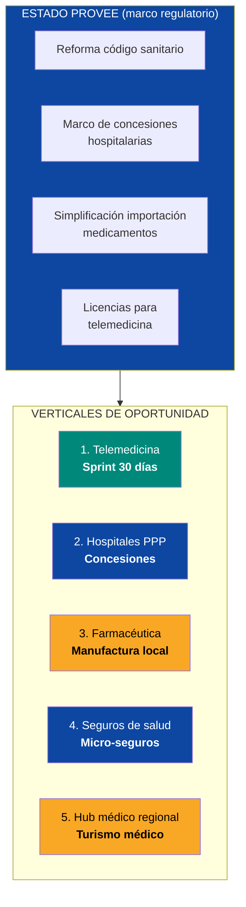
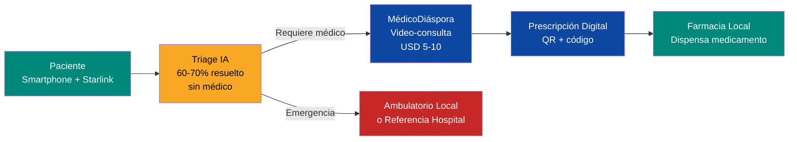
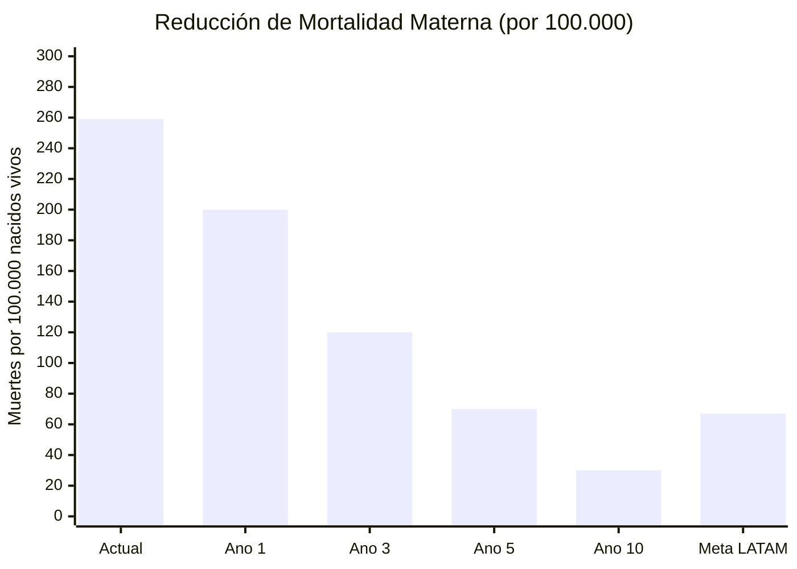

# Salud y Telemedicina: Reconstruir un Sistema de Salud Desde Cero

> El 80% de los hospitales venezolanos están no-funcionales. Más de 30.000 médicos emigraron. El sistema de salud colapsó. Pero eso significa que no hay legacy que defender — se puede construir un sistema híbrido (telemedicina + hospitales concesionados + farmacéutica local) que sea mejor que lo que existía antes. El Estado pone el marco legal. Venezuela S.A. invierte en infraestructura hospitalaria base como accionista en JVs con operadores privados. El capital privado construye y opera. El resultado: cobertura universal en 5 años, no en 30.

---

## 1. La Crisis: Radiografía de un Colapso Sanitario

:::danger Sistema de salud en estado terminal
Venezuela pasó de tener uno de los mejores sistemas de salud de LATAM (años 80-90) a un colapso total. No es una crisis — es una **emergencia humanitaria activa** declarada por la ONU. Mortalidad materna aumentó65%. Mortalidad infantil aumentó30%. Enfermedades erradicadas (malaria, difteria, sarampión) regresaron. No hay medicamentos, no hay equipos, no hay médicos.
:::

| Indicador | Venezuela (actual) | LATAM promedio | País referencia | Fuente |
|-----------|-------------------|----------------|-----------------|--------|
| Mortalidad materna | **259/100.000** nacidos vivos | 67/100.000 | Chile: 13 | [OMS/OPS 2024](https://www.paho.org/) |
| Mortalidad infantil | **25,7/1.000** nacidos vivos | 13,5/1.000 | Chile: 6,1 | [UNICEF 2024](https://www.unicef.org/) |
| Médicos por 10.000 hab. | **~8** (post-emigración) | 22 | Cuba: 84, Uruguay: 51 | [OMS 2024](https://www.who.int/) |
| Camas hospitalarias/1.000 hab. | **~0,8** (funcionales) | 2,1 | Argentina: 5,0 | [OMS 2024](https://www.who.int/) |
| Hospitales funcionales | **~20%** del total | — | — | [HRW 2024](https://www.hrw.org/) |
| Médicos emigrados | **>30.000** | — | — | [Requiere investigación] |
| Gasto en salud % PIB | **~1,5%** | 7,3% | Costa Rica: 7,6% | [Banco Mundial 2024](https://data.worldbank.org/) |
| Gasto en salud per capita | **~USD 25** | USD 550 | Chile: USD 1.300 | [OMS 2024](https://www.who.int/) |
| Acceso a medicamentos esenciales | **<20%** disponibilidad | ~80% | — | [HRW/Provea 2024](https://www.hrw.org/) |

**Traducción:** Un venezolano promedio tiene acceso a USD 25/año en salud. Un chileno tiene USD 1.300. Un venezolano tiene 3x más probabilidad de morir en el parto que el promedio de LATAM. Y hay 3x menos médicos por habitante que el promedio regional.

### Fuga de capital humano médico

| Especialidad | Estimado emigrados | % de la fuerza laboral | Destino principal |
|-------------|-------------------|----------------------|-------------------|
| Medicina general | ~15.000 | ~40% | Colombia, Chile, España |
| Enfermería | ~10.000 | ~35% | Colombia, Perú, Chile |
| Especialistas (cirugía, anestesia, etc.) | ~8.000 | ~50% | EE.UU., España, Chile |
| Bioanalistas / laboratorio | ~5.000 | ~45% | Colombia, Panamá |
| **TOTAL estimado** | **>30.000** | **~40%** | — |

Fuente: estimaciones basadas en [UNHCR 2025](https://www.unhcr.org/), [OPS 2024](https://www.paho.org/), reportes de colegios médicos venezolanos. [Requiere investigación] para cifras exactas actualizadas.

---

## 2. La Oportunidad: USD 10-20B en 10 Años

:::info El mercado de salud digital en LATAM crece al 37,6% anual
El mercado de salud digital en América Latina está creciendo a un **CAGR del 37,6%** (2024-2030), proyectado a alcanzar **USD 26B+ para 2030**. Venezuela está completamente fuera de este mercado. Entrar ahora — con la ventaja de no tener legacy — permite construir un sistema nativo digital desde día 1.
:::

| Dato de mercado | Cifra | Fuente |
|----------------|-------|--------|
| Mercado salud digital LATAM 2024 | **USD 4,5B** | [Grand View Research 2024](https://www.grandviewresearch.com/) |
| CAGR 2024-2030 | **37,6%** | [Grand View Research 2024](https://www.grandviewresearch.com/) |
| Mercado salud digital LATAM 2030 | **USD 26B+** | [Grand View Research 2024](https://www.grandviewresearch.com/) |
| Mercado global telemedicina 2025 | **USD 115B** | [Fortune Business Insights 2025](https://www.fortunebusinessinsights.com/) |
| Mercado global telemedicina 2032 | **USD 380B+** | [Fortune Business Insights 2025](https://www.fortunebusinessinsights.com/) |
| Gasto salud Venezuela potencial (7% PIB) | **USD 5,8B/año** (a PIB de USD 82B) | Cálculo propio basado en promedio LATAM |
| Población sin cobertura adecuada | **~25M personas** (80%+) | [Requiere investigación] |

### Las 5 verticales de oportunidad



---

## 3. Vertical 1: Telemedicina — Salud en 30 DíasVia Starlink

:::tip Sprint de 30 días: telemedicina con lo que ya existe
No hay que construir hospitales para dar atención primaria. Con **Starlink + smartphones + plataforma de telemedicina + médicos de la diáspora**, se puede dar consulta médica básica a millones de venezolanos en **30 días**. No es perfecto. No reemplaza un hospital. Pero un médico venezolano en Madrid puede diagnósticar una infección urinaria por video-llamada y prescribir antibióticos hoy mismo.
:::

| Componente | Detalle |
|------------|---------|
| **Conectividad** | Starlink en 1.000+ centros comunitarios/ambulatorios. ~70% de población con smartphone |
| **Plataforma** | App de telemedicina con triage por IA, video-consulta, prescripción digital, historia clínica electrónica |
| **Médicos** | 30.000+ médicos venezolanos en la diáspora. Horarios flexibles. Pago en USD via fintech |
| **Triage IA** | Chatbot con IA (tipo Babylon Health / Ada Health) para filtrar consultas. 60-70% de consultas de atención primaria se resuelven sin médico |
| **Prescripción** | Receta digital con QR. Farmacia local dispensa. Auditable, no falsificable |
| **Costo por consulta** | USD 3-10 (vs. USD 50-150 presencial en LATAM) |
| **Meta ano 1** | 5M consultas/año = 400K consultas/mes |
| **Meta ano 3** | 20M consultas/año = cobertura primaria para 60%+ de población |

### Como funciona



### Inversores y operadores potenciales

| Empresa | País| Expertise | Rol potencial |
|---------|------|-----------|---------------|
| **Teladoc Health** | EE.UU. | Líderglobal telemedicina. 90M+ miembros. USD 2.6B revenue | Plataforma + operación |
| **Babylon Health** | UK | Triage IA + video-consulta. Opera en Rwanda, UK | Modelo adaptable a mercados emergentes |
| **Ada Health** | Alemania | Motor de triage IA. 15M+ usuarios. Precisiones diagnósticas del 90%+ | Componente IA del triage |
| **Doctor Anytime** | Grecia/LATAM | Telemedicina en mercados emergentes. Opera en LATAM | Operador regional |
| **1Doc3** | Colombia | Telemedicina en LATAM. 10M+ consultas. Opera en Colombia, México | Operador cercano con expertise regional |
| **mDoc** | Nigeria | Telemedicina para mercados africanos. Modelo low-cost | Referencia de modelo low-cost |

---

## 4. Vertical 2: Hospitales PPP — Concesiones Privadas

### El modelo: concesión, no construcción estatal

| Aspecto | Modelo propuesto | Modelo fallido (actual) |
|---------|-----------------|------------------------|
| **Quién construye** | Operador privado internacional | Estado (CORPOELEC/Min. Salud) |
| **Quién opera** | Operador privado con contrato 20-30 años | Estado con personal mal pagado |
| **Quién regula** | Ente regulador autónomo + estándares internacionales | Min. Salud politizado |
| **Financiamiento** | PPP: privado construye, gobierno paga por servicio (capitation) | Presupuesto público (nunca llega) |
| **Estandar** | JCI (Joint Commission International) o equivalente | Ningún estándar aplicado |
| **Rendicion de cuentas** | KPIs medibles + penalidades por incumplimiento | Cero accountability |

### Plan de rehabilitación hospitalaria

| Fase | Hospitales | Tipo | Inversión | Timeline | Operador tipo |
|------|-----------|------|-----------|----------|--------------|
| **Sprint** | 20 hospitales criticos | Rehabilitación de emergencia: quirófanos, UCI, urgencias, generadores | USD 500M-1B | 6-12 meses | Médicos Sin Fronteras + privados |
| **Fase 1** | 50 hospitales | Rehabilitación completa + equipamiento moderno | USD 2-4B | 1-3 años | HCA Healthcare, Rede D'Or, Grupo Keralty |
| **Fase 2** | 100 hospitales | Concesiones PPP de largo plazo (20-30 años) | USD 4-8B | 3-7 años | Cadenas hospitalarias internacionales |
| **Fase 3** | Red completa | 300+ centros de salud + hospitales especializados | USD 5-10B | 5-10 años | Mix de operadores nacionales e internacionales |

### Operadores hospitalarios potenciales

| Empresa | País| Tamaño | Por que participarían |
|---------|------|--------|---------------------|
| **HCA Healthcare** | EE.UU. | 182 hospitales, USD 65B revenue | Mayor cadena hospitalaria del mundo. Expertise en PPPs |
| **Rede D'Or** | Brasil | 70+ hospitales, USD 10B+ revenue | Mayor cadena de LATAM. Opera en mercados emergentes |
| **Grupo Keralty** | Colombia | 15+ hospitales, 8M+ afiliados | Opera en Colombia, México, Perú. Modelo de atención integral |
| **Fresenius Helios** | Alemania | 86 hospitales en Europa | Expertise en mercados con regulación pública |
| **IHH Healthcare** | Malasia | 80+ hospitales, 16 países | Opera en Asia + Turquía. Expertise mercados emergentes |
| **Apollo Hospitals** | India | 70+ hospitales | Modelo de hospital de bajo costo + alta calidad |

### Financiamiento hospitalario

| Fuente | Monto estimado | Mecanismo |
|--------|---------------|-----------|
| **BID / Banco Mundial** | USD 2-4B | Préstamos de desarrollo para salud |
| **DFC (EE.UU.)** | USD 1-3B | Financiamiento de infraestructura de salud |
| **PPP privados** | USD 3-6B | Operadores construyen, gobierno paga por servicio |
| **Fondos de impacto** | USD 500M-1B | Impact investors (salud en emergentes) |
| **GAVI / Global Fund** | USD 200-500M | Vacunación + enfermedades infecciosas |
| **Cooperación bilateral** | USD 500M-1B | Cuba (médicos), China (equipos), España (formación) |
| **TOTAL** | **USD 8-16B** | |

---

## 5. Vertical 3: Farmacéutica — Manufactura Local

:::info Venezuela fabricaba el 40% de sus medicamentos. Ahora fabrica menos del 5%.
La industria farmacéutica venezolana se destruyó por expropiaciones, controles de precios y falta de divisas para materias primas. Pero la infraestructura físicaparcialmente existe, hay personal calificado en la diáspora, y la demanda es urgente. Reconstruir manufactura farmacéutica local reduce costos, asegura abastecimiento y crea empleo calificado.
:::

| Componente | Detalle |
|------------|---------|
| **Demanda** | ~USD 3B/año en medicamentos (estimado a 7% PIB salud) |
| **Producción local actual** | <5% de la demanda |
| **Meta** | 40-50% de producción local en 10 años |
| **Productos** | Genéricos esenciales (OMS lista), antibióticos, antihipertensivos, insulina, vacunas básicas |
| **No producir** | Biológicos complejos, oncológicos avanzados — importar de India/Brasil |
| **Inversión** | USD 500M-1B para 5-10 plantas farmacéuticas |
| **Empleos** | 10.000-20.000 directos |

### Operadores farmacéuticos potenciales

| Empresa | País| Rol | Por que |
|---------|------|-----|---------|
| **Pfizer** | EE.UU. | Manufactura local bajo licencia | Programa de acceso a mercados emergentes |
| **Roche** | Suiza | Manufactura + transferencia tecnológica | Opera plantas en Brasil, México |
| **Cipla** | India | Genéricos de bajo costo | Líderglobal en genéricos asequibles. Modelo exportable |
| **Dr. Reddy's** | India | Genéricos + biosimilares | Opera plantas en múltiples mercados emergentes |
| **EMS** | Brasil | Genéricos LATAM | Mayor farmacéutica de LATAM por volumen. Cercania geografica |
| **Tecnoquimicas** | Colombia | Genéricos + OTC | Opera en region andina. Expertise en mercados similares |

---

## 6. Vertical 4: Micro-Seguros de Salud

| Componente | Detalle |
|------------|---------|
| **Problema** | <2% de la población tiene seguro médico. Cualquier emergencia es catastrófica |
| **Producto** | Micro-seguro digital: USD 5-15/mes. Cubre emergencias, consultas, medicamentos básicos |
| **Distribución** | Via apps fintech (Nubank, Mercado Pago). Cross-sell con cuenta bancaria |
| **Revenue (ano 5)** | USD 200-500M/año en primas (a 5M asegurados x USD 100/año promedio) |
| **Operadores** | BIMA (40M+ clientes en emergentes), Lemonade, aseguradoras locales revividas |
| **Referencia** | Kenya: M-TIBA (seguro via M-Pesa) tiene 4M+ beneficiarios |

---

## 7. Vertical 5: Hub MédicoRegional (Fase 3)

| Componente | Detalle |
|------------|---------|
| **Concepto** | Venezuela como destino de turismo médico para el Caribe y Centroamérica |
| **Timeline** | Año5-10 (después de rehabilitar hospitales) |
| **Especializaciones** | Cirugía plástica, odontología, oftalmología, ortopedia — procedimientos de alto volumen |
| **Ventaja** | Costos 50-70% menores que EE.UU. Proximidad al Caribe. Médicos hispanohablantes |
| **Revenue** | USD 500M-1B/año (a 100K+ pacientes internacionales/año) |
| **Referencia** | Colombia: USD 1,5B/año en turismo médico. Costa Rica: USD 500M/año. India: USD 9B/año |
| **Prerequisito** | Hospitales con acreditación JCI, aeropuertos funcionales, seguridad |

---

## 8. Lo Que el Estado Provee (y Lo Que Venezuela S.A. Invierte)

| El Estado financia y supervisa (regula) | Detalle | Referencia |
|-------------------|---------|-----------|
| **Reforma del código sanitario** | Marco legal para telemedicina, prescripción digital, historia clínica electrónica | Colombia: [Ley 2015 de 2020 (telemedicina)](https://www.minsalud.gov.co/) |
| **Marco de concesiones hospitalarias** | Contratos PPP de 20-30 años. KPIs de calidad. Penalidades por incumplimiento | UK: [NHS PPP model](https://www.gov.uk/). Chile: concesiones hospitalarias |
| **Simplificación importación medicamentos** | Fast-track para medicamentos aprobados por FDA/EMA. Eliminación de aranceles para esenciales | Modelo OMS lista esencial + aprobacion rápida |
| **Licencias para operadores de telemedicina** | Registro de plataformas, verificación de médicos, estandares de calidad | Brasil: [CFM regulación telemedicina 2022](https://portal.cfm.org.br/) |
| **Programa de retorno de profesionales de salud** | Visas de retorno, reconocimiento de experiencia, salarios competitivos (USD 2.000-5.000/mes) | Rwanda: programa de retorno médico post-genocidio |
| **Cadena de frio** | Infraestructura electrica + logística para vacunas y biológicos | GAVI + UNICEF proveen asistencia técnica |

| Lo que ni el Estado ni Venezuela S.A. hacen | Por que |
|---------------------------------------------|---------|
| Operar hospitales directamente | El Min. Salud regula y supervisa. Venezuela S.A. es accionista en JVs hospitalarios, no operador |
| Fijar precios de medicamentos por decreto | Los controles de precios destruyeron la industria farmacéutica local |
| Crear una farmacéutica estatal | Ni el Estado ni Venezuela S.A. fabrican — licencian, regulan, compran |
| Monopolizar la telemedicina | Multiples operadores compiten. El paciente elige |

---

## 9. Sprint de Implementación

```mermaid
gantt
    title Salud y Telemedicina — Timeline
    dateFormat YYYY
    axisFormat %Y

    section Sprint: Emergencia (Días1-180)
    Medicamentos esenciales importados     :crit, s1a, 2027, 90d
    Telemedicina: Starlink + app piloto    :crit, s1b, 2027, 30d
    Generadores para 500 hospitales        :crit, s1c, 2027, 180d
    Vacunación masiva                      :crit, s1d, 2027, 180d
    20 hospitales rehabilitación emergencia :s1e, 2027, 365d

    section Fase 1: Estabilización (Meses 6-24)
    Telemedicina a escala (5M consultas)   :f1a, 2027, 730d
    50 hospitales rehabilitados PPP        :f1b, 2028, 730d
    Farmacéutica: 3 plantas reactivadas    :f1c, 2028, 730d
    Programa retorno médicos diáspora      :f1d, 2027, 365d
    Micro-seguros de salud lanzamiento     :f1e, 2028, 365d

    section Fase 2: Expansión (Año2-5)
    100 hospitales concesionados           :f2a, 2029, 1095d
    Telemedicina 20M consultas/año         :f2b, 2029, 1095d
    5 plantas farmacéuticas operando       :f2c, 2029, 730d
    5M personas con micro-seguro           :f2d, 2029, 1095d
    Acreditación JCI primeros hospitales   :f2e, 2030, 730d

    section Fase 3: Hub Regional (Año5-10)
    300+ centros de salud                  :f3a, 2032, 1825d
    Turismo médico operativo               :f3b, 2033, 1095d
    40-50% medicamentos producción local   :f3c, 2032, 1825d
    Hub médico del Caribe                  :f3d, 2034, 1095d
```

### Sprint de Emergencia (Días1-180): Que No Se Muera Nadie Más

| Acción | Resultado | Costo | Quién|
|--------|----------|-------|-------|
| Importación masiva de medicamentos esenciales (lista OMS) | 200+ medicamentos disponibles en farmacias | USD 200-500M | OPS/OMS + UNICEF + Gobierno |
| Despliegue telemedicina (Starlink + app + médicos diáspora) | 400K consultas/mes en 90 días | USD 20-50M | Operador telemedicina + SpaceX |
| Generadores de emergencia para 500 hospitales | Hospitales pueden operar con electricidad | USD 150-300M | Caterpillar, Cummins, Aggreko |
| Campaña de vacunación masiva (sarampión, difteria, polio, COVID) | 15M personas vacunadas en 6 meses | USD 100-200M | GAVI + UNICEF + OPS |
| Rehabilitación de emergencia: 20 hospitales (quirófanos, UCI, urgencias) | 20 hospitales operativos para cirugía y UCI | USD 500M-1B | MSF + operadores privados |
| **TOTAL SPRINT** | | **USD 1-2B** | |

:::caution Realidad: la telemedicina no reemplaza hospitales
La telemedicina resuelve el 60-70% de consultas de atención primaria: infecciónes, dolores, seguimiento crónico, salud mental, dermatología. Pero no resuelve un parto complicado, un infarto, un accidente de transito o un cancer. **Los hospitales son irrenunciables.** La telemedicina es el puente mientras se rehabilitan.
:::

---

## 10. Proyección Financiera

### Inversión y revenue por fase

| Fase | Inversión | Revenue anual | Empleos | Indicador clave |
|------|-----------|--------------|---------|----------------|
| **Sprint (6 meses)** | USD 1-2B | — | 5.000 (emergencia) | Mortalidad materna: -20% |
| **Fase 1 (ano 1-2)** | USD 3-5B | USD 500M-1B | 30.000 | 50 hospitales funcionales, 5M consultas tele/año |
| **Fase 2 (ano 2-5)** | USD 5-10B | USD 2-4B | 80.000 | 100 hospitales, 20M consultas, 5M asegurados |
| **Fase 3 (ano 5-10)** | USD 5-10B | USD 5-8B | 150.000 | Hub regional, 300 centros, turismo médico |
| **TOTAL** | **USD 15-25B** | **USD 5-8B/año (ano 10)** | **150.000+** | Gasto salud: de 1,5% a 7% del PIB |

### Indicadores de salud — Proyección

| Indicador | Actual | Año1 | Año3 | Año5 | Año10 | Meta LATAM |
|-----------|--------|-------|-------|-------|--------|-----------|
| Mortalidad materna/100K | 259 | 200 | 120 | 70 | 30 | 67 |
| Mortalidad infantil/1.000 | 25,7 | 20 | 14 | 10 | 7 | 13,5 |
| Médicos/10.000 hab. | 8 | 12 | 18 | 25 | 35 | 22 |
| Camas hosp./1.000 hab. | 0,8 | 1,2 | 1,8 | 2,5 | 3,5 | 2,1 |
| Gasto salud % PIB | 1,5% | 3% | 5% | 6% | 7%+ | 7,3% |
| Gasto per capita USD | 25 | 75 | 200 | 400 | 800+ | 550 |
| Consultas telemedicina/año | 0 | 5M | 20M | 40M | 60M+ | — |
| Cobertura seguro salud | <2% | 5% | 15% | 30% | 60%+ | — |



### Generación de empleo

| Categoría | Año1 | Año3 | Año5 | Año10 |
|-----------|-------|-------|-------|--------|
| **Médicos y especialistas** | 5.000 | 15.000 | 25.000 | 40.000 |
| **Enfermeras/os** | 8.000 | 20.000 | 35.000 | 50.000 |
| **Técnicos de salud** | 3.000 | 8.000 | 15.000 | 25.000 |
| **Farmacéutica (manufactura)** | 1.000 | 5.000 | 10.000 | 20.000 |
| **Tech (plataformas digitales)** | 2.000 | 5.000 | 8.000 | 15.000 |
| **Administrativos y soporte** | 5.000 | 12.000 | 20.000 | 30.000 |
| **TOTAL** | **24.000** | **65.000** | **113.000** | **180.000** |

---

## 11. Comparables Internacionales

| País| Modelo | Resultado | Lección para Venezuela |
|------|--------|-----------|----------------------|
| **Ruanda** | Reconstrucción post-genocidio: de cero a sistema de salud funcional en 20 años. Seguro comunitario (Mutuelles de Santé) + telemedicina + drones para sangre (Zipline) | Mortalidad infantil: de 230 a 28/1.000. Cobertura seguro: 91%. Esperanza de vida: de 29 a 69 años | Si Ruanda pudo con PIB de USD 14B, Venezuela con USD 82B y petroleo puede ir más rápido. El micro-seguro comunitario es replicable |
| **India** | Telemedicina masiva: eSanjeevani (50M+ consultas). Ayushman Bharat: seguro de salud para 500M personas. Manufactura genéricos: 20% del volumen global | Acceso a salud digital para 200M+ personas rurales. India produce el 60% de vacunas globales | Telemedicina funciona a escala en países de ingreso medio-bajo. La manufactura de genéricos crea industria + soberanía |
| **Brasil (SUS + privado)** | Sistema unico de salud (SUS) público + sector privado complementario. 70% usa SUS, 25% tiene seguro privado | Cobertura universal legal. Hospitales privados de clase mundial (Einstein, Sirio-Libanes) + atención básica pública | El modelo híbrido público-privado funciona mejor que solo público o solo privado. Venezuela puede empezar con privado-heavy y migrar |
| **Colombia** | Ley 100 de 1993: aseguramiento universal obligatorio. EPS (aseguradoras) + IPS (prestadores). 97% cobertura | De 20% a 97% cobertura en 25 años. Turismo médico USD 1,5B/año. Hospitales con JCI | El modelo colombiano es el más cercano y replicable. Aseguramiento obligatorio + operadores privados + regulación estatal |
| **Turquía** | Transformación sanitaria 2003-2013: de 60% cobertura a 99%. Hospitales PPP masivos (35+ hospitales) | Mortalidad infantil: de 30 a 7/1.000 en 15 años. 35 "city hospitals" construidos via PPP | Los hospitales PPP pueden construirse rápido. Turquía construyo 35 hospitales de 1.000+ camas en 10 años via concesiones |
| **Estonia** | Sistema de salud digital: historia clínica electrónica desde 2008. e-Prescripción, e-Referral, tele-salud | 99% de prescripciones son digitales. Toda la historia clínica accesible online | Empezar digital desde día 1 es más barato que digitalizar un sistema legacy. Venezuela puede hacer lo que Estonia hizo pero con smartphones |

Fuentes: [Rwanda MoH](https://www.moh.gov.rw/); [eSanjeevani India](https://esanjeevani.mohfw.gov.in/); [SUS Brasil](https://www.gov.br/saude/); [MinSalud Colombia](https://www.minsalud.gov.co/); [Turkey MoH PPP](https://www.saglik.gov.tr/); [e-Estonia](https://e-estonia.com/).

---

## 12. Riesgos y Mitigaciones

| # | Riesgo | Prob. | Impacto | Mitigación |
|---|--------|-------|---------|-----------|
| 1 | **No regresan suficientes médicos** | Media | Crítico | Salarios competitivos (USD 2.000-5.000/mes), vivienda, condiciones laborales dignas. Telemedicina cubre gap inicial |
| 2 | **PPPs fracasan por corrupción** | Alta | Crítico | Licitaciones internacionales, veeduria BID/Banco Mundial, KPIs públicos, penalidades contractuales |
| 3 | **Infraestructura electrica no soporta hospitales** | Alta | Crítico | Generadores dedicados + solar + baterias por hospital. No depender de la red nacional |
| 4 | **Cadena de frio rota (vacunas)** | Alta | Alto | Drones tipo Zipline (Ruanda) + refrigeradores solares + Starlink para monitoreo |
| 5 | **Medicamentos falsificados** | Media | Alto | Trazabilidad blockchain + código QR en cada empaque + penalidades penales |
| 6 | **Baja adopción de telemedicina** | Media | Medio | Gratuita para atención primaria. Integrada con fintech (pago automatico). Marketing via diáspora |
| 7 | **Sanciones limitan importación de equipos médicos** | Media | Alto | Licencias humanitarias OFAC (ya existen). Equipos de fabricantes no-estadounidenses (Siemens Healthineers, Philips) |
| 8 | **Éxodo continuo de personal de salud** | Media | Alto | Condiciones laborales competitivas + oportunidad profesional + impacto social. Si el país mejora, regresan |

---

## 13. Resumen Ejecutivo

| Parámetro | Valor |
|-----------|-------|
| **Crisis** | 80% hospitales no-funcionales, 30K+ médicos emigrados, mortalidad materna 4x promedio LATAM |
| **Inversión total (10 años)** | **USD 15-25B** |
| **Revenue sector salud (ano 10)** | **USD 5-8B/año** (7%+ del PIB) |
| **Empleos (ano 10)** | **150-180K** directos |
| **Sprint telemedicina** | **30 días** con Starlink + smartphones + médicos diáspora |
| **Hospitales PPP** | 100+ hospitales concesionados en 5 años |
| **Producción farmacéutica local** | 40-50% de la demanda en 10 años |
| **Cobertura seguro salud** | De <2% a 60%+ en 10 años |
| **Modelo** | Gobierno regula + concesiona. Privados operan hospitales, fintechs distribuyen seguros, diáspora provee médicos via telemedicina |
| **Comparable** | Ruanda: de genocidio a 91% cobertura. Turquía: 35 hospitales PPP en 10 años. Colombia: 97% aseguramiento |

:::danger No hay plan de reconstrucción nacional sin salud
Un país donde las madres mueren en el parto, los niños mueren por diarrea, y un infarto significa sentencia de muerte — no atrae inversión, no retiene talento, no crece. **La salud no es un gasto. Es la inversión más básica en capital humano.** Sin personas sanas no hay trabajadores, no hay emprendedores, no hay ingenieros, no hay país.

**USD 15-25B en salud en 10 años parece mucho.** Pero Venezuela gasta USD 25/persona/año en salud — un país de ingreso medio debería gastar USD 500+. La brecha es de **USD 12-15B/año**. Cada ano que pasa sin invertir se pierden vidas, se pierden profesionales, se pierde futuro.
:::

---

## Documentos Relacionados

- [Telecomunicaciones](./telecomunicaciones) — Conectividad que habilita la telemedicina y registros digitales de salud
- [Capacidad Eléctrica](./capacidad-electrica) — Suministro eléctrico confiable para hospitales, cadena de frío y equipos médicos
- [Educación y EdTech](./educacion-edtech) — Formación de profesionales de salud y programas de educación sanitaria
- [Fintech y Banca Digital](./fintech-banca-digital) — Seguros de salud digitales, micropagos y financiamiento de tratamientos
- [Agua y Saneamiento](./agua-saneamiento) — Determinante directo de salud pública; agua potable reduce carga hospitalaria
- [Modelo de Concesiones](./modelo-concesiones) — Marco PPP para hospitales, laboratorios y farmacias concesionadas

---

Fuentes principales: [OMS](https://www.who.int/); [OPS/PAHO](https://www.paho.org/); [UNICEF](https://www.unicef.org/); [HRW 2024](https://www.hrw.org/); [Grand View Research — Digital Health LATAM](https://www.grandviewresearch.com/); [Fortune Business Insights — Telemedicine](https://www.fortunebusinessinsights.com/); [Banco Mundial](https://data.worldbank.org/); [GAVI](https://www.gavi.org/); [Rwanda MoH](https://www.moh.gov.rw/).
