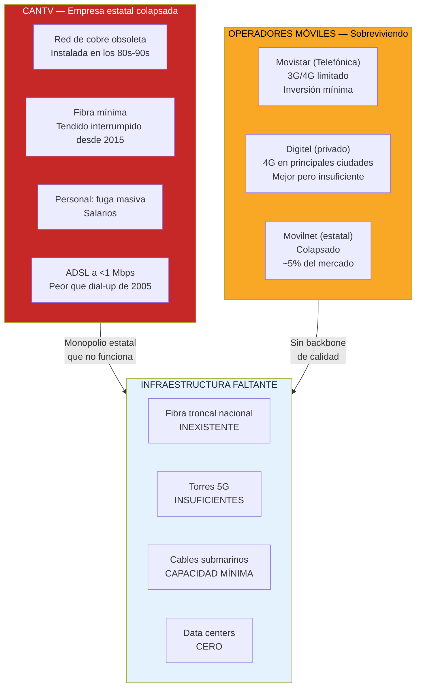
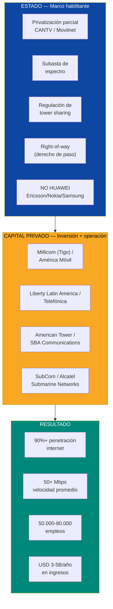
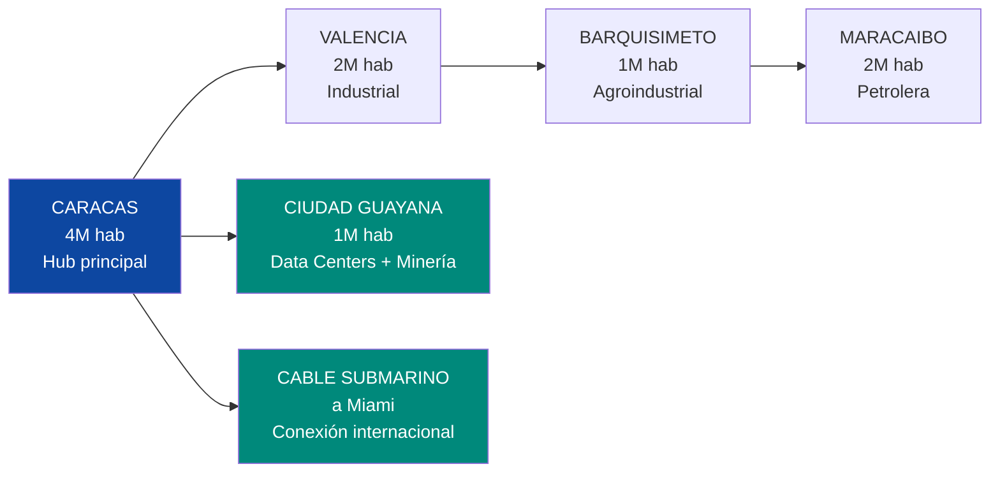
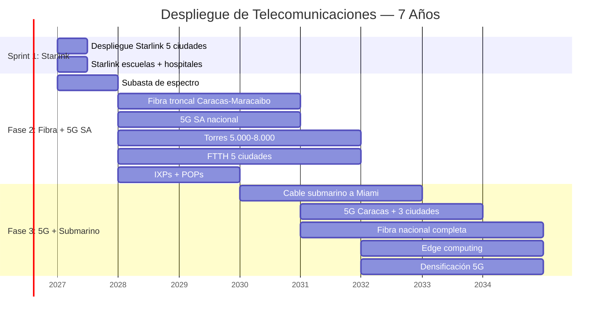
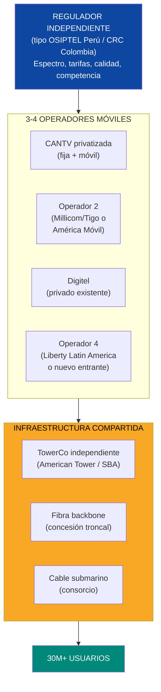
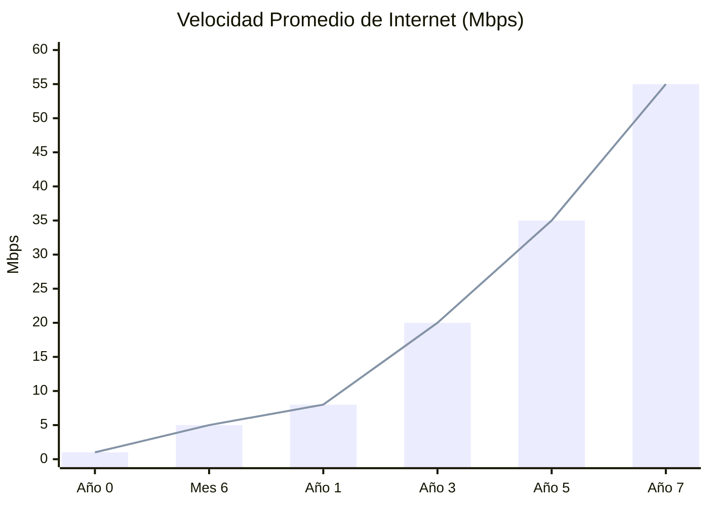

# Telecomunicaciones: Sin Internet No Hay Siglo XXI

> Venezuela tiene la velocidad de internet más lenta de LATAM. Un país que quiere atraer data centers, hubs tech, estado digital y startups de IA no puede operar a **<1 Mbps**. Las telecoms son la autopista que habilita todo lo digital — y hoy esa autopista no existe.

---

## 1. La Crisis: El País Más Desconectado de las Américas

:::danger Radiografía de la desconexión
Venezuela tiene una velocidad promedio de descarga **estancada por debajo de 1 Mbps durante una década** — [SIGCOMM/Northwestern 2024](https://estcarisimo.github.io/assets/pdf/papers/2024-sigcomm-venezuela.pdf). Mientras que la mediana de LATAM es ~20 Mbps, Venezuela está en el fondo. Solo el **48% de los hogares** tiene acceso a internet — [Freedom House 2024](https://freedomhouse.org/country/venezuela/freedom-net/2024). En **7 de 23 estados la penetración es menor al 30%**. CANTV (empresa estatal de telecoms) está colapsada — se transfiere a Venezuela S.A. como activo del holding ciudadano y se privatiza parcialmente o se aporta como equity en JVs con operadores internacionales.
:::

| Indicador | Venezuela (actual) | Promedio LATAM | Meta Año 5 | Meta Año 10 |
|-----------|-------------------|----------------|-----------|------------|
| **Velocidad de descarga** | **<1 Mbps** | ~20 Mbps | 15 Mbps | 50+ Mbps |
| **Penetración hogares** | **48%** | ~70% | 70% | 90%+ |
| **Banda ancha fija** | **9,58%** | ~15% | 20% | 40% |
| **Banda ancha móvil** | **52,3%** | ~75% | 65% | 85%+ |
| **4G** | Limitado (Movistar/Digitel) | Amplio | Nacional | Nacional |
| **5G** | **0** | En despliegue | 3 ciudades | Cobertura urbana |
| **Fibra óptica backbone** | Deteriorado/inexistente | Extenso | Troncal principal | Nacional |

Fuentes: [Freedom House 2024](https://freedomhouse.org/country/venezuela/freedom-net/2024); [SIGCOMM/Northwestern 2024](https://estcarisimo.github.io/assets/pdf/papers/2024-sigcomm-venezuela.pdf); [ITU Broadband Commission](https://www.broadbandcommission.org/).

### El mapa del colapso

### Lo que falta vs. lo que existe

| Componente | Estado actual | Lo que necesita | Brecha |
|-----------|---------------|-----------------|--------|
| **Fibra troncal** | ~15.000 km (CANTV, mayoría deteriorada) | 50.000+ km de fibra óptica nacional | ~35.000 km |
| **Torres de telecoms** | ~5.000 (estimado, muchas sin mantenimiento) | 15.000-20.000 torres (5G SA) | ~10.000-15.000 torres |
| **Cables submarinos** | Conexión limitada vía cable ARCOS-1 | Capacidad dedicada a Miami + redundancia | Nuevo cable o upgrade |
| **Centros de datos (IX/POP)** | ~2-3 puntos mínimos | 10-20 IXP + 5+ data centers Tier III+ | Desde cero |
| **Espectro asignado** | Sin subasta 5G formal | Subasta de 700 MHz, 2.5 GHz, 3.5 GHz, mmWave | Desde cero |

---

## 2. La Oportunidad: USD 3-5B/Año en un Mercado sin Competencia

:::info 30 millones de personas sin internet decente — eso es un mercado
El mercado de telecoms de Venezuela es de los más subatendidos del mundo. 30+ millones de personas con smartphones pero sin internet que funcione. Es como tener 30 millones de clientes que QUIEREN pagar pero no tienen a quién. Para un operador de telecoms, esto es un greenfield con demanda asegurada.
:::

| Segmento | Tamaño estimado | Modelo |
|----------|-----------------|--------|
| **Servicios móviles (voz + datos)** | USD 1,5-3B/año | Licencias de operación |
| **Banda ancha fija (fibra FTTH)** | USD 500M-1B/año | Concesión de infraestructura |
| **Servicios enterprise (B2B)** | USD 300-500M/año | Conectividad para empresas |
| **Torres y sites** | USD 200-400M/año | TowerCo independiente |
| **Cables submarinos y backbone** | USD 200-500M (inversión) | Consorcio internacional |
| **Servicios digitales (IoT, cloud, ciberseguridad)** | USD 300-500M/año | Contratos de servicios |
| **TOTAL mercado anual (a escala)** | **USD 3-5B/año** | |
| **Inversión total requerida** | **USD 5-10B** (en 7 años) | |

---

## 3. La Solución: Starlink Sprint + Fibra + 5G SA

### Principio rector: romper el monopolio de CANTV

:::danger Condición geopolítica inviolable: NO HUAWEI
La relación con EE.UU. es la condición sine qua non para el levantamiento de sanciones. Usar equipos **Huawei o ZTE** para 5G o infraestructura crítica de telecoms es un **deal-breaker** absoluto para Washington. Marco Rubio (Secretario de Estado) lo ha dicho explícitamente. El costo de equipos Ericsson/Nokia/Samsung puede ser 10-20% mayor, pero el costo de elegir Huawei es **perder USD 550-750B en inversión total del plan**.

| Proveedor | País | Estatus con EE.UU. | Rol |
|-----------|------|-------------------|-----|
| **Ericsson** | Suecia | Aprobado — proveedor preferido | 5G RAN, core, fibra |
| **Nokia** | Finlandia | Aprobado — contratos con Pentágono | 5G, fibra, networking |
| **Samsung** | Corea del Sur | Aprobado — proveedor de Verizon/AT&T | 5G RAN |
| ~~Huawei~~ | ~~China~~ | **PROHIBIDO** — Entity List | ~~Nada~~ |
| ~~ZTE~~ | ~~China~~ | **PROHIBIDO** — Entity List | ~~Nada~~ |
:::

### Sprint 1: Starlink para 5 Ciudades (Mes 1-6) — Ya Planificado

**Objetivo:** Internet de primer mundo en semanas, no años.

| Componente | Detalle |
|------------|---------|
| **Qué** | Despliegue de Starlink Business + Residencial en 5 ciudades principales + ZEETs |
| **Velocidad** | Business: 350+ Mbps; Residencial: 100-200 Mbps |
| **Cobertura** | Caracas, Maracaibo, Valencia, Barquisimeto, Ciudad Guayana |
| **Terminales** | ~3.500 (500 Business + 2.000 escuelas/hospitales + 1.000 comunitarios) |
| **Costo anual** | USD 18-35M/año |
| **Para quién** | ZEETs, hubs tech, hospitales, escuelas, puntos de acceso comunitario |
| **Timeline** | **6 meses** desde contrato |

:::tip Starlink es el puente, no el destino
Starlink resuelve la emergencia de conectividad: los data centers, hubs tech y hospitales operan con internet de primer mundo **desde el mes 6** mientras se construye la fibra. Es la diferencia entre esperar 5 años o empezar ahora. Pero Starlink no escala a 30M de personas — para eso se necesita fibra + 5G SA.
:::

### Fase 2: Fibra Backbone + 5G SA Nacional (Año 1-4)

**Objetivo:** Infraestructura permanente de conectividad.

| Componente | Detalle | Inversión | Timeline |
|-----------|---------|-----------|----------|
| **Fibra troncal nacional** | Corredor Caracas-Valencia-Barquisimeto-Maracaibo (~1.200 km) | USD 500M-1B | 18-36 meses |
| **Fibra urbana (FTTH)** | Fibra hasta el hogar en 5 ciudades principales | USD 500M-1B | 24-48 meses |
| **5G SA nacional** | Cobertura 5G SA en 90%+ de la población | USD 1-2B | 24-36 meses |
| **Torres nuevas** | 5.000-8.000 torres (greenfield + rehabilitación) | USD 500M-1B | 24-48 meses |
| **IXP + POPs** | 5-10 Internet Exchange Points en ciudades principales | USD 50-100M | 12-24 meses |
| **Subasta de espectro** | 700 MHz (cobertura), 2.5 GHz (capacidad), 3.5 GHz (5G) | Ingreso para gobierno | Año 1 |
| **TOTAL FASE 2** | | **USD 3-5B** | |

**Corredor de fibra prioritario:**

### Fase 3: 5G + Cable Submarino (Año 4-7)

**Objetivo:** Conectividad de clase mundial.

| Componente | Detalle | Inversión | Timeline |
|-----------|---------|-----------|----------|
| **5G en ciudades principales** | Caracas, Maracaibo, Valencia, Barquisimeto (Ericsson/Nokia/Samsung) | USD 1-2B | 36-60 meses |
| **Cable submarino** | Nuevo cable o capacidad dedicada en cable existente a Miami | USD 200-500M | 24-48 meses |
| **Fibra nacional completa** | 30.000+ km, cobertura 80%+ de hogares urbanos | USD 1-2B | 48-72 meses |
| **Torres adicionales** | 5.000-7.000 torres más para densificación 5G | USD 500M-1B | 48-72 meses |
| **Edge computing** | Nodos de procesamiento distribuidos en ciudades | USD 100-300M | 48-72 meses |
| **TOTAL FASE 3** | | **USD 3-6B** | |

---

## 4. Modelo de Negocio: Privatización + Competencia + Tower Sharing

### CANTV: privatización o muerte

:::danger CANTV no se puede reformar — hay que privatizarla
CANTV fue [nacionalizada en 2007](https://en.wikipedia.org/wiki/CANTV) por Hugo Chávez (USD 572M). Desde entonces: cero inversión en red, fuga de ingenieros, velocidades que retrocedieron al nivel de los años 2000. CANTV opera una red de cobre de los 80s con ADSL que entrega <1 Mbps. No hay arreglo gradual. La solución es **privatización parcial + nuevas licencias** para competidores — exactamente lo que hizo Chile con Entel en los 90s.
:::

| Opción | Descripción | Precedente |
|--------|-------------|-----------|
| **Privatización total** | Venta de CANTV a operador internacional | Chile: Entel → Telefónica |
| **Privatización parcial** (recomendada) | 51% privado / 49% Estado. Operador trae inversión + management | Colombia: ETB Bogotá |
| **Concesión de operación** | Estado mantiene propiedad, operador privado gestiona | Argentina: Telecom/Telefónica (años 90) |
| **Liquidación + nuevas licencias** | Cerrar CANTV, licenciar 3-4 operadores nuevos | — |

**Recomendación:** Privatización parcial de CANTV (51% a operador internacional) + 2-3 nuevas licencias para competidores. El Estado conserva 49% como ingreso de largo plazo. Movilnet se fusiona o se vende por separado.

### Estructura del mercado propuesto

### Tower sharing: la clave de la eficiencia

| Concepto | Descripción | Beneficio |
|----------|-------------|----------|
| **TowerCo independiente** | Empresa que posee y arrienda torres a todos los operadores | Elimina duplicación. Cada torre sirve a 3-4 operadores |
| **Tower sharing obligatorio** | Regulador exige que toda torre nueva sea compartida | Reduce inversión total en 30-40% |
| **Modelo** | American Tower, SBA Communications, Cellnex | Operan 200.000+ torres globalmente |
| **Ingreso TowerCo** | USD 1.000-2.000/torre/mes por operador | Con 15.000 torres: USD 200-400M/año |

:::info Tower sharing es estándar global — Venezuela no debe reinventar
En Colombia, India, Brasil y México, las torres son propiedad de TowerCos independientes que las alquilan a todos los operadores. Esto elimina la duplicación absurda de que cada operador construya su propia torre al lado de la del competidor. Con 15.000-20.000 torres compartidas, Venezuela puede cubrir 90%+ de la población. Sin sharing, necesitaría 40.000+ torres — 3x más caro.
:::

### Ingresos del sector

| Línea de negocio | Descripción | Ingreso estimado (a escala, año 7) |
|-----------------|-------------|-------------------------------------|
| **Servicios móviles** (voz + datos) | 20M+ suscriptores, ARPU USD 8-15/mes | USD 2-3B/año |
| **Banda ancha fija** (fibra + ADSL) | 3-5M suscriptores, ARPU USD 15-30/mes | USD 500M-1,5B/año |
| **Enterprise** (B2B, cloud, VPN) | Empresas, gobierno, instituciones | USD 300-500M/año |
| **Torres** (TowerCo) | 15.000-20.000 torres, 3-4 operadores por torre | USD 200-400M/año |
| **TOTAL** | | **USD 3-5B/año** |

---

## 5. Infraestructura Requerida

| Componente | Qué se necesita | Costo estimado | Timeline | Proveedor potencial |
|------------|----------------|----------------|----------|---------------------|
| **Fibra troncal** | 30.000+ km de fibra óptica nacional | USD 1-2B | 3-5 años | Ericsson, Nokia, Corning |
| **FTTH (fibra al hogar)** | Fibra a 3-5M hogares en ciudades principales | USD 1-2B | 3-7 años | Operadores + contratistas |
| **Torres 5G** | 10.000-15.000 torres nuevas + rehabilitación | USD 1-2B | 3-7 años | American Tower, SBA |
| **Equipos RAN 5G SA** | Estaciones base para cobertura nacional | USD 500M-1B | 2-3 años | Ericsson, Nokia, Samsung |
| **Equipos RAN 5G** | Estaciones base para ciudades principales | USD 500M-1B | 4-7 años | Ericsson, Nokia, Samsung |
| **Cable submarino** | Nuevo cable o capacidad en cable existente a Miami | USD 200-500M | 2-4 años | SubCom, Alcatel Submarine |
| **IXPs + POPs** | 10-20 puntos de intercambio | USD 50-100M | 1-2 años | Equinix, DE-CIX |
| **Data centers carrier-neutral** | 3-5 facilities para hosting de contenido | USD 200-500M | 2-5 años | Equinix, Digital Realty |
| **Starlink (puente)** | 3.500+ terminales | USD 18-35M/año | 1-6 meses | SpaceX |
| **TOTAL** | | **USD 5-10B** | **7 años** | |

---

## 6. Subasta de Espectro: Revenue para el Gobierno

:::tip La subasta de espectro es un ingreso inmediato para el Estado
Subastar espectro para 5G genera ingresos significativos — y atrae inversión de operadores que pagan por la licencia y se comprometen a invertir en infraestructura. Colombia recaudó **USD 1,1B** en su subasta de espectro 2024. Brasil recaudó **USD 8,5B** en 2021. Venezuela, con 30M+ de personas y mercado virgen, puede recaudar **USD 500M-1,5B**.
:::

| Banda | Uso | Precio estimado | Quién compite |
|-------|-----|-----------------|---------------|
| **700 MHz** | 5G SA cobertura rural | USD 100-300M | CANTV privatizada, Digitel, nuevo entrante |
| **2.500 MHz (AWS)** | 5G SA capacidad urbana | USD 100-300M | Todos los operadores |
| **3.500 MHz** | 5G principal | USD 200-500M | Todos los operadores |
| **26/28 GHz (mmWave)** | 5G ultra-rápido, data centers | USD 50-200M | Operadores + enterprise |
| **TOTAL** | | **USD 500M-1,5B** | |

### Condiciones de la subasta

| Condición | Descripción | Por qué importa |
|-----------|-------------|-----------------|
| **Cobertura obligatoria** | Cubrir 70% de población en 3 años, 90% en 5 años | Evitar que operadores solo inviertan en ciudades rentables |
| **Inversión mínima** | USD 500M+ por operador en 5 años | Garantizar deployment real |
| **Tower sharing** | Obligatorio para toda torre nueva | Eficiencia, reducir costos |
| **NO Huawei/ZTE** | Equipos solo de proveedores aprobados | Condición geopolítica |
| **Duración licencia** | 20 años renovables | Certidumbre para inversión |

---

## 7. Comparables: Quién Lo Ha Hecho

### Ruanda: 4G nationwide en 3 años

| Indicador | Ruanda 2013 | Ruanda 2016 | Ruanda 2025 | Fuente |
|-----------|-----------|-----------|-----------|--------|
| Cobertura 4G | 0% | **95%** | 99%+ | [Korea Telecom/Olleh Rwanda Networks](https://www.kt.com/) |
| Penetración internet | ~8% | ~30% | **60%+** | [Banco Mundial](https://www.worldbank.org/) |
| Velocidad promedio | <1 Mbps | 10 Mbps | 20+ Mbps | ITU |
| Inversión | — | **USD 350M** (Korea Telecom) | Continuada | — |

**Lección:** Ruanda, con un PIB de USD 14B (6x menor que Venezuela), logró 4G nationwide en 3 años con una **asociación con Korea Telecom**. Si Ruanda pudo, Venezuela con USD 82B de PIB y 30M+ de potenciales suscriptores puede hacerlo más rápido. La clave fue la voluntad política + socio tecnológico comprometido.

### Colombia: liberalización de telecoms

| Indicador | Colombia 2005 | Colombia 2025 | Cómo |
|-----------|-------------|-------------|------|
| Operadores móviles | 3 | **4+** (Claro, Movistar, Tigo, WOM) | Subastas de espectro |
| Penetración móvil | ~50% | **85%+** | Competencia + prepago |
| 4G cobertura | 0% | **95%+** | Inversión de operadores |
| Velocidad promedio | ~2 Mbps | **25+ Mbps** | Fibra + 4G |
| Regulador | CRT | CRC (moderno, independiente) | Reforma institucional |

Fuente: [CRC Colombia](https://www.crcom.gov.co/).

**Lección:** Colombia creó competencia real con 4 operadores móviles (Claro, Movistar, Tigo, WOM). La entrada de WOM (2020) bajó precios 30-40% y forzó a los incumbentes a invertir. Venezuela necesita al menos 3-4 operadores compitiendo para que el mercado funcione.

### Chile: de Entel estatal a líder digital LATAM

| Indicador | Chile 1990 | Chile 2025 | Fuente |
|-----------|-----------|-----------|--------|
| Entel (estatal) | Monopolio ineficiente | Privatizada (1992), hoy top 3 operador | [Entel Chile](https://www.entel.cl/) |
| Penetración internet | <5% | **92%+** | [SUBTEL](https://www.subtel.gob.cl/) |
| Operadores | 1 (Entel) | **5+** (Entel, Movistar, Claro, WOM, GTD) | — |
| 5G | 0 | **En despliegue** (Entel + WOM) | — |
| Velocidad promedio | — | **80+ Mbps** | Speedtest Global Index |

**Lección:** Chile privatizó Entel en 1992 y abrió el mercado a competidores. 30 años después tiene 92%+ de penetración, 5 operadores y velocidades de 80+ Mbps. Es el modelo exacto que Venezuela necesita aplicar con CANTV.

---

## 8. Aliados Potenciales

| Empresa/Entidad | País | Experiencia | Rol en Venezuela |
|------------------|------|------------|-----------------|
| **Millicom (Tigo)** | Luxemburgo/Suecia | Operador en 10 países LATAM (Colombia, Bolivia, Paraguay, Guatemala, etc.) | Operador móvil + fijo. Mercados emergentes son su core |
| **América Móvil (Claro)** | México | Mayor operador de LATAM. 290M+ suscriptores | Operador móvil + fijo. Escala para inversión masiva |
| **Liberty Latin America** | EE.UU./Caribe | Operador en Caribe y LATAM (Cable & Wireless, VTR Chile) | Operador + cable submarino + banda ancha |
| **Telefónica (Movistar)** | España | Ya opera en Venezuela. Conoce el mercado | Expansión de 5G SA si condiciones mejoran |
| **Digitel** | Venezuela | Operador privado, mejor servicio actual | Expansión con nueva inversión + espectro |
| **American Tower** | EE.UU. | 220.000+ torres globalmente. Presente en Brasil, México, Colombia | TowerCo independiente |
| **SBA Communications** | EE.UU. | 55.000+ torres. Presencia en LATAM | Alternativa TowerCo |
| **Ericsson** | Suecia | Líder global 5G. Proveedor aprobado por EE.UU. | Equipos RAN 5G SA + fibra |
| **Nokia** | Finlandia | #2 global en infraestructura 5G | Equipos + software de gestión de red |
| **Samsung Networks** | Corea del Sur | 5G RAN para Verizon/AT&T | Equipos 5G |
| **SubCom** | EE.UU. | #1 en cables submarinos | Nuevo cable Venezuela-Miami |
| **Corning** | EE.UU. | Mayor fabricante de fibra óptica del mundo | Fibra para backbone y FTTH |
| **Korea Telecom** | Corea del Sur | 4G nationwide en Ruanda en 3 años | Socio tecnológico para despliegue acelerado |
| **SpaceX (Starlink)** | EE.UU. | Internet satelital global | Puente inmediato (ya planificado) |
| **DFC (EE.UU.)** | EE.UU. | Financia infraestructura en países aliados | Financiamiento para fibra + torres |

---

## 9. Generación de Empleo

| Categoría | Sprint 1 | Fase 2 | Fase 3 (acumulado) |
|-----------|----------|--------|---------------------|
| **Construcción** (fibra, torres, tendido) | 1.000-2.000 | 15.000-25.000 | Rotativo |
| **Ingeniería de telecoms** | 500-1.000 | 3.000-5.000 | 5.000-8.000 |
| **Operación y mantenimiento** | 200-500 | 3.000-5.000 | 8.000-12.000 |
| **Ventas y atención al cliente** | 500-1.000 | 5.000-8.000 | 10.000-15.000 |
| **Desarrollo de software y TI** | 100-300 | 1.000-2.000 | 3.000-5.000 |
| **Empleos indirectos** | 2.000-4.000 | 15.000-25.000 | 25.000-40.000 |
| **TOTAL** | **4.300-8.800** | **42.000-70.000** | **51.000-80.000** |

:::info Telecoms es el mayor empleador tech posible
Un sector de telecoms desarrollado emplea entre el **1-2% de la fuerza laboral** de un país. Para Venezuela (15M de trabajadores), eso son **150.000-300.000 empleos directos e indirectos** a madurez. Desde técnicos de torres hasta desarrolladores de apps, desde vendedores en tiendas hasta ingenieros de redes. Es empleo de clase media: salarios de USD 500-3.000/mes.
:::

---

## 10. Riesgos y Mitigaciones

| # | Riesgo | Prob. | Impacto | Mitigación |
|---|--------|-------|---------|------------|
| 1 | **CANTV no se privatiza** — resistencia política o sindical | Alta | Crítico | Privatización parcial (menos resistencia). Si no se privatiza, nuevas licencias + libre competencia para hacerla irrelevante |
| 2 | **Subasta de espectro no atrae operadores** — riesgo país alto | Media | Crítico | PPAs de espectro con condiciones competitivas. Garantías de protección de inversión (BIT, ICSID) |
| 3 | **Robo de infraestructura** — cables, torres, equipos | Alta | Alto | Torres con seguridad + monitoreo remoto. Fibra enterrada (no aérea). Comunidad como aliada (empleos locales) |
| 4 | **Operadores no invierten lo suficiente** — capturan licencia pero sub-invierten | Media | Alto | Condiciones de cobertura obligatoria con multas por incumplimiento. Cronograma de inversión en contrato |
| 5 | **Competencia de Starlink** — satelital reemplaza fibra | Baja | Medio | Starlink es complemento, no sustituto. Latencia y capacidad de fibra son superiores para enterprise y data centers |
| 6 | **Escasez de técnicos de telecoms** | Alta | Alto | Programas de formación acelerada (6-12 meses para técnicos de torre, 18-24 meses para ingenieros de red). Repatriación de diáspora |
| 7 | **Corrupción en subastas y contratos** | Alta | Alto | Subasta abierta con veeduría internacional (ITU + Banco Mundial). Transparencia de ofertas |
| 8 | **Interferencia del Estado en regulador** | Media | Alto | Independencia presupuestaria + nombramiento por concurso (modelo CRC Colombia, OSIPTEL Perú) |

---

## 11. Proyección a 7 Años

| Indicador | Año 0 (actual) | Mes 6 | Año 1 | Año 3 | Año 5 | Año 7 |
|-----------|----------------|-------|-------|-------|-------|-------|
| **Velocidad promedio (Mbps)** | <1 | 5 (Starlink) | 8 | 20 | 35 | 50+ |
| **Penetración internet (%)** | 48% | 52% | 58% | 70% | 82% | 90%+ |
| **Suscriptores móviles (M)** | ~15 | 16 | 18 | 22 | 27 | 30+ |
| **Suscriptores fibra fija (M)** | ~0,1 | 0,1 | 0,3 | 1,5 | 3 | 5+ |
| **Cobertura 5G SA (%)** | 0% | 0% | 15% | 50% | 80% | 95%+ |
| **Cobertura 5G (%)** | 0% | 0% | 0% | 0% | 15% | 40%+ |
| **Torres (miles)** | ~5 | 5,5 | 7 | 12 | 17 | 20+ |
| **Fibra troncal (km)** | ~15.000 | 15.000 | 18.000 | 30.000 | 40.000 | 50.000+ |
| **Inversión acumulada (USD M)** | 0 | 50 | 500 | 3.000 | 6.000 | 9.000 |
| **Empleos directos** | ~10.000 | 12.000 | 18.000 | 35.000 | 55.000 | 65.000+ |
| **Ingreso bruto sector (USD M/año)** | ~500 | 550 | 800 | 1.800 | 3.000 | 4.500 |

---

## 12. Contribución al Plan Venezuela S.A.

| Parámetro | Valor |
|-----------|-------|
| **Inversión total** | USD 5-10B en 7 años |
| **Mercado anual (año 7)** | USD 3-5B/año |
| **Modelo** | Privatización CANTV + 3-4 operadores + TowerCo + regulador independiente |
| **Velocidad meta** | 50+ Mbps promedio (de <1 Mbps actual) |
| **Penetración meta** | 90%+ (de 48% actual) |
| **Empleos** | 50.000-80.000 directos + indirectos |
| **Condición geopolítica** | Ericsson/Nokia/Samsung ONLY. Cero Huawei/ZTE |
| **Ingreso por subasta de espectro** | USD 500M-1,5B (one-time para gobierno) |
| **Sinergia con data centers** | Backbone de fibra + cable submarino habilitan Corredor DC Bolívar |
| **Sinergia con estado digital** | 90%+ internet = e-government viable (modelo Estonia) |

:::tip La conectividad es el sistema nervioso del país
Sin telecoms: no hay estado digital (Estonia necesita internet para funcionar), no hay data centers (sin fibra no hay clientes), no hay hubs tech (los programadores necesitan internet), no hay telemedicina (los hospitales rurales quedan aislados), no hay e-commerce (la economía digital no existe), no hay educación online (las escuelas quedan en el siglo XX).

**Cada USD 1 invertido en telecoms genera USD 3-4 en PIB** — [ITU/UNESCO Broadband Commission](https://www.broadbandcommission.org/). Es la inversión con el multiplicador económico más alto del plan.

**Internet es el petróleo del siglo XXI. Y Venezuela está produciendo a <1 Mbps.**
:::

---

## Documentos Relacionados

- [Data Centers IA](./data-centers-ia) — Data centers requieren fibra óptica y conectividad de alta velocidad
- [Capacidad Eléctrica](./capacidad-electrica) — Electricidad confiable para torres de telecoms y estaciones base
- [Educación y EdTech](./educacion-edtech) — Conectividad Starlink y fibra en escuelas como prerequisito educativo
- [Salud y Telemedicina](./salud-telemedicina) — Telemedicina requiere conectividad en hospitales y centros de salud
- [FinTech y Banca Digital](./fintech-banca-digital) — Pagos digitales e inclusión financiera requieren conectividad móvil
- [Turismo](./turismo) — Conectividad en destinos turísticos para nómadas digitales
- [Modelo de Concesiones](./modelo-concesiones) — Concesiones de telecomunicaciones (5G SA + FTTH, 50 años)

---

## Fuentes

| # | Fuente | Dato |
|---|--------|------|
| 1 | [SIGCOMM/Northwestern 2024](https://estcarisimo.github.io/assets/pdf/papers/2024-sigcomm-venezuela.pdf) | Velocidad <1 Mbps estancada por una década |
| 2 | [Freedom House 2024](https://freedomhouse.org/country/venezuela/freedom-net/2024) | 48% hogares con internet, 7/23 estados <30% |
| 3 | [ITU Broadband Commission](https://www.broadbandcommission.org/) | USD 1 en telecoms = USD 3-4 en PIB |
| 4 | [CRC Colombia](https://www.crcom.gov.co/) | Modelo de regulador de telecoms |
| 5 | [SUBTEL Chile](https://www.subtel.gob.cl/) | Chile: 92%+ penetración internet |
| 6 | [Korea Telecom — Ruanda 4G](https://www.kt.com/) | 4G nationwide en 3 años |
| 7 | [Banco Mundial — Ruanda](https://www.worldbank.org/) | Penetración internet Ruanda |
| 8 | [Speedtest Global Index](https://www.speedtest.net/global-index) | Velocidades globales de internet |
| 9 | [American Tower](https://www.americantower.com/) | Modelo TowerCo, 220.000+ torres |
| 10 | [SubCom](https://www.subcom.com/) | Cables submarinos |
| 11 | [Starlink](https://www.starlink.com/) | Precios y velocidades 2025 |
| 12 | [CANTV Wikipedia](https://en.wikipedia.org/wiki/CANTV) | Nacionalización 2007, historia |
