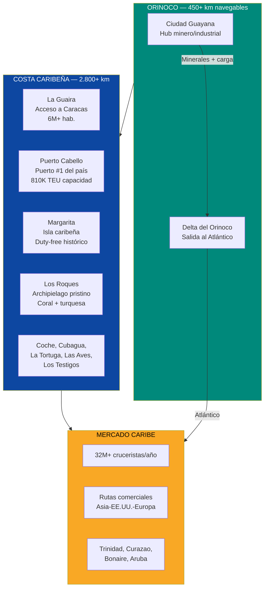
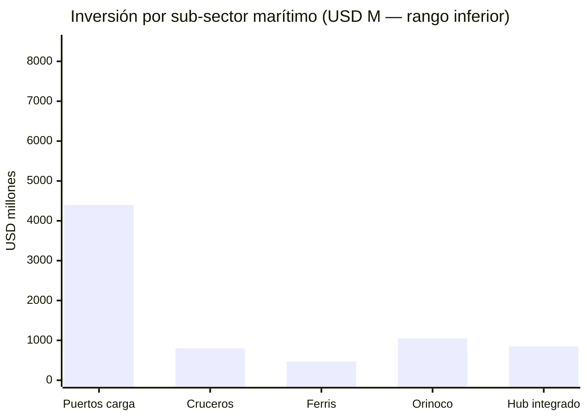
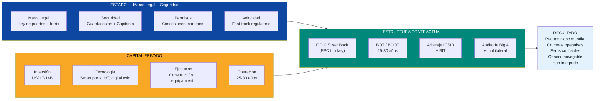
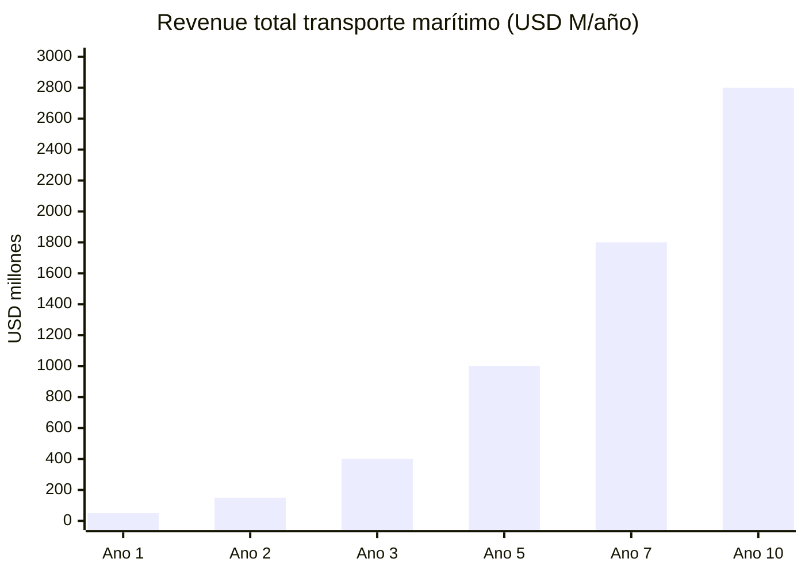
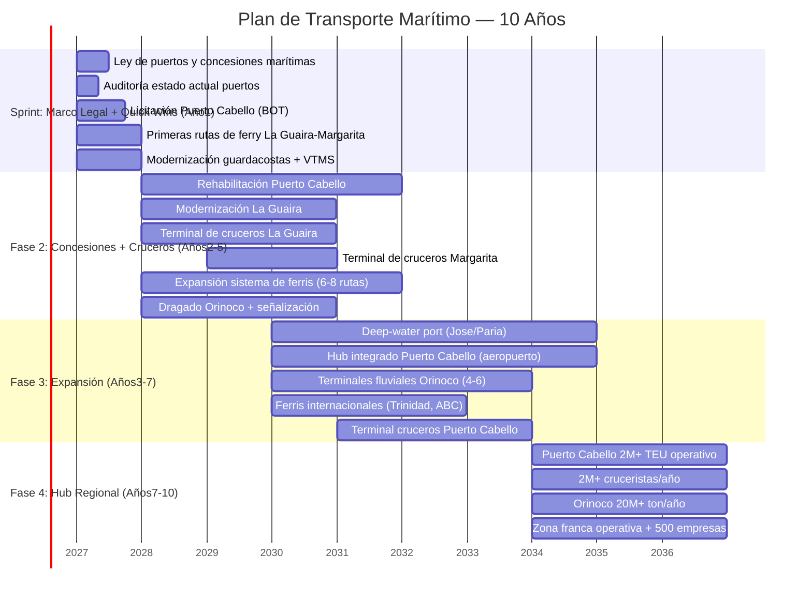

# Transporte Marítimo: La Autopista Azul del Caribe

> Venezuela tiene **2.800+ km de costa caribeña**, **70+ islas**, el **rio Orinoco navegable por 450+ km**, y es el único país importante del Caribe con **cero infraestructura de cruceros**. El mercado de cruceros del Caribe mueve **USD 55B+/año** con **32M+ pasajeros** — y Venezuela no captura ni un centavo. Puerto Cabello opera al **33% de capacidad**. No hay ferris inter-insulares. No hay terminales de cruceros. No hay navegación fluvial organizada. Esto no es un problema — es la oportunidad marítima más grande del hemisferio occidental sin explotar.

---

## 1. La Oportunidad: USD 55B+ de Mercado y Cero Presencia

:::info El único país grande del Caribe sin cruceros
El Caribe es el **destino #1 mundial de cruceros** con el **35%+ de todos los despliegues globales**. República Dominicana, Puerto Rico, Bahamas, Jamaica, Cozumel — todos capturan millones de cruceristas. Venezuela, con más costa caribeña que cualquiera de ellos, **no tiene una sola terminal de cruceros operativa**. No es falta de demanda. Es falta de infraestructura.
:::

| Dato | Cifra | Fuente |
|------|-------|--------|
| Costa caribeña de Venezuela | **2.800+ km** | [Wikipedia — Venezuela](https://en.wikipedia.org/wiki/Venezuela) |
| Islas e islotes | **70+** (Los Roques, Margarita, Coche, Cubagua, La Tortuga, Las Aves, Los Testigos) | [Wikipedia — Islands of Venezuela](https://en.wikipedia.org/wiki/List_of_islands_of_Venezuela) |
| Rio Orinoco navegable | **450+ km** (Ciudad Guayana → Atlántico) | [Britannica — Orinoco](https://www.britannica.com/place/Orinoco-River) |
| Mercado cruceros Caribe (2024) | **32M+ pasajeros/año**, USD 55B+ industria | [CLIA — State of the Cruise Industry 2025](https://cruising.org/en/news-and-research/research/state-of-the-cruise-industry-report) |
| Caribe como destino cruceros | **#1 global — 35%+ de todos los despliegues** | [CLIA 2025](https://cruising.org/en/news-and-research/research/state-of-the-cruise-industry-report) |
| Puerto Cabello capacidad | **810K TEU** instalados, **~270K TEU** reales (**33%**) | [Unisco](https://www.unisco.com/international-ports/puerto-cabello-venezuela) |
| Capacidad fluvial Orinoco | **20M+ ton/año** | [Oreate AI](https://www.oreateai.com/blog/research-report-on-the-ore-transportation-market-in-the-orinoco-river-basin-venezuela/b63a1666fb2dcb066312827ad0eccb6c) |
| Ferris inter-insulares activos | **~0 servicios regulares confiables** | [Requiere investigación] |
| Terminales de cruceros | **0 operativas a estándar internacional** | [Requiere investigación] |

### Lo que tiene Venezuela y nadie aprovecha

### Por quéahora

| Factor | Detalle |
|--------|---------|
| **Boom de cruceros post-COVID** | La industria de cruceros alcanzó **35,7M pasajeros en 2024** — record histórico, superando pre-COVID. Todas las navieras estánbuscando nuevos puertos de escala — [CLIA 2025](https://cruising.org/en/news-and-research/research/state-of-the-cruise-industry-report) |
| **Saturación de destinos existentes** | Cozumel, Nassau, St. Maarten reportan congestión. Las navieras necesitan alternativas en el Caribe sur — [Seatrade Cruise](https://www.seatrade-cruise.com/) |
| **Venezuela = greenfield total** | Cero competencia interna. Cero incumbentes. Todo por construir = todo por capturar |
| **Nearshoring y comercio** | Puertos eficientes son prerequisito para capturar nearshoring. Puerto Cabello al 33% = capacidad ociosa inmensa |
| **Orinoco sin explotar** | Rio navegable conecta la mayor reserva mineral del país con el Atlántico — y nadie lo usa de forma organizada |

---

## 2. Sub-Oportunidades de Inversión

### 2.A Puertos de Carga (Deep-Water Terminals)

:::danger Puerto Cabello: el puerto #1 del país opera como si fuera del siglo pasado
Gruas obsoletas, dragado insuficiente, aduanas corruptas, sistemas IT inexistentes. **270K TEU de 810K de capacidad = 33% de utilización.** Cartagena, a 1.200 km de distancia, maneja **3,6M TEU/año**. Puerto Cabello tiene la ubicación — solo le falta todo lo demás.
:::

| Proyecto | Inversión | Modelo | Meta | Timeline | Estándar |
|----------|-----------|--------|------|----------|----------|
| **Puerto Cabello: rehabilitación + expansión** | USD 1.500-2.500M | BOT 30 años | Dragado a **24m** (Rotterdam Class), **1,5-2M TEU/año**, gruas STS automatizadas, digital twin | Años1-5 | PIANC + Rotterdam Class + ISO 28000 |
| **La Guaira: modernización terminal** | USD 800-1.200M | BOT 30 años | Terminal moderna **800K TEU/año**, acceso vial mejorado | Años2-5 | PIANC + ISO 28000 |
| **Nuevo deep-water port (Golfo de Paria o Jose)** | USD 1.500-3.000M | Greenfield BOT 40 años | Hub multiproposito: petróleo + LNG + carga general, **1-2M TEU/año** | Años3-8 | PIANC + IMO + ISO 14001 |
| **Maracaibo: terminal minera/petrolera** | USD 400-800M | BOT 25 años | Soporte a operaciones del Lago + exportación minera | Años2-5 | PIANC |
| **Smart port technology (todos los puertos)** | USD 200-500M | Integrado en BOTs | IoT, gruas automatizadas, digital twin, blockchain para aduanas, 5G portuario | Continuo | ISO 28000 + ISO 55001 |
| **TOTAL PUERTOS DE CARGA** | **USD 4.400-8.000M** | | | | |

**Operadores potenciales:**

| Operador | País| Terminales globales | Por quéVenezuela |
|----------|------|--------------------|--------------------|
| **DP World** | Emiratos | 90+ terminales en 40 países | Expansión agresiva en LATAM; operan en Rep. Dominicana (Caucedo) |
| **APM Terminals** (Maersk) | Dinamarca | 75+ terminales | Lideres globales; buscan hubs complementarios en Caribe sur |
| **Hutchison Ports** | Hong Kong | 52 puertos en 24 países | Operan Panamá (Balboa, Cristobal); Venezuela = extension natural |
| **PSA International** | Singapur | 60+ terminales | Modelo Singapur aplicable a Puerto Cabello como hub de transbordo |

**Revenue model:**

| Fuente de ingreso | Tarifa estimada | Volumen ano 10 | Revenue ano 10 |
|-------------------|-----------------|----------------|-----------------|
| Container handling (THC) | USD 150-250/TEU | 3-4M TEU | USD 450-1.000M |
| Wharfage + anchorage | USD 5-15/TEU | 3-4M TEU | USD 15-60M |
| Warehousing + storage | USD 2-5/TEU/dia | Variable | USD 50-150M |
| Concesión payments al Estado | 5-8% revenue bruto | — | USD 30-100M |
| **Total puertos de carga** | | | **USD 545-1.310M/año** |

---

### 2.B Terminales de Cruceros

:::info 32 millones de cruceristas pasan por el Caribe cada ano — y cero tocan Venezuela
Royal Caribbean tiene **68 barcos**. MSC tiene **23**. Carnival tiene **90+**. Todos navegan el Caribe. Ninguno hace escala en Venezuela. No porque no quieran — sino porque no hay donde atracar, no hay que hacer en tierra, y no hay seguridad. Resuelve esas tres cosas y tienes un mercado cautivo.
:::

| Proyecto | Inversión | Modelo | Capacidad | Timeline |
|----------|-----------|--------|-----------|----------|
| **La Guaira: homeport terminal** | USD 300-500M | BOT 30 años | **2 berths para barcos de 5.000+ pax**, terminal premium, acceso a Caracas | Años2-5 |
| **Margarita: port of call** | USD 200-400M | BOT 25 años | **1-2 berths**, duty-free shopping center, playa accesible, tours organizados | Años2-4 |
| **Puerto Cabello: port of call** | USD 150-300M | BOT 25 años | **1 berth**, acceso a centro colonial + playas de Morrocoy | Años3-5 |
| **Los Roques: tender operation** | USD 50-100M | Concesión 20 años | Operación de lanchas tender, eco-turismo controlado, capacidad de carga limitada | Años2-4 |
| **Cruise provisioning industry** | USD 100-200M | Privado | Proveeduría de alimentos, combustible, suministros para barcos | Años3-6 |
| **TOTAL TERMINALES DE CRUCEROS** | **USD 800M-1.500M** | | | |

**Estándar:** IMO ISPS Code (seguridad portuaria), terminales Skytrax-class con aire acondicionado, Wi-Fi, duty-free, servicios médicos.

**Revenue model — cruceros:**

| Fuente de ingreso | Valor unitario | Volumen | Revenue ano 10 |
|-------------------|----------------|---------|-----------------|
| Port fees (tasa portuaria) | USD 8-15/pasajero | 2M+ pax/año | USD 16-30M |
| Head tax (impuesto por cabeza) | USD 10-20/pasajero | 2M+ pax/año | USD 20-40M |
| Gasto en tierra por pasajero | USD 100-150/pasajero/dia | 2M+ pax/año | USD 200-300M |
| Provisioning (proveeduría) | USD 50-100/pasajero/viaje | 500K+ escalas | USD 25-50M |
| Duty-free retail | Variable | — | USD 30-80M |
| **Total cruceros** | | | **USD 291-500M/año** |

**Proyección de pasajeros de crucero:**

| Año| Pasajeros | Escalas de barcos | Revenue directo |
|-----|-----------|-------------------|-----------------|
| **1** | 0 (construcción) | 0 | USD 0 |
| **2** | 50.000 | ~50 | USD 10M |
| **3** | 150.000 | ~150 | USD 30M |
| **5** | 500.000 | ~400 | USD 100M |
| **7** | 1.000.000 | ~700 | USD 200M |
| **10** | **2.000.000+** | **~1.200** | **USD 400-500M** |

:::tip República Dominicana: de cero a 1,5M cruceristas
Amber Cove (Puerto Plata) fue construida por Carnival Corporation en 2015 con una inversión de **USD 85M**. En su primer ano completo recibió **300K+ pasajeros**. Para 2024 había superado **1M cruceristas acumulados**. El modelo: la naviera construye la terminal y garantiza el trafico. Venezuela puede replicar esto con Royal Caribbean o MSC en La Guaira o Margarita — [Carnival Corporation](https://www.carnivalcorp.com/).
:::

**Operadores potenciales:**

| Naviera | Flota | Presencia Caribe | Oportunidad Venezuela |
|---------|-------|------------------|------------------------|
| **Royal Caribbean** | 68 barcos | Hub Miami, multiples puertos Caribe | Homeporting en La Guaira; port of call Margarita |
| **MSC Cruises** | 23 barcos | Ocean Cay (isla privada Bahamas) | Port of call + posible isla privada (La Tortuga?) |
| **Carnival Corporation** | 90+ barcos (9 marcas) | Amber Cove (RD), Half Moon Cay | Construir terminal en La Guaira o Margarita (modelo Amber Cove) |
| **Norwegian Cruise Line** | 19 barcos | Great Stirrup Cay, Harvest Caye | Port of call Margarita + Los Roques |
| **Celebrity Cruises** | 17 barcos | Rutas Caribe sur | Itinerarios de Caribe sur que incluyan Venezuela |

---

### 2.C Sistema de Ferris Inter-insulares

:::caution Venezuela tiene 70+ islas y cero sistema de transporte marítimo entre ellas
Un venezolano en tierra firme que quiere ir a Margarita tiene que volar o rezar por un ferry informal. Ir a Los Roques es una avioneta cara o nada. Ir a Coche, Cubagua, La Tortuga — prácticamente imposible sin lancha privada. Un país con 70+ islas caribeñas debería tener un sistema de ferris como Grecia, Croacia o Baleares.
:::

**Rutas domésticas:**

| Ruta | Distancia | Duración estimada | Frecuencia objetivo | Demanda estimada |
|------|-----------|-------------------|--------------------|------------------|
| **La Guaira ↔ Margarita** | ~200 km | 4-5 horas (fast ferry) | 2-3 diarias | 500K+ pax/año |
| **La Guaira ↔ Los Roques** | ~170 km | 3-4 horas (fast ferry) | 1-2 diarias | 200K+ pax/año |
| **Margarita ↔ Coche** | ~15 km | 30 min | 6-8 diarias | 300K+ pax/año |
| **Margarita ↔ Cubagua** | ~10 km | 20 min | 4-6 diarias | 100K+ pax/año |
| **Puerto La Cruz ↔ Margarita** | ~80 km | 2 horas | 2-3 diarias | 400K+ pax/año |
| **Cumana ↔ Margarita** | ~90 km | 2-3 horas | 1-2 diarias | 200K+ pax/año |

**Rutas internacionales:**

| Ruta | Distancia | Duración estimada | Frecuencia | Mercado |
|------|-----------|-------------------|------------|---------|
| **Margarita ↔ Trinidad** | ~150 km | 3-4 horas | 3-4 semanales | Comercio + turismo + diaspora trinidadense |
| **Margarita ↔ Curazao** | ~350 km | 7-8 horas (overnight) | 2-3 semanales | Turismo + comercio ABC islands |
| **Margarita ↔ Bonaire** | ~280 km | 5-6 horas | 2-3 semanales | Turismo + buceo |
| **Margarita ↔ Aruba** | ~450 km | 9-10 horas (overnight) | 2-3 semanales | Turismo + comercio |

**Flota requerida:**

| Tipo | Fabricante referencia | Capacidad | Velocidad | Cantidad | Costo unitario |
|------|----------------------|-----------|-----------|----------|----------------|
| **Fast ferry (catamaran)** | Austal (Australia) | 400-600 pax + 100 vehículos | 35-40 nudos | 6-8 | USD 40-60M |
| **Ferry convencional** | Damen (Holanda) | 600-1.000 pax + 200 vehículos | 18-22 nudos | 4-6 | USD 30-50M |
| **Lancha rapida inter-islas** | Local / Damen | 100-200 pax | 25-30 nudos | 10-15 | USD 5-10M |

| Componente | Inversión |
|------------|-----------|
| Flota (20-29 embarcaciones) | USD 250-500M |
| Terminales de ferry (8-12) | USD 150-300M |
| Ayudas a la navegación (boyas, AIS, comunicaciones) | USD 50-100M |
| Sistemas de reserva y operación | USD 20-50M |
| **TOTAL FERRIS** | **USD 470M-950M** |

**Estándar:** IMO SOLAS (seguridad marítima), DNV classification, ISM Code.

**Operadores potenciales:**

| Operador | País| Especialidad | Aplicación Venezuela |
|----------|------|-------------|----------------------|
| **Balearia** | España | Ferris Mediterráneo, Caribe (Miami-Bahamas) | Operador ancla para sistema inter-insular. Ya opera en el Caribe |
| **DFDS** | Dinamarca | Mayor operador de ferris de Europa | Asesoria técnica + posible JV |
| **Viking Line** | Finlandia | Ferris Báltico | Modelo de operación para rutas largas |
| **Operadores locales** | Venezuela | Conocimiento local | Concesiona operadores locales con capital y tecnología internacional |

**Revenue model — ferris:**

| Fuente | Tarifa promedio | Volumen ano 10 | Revenue ano 10 |
|--------|-----------------|----------------|-----------------|
| Pasajes pasajeros | USD 30-80/pax | 2M+ pax/año | USD 60-160M |
| Transporte de vehículos | USD 50-150/vehiculo | 300K+ vehículos | USD 15-45M |
| Carga inter-insular | USD 20-50/ton | 200K+ ton | USD 4-10M |
| Servicios a bordo (comida, retail) | USD 10-20/pax | 2M+ pax | USD 20-40M |
| **Total ferris** | | | **USD 99-255M/año** |

---

### 2.D Navegación Fluvial del Orinoco

:::info Una autopista acuática de 450+ km que conecta la mayor reserva mineral del país con el océano
El Orinoco es navegable para buques oceánicos hasta Ciudad Guayana — **450+ km** desde el Atlántico. Capacidad teórica: **20M+ ton/año**. Hierro, bauxita, oro, productos agrícolas de los Llanos — todo puede bajar por rio a una fracción del costo del transporte terrestre. Y hoy no se usa de forma organizada.
:::

| Componente | Inversión | Meta | Timeline |
|------------|-----------|------|----------|
| **Dragado y mantenimiento del canal** | USD 300-500M | Profundidad garantizada **12m+** para buques Panamáx | Años1-3 |
| **Sistema de navegación y señalización** | USD 100-200M | AIS, boyas luminosas, cartas electrónicas, VTS (Vessel Traffic Service) | Años1-3 |
| **Terminales fluviales** (4-6 a lo largo del Orinoco) | USD 300-600M | Terminales de mineral granel, agro, contenedores en Ciudad Guayana, Caicara, Ciudad Bolivar | Años2-5 |
| **Terminal de transbordo rio → océano** (delta) | USD 200-400M | Transbordo de barcazas a buques oceánicos sin romper la cadena logística | Años2-5 |
| **Barcazas y remolcadores** (flota inicial) | USD 150-300M | 50-100 barcazas para carga granel + 15-20 remolcadores | Años2-4 |
| **TOTAL ORINOCO** | **USD 1.050M-2.000M** | | |

**Estándar:** PIANC inland waterway guidelines, IMO SOLAS (donde aplique), IALA maritime signalling.

**Carga potencial:**

| Producto | Origen | Volumen potencial | Destino |
|----------|--------|-------------------|---------|
| **Hierro** (CVG Ferrominera) | Cerro Bolivar | **10-15M ton/año** | Exportación marítima (China, Europa) |
| **Bauxita** | Los Pijiguaos | **3-5M ton/año** | Fundiciones domésticas + exportación |
| **Oro + minerales criticos** | Arco Minero | Carga de alto valor, volumen bajo | Puertos seguros, exportación |
| **Producción agricola** | Llanos (Apure, Barinas, Portuguesa) | **2-4M ton/año** | Mercado interno + exportación |
| **Insumos industriales** | Importación | **1-2M ton/año** | Interior del país vía rio |
| **TOTAL** | | **16-26M ton/año** | |

**Revenue model — Orinoco:**

| Fuente | Tarifa | Volumen ano 10 | Revenue ano 10 |
|--------|--------|----------------|-----------------|
| Peaje fluvial | USD 0,50-1,00/ton | 15-20M ton | USD 7,5-20M |
| Handling en terminales | USD 3-8/ton | 15-20M ton | USD 45-160M |
| Transbordo rio-océano | USD 5-10/ton | 10-15M ton | USD 50-150M |
| Pilotaje + practicaje | USD 2.000-5.000/buque | 2.000+ buques | USD 4-10M |
| **Total Orinoco** | | | **USD 106-340M/año** |

---

### 2.E Puerto + Aeropuerto Integrado de Puerto Cabello

:::tip Concepto único: hub logístico aire-mar integrado
Puerto Cabello ya tiene el puerto industrial #1 del país. Lo que no tiene es un aeropuerto de carga cercano — el mas proximo es Valencia (Arturo Michelena), que esta deteriorado y no tiene terminal de carga moderna. Integrar un aeropuerto de carga junto al puerto crea un **hub logístico air-sea** como el modelo Singapore Changi + PSA o Rotterdam Airport + Europoort.
:::

| Componente | Inversión | Descripción | Estándar |
|------------|-----------|-------------|----------|
| **Aeropuerto de carga** | USD 500-800M | Pista 3.000m+ para cargueros widebody (747F, 777F), terminal de carga con cadena de frio, sistemas automatizados | ICAO Annex 14 Cat 4E |
| **Zona franca integrada** | USD 200-400M | Free trade zone con almacenes, manufactura ligera, ensamblaje, re-exportación | Modelo Colon Free Zone + Jebel Ali |
| **Conexion vial/ferroviaria puerto-aeropuerto** | USD 100-200M | Via dedicada de carga entre terminal portuaria y terminal aerea (~5-10 km) | AASHTO |
| **Sistemas IT integrados** | USD 50-100M | Ventanilla unica digital, blockchain aduanal, tracking end-to-end | ISO 28000 + WCO SAFE Framework |
| **TOTAL INTEGRADO** | **USD 850M-1.500M** | | |

**Modelo de referencia:**

| Hub integrado | País| Qué hace | Lección para Venezuela |
|---------------|------|----------|------------------------|
| **Singapore Changi + PSA** | Singapur | Aeropuerto #1 del mundo + operador portuario #2 global. Integrados con free trade zone | El gold standard. Puerto Cabello tiene la ubicación para replicar a menor escala |
| **Rotterdam (Europoort + Airport)** | Holanda | Puerto #1 de Europa + aeropuerto de carga complementario | Integración air-sea reduce tiempo de transito de dias a horas |
| **Dubai (Jebel Ali + Al Maktoum)** | Emiratos | Puerto + aeropuerto + zona franca (JAFZA). **8.000+ empresas** en zona franca | Desierto convertido en hub logístico global. Si Dubai puede, Puerto Cabello también |
| **Colon Free Zone** | Panamá | Mayor zona franca del hemisferio occidental. **2.500 empresas, 5-7% del PIB** | A 1.200 km de Puerto Cabello. Complementario, no competidor |

**Revenue model — hub integrado:**

| Fuente | Revenue ano 10 |
|--------|-----------------|
| Cargo handling aereo | USD 50-100M |
| Zona franca (alquiler + servicios) | USD 30-80M |
| Servicios logísticos integrados | USD 20-50M |
| Re-exportación y valor agregado | USD 50-150M |
| **Total hub integrado** | **USD 150-380M/año** |

---

## 3. Infraestructura Requerida — Consolidado

| Sub-sector | Inversión estimada | Timeline | Empleos directos (construcción + operación) |
|-----------|-------------------|----------|----------------------------------------------|
| **Puertos de carga** | USD 4.400-8.000M | 5-10 años | 20.000-40.000 |
| **Terminales de cruceros** | USD 800M-1.500M | 2-5 años | 8.000-15.000 |
| **Sistema de ferris** | USD 470M-950M | 2-5 años | 5.000-10.000 |
| **Navegación fluvial Orinoco** | USD 1.050-2.000M | 3-7 años | 8.000-15.000 |
| **Hub integrado Puerto Cabello** | USD 850M-1.500M | 3-7 años | 10.000-20.000 |
| **TOTAL** | **USD 7.570-13.950M** | **10 años** | **51.000-100.000** |

:::caution Consistencia con el plan
La sección de [Vialidad y Logística](./vialidad-logistica) estima USD 5.200-9.800M para puertos. Este documento desagrega y expande esa cifra para incluir cruceros, ferris inter-insulares, navegación fluvial del Orinoco y el hub integrado de Puerto Cabello — sub-oportunidades no cubiertas en el documento de vialidad. Hay overlap parcial en puertos de carga que debe consolidarse al integrar ambos documentos en el presupuesto total.
:::

---

## 4. Modelo de Negocio: Concesiones Marítimas

### Principio rector

> Venezuela S.A. es accionista en la infraestructura portuaria base — terrenos, muelles, accesos — y cobra regalías perpetuas como holding de 40M ciudadanos. El Estado pone el marco legal, la seguridad y los guardacostas. El capital privado financia, construye, opera y transfiere después de 25-30 años. **Cero puertos operados por el Estado. Venezuela S.A. invierte y cobra, no opera.**

### Estructura de concesiones por sub-sector

| Sub-sector | Tipo contrato | Duración | Propiedad terreno | Operador tipo | Canon a Venezuela S.A. |
|-----------|---------------|----------|-------------------|---------------|-----------------|
| **Puertos de carga** | BOT (FIDIC Gold Book) | 30-40 años | Venezuela S.A. (accionista en JV) | DP World, APM Terminals, PSA | 5-8% revenue bruto |
| **Cruceros** | BOT / BOOT | 25-30 años | Venezuela S.A. | Royal Caribbean, Carnival (construyen su propia terminal) | 3-5% revenue + head tax |
| **Ferris** | Concesión de servicio | 15-25 años | Venezuela S.A. (terminales), privado (flota) | Balearia, DFDS, operador local | Tarifa regulada + fee a Venezuela S.A. |
| **Orinoco** | BOT + concesión de dragado | 25-30 años | Venezuela S.A. (rio público) | Jan De Nul, Van Oord (dragado), privados (terminales) | Peaje fluvial regulado |
| **Hub integrado** | BOOT (FIDIC Silver Book) | 30-40 años | Venezuela S.A. | Operador consorcio (portuario + aeroportuario + zona franca) | Renta fija + % revenue |

### Flujo de ingresos consolidado

| Actor | Qué recibe | Monto ano 10 |
|-------|-----------|---------------|
| **Concesionarios** | Revenue operativo - costos - canon | 60-70% del revenue total |
| **Gobierno (canon + impuestos)** | Canon de concesión + 15% flat tax + 12% IVA | USD 300-700M/año |
| **Trabajadores** | 51.000-100.000 empleos directos + salarios | — |
| **Economia local** | Multiplicador económico 2,5-3x sobre empleo directo | 130.000-300.000 empleos indirectos |

---

## 5. Proyección 10 Años

| Indicador | Año1 | Año3 | Año5 | Año7 | Año10 |
|-----------|-------|-------|-------|-------|--------|
| **Inversión acumulada** | USD 1B | USD 3B | USD 6B | USD 9B | USD 12B |
| **Throughput puertos (TEU)** | 350K | 700K | 1.200K | 2.000K | **3.500K** |
| **Cruceristas/año** | 0 | 150K | 500K | 1.000K | **2.000K+** |
| **Pasajeros ferry/año** | 100K | 500K | 1.000K | 1.500K | **2.000K+** |
| **Carga Orinoco (ton/año)** | 2M | 5M | 10M | 15M | **20M+** |
| **Revenue puertos carga** | USD 30M | USD 150M | USD 400M | USD 700M | **USD 1.200M** |
| **Revenue cruceros** | USD 0 | USD 30M | USD 100M | USD 200M | **USD 450M** |
| **Revenue ferris** | USD 10M | USD 40M | USD 80M | USD 150M | **USD 250M** |
| **Revenue Orinoco** | USD 10M | USD 50M | USD 120M | USD 200M | **USD 340M** |
| **Revenue hub integrado** | USD 0 | USD 30M | USD 80M | USD 150M | **USD 350M** |
| **REVENUE TOTAL** | **USD 50M** | **USD 300M** | **USD 780M** | **USD 1.400M** | **USD 2.590M** |
| **Empleos directos** | 10.000 | 25.000 | 45.000 | 65.000 | **85.000** |
| **Empleos totales (3x)** | 30.000 | 75.000 | 135.000 | 195.000 | **255.000** |
| **Contribución fiscal** | USD 5M | USD 30M | USD 80M | USD 150M | **USD 300M** |

### Impacto en otros sectores del plan

| Sector | Como le impacta el transporte marítimo | Impacto estimado |
|--------|---------------------------------------|-----------------|
| **Petróleo** | Puertos de exportación eficientes, LNG terminal en Jose/Paria | Habilita exportación de 3M bpd |
| **Minería** | Corredor Orinoco → Atlántico para hierro, bauxita | Habilita USD 74B en ingresos mineros |
| **Turismo** | Cruceros + ferris a islas + acceso a destinos costeros | 2M+ cruceristas + 2M+ pasajeros ferry |
| **Comercio exterior** | Puertos eficientes reducen costo de importar/exportar | De 12-15 dias a 3-5 dias para importar |
| **Agricultura** | Transporte fluvial de productos de los Llanos | Reduce costo de transporte en 40-60% vs. terrestre |
| **Data centers** | Hub integrado Puerto Cabello = conectividad de cables submarinos | Acceso a cables submarinos existentes y nuevos |

---

## 6. Comparables Internacionales

| País/Proyecto | Situación inicial | Qué hicieron | Resultado | Lección para Venezuela |
|---------------|------------------|-------------|-----------|------------------------|
| **Panamá (Canal Zone)** | Zona canalera devuelta en 1999. Puertos básicos | 5 terminales de contenedores modernas, Zona Libre de Colon, ferrocarril intermodal | **7M+ TEU/año**, ZLC = 5-7% PIB, PIB per capita 4x en 25 años | Venezuela no tiene canal pero tiene posición geografica complementaria. Puerto Cabello puede ser el hub del Caribe sur |
| **Rep. Dominicana (cruceros)** | Cero cruceros hasta 2000s | Amber Cove (Carnival, USD 85M), Cap Cana, Puerto Plata | **~1,5M cruceristas/año**, USD 500M+ revenue asociado | Naviera financia la terminal si el destino es atractivo. Venezuela tiene más atractivos que RD |
| **Croacia (ferris)** | Post-guerra (1995). 1.200+ islas, transporte marítimo básico | Sistema de ferris estatal (Jadrolinija) + operadores privados. Subsidio para rutas no rentables | **12M+ pasajeros/año en ferris**, turismo = 20% PIB | Venezuela tiene menos islas pero más distantes. Modelo mixto público-privado funciona |
| **Dubai (DP World/Jebel Ali)** | Desierto sin comercio en 1970s | Jebel Ali Port (1979), zona franca JAFZA, inversión masiva en infraestructura | **#9 puerto del mundo, 15M+ TEU**, JAFZA = 8.000 empresas, 23% PIB de Dubai | Si un desierto puede crear un hub logístico global, Venezuela con posición caribeña natural puede hacerlo |
| **Rotterdam (Europoort)** | Puerto histórico, competencia con Amberes | Automatización total, Maasvlakte 2 (isla artificial), integración air-sea, carbon neutral 2050 | **#1 puerto de Europa, 14M+ TEU**, 385M ton de carga/año | Gold standard para smart ports. Puerto Cabello puede adoptar tecnología Rotterdam |

Fuentes: [Port Economics](https://porteconomicsmanagement.org/); [CLIA](https://cruising.org/); [DP World](https://www.dpworld.com/); [Port of Rotterdam](https://www.portofrotterdam.com/en/facts-and-figures); [BusinessPanamá](https://www.businesspanama.com/).

---

## 7. Aliados Potenciales

### Operadores portuarios y marítimos

| Empresa | País| Especialidad | Rol potencial |
|---------|------|-------------|---------------|
| **DP World** | Emiratos | 90+ terminales en 40 países. Opera Caucedo (RD) | Operador ancla Puerto Cabello o deep-water port |
| **APM Terminals** (Maersk) | Dinamarca | 75+ terminales. Lider global en contenedores | Operador La Guaira o Puerto Cabello |
| **Hutchison Ports** | Hong Kong | Opera Balboa y Cristobal (Panamá) | Extension natural desde Panamá |
| **PSA International** | Singapur | Modelo Singapur, 60+ terminales | Smart port technology + operación |
| **Balearia** | España | Ferris Mediterráneo + Caribe (Miami-Bahamas) | Operador ancla sistema de ferris inter-insular |
| **Jan De Nul** | Bélgica | #1 en dragado mundial | Dragado Orinoco + mantenimiento de canal |
| **Van Oord** | Holanda | Dragado e ingenieria marítima | Dragado Orinoco + terminales fluviales |
| **Austal** | Australia | Fabricante de fast ferries (aluminio) | Proveedor de flota de catamaranes |
| **Damen Shipyards** | Holanda | Ferris + embarcaciones de trabajo | Proveedor de ferris convencionales + barcazas |

### Navieras de cruceros

| Empresa | País| Flota | Rol potencial |
|---------|------|-------|---------------|
| **Royal Caribbean Group** | EE.UU. | 68 barcos | Homeporting La Guaira, port of call Margarita |
| **Carnival Corporation** | EE.UU. | 90+ barcos (9 marcas) | Construir terminal (modelo Amber Cove) |
| **MSC Cruises** | Suiza | 23 barcos | Port of call + posible isla privada |
| **Norwegian Cruise Line** | EE.UU. | 19 barcos | Rutas Caribe sur con escala Venezuela |

### Financiamiento

| Entidad | Tipo | Potencial |
|---------|------|-----------|
| **BID / CAF** | Multilateral | USD 2-5B en prestamos para infraestructura portuaria |
| **DFC (ex-OPIC)** | EE.UU. | Financiamiento de puertos en países aliados |
| **IFC (Banco Mundial)** | Multilateral | Project finance + asistencia técnica PPP |
| **JICA** | Japon | Credito blando para infraestructura marítima |
| **Fondos de infraestructura** | Global | Brookfield, Macquarie, GIC (Singapur), ADIA (Abu Dhabi) |

---

## 8. Riesgos y Mitigaciones

| # | Riesgo | Prob. | Impacto | Mitigación |
|---|--------|-------|---------|------------|
| 1 | **Sanciones impiden entrada de navieras/operadores de EE.UU.** | Media-Alta | Crítico | Comenzar con operadores europeos/asiáticos (DP World, PSA, MSC). Buscar licencias OFAC específicas para puertos/cruceros. Modelo Chevron |
| 2 | **Inseguridad marítima** — piratería, contrabando, narcotráfico en rutas | Media | Alto | Guardacostas modernizados + VTMS (Vessel Traffic Management System) + cooperación con US Coast Guard/Trinidad. Protocolo IMO |
| 3 | **Trafico de carga menor al proyectado** — puertos no se llenan | Media | Alto | Garantia de ingreso minimo (MRG) en concesiones. Tarifas competitivas vs. Cartagena/Kingston. Zona franca como generador de carga |
| 4 | **Navieras de cruceros no incluyen Venezuela en itinerarios** | Media | Alto | Incentivos: tasa portuaria cero por 3 años. Terminal construida por la naviera (modelo Amber Cove). Security guarantee |
| 5 | **Corrupción en adjudicación de concesiones** | Alta | Alto | Licitaciones internacionales abiertas. Auditoría Big 4. Supervisión multilateral (BID/CAF). Modelo anticorrupción del plan |
| 6 | **Desastre natural** — huracan, tsunami, marejada | Baja | Alto | Venezuela esta al **sur del cinturon de huracanes** (ventaja). Diseno resiliente. Seguros MIGA/infraestructura |
| 7 | **Sedimentación del Orinoco** — dragado insuficiente | Media | Medio | Contrato de dragado permanente con Jan De Nul/Van Oord. Fondo de mantenimiento del canal |
| 8 | **Competencia regional** — Panamá, Colombia, Trinidad capturan la carga y cruceros | Media | Medio | Posicion complementaria, no competidora. Caribe sur esta desatendido. Tarifas competitivas |
| 9 | **Falta de mano de obra marítima calificada** | Alta | Medio | Escuela de marina mercante + repatriación de marinos venezolanos en el exterior. Convenio con academia marítima de Panamá |
| 10 | **Inestabilidad política** — nuevo gobierno revoca concesiones | Media-Alta | Crítico | Contratos ICSID + BIT + compensación por terminación anticipada. SPV offshore. Seguro MIGA |

---

## 9. Timeline de Ejecución

---

## 10. Resumen Ejecutivo

| Parámetro | Valor |
|-----------|-------|
| **Inversión total** | **USD 7.570-13.950M** (~USD 6-12B rango redondeado) |
| **Timeline** | 10 años (infraestructura core), 15 años (escala completa) |
| **Empleos directos** | **51.000-100.000** |
| **Empleos totales (3x)** | **153.000-300.000** |
| **Revenue ano 10** | **USD 2.590M/año** (~USD 3-6B rango con upside) |
| **Cruceristas ano 10** | **2.000.000+** |
| **Pasajeros ferry ano 10** | **2.000.000+** |
| **Throughput portuario ano 10** | **3.500.000+ TEU** |
| **Carga fluvial Orinoco ano 10** | **20M+ ton/año** |
| **Modelo** | Concesiones BOT/BOOT — FIDIC Silver/Gold Book — 25-30 años |
| **Estándar** | PIANC + IMO + Rotterdam Class + Changi Class + ISO 28000 |
| **Referencia principal** | Panamá (puertos) + RD (cruceros) + Croacia (ferris) + Dubai (hub integrado) |

:::tip Cada barco que atraca en Venezuela es revenue, empleo, comercio y conexión con el mundo
Un crucero de 5.000 pasajeros que hace escala genera **USD 500K-750K en un solo dia** (gasto en tierra + tasas). Un containership que descarga 2.000 TEU genera **USD 300K-500K en tarifas portuarias**. Una barcaza que baja 30.000 ton de hierro por el Orinoco genera **USD 150K-300K**. Multiplica eso por miles de escalas al ano y tienes un sector que genera **USD 3-6B/año** — sin gastar un centavo de petróleo. La autopista azul del Caribe esta esperando. Solo hay que abrir el puerto.
:::

---

## Documentos Relacionados

- [Vialidad y Logística](./vialidad-logistica) — Red vial y corredores logísticos que conectan puertos con el interior
- [Turismo](./turismo) — Cruceros, ferris y marinas como motor turístico costero e insular
- [Minerales Críticos](./minerales-criticos) — Exportación de minerales vía puertos y barcazas del Orinoco
- [Petróleo y Gas](./petroleo-gas) — Terminales petroleras y logística de exportación de crudo
- [Capacidad Eléctrica](./capacidad-electrica) — Electrificación portuaria y shore power para buques
- [Modelo de Concesiones](./modelo-concesiones) — Marco de concesión para terminales portuarias y operadores internacionales

---

## Fuentes

| # | Fuente | Dato utilizado |
|---|--------|---------------|
| 1 | [CLIA — State of the Cruise Industry 2025](https://cruising.org/en/news-and-research/research/state-of-the-cruise-industry-report) | 32M+ pasajeros cruceros Caribe, 35,7M global (2024 record), 35%+ despliegues en Caribe |
| 2 | [Unisco — Puerto Cabello](https://www.unisco.com/international-ports/puerto-cabello-venezuela) | Capacidad 810K TEU, throughput ~270K, 33% utilización |
| 3 | [Oreate AI — Orinoco River Transport](https://www.oreateai.com/blog/research-report-on-the-ore-transportation-market-in-the-orinoco-river-basin-venezuela/b63a1666fb2dcb066312827ad0eccb6c) | 20M+ ton/año capacidad, profundidad >10m |
| 4 | [Britannica — Orinoco River](https://www.britannica.com/place/Orinoco-River) | Navegación hasta Ciudad Bolivar, 450+ km |
| 5 | [Port of Rotterdam — Facts and Figures](https://www.portofrotterdam.com/en/facts-and-figures) | 14M+ TEU, 385M ton, smart port, carbon neutral 2050 |
| 6 | [DP World](https://www.dpworld.com/) | 90+ terminales, 40 países, opera Caucedo (RD) |
| 7 | [Carnival Corporation — Amber Cove](https://www.carnivalcorp.com/) | USD 85M terminal, 300K+ pax primer ano, modelo naviera-construye |
| 8 | [Port Economics — Panamá Transhipment](https://porteconomicsmanagement.org/pemp/contents/part1/interoceanic-passages/panama-regional-transshipment-system/) | 7M+ TEU, 5 terminales, hub hemisferio |
| 9 | [BusinessPanamá — Colon Free Zone](https://www.businesspanama.com/invest-in-panama/panama-special-economic-zones/colon-free-zone/) | 2.500 empresas, 5-7% PIB |
| 10 | [SobelNet — Venezuela Port Challenges](https://sobelnet.com/venezuelas-largest-container-port-faces-severe-infrastructure-challenges/) | Deterioro operativo, procesos de horas a dias |
| 11 | [Marine Insight — Venezuela Ports](https://www.marineinsight.com/know-more/ports-and-oil-terminals-in-venezuela/) | 10 puertos principales, condiciones actuales |
| 12 | [Wikipedia — Islands of Venezuela](https://en.wikipedia.org/wiki/List_of_islands_of_Venezuela) | 70+ islas e islotes |
| 13 | [Wikipedia — Venezuela](https://en.wikipedia.org/wiki/Venezuela) | 2.800+ km costa caribeña |
| 14 | [Seatrade Cruise](https://www.seatrade-cruise.com/) | Saturación destinos Caribe existentes, nuevos puertos requeridos |
| 15 | [PIANC — Port Standards](https://www.pianc.org/) | Estándares internacionales de puertos e infraestructura marítima |
| 16 | [IMO — International Maritime Organization](https://www.imo.org/) | SOLAS, ISPS Code, estándares de seguridad marítima |
| 17 | [Balearia](https://www.balearia.com/) | Operador de ferris en Mediterráneo + Caribe (Miami-Bahamas) |
| 18 | [Austal](https://www.austal.com/) | Fabricante de fast ferries, catamaranes de aluminio |
