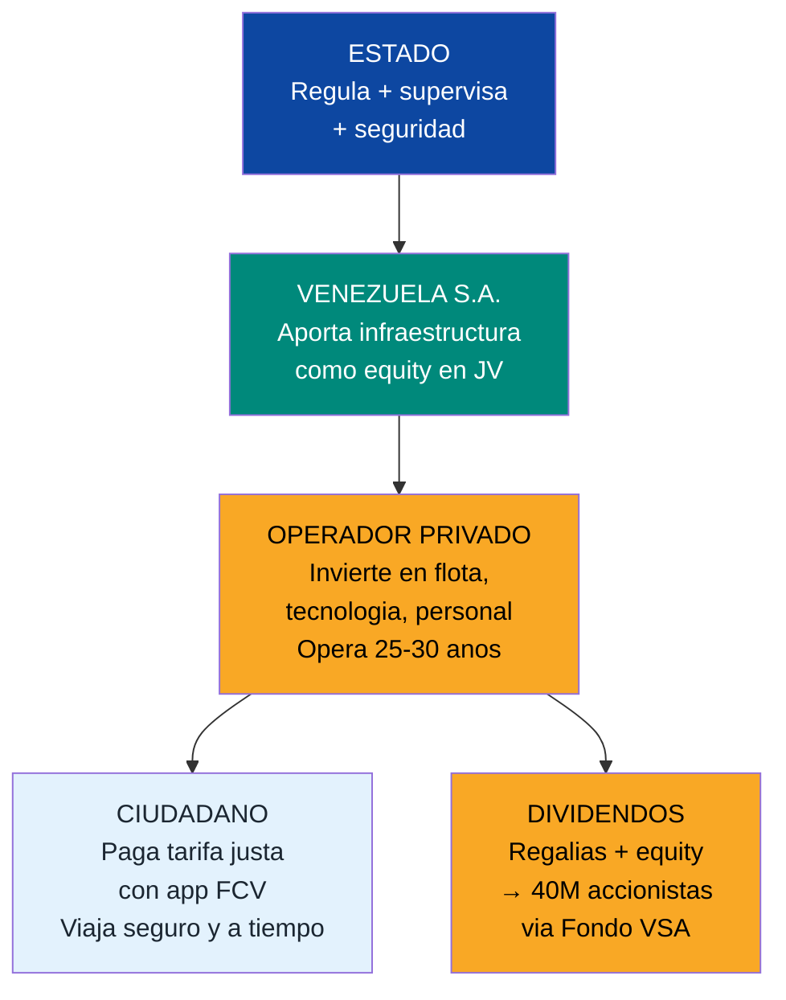
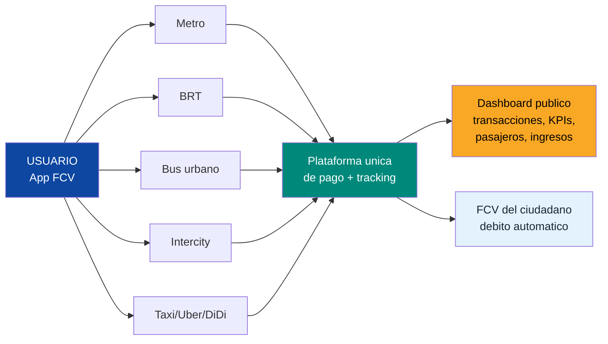
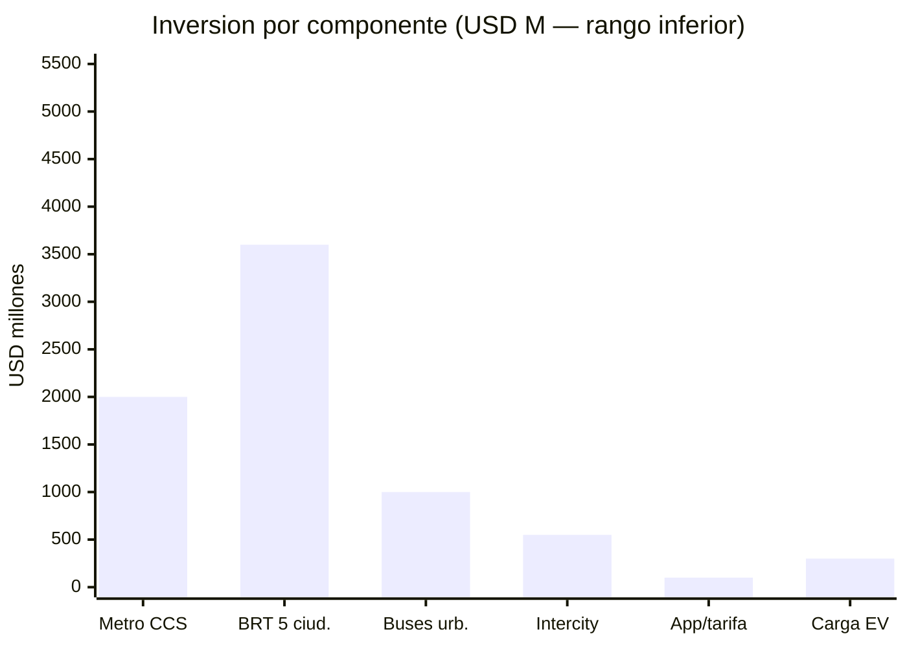
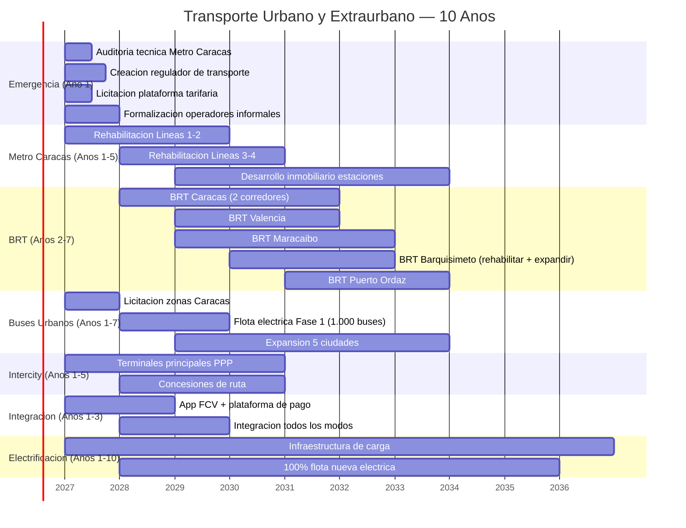

# Transporte Urbano y Extraurbano: Movilidad como Concesion Privada

:::tip En pocas palabras
Hoy en Caracas esperas 45 minutos por un bus que no llega. El metro tiene escaleras mecanicas rotas desde 2015, vagones sin aire acondicionado y estaciones donde la inseguridad supera al servicio. Este plan concesiona **TODO** el transporte de pasajeros: metro, BRT, buses urbanos, intercity. Empresas privadas compiten por darte mejor servicio. Pagas con tu app FCV. El Estado solo supervisa. Venezuela S.A. es accionista en los JVs de infraestructura y cobra dividendos para los 40M ciudadanos-accionistas.
:::

:::caution Fechas ilustrativas — las fases se activan por KPIs, no por calendario
Las referencias a "Ano X" en este documento son **ilustrativas**. Las fases reales se activan por condiciones verificables (PIB/capita, formalizacion, pobreza). Ver [KPIs de Activacion](/07-ejecucion/kpis-activacion).
:::

---

## 1. Diagnostico Brutal

:::danger El transporte urbano venezolano no existe como sistema — es supervivencia
No hay rutas fijas, no hay horarios, no hay tarifa integrada, no hay app, no hay aire acondicionado, no hay seguridad. Hay **carritos por puesto** informales, metros descompuestos y terminales que parecen zonas de conflicto. Mover a una persona de Petare a Las Mercedes — 15 km — puede tomar **2 horas** en condiciones que ninguna ciudad del mundo aceptaria.
:::

| Sistema | Estado actual | Datos clave | Problema principal |
|---------|--------------|-------------|-------------------|
| **Metro de Caracas** | 6 lineas, 48 estaciones, ~65 km. Fundado 1983 | Fue **1,5M pasajeros/dia** (pico historico). Hoy **<300K** [Requiere investigacion] | Escaleras mecanicas rotas, vagones sin AC, frecuencia impredecible, inseguridad, mantenimiento cero |
| **Metro de Valencia** | 1 linea, 7 estaciones, 6,2 km | Apenas operativo [Requiere investigacion] | Cobertura minima para una ciudad de 1,5M+ hab. Sin expansion |
| **Metro de Maracaibo** | Nunca completado | Solo **1 estacion construida** de 6 planificadas [Requiere investigacion] | Proyecto abandonado. USD millones perdidos |
| **Metro de Los Teques** | 1 linea, 5 estaciones, 9,5 km | Servicio intermitente [Requiere investigacion] | Alimenta la dormitorio de Caracas pero falla constantemente |
| **BRT TransBarca** (Barquisimeto) | 1 linea | Abandonado/deteriorado [Requiere investigacion] | Infraestructura desmantelada progresivamente |
| **Buses urbanos** | Informales, sin regulacion | "Camionetas" y "carritos por puesto" | Sin rutas fijas, sin horarios, sin seguridad, sin AC, vehiculos de 15-20+ anos |
| **Transporte intercity** | Terminales deterioradas | Operadores informales dominan [Requiere investigacion] | Sin estandares de seguridad, sin mantenimiento vehicular, sin plataforma digital |
| **Tarifa integrada** | Inexistente | Cash only en la mayoria de sistemas | Cero integracion entre modos. Cada viaje se paga por separado |

**Fuentes:** [Wikipedia — Caracas Metro](https://en.wikipedia.org/wiki/Caracas_Metro); [Wikipedia — Valencia Metro](https://en.wikipedia.org/wiki/Valencia_Metro); [Wikipedia — Maracaibo Metro](https://en.wikipedia.org/wiki/Maracaibo_Metro); [Wikipedia — Los Teques Metro](https://en.wikipedia.org/wiki/Los_Teques_Metro). Datos operativos actuales: [Requiere investigacion — fuentes oficiales no publican estadisticas confiables desde 2015+].

---

## 2. El Modelo: 100% Concesion Privada

### Principio rector

> El Estado pone el marco regulatorio + seguridad. Venezuela S.A. aporta infraestructura base (vias, estaciones, terminales) como equity en JVs. El operador privado invierte en material rodante, tecnologia y operacion. El ciudadano paga una tarifa justa con su app FCV. **Cero operacion estatal** — solo regulacion y supervision.

### Comparables internacionales

| Sistema | Ciudad | Modelo | Datos clave | Que copiamos |
|---------|--------|--------|-------------|-------------|
| **Metro de Santiago** | Santiago, Chile | Estado dueno de infra, operador privado (Metro S.A. empresa publica) | 7 lineas, 136 estaciones, 140 km. **2,4M pasajeros/dia** | Concesion de operacion + desarrollo inmobiliario en estaciones |
| **TransMilenio** | Bogota, Colombia | BRT concesionado. Municipio dueno de infra, operadores privados de buses | 12 troncales, 147 estaciones, 114 km. **2,2M pasajeros/dia** | BRT de alta capacidad con carriles dedicados a ~USD 30M/km |
| **Metro + Metrocable** | Medellin, Colombia | Empresa publica (Metro de Medellin) + teleféricos | 2 lineas metro + 5 metrocables. **800K pasajeros/dia** | Integracion metro + cable para zonas de ladera (aplicable a Caracas) |
| **Metropolitano + Linea 1** | Lima, Peru | BRT + metro PPP (consorcio Graña y Montero/Salini) | BRT: 36 km. Metro L1: 34 km | PPP para metro con financiamiento multilateral |
| **BRT Curitiba** | Curitiba, Brasil | El modelo original de BRT (1974) | 81 km de corredores, 351 estaciones tubo | Estaciones tubo + pago antes de abordar + priorizacion |
| **MTR** | Hong Kong | Empresa cotizada en bolsa. Rentable via real estate | 10 lineas, 93 estaciones. **5,8M pasajeros/dia** | Modelo "Rail + Property" (metro rentable por desarrollo inmobiliario) |

**Fuentes:** [TransMilenio](https://www.transmilenio.gov.co/); [Metro de Santiago](https://www.metro.cl/); [Hong Kong MTR](https://www.mtr.com.hk/en/corporate/investor/patronage.php); [ITDP BRT Data](https://brtdata.org/).

---

## 3. Metro de Caracas: Rehabilitacion como Concesion

:::info La joya enterrada
El Metro de Caracas fue el orgullo de Latinoamerica cuando se inauguro en 1983. Hoy es un monumento al colapso. Pero la infraestructura pesada — tuneles, estaciones, vias — **sigue ahi**. Rehabilitar es ordenes de magnitud mas barato que construir de cero. El modelo: concesionar la operacion a un operador de clase mundial que invierta en material rodante, sistemas y mantenimiento.
:::

| Componente | Detalle | Inversion estimada |
|-----------|---------|-------------------|
| **Lineas 1-4 rehabilitacion** (prioritarias) | Material rodante nuevo, escaleras mecanicas, AC, sistemas de senalizacion, seguridad | USD 1.500-2.500 M |
| **Linea 5 y extensiones** (Fase 2) | Completar estaciones inconclusas, extender cobertura | USD 500-1.000 M |
| **Desarrollo inmobiliario en estaciones** | Modelo Hong Kong MTR: retail, oficinas, vivienda sobre estaciones | Autofinanciable (genera revenue) |
| **Sistema de pago digital** | Integrado con FCV, contactless, QR | USD 50-100 M |
| **TOTAL Metro Caracas** | | **USD 2.000-3.500 M** |

**Modelo de concesion:**

| Parametro | Propuesta | Referencia |
|-----------|----------|------------|
| **Propiedad de infraestructura** | Venezuela S.A. (tuneles, estaciones, vias) | Santiago Metro — Estado dueno de infra |
| **Operacion** | Concesionario privado (25-30 anos) | Hong Kong MTR, Manila LRT |
| **Revenue principal** | Tarifa (USD 0,30-0,80 por viaje) + real estate + publicidad | MTR: 40% revenue de real estate |
| **Capacidad meta** | **1,5M pasajeros/dia** (restaurar nivel historico) | Factible con rehabilitacion completa |
| **Timeline** | Lineas 1-4 operativas en **3-5 anos** | Urgencia maxima |
| **Transferencia tech** | Centro de formacion de metro en Caracas (tecnicos, conductores, mantenimiento) | Condicion contractual |

**Candidatos a concesionario:** Metro de Madrid (MITMA), MTR Corporation (Hong Kong), Keolis (Francia), Transdev (Francia/Alemania), Alstom (material rodante).

---

## 4. BRT para 5 Ciudades

:::tip BRT: el metro de superficie
Un sistema BRT bien ejecutado mueve **tanta gente como un metro** a una fraccion del costo. TransMilenio en Bogota mueve **2,2M pasajeros/dia** a un costo de construccion de ~USD 30M/km vs. USD 150-300M/km de un metro subterraneo. Para ciudades venezolanas que no tienen metro (o tienen metros fracasados), el BRT es la solucion obvia.
:::

| Ciudad | Corredores propuestos | Km estimados | Inversion (USD M) | Pasajeros/dia (meta) |
|--------|----------------------|-------------|-------------------|---------------------|
| **Caracas** | Complemento al metro: corredor este-oeste (Petare-El Silencio), corredor sur (Coche-El Valle) | 30-40 km | 900-1.200 | 500.000-800.000 |
| **Valencia** | **Híbrido Medellín:** rehabilitar 7 estaciones del metro existente (6,2 km) como troncal central + BRT norte-sur y anillo urbano. El metro no se abandona — se integra como columna vertebral. Una sola concesión opera metro + BRT integrados | 25-35 km BRT + 6,2 km metro | 950-1.450 | 300.000-500.000 |
| **Maracaibo** | Reemplaza metro nunca construido. Corredor costero + transversal | 30-40 km | 900-1.200 | 400.000-600.000 |
| **Barquisimeto** | Rehabilita TransBarca + expande 3 corredores nuevos | 20-30 km | 600-900 | 200.000-350.000 |
| **Puerto Ordaz** | Conecta zonas industriales, residenciales y corredor data centers (Guri) | 15-25 km | 450-750 | 150.000-250.000 |
| **TOTAL BRT** | **5 ciudades** | **120-170 km** | **USD 3.600-5.100 M** | **1,5-2,5M** |

**Modelo: TransMilenio Bogota**

| Parametro | Referencia TransMilenio | Adaptacion Venezuela |
|-----------|------------------------|---------------------|
| Costo por km | ~USD 30M/km (carriles dedicados, estaciones, sistema) | USD 30M/km estimado [Requiere investigacion para costos locales] |
| Operacion | Operadores privados licitan rutas troncales | Concesion por corredor, 15-20 anos |
| Flota | Buses articulados y biarticulados (160-250 pasajeros) | **100% electricos** (nueva flota) |
| Frecuencia | 2-4 minutos en hora pico | Meta: <5 minutos en hora pico |
| Velocidad comercial | 25-28 km/h (vs. 10-12 km/h en trafico mixto) | Meta: 25+ km/h con carril dedicado |

**Fuentes:** [ITDP BRT Standard](https://www.itdp.org/library/standards-and-guides/the-bus-rapid-transit-standard/); [TransMilenio](https://www.transmilenio.gov.co/); [BRT Data](https://brtdata.org/).

---

## 5. Buses Urbanos: Concesion por Zona

### Estructura

Cada ciudad se divide en **5-8 zonas de concesion**. Un operador privado gana cada zona por licitacion y se compromete a:
- Flota **100% electrica** (nuevas adquisiciones)
- Rutas fijas con horarios publicados
- GPS en cada unidad, visible en app publica
- Frecuencia maxima de 10-15 minutos en hora pico
- Vehiculos con AC, accesibilidad universal, camaras de seguridad

| Componente | Detalle | Referencia |
|-----------|---------|------------|
| **Modelo** | London bus franchising (TfL contrata rutas a operadores privados) | Transport for London |
| **Duracion concesion** | 10-15 anos (renovable por desempeno) | Estandar TfL |
| **Flota estimada** (5 ciudades principales) | 5.000-8.000 buses | [Requiere investigacion] |
| **Inversion en flota + infraestructura** | USD 1.000-2.000 M | Basado en USD 200-350K por bus electrico |
| **KPIs** | Puntualidad (>90%), limpieza, seguridad, satisfaccion usuario | Medidos en tiempo real via app |
| **Anti-informal** | "Carritos por puesto" se formalizan como cooperativas que licitan zonas | Integracion, no eliminacion |

:::caution Formalizacion de "carritos por puesto" — no destruccion
Los operadores informales actuales no se eliminan — se **formalizan**. Se organizan en cooperativas que pueden licitar zonas de concesion. Si cumplen estandares de seguridad, mantenimiento y servicio, operan. Si no, se les ofrece capacitacion y financiamiento para modernizarse. Modelo: Bogota formalizó operadores informales en el sistema SITP con resultados mixtos pero positivos en cobertura — [EMBARQ/WRI](https://www.wri.org/initiatives/embarq).
:::

---

## 6. Transporte Extraurbano (Intercity)

| Componente | Detalle | Inversion (USD M) |
|-----------|---------|-------------------|
| **Terminales terrestres** (5 principales) | Rehabilitacion como PPP: Caracas (La Bandera/Oriente), Valencia, Maracaibo, Barquisimeto, Puerto Ordaz | 300-600 |
| **Concesiones de ruta** | Caracas-Valencia, Caracas-Maracaibo, Caracas-Barcelona/Puerto La Cruz, Valencia-Barquisimeto, Maracaibo-Merida | 200-400 (flota) |
| **Estandares de seguridad** | Edad maxima de vehiculo: 10 anos. Revision tecnica semestral. Licencia profesional obligatoria. Tacografos digitales | Regulatorio |
| **Plataforma digital** | App de booking, tracking en tiempo real, calificacion de operadores, pago con FCV | 50-100 |
| **TOTAL INTERCITY** | | **USD 550-1.100 M** |

**Modelo: Chile (Turbus/Pullman Bus)**

| Parametro | Chile | Venezuela (meta) |
|-----------|-------|-----------------|
| Operadores | Privados, regulados (Turbus, Pullman, Condor) | Privados concesionados por ruta |
| Flota | Buses cama, semi-cama, ejecutivo. 0-5 anos de edad | Misma categorizacion |
| Seguridad | GPS, camaras, tacografo, revision tecnica rigurosa | Idem + integracion con app FCV |
| Terminales | Privadas, modernas, servicios integrados | PPP: Venezuela S.A. aporta terreno, privado opera |
| Precio | Competitivo por ruta (mercado libre con techo regulado) | Idem |

---

## 7. Integracion Tarifaria: Una App, Todos los Medios

:::info Una sola app para moverte por toda Venezuela
Metro, BRT, bus urbano, intercity, taxi, ride-hailing — **todo se paga con la misma app**, vinculada a tu cuenta FCV. Sin cash, sin filas, sin tarjetas fisicas obligatorias. Cada transaccion es digital y trazable. Cero espacio para corrupcion.
:::

| Componente | Detalle | Referencia |
|-----------|---------|------------|
| **Tarjeta/app unica** | Vinculada a FCV (Fondo Ciudadano Venezuela). Contactless + QR + NFC | London Oyster/Contactless |
| **Intermodalidad** | Funciona en metro + BRT + bus + intercity + taxi + ride-hailing | Santiago BIP!, Bogota TuLlave |
| **Tracking en tiempo real** | GPS en cada vehiculo, visible en app publica | Google Maps Transit + app propia |
| **Pricing dinamico** | Descuentos off-peak (20-30%), tarifas planas nocturnas | London TfL dynamic pricing |
| **Tope diario/semanal** | Maximo gasto diario = X viajes (proteccion al usuario frecuente) | London daily/weekly cap |
| **Subsidio focalizado** | Estudiantes, tercera edad, discapacidad — descuento automatico via FCV | Verificacion digital, sin tramites |
| **Anti-corrupcion** | Toda transaccion digital, auditable, publica en dashboard agregado | Zero cash = zero fuga |
| **Inversion plataforma** | USD 100-300 M | Incluye hardware + software + integracion |

---

## 8. Movilidad Electrica

:::tip Venezuela tiene la ventaja competitiva que otros paises envidian: hidroelectricidad barata
Con **18.000 MW instalados** en el rio Caroni (Guri + Macagua + Caruachi + Tocoma), Venezuela puede electrificar toda su flota de transporte publico a un costo de energia significativamente menor que paises que dependen de carbon o gas. Electricidad hidro barata + buses electricos = costo operativo imbatible.
:::

| Meta | Detalle | Timeline | Referencia |
|------|---------|----------|------------|
| **100% flota nueva es electrica** | Todo bus nuevo adquirido para concesiones debe ser electrico | Desde Ano 1 | Politica de adquisicion obligatoria |
| **Flota electrica completa** (5 ciudades) | 5.000-8.000 buses electricos | Ano 5-10 | Shenzhen: 16.359 buses electricos, 100% flota |
| **Infraestructura de carga** | Cargadores en terminales, depositos y puntos intermedios | Progresivo | 500-1.000 puntos de carga |
| **Incentivos EV para taxis** | Exencion de aranceles + financiamiento preferencial para taxis electricos | Ano 1+ | Noruega: 80%+ ventas son EV |
| **Inversion infraestructura de carga** | USD 300-500 M | 10 anos | Red de carga publica + privada |

**Modelo: Shenzhen, China**

| Metrica | Shenzhen | Meta Venezuela |
|---------|----------|---------------|
| Buses electricos | **16.359** (100% flota desde 2017) | 5.000-8.000 (100% nuevos desde Ano 1) |
| Taxis electricos | **21.689** (99%+ flota) | Incentivos desde Ano 1 |
| Ahorro combustible | 345.000 ton diesel/ano | Proporcional a flota |
| Reduccion emisiones | 1,35M ton CO2/ano | Proporcional |
| Ventaja local | Economia de escala BYD | Hidro barata (USD 0,03-0,05/kWh vs. USD 0,10-0,15 global) |

**Fuentes:** [WRI — Shenzhen Electric Buses](https://www.wri.org/insights/how-did-shenzhen-china-build-worlds-largest-electric-bus-fleet); [BNEF Electric Vehicle Outlook](https://about.bnef.com/electric-vehicle-outlook/).

---

## 9. Ride-Hailing y Taxis

| Componente | Regulacion | Meta |
|-----------|-----------|------|
| **Uber, DiDi, apps locales** | Legalizados y regulados. Licencia de operacion + impuesto por viaje | Competencia abierta, seguridad garantizada |
| **Taxis concesionados** | Concesion municipal. Vehiculo <7 anos, revision semestral, GPS obligatorio | Flota moderna, tarifas transparentes |
| **Integracion tarifaria** | Todos visibles en la app FCV. Pago integrado | Un solo ecosistema de movilidad |
| **Seguridad** | GPS tracking, verificacion de conductor (antecedentes), boton de emergencia en app | Modelo Brasil/Colombia |
| **Meta EV** | 50% de taxis electricos al Ano 7 | Incentivos fiscales + carga gratis en terminales publicas |

---

## 10. Resumen de Inversion

| Componente | Inversion (USD M) | Timeline | Empleos directos |
|-----------|-------------------|----------|-----------------|
| **Metro de Caracas rehabilitacion** | 2.000-3.500 | Anos 1-5 | 15.000-25.000 |
| **BRT 5 ciudades** | 3.600-5.100 | Anos 2-7 | 25.000-40.000 |
| **Buses urbanos (flota + infra)** | 1.000-2.000 | Anos 1-7 | 30.000-50.000 |
| **Transporte intercity (terminales + flota)** | 550-1.100 | Anos 1-5 | 10.000-15.000 |
| **Plataforma integracion tarifaria** | 100-300 | Anos 1-3 | 2.000-5.000 |
| **Infraestructura de carga EV** | 300-500 | Anos 1-10 | 3.000-5.000 |
| **TOTAL** | **USD 7.550-12.500 M** | **10 anos** | **85.000-140.000** |

---

## 11. Generacion de Empleo

| Fase | Empleos construccion | Empleos operacion permanente | Empleos indirectos | Total |
|------|---------------------|-----------------------------|--------------------|-------|
| **Ano 1-3** | 30.000-50.000 | 10.000-15.000 | 20.000-35.000 | **60.000-100.000** |
| **Ano 3-5** | 40.000-60.000 | 25.000-40.000 | 35.000-60.000 | **100.000-160.000** |
| **Ano 5-10** | 20.000-30.000 | 50.000-80.000 | 60.000-100.000 | **130.000-210.000** |
| **Estable (post Ano 10)** | 5.000-10.000 | 65.000-100.000 | 80.000-130.000 | **150.000-240.000** |

**Tipos de empleo creado:** conductores, tecnicos de mantenimiento, ingenieros de sistemas, personal de estaciones, seguridad, developers de plataforma digital, tecnicos electricos (EV), supervisores de calidad, atencion al usuario.

---

## 12. Comparables Internacionales

| Ciudad | Sistema | Pasajeros/dia | Inversion | Modelo | Leccion clave |
|--------|---------|--------------|-----------|--------|--------------|
| **Santiago** | Metro (7 lineas) + BRT (RED) + buses | 4,5M | USD 10B+ (acumulado 50 anos) | Estado dueno de infra, operacion mixta | Integracion tarifaria BIP! elimina fricciones |
| **Bogota** | TransMilenio BRT + SITP buses + Metro L1 (en construccion) | 5M+ (todos los modos) | USD 5B+ (TransMilenio + Metro L1) | Concesion de operacion. Municipio dueno de infra | BRT puede mover millones a fraccion de costo de metro |
| **Medellin** | Metro + 5 Metrocables + BRT + tranvia | 800K+ | USD 3B+ (acumulado) | Empresa publica integrada | Metrocables para topografia compleja (aplicable a Caracas) |
| **Curitiba** | BRT original (1974) + buses alimentadores | 1,5M | ~USD 2B (acumulado) | Concesion de operacion | El BRT es una invencion brasilena que el mundo copio |
| **Shenzhen** | Metro (16 lineas) + 16.359 buses electricos | 8M+ (metro) + 5M+ (bus) | USD 40B+ (metro) | Gobierno municipal + operadores | 100% buses electricos desde 2017 — es posible |

**Fuentes:** [Metro de Santiago](https://www.metro.cl/); [TransMilenio](https://www.transmilenio.gov.co/); [Metro de Medellin](https://www.metrodemedellin.gov.co/); [ITDP BRT Data](https://brtdata.org/); [Shenzhen Bus Group](http://www.szbus.com.cn/).

---

## 13. Riesgos y Mitigaciones

| # | Riesgo | Prob. | Impacto | Mitigacion |
|---|--------|-------|---------|------------|
| 1 | **Resistencia de operadores informales** — carritos por puesto bloquean vias | Alta | Alto | Formalizacion en cooperativas con acceso a concesiones. Incentivos > represion |
| 2 | **Vandalismo de infraestructura** — robo de cables, dano a estaciones | Alta | Medio | Vigilancia 24/7 + camaras + diseno anti-vandalico + inversion comunitaria |
| 3 | **Tarifas impopulares** — tarifa real vs. poblacion empobrecida | Alta | Alto | Subsidio focalizado via FCV (verificacion digital). Tarifa base accesible + descuentos automaticos |
| 4 | **Demora en rehabilitacion del metro** — tuneles en peor estado del estimado | Media | Alto | Auditoria tecnica independiente pre-concesion. Contingencia 20% en presupuesto |
| 5 | **Baja demanda inicial** — poblacion acostumbrada a informalidad | Media | Medio | Marketing agresivo + calidad de servicio superior + app intuitiva |
| 6 | **Inseguridad en estaciones y buses** | Alta | Alto | Policia de transporte dedicada + camaras + boton de emergencia + iluminacion |
| 7 | **Escasez de conductores calificados** | Media | Medio | Centro de formacion obligatorio del concesionario. Repatriacion de conductores de la diaspora |
| 8 | **Inestabilidad electrica** — cortes afectan metro y carga de buses EV | Alta | Alto | Alimentacion electrica dedicada para metro (subestaciones propias). Generacion de respaldo |
| 9 | **Riesgo politico** — nuevo gobierno revoca concesiones | Media | Critico | Clausulas ICSID + BIT + compensacion por terminacion anticipada. SPV offshore |
| 10 | **Sobrecostos de construccion BRT** — expropiar carriles genera conflicto vial | Media | Medio | Diseno de corredores en avenidas existentes con capacidad. Compensacion a comerciantes afectados |

---

## 14. Timeline de Ejecucion

---

## 15. Documentos Relacionados

- [Vialidad y Logistica](./vialidad-logistica) — Documento hermano: carreteras, puertos, ferrocarril, carga. El transporte urbano se monta sobre esta infraestructura
- [Modelo de Concesiones](./modelo-concesiones) — Marco universal de concesiones BOT/DBFOM que aplica a cada JV de transporte
- [Estado Digital](../06-realidad/estado-digital) — La app FCV y la plataforma de integracion tarifaria dependen de la infraestructura digital del Estado
- [Capacidad Electrica](./capacidad-electrica) — La electrificacion de la flota depende de la rehabilitacion del grid electrico
- [Hubs Tech](../05-transformacion/hubs-tech) — Puerto Ordaz BRT conecta con el corredor de data centers

---

## Fuentes

| # | Fuente | Dato utilizado |
|---|--------|---------------|
| 1 | [Wikipedia — Caracas Metro](https://en.wikipedia.org/wiki/Caracas_Metro) | 6 lineas, 48 estaciones, ~65 km, fundado 1983 |
| 2 | [Wikipedia — Valencia Metro](https://en.wikipedia.org/wiki/Valencia_Metro) | 1 linea, 7 estaciones, 6,2 km |
| 3 | [Wikipedia — Maracaibo Metro](https://en.wikipedia.org/wiki/Maracaibo_Metro) | Proyecto incompleto |
| 4 | [Wikipedia — Los Teques Metro](https://en.wikipedia.org/wiki/Los_Teques_Metro) | 1 linea, 5 estaciones, 9,5 km |
| 5 | [TransMilenio](https://www.transmilenio.gov.co/) | BRT Bogota: 12 troncales, 2,2M pasajeros/dia |
| 6 | [Metro de Santiago](https://www.metro.cl/) | 7 lineas, 136 estaciones, 140 km |
| 7 | [Hong Kong MTR](https://www.mtr.com.hk/en/corporate/investor/patronage.php) | 5,8M pasajeros/dia, modelo Rail + Property |
| 8 | [ITDP BRT Standard](https://www.itdp.org/library/standards-and-guides/the-bus-rapid-transit-standard/) | Estandar de calidad para BRT |
| 9 | [BRT Data](https://brtdata.org/) | Base de datos global de sistemas BRT |
| 10 | [WRI — Shenzhen Electric Buses](https://www.wri.org/insights/how-did-shenzhen-china-build-worlds-largest-electric-bus-fleet) | 16.359 buses electricos, 100% flota |
| 11 | [BNEF Electric Vehicle Outlook](https://about.bnef.com/electric-vehicle-outlook/) | Proyecciones de adopcion EV |
| 12 | [Transport for London — Bus Franchising](https://tfl.gov.uk/modes/buses/) | Modelo de concesion por zona de buses |
| 13 | [EMBARQ/WRI](https://www.wri.org/initiatives/embarq) | Formalizacion de transporte informal |
| 14 | [Metro de Medellin](https://www.metrodemedellin.gov.co/) | Metro + Metrocable integrado |
| 15 | [Mongabay — Guri Dam](https://news.mongabay.com/2023/03/can-venezuelas-faltering-guri-dam-keep-its-lights-on/) | 18.000 MW instalados en rio Caroni |
