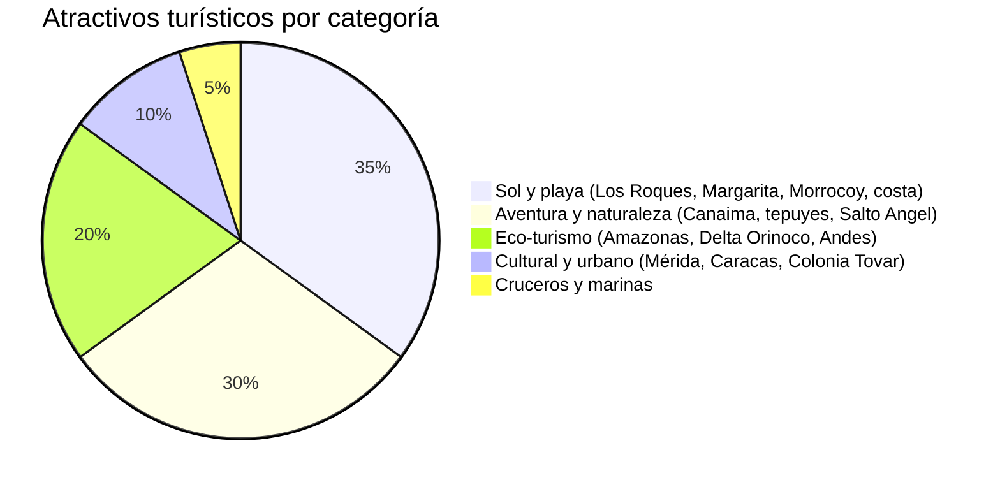
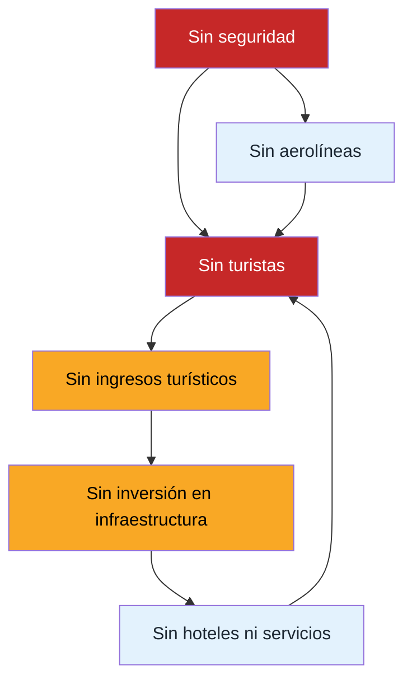
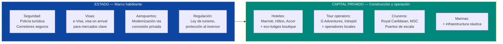
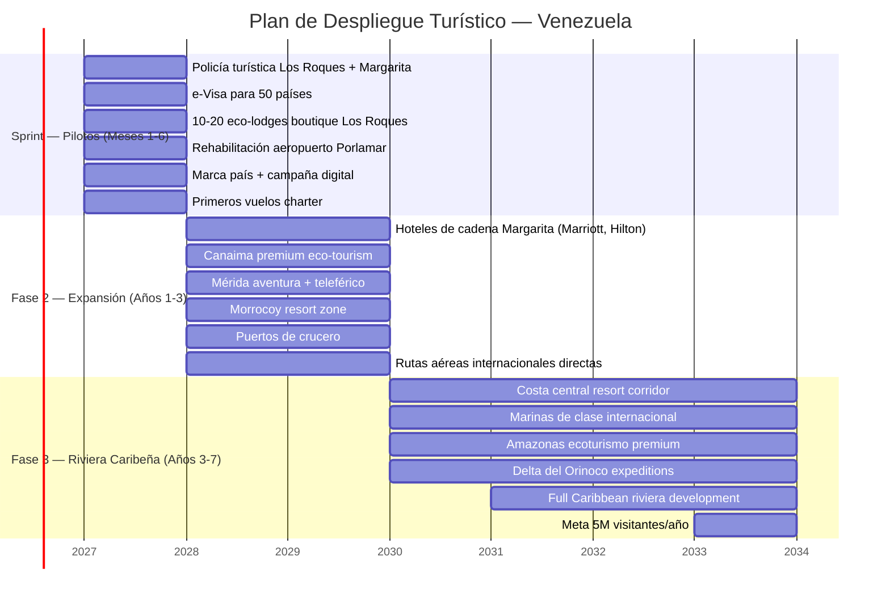
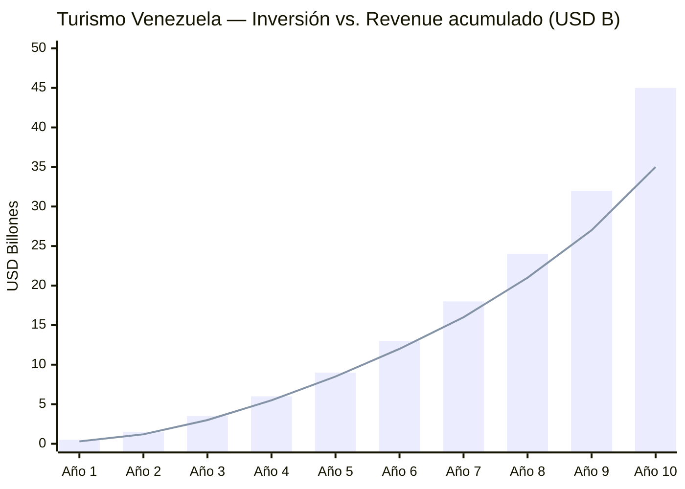

# Turismo: El Caribe Inexplorado

> Venezuela tiene el Salto Angel (la cascada más alta del mundo), un archipiélago caribeño virgen, tepuyes únicos en el planeta, selva amazónica, los Andes, y **2.800+ km de costa caribeña**. Todo esto con infraestructura turística en cero. El mercado caribeño mueve **USD 40B+/año**. Costa Rica pasó de cero a **3M+ visitantes** con eco-turismo. República Dominicana genera **USD 12B+/año** con sol y playa. Venezuela tiene más atractivos que ambos juntos — y cero competencia porque nadie ha construido nada.

---

## 1. La Oportunidad: USD 40B+ de Mercado y Cero Competencia

:::info El Caribe que falta
El Caribe recibe **~35 millones de turistas/año** en estadía y **~36 millones en cruceros**. República Dominicana sola captura **~12 millones de visitantes y USD 12B+/año**. Venezuela — con más costa caribeña, atractivos únicos en el mundo y precios potencialmente más bajos — captura **prácticamente cero**. No es un problema de demanda. Es un problema de oferta.
:::

| Dato | Cifra | Fuente |
|------|-------|--------|
| Mercado turismo Caribe (2025) | **~35M visitantes overnight + 36M cruceros** | [Caribbean Tourism Organization](https://tourismanalytics.com/caribbean-statistics.html) |
| Revenue turismo Caribe | **USD 40B+/año** | [Statista](https://www.statista.com/outlook/mmo/travel-tourism/caribbean) |
| Rep. Dominicana (2025) | **9,3M visitantes** (ene-oct), USD 15,5B valor agregado | [Dominican Today](https://dominicantoday.com/dr/tourism/2025/11/16/dominican-republic-shatters-record-attracts-9-2-million-visitors-through-october/) |
| Costa Rica turismo (2025) | **~3,5M visitantes**, USD 3,9B en ingresos | [Statista](https://www.statista.com/outlook/mmo/travel-tourism/costa-rica) |
| Colombia turismo (2024) | **6,2M turistas**, 4% del PIB | [Medellin Advisors](https://www.medellinadvisors.com/colombia-tourism-figures-2024-perspectives-2025/) |
| Venezuela turismo (2025) | **~2,8M visitantes** (ene-oct, cifra gobierno) | [Travel and Tour World](https://www.travelandtourworld.com/news/article/venezuela-sees-surge-in-tourism-with-over-two-million-international-visitors-in-this-year-boosting-its-appeal-as-a-south-american-destination/) |
| Eco-turismo global (crecimiento) | **12-15% anual** | [HOPE Research Group](https://www.hoperesearchgroup.com/blog/caribbean-eco-tourism-growth) |

### Lo que Venezuela tiene y nadie más ofrece

| Atractivo | Categoría | Unicidad | Comparable |
|-----------|-----------|----------|------------|
| **Salto Angel** | Cascada más alta del mundo (979 m) | Único en el planeta | Victoria Falls (Zambia/Zimbabwe) |
| **Los Roques** | Archipiélago coralino caribeño | Uno de los arrecifes más prístinos del Caribe | Islas Turks & Caicos, Maldivas |
| **Gran Sabana / Tepuyes** | Formaciones geológicas de 2.000M años | Únicos en el planeta — "El Mundo Perdido" de Conan Doyle | No hay comparable |
| **Canaima** | Parque Nacional, Patrimonio UNESCO | 30.000 km2 de selva y tepuyes | Torres del Paine (Chile), Yellowstone (EE.UU.) |
| **Isla de Margarita** | Isla caribeña con duty-free | Resort island con potencial masivo | Aruba, Curazao |
| **Morrocoy** | Cayos y arrecifes en el Caribe | Aguas turquesa, cayos vírgenes | Islas de la Bahía (Honduras) |
| **Mérida / Andes** | Montañas + teleférico más alto del mundo | Turismo de aventura + cultura andina | Cusco (Perú), Bariloche (Argentina) |
| **Delta del Orinoco** | Humedales + cultura Warao | Ecoturismo fluvial único | Pantanal (Brasil) |
| **Amazonas venezolano** | Selva tropical + comunidades indígenas | Biodiversidad extrema | Amazonas (Brasil/Ecuador) |
| **Costa caribeña** | **2.800+ km** | Más costa que cualquier isla caribeña individual | Riviera Maya (México) |

**Traducción para inversionistas:** Venezuela tiene el catálogo de atractivos turísticos más diverso del Caribe y Sudamérica — playa, montaña, selva, tepuyes, cascadas, arrecifes, todo en un solo país. El problema nunca fue demanda ni atractivo. Fue que no hay dónde quedarse, cómo llegar, ni seguridad para ir.

---

## 2. El Problema Actual: Por Qué Venezuela Tiene Cero Turismo Internacional Real

:::danger La realidad sin maquillaje
Venezuela tiene los atractivos de un destino de clase mundial y la infraestructura de un Estado fallido. La brecha entre el potencial y la realidad es la oportunidad de inversión.
:::

| Obstáculo | Severidad | Descripción |
|-----------|-----------|-------------|
| **Infraestructura hotelera destruida** | CRITICO | Hoteles de cadena abandonados o expropiados. No hay Marriott, Hilton ni Accor operando. Los que quedan son posadas artesanales sin estándar internacional |
| **Cero rutas aéreas internacionales reales** | CRITICO | Aeropuerto de Maiquetía deteriorado. Pocas rutas directas desde EE.UU./Europa. Las aerolíneas abandonaron Venezuela entre 2014-2019 |
| **Seguridad** | CRITICO | [Índice de criminalidad más alto del mundo](https://worldpopulationreview.com/country-rankings/crime-rate-by-country) (Numbeo 80,7). Sin policía turística. Sin corredores seguros |
| **Visa y entrada** | ALTO | Proceso opaco, sin visa electrónica, sin reciprocidad clara con mercados clave (EE.UU., UE, Canadá) |
| **Telecomunicaciones** | ALTO | Sin 4G/5G confiable en zonas turísticas. Sin Wi-Fi en la mayoría de destinos. [Solo 48% de hogares con internet](https://freedomhouse.org/country/venezuela/freedom-net/2024) |
| **Agua y saneamiento** | ALTO | Zonas turísticas sin agua potable confiable, tratamiento de aguas servidas colapsado |
| **Vialidad** | ALTO | Carreteras deterioradas. Ruta Caracas-Mérida (antes 10 horas) ahora puede tomar 14+. Sin señalización |
| **Cero marketing** | MEDIO | Venezuela no existe en el radar turístico mundial. Sin presencia en ferias (ITB, FITUR, WTM). Sin marca país |
| **Sistema de pagos** | MEDIO | Dolarización de facto pero sin POS/tarjetas confiables en zonas rurales. Sin integración con plataformas de booking |
| **Seguros de viaje** | MEDIO | La mayoría de aseguradoras internacionales excluyen Venezuela de sus pólizas |

### El ciclo vicioso actual

---

## 3. La Solucion: Estado Regula, Venezuela S.A. Invierte, Capital Privado Construye

El modelo es simple: ni el Estado ni Venezuela S.A. construyen hoteles ni operan aerolíneas. El Estado hace lo que solo el Estado puede hacer — **seguridad, marco legal, visas**. Venezuela S.A. aporta terrenos y permisos como equity en JVs con operadores privados, y cobra regalías como accionista del holding ciudadano. El capital privado construye y opera todo lo demás via concesiones.

### Lo que hace el Estado (y SOLO el Estado)

| Función | Acción concreta | Timeline | Modelo de referencia |
|---------|----------------|----------|---------------------|
| **Policía turística** | Crear cuerpo de 2.000+ agentes bilingues en zonas turísticas | 6-18 meses | Colombia — [Policía de Turismo](https://www.policia.gov.co/jefatura-nacional-del-servicio-de-policia/dipro/turismo) (941 agentes, múltiples idiomas) |
| **Corredores de seguridad** | Zonas turísticas con presencia policial 24/7, patrullas visibles, cámaras | 6-12 meses | México (Riviera Maya), Colombia (Cartagena) |
| **e-Visa** | Visa electrónica para 50+ países (EE.UU., UE, Canadá, UK, Japón, Corea, Australia) | 3-6 meses | Turquía, India, Kenia — implementaron e-Visa y triplicaron solicitudes |
| **Aeropuertos en concesión** | Licitar operación de Maiquetía, Porlamar, Mérida, Puerto Ordaz a operadores privados | 12-24 meses | Colombia (OPAIN opera El Dorado), México (GAP, OMA, ASUR) |
| **Marco legal turístico** | Ley de turismo moderna, protección al inversor, incentivos fiscales (IVA 0% en zonas turísticas por 10 años) | 6-12 meses | Rep. Dominicana (Ley 158-01 de incentivo turístico) |
| **Marca país** | Campaña internacional "Venezuela Is Open" — presencia en ITB Berlín, FITUR Madrid, WTM Londres | 3-6 meses | Colombia ("Colombia is Magical"), Costa Rica ("Pura Vida") |

### Lo que construye el capital privado (via concesiones)

| Sector | Oportunidad | Inversión estimada | Modelo |
|--------|-------------|-------------------|--------|
| **Hoteles de cadena** | 5.000-15.000 habitaciones nuevas (Marriott, Hilton, Accor, IHG) | USD 3-8B | Marriott firmó 94 deals en LATAM en 2025. Hilton superó 300 hoteles en la región — [Hilton](https://stories.hilton.com/releases/hilton-ends-2025-with-robust-luxury-and-lifestyle-growth-across-the-caribbean-and-latin-america) |
| **Eco-lodges boutique** | 200-500 propiedades boutique en Los Roques, Canaima, Mérida, Amazonas | USD 500M-1,5B | Costa Rica tiene 500+ eco-lodges certificados |
| **Tour operators** | Operaciones de aventura, eco-turismo, cultural | USD 100-300M | G Adventures, Intrepid Travel, National Geographic Expeditions |
| **Cruceros** | Puertos de escala en Margarita, costa central | USD 500M-1B | Caribe recibe ~36M cruceristas/año. Venezuela = cero |
| **Marinas** | 10-20 marinas de clase internacional | USD 300-800M | BVI, St. Martin — turismo náutico USD 5B+ en Caribe |
| **Restaurantes y retail** | Gastronomía, artesanía, duty-free | USD 200-500M | Margarita tenía zona franca — reactivable |

---

## 4. Fases de Despliegue

### Sprint: Meses 1-6 — Los Roques + Margarita como pilotos

:::tip Por qué Los Roques y Margarita primero
Son **islas**. El perímetro de seguridad es natural — el mar. El acceso es controlable (avioneta/ferry). La inversión en infraestructura es concentrada. Y Los Roques ya es un destino de culto entre quienes lo conocen — solo necesita eco-lodges decentes y vuelos confiables.
:::

| Acción | Detalle | Inversión | Responsable |
|--------|---------|-----------|-------------|
| **Policía turística** | 200 agentes bilingues entre Los Roques y Margarita | USD 5M/año | Gobierno |
| **e-Visa** | Sistema electrónico para 50+ nacionalidades. Aprobación en 48 horas | USD 2-5M | Gobierno + proveedor tech |
| **Eco-lodges Los Roques** | 10-20 propiedades boutique (8-20 hab. cada una). Energía solar, desalinización, cero impacto | USD 50-100M | Inversores privados / Airbnb Luxe |
| **Rehabilitación aeropuerto Porlamar** | Concesión a operador privado. Terminal nueva, duty-free | USD 50-100M | Concesionario privado |
| **Vuelos charter** | Acuerdos con Copa, JetBlue, LATAM para rutas Panamá-Margarita, Miami-Margarita | USD 0 (subsidio temporal de slots) | Gobierno + aerolíneas |
| **Campaña digital** | Influencers, National Geographic partnership, Travel + Leisure feature | USD 5-10M | Agencia de marketing + gobierno |
| **Conectividad** | Starlink en Los Roques + Margarita. 4G reforzado | USD 5-10M | Operadores privados |
| **TOTAL Sprint** | | **USD 120-230M** | |

### Fase 2: Años 1-3 — Canaima, Mérida, Morrocoy

| Destino | Inversión | Tipo de turismo | Capacidad meta |
|---------|-----------|----------------|----------------|
| **Margarita** — Resorts de cadena | USD 1-2B | Sol y playa, all-inclusive, conferencias | 5.000 habitaciones nuevas |
| **Canaima / Salto Angel** | USD 300-500M | Eco-turismo premium, aventura | 500 habitaciones eco-lodge + campamentos |
| **Mérida / Andes** | USD 200-400M | Aventura, montaña, teleférico, cultura | 1.000 habitaciones |
| **Morrocoy** | USD 300-500M | Resorts de playa, náutica | 2.000 habitaciones |
| **Puertos de crucero** | USD 500M-1B | Cruceros como puerto de escala | Capacidad para 500K+ cruceristas/año |
| **TOTAL Fase 2** | **USD 2,3-4,4B** | | |

### Fase 3: Años 3-7 — Riviera Caribeña Completa

| Destino | Inversión | Tipo de turismo | Capacidad meta |
|---------|-----------|----------------|----------------|
| **Costa central** (Choroní, Chichiriviche, Tucacas) | USD 1-2B | Resort corridor tipo Riviera Maya | 5.000 habitaciones |
| **Marinas** | USD 300-800M | Turismo náutico, yachting | 10-20 marinas |
| **Amazonas venezolano** | USD 100-200M | Eco-turismo expedición | 200 habitaciones eco-lodge |
| **Delta del Orinoco** | USD 50-100M | Expediciones fluviales, cultura Warao | 100 habitaciones flotantes |
| **Gran Sabana carretera** | USD 200-400M | Road trip + posadas + tepuyes | 500 habitaciones |
| **TOTAL Fase 3** | **USD 1,7-3,5B** | | |

---

## 5. Infraestructura Requerida

| Componente | Qué se necesita | Costo estimado | Timeline | Quién lo provee |
|------------|----------------|----------------|----------|-----------------|
| **Aeropuerto Maiquetía** | Modernización terminal internacional, nueva pista, sistemas de navegación | USD 500M-1B | 2-4 años | Concesionario privado (modelo El Dorado, Bogotá) |
| **Aeropuerto Porlamar** | Rehabilitación total, nueva terminal, duty-free | USD 100-200M | 1-2 años | Concesionario privado |
| **Aeropuerto Mérida** | Ampliación pista, terminal nueva | USD 50-100M | 1-2 años | Concesionario privado |
| **Aeropuerto Puerto Ordaz** | Hub para Canaima, mejora de terminal | USD 50-100M | 1-2 años | Concesionario privado |
| **Pista Canaima** | Rehabilitación para aviones medianos (ATR-72) | USD 20-50M | 6-12 meses | Gobierno + concesionario |
| **Carreteras turísticas** | Rehabilitación rutas clave: Caracas-Mérida, Caracas-Morrocoy, Puerto Ordaz-Santa Elena | USD 1-2B | 2-5 años | Concesiones con peaje |
| **Puertos de crucero** | 2-3 terminales de cruceros (Margarita, La Guaira, Puerto Cabello) | USD 500M-1B | 2-4 años | Concesionario privado |
| **Hoteles** | 10.000-20.000 habitaciones nuevas | USD 3-8B | 2-7 años | Cadenas hoteleras + inversores |
| **Telecomunicaciones** | 4G/5G en zonas turísticas, Wi-Fi público, fibra óptica | USD 200-400M | 1-3 años | Operadores telecoms |
| **Agua y saneamiento** | Plantas de tratamiento, desalinización en islas, acueductos | USD 300-600M | 2-4 años | Concesiones + multilaterales |
| **Electricidad** | Generación y distribución confiable en zonas turísticas | USD 200-500M | 1-3 años | Ver [Capacidad Eléctrica](./capacidad-electrica) |
| **Marinas** | 10-20 marinas de clase internacional | USD 300-800M | 2-5 años | Inversores náuticos privados |
| **TOTAL** | | **USD 6,2-14,8B** | **1-7 años** | |

:::caution Nota sobre costos
La infraestructura turística se financia con retorno directo: hoteles generan revenue, aeropuertos cobran tasas, carreteras cobran peaje, puertos cobran atraque. **No es gasto público — es inversión privada con retorno.** El Estado solo financia policía turística, visas y marco regulatorio (~USD 50-100M/año).
:::

---

## 6. Modelo de Negocio

### Flujos de ingreso por actor

| Actor | Rol | Revenue model | Ingreso estimado (año 7) |
|-------|-----|---------------|-------------------------|
| **Cadenas hoteleras** | Construyen y operan hoteles | Revenue por habitación (ADR USD 150-300) | USD 2-4B/año |
| **Eco-lodges** | Turismo boutique premium | ADR USD 200-500 (nicho alto valor) | USD 300-600M/año |
| **Tour operators** | Excursiones, aventura, cultural | USD 50-200/persona/día | USD 500M-1B/año |
| **Cruceros** | Puertos de escala | Tasa portuaria + gasto en tierra (USD 100-150/crucerista) | USD 300-500M/año |
| **Aerolíneas** | Vuelos internacionales | Tasas aeroportuarias + tráfico | USD 200-400M/año |
| **Restaurantes / retail** | Gastronomía, artesanía, duty-free | Gasto turista promedio | USD 500M-1B/año |
| **Gobierno** | Impuestos, tasas, concesiones | 15% flat + IVA 12% + tasas aeroportuarias/portuarias | USD 1-2B/año |

### Concesiones a cadenas internacionales

| Cadena | Oportunidad | Formato | Precedente en la región |
|--------|-------------|---------|------------------------|
| **Marriott** | Margarita, Caracas, costa central | JW Marriott Resort, Autograph Collection | 555 hoteles en LATAM (2025), [94 deals firmados en 2025](https://www.travelpulse.com/news/hotels-and-resorts/marriott-international-outlines-2025-expansion-in-caribbean-latin-america-region) |
| **Hilton** | Margarita, Mérida, Los Roques (Curio) | Hilton Resort, Conrad, Curio Collection | [300+ hoteles en LATAM](https://stories.hilton.com/releases/hilton-ends-2025-with-robust-luxury-and-lifestyle-growth-across-the-caribbean-and-latin-america), 150 en pipeline |
| **Accor** | Caracas, Margarita, costa | Sofitel, Fairmont, MGallery | Fuerte presencia en Brasil y Colombia |
| **IHG** | Margarita, Morrocoy | InterContinental, Holiday Inn Resort | Expansión agresiva en Caribe |
| **Selina / boutique** | Mérida, Canaima, Los Roques | Hostel premium + co-working | Modelo probado en Colombia, Costa Rica, Panamá |
| **Airbnb** | Todo el país | Plataforma + Airbnb Luxe | [Requiere investigación] sobre marco regulatorio |

### Gasto turístico por visitante (proyección)

| Segmento | Gasto diario promedio | Estadía promedio | Gasto total por visita |
|----------|----------------------|------------------|----------------------|
| **Sol y playa (all-inclusive)** | USD 200-350 | 5-7 días | USD 1.000-2.450 |
| **Eco-turismo premium** | USD 250-500 | 4-6 días | USD 1.000-3.000 |
| **Aventura (Canaima, tepuyes)** | USD 150-300 | 3-5 días | USD 450-1.500 |
| **Crucero (escala)** | USD 100-150 | 1 día | USD 100-150 |
| **Backpacker / budget** | USD 50-100 | 7-14 días | USD 350-1.400 |
| **Promedio ponderado** | **~USD 180** | **~5 días** | **~USD 900** |

---

## 7. Seguridad: El Prerequisito Existencial

:::danger Sin seguridad, cero turistas
Un solo incidente viral en redes sociales — un turista asaltado, secuestrado o asesinado — destruye años de esfuerzo de marketing. La seguridad turística no es un "nice to have". Es la **condición sine qua non** de toda la estrategia. Colombia lo entendió. México lo sigue aprendiendo.
:::

### Modelo: Policía de Turismo de Colombia

Colombia es el comparable perfecto. País con pasado violento que se reinventó como destino turístico pasando de **0,5M visitantes (2003) a 6,2M (2024)**. Un pilar central: la [Policía de Turismo](https://www.policia.gov.co/jefatura-nacional-del-servicio-de-policia/dipro/turismo).

| Elemento | Modelo Colombia | Adaptación Venezuela |
|----------|----------------|---------------------|
| **Agentes** | 941 policías turísticos en 51 zonas | 2.000+ agentes en 10 zonas turísticas prioritarias |
| **Idiomas** | Inglés, portugués, francés, chino, lengua de señas | Inglés, portugués, francés (mínimo) |
| **Funciones** | Orientación, vigilancia, control de operadores, atención de denuncias | Idénticas + patrullas de playa y montaña |
| **Patrullas** | Bicicleta, motocicleta, a pie | + patrullas náuticas en Los Roques, Morrocoy, Margarita |
| **Tecnología** | Vehículos con tecnología de monitoreo | Cámaras con IA, app para reportes en tiempo real, botón de pánico |
| **Resultado** | Colombia pasó de país "no-go" a top 5 destinos en LATAM | Objetivo: eliminar Venezuela del advisory de "do not travel" en 3 años |

### Corredores de seguridad turística

| Corredor | Ruta | Medidas |
|----------|------|---------|
| **Los Roques** | Perímetro natural (islas) | Control de acceso marítimo/aéreo, policía turística en Gran Roque y cayos principales |
| **Margarita** | Isla completa | Policía turística, cámaras en zonas hoteleras, patrullas de playa |
| **Canaima - Salto Angel** | Aeropuerto Canaima → campamentos → río Churún | Guías certificados obligatorios, GPS tracking, comunicación satelital |
| **Mérida** | Ciudad + teleférico + pueblos andinos | Policía turística urbana + patrullas de montaña |
| **Morrocoy** | Parque Nacional + cayos | Control de acceso, patrullas náuticas, zonas de baño supervisadas |
| **Costa central** (Choroní, Chuao) | Carretera Maracay-Choroní + playas | Patrullas viales, policía en playas, iluminación |

### Seguro de viaje internacional

| Acción | Detalle | Timeline |
|--------|---------|----------|
| **Convenio con aseguradoras** | Negociar con World Nomads, Allianz, AXA inclusión de Venezuela en pólizas estándar | 6-12 meses |
| **Fondo de garantía turística** | Gobierno crea fondo para cubrir emergencias de turistas (modelo Turquía) | 3-6 meses |
| **Asistencia 24/7** | Línea de emergencia turística multilingue (911 turístico) | 3-6 meses |
| **Hospital de referencia** | Al menos 1 clínica privada con estándar JCI en cada zona turística | 1-3 años |

---

## 8. Proyeccion: De Cero a USD 15B/Ano

### Proyección a 10 años

| Año | Visitantes internacionales | Revenue turístico | Habitaciones hoteleras | Empleos directos | Empleos totales (con multiplicador) |
|-----|---------------------------|-------------------|----------------------|-------------------|--------------------------------------|
| **1** | 500K | USD 450M | 3.000 | 15.000 | 45.000 |
| **2** | 800K | USD 720M | 5.000 | 25.000 | 75.000 |
| **3** | 1,2M | USD 1,1B | 8.000 | 40.000 | 120.000 |
| **4** | 1,8M | USD 1,6B | 12.000 | 60.000 | 180.000 |
| **5** | 2,5M | USD 2,3B | 15.000 | 80.000 | 240.000 |
| **6** | 3M | USD 3B | 18.000 | 100.000 | 300.000 |
| **7** | 3,5M | USD 4B | 20.000 | 120.000 | 360.000 |
| **8** | 4M | USD 5B | 22.000 | 140.000 | 420.000 |
| **9** | 4,5M | USD 7B | 25.000 | 160.000 | 480.000 |
| **10** | 5M | USD 10-15B | 30.000 | 200.000 | 500.000+ |

:::caution Supuestos de la proyección
- **Gasto promedio por turista:** USD 900 (año 1) escalando a USD 2.000-3.000 (año 10) a medida que sube el segmento de lujo y eco-premium
- **Tasa de ocupación:** 45% (año 1) escalando a 75% (año 7+)
- **Multiplicador de empleo:** 3x (estándar de la industria turística — [WTTC](https://wttc.org/))
- **No incluye turismo doméstico** — que puede duplicar las cifras
- **Precio base conservador** — Rep. Dominicana genera USD 12B+ con 11M visitantes; Venezuela podría alcanzar cifras similares con oferta premium
- **Asume resolución de seguridad y sanciones en años 1-2**
:::

### Revenue acumulado vs. inversión

*Barras = revenue acumulado. Línea = inversión acumulada.*

### Contribución al PIB

| Métrica | Año 5 | Año 10 |
|---------|-------|--------|
| Revenue turístico | USD 2,3B | USD 10-15B |
| % del PIB (base USD 83B) | **2,8%** | **12-18%** |
| Impuestos generados (15% + IVA) | USD 350-500M | USD 1,5-2,5B |
| Empleos totales | 240.000 | 500.000+ |

---

## 9. Comparables Internacionales

| País | Situación inicial | Qué hicieron | Resultado | Lección para Venezuela |
|------|------------------|-------------|-----------|------------------------|
| **Costa Rica** | País agrícola sin turismo. Años 80: <300K visitantes | Apuesta por eco-turismo. 25% del territorio como área protegida. Marca "Pura Vida". Cero ejército → presupuesto a parques | **3,5M+ visitantes**, USD 3,9B/año, **~8% del PIB**. Meta 5,2M para 2035 — [Costa Rica Tourism Plan](https://ticosland.com/costa-rica-launches-ambitious-plan-to-attract-5-million-tourists/) | Venezuela tiene más biodiversidad, más costa, más atractivos únicos. El eco-turismo es la puerta de entrada |
| **Rep. Dominicana** | Isla pobre en los 70s. Sin infraestructura turística | Ley 158-01 de incentivos: exención total de impuestos por 15 años a hoteles. Aeropuertos en concesión. All-inclusive masivo | **11-12M visitantes**, **USD 12B+/año**, 815K empleos, 77% ocupación — [Dominican Today](https://dominicantoday.com/dr/tourism/2025/11/16/dominican-republic-shatters-record-attracts-9-2-million-visitors-through-october/) | El modelo all-inclusive funciona para volumen. Los incentivos fiscales atraen cadenas. Venezuela puede replicar en Margarita |
| **Colombia** | País en guerra civil. 2003: 0,5M visitantes. "Do not travel" | Acuerdos de paz (2016). Policía de turismo. Marca "Colombia is Magical". Netflix (Narcos) como marketing involuntario | **6,2M turistas (2024)**, 4% del PIB, crecimiento 11% anual — [Colombia One](https://colombiaone.com/2025/07/04/colombia-international-visitors-tourism-grows/) | El comparable más directo: país post-conflicto que construye turismo desde cero. La policía turística es clave |
| **Croacia** | Post-guerra Yugoslavia (1995). Infraestructura destruida | Inversión en costas (Dubrovnik, Split). UE como marco. Game of Thrones como catalizador | **20M+ visitantes**, 20% del PIB | País post-conflicto con costa. Tamaño similar. Turismo como motor económico principal |
| **Ruanda** | Post-genocidio (1994). País destruido | Gorilas de montaña como ancla. Permisos a USD 1.500/persona. "Visit Rwanda" en camisetas del Arsenal | **1,8M visitantes**, USD 620M/año, turismo = principal fuente de divisas | Turismo de nicho ultra-premium. Venezuela puede hacer lo mismo con tepuyes y Salto Angel |

:::tip La lección de Colombia
Colombia pasó de ser el país más peligroso del hemisferio a recibir **6,2 millones de turistas en 2024** — un crecimiento de **12x en 20 años**. Lo hicieron con tres cosas: seguridad (policía turística), marketing (marca país) e infraestructura (aeropuerto El Dorado, carreteras). Venezuela tiene más atractivos naturales que Colombia. Solo necesita replicar la fórmula.
:::

---

## 10. Aliados Potenciales

| Empresa/Entidad | Rol | Por qué participarían |
|------------------|-----|----------------------|
| **Marriott International** | Cadena hotelera ancla | [94 deals en LATAM en 2025](https://www.travelpulse.com/news/hotels-and-resorts/marriott-international-outlines-2025-expansion-in-caribbean-latin-america-region). Expansión agresiva en Caribe. Venezuela = greenfield total |
| **Hilton** | Cadena hotelera | [300+ hoteles en LATAM](https://stories.hilton.com/releases/hilton-ends-2025-with-robust-luxury-and-lifestyle-growth-across-the-caribbean-and-latin-america), 150 en pipeline. Marcas como Curio Collection perfectas para eco-lodges |
| **Accor** | Cadena hotelera (Sofitel, Fairmont) | Fuerte en Brasil y Colombia. Margarita y Caracas como expansión natural |
| **Royal Caribbean / MSC** | Líneas de cruceros | Caribe es su mercado #1. Venezuela = nuevo puerto de escala con atractivos únicos |
| **Copa Airlines** | Hub Panamá → conexiones LATAM | Ya vuela a Venezuela. Capacidad para aumentar frecuencias rápidamente |
| **JetBlue** | Bajo costo EE.UU. → Caribe | Domina rutas Caribe desde EE.UU. Venezuela = mercado virgen |
| **LATAM Airlines** | Mayor aerolínea de Sudamérica | Conexiones desde Santiago, Lima, Bogotá, São Paulo |
| **American / United / Delta** | Majors EE.UU. | Volaban a Venezuela pre-crisis. Reactivar rutas con demanda latente |
| **Airbnb** | Plataforma de alojamiento | Venezuela = mercado virgen. Pueden impulsar eco-lodges y experiencias |
| **G Adventures / Intrepid** | Tour operators aventura | Especializados en destinos emergentes post-conflicto. Ya operan en Colombia |
| **National Geographic** | Media + expediciones | Canaima y tepuyes = contenido de clase mundial. Partnership para documentales + tours |
| **UNWTO** | Organización Mundial del Turismo | Asistencia técnica para desarrollo turístico sostenible. Credibilidad internacional |
| **BID / CAF** | Financiamiento multilateral | Préstamos para infraestructura turística (aeropuertos, carreteras, agua) |
| **IFC (Banco Mundial)** | Financiamiento privado | Inversión en proyectos hoteleros y turísticos en mercados frontera |

---

## 11. Riesgos y Mitigaciones

| # | Riesgo | Prob. | Impacto | Mitigación |
|---|--------|-------|---------|------------|
| 1 | **Incidente de seguridad viral** — turista asaltado/secuestrado en redes sociales | Alta | Crítico | Policía turística desde día 1. Zonas piloto en islas (perímetro natural). Protocolo de respuesta rápida. Seguro de garantía turística |
| 2 | **Sanciones no se levantan** — aerolíneas y cadenas no pueden operar | Media-Alta | Crítico | Comenzar con operadores no-estadounidenses (Accor, Air France). Buscar licencias OFAC específicas para turismo (modelo Chevron) |
| 3 | **Infraestructura no se construye a tiempo** — aeropuertos, carreteras | Media | Alto | Concesiones con penalidades. Priorizar destinos insulares que requieren menos infraestructura terrestre |
| 4 | **Desastre natural** — huracán, inundación | Media-Baja | Alto | Venezuela está al sur del cinturón de huracanes (ventaja vs. resto del Caribe). Seguros de infraestructura |
| 5 | **Competencia regional** — RD, Colombia, Costa Rica capturan toda la demanda | Media | Medio | Diferenciación: tepuyes, Salto Angel, Los Roques son únicos. Competir en precio + exclusividad, no en volumen inicialmente |
| 6 | **Cadenas no aceptan el riesgo** — Marriott/Hilton dicen "todavía no" | Media | Medio | Comenzar con operadores boutique y aventureros (Selina, G Adventures). Las cadenas entrarán cuando vean tracción |
| 7 | **Daño ambiental** — desarrollo turístico destruye lo que lo hace atractivo | Media | Alto | Zonificación estricta. Capacidad de carga por destino. Certificación eco-turismo obligatoria. Modelo Costa Rica |
| 8 | **Corrupción en concesiones** — licitaciones amañadas, sobrecostos | Alta | Medio | Transparencia total. Licitaciones internacionales públicas. Auditoría Big 4. Gobernanza tipo [Santiago Principles](https://www.ifswf.org/santiago-principles) |

---

## 12. Call to Action

### Para una cadena hotelera (Marriott, Hilton, Accor)

| Requisito | Estado | Quién lo resuelve |
|-----------|--------|-------------------|
| Seguridad en zona turística | Policía turística en proceso | Gobierno |
| Terrenos con título limpio | Requiere resolución de expropiaciones | Gobierno + tribunales |
| Incentivos fiscales (modelo RD Ley 158-01) | Requiere legislación | Gobierno |
| Aeropuerto funcional | Concesión en proceso | Operador privado |
| Demanda comprobada | Vuelos charter + primeros eco-lodges como proof of concept | Sprint (meses 1-6) |
| Levantamiento de sanciones (si aplica) | En negociación | Gobierno de EE.UU. |

### Para un inversionista financiero

| Criterio | Venezuela Turismo |
|----------|-------------------|
| **TAM** | USD 40B+ mercado turístico Caribe |
| **SAM** | USD 12-15B (comparable Rep. Dominicana) |
| **SOM** | USD 2-5B/año en año 5-7 (2,5-5M visitantes) |
| **Ventaja competitiva** | Atractivos únicos (tepuyes, Salto Angel, Los Roques). Costa de 2.800+ km. Precios bajos por economía dolarizada deprimida |
| **Moat** | No se pueden replicar tepuyes ni Salto Angel. Geografía es ventaja permanente |
| **Riesgo principal** | Seguridad + riesgo político. Mitigado con zonas piloto insulares, policía turística, seguros MIGA |
| **Comparable** | Colombia: 0,5M → 6,2M visitantes en 20 años. Croacia: post-guerra → 20M visitantes. Costa Rica: agrícola → 3,5M turistas eco |
| **Exit** | Venta de cadena hotelera o portafolio de eco-lodges a REIT turístico. IPO de operador |

### Siguiente paso concreto

1. **Sprint Los Roques** — 10 eco-lodges boutique + policía turística + vuelos charter. Proof of concept en 6 meses
2. **e-Visa** — Sistema electrónico para 50+ nacionalidades. Implementable en 3 meses con proveedor tech
3. **Concesión aeropuerto Porlamar** — Licitación internacional. Signal al mercado
4. **Marca país** — Campaña "Venezuela Is Open" con National Geographic partnership
5. **MoU con Marriott o Hilton** — Carta de intención para 5-10 propiedades en Margarita y costa central

:::info Este no es un sueño — es un mercado de USD 40B+ esperando
República Dominicana genera USD 12B+/año con sol y playa. Colombia genera USD 9,5B/año habiendo empezado desde la guerra. Costa Rica genera USD 3,9B/año con eco-turismo. Venezuela tiene más costa, más biodiversidad, más atractivos únicos y precios más bajos que los tres. La infraestructura se construye. Los atractivos no se inventan. Y Venezuela los tiene.
:::

---

## Documentos Relacionados

- [Vialidad y Logistica](./vialidad-logistica) — Carreteras, aeropuertos y corredores de transporte necesarios para conectar destinos turisticos
- [Transporte Maritimo](./transporte-maritimo) — Terminales de cruceros, ferris inter-insulares y acceso a islas como Los Roques y Margarita
- [Telecomunicaciones](./telecomunicaciones) — Conectividad Starlink y 5G para destinos turisticos remotos y nomadas digitales
- [Agua y Saneamiento](./agua-saneamiento) — Agua potable y saneamiento en destinos costeros e insulares
- [Capacidad Electrica](./capacidad-electrica) — Electricidad confiable para hoteles, aeropuertos y destinos
- [Construccion e Inmobiliaria](./construccion-inmobiliaria) — Hoteles, resorts y vivienda para zonas turisticas
- [Modelo de Concesiones](./modelo-concesiones) — Marco de concesiones para aeropuertos, hoteles y operadores turisticos

---

## Fuentes Consolidadas

| # | Fuente | URL | Dato |
|---|--------|-----|------|
| 1 | Caribbean Tourism Organization / Tourism Analytics | [tourismanalytics.com](https://tourismanalytics.com/caribbean-statistics.html) | ~35M visitantes overnight, ~36M cruceros en Caribe |
| 2 | Statista | [statista.com](https://www.statista.com/outlook/mmo/travel-tourism/caribbean) | Revenue turismo Caribe USD 40B+ |
| 3 | Dominican Today | [dominicantoday.com](https://dominicantoday.com/dr/tourism/2025/11/16/dominican-republic-shatters-record-attracts-9-2-million-visitors-through-october/) | RD 9,3M visitantes (ene-oct 2025), USD 15,5B valor agregado |
| 4 | Travel and Tour World | [travelandtourworld.com](https://www.travelandtourworld.com/news/article/venezuela-sees-surge-in-tourism-with-over-two-million-international-visitors-in-this-year-boosting-its-appeal-as-a-south-american-destination/) | Venezuela 2,8M visitantes (ene-oct 2025, cifra gobierno) |
| 5 | Hilton | [stories.hilton.com](https://stories.hilton.com/releases/hilton-ends-2025-with-robust-luxury-and-lifestyle-growth-across-the-caribbean-and-latin-america) | 300+ hoteles en LATAM, 150 en pipeline |
| 6 | Marriott / TravelPulse | [travelpulse.com](https://www.travelpulse.com/news/hotels-and-resorts/marriott-international-outlines-2025-expansion-in-caribbean-latin-america-region) | 94 deals en LATAM en 2025, 555 hoteles |
| 7 | Medellin Advisors | [medellinadvisors.com](https://www.medellinadvisors.com/colombia-tourism-figures-2024-perspectives-2025/) | Colombia 6,2M turistas (2024), 4% PIB |
| 8 | Colombia One | [colombiaone.com](https://colombiaone.com/2025/07/04/colombia-international-visitors-tourism-grows/) | Colombia turismo crecimiento 2025 |
| 9 | Policía Nacional de Colombia | [policia.gov.co](https://www.policia.gov.co/jefatura-nacional-del-servicio-de-policia/dipro/turismo) | Policía de Turismo: 941 agentes, 51 zonas |
| 10 | Statista (Costa Rica) | [statista.com](https://www.statista.com/outlook/mmo/travel-tourism/costa-rica) | Costa Rica ~3,5M visitantes, USD 3,9B |
| 11 | Ticos Land | [ticosland.com](https://ticosland.com/costa-rica-launches-ambitious-plan-to-attract-5-million-tourists/) | Costa Rica meta 5,2M visitantes para 2035 |
| 12 | HOPE Research Group | [hoperesearchgroup.com](https://www.hoperesearchgroup.com/blog/caribbean-eco-tourism-growth) | Eco-turismo Caribe crece 12-15% anual |
| 13 | Freedom House 2024 | [freedomhouse.org](https://freedomhouse.org/country/venezuela/freedom-net/2024) | 48% hogares con internet en Venezuela |
| 14 | World Population Review / Numbeo | [worldpopulationreview.com](https://worldpopulationreview.com/country-rankings/crime-rate-by-country) | Venezuela #1 índice criminalidad (80,7) |
| 15 | WTTC | [wttc.org](https://wttc.org/) | Multiplicador empleo turístico: 3x |
