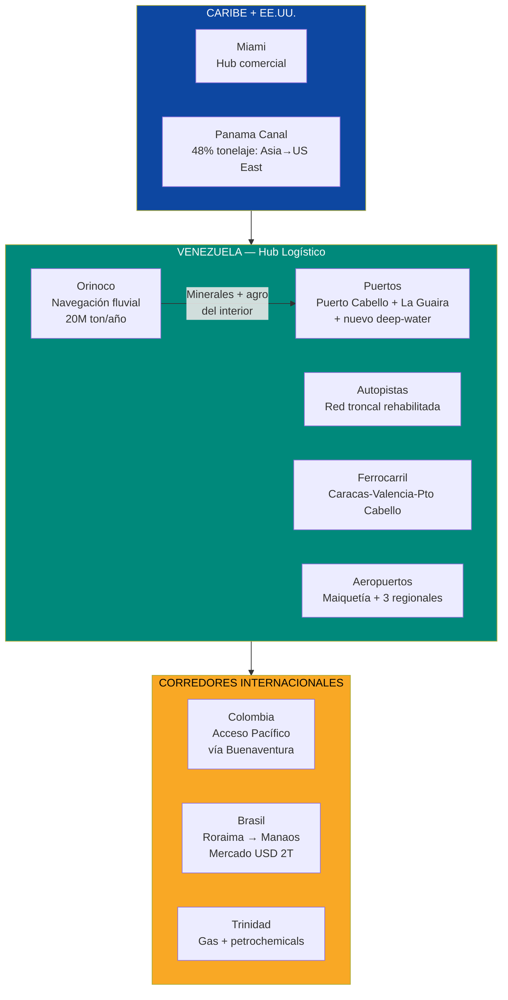
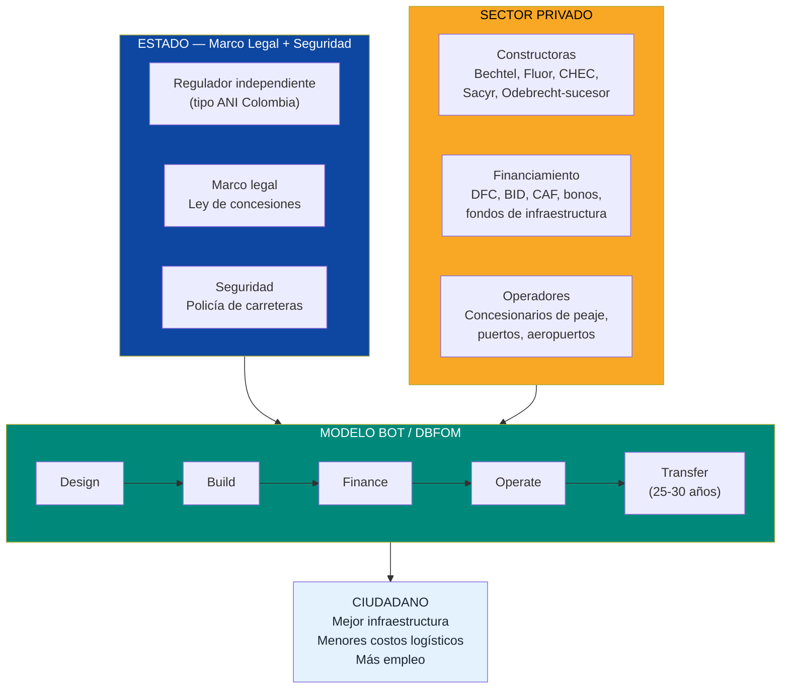
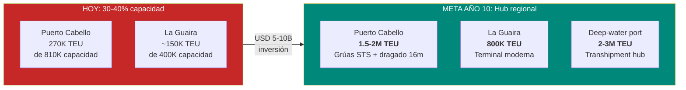
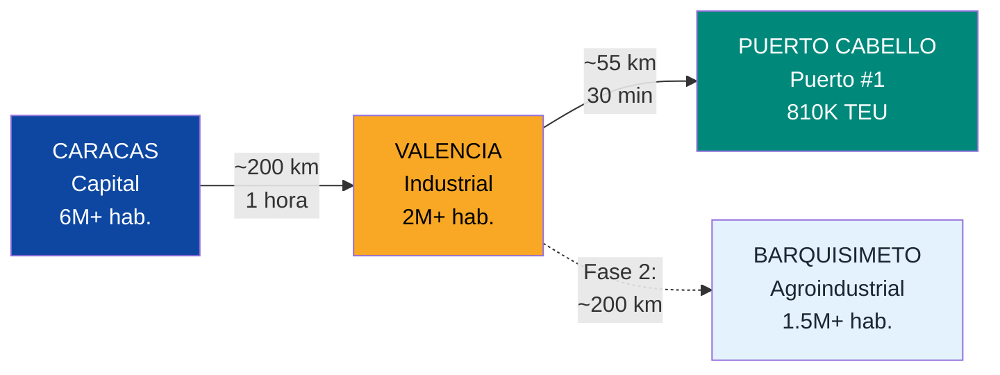
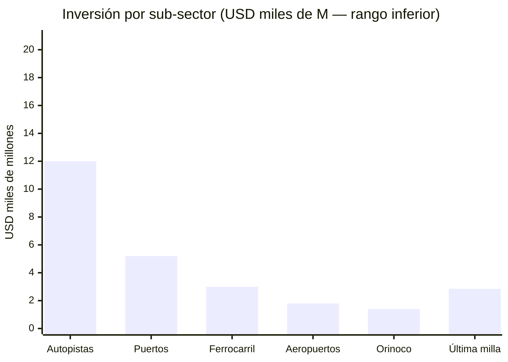
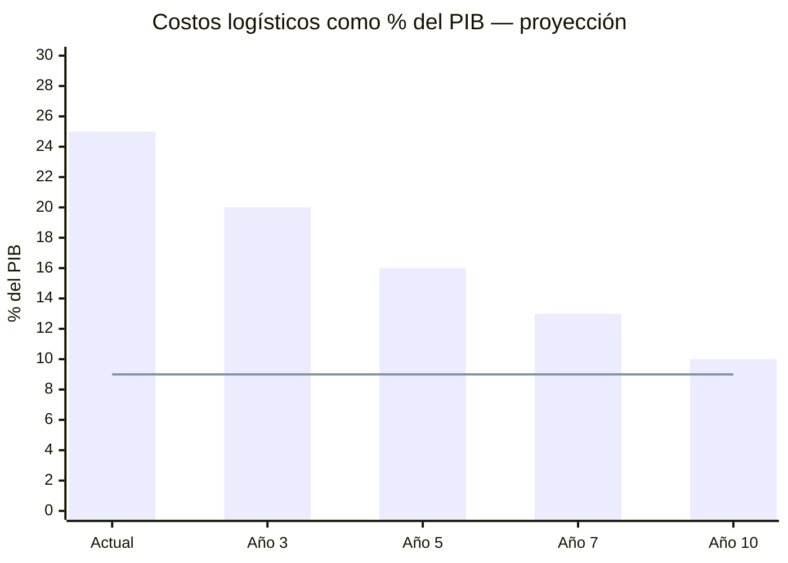
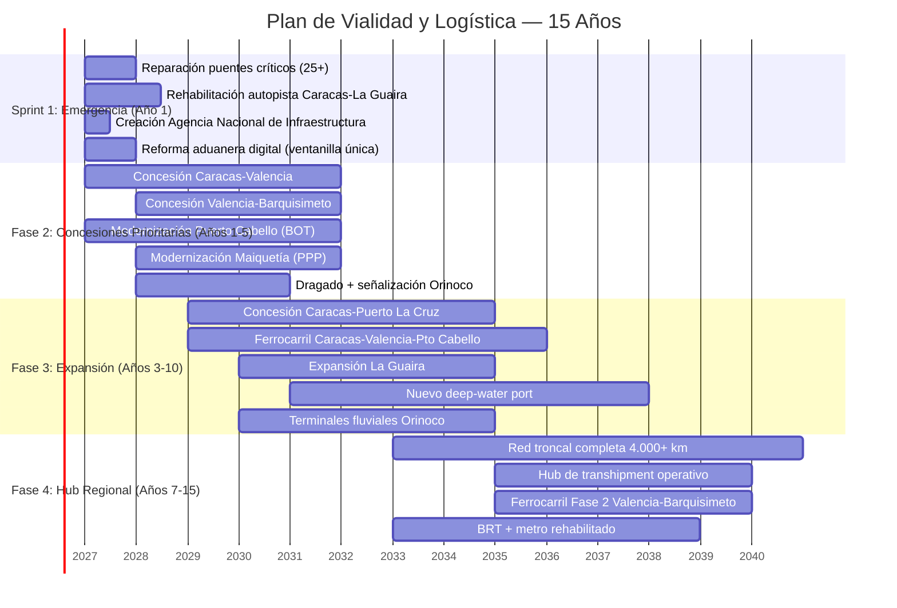

# Vialidad y Logistica: El Sistema Circulatorio de la Reconstruccion

:::caution Fechas ilustrativas — las fases se activan por KPIs, no por calendario
Las referencias a "Año X" en este documento son **ilustrativas**. Las fases reales se activan por condiciones verificables (PIB/cápita, formalización, pobreza). Ver [KPIs de Activación](/07-ejecucion/kpis-activacion).
:::

> Venezuela está sentada sobre una de las posiciones geográficas más privilegiadas del hemisferio — entre el Caribe, el Pacífico (vía Colombia), el Atlántico (vía Brasil) y a tiro de piedra del Canal de Panamá. Pero hoy no puede mover un contenedor de Puerto Cabello a Barquisimeto sin que cueste más que enviarlo desde Shanghái. El sistema circulatorio del país está infartado. Repararlo no es un gasto — es el prerequisito para que todo lo demás funcione.

---

## 1. La Oportunidad: Corredor Comercial entre Tres Océanos

:::info Posición geográfica estratégica
Venezuela tiene **2.800 km de costa caribeña**, frontera directa con Colombia (acceso al Pacífico), frontera con Brasil (acceso al Atlántico sur), proximidad al Canal de Panamá y al triángulo de transhipment del Caribe (Freeport-Colón-Port of Spain). Ningún otro país de la región tiene acceso simultáneo a estas tres rutas comerciales.
:::

| Ventaja geográfica | Dato | Implicación |
|---------------------|------|-------------|
| **Costa caribeña** | 2.800 km con puertos naturales | Acceso directo a rutas Caribe-EE.UU.-Europa |
| **Proximidad a Panamá** | ~1.200 km a Colón | Conexión a la ruta Asia-EE.UU. East Coast (48% del tonelaje del Canal) |
| **Frontera Colombia** | 2.219 km | Acceso al Pacífico vía Buenaventura; corredor comercial CAN |
| **Frontera Brasil** | 2.200 km | Acceso al mercado más grande de LATAM (USD 2T PIB) |
| **Río Orinoco navegable** | 450 km (Ciudad Guayana → delta) | Transporte fluvial de minerales y carga pesada; capacidad **20 M ton/año** |
| **Red vial existente** | ~96.000 km (paved + unpaved) | Base para rehabilitación — no se parte de cero |

### Por qué Venezuela puede ser un hub logístico regional

El Caribe maneja el **80% del comercio hemisférico** entre Asia, Europa y las Américas. Los hubs actuales — Panamá (Colón), Colombia (Cartagena), Jamaica (Kingston) — están alcanzando su capacidad. Venezuela, con puertos infrautilizados, río Orinoco navegable y posición geográfica intermedia, puede capturar una porción significativa del flujo de carga si resuelve tres problemas: infraestructura, seguridad jurídica y eficiencia aduanera.

---

## 2. El Problema Actual: Radiografía de un Colapso Logístico

:::danger Costos logísticos insostenibles
En LATAM, los costos logísticos representan **16-26% del PIB** vs. 9% en países OCDE — [Banco Mundial / CEPAL](https://copenhagenconsensus.com/sites/default/files/infrastructure_guasch_sp_final.pdf). Venezuela está en el extremo superior: red vial destruida, puertos al 30-40% de capacidad, cero ferrocarril operativo y costos de transporte que representan hasta **35% del valor del producto**. Cada kilómetro de carretera deteriorada es un impuesto invisible a los 40 millones de venezolanos.
:::

### 2.1 Carreteras y autopistas

| Indicador | Venezuela (2025) | Promedio LATAM | OCDE |
|-----------|-----------------|----------------|------|
| Red vial total | ~96.000 km | — | — |
| % pavimentado | ~33% | 25-50% | 80-100% |
| Calidad de carreteras (1-7) | **2,6** (2019, último dato) | 3,5-4,5 | 5,0-6,0 |
| Puentes colapsados (2024-2025) | **25+ solo en región andina** | — | — |
| Sistemas de peaje | Inexistentes/abandonados | Electrónicos | Free-flow |

Fuentes: [TheGlobalEconomy](https://www.theglobaleconomy.com/Venezuela/roads_quality/); [Venezuelanalysis](https://venezuelanalysis.com/news/venezuela-deploys-nationwide-task-force-after-heavy-rains-cut-off-thousands-and-damage-road-infrastructure/).

**Eventos recientes:**
- Colapso del viaducto de la autopista José Antonio Páez en Portuguesa (2025) — aisló comunidades enteras
- 25 puentes destruidos en la región andina por lluvias torrenciales — 16 completamente destruidos
- Viaducto La Cabrera en deterioro permanente por falta de mantenimiento
- La autopista Caracas-La Guaira (la más importante del país) requiere intervención integral

### 2.2 Puertos

| Puerto | Capacidad instalada (TEU) | Throughput real (est.) | % utilización | Problema principal |
|--------|--------------------------|----------------------|---------------|-------------------|
| **Puerto Cabello** | ~810.000 TEU/año | ~270.000 TEU (2023) | **~33%** | Grúas obsoletas, dragado insuficiente, aduanas corruptas |
| **La Guaira** | ~400.000 TEU/año | ~150.000 TEU (est.) | **~38%** | 26 berths deteriorados, acceso vial congestionado |
| **Maracaibo** | Capacidad reducida | Mínimo | **<20%** | Puente sobre el Lago limita calado; sedimentación |
| **Puerto Ordaz** (fluvial) | Diseñado para carga granel | Operación limitada | **<25%** | Infraestructura portuaria deteriorada |

Fuentes: [Unisco — Puerto Cabello](https://www.unisco.com/international-ports/puerto-cabello-venezuela); [SobelNet](https://sobelnet.com/venezuelas-largest-container-port-faces-severe-infrastructure-challenges/); [Marine Insight](https://www.marineinsight.com/know-more/ports-and-oil-terminals-in-venezuela/).

:::caution Procesos que antes tomaban horas ahora toman días
Según reportes de operadores, el manejo de carga en puertos venezolanos se ha deteriorado al punto donde procesos que antes tomaban horas ahora requieren **días**. Esto no es solo ineficiencia — es un impuesto directo al precio de cada producto importado que llega a los estantes de los venezolanos.
:::

### 2.3 Aeropuertos

| Aeropuerto | Ciudad | Estado | Problema |
|-----------|--------|--------|----------|
| **Maiquetía (CCS)** | Caracas | Parcialmente operativo | 6 aerolíneas internacionales retiraron permisos (nov. 2025); conectividad reducida |
| **La Chinita** | Maracaibo | Deteriorado | Limitada operación internacional |
| **Arturo Michelena** | Valencia | Deteriorado | Potencial como hub de carga industrial — sin inversión |
| **Manuel Carlos Piar** | Puerto Ordaz | Deteriorado | Crítico para corredor minero/DC de Bolívar |

Fuentes: [Wikipedia — Simón Bolívar International Airport](https://en.wikipedia.org/wiki/Sim%C3%B3n_Bol%C3%ADvar_International_Airport_(Venezuela)).

### 2.4 Ferrocarril

| Proyecto | Inversión original | Estado actual | Km construidos |
|----------|-------------------|---------------|----------------|
| **Tinaco-Anaco** (financiado por China) | USD 2.740 M (Fondo Conjunto Chino-Venezolano) | **Abandonado** — obra paralizada, parcialmente desmantelada | ~156 km de 468 km planificados |
| **Rehabilitación Gran Ferrocarril** | 350 M bolívares | Sin completar | 7 km con 7 túneles y 5 puentes |
| **Barquisimeto-Puerto Cabello** | Existente (histórico) | Única línea operativa — 173 km, deteriorada | 173 km |
| **Plan Nacional Ferroviario (2006)** | Miles de millones (Fondo Chino) | Abandonado | Casi cero nuevo |

Fuentes: [Dialogue Earth](https://dialogochino.net/en/infrastructure/40823-the-chinese-train-derailed-on-venezuelas-plains/); [Wikipedia — Transport in Venezuela](https://en.wikipedia.org/wiki/Transport_in_Venezuela).

:::danger USD 2.740 M invertidos, cero trenes operando
El proyecto ferroviario Tinaco-Anaco consumió **USD 2.740 M** del Fondo Conjunto Chino-Venezolano. Solo se construyó un tercio. El resto fue abandonado y parcialmente desmantelado. Es el ejemplo perfecto de lo que pasa cuando se invierte sin gobernanza, sin supervisión y sin consecuencias por incumplimiento. El modelo Venezuela S.A. existe para que esto no se repita.
:::

### 2.5 Río Orinoco

El Orinoco es una autopista acuática natural de **2.140 km** (total) con **450 km navegables** para buques oceánicos (Ciudad Guayana → delta). Capacidad teórica: **20 M ton/año** de carga. Realidad: infraestructura portuaria fluvial deteriorada, señalización náutica deficiente, dragado inconsistente.

| Dato del Orinoco | Valor | Fuente |
|-------------------|-------|--------|
| Longitud total | 2.140 km | [Britannica](https://www.britannica.com/place/Orinoco-River) |
| Tramo navegable (buques oceánicos) | 450 km (hasta Ciudad Bolívar) | [Wikipedia — Orinoco](https://en.wikipedia.org/wiki/Orinoco) |
| Profundidad promedio (tramo bajo) | >10 metros | [Oreate AI](https://www.oreateai.com/blog/research-report-on-the-ore-transportation-market-in-the-orinoco-river-basin-venezuela/b63a1666fb2dcb066312827ad0eccb6c) |
| Capacidad anual de transporte | ~20 M ton | [Oreate AI](https://www.oreateai.com/blog/research-report-on-the-ore-transportation-market-in-the-orinoco-river-basin-venezuela/b63a1666fb2dcb066312827ad0eccb6c) |
| Carga histórica (hierro) | Buques de 36.000 ton con calado de 9,2 m | Registros de CVG |
| Recursos accesibles | Hierro, bauxita, oro, coltán, agricultura | [Minerales Críticos](./minerales-criticos) |

---

## 3. La Solución: Concesiones PPP con Estándares Internacionales

### Principio rector

> El Estado pone el marco legal + seguridad. Venezuela S.A. aporta terrenos y permisos como equity en los JVs de concesión. El capital extranjero financia la construcción y operación. El ciudadano paga tarifas justas por infraestructura que funciona. **Cero obras públicas gestionadas por el Estado** — solo regulación y supervisión. Venezuela S.A. cobra regalías y dividendos como accionista.

### Marco institucional requerido

| Componente | Modelo de referencia | Por qué funciona |
|-----------|---------------------|-----------------|
| **Agencia Nacional de Infraestructura** | ANI Colombia | Entidad técnica autónoma que estructura, adjudica y supervisa concesiones. Separada del ejecutivo |
| **Ley de concesiones viales** | Chile Ley 19.068 (1991) | Marco claro: derechos del concesionario, estándares de servicio, mecanismos de ajuste tarifario |
| **Tribunal de arbitraje de concesiones** | Panel de Expertos (Chile) | Resolución ágil de disputas técnicas sin ir a tribunales ordinarios |
| **Regulación tarifaria transparente** | CPI + ajuste por tráfico (Chile) | Tarifas que cubren costos + retorno justo, con techo para proteger al usuario |
| **Garantía de ingreso mínimo** | MRG (Colombia 4G) | El Estado garantiza un piso de ingresos al concesionario si el tráfico es menor al proyectado |

---

## 4. Sub-Oportunidades de Inversión

### 4.1 Autopistas Troncales

| Corredor | Distancia (km) | Inversión estimada | Modelo | Impacto | Prioridad |
|----------|----------------|-------------------|--------|---------|-----------|
| **Caracas-Valencia** | ~150 km | USD 1.500-2.500 M | Concesión toll road 25 años | Conecta las 2 mayores ciudades; corredor industrial #1 | CRITICA |
| **Valencia-Barquisimeto** | ~200 km | USD 1.000-2.000 M | Concesión toll road 25 años | Acceso al occidente agrícola e industrial | CRITICA |
| **Caracas-Puerto La Cruz** | ~320 km | USD 2.000-3.500 M | Concesión toll road 30 años | Corredor petrolero oriental + turismo | ALTA |
| **Caracas-La Guaira** | ~30 km | USD 800-1.500 M | Rehabilitación integral + concesión | Acceso a Maiquetía + puertos; viaductos críticos | CRITICA |
| **Valencia-Puerto Cabello** | ~55 km | USD 500-1.000 M | Concesión toll road 25 años | Conexión industrial → puerto #1 | ALTA |
| **Maracaibo-Frontera Colombia** | ~120 km | USD 800-1.500 M | Concesión + corredor binacional | Comercio bilateral Colombia-Venezuela | MEDIA |
| **Ciudad Guayana-Puerto Ordaz** | ~30 km | USD 300-600 M | Concesión toll road | Corredor minero + data centers (Guri) | ALTA |
| **Troncales internas (10+ corredores)** | ~3.000 km | USD 5.000-8.000 M | Concesiones regionales | Conectividad nacional | PROGRESIVA |
| **TOTAL AUTOPISTAS** | ~4.000 km | **USD 12.000-20.500 M** | | | |

:::tip Modelo Chile: de las peores carreteras de LATAM al estándar europeo
Chile concesionó **2.500+ km de autopistas** con inversión de **USD 22.000 M** en 86 contratos desde 1993. Resultado: red vial de primer mundo, peajes electrónicos free-flow, y Santiago es la **única ciudad del mundo con una red completa de autopistas urbanas bajo concesión** — [PPIAF/World Bank](https://www.ppiaf.org/documents/2345). Venezuela puede replicar este modelo con adaptaciones locales.
:::

### 4.2 Puertos

| Proyecto | Inversión estimada | Modelo | Meta | Timeline |
|----------|-------------------|--------|------|----------|
| **Puerto Cabello: Modernización integral** | USD 1.500-2.500 M | BOT concesión 30 años | Capacidad 1,5-2 M TEU/año; grúas STS modernas; dragado a 16m | Años 1-5 |
| **La Guaira: Expansión terminal de contenedores** | USD 800-1.500 M | BOT concesión 30 años | Terminal moderna 800K TEU/año; acceso vial mejorado | Años 2-6 |
| **Nuevo puerto deep-water (Falcón o Sucre)** | USD 2.000-4.000 M | Greenfield BOT 40 años | Hub de transhipment 2-3 M TEU/año; competir con Cartagena/Kingston | Años 3-10 |
| **Puerto Ordaz/fluvial: Rehabilitación** | USD 500-1.000 M | Concesión 25 años | Terminal mineral granel; conexión río Orinoco → océano | Años 2-5 |
| **Maracaibo: Terminal de apoyo petrolero** | USD 400-800 M | Concesión 25 años | Soporte logístico a operaciones del Lago | Años 2-5 |
| **TOTAL PUERTOS** | **USD 5.200-9.800 M** | | | |

:::info Modelo Panamá: de país pobre a hub logístico del hemisferio
Panamá transformó Colón en el **mayor hub de transhipment de las Américas** y la Zona Libre de Colón (CFZ) en la **mayor zona franca del hemisferio occidental** — 2.500 empresas, 5-7% del PIB — [BusinessPanama](https://www.businesspanama.com/invest-in-panama/panama-special-economic-zones/colon-free-zone/). Lo hizo con 4 terminales de contenedores, un ferrocarril intermodal y un marco de incentivos fiscales. Venezuela puede crear una versión complementaria, no competidora, enfocada en carga del sur del Caribe y el corredor Brasil-Caribe.
:::

### 4.3 Aeropuertos

| Aeropuerto | Inversión estimada | Modelo | Meta | Timeline |
|-----------|-------------------|--------|------|----------|
| **Maiquetía (CCS): Modernización integral** | USD 800-1.500 M | Concesión PPP 30 años | Hub caribeño; capacidad 15-20 M pasajeros/año; terminal de carga moderna | Años 1-5 |
| **Valencia (VLN): Hub de carga** | USD 300-600 M | Concesión PPP 25 años | Terminal de carga industrial; conexión autopista Valencia-Puerto Cabello | Años 2-5 |
| **Maracaibo (MAR): Modernización** | USD 300-500 M | Concesión PPP 25 años | Conectividad petrolera occidental + turismo | Años 2-6 |
| **Puerto Ordaz (PZO): Hub minero/tech** | USD 200-400 M | Concesión PPP 25 años | Soporte a corredor data centers + minería Bolívar | Años 2-5 |
| **Low-cost carrier terminals** (2-3 regionales) | USD 200-400 M | BOT | Mercado turístico + doméstico | Años 3-7 |
| **TOTAL AEROPUERTOS** | **USD 1.800-3.400 M** | | | |

### 4.4 Ferrocarril: Caracas-Valencia-Puerto Cabello

El proyecto ferroviario con mayor impacto y menor riesgo de ejecución.

| Parámetro | Detalle |
|-----------|---------|
| **Ruta** | Caracas → Los Teques → Valencia → Puerto Cabello |
| **Distancia** | ~200 km |
| **Inversión estimada** | USD 3.000-5.000 M |
| **Modelo** | Concesión BOT 30-40 años (carga + pasajeros) |
| **Capacidad** | 20-30 M ton/año de carga + 50.000 pasajeros/día |
| **Tiempo de viaje** | Caracas-Valencia: ~1 hora (vs. 3+ horas por carretera actual) |
| **Impacto económico** | Reduce costo de transporte Caracas-Puerto Cabello en **40-60%** |
| **Referencia** | Barquisimeto-Puerto Cabello ya tiene derecho de vía (173 km existentes) |
| **Timeline** | Años 2-8 |

:::caution No repetir el error del Tinaco-Anaco
El ferrocarril Tinaco-Anaco (USD 2.740 M, financiado por China) fue abandonado con un tercio construido. Las lecciones: (1) sin supervisión independiente, no hay obra; (2) sin penalidades por incumplimiento, no hay incentivos; (3) sin arbitraje internacional, no hay recurso. El modelo de concesión PPP con auditoría multilateral (BID/CAF) y cláusulas ICSID existe para evitar exactamente esto.
:::

### 4.5 Logística Orinoco: La Autopista Fluvial

| Componente | Inversión estimada | Meta |
|-----------|-------------------|------|
| **Dragado y mantenimiento del canal** | USD 300-500 M | Profundidad garantizada de 11m (buques de 40K+ ton) |
| **Sistema de navegación y señalización** | USD 100-200 M | AIS, boyas, comunicaciones, cartas electrónicas |
| **Terminales fluviales** (3-5 a lo largo del Orinoco) | USD 500-1.000 M | Terminales de mineral, granel agrícola, contenedores |
| **Barcazas y remolcadores** (flota inicial) | USD 200-400 M | 50-100 barcazas para carga granel |
| **Interconexión fluvial-marítima** (delta) | USD 300-500 M | Terminal de transbordo río → buque oceánico |
| **TOTAL ORINOCO** | **USD 1.400-2.600 M** | Capacidad: **20-30 M ton/año** |

**Carga potencial del Orinoco:**

| Producto | Origen | Volumen potencial | Destino |
|----------|--------|-------------------|---------|
| **Hierro** (CVG Ferrominera) | Cerro Bolívar | 15-20 M ton/año | Exportación marítima |
| **Bauxita** | Los Pijiguaos | 5-8 M ton/año | Fundiciones + exportación |
| **Oro** (formalizado) | Arco Minero | Carga de alto valor | Puertos seguros |
| **Producción agrícola** | Llanos | 2-5 M ton/año | Mercado interno + exportación |
| **Insumos industriales** | Importación | 2-3 M ton/año | Interior del país |

### 4.6 Última Milla: Logística Urbana

| Componente | Inversión estimada | Modelo | Impacto |
|-----------|-------------------|--------|---------|
| **Centros de distribución urbanos** (5 ciudades principales) | USD 200-500 M | Privado | Reduce tiempo de entrega de días a horas |
| **Flota de vehículos eléctricos de reparto** | USD 100-300 M | Privado + incentivos fiscales | Modernización + sostenibilidad |
| **Plataforma logística digital** (tracking, routing, pagos) | USD 50-100 M | Startup/privado | Transparencia + eficiencia de flota |
| **BRT y transporte urbano** (Caracas, Valencia, Maracaibo) | USD 2.000-4.000 M | PPP concesión | Movilidad para 10M+ habitantes urbanos |
| **Rehabilitación Metro de Caracas** | USD 500-1.000 M | PPP concesión | 1,5M pasajeros/día potenciales |
| **TOTAL ÚLTIMA MILLA** | **USD 2.850-5.900 M** | | |

---

## 5. Infraestructura Requerida — Resumen Consolidado

| Sub-sector | Inversión estimada | Timeline | Empleos directos (construcción + operación) |
|-----------|-------------------|----------|----------------------------------------------|
| **Autopistas troncales** | USD 12.000-20.500 M | 10-15 años | 150.000-250.000 |
| **Puertos** | USD 5.200-9.800 M | 5-10 años | 30.000-60.000 |
| **Ferrocarril** (Fase 1: CCS-VAL-PCB) | USD 3.000-5.000 M | 5-8 años | 25.000-50.000 |
| **Aeropuertos** | USD 1.800-3.400 M | 3-7 años | 15.000-30.000 |
| **Logística Orinoco** | USD 1.400-2.600 M | 3-7 años | 10.000-20.000 |
| **Última milla + urbano** | USD 2.850-5.900 M | 5-10 años | 40.000-80.000 |
| **Institucional** (regulador, aduanas, sistemas) | USD 200-500 M | 1-3 años | 2.000-5.000 |
| **TOTAL** | **USD 26.450-47.700 M** | **15 años** | **272.000-495.000** |

:::caution Consistencia con el plan
La sección de [Infraestructura Básica](/06-realidad/infraestructura-basica) estima USD 15.000-30.000 M para transporte en 15 años. Este documento desagrega ese rango y lo complementa con sub-oportunidades no incluidas originalmente (Orinoco, última milla, hub portuario deep-water). El rango superior incluye proyectos de Fase 3 (post año 10) que son opcionales dependiendo del crecimiento económico.
:::

---

## 6. Modelo de Negocio: Cómo se Paga

### 6.1 Autopistas — Modelo de concesión chileno adaptado

| Parámetro | Modelo propuesto | Referencia Chile |
|-----------|-----------------|-----------------|
| **Tipo de contrato** | DBFOM (Design-Build-Finance-Operate-Maintain) | 86 contratos BOT desde 1993 |
| **Duración** | 25-30 años | 20-30 años |
| **Ingreso principal** | Peaje (free-flow electrónico + TAG) | 100% peaje en autopistas interurbanas |
| **Tarifa promedio** | USD 0,03-0,05/km (ajustable por CPI) | USD 0,03-0,06/km |
| **Garantía de ingreso mínimo (MRG)** | Sí — Estado garantiza piso de tráfico | Colombia 4G: MRG estándar |
| **Subsidio estatal** | Máximo 20% de capex en corredores de bajo tráfico | Chile: subsidio solo en rutas rurales |
| **Estándar de servicio** | IRI <2,5 (rugosidad), iluminación, señalización, atención 24/7 | Penalidades por incumplimiento de niveles de servicio |
| **Arbitraje** | Panel de Expertos + ICSID | Chile: Panel de Expertos vinculante |

### 6.2 Puertos — Modelo BOT / JV con Venezuela S.A.

| Parámetro | Modelo propuesto | Referencia |
|-----------|-----------------|-----------|
| **Propiedad del terreno** | Venezuela S.A. (accionista en JV) | Panamá, Colombia, Chile |
| **Operación** | Concesionario privado (DP World, APM Terminals, Hutchison, PSA) | Cartagena: SPRC (Grupo SAAM) |
| **Duración** | 30-40 años | Estándar portuario global |
| **Ingreso** | Tarifas portuarias (THC, wharfage, storage) | Mercado competitivo |
| **Canon a Venezuela S.A.** | % del ingreso bruto + regalía fija | Estándar en concesiones portuarias |
| **Inversión privada mínima** | Grúas STS, RTG, dragado, sistemas IT | Incluido en contrato |
| **Estándar** | ISO 28000 (seguridad), ISO 14001 (ambiental) | Requerimiento para navieras Tier 1 |

### 6.3 Aeropuertos — Concesión PPP

| Parámetro | Modelo propuesto | Referencia |
|-----------|-----------------|-----------|
| **Operación** | Concesionario privado (Grupo Aeroportuario, Vinci, Fraport) | Colombia: OPAIN (El Dorado), Grupo Aeroportuario del Pacífico (México) |
| **Duración** | 25-30 años | Estándar aeroportuario |
| **Ingreso** | Tasas aeroportuarias + comercial (duty-free, parking, servicios) | 50-60% non-aeronautical revenue en aeropuertos modernos |
| **Inversión privada** | Terminal, pista, sistemas, equipos | Incluido en contrato |
| **Estándar** | IATA ADRM Level of Service C o superior | Referencia global |

### 6.4 Ferrocarril — Concesión mixta (carga + pasajeros)

| Parámetro | Modelo propuesto | Referencia |
|-----------|-----------------|-----------|
| **Infraestructura** | Estado (vía, señalización) con financiamiento multilateral | Modelo europeo: red pública, operador privado |
| **Operación** | Concesionario privado (carga) + subsidio para pasajeros | Brasil: rumo/ALL (carga); UK: franchises (pasajeros) |
| **Duración** | 30-40 años | Acorde a la vida útil de la inversión |
| **Ingreso carga** | Tarifa por ton-km (USD 0,02-0,04/ton-km) | Competitivo con camión (~USD 0,08-0,12/ton-km) |
| **Ingreso pasajeros** | Tarifa + subsidio estatal | Caracas-Valencia: potencial 50K pasajeros/día |

---

## 7. Proyección de Impacto

### 7.1 Reducción de costos logísticos

| Indicador | Actual | Año 3 | Año 5 | Año 7 | Año 10 |
|-----------|--------|-------|-------|-------|--------|
| **Costo logístico (% del PIB)** | ~25% | 20% | 16% | 13% | **10%** |
| **Benchmark OCDE** | 9% | 9% | 9% | 9% | 9% |
| **Tiempo Puerto Cabello → Barquisimeto** | 12+ hrs | 8 hrs | 5 hrs | 4 hrs | **3 hrs** |
| **Throughput Puerto Cabello (TEU)** | ~270K | 500K | 800K | 1.200K | **1.800K** |
| **Costo transporte ton-km (camión)** | ~USD 0,15 | 0,12 | 0,10 | 0,08 | **0,06** |

### 7.2 Generación de empleo

| Fase | Empleos construcción | Empleos operación permanente | Empleos indirectos | Total |
|------|---------------------|-----------------------------|--------------------|-------|
| **Año 1-3** | 80.000-120.000 | 10.000-20.000 | 50.000-80.000 | **140.000-220.000** |
| **Año 3-5** | 120.000-180.000 | 30.000-50.000 | 100.000-150.000 | **250.000-380.000** |
| **Año 5-10** | 80.000-120.000 | 50.000-80.000 | 150.000-250.000 | **280.000-450.000** |
| **Año 10+** (operación estable) | 20.000-40.000 | 80.000-120.000 | 200.000-350.000 | **300.000-510.000** |

### 7.3 Proyección financiera consolidada

| Indicador | Año 3 | Año 5 | Año 7 | Año 10 |
|-----------|-------|-------|-------|--------|
| **Inversión acumulada** | USD 8B | USD 15B | USD 22B | USD 30B |
| **Ingreso peajes autopistas** | USD 300M/año | USD 800M/año | USD 1.500M/año | USD 2.500M/año |
| **Ingreso puertos** | USD 200M/año | USD 500M/año | USD 1.000M/año | USD 2.000M/año |
| **Ingreso aeropuertos** | USD 100M/año | USD 300M/año | USD 500M/año | USD 800M/año |
| **Ingreso ferrocarril** | USD 0 | USD 200M/año | USD 500M/año | USD 800M/año |
| **Ingreso Orinoco** | USD 50M/año | USD 150M/año | USD 300M/año | USD 500M/año |
| **Ingreso total transporte** | **USD 650M/año** | **USD 1.950M/año** | **USD 3.800M/año** | **USD 6.600M/año** |
| **Contribución fiscal (15% flat)** | USD 30M | USD 100M | USD 250M | USD 500M |

### 7.4 Impacto en otros sectores del plan

| Sector beneficiado | Cómo le impacta la infraestructura vial | Impacto estimado |
|--------------------|----------------------------------------|-----------------|
| **Petróleo** | Acceso vial a pozos, puertos de exportación | +200-500K bpd habilitados |
| **Minería** | Corredor Orinoco + carreteras al Arco Minero | Habilita USD 74B en ingresos mineros a 10 años |
| **Data centers** | Fibra + carreteras a Ciudad Guayana | Habilita corredor DC de Bolívar |
| **Turismo** | Acceso a destinos (Canaima, Los Roques, Mérida, Margarita) | Habilita meta de 5-10M visitantes/año |
| **Agricultura** | Cadena de frío desde Llanos a puertos | Reduce pérdida post-cosecha de 30% a <10% |
| **Comercio exterior** | Puertos eficientes + aduanas digitales | De 12-15 días a 3-5 días para importar/exportar |

---

## 8. Comparables Internacionales

### Chile: autopistas concesionadas

| Métrica | Antes (1990) | Después (2025) | Cómo |
|---------|-------------|----------------|------|
| Km concesionados | 0 | **2.500+ km** | 86 contratos BOT desde 1993 |
| Inversión total | 0 | **USD 22.000 M** | Capital privado 100% en interurbanas |
| Calidad carreteras (1-7) | 3,5 | **5,7** | Estándares de servicio con penalidades |
| Peajes | Manuales, evasión alta | **Free-flow electrónico** | TAG universal interoperable |
| Modelo Santiago | N/A | Única red urbana de autopistas 100% concesionadas en el mundo | Innovación regulatoria |

Fuentes: [PPIAF/World Bank](https://www.ppiaf.org/documents/2345); [ResearchGate — Urban Toll Highway Concession System](https://www.researchgate.net/publication/341796799_Urban_Toll_Highway_Concession_System_in_Santiago_Chile_Lessons_Learned_after_15_Years).

### Colombia: programa 4G de carreteras

| Métrica | Antes (2010) | Después (2025) | Cómo |
|---------|-------------|----------------|------|
| Programa 4G | N/A | **USD 24.000 M** en 40 PPPs | ANI como agencia estructuradora |
| Km nuevos/rehabilitados | — | **8.000+ km** | Financiamiento proyecto (project finance) |
| Ejecución | — | 28 proyectos >80% completados, 10 >90% | Supervisión + garantías de ingreso mínimo |
| Modelo de financiamiento | Presupuesto público | **Project finance** + bonos de infraestructura | Desarrollo del mercado de capitales local |
| Programa 5G (siguiente generación) | — | En estructuración | Incluye ferrocarril + carreteras |

Fuentes: [BNAmericas](https://www.bnamericas.com/en/features/colombias-us16bn-4g-highway-program-nearing-completion); [Highways Today](https://highways.today/2025/12/11/road-links-colombia/).

### Panamá: hub logístico

| Métrica | Antes (1999) | Después (2025) | Cómo |
|---------|-------------|----------------|------|
| Zona Libre de Colón | Existente pero limitada | **2.500 empresas, 5-7% del PIB** | Incentivos fiscales + infraestructura portuaria |
| Terminales de contenedores | 1-2 | **5 terminales modernas** | Inversión privada (MIT, CCT, Balboa, PPC, CPT) |
| Throughput total | <1 M TEU | **7+ M TEU** | Expansión del Canal + transhipment |
| Ferrocarril intermodal | No | **Panama Canal Railway** (Atlántico-Pacífico) | Concesión privada |
| PIB per cápita | ~USD 4.000 | **~USD 15.000** | Logística como motor económico |

Fuente: [BusinessPanama](https://www.businesspanama.com/invest-in-panama/panama-special-economic-zones/colon-free-zone/); [Port Economics](https://porteconomicsmanagement.org/pemp/contents/part1/interoceanic-passages/panama-regional-transshipment-system/).

---

## 9. Aliados Potenciales

| Empresa / Entidad | País | Especialidad | Rol potencial |
|-------------------|------|-------------|---------------|
| **Bechtel** | EE.UU. | Mega-proyectos de infraestructura | Autopistas + puertos + aeropuertos. Presencia en 50+ países |
| **Fluor** | EE.UU. | Ingeniería y construcción | Carreteras + infraestructura industrial |
| **China Harbor (CHEC/CCCC)** | China | Puertos, dragado, carreteras | Puertos + dragado Orinoco (requiere análisis geopolítico) |
| **Sacyr** | España | Concesiones viales LATAM | 30+ concesiones en Chile, Colombia, Perú |
| **Ferrovial** | España | Autopistas, aeropuertos | Operador de Heathrow; concesiones en 15+ países |
| **Vinci** | Francia | Concesiones viales + aeropuertos | 4.000+ km de autopistas en concesión |
| **DP World** | Emiratos | Operador portuario global | 90+ terminales en 40 países |
| **APM Terminals** (Maersk) | Dinamarca | Terminales de contenedores | 75+ terminales; líder global |
| **Grupo Aeroportuario** (GAP/OMA/ASUR) | México | Operadores aeroportuarios | 40+ aeropuertos en México/LATAM |
| **Fraport** | Alemania | Operador aeroportuario | Frankfurt + 30 aeropuertos globales |
| **BID / CAF** | Multilateral | Financiamiento de infraestructura | USD 5-10B en préstamos potenciales |
| **DFC (ex-OPIC)** | EE.UU. | Financiamiento de desarrollo | Infraestructura en países aliados |
| **IFC (Banco Mundial)** | Multilateral | Project finance + asistencia técnica | Estructuración de PPPs |
| **JICA** | Japón | Cooperación + crédito blando | Infraestructura vial en mercados emergentes |

---

## 10. Riesgos y Mitigaciones

| # | Riesgo | Prob. | Impacto | Mitigación |
|---|--------|-------|---------|------------|
| 1 | **Inestabilidad política** — nuevo gobierno revoca concesiones | Media-Alta | Crítico | Contratos con cláusulas ICSID + BIT + compensación por terminación anticipada. SPV offshore |
| 2 | **Tráfico menor al proyectado** — peajes no cubren inversión | Media | Alto | Garantía de ingreso mínimo (MRG) del Estado, respaldada por ingresos petroleros |
| 3 | **Corrupción en adjudicación** — sobrecostos, favorecimiento | Alta | Alto | Licitaciones internacionales abiertas + auditoría Big 4 + supervisión multilateral (BID/CAF). Modelo anticorrupción del plan |
| 4 | **Sabotaje/vandalismo** — robo de materiales, bloqueos | Media | Medio | Policía de carreteras dedicada + sistemas de vigilancia + inversión comunitaria |
| 5 | **Desastres naturales** — lluvias, deslizamientos | Media-Alta | Alto | Diseño resiliente (normas AASHTO); seguros de infraestructura; fondo de contingencia |
| 6 | **Escasez de mano de obra calificada** | Alta | Medio | Programas de formación acelerada + repatriación de ingenieros de diáspora |
| 7 | **Devaluación/inflación** — erosiona ingresos en bolívares | Media | Medio | Contratos indexados a USD o CPI. Peajes en USD o equivalente |
| 8 | **Competencia regional** — Colombia/Panamá capturan la carga | Media | Medio | Competir en costo (mano de obra más barata) + posición geográfica complementaria |
| 9 | **Demoras en reforma aduanera** — puertos modernos con aduanas obsoletas | Alta | Alto | Digitalización aduanera como prerequisito (Fase 1). Modelo ventanilla única |
| 10 | **Sobrecostos de construcción** | Media-Alta | Medio | Contratos a precio fijo con penalidades. Supervisión independiente. Contingencia del 15-20% |

---

## 11. Timeline de Ejecución

---

## 12. Resumen Ejecutivo

| Parámetro | Valor |
|-----------|-------|
| **Inversión total** | USD 15.000-30.000 M (rango base, consistente con plan) |
| **Inversión expandida** (con Orinoco + deep-water port + última milla) | USD 26.000-48.000 M |
| **Timeline** | 15 años |
| **Empleos** (construcción + operación + indirectos) | **300.000-500.000** |
| **Reducción costo logístico** | De ~25% del PIB a **~10%** |
| **Ingreso anual del sector (año 10)** | **USD 6.600 M/año** |
| **Modelo** | Concesiones PPP (BOT/DBFOM) — cero obras públicas estatales |
| **Referencia principal** | Chile (autopistas) + Colombia (4G) + Panamá (puertos) |
| **ROI** | Concesiones autofinanciables vía peajes + tarifas portuarias + tarifas aeroportuarias |

:::tip Cada dólar en vialidad habilita USD 5-10 en otros sectores
Sin carreteras no llegan los equipos petroleros a los pozos. Sin puertos no salen los minerales. Sin aeropuertos no llegan los turistas ni los inversionistas. Sin ferrocarril no baja el costo de transporte al nivel que la industria necesita. La vialidad no es un sector — es el **sistema circulatorio** que conecta todos los demás. USD 15-30B en infraestructura de transporte habilitan los USD 550-750B del plan total.
:::

---

## Documentos Relacionados

- [Transporte Maritimo](./transporte-maritimo) — Puertos, cruceros, ferris y navegacion fluvial del Orinoco como extension del sistema logistico
- [Turismo](./turismo) — Aeropuertos y carreteras necesarios para conectar destinos turisticos
- [Minerales Criticos](./minerales-criticos) — Corredor Orinoco-Atlantico para exportacion de hierro, bauxita y minerales
- [Agro y Ganaderia](./agro-ganaderia) — Vias rurales y cadena de frio para conectar campo con mercado
- [Capacidad Electrica](./capacidad-electrica) — Lineas de transmision comparten corredores con carreteras
- [Construccion e Inmobiliaria](./construccion-inmobiliaria) — Materiales de construccion (cemento, acero) como carga principal de la red vial
- [Modelo de Concesiones](./modelo-concesiones) — Marco de concesiones BOT para carreteras, puertos y aeropuertos (100-300 anos)

---

## Fuentes

| # | Fuente | Dato utilizado |
|---|--------|---------------|
| 1 | [TheGlobalEconomy — Venezuela Roads Quality](https://www.theglobaleconomy.com/Venezuela/roads_quality/) | Calidad carreteras 2,6/7 (2019) |
| 2 | [Wikipedia — Transport in Venezuela](https://en.wikipedia.org/wiki/Transport_in_Venezuela) | Red vial ~96.000 km, contexto general |
| 3 | [Unisco — Puerto Cabello](https://www.unisco.com/international-ports/puerto-cabello-venezuela) | Capacidad 810K TEU, throughput ~270K |
| 4 | [SobelNet — Venezuela Port Challenges](https://sobelnet.com/venezuelas-largest-container-port-faces-severe-infrastructure-challenges/) | Deterioro operativo portuario |
| 5 | [Dialogue Earth — Chinese Train Derailed](https://dialogochino.net/en/infrastructure/40823-the-chinese-train-derailed-on-venezuelas-plains/) | Tinaco-Anaco: USD 2.740M, abandonado |
| 6 | [Venezuelanalysis — Infrastructure Damage](https://venezuelanalysis.com/news/venezuela-deploys-nationwide-task-force-after-heavy-rains-cut-off-thousands-and-damage-road-infrastructure/) | 25 puentes colapsados, región andina |
| 7 | [PPIAF/World Bank — Chile Toll Roads](https://www.ppiaf.org/documents/2345) | 2.500+ km, USD 22.000M, 86 contratos |
| 8 | [BNAmericas — Colombia 4G](https://www.bnamericas.com/en/features/colombias-us16bn-4g-highway-program-nearing-completion) | USD 24.000M, 40 PPPs, 8.000+ km |
| 9 | [BusinessPanama — Colón Free Zone](https://www.businesspanama.com/invest-in-panama/panama-special-economic-zones/colon-free-zone/) | 2.500 empresas, 5-7% PIB |
| 10 | [Port Economics — Panama Transhipment](https://porteconomicsmanagement.org/pemp/contents/part1/interoceanic-passages/panama-regional-transshipment-system/) | Hub de transhipment, 5 terminales |
| 11 | [Banco Mundial/CEPAL — Logistics Costs LATAM](https://copenhagenconsensus.com/sites/default/files/infrastructure_guasch_sp_final.pdf) | 16-26% del PIB vs. 9% OCDE |
| 12 | [Wikipedia — Simón Bolívar International Airport](https://en.wikipedia.org/wiki/Sim%C3%B3n_Bol%C3%ADvar_International_Airport_(Venezuela)) | Maiquetía, 6 aerolíneas retiraron permisos |
| 13 | [Oreate AI — Orinoco River Transport](https://www.oreateai.com/blog/research-report-on-the-ore-transportation-market-in-the-orinoco-river-basin-venezuela/b63a1666fb2dcb066312827ad0eccb6c) | 20M ton/año, profundidad >10m |
| 14 | [Britannica — Orinoco River](https://www.britannica.com/place/Orinoco-River) | Navegación hasta Ciudad Bolívar, 435 km |
| 15 | [Marine Insight — Venezuela Ports](https://www.marineinsight.com/know-more/ports-and-oil-terminals-in-venezuela/) | 10 puertos principales |
| 16 | [ResearchGate — Chile Urban Toll Highways](https://www.researchgate.net/publication/341796799_Urban_Toll_Highway_Concession_System_in_Santiago_Chile_Lessons_Learned_after_15_Years) | Santiago: red urbana concesionada |
| 17 | [Highways Today — Colombia Road Links](https://highways.today/2025/12/11/road-links-colombia/) | 5G roads, inversión regional |
| 18 | [IDB — Venezuela Infrastructure Plan](https://www.iadb.org/en/project/VE-T1103) | Soporte BID para infraestructura Venezuela |
| 19 | [CEPAL — Panama Canal Expansion](https://www.cepal.org/en/publications/37039-panama-canal-expansion-driver-change-global-trade-flows) | Impacto en flujos comerciales |
| 20 | [Wilson Center — LATAM Infrastructure](https://www.wilsoncenter.org/article/latin-america-must-prioritize-infrastructure-spur-economic-growth) | Brecha de infraestructura >USD 250B/año |
