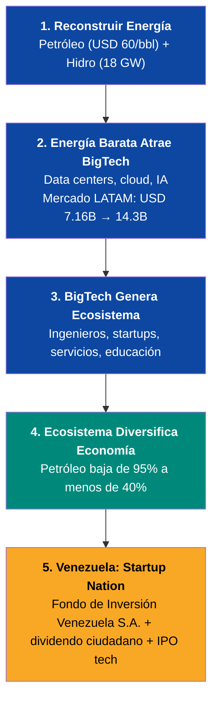

# Venezuela S.A.

> **Plan de Reconstrucción Nacional v1.0 — Marzo 2026**

:::caution Las fechas de este plan son ilustrativas — lo que importa son las condiciones
Cuando el plan dice "Año 5" o "Año 10", NO es una promesa de calendario. Es una **referencia ilustrativa** basada en escenarios. Lo que activa cada fase son **KPIs verificables**: PIB per cápita, nivel de formalización, tasa de pobreza, producción petrolera — no el paso del tiempo. Si las condiciones se cumplen en 3 años, se acelera. Si tardan 12, se espera. **El plan se adapta a la realidad, no al revés.** Ver [KPIs de Activación](/07-ejecucion/kpis-activacion) para las condiciones exactas de cada fase.
:::

---

## El Objetivo — En Palabras Simples

**Que cada venezolano sea dueño de su futuro — no dependiente de un gobierno.**

Cuando nace tu hijo, el país le abre una cuenta de ahorro. Le deposita dinero todos los meses para su salud y su educación. Cuando entra al colegio, recibe un voucher que cubre todo: matrícula, almuerzo, transporte, un deporte y una actividad como música o robótica. Tú eliges el colegio — si es malo, mueves el voucher a otro.

Cuando tu hijo empieza a trabajar, parte de su salario va a su propia cuenta — no al gobierno, a SU cuenta. De ahí se paga su retiro, su salud, su casa y la educación de sus hijos. A los 65 años, tiene casa propia, pensión digna y sus hijos graduados. Si le pasa algo, tú heredas todo. Nadie hereda deuda.

El Estado no opera hospitales ni colegios — solo supervisa que funcionen bien. Los colegios compiten por ser los mejores. Los hospitales son concesiones privadas. Tú evalúas la calidad desde una app. Si algo anda mal, lo reportas y se corrige.

El petróleo financia la transición — no es el destino. El destino es tecnología, educación, turismo, agricultura. El petróleo se usa para despegar. La tecnología es para volar.

**Eso es Venezuela S.A.: un plan donde 40 millones de personas son dueñas del negocio — no beneficiarias de un político.**

---

## Para Quién es Este Plan

| Si eres... | El plan te ofrece... |
|-----------|---------------------|
| **Una mamá en Maracaibo** | Cuenta de ahorro para tu hijo desde que nace. Voucher para el colegio que TÚ elijas. Salud cubierta sin copago si lo necesitas |
| **Un jubilado con USD 3/mes** | Pensión de USD 50 desde el Día 1, subiendo a USD 200. Tu cuenta FCV heredable a tus nietos |
| **Un joven en Petare** | Bootcamp de programación con estipendio. Empleo remoto a USD 1.200/mes. Tu cuenta de ahorro ya tiene USD 20.000 a los 18 |
| **Un venezolano en Miami** | Contribuir a tu FCV desde el exterior. Cuando vuelvas, tienes salud, vivienda y pensión esperándote |
| **Un inversor** | Acceso a 303.000M de barriles + energía barata + 40M de consumidores + marco legal estable |
| **Un emprendedor** | El voucher educativo crea un mercado de miles de millones. Colegios, comedores, academias, transporte, edtech — todo es negocio |

---

## La Versión Técnica

*Modelo de Startup Nation: Petróleo Como Combustible, Tecnología Como Destino, Diáspora Como Angel Investor*

Este no es un plan de gobierno. Es un **modelo de negocio** donde cada venezolano es accionista de **Venezuela S.A.** — la empresa de los ciudadanos que invierte en infraestructura, cobra regalías de concesiones, administra el Fondo de Inversión Venezuela S.A. y distribuye dividendos. El Estado solo regula y supervisa 5 funciones (gobierno, salud, justicia, educación, seguridad). Venezuela S.A. hace negocios en nombre de los 40 millones de ciudadanos.

**El petróleo NO es el negocio.** El petróleo es el **combustible** del negocio. El negocio real es convertir a Venezuela en una potencia tecnológica alimentada por la energía más barata del continente.

## Los Números Clave

| Indicador | Dato | Fuente |
|-----------|------|--------|
| Reservas probadas | 303.000 M barriles | [OPEP ASB 2025](https://www.opec.org/assets/assetdb/asb-2025.pdf) |
| Producción actual | 0,9–1,1 M bpd | [OPEP/IEA 2025](https://www.opec.org) |
| PIB nominal 2025 | USD 82.800 M | [FMI](https://www.imf.org) |
| Deuda externa total | USD 150–170.000 M | [Reuters, dic. 2025](https://www.cnbc.com/2026/01/04/venezuelas-billions-in-distressed-debt-who-is-in-line-to-collect.html) |
| Diáspora | 7,9 M personas | [UNHCR, dic. 2025](https://www.unhcr.org/us/emergencies/venezuela-situation) |
| Potencial hidroeléctrico | 18.000 MW (Cascada Caroní) | [Mongabay, 2023](https://news.mongabay.com/2023/08/hydropower-in-the-pan-amazon-the-guri-complex-and-the-caroni-cascade/) |
| Inversión para 3M bpd | USD 183.000 M en 15 años | [Rystad Energy, ene. 2026](https://www.rigzone.com/news/could_venezuela_production_get_back_to_3mm_barrels_per_day-08-jan-2026-182716-article/) |
| Precio base del plan | **USD 60/barril** (conservador) | [EIA STEO, mar. 2026](https://www.eia.gov/outlooks/steo/) |

## Las Rondas de Financiamiento

| Ronda | Fuente | Monto | Uso | Plazo |
|-------|--------|-------|-----|-------|
| **Pre-Seed** | Diáspora (iniciativa privada) | USD 25–60 M | Plataformas, censo, legal, app inversión | Día 1 (NO necesita gobierno) |
| **Seed** | Bonos ciudadanos + forwards | USD 1.000–5.000 M | Estabilización + energía | Años 1–2 |
| **Series A** | Contratos forward + majors | USD 30–50.000 M | Producción 1,4M bpd + Guri + fibra | Años 2–4 |
| **Series B** | Ingresos + BigTech | USD 50–100.000 M | Hubs tech, data centers, turismo | Años 4–8 |
| **IPO** | VIN a mercados internacionales | USD 10–30.000 M+ | Portafolio tech listado en bolsa | Años 8–12 |

## El Embudo Energético

1. **Reconstruir energía** (petróleo + hidro) → genera ingresos y electricidad barata
2. **Energía barata atrae BigTech** → Amazon puso [USD 4B en Chile](https://www.mordorintelligence.com/industry-reports/south-america-data-center-market), Google firmó el cable Humboldt
3. **BigTech genera ecosistema** → ingenieros, startups, servicios, educación
4. **Ecosistema diversifica economía** → petróleo baja de 95% a <40% de exportaciones

:::info 85+ Fuentes Verificables
Cada dato tiene una fuente real y verificable. Ver [Referencias Completas](/referencias).
:::

:::caution Precio Base USD $60/barril
La [EIA proyecta](https://www.eia.gov/outlooks/steo/) Brent a ~$64 promedio para 2027. Pre-crisis de Ormuz cotizaba a $67–69. Cada dólar por encima de $60 es upside directo al Fondo de Inversión Venezuela S.A. administrado por Venezuela S.A.
:::
