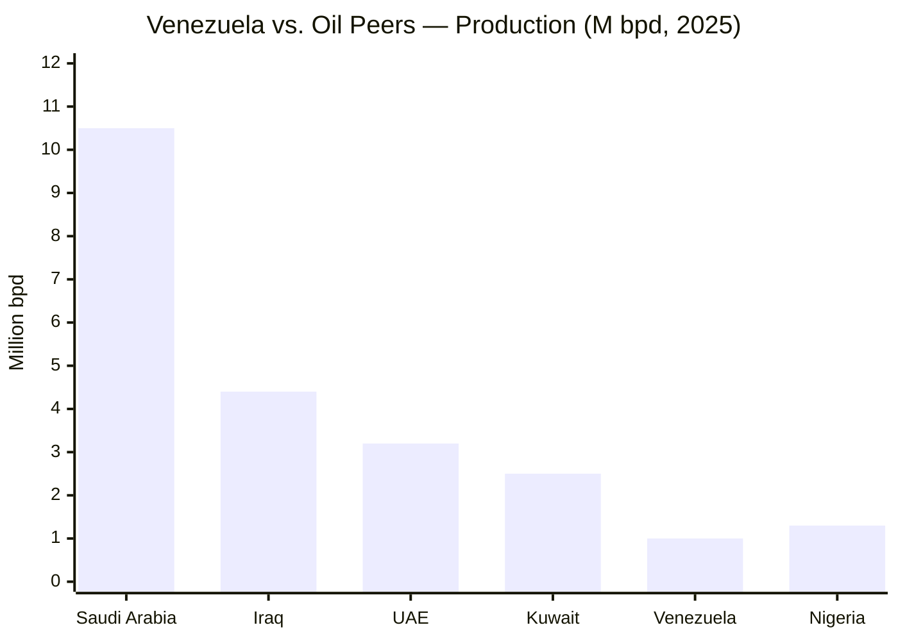
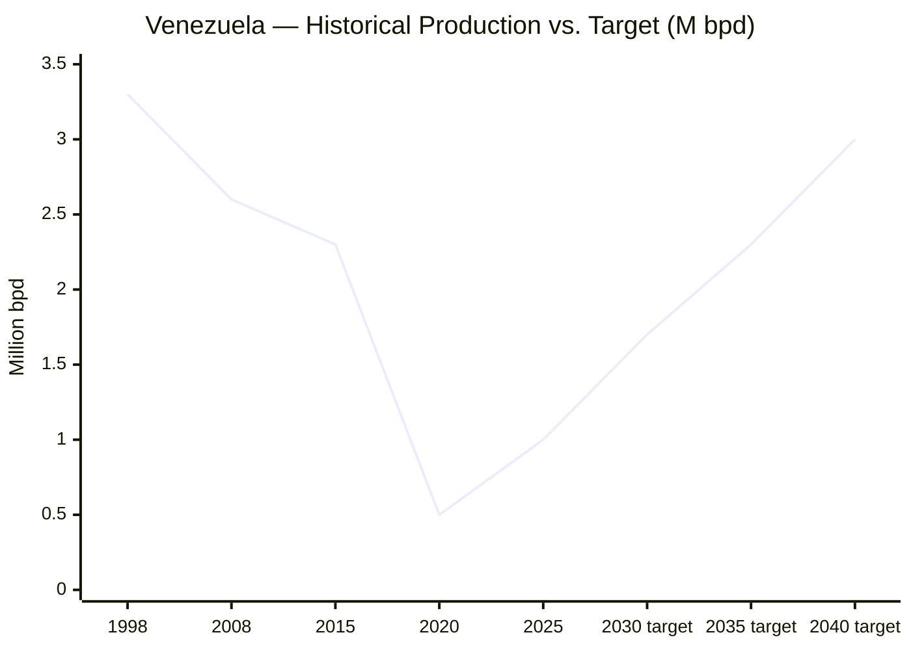
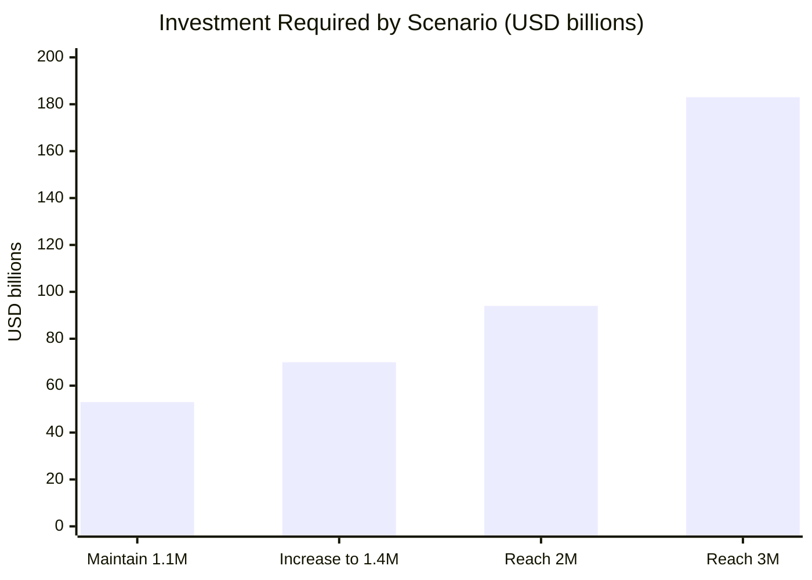
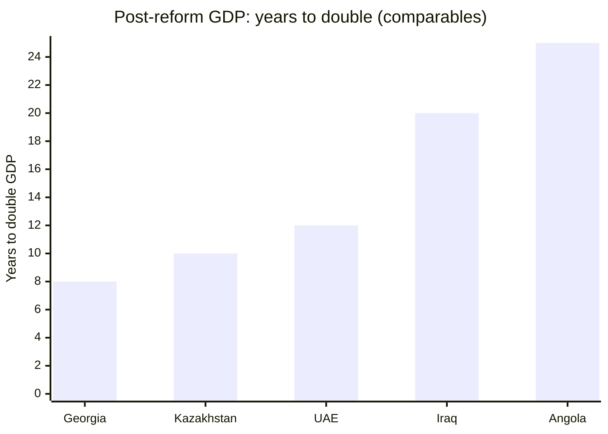

# Diagnosis: Where We Stand (Hard Data)

## Venezuela in 1 Page: The Opportunity

> "Don't start with 10 pages on what went wrong. Start with the opportunity." — The Musk critique of every pitch that opens with the problem.

Venezuela is not a poor country. It's a rich country operating at **3-30%** of its capacity. The gap between where it is and where it can be is the largest in the Western Hemisphere.

| Asset | Current Utilization | Potential | Gap | Source |
|-------|-------------------|-----------|-----|--------|
| **Oil reserves** (303B bbl) | **1M bpd** (~33% of historical capacity) | **3M bpd** (1998 level) | 2M bpd | [OPEC ASB 2025](https://www.opec.org/assets/assetdb/asb-2025.pdf) / [Rystad](https://www.rigzone.com/news/could_venezuela_production_get_back_to_3mm_barrels_per_day-08-jan-2026-182716-article/) |
| **Hydroelectric** (18 GW Caroni) | **~40% operational** (~7 GW effective) | **100%** (18 GW) | ~10 GW | [Mongabay, 2023](https://news.mongabay.com/2023/08/hydropower-in-the-pan-amazon-the-guri-complex-and-the-caroni-cascade/) |
| **Natural gas** (~200 TCF reserves) | **Near zero** (flared or reinjected) | **5 BCF/d** (LNG export + domestic) | Massive | [EIA Venezuela Analysis](https://www.eia.gov/international/overview/country/VEN) |
| **Arable land** (~30M ha) | **~20% cultivated** (~6M ha) | **80%** (~24M ha) | ~18M ha | [FAO](https://www.fao.org/) [Requires research] |
| **Labor force** (40M people) | **80%+ informal/underemployed** | **80% formal** | ~25M people | [ENCOVI 2024](https://www.proyectoencovi.com/) |
| **Geographic location** (15ms to Miami) | **0 hyperscale data centers** | **50+ hyperscale** | All of it | [Submarine Cable Map](https://www.submarinecablemap.com/) |

**Venezuela has ENOUGH energy to be top 3 globally in compute, top 5 in oil, and top 10 in agriculture. It's operating at 3-30% of its capacity. This plan is the path from 3% to 100%.**

:::tip Go straight to the solution
The full diagnosis is below. If you prefer to go straight to the solution → [Financial Engine](/02-motor-financiero/inversion-inicial-fuentes)
:::

---

| Indicator | Current Data | Source |
|-----------|-------------|--------|
| Proven reserves (official) | 303,000M barrels | [OPEC ASB 2025](https://www.opec.org/assets/assetdb/asb-2025.pdf) |
| Reserves (conservative estimate) | 100-110,000M barrels | [Monaldi, Rice University](https://finance.yahoo.com/news/venezuela-says-it-has-the-worlds-largest-reserves-of-crude-oil-making-it-viable-is-a-whole-other-problem-181512098.html) |
| Current production | 0.9-1.1M bpd | [OPEC/IEA 2025](https://www.opec.org) |
| Nominal GDP 2025 | USD 82,800M | [IMF](https://www.imf.org) |
| Total external debt | USD 150-170,000M | [Reuters/CNBC, Dec. 2025](https://www.cnbc.com/2026/01/04/venezuelas-billions-in-distressed-debt-who-is-in-line-to-collect.html) |
| Diaspora | 7.9M people | [UNHCR, Dec. 2025](https://www.unhcr.org/us/emergencies/venezuela-situation) |
| Guri capacity | 10,200 MW | [Power Technology](https://www.power-technology.com/projects/gurihydroelectric/) |
| Caroni cascade (potential) | 18,000 MW | [Mongabay, 2023](https://news.mongabay.com/2023/08/hydropower-in-the-pan-amazon-the-guri-complex-and-the-caroni-cascade/) |

## Investment Required ([Rystad Energy, January 2026](https://www.rigzone.com/news/could_venezuela_production_get_back_to_3mm_barrels_per_day-08-jan-2026-182716-article/))

| Scenario | Investment | Timeframe |
|-----------|-----------|-----------|
| Maintain 1.1M bpd | USD 53,000M | 15 years |
| Increase to 1.4M bpd | USD 8-9,000M/year additional | 2-3 years |
| Reach 2M bpd | USD 41,000M additional | Early 2030s |
| **Reach 3M bpd** | **USD 183,000M total** | **By 2040** |
| Immediate foreign capital | USD 30-35,000M | First 2-3 years |

:::warning 60% of investment beyond 2M bpd requires prices > USD 80 (Rystad)
At USD 60 (our base), the realistic ceiling at 15 years is 2-2.5M bpd.
:::

---

## Real Comparables: We're Not Norway

:::caution The aspirational comparables fallacy
Every oil reconstruction plan says "we'll be Norway" or "we'll be Singapore." The real comparables are less glamorous and more instructive. — [VisualEconomik](https://www.youtube.com/@VisualEconomik)
:::

Venezuela doesn't start from solid institutions (Norway), nor from a visionary leader with total control (Singapore), nor from a homogeneous and educated society (South Korea). The real comparables are countries that started from **conflict, corruption, and resource dependence** — exactly where we are.

| Country | Starting Point | Investment/Revenue | Outcome | Lesson for Venezuela |
|---------|---------------|-------------------|---------|---------------------|
| **Iraq post-2003** | War, institutional destruction, sectarian conflict | USD 200B+ invested (U.S. + multilaterals + oil) | Oil production recovered to **4.5M bpd** but country unstable. Rampant corruption, weak institutions | **Security MUST come first.** Without it, USD 200B are lost. Iraq recovered oil but didn't rebuild the country |
| **Angola post-civil war (2002)** | 27 years of civil war. Infrastructure destroyed | USD 68B in oil revenues (2002-2012) | **~30% lost to corruption** ([Brookings](https://www.brookings.edu/)). Infrastructure still poor. Poverty >40% | **Governance is everything.** Without oversight, oil revenues evaporate. Venezuela already lived this with FONDEN |
| **Kazakhstan post-Soviet (1991)** | Soviet collapse, economy destroyed, zero market institutions | National Fund (Samruk-Kazyna) + aggressive oil ramp + foreign investment | GDP: USD 10B (1993) → **USD 100B+ (2013)** — 10x in 20 years. But authoritarian regime, high inequality | **Growth and democracy can clash.** Kazakhstan grew fast by sacrificing freedom. Venezuela must find the balance |
| **UAE (1971)** | Desert, 250K inhabitants, zero industry, only oil | Oil → diversification: Dubai as financial, logistics, tourism hub | Oil < 30% GDP. Dubai attracts 16M+ tourists/year. GDP per capita USD 50K+ | **The long game works IF you start early.** 50 years of consistent execution. Patience pays |
| **Georgia (2004)** | Failed state: total corruption, criminal police, informal economy >50% | Radical police reform + anti-corruption + digitalization | FDI: 10x in 10 years. Police: 3rd most trusted institution. Doing Business: top 10 worldwide | **The fastest institutional reform in history.** If Georgia did it in 4 years, Venezuela can |

**Venezuela has elements of ALL these cases:**
- The institutional destruction of Iraq
- The oil corruption of Angola
- The diversification potential of the UAE
- The need for police reform of Georgia
- The rapid growth opportunity of Kazakhstan

**The question is not whether Venezuela can rebuild — all these countries did to some degree. The question is which model we replicate: Angola's (oil without governance = perpetual poverty) or the UAE's (oil + vision + execution = transformation).**

**Sources:** [World Bank Data](https://data.worldbank.org/) | [IMF WEO](https://www.imf.org/) | [Brookings Institution](https://www.brookings.edu/) | [Princeton Innovations for Successful Societies](https://successfulsocieties.princeton.edu/) [Requires research for specific Kazakhstan and Angola figures]
