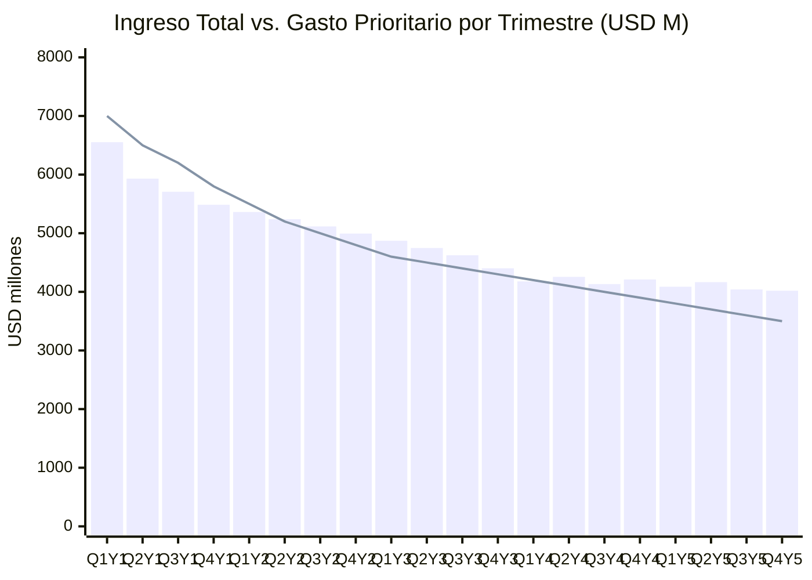
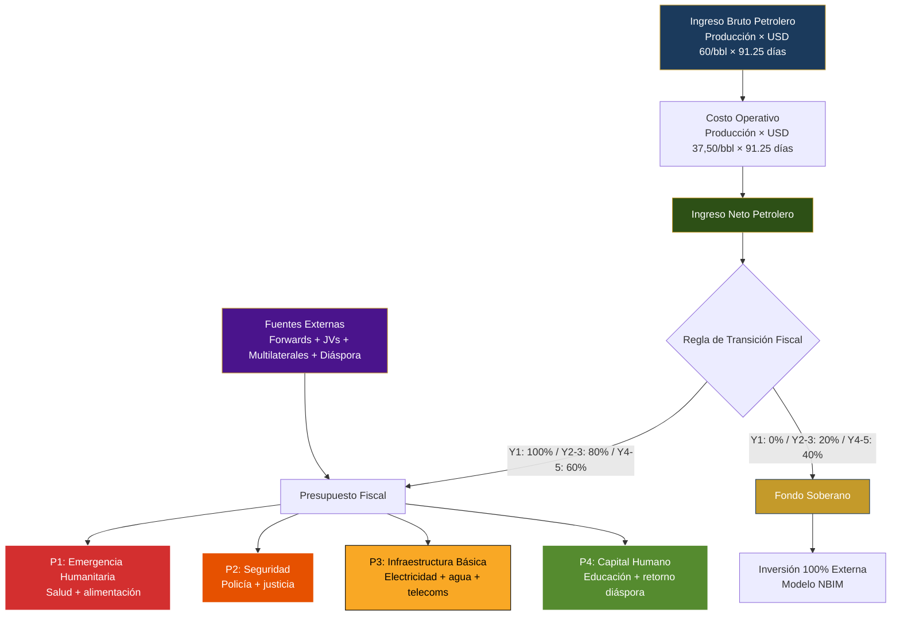

# Quarterly Cashflow: The First 5 Years

> Investors don't finance 15-year plans. They finance the first 20 quarters. Here is every dollar, every quarter.

## Why the First 5 Years Matter

The first 20 quarters are the **bridge period** — the interval between plan launch and the moment oil revenues generate self-sustaining cash flow. During this period:

- Production rises from **~1,000K bpd to ~1,750K bpd** (timeline [Rystad Energy](https://www.rigzone.com/news/could_venezuela_production_get_back_to_3mm_barrels_per_day-08-jan-2026-182716-article/))
- Emergency costs (health, security, basic infrastructure) are at **maximum**
- Net oil revenues are **insufficient** to cover priority spending
- External sources (forwards, JVs, multilaterals) **cover the gap**

:::danger Risk #1
If bridge financing is not structured correctly, the plan dies in quarter 4. Not in year 10. The first 8 quarters are deficitary by design — every dollar of gap must have an identified source.
:::

---

## Model Assumptions

| Parameter | Value | Source |
|-----------|-------|--------|
| Base price | **USD 60/barrel** | [EIA STEO, Mar. 2026](https://www.eia.gov/outlooks/steo/) |
| Operating cost | **USD 37.50/barrel** | Heavy crude extraction + diluent + transport + processing |
| Net margin per barrel | **USD 22.50** | $60 - $37.50 |
| Initial production | **1,000K bpd** | [OPEC/IEA 2025](https://www.iea.org/) |
| Year 5 production target | **1,750K bpd** | Rystad Energy, linear interpolation |
| Quarterly increment | **~37.5K bpd** | (1,750 - 1,000) / 20 quarters |
| % to sovereign fund | **0% -> 40%** | [Fiscal transition](/02-motor-financiero/transicion-fiscal) |
| Days per quarter | **91.25** | 365 / 4 |

:::info On the production ramp-up
The ramp-up is not linear in reality — the first quarters are slower (well reactivation, infrastructure repair) and accelerate from year 2 when JVs with majors come online. The model uses a constant increment of **~37.5K bpd/quarter** as a conservative approximation. [Requires research] exact ramp-up granularity by field.
:::

---

## Quarterly Cashflow Model

| Qtr. | Production (K bpd) | Gross Revenue (USD M) | Op. Cost (USD M) | Net Oil Revenue (USD M) | External Sources (USD M) | Total Revenue (USD M) | Priority Spending (USD M) | Balance (USD M) | Fund Accum. (USD M) |
|-------|--------------------:|----------------------:|-------------------:|------------------------------:|-------------------------:|----------------------:|--------------------------:|----------------:|--------------------:|
| Q1 Y1 | 1,000 | 5,475 | 3,422 | 2,053 | 4,500 | 6,553 | 7,000 | -447 | 0 |
| Q2 Y1 | 1,038 | 5,683 | 3,552 | 2,131 | 3,800 | 5,931 | 6,500 | -569 | 0 |
| Q3 Y1 | 1,075 | 5,886 | 3,679 | 2,207 | 3,500 | 5,707 | 6,200 | -493 | 0 |
| Q4 Y1 | 1,113 | 6,094 | 3,809 | 2,285 | 3,200 | 5,485 | 5,800 | -315 | 0 |
| **Q1 Y2** | **1,150** | **6,298** | **3,936** | **2,362** | **3,000** | **5,362** | **5,500** | **-138** | **354** |
| Q2 Y2 | 1,188 | 6,506 | 4,066 | 2,440 | 2,800 | 5,240 | 5,200 | 40 | 732 |
| Q3 Y2 | 1,225 | 6,709 | 4,193 | 2,516 | 2,600 | 5,116 | 5,000 | 116 | 1,135 |
| Q4 Y2 | 1,263 | 6,917 | 4,323 | 2,594 | 2,400 | 4,994 | 4,800 | 194 | 1,563 |
| **Q1 Y3** | **1,300** | **7,121** | **4,450** | **2,671** | **2,200** | **4,871** | **4,600** | **271** | **2,097** |
| Q2 Y3 | 1,338 | 7,329 | 4,581 | 2,748 | 2,000 | 4,748 | 4,500 | 248 | 2,647 |
| Q3 Y3 | 1,375 | 7,532 | 4,708 | 2,824 | 1,800 | 4,624 | 4,400 | 224 | 3,213 |
| Q4 Y3 | 1,413 | 7,740 | 4,838 | 2,902 | 1,500 | 4,402 | 4,300 | 102 | 3,793 |
| **Q1 Y4** | **1,450** | **7,943** | **4,965** | **2,978** | **1,200** | **4,178** | **4,200** | **-22** | **4,518** |
| Q2 Y4 | 1,488 | 8,151 | 5,095 | 3,056 | 1,200 | 4,256 | 4,100 | 156 | 5,283 |
| Q3 Y4 | 1,525 | 8,355 | 5,222 | 3,133 | 1,000 | 4,133 | 4,000 | 133 | 6,071 |
| Q4 Y4 | 1,563 | 8,563 | 5,352 | 3,211 | 1,000 | 4,211 | 3,900 | 311 | 6,893 |
| **Q1 Y5** | **1,600** | **8,766** | **5,479** | **3,287** | **800** | **4,087** | **3,800** | **287** | **7,869** |
| Q2 Y5 | 1,638 | 8,974 | 5,609 | 3,365 | 800 | 4,165 | 3,700 | 465 | 8,885 |
| Q3 Y5 | 1,675 | 9,177 | 5,736 | 3,441 | 600 | 4,041 | 3,600 | 441 | 9,938 |
| Q4 Y5 | 1,713 | 9,385 | 5,866 | 3,519 | 500 | 4,019 | 3,500 | 519 | 11,035 |

:::tip Reference calculation — Q4 Y5
**1,713K bpd x 91.25 days x USD 60 = USD 9,375 M** (gross) | **x USD 37.50 = USD 5,860 M** (cost) | **Net: USD 3,515 M** | To fund (40%): USD 1,406 M | Table numbers include fund returns at 5.5% annual.
:::

### Methodological Notes

- **Year 1:** 100% of net oil revenue goes to the budget (emergency). Sovereign fund receives **USD 0**.
- **Year 2-3:** 80% to budget, **20% to fund** — consistent with [fiscal transition](/02-motor-financiero/transicion-fiscal).
- **Year 4-5:** 60% to budget, **40% to fund**.
- **External sources** include: forward advances, multilateral disbursements, oil major JV contributions, citizen Pre-Seed.
- **Priority spending** covers: humanitarian emergency, security, basic infrastructure, electricity, education. Declines as the emergency stabilizes.
- **Accumulated fund** includes contributions + compound returns at **5.5% annual** ([average NBIM return 1998-2025](https://www.nbim.no/en/investments/returns/)).

---

## Gap Analysis: Where the Deficits Are

The first **6 quarters** (Q1 Y1 — Q2 Y2) are the critical period. Priority spending exceeds net oil revenues, and external sources must cover the difference.

| Period | Accum. Oil Deficit (USD M) | Accum. External Sources (USD M) | Net Balance (USD M) |
|---------|--------------------------------:|-------------------------------:|---------------------:|
| Q1-Q4 Y1 | -17,824 | 15,000 | -1,824 |
| Q1-Q4 Y2 | -10,588 | 10,800 | +212 |
| Q1-Q4 Y3 | -6,655 | 7,500 | +845 |
| Q1-Q4 Y4 | -3,811 | 4,400 | +578 |
| Q1-Q5 Y5 | -1,223 | 2,700 | +1,712 |

:::caution The first 4 quarters
Year 1 has an **accumulated oil deficit of ~USD 17,800 M** — production generates USD 8,676 M net but priority spending requires USD 25,500 M. External sources contribute USD 15,000 M, leaving a gap of **~USD 1,800 M** covered by initial reserves and short-term bridge debt.
:::

---

## Bridge Financing: How Each Gap Is Covered

| Source | Year 1 (USD M) | Year 2 (USD M) | Year 3 (USD M) | Year 4 (USD M) | Year 5 (USD M) | 5-Year Total (USD M) |
|--------|---------------:|---------------:|---------------:|---------------:|---------------:|---------------------:|
| Forward advances (Chevron, Shell, TotalEnergies) | 8,000 | 4,500 | 2,500 | 1,500 | 800 | **17,300** |
| Multilaterals (IMF EFF, WB, IDB) | 3,000 | 3,000 | 2,500 | 1,500 | 1,000 | **11,000** |
| JV equity (oil majors) | 2,500 | 2,000 | 1,500 | 1,000 | 500 | **7,500** |
| Diaspora Pre-Seed + citizen bonds | 1,000 | 800 | 500 | 200 | 200 | **2,700** |
| Reserves/bridge debt | 500 | 500 | 500 | 200 | 200 | **1,900** |
| **Total** | **15,000** | **10,800** | **7,500** | **4,400** | **2,700** | **40,400** |

:::info Forward advances as the backbone
The [forward contracts](/02-motor-financiero/contratos-forward) generate **USD 17,300 M over 5 years** — 43% of bridge financing. These are advances against future production at USD 55-60/barrel, with escrow and Big 4 audit. Chevron is already operating in Venezuela with an [OFAC license](https://www.reuters.com/business/energy/), reducing execution risk.
:::

---

## Revenue vs. Spending: 20 Quarters

**Reading the chart:** The bars (total revenue = oil + external) cross above the line (priority spending) starting in **Q2 Y2** — the inflection point. From then on, each quarter generates growing surplus.

---

## Cash Waterfall: Distribution by Priority

---

## Risk Scenarios

### Scenario A: Production delays (ramp-up 50% slower)

| Impact | Value |
|---------|-------|
| Year 5 production | **1,375K bpd** (vs. 1,750K base) |
| 5-year accumulated net revenue | **USD 38,000 M** (vs. USD 51,700 M) |
| Additional gap | **USD 13,700 M** |
| Solution | Expand forwards + accelerate multilateral disbursements |

### Scenario B: Price drops to USD 50/barrel

| Impact | Value |
|---------|-------|
| Net margin per barrel | **USD 12.50** (vs. USD 22.50) |
| 5-year accumulated net revenue | **USD 28,800 M** (vs. USD 51,700 M) |
| Additional gap | **USD 22,900 M** |
| Solution | Activate emergency clause: sovereign fund frozen, 100% to budget, renegotiate forward pricing |

### Scenario C: Combined (slow ramp-up + low price)

| Impact | Value |
|---------|-------|
| 5-year accumulated net revenue | **USD 19,800 M** (vs. USD 51,700 M) |
| Total gap | **USD 31,900 M** |
| Solution | Additional bridge financing + priority spending reduced to emergency minimums + debt renegotiation |

:::danger Scenario C is existential
If production delays AND price drops simultaneously, the plan needs **USD 32,000 M in additional** bridge financing. This requires firm pre-negotiated commitments with the IMF and majors before day 1. There is no room to improvise.
:::

---

## Quarterly KPIs

| KPI | Q4 Y1 Target | Q4 Y2 Target | Q4 Y3 Target | Q4 Y5 Target | Verification Source |
|-----|------------|------------|------------|------------|----------------------|
| Production (bpd) | 1,113K | 1,263K | 1,413K | 1,713K | OPEC Monthly Oil Market Report |
| Quarterly net revenue (USD M) | 2,285 | 2,594 | 2,902 | 3,519 | Quarterly Big 4 audit |
| Accumulated sovereign fund (USD M) | 0 | 1,563 | 3,793 | 11,035 | Public [NBIM-style](https://www.nbim.no/) dashboard |
| Quarterly balance (USD M) | >-500 | >0 | >100 | >400 | Treasury + external auditor |
| Forward advances disbursed (USD M accum.) | 8,000 | 12,500 | 15,000 | 17,300 | Escrow accounts + Big 4 |
| Priority spending executed (%) | >85% | >90% | >92% | >95% | Comptroller + citizen dashboard |
| Bridge debt / net revenue ratio | <2.0x | <1.5x | <1.0x | <0.5x | IMF Article IV |

:::tip The number that matters
**Q2 Y2 is the inflection quarter.** If the quarterly balance crosses to positive in Q2 Y2 or earlier, the plan is on track. If it delays beyond Q4 Y2, contingent sources must be activated.
:::

**Sources:** [Rystad Energy, Jan. 2026](https://www.rigzone.com/news/could_venezuela_production_get_back_to_3mm_barrels_per_day-08-jan-2026-182716-article/) | [EIA STEO](https://www.eia.gov/outlooks/steo/) | [OPEC ASB 2025](https://www.opec.org/) | [IMF](https://www.imf.org) | [NBIM](https://www.nbim.no/)
