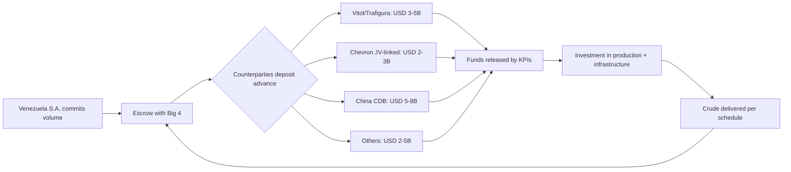
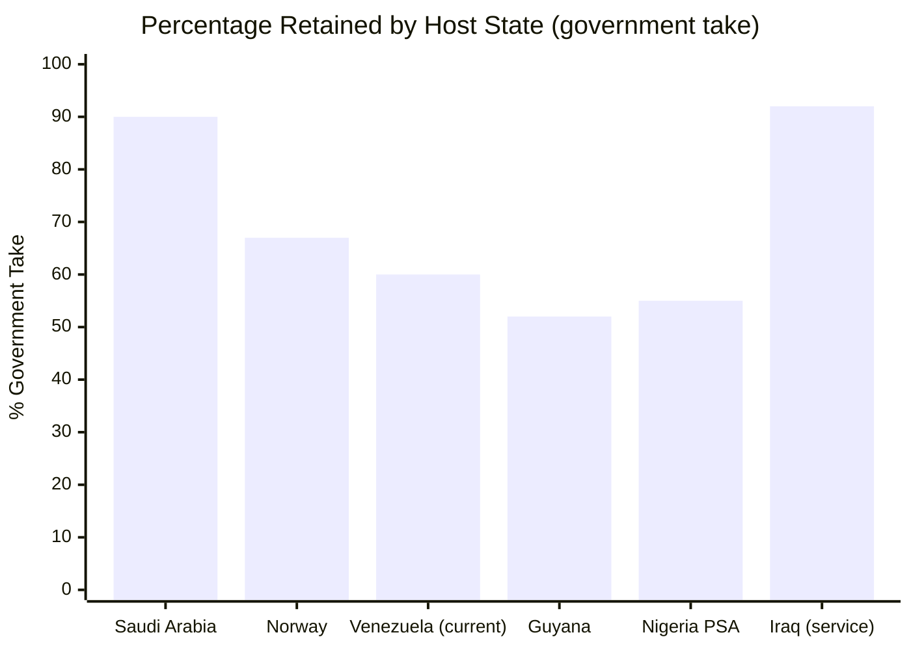

# Guaranteed-Price Oil Forward Contracts

:::tip What is a forward contract? — In plain English
Imagine you own a farm with 1,000 mango trees. The mangoes ripen in 6 months. A buyer tells you: "I'll pay you USD 500 today for the mangoes you'll harvest in 6 months, at a fixed price of USD 1 each." You get money TODAY to invest in the farm (irrigation, workers), and the buyer locks in a good price.

That's a [forward contract](/glosario): **selling in advance something you'll produce in the future, at a price agreed today.** Venezuela has 303 billion barrels of oil underground. A forward contract says: "I'll sell you X barrels I'm going to produce over the next few years, at USD 60 each. Pay me an advance today." That advance funds the reconstruction. The buyer secures oil. Venezuela secures capital. Both win.

**The risk:** if the price jumps to USD 100, you sold cheap. But USD 60 is the plan's base price — anything above that goes to the [Venezuela S.A. Investment Fund](/glosario) as extra upside.
:::

## Precedent: China Lent USD 60,000+ M Backed by Oil

[AidData records USD 105,590 million](https://www.aiddata.org/blog/how-chinas-oil-backed-lending-in-venezuela-fell-into-distress) in total commitments, 95% backed by oil.

## What Went Wrong and How to Fix It

| China Problem | Solution |
|----------------|----------|
| Single buyer (85%) | Minimum 5 buyers |
| No transparency | Escrow accounts + Big 4 audit |
| No volume cap | Price floor + volume ceiling |
| PDVSA lacked capacity | Joint ventures with majors |

> Sources: [AidData](https://www.aiddata.org/blog/how-chinas-oil-backed-lending-in-venezuela-fell-into-distress); [Columbia CGEP](https://www.energypolicy.columbia.edu/venezuela-china-oil-ties-severely-impacted-by-us-action/); [RAND](https://www.rand.org/pubs/commentary/2026/01/china-could-play-spoiler-in-venezuelas-debt-restructuring.html)

## Realistic Projection: Phased Forward Tranches

:::danger Why the previous table was wrong
A USD 720B prepaid forward doesn't exist in any market in the world. Real oil forwards are structured in **tranches of USD 5–15B** per deal. The global prepaid commodity forward market moves ~USD 50–80B/year total. Venezuela cannot absorb more than a fraction of that. The previous numbers confused "total contractual value of 60B barrels" with "advance available today" — these are radically different things.
:::

### Net Present Value (NPV) Note

The "advance" on a forward **is not 20–25% of face value**. It's the **NPV of the delivery stream discounted at the buyer's opportunity cost**. A barrel at USD 60 delivered in year 10, at a 10% discount rate, is worth today:

> **NPV = USD 60 / (1.10)^10 = ~USD 23**

The buyer doesn't pay USD 12–15 (20–25% of USD 60) as an "advance." They pay **~USD 23 per future barrel**, but demand coverage for country risk, operational risk, and trading margin. In practice, for Venezuela with its current risk profile, the effective discount can be **60–70%** off face value. Each tranche is negotiated with its own discount based on delivery timeline and accumulated credibility.

### Tranche Structure

| Tranche | Period | Committed volume | Base price | Face value | Estimated advance (risk-adjusted NPV) | Risk profile |
|---------|--------|-----------------|------------|------------|---------------------------------------|--------------|
| **T1** | Year 1–2 | 150–250M bbl | USD 55–60 | USD 9–15B | **USD 5–8B** | Maximum risk → maximum discount (45–55% of face) |
| **T2** | Year 3–5 | 300–500M bbl | USD 60 | USD 18–30B | **USD 10–15B** | Medium risk → moderate discount (50–60% of face) |
| **T3** | Year 5–10 | 500–800M bbl | USD 60 | USD 30–48B | **USD 15–25B** | Low risk → standard discount (55–65% of face) |
| **TOTAL** | **15 years** | **950–1,550M bbl** | **USD 60** | **USD 57–93B** | **USD 30–48B** | Weighted average |

:::info Market context
- **Vitol** (world's largest commodity trader) moves ~USD 400B/year in volume. A USD 5–10B tranche is large but feasible for a trader consortium.
- **Chad (2014):** Glencore prepaid ~USD 1.5B for a crude forward. Venezuela has 300x more reserves.
- **Ghana (2015):** Forward with traders for USD 1B to stabilize the balance of payments.
- **Iraq (post-2003):** Multiple USD 2–5B forwards with traders during reconstruction.
- The total of **USD 30–48B over 15 years** is ambitious but structurable — equivalent to 3–4 deals of USD 5–15B staggered over time.
:::

### Potential Counterparties

| Type | Company | Estimated capacity | Strategic interest |
|------|---------|-------------------|---------------------|
| **Commodity Traders** | [Vitol](https://www.vitol.com/), [Trafigura](https://www.trafigura.com/), [Glencore](https://www.glencore.com/) | USD 3–10B per tranche | Access to Orinoco Belt heavy crude (scarce, high demand at specialized refineries). Already operating in Venezuela via OFAC licenses |
| **Majors (JV-linked)** | Chevron, Shell, Repsol, ENI | USD 2–5B as JV-linked prepayment | Secure volume from their own JVs. Chevron already operates Petropiar/Petroboscan under GL44 |
| **Sovereign bilateral** | China (CDB/CITIC), India (OVL) | USD 5–15B per bilateral tranche | China: relationship continuity (USD 60B+ historical). India: diversify away from Middle East |
| **NOC trading arms** | Saudi Aramco Trading, ADNOC Trading | USD 1–3B | Blending with Venezuelan heavy crude to optimize refining |

:::caution Diversification rule: no single buyer > 25% of total volume
The mistake with China was concentrating 85% in a single creditor. Each tranche must have **minimum 3 counterparties** and none can exceed 25% of total committed volume. This is structured via escrow accounts with Big 4 auditing.
:::

### Prepaid Forward Flow

### Comparison: Previous vs. Recalibrated

| Metric | Previous version | Recalibrated version | Why |
|---------|-----------------|---------------------|---------|
| Barrels committed | 60,000M (60B) | 950–1,550M (~1–1.5B) | You don't commit 20% of total reserves to forwards. You commit incremental production over 15 years |
| Face value | USD 3.6T | USD 57–93B | Proportional to realistic volume |
| Total advance | USD 720–900B | **USD 30–48B** | Risk-adjusted NPV, not 20% of face |
| Number of counterparties | Unspecified | **Minimum 3 per tranche, 25% cap/counterparty** | Lesson from China |
| Structure | One massive contract | **3 phased tranches** by timeline and risk | How real forwards actually work |

:::info Current price vs. plan base price
Brent today: ~USD 100 (Hormuz crisis). [EIA projects](https://www.eia.gov/outlooks/steo/) ~$64 for 2027. We use $60 to eliminate risk. Everything above is upside to the [Venezuela S.A. Investment Fund](/02-motor-financiero/fondo-soberano).

**Sources:** [Vitol Annual Review 2024](https://www.vitol.com/); [Glencore Annual Report 2024](https://www.glencore.com/investors/reports-and-results); [AidData — China loans](https://www.aiddata.org/blog/how-chinas-oil-backed-lending-in-venezuela-fell-into-distress); [Natural Resource Governance Institute — Commodity-Backed Loans](https://resourcegovernance.org/)
:::

---

## Venezuela vs. Majors Split: How Much Stays?

> The oil is in the ground. But extracting it requires capital, technology, and expertise that Venezuela doesn't have today. How much must be conceded to obtain it?

### Contract Types and Revenue Split

| Contract type | Venezuela takes (%) | Major takes (%) | Reference country | Advantage | Disadvantage |
|------------------|--------------------|----------------|-----------------|---------|------------|
| **Joint Venture (JV)** | 55–65% | 35–45% | Current Venezuela (Chevron GL44) | Shared operational control, technology transfer | Requires state capital as counterpart |
| **Production Sharing Agreement (PSA)** | 50–70% | 30–50% | Indonesia, Angola, Nigeria | State puts up no capital; major assumes exploration risk | Less operational control, cost recovery favors major |
| **Service Contract** | 85–95% | 5–15% (fixed fee) | Iraq post-2009, Mexico (pre-reform) | Maximum control and revenue retention | Doesn't attract large-scale investment; 100% state risk |
| **Concession** | 40–60% (royalties + taxes) | 40–60% | Guyana, Brazil (pre-salt) | Maximum private investment, rapid execution | Less control, risk of unfavorable terms |
| **Norwegian Model** | **~67%** | ~33% | Norway (Equinor + licenses) | Optimal balance: state control + private investment + sovereign fund | Requires competent state company (Equinor) |

### Venezuela's Current Situation

The current model is JV with PDVSA as majority partner. [Chevron operates under OFAC license GL44](https://www.reuters.com/business/energy/chevron-begins-shipping-venezuelan-oil-us-after-license-2022-11-26/) with an estimated split of **~60% Venezuela / 40% Chevron** in the Orinoco Belt JVs (Petropiar, Petroboscan).

### International Comparison

| Country | Government take | Model | Production (bpd) | Source |
|------|----------------|--------|-------------------|--------|
| **Saudi Arabia** | ~85-90% | State-owned Aramco + service contracts | 9-10M | [IEA WEO 2024](https://www.iea.org/reports/world-energy-outlook-2024) |
| **Norway** | ~67% | Licenses + Equinor (67% state-owned) | ~1.8M | [Rystad Energy](https://www.rystadenergy.com/) |
| **Venezuela (current)** | ~60% | JVs with majority PDVSA | ~0.9M | [OPEC ASB 2025](https://www.opec.org/) |
| **Guyana** | ~52% | PSA with ExxonMobil | ~0.6M | [IEA, 2024](https://www.iea.org/) |
| **Nigeria** | ~55% (PSA) | PSAs + JVs | ~1.3M | [Rystad Energy](https://www.rystadenergy.com/) |
| **Iraq** | ~92% | Service contracts (fee/barrel) | ~4.5M | [IEA WEO 2024](https://www.iea.org/reports/world-energy-outlook-2024) |

### Recommendation: Norwegian-Style Hybrid Model

:::tip Target: Government take of 65-70%
1. **Phase 1 (Year 0-5):** JVs with 55/45 split — concede more to attract capital and technology when risk is at its peak.
2. **Phase 2 (Year 5-10):** Renegotiate to 60/40 as risk decreases and production rises.
3. **Phase 3 (Year 10-15):** Migrate to Norwegian model (67/33) with competent state company post-PDVSA reform.

The **upside above USD 60/barrel** goes 100% to the sovereign fund — this increases the effective government take without changing the contracts.
:::

**Sources:** [IEA — World Energy Outlook 2024](https://www.iea.org/reports/world-energy-outlook-2024) | [Rystad Energy](https://www.rystadenergy.com/) | [Reuters — Chevron GL44](https://www.reuters.com/business/energy/chevron-begins-shipping-venezuelan-oil-us-after-license-2022-11-26/)
