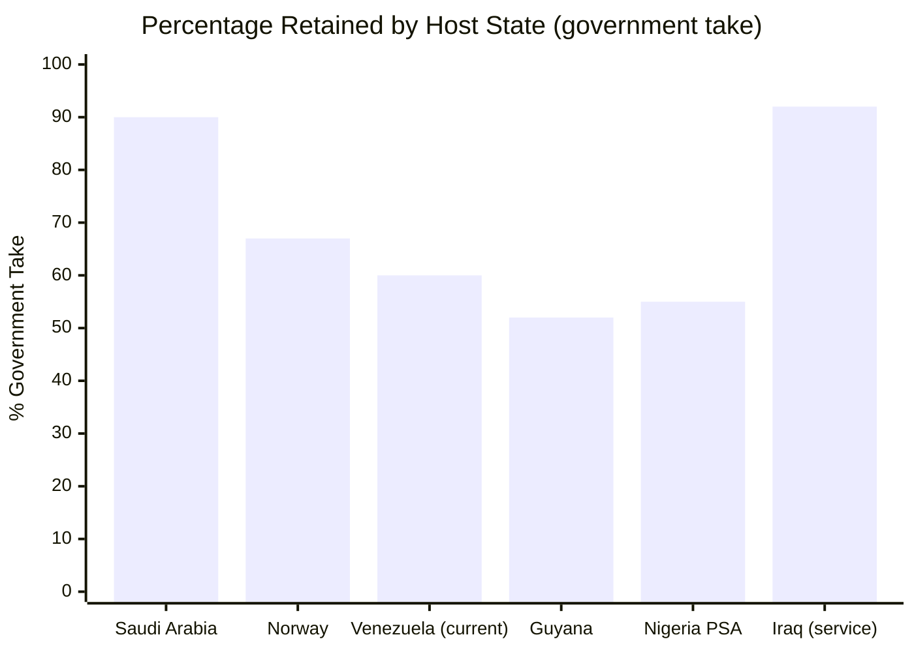

# Guaranteed-Price Oil Forward Contracts

:::tip What is a forward contract? — In plain English
Imagine you own a farm with 1,000 mango trees. The mangoes ripen in 6 months. A buyer tells you: "I'll pay you USD 500 today for the mangoes you'll harvest in 6 months, at a fixed price of USD 1 each." You get money TODAY to invest in the farm (irrigation, workers), and the buyer locks in a good price.

That's a [forward contract](/glosario): **selling in advance something you'll produce in the future, at a price agreed today.** Venezuela has 303 billion barrels of oil underground. A forward contract says: "I'll sell you X barrels I'm going to produce over the next few years, at USD 60 each. Pay me an advance today." That advance funds the reconstruction. The buyer secures oil. Venezuela secures capital. Both win.

**The risk:** if the price jumps to USD 100, you sold cheap. But USD 60 is the plan's base price — anything above that goes to the [Venezuela S.A. Investment Fund](/glosario) as extra upside.
:::

## Precedent: China Lent USD 60,000+ M Backed by Oil

[AidData records USD 105,590 million](https://www.aiddata.org/blog/how-chinas-oil-backed-lending-in-venezuela-fell-into-distress) in total commitments, 95% backed by oil.

## What Went Wrong and How to Fix It

| China Problem | Solution |
|----------------|----------|
| Single buyer (85%) | Minimum 5 buyers |
| No transparency | Escrow accounts + Big 4 audit |
| No volume cap | Price floor + volume ceiling |
| PDVSA lacked capacity | Joint ventures with majors |

> Sources: [AidData](https://www.aiddata.org/blog/how-chinas-oil-backed-lending-in-venezuela-fell-into-distress); [Columbia CGEP](https://www.energypolicy.columbia.edu/venezuela-china-oil-ties-severely-impacted-by-us-action/); [RAND](https://www.rand.org/pubs/commentary/2026/01/china-could-play-spoiler-in-venezuelas-debt-restructuring.html)

## Projection at USD 60/Barrel

| Scenario | Barrels | Price | Contractual Value | Advance (20–25%) |
|-----------|----------|--------|-------------------|-------------------|
| Conservative | 40,000 M | USD 55 | USD 2.2 T | USD 440–550,000 M |
| **Base** | **60,000 M** | **USD 60** | **USD 3.6 T** | **USD 720–900,000 M** |
| Optimistic | 80,000 M | USD 65 | USD 5.2 T | USD 1.04–1.3 T |

:::info Current price vs. plan base price
Brent today: ~USD 100 (Hormuz crisis). [EIA projects](https://www.eia.gov/outlooks/steo/) ~$64 for 2027. We use $60 to eliminate risk. Everything above is upside.
:::

---

## Venezuela vs. Majors Split: How Much Stays?

> The oil is in the ground. But extracting it requires capital, technology, and expertise that Venezuela doesn't have today. How much must be conceded to obtain it?

### Contract Types and Revenue Split

| Contract type | Venezuela takes (%) | Major takes (%) | Reference country | Advantage | Disadvantage |
|------------------|--------------------|----------------|-----------------|---------|------------|
| **Joint Venture (JV)** | 55–65% | 35–45% | Current Venezuela (Chevron GL44) | Shared operational control, technology transfer | Requires state capital as counterpart |
| **Production Sharing Agreement (PSA)** | 50–70% | 30–50% | Indonesia, Angola, Nigeria | State puts up no capital; major assumes exploration risk | Less operational control, cost recovery favors major |
| **Service Contract** | 85–95% | 5–15% (fixed fee) | Iraq post-2009, Mexico (pre-reform) | Maximum control and revenue retention | Doesn't attract large-scale investment; 100% state risk |
| **Concession** | 40–60% (royalties + taxes) | 40–60% | Guyana, Brazil (pre-salt) | Maximum private investment, rapid execution | Less control, risk of unfavorable terms |
| **Norwegian Model** | **~67%** | ~33% | Norway (Equinor + licenses) | Optimal balance: state control + private investment + sovereign fund | Requires competent state company (Equinor) |

### Venezuela's Current Situation

The current model is JV with PDVSA as majority partner. [Chevron operates under OFAC license GL44](https://www.reuters.com/business/energy/chevron-begins-shipping-venezuelan-oil-us-after-license-2022-11-26/) with an estimated split of **~60% Venezuela / 40% Chevron** in the Orinoco Belt JVs (Petropiar, Petroboscan).

### International Comparison

| Country | Government take | Model | Production (bpd) | Source |
|------|----------------|--------|-------------------|--------|
| **Saudi Arabia** | ~85-90% | State-owned Aramco + service contracts | 9-10M | [IEA WEO 2024](https://www.iea.org/reports/world-energy-outlook-2024) |
| **Norway** | ~67% | Licenses + Equinor (67% state-owned) | ~1.8M | [Rystad Energy](https://www.rystadenergy.com/) |
| **Venezuela (current)** | ~60% | JVs with majority PDVSA | ~0.9M | [OPEC ASB 2025](https://www.opec.org/) |
| **Guyana** | ~52% | PSA with ExxonMobil | ~0.6M | [IEA, 2024](https://www.iea.org/) |
| **Nigeria** | ~55% (PSA) | PSAs + JVs | ~1.3M | [Rystad Energy](https://www.rystadenergy.com/) |
| **Iraq** | ~92% | Service contracts (fee/barrel) | ~4.5M | [IEA WEO 2024](https://www.iea.org/reports/world-energy-outlook-2024) |

### Recommendation: Norwegian-Style Hybrid Model

:::tip Target: Government take of 65-70%
1. **Phase 1 (Year 0-5):** JVs with 55/45 split — concede more to attract capital and technology when risk is at its peak.
2. **Phase 2 (Year 5-10):** Renegotiate to 60/40 as risk decreases and production rises.
3. **Phase 3 (Year 10-15):** Migrate to Norwegian model (67/33) with competent state company post-PDVSA reform.

The **upside above USD 60/barrel** goes 100% to the sovereign fund — this increases the effective government take without changing the contracts.
:::

**Sources:** [IEA — World Energy Outlook 2024](https://www.iea.org/reports/world-energy-outlook-2024) | [Rystad Energy](https://www.rystadenergy.com/) | [Reuters — Chevron GL44](https://www.reuters.com/business/energy/chevron-begins-shipping-venezuelan-oil-us-after-license-2022-11-26/)
