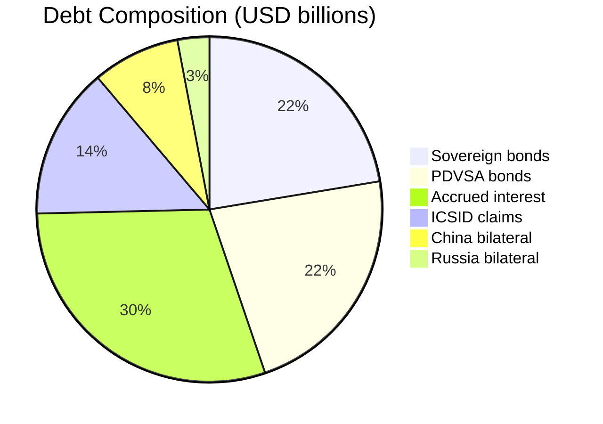
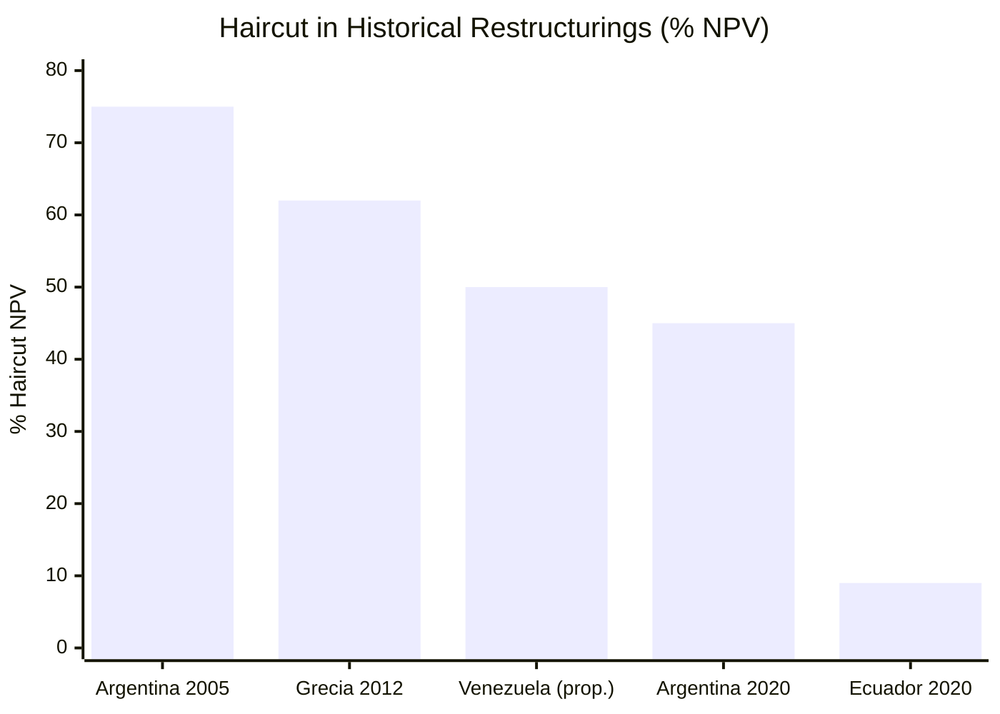

# Debt Restructuring: USD 150–170,000 M

> Venezuela has been in default since 2017. No plan works without resolving the debt.

## Debt Composition

[In default since November 2017](https://www.cnbc.com/2026/01/04/venezuelas-billions-in-distressed-debt-who-is-in-line-to-collect.html). Total debt: **USD 150–170,000 M**. Debt-to-GDP ratio: ~200% ([IMF](https://www.imf.org)).

| Type | Estimated Amount | Holder | Status |
|------|----------------|---------|--------|
| Sovereign bonds | ~USD 30,000 M (face value) | Investment funds, holdouts | Default since 2017 |
| PDVSA bonds | ~USD 30,000 M | Funds, Citgo collateral | Default, bonds at [27–32 cents/dollar](https://www.cnbc.com/2026/01/04/venezuelas-billions-in-distressed-debt-who-is-in-line-to-collect.html) |
| Bilateral — China | USD 10–12,000 M | [China, collateralized with oil](https://www.rand.org/pubs/commentary/2026/01/china-could-play-spoiler-in-venezuelas-debt-restructuring.html) | Partial payments in crude |
| Bilateral — Russia | USD 3–5,000 M | Rosneft / Russian government | Partially paid |
| ICSID/arbitration claims | USD 19,000+ M | [Multiple (Citgo PDV Holding)](https://www.cnbc.com/2026/01/04/venezuelas-billions-in-distressed-debt-who-is-in-line-to-collect.html) | Active litigation |
| Accrued interest | USD 30–50,000 M est. | All creditors | Growing |
| **TOTAL** | **USD 150–170,000 M** | — | — |

:::danger Citgo: The Asset at Risk
A PDVSA 2020 bond is secured by the majority stake in [Citgo](https://www.cnbc.com/2026/01/04/venezuelas-billions-in-distressed-debt-who-is-in-line-to-collect.html), a U.S. refinery. A Delaware court has registered **USD 19,000 M in claims** against PDV Holding — far exceeding Citgo's value. Losing Citgo would weaken the negotiating position.
:::

## Citigroup Model: 50% Haircut + 20-Year Bond

[Citigroup (Nov. 2025)](https://www.cnbc.com/2026/01/04/venezuelas-billions-in-distressed-debt-who-is-in-line-to-collect.html) proposed:
- **Haircut:** 50% of face value
- **New bond:** 20-year maturity
- **Coupon:** 4.4% annual
- **Total post-restructuring cost:** USD 75–85,000 M

With bonds trading at 27–32 cents, a 50% haircut with a 4.4% coupon represents significant upside for current holders — an incentive to participate.

## Lessons from Previous Restructurings

| Country | Year | Debt | Haircut (NPV) | Key instrument | Outcome |
|------|-----|-------|---------------|-------------------|-----------|
| **Argentina** | 2005 | USD 82,000 M | [~75% NPV](https://cepr.org/voxeu/columns/sovereign-default-and-debt-restructuring-was-argentinas-haircut-excessive) | GDP warrants + new bonds | 76% participation, holdouts litigated 15 years |
| **Argentina** | 2020 | USD 65,000 M | ~45% NPV | [NY-law bonds](https://www.europarl.europa.eu/thinktank/en/document/EPRS_BRI(2023)753938) | Quick agreement with CACs |
| **Greece** | 2012 | EUR 206,000 M | [53.5% face value](https://www.esm.europa.eu/content/what-was-private-sector-debt-restructuring-march-2012) (~59–65% NPV) | PSI + GDP warrants | 97% participation |
| **Ecuador** | 2020 | [USD 17,400 M](https://www.clearygottlieb.com/news-and-insights/news-listing/ecuadors-successful-17-4-billion-sovereign-debt-restructuring) | ~9% face value | Maturity extension | USD 11,300 M savings over 5 years |
| **Venezuela** (proposal) | TBD | USD 150–170,000 M | 50% (Citi) | 20-year bond, 4.4% coupon | To be negotiated |

### Key Lessons for Venezuela

1. **Argentina 2005:** GDP warrants aligned incentives — payments linked to growth. Venezuela could offer warrants linked to oil production.
2. **Argentina holdouts:** Vulture funds (NML Capital) litigated for 15 years. Venezuela needs CACs (collective action clauses) to avoid this.
3. **Greece 2012:** The troika (IMF/ECB/EC) conditioned relief on structural reforms. Venezuela will need a similar IMF package.
4. **Ecuador 2020:** Successful restructuring with [maturity extensions](https://www.clearygottlieb.com/news-and-insights/news-listing/ecuadors-successful-17-4-billion-sovereign-debt-restructuring) rather than deep haircuts — a more market-friendly model.
5. **Argentina under Milei:** [Returned to international markets](https://www.fundssociety.com/en/news/markets/argentina-prepares-for-return-to-the-international-debt-market-after-eight-years/) after 8 years of exclusion. Venezuela has been out for 9 years — the sequence is similar: fiscal surplus -> IMF agreement -> credit upgrade -> issuance.

## China as Spoiler

:::caution Geopolitical risk
[RAND (Jan. 2026)](https://www.rand.org/pubs/commentary/2026/01/china-could-play-spoiler-in-venezuelas-debt-restructuring.html): China can block the restructuring. Its debt is collateralized with oil — it prefers to keep collecting in crude rather than accept a haircut. **Solution:** include China as a diversified buyer in the forward contracts, not as a creditor.
:::

## Restructuring Timeline

| Phase | Action | Timeframe | Condition |
|------|--------|-------|-----------|
| 1 | International recognition of the government | Day 1 | Elections or transition |
| 2 | Appointment of advisors (Lazard, Rothschild) | Month 1 | Government credibility |
| 3 | Start negotiations with creditor committee | Month 3–6 | Legal framework |
| 4 | IMF agreement (EFF program) | Month 6–12 | Structural reforms |
| 5 | Formal exchange offer (Citi model) | Year 1–2 | IMF agreement closed |
| 6 | China/Russia bilateral resolution | Year 1–3 | Parallel negotiation |
| 7 | ICSID claims resolution | Year 2–5 | International tribunals |
| 8 | Return to international markets | Year 3–5 | Country risk <550 bps |

## Specific Risks

| Risk | Severity | Mitigation |
|--------|----------|------------|
| Holdout creditors (vulture funds) | HIGH | CACs in new bonds, NY jurisdiction |
| China blocks restructuring | HIGH | Forward contracts as alternative to repayment |
| Loss of Citgo through litigation | CRITICAL | Urgent negotiation with PDVSA 2020 creditors |
| No IMF program | CRITICAL | Fiscal reform + transparency as pre-condition |
| Lack of recognized government | CRITICAL | Elections as condition for restructuring |

---

## Debt with China: A Different Creditor

> China is not a conventional creditor. It is a geopolitical creditor.

[AidData (2021)](https://www.aiddata.org/publications/banking-on-the-belt-and-road) documents **USD 60,000+ M** in Chinese loans to Venezuela, mostly oil-for-loans. Outstanding debt is estimated at **USD 19,000+ M** ([Brookings, 2023](https://www.brookings.edu/articles/how-china-lends/)). It is not conventional debt — there are no bonds, no CACs, no creditor committee. It is bilateral, opaque, and collateralized with crude.

### Why China Is Different

| Characteristic | Conventional creditor | China |
|----------------|----------------------|-------|
| Instrument | Bonds, syndicated loans | Bilateral oil-for-loans |
| Restructuring | Paris Club, CACs | **Does not participate in multilateral frameworks** |
| Objective | Recover capital + interest | Influence + resource access + infrastructure |
| Negative precedent | Argentina holdouts | [Sri Lanka — Hambantota Port](https://www.nytimes.com/2018/06/25/world/asia/china-sri-lanka-port.html) |
| Transparency | Rating agencies, SEC filings | Secret contracts, confidential clauses |

### Chinese Behavior Pattern in Restructurings

- **Sri Lanka (2017):** Inability to pay -> [99-year lease of Hambantota port](https://www.nytimes.com/2018/06/25/world/asia/china-sri-lanka-port.html) to China Merchants Port Holdings.
- **Zambia (2020-2023):** Sovereign default -> China delayed the [G20 Common Framework](https://www.brookings.edu/articles/how-china-lends/) restructuring by 2 years, demanding preferential treatment.
- **Ecuador (2020):** Renegotiated oil swaps with China under [less onerous conditions](https://www.brookings.edu/articles/how-china-lends/), but maintained crude dependency.

### Red Lines for Venezuela

:::danger Assets that are NOT negotiated with China
1. **Ports** — No repeat of Hambantota. Zero port concessions.
2. **Telecommunications** — Critical national security infrastructure. No Huawei/ZTE in backbone.
3. **Energy infrastructure** — Dams, power grids, pipelines are sovereignty.
4. **Agricultural land** — Precedent: Australia and Canada restrictions on Chinese land purchases.
:::

### Negotiation Strategy with China

1. **Convert debt into forward contracts** — Instead of paying cash, offer fixed-price crude forward contracts (USD 60/barrel) with limited volume (max 15% of production).
2. **Diversify buyers** — Reduce dependency on China as crude buyer from 85% historical to <20%.
3. **Specialized negotiating team** — Mandarin required, BRI (Belt and Road Initiative) experience.
4. **Legal firewall** — Any agreement undergoes national security review (U.S. CFIUS model).

**Sources:** [AidData — Banking on the Belt and Road (2021)](https://www.aiddata.org/publications/banking-on-the-belt-and-road) | [Brookings — How China Lends (2023)](https://www.brookings.edu/articles/how-china-lends/) | [RAND — China Could Play Spoiler (2026)](https://www.rand.org/pubs/commentary/2026/01/china-could-play-spoiler-in-venezuelas-debt-restructuring.html)

---

## Debt Negotiation Team

> Who negotiates USD 150-170,000 M? Not a ministry — an elite team.

Restructuring Latin America's most complex debt requires a team with direct experience in sovereign negotiations of similar scale. Not bureaucrats — professional negotiators with verifiable track records.

### Precedents: Who Negotiated and How They Did

| Country | Negotiator | Outcome | Lesson |
|------|-----------|-----------|---------|
| **Argentina (2020)** | Martin Guzman (Columbia/Stiglitz) | [~45% NPV haircut](https://www.europarl.europa.eu/thinktank/en/document/EPRS_BRI(2023)753938), agreement in 6 months | Academic credibility + clear political mandate = speed |
| **Ecuador (2020)** | Simon Cueva (ex-WB) | [USD 11,300 M savings](https://www.clearygottlieb.com/news-and-insights/news-listing/ecuadors-successful-17-4-billion-sovereign-debt-restructuring) over 5 years | Pragmatism + top-tier advisors (Lazard + Cleary Gottlieb) |
| **Greece (failure, 2015)** | Yanis Varoufakis | Confrontation -> capitulation -> worse deal | Ideology without pragmatism = disaster |
| **Greece (success, 2012-2018)** | Yannis Stournaras (Central Bank) | Return to markets, spread fell from 3,000 to 150 bps | Technical, quiet, reliable — the opposite of Varoufakis |

### Venezuela Team Structure

| Role | Required profile | Reference |
|-----|-----------------|------------|
| **Chief Restructuring Officer** | Former partner at Lazard, Rothschild, or Houlihan Lokey with 3+ sovereign restructurings | David Martinez (Fintech Advisory) in Argentina |
| **International legal advisor** | Firm: Cleary Gottlieb, Sullivan & Cromwell, or White & Case | Cleary in Ecuador, S&C in Argentina |
| **China bilateral negotiator** | BRI experience, Mandarin, former ambassador or banker in Asia | [Requires research] |
| **IMF representative** | Former IMF official with board network | Alejandro Werner (former WHD) as reference |
| **ICSID coordinator** | International arbitration lawyer, ICSID experience | Freshfields, King & Spalding |
| **Communications director** | Narrative control: markets + citizens + geopolitics | Model: Guzman's communications team |

### Team Mandate

1. **Minimum 50% haircut** on total face value
2. **Protect critical assets** — Citgo, oil infrastructure, ports
3. **China firewall** — No strategic asset as collateral
4. **Maximum negotiation timeframe:** 18 months for main agreement, 36 months for full resolution
5. **Transparency:** Quarterly public reports to citizens on negotiation status

:::caution No team, no restructuring
The most common mistake in failed restructurings is assigning the task to inexperienced officials. Venezuela needs the best negotiators in the world — and can pay them with the savings they generate.
:::
