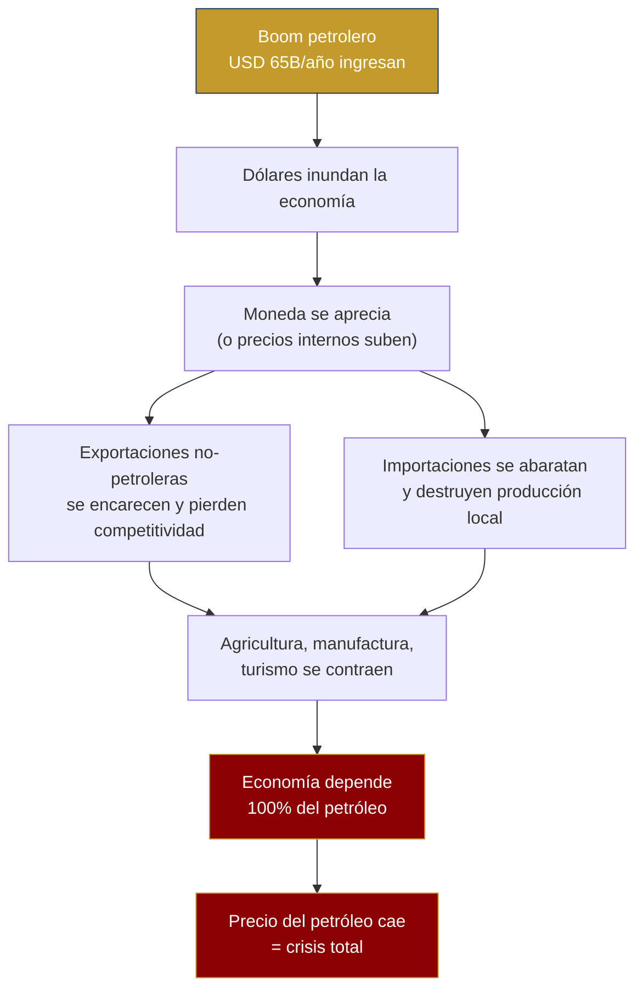
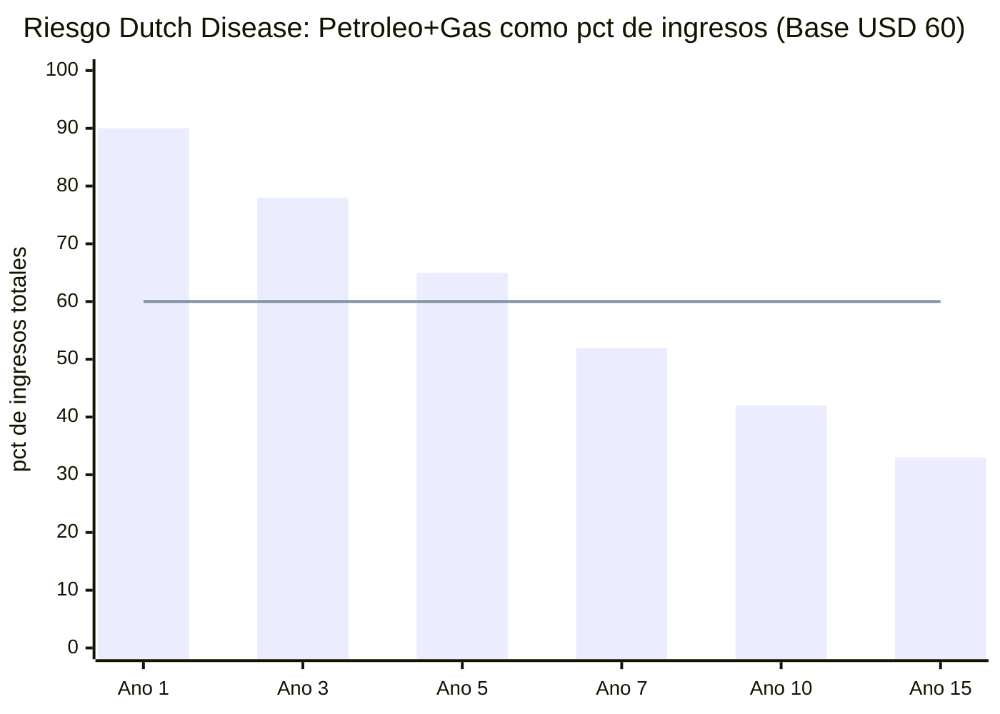
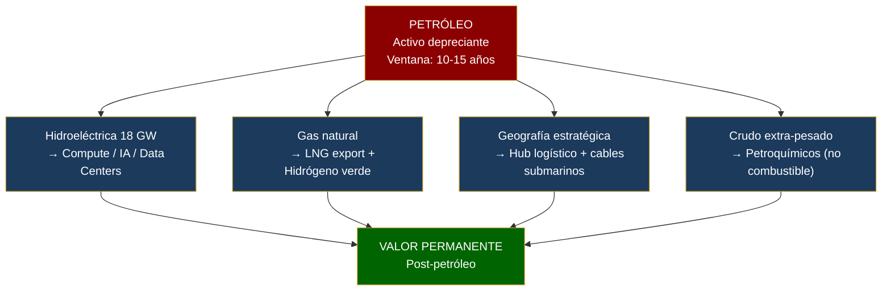

# Dutch Disease: The Trap to Avoid

> Venezuela already suffered Dutch Disease for 50 years. This plan cannot repeat the mistake.

:::danger Definition
**Dutch Disease** occurs when a natural resource boom appreciates the real currency, makes non-oil exports more expensive, destroys manufacturing and agriculture, and creates resource dependency. Named after the collapse of Dutch industry following the Groningen gas discovery (1959).
:::

---

## How It Works

---

## Historical Cases

| Country | Period | What happened | Outcome | Source |
|------|---------|----------|-----------|--------|
| **Netherlands** | 1959-1977 | Groningen gas discovery -> guilder appreciation | Manufacturing fell from 30% to 20% of GDP; services partially compensated | [IMF WP/2003/12](https://www.imf.org/external/pubs/ft/wp/2003/wp0312.pdf) |
| **Nigeria** | 1970-2000 | Oil boom -> naira appreciated -> agriculture collapsed | Agriculture fell from 60% to 20% of GDP; poverty increased despite oil revenues | [World Bank, 2003](https://documents.worldbank.org/) |
| **Venezuela** | 1973-1998 | Oil boom -> bolivar appreciated -> "Saudi Venezuela" | GDP per capita fell 22% between 1978-1998 despite USD 300B+ in oil revenues; manufacturing destroyed | [Hausmann & Rodriguez, 2014](https://www.hup.harvard.edu/books/9780674072848) |
| **Norway** | 1970-present | Oil boom -> sovereign fund absorbs dollars -> managed krone | Manufacturing contracted but fund accumulated USD 2.2T; diversified economy | [NBIM](https://www.nbim.no/) |
| **Botswana** | 1967-present | Diamond boom -> Pula fund + education investment + managed exchange rate | GDP per capita: USD 70 (1966) -> USD 7,500 (2023); most stable democracy in Africa | [World Bank](https://data.worldbank.org/country/botswana) |

---

## Venezuela S.A. Plan Vulnerability

In the optimistic scenario (year 15):

| Source | Revenue | % of total |
|--------|---------|------------|
| Net oil | USD 42,700 M | 33% |
| Tax collection | USD 40,000 M | 31% |
| Other engines (gas, mining, tourism, tech, agriculture...) | USD 49,300 M | 36% |
| **Total** | **USD 132,000 M** | **100%** |

**Oil is 33% of direct revenues in year 15, but indirectly finances the growth that generates tax revenue.** In the base scenario (USD 60), dependency is even higher during the first 10 years: oil + gas represent ~60-70% of revenues.

**Danger zone:** Years 1-7, when oil + gas represent >60% of revenues. That is exactly when Dutch Disease hits hardest.

---

## 6 Defense Mechanisms

### 1. 100% external sovereign fund

All oil revenues go to the [sovereign fund](/02-motor-financiero/fondo-soberano) which invests **100% outside Venezuela**. Oil dollars never enter the domestic economy directly — only the fund's return (3-4%/year), metered out.

**Precedent:** [NBIM (Norway)](https://www.nbim.no/) — 100% external assets. It is the most proven anti-Dutch Disease mechanism in the world.

### 2. Fiscal sterilization

The state does not finance its spending with oil but with taxes (15% flat + 12% VAT). Oil revenues go to the fund, not the budget. This breaks the transmission channel: more oil ≠ more public spending ≠ more domestic demand ≠ appreciation.

### 3. Compensatory ZEETs

The [Special Economic Technology Zones](/05-transformacion/hubs-tech) create non-oil export sectors with differentiated tax incentives, protected from the appreciation effect:

- 10-year tax exemption for tech exports
- Wage subsidy for tech jobs (offset oil sector wages)
- Dedicated infrastructure (energy, internet) at subsidized cost

**Precedent:** [Shenzhen (China)](https://en.wikipedia.org/wiki/Shenzhen) and [Dubai (UAE)](https://www.difc.ae/) — special zones that created non-oil industries within oil economies.

### 4. Investment in non-oil productivity

Allocate 20-30% of fund returns to:
- Agroindustrial infrastructure (irrigation, storage, cold chain)
- Technical training (reskilling programs for non-oil sectors, see [Human Capital](/05-transformacion/capital-humano))
- Subsidized credit for exporting SMEs

### 5. Real exchange rate monitoring

Public dashboard measuring monthly:
- Real effective exchange rate (REER) vs. trading partners
- Non-oil export competitiveness index
- Automatic alerts if REER appreciates >10% in 12 months

### 6. Dollarization as a differentiating factor

:::info De facto dollarization changes the equation
Venezuela operates under de facto dollarization (~60% of transactions in USD, [ENCOVI/UCAB 2023](https://www.proyectoencovi.com/)). If dollarization is formalized (like Ecuador in 2000):
- **There is no currency to appreciate** — the classic Dutch Disease mechanism weakens
- Risk shifts to **internal price inflation** (more dollars -> prices rise)
- Mitigation: external fund + fiscal sterilization remain effective

**Precedent:** Ecuador dollarized in 2000 with GDP of USD 18B; today USD 115B. It didn't eliminate Dutch Disease but changed its mechanism. ([Central Bank of Ecuador](https://www.bce.fin.ec/))
:::

---

## Early Warning Indicators

| Indicator | Alert threshold | Action |
|-----------|-----------------|--------|
| Oil + gas > 60% of revenues | Year 5+ | Accelerate diversification, more ZEET incentives |
| Manufacturing < 10% of GDP | Any year | Compensatory subsidies + SME credit |
| Food imports > 50% | Year 5+ | Urgent agroindustrial investment |
| Oil sector wages > 3x national average | Any year | Wage cap or compensatory tax |
| REER appreciates > 15% in 24 months | Any year | Fiscal intervention + flow review |

**Sources:** [IMF — The Dutch Disease: Causes and Effects (WP/2003/12)](https://www.imf.org/external/pubs/ft/wp/2003/wp0312.pdf) | [World Bank — Resource Curse or Blessing?](https://documents.worldbank.org/) | [Hausmann & Rodriguez — Venezuela Before Chavez (2014)](https://www.hup.harvard.edu/books/9780674072848) | [NBIM](https://www.nbim.no/)

---

## The Window Is Closing: Oil as a Depreciating Asset

> Oil isn't disappearing tomorrow. But its window of maximum value is 10-15 years, not 30. Every year of delay destroys value.

### The Competition Has Already Won on Cost

| Energy source | LCOE 2024 (USD/MWh) | Projected LCOE 2035 | Trend | Source |
|-------------------|---------------------|----------------------|-----------|--------|
| **Utility solar** | **USD 29** | USD 15-20 | ↓ accelerating | [IRENA — Renewable Power Costs 2024](https://www.irena.org/publications/2024/Sep/Renewable-Power-Generation-Costs-in-2023) |
| Onshore wind | USD 33 | USD 20-25 | ↓ stable | [IRENA, 2024](https://www.irena.org/publications/2024/Sep/Renewable-Power-Generation-Costs-in-2023) |
| Natural gas (CCGT) | USD 45-65 | USD 50-70 | -> stable | [IEA WEO 2024](https://www.iea.org/reports/world-energy-outlook-2024) |
| **Orinoco Belt (extra-heavy)** | **USD 40-50** | **USD 40-50** | -> no improvement | [Rystad Energy](https://www.rystadenergy.com/) |

Orinoco Belt extra-heavy crude is already **more expensive than solar** as an energy source. By 2035, the gap will be 2-3x.

### Oil Demand: The Peak Is Coming

| Indicator | Projection | Source |
|-----------|-----------|--------|
| **Peak global oil demand** | **2028-2030** | [IEA — World Energy Outlook 2024](https://www.iea.org/reports/world-energy-outlook-2024) |
| EV share of global sales | 80% by 2040 (NZE scenario) | [IEA — Global EV Outlook 2024](https://www.iea.org/reports/global-ev-outlook-2024) |
| Oil demand for transport | -45% by 2040 vs. 2023 (NZE) | [IEA WEO 2024](https://www.iea.org/reports/world-energy-outlook-2024) |
| Global clean energy investment | **USD 2T/year** (2024) vs. USD 1T in fossil fuels | [BloombergNEF, 2024](https://about.bnef.com/energy-transition-investment/) |

:::danger The window is 10-15 years, not 30
If peak demand is 2028-2030 and the decline is gradual (-2-3% per year post-peak), Venezuela has **~10-15 years of strong demand**. After that, the Orinoco Belt's extra-heavy crude — with high extraction costs and high carbon footprint — will be **the first to exit the market**. It's not Saudi oil (USD 10/barrel extraction) that loses. It's Venezuelan.
:::

### Pivot Strategy: From Oil to Permanent Value

| Current asset | Strategic pivot | Why it works | Post-oil value |
|---------------|-------------------|------------------|---------------------|
| **Hydroelectric (18 GW Caroni)** | Compute, AI, data centers | Clean + cheap energy = competitive advantage for hyperscalers (AWS, Google, Microsoft) | USD 5-10,000 M/year in cloud services |
| **Natural gas (200 TCF reserves)** | LNG export + green hydrogen | Gas is a transition fuel; green H2 with hydro is competitive by 2030 | USD 8-15,000 M/year in LNG+H2 |
| **Geography (Caribbean, proximity to U.S.)** | Logistics hub + submarine data cables | [Requires research] — estimated cost of Caribbean port hub | USD 3-5,000 M/year in logistics services |
| **Extra-heavy crude** | Petrochemicals (plastics, asphalt, lubricants) — not fuel | Petrochemical demand grows +30% by 2040 even in NZE scenario ([IEA, 2024](https://www.iea.org/reports/the-future-of-petrochemicals)) | USD 10-20,000 M/year in petrochemicals |

### The Urgency Is Real

Every year of delay in executing the plan has a double cost:

1. **Opportunity cost:** ~USD 35,000-40,000 M/year in oil revenues not generated (difference between 0.9M and 3M bpd at USD 60).
2. **Depreciation cost:** The present value of reserves falls ~2-3% annually as the energy transition advances and carbon discounts increase.

In 5 years of delay, Venezuela loses **~USD 175,000-200,000 M** in combined value. Oil is fuel — but it's fuel with an expiration date.

**Sources:** [IEA — World Energy Outlook 2024](https://www.iea.org/reports/world-energy-outlook-2024) | [IEA — Global EV Outlook 2024](https://www.iea.org/reports/global-ev-outlook-2024) | [IRENA — Renewable Power Generation Costs 2024](https://www.irena.org/publications/2024/Sep/Renewable-Power-Generation-Costs-in-2023) | [BloombergNEF — Energy Transition Investment 2024](https://about.bnef.com/energy-transition-investment/) | [IEA — Future of Petrochemicals](https://www.iea.org/reports/the-future-of-petrochemicals)
