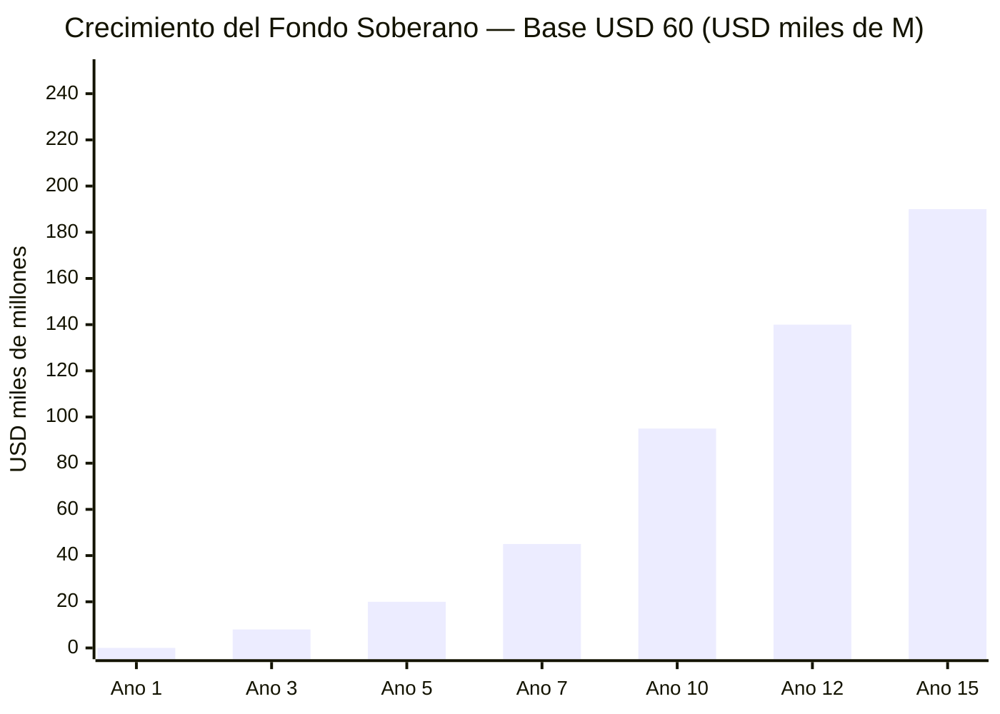
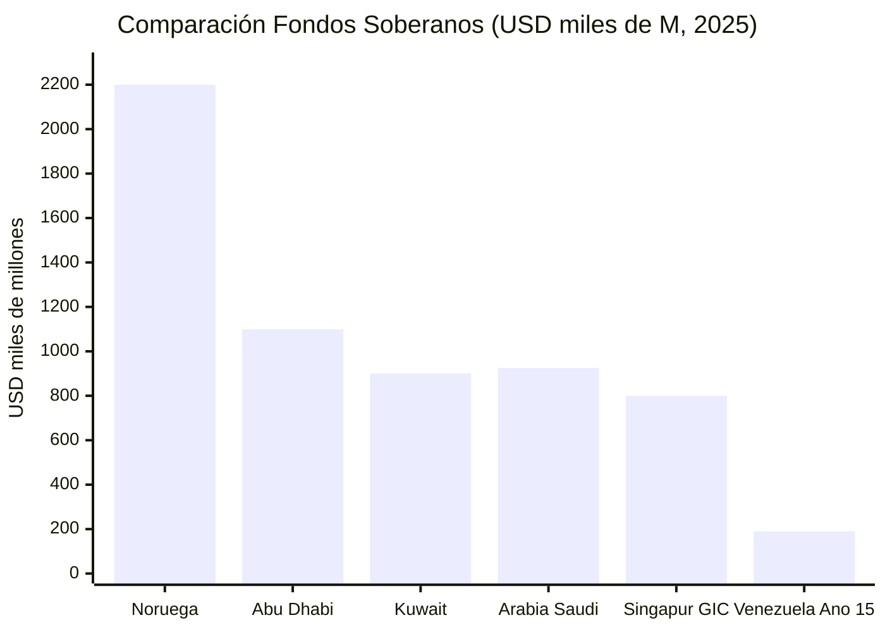
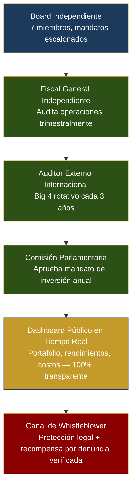
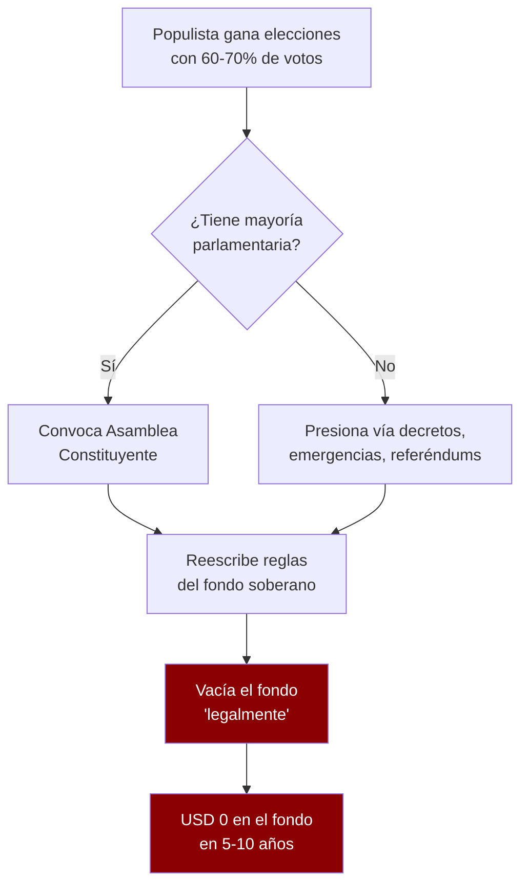
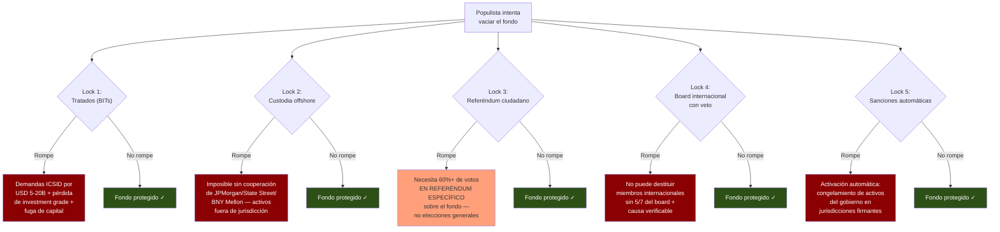

# Sovereign Fund: The Norway Model

The Norwegian fund: [USD 2.2 T at end of 2025](https://www.nbim.no/en/investments/the-funds-value/), [USD 247,000 M profit in 2025](https://www.cnbc.com/2026/01/29/norway-sovereign-wealth-fund-2025-return-nbim-trillion-oil-stocks-tech-ai-banks-silver.html), 7,200+ companies, 1.5% of all global stocks, [25% of the Norwegian budget](https://fortune.com/europe/2025/07/30/how-sparsely-populated-norway-amassed-1-8-trillion-sovereign-wealth-fund/).

## The 5 Constitutional Rules

1. **Spending limit 3–4%** — Modification requires 2/3 parliament + referendum
2. **100% external investment** — Prevents Dutch Disease
3. **Full transparency** — Portfolio published like [NBIM](https://www.nbim.no/en/investments/)
4. **Independent council** — 7 members (2 parliament, 2 citizens, 2 international, 1 independent)
5. **Mandatory citizen dividend** — Minimum 10% of annual fund returns, distributed per capita

## 15-Year Projection (USD 60/Barrel)

| Phase | Production | Annual Contribution | Accumulated Value |
|------|-----------|-------------|----------------|
| Years 1–3 | 1.1–1.4 M bpd | USD 3–5,000 M | USD 8–15,000 M |
| Years 4–7 | 1.5–2.0 M bpd | USD 5–8,000 M | USD 35–55,000 M |
| Years 8–10 | 2.0–2.5 M bpd | USD 8–12,000 M | USD 70–120,000 M |
| Years 11–15 | 2.5–3.0 M bpd | USD 10–15,000 M | USD 160–220,000 M |

:::info Oil-only model
This projection includes **only contributions from 30% of net oil revenues** at USD 60/barrel. With Brent at USD 70-80 the fund reaches USD 250-470B (see [The Dream](/07-ejecucion/el-sueno)). With additional contributions from mining, gas, and diversification, the range goes even higher.
:::

---

## Governance: How to Avoid Another FONDEN

:::danger The most important lesson
Between 2005 and 2015, Venezuela diverted **USD 300,000+ M** through FONDEN (National Development Fund) with no accountability, no public audits, no parliamentary oversight ([Transparencia Venezuela](https://transparenciave.org/)). **This plan's sovereign fund will only be as good as its governance.**
:::

### Board Structure

| Member | Appointed by | Tenure | Removal | Restriction |
|---------|------------|---------|----------|-------------|
| 2 international experts | Panel from [NBIM](https://www.nbim.no/) + [GIC](https://www.gic.com.sg/) + [World Bank](https://www.worldbank.org/) | 6 years, non-renewable | 2/3 of board + justified cause | Venezuelan nationality not required |
| 2 parliamentary representatives | Parliament (1 ruling party + 1 opposition) | 4 years, 1 renewal | Parliament by 2/3 | Cannot be active ministers |
| 2 citizen representatives | Civic lottery from pre-qualified pool (financial professionals) | 3 years, non-renewable | 2/3 of board + justified cause | Random selection eliminates capture |
| 1 independent chair | Nominated by the 6 above, ratified by Parliament | 5 years, 1 renewal | 2/3 of board + 2/3 Parliament | Cannot have been a public official in last 10 years |

**Reference:** [NBIM](https://www.nbim.no/en/organisation/about-norges-bank-investment-management/) has 9 board members, all independent. [GIC](https://www.gic.com.sg/governance/) separates board from government although the PM is chairman (criticized). The Venezuelan proposal eliminates this conflict.

### Oversight Stack (6 Layers)

### Anti-Capture Mechanisms

| Mechanism | How it works | Precedent |
|-----------|--------------|-----------|
| **100% external investment** | The fund does not invest in Venezuela — avoids political pressure to finance domestic projects | [NBIM](https://www.nbim.no/en/the-fund/about-the-fund/): 100% assets outside Norway |
| **3-4% spending rule** | Only the 15-year average real return can be spent, not the principal | Norway: 3% of fund value/year |
| **Staggered terms** | The 7 members never renew at the same time — no single government appoints a majority | [Federal Reserve](https://www.federalreserve.gov/): 14-year staggered terms |
| **Constitutional lock** | Modifying fund rules requires 2/3 of Parliament + popular referendum | Alaska: [Permanent Fund](https://apfc.org/) constitutionally protected |
| **Sovereign lending prohibition** | The fund cannot lend to the government or guarantee public debt | Anti-FONDEN: FONDEN lent USD 170B+ to the government with no return |
| **Cross-audit** | External auditor reports to Parliament, not the board — prevents collusion | [Santiago Principles](https://www.ifswf.org/santiago-principles), Principle 16 |

### Governance Comparison Table

| Dimension | FONDEN (Venezuela) | [NBIM](https://www.nbim.no/) (Norway) | [GIC](https://www.gic.com.sg/) (Singapore) | [ADIA](https://www.adia.ae/) (Abu Dhabi) | **Venezuela S.A.** |
|-----------|-------|------|-----|------|--------------|
| Transparency | Zero | Full | Partial | Partial | Full + dashboard |
| Independent board | Appointed by president | Independent | PM is chairman | Royal family | Mixed + civic lottery |
| External audit | No audit | Annual | Annual | Annual | Quarterly + rotation |
| Spending rule | No limit | 3%/year | Implicit | Implicit | 3-4% constitutional |
| Domestic investment | 100% domestic | 100% external | Mixed | Mixed | 100% external |
| Legal protection | Presidential decree | Parliamentary law | Ordinary law | Royal decree | Constitutional + referendum |
| [Linaburg-Maduell Score](https://www.swfinstitute.org/research/linaburg-maduell-transparency-index) | 1/10 | 10/10 | 6/10 | 6/10 | **Target: 10/10** |

### Constitutional Locks: Stress Scenarios

| Scenario | Risk | Protection |
|-----------|--------|-----------|
| **Populist wins elections** | Wants to spend the fund on social programs | 3-4% spending rule requires referendum to change; independent board executes mandate, not executive orders |
| **Constituent assembly** | New constitution eliminates the fund | Fund is custodied in foreign jurisdiction (Norway/Singapore); changing custodian requires 2/3 board + auditor + parliament |
| **National emergency** | Earthquake, pandemic, oil price collapse | Emergency clause allows spending up to 10% of the fund with approval of 2/3 parliament + board + citizen ratification within 90 days |
| **Military pressure** | FANB demands fund resources | Fund custodied offshore; no domestic actor can order transfers; requires multiple international signatures |
| **Hyperinflation** | Government tries to monetize the fund | Fund denominated in USD/EUR/real assets; lending to central bank prohibited |

### Investment Mandate

| Category | Allocation | Benchmark |
|-----------|-----------|-----------|
| Global fixed income | 30% | Bloomberg Global Aggregate |
| Global equities | 50% | MSCI ACWI |
| Real estate | 10% | FTSE EPRA Nareit Global |
| Infrastructure (outside Venezuela) | 5% | Cambridge Associates Infrastructure |
| Cash/Liquidity | 5% | SOFR + 50bps |

**Express prohibitions:**
- Investment in Venezuela (avoids conflict of interest and political pressure)
- Controversial weapons, tobacco (aligned with [NBIM exclusions](https://www.nbim.no/en/responsible-investment/exclusion-of-companies/))
- Loans to Venezuelan government or public entities
- Leveraged derivatives or speculative investments

**Sources:** [Santiago Principles (IFSWF)](https://www.ifswf.org/santiago-principles) | [NBIM Mandate](https://www.nbim.no/en/organisation/governance-model/management-mandate/) | [Linaburg-Maduell Index (SWFI)](https://www.swfinstitute.org/research/linaburg-maduell-transparency-index)

---

## Supra-Constitutional Locks: Beyond the Constitution

:::danger Constitutions don't protect sovereign funds
Argentina violated its own constitution dozens of times. Ecuador rewrote it to dissolve its oil fund. Bolivia did the same with its hydrocarbon fund. **A populist with 70%+ approval can convene a constituent assembly and rewrite any constitutional lock in 6-12 months.** If the fund's only protection is the constitution, the fund has an expiration date.
:::

### The problem: constitutions are paper

A constitution is an internal promise. A government with enough popular support can:
1. Convene a Constituent Assembly (Venezuela 1999, Ecuador 2008, Bolivia 2009)
2. Rewrite the sovereign fund rules
3. Empty the fund "legally" under the new constitution

**FONDEN proved it:** it was created by decree, with no constitutional lock, no oversight. Result: **USD 300,000+ M diverted** in 10 years ([Transparencia Venezuela](https://transparenciave.org/)). But even with constitutional locks, the result would have been the same — the 1999 constituent assembly had already demonstrated that everything is rewritable.

### The solution: locks that exist outside national jurisdiction

Real protection comes from mechanisms that a government cannot change unilaterally, because the consequences of breaking them are international, automatic, and irreversible.

| # | Lock | What it prevents | Precedent | Difficulty to break |
|---|------|-------------|-----------|---------------------|
| 1 | **Bilateral investment treaties (BITs)** | Expropriation of the fund or rule changes for investors | [Colombia-U.S. BIT (2012)](https://investmentpolicy.unctad.org/): protects against expropriation without compensation | **High** — breaking triggers ICSID lawsuits, loss of investment grade, capital flight |
| 2 | **Irrevocable offshore custody** | Physical access to assets without multiple international signatures | [NBIM](https://www.nbim.no/en/the-fund/about-the-fund/): 100% of assets outside Norway; Norwegian government cannot order direct transfers | **Very high** — assets are physically outside the country; requires cooperation from international custodians (JPMorgan, State Street, BNY Mellon) |
| 3 | **Citizen referendum for withdrawals >1% of the fund** | Gradual "salami" emptying (1% today, 2% tomorrow, fund empty in 10 years) | [Alaska Permanent Fund](https://apfc.org/): state constitutional protection + citizen dividend; **42 years intact** since 1982 | **High** — requires national campaign and 60%+ votes specifically about the fund |
| 4 | **International board members with veto power** | Board capture by populist government | [Santiago Principles](https://www.ifswf.org/santiago-principles), Principle 6: separation of management and government | **High** — cannot be fired by national government; removal requires 5/7 of the board + verifiable cause |
| 5 | **25-year sunset clause** | Premature rule changes by new governments | Long-term infrastructure concession model; [Chile AFP (1981)](https://www.spensiones.cl/): reforms only after 27 years of operation | **High** — locks only expire after 25 consecutive years of democracy certified by OAS |
| 6 | **Automatic sanctions trigger** | "Creative" rule violations without consequences | [IMF conditionality](https://www.imf.org/en/About/Factsheets/Sheets/2023/IMF-Conditionality): non-compliance automatically triggers suspension of disbursements | **Very high** — predefined in treaty; automatic activation without need for political decision |

### Comparison: 3 Protection Models

| Dimension | FONDEN (Venezuela) | NBIM (Norway) | Alaska PFD (U.S.) | **Venezuela S.A.** |
|-----------|-------------------|----------------|---------------------|-------------------|
| Constitutional locks | **Zero** — presidential decree | Parliamentary law | State constitution | Constitutional + referendum |
| International locks | **Zero** | Offshore custody + EU treaties | N/A (state jurisdiction) | BITs + offshore custody + IMF conditionality |
| Citizen lock | **Zero** | Transparency + public pressure | **Direct dividend** — touching the fund = losing your check | 60%+ referendum + citizen dividend |
| Board lock | **Zero** — president appoints and removes | Independent board | State board | Mixed board with international veto |
| Outcome | **USD 300,000+ M stolen** | **USD 2.2 T intact** (25+ years) | **USD 80,000+ M intact** (42+ years) | Target: irreversible multi-lock |
| Source | [Transparencia Venezuela](https://transparenciave.org/) | [NBIM](https://www.nbim.no/) | [Alaska Permanent Fund Corp.](https://apfc.org/) | Proprietary design |

:::tip The citizen dividend is the strongest lock
In Alaska, no politician dares to touch the Permanent Fund because every citizen receives an annual check (USD 1,312 in 2024, [Alaska PFD](https://pfd.alaska.gov/)). Touching the fund = taking money directly from every voter. It's political suicide. The 10% dividend proposed for Venezuela creates the same effect: **40 million guardians of the fund.**
:::

---

## Compensation: Pay Top-Tier or Lose the Fund

:::caution The "savings" paradox in compensation
Paying USD 5M/year in salaries to manage a USD 100-200B fund seems expensive. Not paying competitive salaries and losing 1% in annual returns due to poor management costs **USD 1-2B/year**. FONDEN had no compensation standards, no accountability, no talent. Result: USD 300,000+ M lost.
:::

### Why Pay USD 1M+ to a CIO

Lee Kuan Yew said it best: *"If you pay peanuts, you get monkeys."* Sovereign fund management talent competes with Wall Street, hedge funds, and private equity. If Venezuela offers USD 200K when GIC offers USD 2M, talent goes to GIC — and Venezuela loses billions in suboptimal returns.

| Role | Market salary (reference) | Venezuela S.A. proposal | Performance bonus | Source |
|-----|-------------------------------|--------------------------|----------------------|--------|
| **CEO / Executive Director** | USD 1-3M/year (GIC, Temasek) | **USD 800K-1.5M/year** | +50% if return >5% real | [Temasek Annual Report 2024](https://www.temasek.com.sg/en/our-financials/annual-report) |
| **CIO (Chief Investment Officer)** | USD 1-5M/year (NBIM CIO: ~USD 1M; hedge funds: USD 5M+) | **USD 500K-1.2M/year** | +100% if return >benchmark+1% | [NBIM Annual Report 2024](https://www.nbim.no/en/publications/annual-report/) |
| **Board members (part-time)** | USD 100-300K/year (NBIM, GIC) | **USD 100-200K/year** | None — independence requires fixed income | [GIC Governance](https://www.gic.com.sg/governance/) |
| **Risk Officer** | USD 500K-1M/year (global financial market) | **USD 400-800K/year** | +30% if zero mandate breaches | Financial market benchmark |
| **Investment team (10-15 analysts)** | USD 150-400K/year | **USD 120-300K/year** | Variable by team | Regionally adjusted benchmark |

**Total compensation cost: USD 5-8M/year** to manage a fund of **USD 100-200B**.

### Compensation ROI

| Scenario | Annual compensation | Fund return (USD 150B base) | Value generated |
|-----------|-------------------|--------------------------------------|----------------|
| Mediocre talent (no competitive compensation) | USD 1-2M | 3% (below benchmark) | USD 4,500M |
| Competitive talent (market compensation) | USD 5-8M | 6% (at benchmark) | USD 9,000M |
| **Difference** | **+USD 4-6M** | **+3 percentage points** | **+USD 4,500M/year** |

**ROI: ~750x.** Every extra dollar in compensation generates USD 750 in additional return.

**Temasek:** with top-tier compensation, it has generated **14% annualized return over 50 years** ([Temasek, 2024](https://www.temasek.com.sg/en/our-financials/annual-report)). FONDEN with zero standards generated **zero return and USD 300,000+ M in losses**.

### Political Solution: Compensation Tied to Results

The political problem of paying USD 1M+ to officials in a country with a minimum wage of USD 3.50/month is solved like this:

1. **Moderate base salary** (USD 500-800K) — comparable to upper-middle-income country public sector
2. **Bonus only if return exceeds benchmark** — if the fund loses, the team earns only the base
3. **Full transparency** — compensation published on dashboard alongside fund performance
4. **Citizen as judge** — if the fund returns 6% and the team earns USD 1.5M, the citizen sees that their dividend is higher thanks to that management

---

## Anti-Political Capture: The 8-12 Year Cycle

:::danger The LATAM pattern: every 8-12 years a populist breaks the rules
Latin America produces populists with overwhelming majorities in predictable cycles. Argentina: Menem (1989) -> Kirchner (2003) -> Fernandez (2019). Ecuador: Correa (2007) dissolved the oil fund FEIREP. Bolivia: Morales (2006) nationalized hydrocarbons and emptied the stabilization fund. **If the sovereign fund only has constitutional locks, it will be emptied in the first populist cycle.**
:::

### The 3 Cases That Prove the Problem

| Country | Fund | What happened | Lock that failed | Source |
|------|-------|---------|---------------|--------|
| **Ecuador** | FEIREP (Oil Stabilization Fund) | Correa (2007) convened a constituent assembly, dissolved the fund, redirected oil revenues to current spending | Constitutional lock: the constituent assembly rewrote everything | [Central Bank of Ecuador](https://www.bce.fin.ec/) |
| **Bolivia** | Hydrocarbon stabilization fund | Morales (2006) nationalized and redirected revenues to direct social bonds (Bono Juancito Pinto, Renta Dignidad) | Legal lock: ordinary law modified with simple majority | [Central Bank of Bolivia](https://www.bcb.gob.bo/) |
| **Argentina** | Sustainability Guarantee Fund (FGS) | Kirchner (2008) nationalized AFJPs and absorbed USD 30,000 M from FGS; Fernandez used the fund to finance current spending | Institutional lock: the government controlled the ANSES board | [ANSES](https://www.anses.gob.ar/) |

### Why Constitutions Fail

### Why Supra-Constitutional Locks Are Harder to Break

### The Key Difference: Cost of Breaking

| Lock | Cost to break for a populist | Time to break |
|------|----------------------------------|-------------------|
| Constitution | Low — constituent assembly in 6-12 months with majority | 6-12 months |
| Parliamentary law | Very low — simple majority | 1-3 months |
| **Bilateral treaty (BIT)** | **High** — ICSID lawsuits (USD 5-20B), FDI loss, credit downgrade | Years of litigation |
| **Offshore custody** | **Very high** — physically impossible without cooperation from international custodians | Impossible unilaterally |
| **Citizen referendum (60%+)** | **High** — must convince 60%+ to vote specifically to empty THEIR fund (their dividend) | 6-12 months of campaign with uncertain outcome |
| **International board with veto** | **High** — cannot fire members appointed by international entities | Years of legal battle |
| **Automatic sanctions** | **Very high** — instant activation, immediate economic consequences | Immediate |

:::info The strategy: make breaking the fund cost more than respecting it
A populist makes political calculations. If breaking the fund costs international lawsuits + capital flight + sanctions + losing the citizen dividend, the math is clear: **it's cheaper to respect the rules than to break them.** That's what Norway achieved through culture. Venezuela must achieve it by design.
:::

**Sources:** [Santiago Principles (IFSWF)](https://www.ifswf.org/santiago-principles) | [NBIM](https://www.nbim.no/) | [Alaska Permanent Fund Corporation](https://apfc.org/) | [ICSID (World Bank)](https://icsid.worldbank.org/) | [UNCTAD BIT Database](https://investmentpolicy.unctad.org/)
