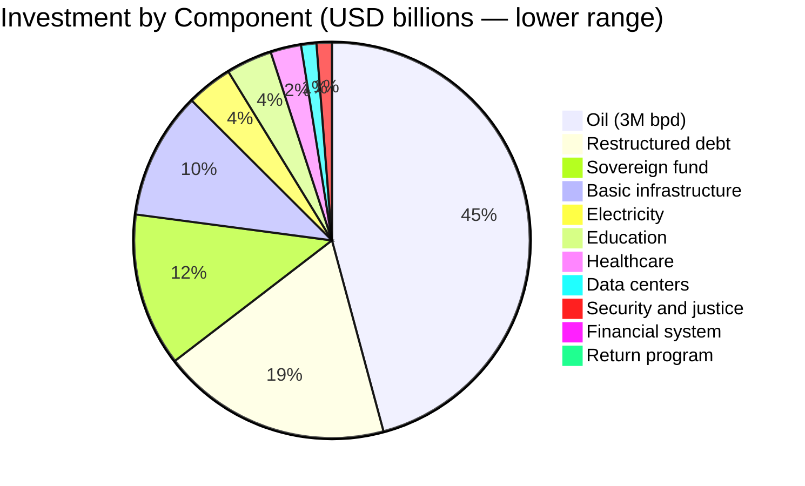
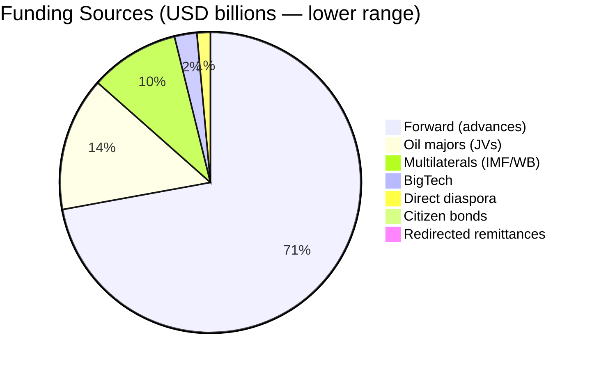
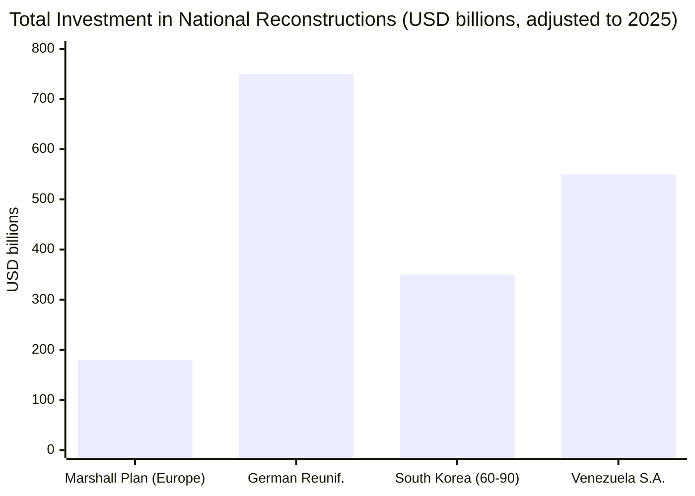
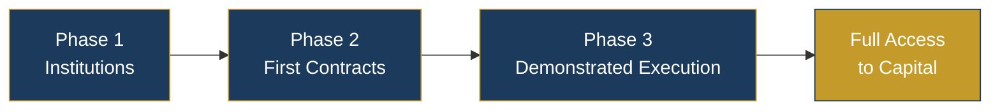

# Total Investment: USD 550,000–750,000 M over 15 Years

## Investment Distribution

```mermaid
xychart-beta
    title "Investment by Component (USD billions — lower vs. upper range)"
    x-axis ["Oil", "Debt", "Sov. Fund", "Infrastr.", "Electric.", "Education", "Health", "Security", "Financial", "Data Ctr."]
    y-axis "USD billions" 0 --> 200
    bar [183, 75, 50, 41.5, 15, 15, 10, 5, 4, 5]
    bar [183, 85, 100, 81, 25, 25, 20, 8, 10, 10]
```

## Detail by Component

| Component | Investment | Source | Priority |
|-----------|-----------|--------|-----------|
| Oil (3M bpd) | USD 183,000 M | [Rystad, Jan. 2026](https://www.rigzone.com/news/could_venezuela_production_get_back_to_3mm_barrels_per_day-08-jan-2026-182716-article/) | CRITICAL |
| Debt | USD 75–85,000 M | [Citigroup](https://www.cnbc.com/2026/01/04/venezuelas-billions-in-distressed-debt-who-is-in-line-to-collect.html) | CRITICAL |
| Electricity | USD 15–25,000 M | Est. 18 GW | CRITICAL |
| Basic infrastructure | USD 41,500–81,000 M | Telecom + water + housing + transport + agri | CRITICAL |
| Education | USD 15–25,000 M | By level | CRITICAL |
| Health | USD 10–20,000 M | WHO/PAHO | CRITICAL |
| Security and justice | USD 5–8,000 M | [Georgia Model](https://successfulsocieties.princeton.edu/sites/g/files/toruqf5601/files/Policy_Note_ID126.pdf) | CRITICAL |
| Financial system | USD 4–10,000 M | Capitalization + platforms + guarantees | HIGH |
| Pensions (transition) | USD 6–12,000 M/year | Universal Pillar 1 + transition | HIGH |
| Data centers | USD 5–10,000 M | [ResearchAndMarkets](https://www.businesswire.com/news/home/20250505397648/en/) | HIGH |
| Return program | USD 500–1,500 M | Repatriation bonds + platform | HIGH |
| Initial sovereign fund | USD 50–100,000 M | Norwegian model | STRATEGIC |

:::info Note on ranges
The lower range assumes efficient execution with significant private participation (concessions, JVs, PPPs). The upper range assumes greater direct state participation. The Venezuela S.A. model prioritizes the lower range through concessions and private capital.
:::

## Capital Sources

```mermaid
xychart-beta
    title "Capital Sources (USD billions — lower vs. upper range)"
    x-axis ["Forwards", "Majors", "Multilat.", "BigTech", "Diaspora", "Citizen Bonds", "Remittances"]
    y-axis "USD billions" 0 --> 320
    bar [150, 30, 20, 5, 3, 1.5, 1]
    bar [300, 50, 40, 10, 8, 3, 2]
```

| Source | Amount | Mechanism |
|--------|-------|-----------|
| Forward (advances) | USD 150–300,000 M | 20% of reserves at USD 60, 20–25% advance |
| Oil majors | USD 30–50,000 M | JVs (Chevron already operating) |
| Multilaterals | USD 20–40,000 M | Post-IMF restructuring |
| Citizen bonds | USD 1,500–3,000 M | 10% of 40M x USD 200 |
| Direct diaspora | USD 3,000–8,000 M | 5% of 8M x USD 2–5K |
| Redirected remittances | USD 1–2,000 M/year | M-Pesa model platform |
| BigTech | USD 5–10,000 M | AWS, Google, Microsoft |

## Comparison: Venezuela vs. Historical Reconstructions

| Program | Investment | Timeframe | Outcome |
|----------|-----------|-------|-----------|
| Marshall Plan (Europe) | ~USD 180,000 M (adjusted) | 4 years | Post-war reconstruction |
| German Reunification | ~USD 750,000 M | 20 years | East GDP grew 250% |
| South Korea (1960–90) | ~USD 350,000 M | 30 years | From USD 79 to USD 6,500 GDP/capita |
| **Venezuela S.A.** | **USD 550–750,000 M** | **15 years** | **Target: GDP/capita USD 5,000->15,000** |

---

## Credible Signaling: Solving the Chicken-and-Egg

> USD 183,000 M in oil investment requires conditions that don't exist. Those conditions require investment to be created. Who moves first?

### The Problem

No oil major invests USD 183,000 M in a country with:
- Active default since 2017
- U.S. sanctions (partially in force)
- No verifiable rule of law
- Operationally collapsed PDVSA

But the conditions to lift sanctions, restructure debt, and reform institutions require capital that won't arrive without investment. It's a **classic chicken-and-egg** described by [Hausmann, Rodrik & Velasco (2005)](https://drodrik.scholar.harvard.edu/publications/growth-diagnostics) in their growth diagnostics framework.

### The Solution: Sequential Signaling

The key is **credible signaling** — verifiable actions that demonstrate commitment before asking for money. Each phase unlocks the next.

| Phase | Credible signal | Investment unlocked | Estimated amount |
|------|--------------|--------------------------|----------------|
| **1: Institutions** (Year 0-1) | Public anti-corruption dashboard, legislated fiscal rules, appointment of debt negotiation team, IMF stand-by agreement | Chevron expands operations, first OFAC licenses | **USD 3,000–5,000 M** |
| **2: First contracts** (Year 1-3) | First forward contracts signed, JV with 2-3 majors, Citgo stabilized | Oil majors expand JVs (TotalEnergies, Shell, Repsol), multilaterals disburse | **USD 10,000–20,000 M** |
| **3: Demonstrated execution** (Year 3-5) | 2 years of fiscal compliance, production rising (1.5M+ bpd), first sovereign fund disbursement | Full upstream investment, financial sector, BigTech data centers | **USD 50,000–100,000 M** |

### Why It Works

1. **Chevron is already operating** — [OFAC License #44](https://www.reuters.com/business/energy/chevron-begins-shipping-venezuelan-oil-us-after-license-2022-11-26/) allowed Chevron to resume operations. This proves that the "conditional license" mechanism works.
2. **Phase 1 costs almost nothing** — Legislating fiscal rules, publishing a dashboard, and appointing advisors requires no capital. It requires political will.
3. **Each phase generates verifiable evidence** — No blind trust is asked for. Verification of concrete results is required before unlocking the next tranche.

:::info Precedent: Rwanda post-genocide
Rwanda applied sequential signaling between 1994-2010: first gacaca tribunals (signal of justice), then anti-corruption reforms (signal of governance), then opening to investment (capital). Result: [average growth of 7.5% per year for 20 years](https://data.worldbank.org/country/rwanda). The mechanism is the same: verifiable action before asking for money.
:::

**Sources:** [Hausmann, Rodrik & Velasco — Growth Diagnostics (2005)](https://drodrik.scholar.harvard.edu/publications/growth-diagnostics) | [Reuters — Chevron OFAC License (2022)](https://www.reuters.com/business/energy/chevron-begins-shipping-venezuelan-oil-us-after-license-2022-11-26/) | [World Bank — Rwanda Data](https://data.worldbank.org/country/rwanda)
