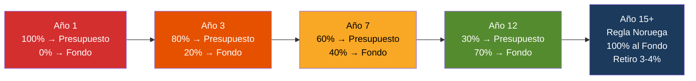
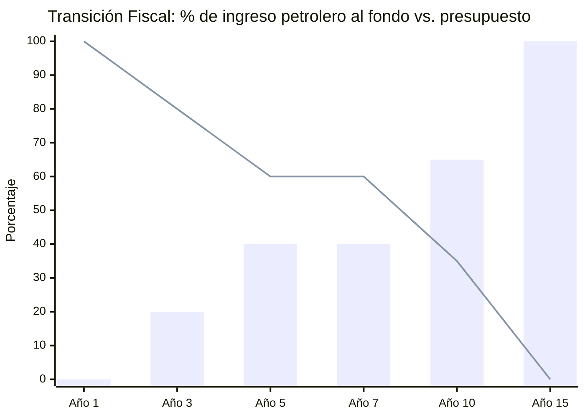
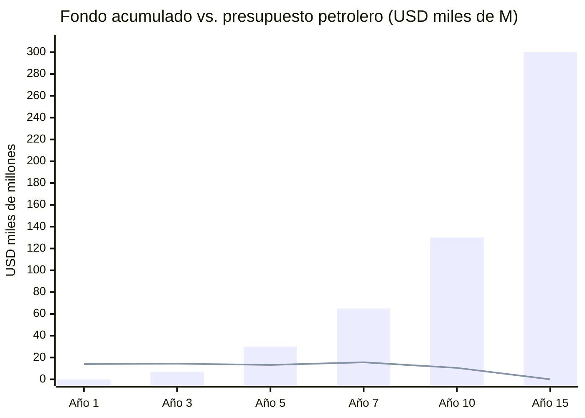

# Fiscal Transition: From Petrostate to Sovereign Fund

> Oil cannot SIMULTANEOUSLY finance today's budget and tomorrow's fund. The fiscal transition is the mechanism that resolves that tension.

## Where We Are: The Current Budget

Venezuela approved a [USD 22,700 M budget for 2025](https://invezz.com/news/2024/12/04/venezuela-unveils-ambitious-22-7-billion-2025-budget-amid-deep-oil-revenues-decline/), 11% more than 2024.

| Indicator | 2024 | 2025 | Source |
|-----------|------|------|--------|
| Total budget | USD 20,500 M | USD 22,700 M | [Invezz](https://invezz.com/news/2024/12/04/venezuela-unveils-ambitious-22-7-billion-2025-budget-amid-deep-oil-revenues-decline/) |
| PDVSA contribution | USD 11,900 M (58%) | USD 10,100 M (53%) | [La Republica](https://www.larepublica.co/globoeconomia/el-presupuesto-2025-de-venezuela-aumentara-11-y-reducira-los-aportes-petroleros-4013151) |
| Tax revenues | — | USD 5,250 M (28%) | [Orinoco Research](https://www.orinocoresearch.com/news-and-insights/venezuela-presents-budget-for-2025) |
| Current expenditures | — | 49.3% of total | Orinoco Research |
| Capital expenditures | — | 42.7% of total | Orinoco Research |
| Debt/financial applications | — | 8% of total | Orinoco Research |
| Public spending / GDP | ~14.4% | ~27.4% | [Statista](https://www.statista.com/statistics/371925/ratio-of-government-expenditure-to-gross-domestic-product-gdp-in-venezuela/) |
| PDVSA total exports | USD 17,520 M | — | [OE Digital](https://energynews.oedigital.com/fossil-fuels/2025/07/11/venezuelan-pdvsa-exports-of-hydrocarbons-will-reach-1752-billion-in-2024) |

:::danger The central problem
Today, **100% of oil revenues** are consumed in the budget. **0% goes to the sovereign fund.** Every bolivar from oil is spent. Nothing is saved. This is exactly what Norway did before 1990 — and what it decided to stop doing.
:::

## The Norway Model: How the Fiscal Rule Works

[Norway](https://www.norskpetroleum.no/en/economy/management-of-revenues/) transfers **100% of net oil revenues** to the sovereign fund. Then it withdraws only [3–4% of the fund's value](https://www.norskpetroleum.no/en/economy/management-of-revenues/) to finance the budget. Result: the fund grows with the remaining 96–97% + returns.

| Aspect | Norway | Venezuela (proposal) |
|---------|---------|----------------------|
| Oil revenues to fund | [100%](https://www.norskpetroleum.no/en/economy/management-of-revenues/) | Gradual transition: 0% -> 100% |
| Budget withdrawal | [3% of fund value](https://www.nbim.no/en/about-us/about-the-fund/) | 3–4% of fund (target year 10+) |
| % of budget funded by fund | [~20%](https://fortune.com/europe/2025/07/30/how-sparsely-populated-norway-amassed-1-8-trillion-sovereign-wealth-fund/) | Target: 15–25% by year 15 |
| Alternative revenue sources | Taxes (80% of budget) | Taxes + diversification |

**The key:** Norway can send 100% to the fund because 80% of its budget comes from non-oil taxes. Venezuela today depends on oil for 53–58% of the budget. **The fiscal transition IS the strategic priority.**

---

## The Transition Plan: 15 Years in 4 Phases

### Logic: As oil revenues grow (higher production), the % going to the budget DECREASES and the % going to the fund INCREASES.



### Fiscal Transition Table (Base USD 60/Barrel)

| Phase | Years | Production | Gross Oil Revenue | % to Budget | To Budget | % to Fund | To Fund | Oil Budget vs. Today |
|------|------|-----------|------------------------|-------------------|----------------|------------|----------|-------------------------------|
| **0: Emergency** | 1 | 1.1 M bpd | ~USD 14,000 M | **100%** | USD 14,000 M | 0% | USD 0 | +40% vs. 2025 ($10.1B) |
| **1: Stabilization** | 2–3 | 1.1–1.4 M bpd | USD 14–18,000 M | **80%** | USD 11–14,000 M | **20%** | USD 3–4,000 M | Similar to 2025 |
| **2: Acceleration** | 4–7 | 1.5–2.0 M bpd | USD 18–26,000 M | **60%** | USD 11–16,000 M | **40%** | USD 7–10,000 M | +10–60% vs. 2025 |
| **3: Diversification** | 8–12 | 2.0–2.5 M bpd | USD 26–33,000 M | **35%** | USD 9–12,000 M | **65%** | USD 17–21,000 M | Similar, but GDP 3x |
| **4: Norway Rule** | 13–15+ | 2.5–3.0 M bpd | USD 33–40,000 M | **0% direct** | 3–4% fund withdrawal | **100%** | USD 33–40,000 M | Funded by taxes + fund |

### Explicit Calculation — Phase 2 Example, Year 5

```
Production:           1.75 M bpd
Gross revenue:        1,750,000 x 365 x $60 = USD 38,325 M
Operating cost:       1,750,000 x 365 x $37.50 = USD 23,953 M
Net revenue:          USD 14,372 M
To budget (60%):      USD 8,623 M
To fund (40%):        USD 5,749 M

Oil budget 2025:      USD 10,100 M
Oil budget Year 5:    USD 8,623 M
Difference: -USD 1,477 M -> covered by GROWTH in tax revenues
```

:::info The magic of the transition
The **absolute amount** going to the budget does NOT decrease — it stays the same or rises. What decreases is the **percentage**. Because production GROWS, more can go to the fund WITHOUT taking from the budget. By year 5, the budget receives USD 8,600 M (similar to today) but the fund is already receiving USD 5,700 M that used to be spent.
:::

---

## The Other Leg: Growing Non-Oil Revenues

The fiscal transition does NOT work if the budget continues depending on oil for 53%. The tax base must be built:

| Source | Today | Target Year 7 | Target Year 15 | Mechanism |
|--------|-----|-----------|------------|-----------|
| Tax revenues | USD 5,250 M (28%) | USD 12,000 M (40%) | USD 25,000 M (50%) | Formalization + ZEET + fiscal digitization |
| Oil revenues to budget | USD 10,100 M (53%) | USD 12,000 M (40%) | USD 5,000 M* (10%) | *via 3-4% fund withdrawal |
| Other revenues (dividends, tourism, gas) | USD 2,000 M (10%) | USD 5,000 M (15%) | USD 15,000 M (30%) | Diversification |
| Remittances/diaspora contributions | ~USD 500 M (3%) | USD 1,500 M (5%) | USD 5,000 M (10%) | M-Pesa platform |
| **Total budget** | **USD 22,700 M** | **~USD 30,000 M** | **~USD 50,000 M** | — |
| **% direct oil** | **53%** | **40%** | **10%** | — |

### Comparison with the Milei Model (Argentina)

[Milei achieved fiscal surplus](https://www.focus-economics.com/blog/argentina-economy-under-milei/) by cutting spending. Venezuela S.A. proposes the opposite: **don't cut spending, but GROW revenues** so the oil percentage drops naturally. Reason: Venezuela already has 82.8% poverty — there is no room for Argentine-style austerity (see [Milei Research](/research/milei-argentina-2024-2026)).

---

## Constitutional Transition Rule

To prevent any future government from reversing the transition:

| Rule | Detail | Model |
|-------|---------|--------|
| **Oil spending ceiling** | Maximum % of oil revenue going to budget, decreasing by law | [Chile: structural fiscal rule](https://www.worldbank.org/en/topic/fiscal-policy) |
| **Savings floor** | Minimum % to sovereign fund, increasing by law | Norway: 3% rule |
| **Constitutional lock** | Modification requires 2/3 of parliament + referendum | Chile: supermajority |
| **Stabilization fund** | Reserve of 6–12 months of spending for price crises | [Chile: FEES](https://www.hacienda.cl) |

### Armoring Timeline

| Year | Fiscal rule | Max % to budget | Min % to fund |
|-----|-------------|------------------------|-------------------|
| 1 | Executive decree | 100% (emergency) | 0% |
| 2 | Ordinary law | 85% | 15% |
| 3 | Organic law | 75% | 25% |
| 5 | Constitutional (2/3 + referendum) | 60% | 40% |
| 7 | Armored constitutional | 45% | 55% |
| 10 | Automatic | 30% | 70% |
| 15 | **Norway Rule active** | **3–4% fund withdrawal** | **100%** |

---

## What Happens If Oil Drops

| Scenario | Impact on transition | Action |
|-----------|----------------------|--------|
| Brent > USD 70 | Transition ACCELERATES — more to fund | Phase 4 moves up |
| Brent USD 50–60 | Transition continues on base schedule | Normal |
| Brent USD 40–50 | Transition paused — % to fund is frozen | Stabilization fund activated |
| Brent < USD 40 | Emergency — fund withdrawal allowed (max 5%) | Constitutional withdrawal ceiling |

:::caution Political temptation
Risk #1 is a future government saying "the emergency justifies spending the fund." That's why the rules are CONSTITUTIONAL (2/3 + referendum). The Alaska model has worked since 1982 because no politician dares touch the dividend of 700,000 people. With 40 million shareholders, the fund is untouchable.
:::

## Visual Summary





| Year | Oil revenue | -> Budget | -> Fund | Accumulated fund |
|-----|-------------------|---------------|---------|-----------------|
| 1 | USD 14,000 M | USD 14,000 M | USD 0 | USD 0 |
| 3 | USD 18,000 M | USD 14,400 M | USD 3,600 M | USD 7,000 M |
| 5 | USD 22,000 M | USD 13,200 M | USD 8,800 M | USD 30,000 M |
| 7 | USD 26,000 M | USD 15,600 M | USD 10,400 M | USD 65,000 M |
| 10 | USD 30,000 M | USD 10,500 M | USD 19,500 M | USD 130,000 M |
| 15 | USD 38,000 M | 3–4% fund withdrawal | USD 38,000 M | USD 300,000+ M |

**By year 15, the fund generates ~USD 12,000–15,000 M/year in returns (4–5%). That covers 25–30% of the budget WITHOUT TOUCHING oil. Oil accumulates. The fund grows. Dividends flow.**

---

## Flat Tax and Regressivity: How to Protect the 82.8%

:::caution The legitimate criticism
[Stiglitz](https://www.josephstiglitz.com/) and [Piketty](https://www.pikettylab.pse.ens.fr/) argue that a **15% flat + 12% VAT** is regressive: it charges the same percentage to someone earning USD 200/month as to someone earning USD 20,000/month. With **82.8% of the population in poverty** ([ENCOVI 2023](https://crisisresponse.iom.int/response/venezuela-bolivarian-republic-crisis-response-plan-2024)), this criticism cannot be ignored.
:::

**The problem is real:** a flat tax by definition takes the same % of income from everyone. Combined with a 12% VAT (which is regressive because the poor spend 100% of their income on consumption), the effective burden on the poorest can be brutal.

**The solution: 4 mitigation mechanisms that don't break the lean model.**

| # | Mechanism | Who benefits | Estimated cost | Reference |
|---|-----------|-------------------|----------------|------------|
| 1 | **0% VAT on basic basket** (food, medicine, education, transport) | 82.8% in poverty — spend 60–80% of income on these items | USD 1,500–3,000 M/year in uncollected revenue | [Chile: VAT exempt on health and education](https://www.sii.cl/); most OECD countries exempt basic food |
| 2 | **Negative income tax / EITC** below poverty line — if you earn < USD 300/month, you receive a transfer | 82.8% (33M people), decreasing over time | USD 2,000–5,000 M/year (decreases as income rises) | [U.S.: Earned Income Tax Credit](https://www.irs.gov/credits-deductions/individuals/earned-income-tax-credit-eitc) — USD 60B/year, lifts 5M out of poverty |
| 3 | **CVP (Citizen Value Package)** — free healthcare + free education + infrastructure = progressive in-kind transfer | Everyone, but proportionally more value for the poorest | Already included in plan budget (health USD 15–25B, education USD 15–25B) | [Nordic model](https://www.oecd.org/): universal services as redistribution |
| 4 | **Progressive property tax** (not income) — > USD 1M in real estate = 0.5–1% annual | Top 5% of wealth | Generates USD 500–1,500 M/year | [Estonia: flat income tax + progressive property tax](https://www.emta.ee/) |

### Net Effect: Effective Rate by Income Level

| Income level | 15% flat tax | Effective VAT | Negative income tax / EITC | 0% VAT on basket | **Net effective rate** |
|------------------|-------------|-------------|--------------------------|---------------|----------------------|
| < USD 300/month (poverty) | 15% | ~12% on consumption | **Receives** USD 50–100/month | Exempt on 60–80% of spending | **~0% or negative** |
| USD 300–1,000/month (lower middle class) | 15% | ~8% (partially exempt) | N/A | Partially exempt | **~15–18%** |
| USD 1,000–5,000/month (middle class) | 15% | ~10% | N/A | Minimal impact | **~20–22%** |
| > USD 5,000/month (upper class) | 15% | ~12% | N/A | N/A | **~25–27%** (+ property) |

:::info The result is progressive, not regressive
With the 4 mechanisms, the poorest pay **0% effective** (exempt VAT + negative income tax). The middle class pays **~15–20%**. The wealthiest pay **~25–27%** (flat + VAT + property). It is a **de facto progressive** system without the complexity of 7 income tax brackets that require 50 officials to administer.
:::

**The lean model advantage:** Instead of 7 tax brackets + 200 deductions + an army of tax inspectors (which in Venezuela became an extortion racket), you have: a simple flat tax + 4 automated mechanisms. **Less bureaucracy = less corruption = more effective revenue collection.**

Sources: [OECD Tax Policy Reviews](https://www.oecd.org/tax/tax-policy/) [Requires research: specific review of flat tax + compensatory mechanisms]; [Estonia Tax and Customs Board](https://www.emta.ee/); [IRS EITC](https://www.irs.gov/credits-deductions/individuals/earned-income-tax-credit-eitc)
