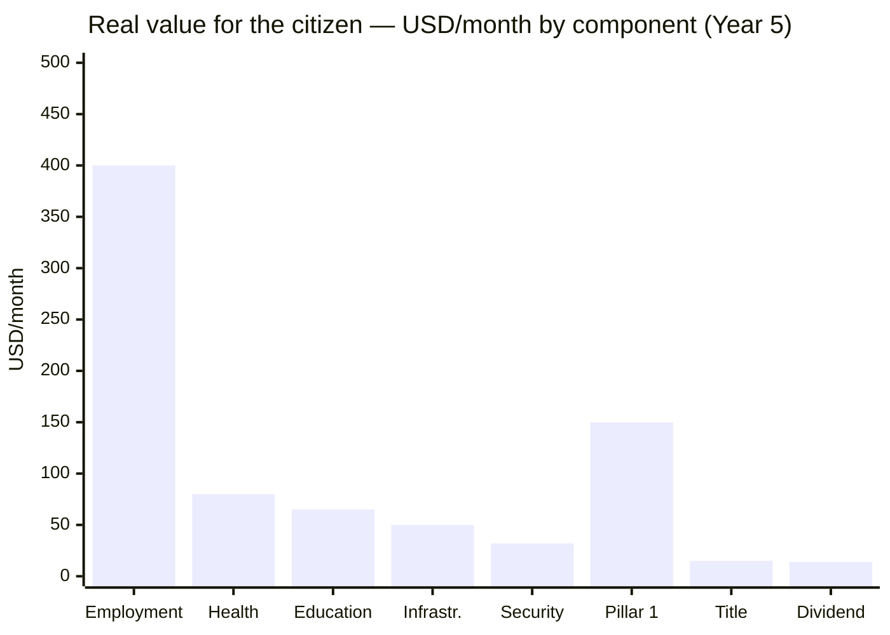

# The 32 Million Who Stayed

:::tip In a nutshell
The plan doesn't give you a fish. It doesn't teach you to fish. It gives you a **fishing rod** (the FCV) and fills the river with fish (concessions, jobs, infrastructure). You fish. From Day 1, every Venezuelan has an FCV with 5 sub-accounts. Infrastructure concessions create 1-3M private-sector jobs. Mass titling unlocks USD 50-100B in informal assets. The universal Pillar 1 protects current retirees. The market allocates — the State supervises — Venezuela S.A. invests.
:::

> The plan talks about the diaspora (7.9M), international investors, and foreign models. What does it offer the 32 million people still in Venezuela, surviving on a minimum wage of USD 3.50/month?

:::danger Honest audit
If the plan doesn't address the daily life of the majority who stayed — public employees, informal workers, retirees, students — then it's a plan for elites and the diaspora, not for a country. This section examines the real offering for the 32M.
:::

:::caution Illustrative dates — phases are triggered by KPIs, not by calendar
References to "Year X" in this document are **illustrative**. Actual phases are triggered by verifiable conditions (GDP/capita, formalization, poverty). See [Activation KPIs](/07-ejecucion/kpis-activacion).
:::

---

## Profile of the 32 Million

| Segment | Estimated population | Current situation | Source |
|---------|---------------------|------------------|--------|
| **Informal sector** | ~12-15M (workers + families) | 70%+ of employment is informal; no social security, no contract | [ENCOVI/UCAB 2023](https://www.proyectoencovi.com/) |
| **Public employees** | ~3-4M (direct + dependents) | Average salary USD 20-50/month; many with second jobs | [ENCOVI/UCAB 2023](https://www.proyectoencovi.com/) |
| **Retirees/pensioners** | ~4-5M | Pension: USD 3.50/month (minimum wage) | [Observatorio Venezolano de Finanzas](https://observatoriodefinanzas.com/) |
| **Students** | ~7-8M (primary through university) | School enrollment dropped to ~70%; massive university dropout | [ENCOVI/UCAB 2023](https://www.proyectoencovi.com/) |
| **Surviving middle class** | ~3-4M | Dollarized, entrepreneurs, freelancers; adapting but without stability | [ENCOVI/UCAB 2023](https://www.proyectoencovi.com/) |
| **Indigenous communities** | ~700,000-1M | Marginalized from the economic model; affected by illegal mining | [IWGIA](https://www.iwgia.org/en/venezuela.html) |

**Poverty:** 82.8% of the population lives in poverty. 53.3% in extreme poverty ([ENCOVI/UCAB 2023](https://www.proyectoencovi.com/)).

---

## Audit: What Does the Plan Offer Them?

| Plan component | Offering for the 32M | Impact |
|---------------|----------------------|--------|
| [Citizen Fund Venezuela (FCV)](/04-gobernanza/modelo-estado#fondo-ciudadano-venezuela-fcv-una-sola-cuenta-cero-burocracia) | 5 sub-accounts (retirement 8% + health 7% + housing 4% + education 2% + unemployment 2%). From birth. VSA deposits USD 150/month per child | **Transformational** — a minimum wage accumulates USD 463K by age 65 |
| [Pillar 1 universal pension](/06-realidad/pensiones-seguridad-social) | USD 50-200/month for EVERY retiree from Day 1 — includes those who never contributed. Funded by taxes | **Immediate** — addresses the 4-5M current retirees |
| [Universal health (FCV Health)](/04-gobernanza/modelo-estado#salud-subcuenta-salud-del-fcv--universal-contributivo-sin-exclusión) | 7% salary contribution. Tramos A/B (low income): 0% copay. ISAPRE optional | **Transformational** — no one is left out |
| [Education (portable voucher)](/05-transformacion/educacion) | Universal K-12 voucher that follows the student. Schools compete as private businesses. +50% for low income (SEP) | **Transformational** — quality education for 7-8M students |
| [Venezuela S.A. Investment Fund](/02-motor-financiero/fondo-soberano) | Citizen dividend USD 125-200/year (year 15) | Symbolic short-term; complement long-term |
| [Tax reform](/02-motor-financiero/transicion-fiscal) | 15% flat + 12% VAT. Fewer informal taxes, more formalization | Benefits those with formal income |
| [Security](/04-gobernanza/seguridad-fisica) | Crime reduction | Direct impact on quality of life |
| [Digital state](/06-realidad/estado-digital) | Online procedures, less bureaucracy | Useful for connected users; 40%+ without reliable internet |
| [Infrastructure](/06-realidad/infraestructura-basica) | Electricity, water, transportation via concessions | Basic need covered |
| [Tech hubs](/05-transformacion/hubs-tech) | Tech jobs via concessions and startups | For a qualified minority; grows with training |

**Diagnosis:** The plan offers both immediate tools (Pillar 1, FCV, titling, concessions) AND long-term ones (Investment Fund, quality education). The retiree with USD 3.50/month gets Pillar 1 from Day 1. The informal worker gets a property title and FCV access upon formalizing. The young person gets an education voucher and access to concession jobs.

---

## Immediate Tools: Economic Agency from Day 1

The plan doesn't create public employment programs. The State doesn't hire — the market hires. What the plan does is give citizens the tools to enter the market.

### 1. Mass property titling

[70%+ of homes in popular neighborhoods lack legal title](https://www.proyectoencovi.com/) (ENCOVI/UCAB). Without a title:
- You can't apply for credit
- You can't formally sell or bequeath property
- You have no incentive to invest in your home
- You don't exist for the financial system

| Action | Model | Goal | Cost |
|--------|-------|------|------|
| Digital cadastre + mass titling | [Peru (De Soto, 1990s)](https://www.ild.org.pe/): titled 1.2M properties in 5 years | 3-5M titles in 5 years | USD 500M-1B |
| Multiplier effect | De Soto documented that the informal assets of the world's poor are worth USD 9.3T — but without title they're not capital | USD 50-100B in unlocked assets | — |

**The property title is the first tool.** It converts the home where you already live into a financial asset: credit, inheritance, collateral. Residents who endured 25 years receive legal title over the land they already occupy. That is real protection — not a quota.

### 2. Informal employment formalization

| Action | Mechanism | Goal | Cost |
|--------|-----------|------|------|
| Simplified micro-enterprise regime | 1 form, 1 day, 0 cost for the first 2 years | 2M micro-enterprises formalized (year 5) | USD 100-200M |
| Monotax | Single monthly payment (USD 5-10) covers taxes + basic FCV | Progressive universal coverage | Self-funded at scale |
| Universal digital banking | Free digital bank account linked to national ID (model: India [Jan Dhan](https://pmjdy.gov.in/)) | 30M accounts in 3 years | USD 100-200M |

**Formalization opens the door to the FCV.** Without formal employment, there's no FCV contribution. Without FCV, there's no health, retirement, housing, education, or unemployment coverage. The monotax + digital banking is the bridge between informality and the system.

### 3. Citizen Fund Venezuela (FCV) as safety net

The FCV is not a government program — it's a **personal citizen account** with 5 sub-accounts. Every Venezuelan has one from birth. Venezuela S.A. deposits USD 150/month per child. Upon formalizing as a worker, the contribution is 23% of salary (11% worker + 12% employer).

| Sub-account | % of salary | Immediate function for the 32M |
|-----------|--------------|-------------------------------|
| **Retirement** | 8% | Your own pension — nobody takes it from you. 100% inheritable |
| **Health** | 7% | Universal coverage from Day 1. Tramos A/B: 0% copay |
| **Housing** | 4% | Savings for down payment on your own home ([Singapore CPF](https://www.cpf.gov.sg/) model) |
| **Education** | 2% | Your own or your children's university |
| **Unemployment** | 2% | 3-6 month salary cushion if you lose your job |
| **TOTAL** | **23%** | **ONE account, ONE institution, 5 sub-accounts** |

**For current retirees:** The universal Pillar 1 (tax-funded) covers them from Day 1 with USD 50-200/month. They don't need to have contributed to the FCV. It's the constitutional guarantee of a dignified old age.

**For informal workers:** Upon formalizing via monotax, they start contributing to the FCV. The unemployment sub-account gives them the cushion they never had. The health sub-account gives them real coverage.

**For children:** Born with an FCV. VSA deposits USD 150/month. By age 18 they have USD 20,218 in accumulated savings — without having worked a single day.

:::tip Real result: minimum wage to USD 463K by age 65
A worker who earns minimum wage their entire life and contributes to the FCV accumulates **USD 463,508** by age 65. Monthly pension: **USD 1,408/month** (FCV Retirement + Pillar 1). Replacement rate: **117%** of last salary. Home purchased at age 32. Children graduated from university. All funded by the FCV — not by the government. See [full example](/04-gobernanza/modelo-estado#anexo-ejemplo--ciclo-de-vida-del-fcv-con-salario-mínimo).
:::

---

## Employment: Concessions Create the Jobs

The plan requires USD 550-750B in investment over 15 years. Every road, port, hospital, school, power plant, and telecom network is built as a **private concession or JV with Venezuela S.A.** That generates massive employment — private, not public.

Concessions create the jobs. Every road, port, hospital, and school built as a PPP generates employment. **The State doesn't hire — the market hires.**

| Employment source | Direct jobs (year 5) | Average salary | Mechanism |
|------------------|---------------------|----------------|-----------|
| **Construction/infrastructure** (concessions) | 500,000-1,000,000 | USD 300-500/month | Concessions for roads, ports, hospitals, schools, power plants |
| **Oil and gas** (JVs) | 100,000-200,000 | USD 500-1,500/month | Joint ventures with international operators + value chain |
| **Services (health, education, security)** | 300,000-500,000 | USD 300-600/month | Concessioned hospitals, private schools with vouchers, professional police |
| **Tech/digital** | 50,000-100,000 | USD 800-2,500/month | Data centers, startups, global remote employment |
| **Agroindustry** | 200,000-400,000 | USD 200-400/month | Formalization + modernization + credit access |
| **Tourism** | 100,000-200,000 | USD 250-500/month | Safe pilot zones + nation brand |
| **Formalized commerce/services** | 500,000-1,000,000 | USD 200-400/month | Micro-enterprises + monotax + digital banking |
| **TOTAL** | **1,750,000-3,400,000** | **USD 300-600 average** | |

:::tip Employment > dividend
A USD 400/month job generates **USD 4,800/year** per citizen — vs. USD 125-200/year in dividends from the Venezuela S.A. Investment Fund. Employment is **24-38x more effective** than the cash dividend at lifting people out of poverty. The Investment Fund is for the long term (generations). Employment is for NOW.
:::

### Community participation in concessions

When Venezuela S.A. concessions infrastructure to private operators, the **concession contract** includes local benefit clauses:

| Mechanism | How it works | Precedent |
|-----------|-------------|-----------|
| 5% local royalties | Each concession allocates 5% of revenue to the municipality where it operates | [Colombia: direct royalties to municipalities (SGR)](https://www.sgr.gov.co/) |
| 60%+ local non-specialized hiring | The concession contract requires local hiring for non-specialized positions | Standard in global oil concessions |
| Community oversight committee | Neighbors elect representatives who audit the concession | Chile mining concession model |

This is not a government quota — it's a **contractual clause** of the concession. Venezuela S.A., as a shareholder in the concession, negotiates it directly.

---

## Training: Your FCV Pays for Your Reskilling

Training is not a government program. It's your own FCV money working for you.

| Mechanism | How it works | Model |
|-----------|-------------|-------|
| **FCV Education** (2% sub-account) | Funds technical bootcamps, reskilling, agricultural training. The citizen chooses where to study | [Singapore SkillsFuture](https://www.skillsfuture.gov.sg/) |
| **FCV Unemployment** (2% sub-account) | Provides 3-6 month salary stipend during reskilling if you lost your job | [Chile AFC (Unemployment Insurance)](https://www.afc.cl/) |
| **Merit-based university voucher** | Earned and maintained by effort (100-75-50-25-lose). Tax-funded | Chile Gratuidad + merit |

| Training type | Duration | Funding | Model |
|--------------|----------|---------|-------|
| Technical bootcamps (tech, construction, health) | 6-12 months | FCV Education + FCV Unemployment (stipend) | Singapore SkillsFuture |
| Reskilling former oil workers to renewables/tech | 3-6 months | FCV Education + oil JV (part of the concession contract) | EU energy transition |
| Technical agricultural training | 3-6 months | FCV Education + Venezuela S.A. as VC in agricultural micro-enterprises | Colombia SENA + plots |

**Goal:** 200,000 people/year in training programs. See [Human Capital](/05-transformacion/capital-humano) for full detail.

---

## Micro-Entrepreneurship: Venezuela S.A. Invests as a VC

Venezuela S.A. doesn't give subsidized microcredit to a specific group. It invests as **venture capital** in micro-enterprises of any Venezuelan:

| Mechanism | How it works | Goal |
|-----------|-------------|------|
| Venezuela S.A. as VC in micro-enterprises | USD 500-10,000 investment in micro-enterprises formalized via monotax. Venezuela S.A. takes minority equity. The entrepreneur retains control | 500,000 micro-enterprises funded (year 5) |
| FCV Unemployment as cushion | If the venture fails, the FCV unemployment sub-account provides 3-6 months of protection | Safety net for entrepreneurial risk |
| Digital banking + credit history | Formalization via monotax + digital banking creates credit history, enabling access to private credit | 30M bank accounts in 3 years |

**Any Venezuelan can apply.** There are no exclusive products for residents or returnees. The market allocates. The FCV protects. Venezuela S.A. invests.

---

## The Real Dividend: Employment + FCV + Services

:::danger The math on the cash dividend doesn't work
USD 400/month x 40M people x 12 months = **USD 192B/year**. Current GDP is USD 83B. Not even in year 15 (GDP ~USD 350B) is it possible to distribute USD 192B in checks. Alaska pays **USD 1,000/year** (USD 83/month) to 730,000 people — not to 40M. The cash dividend from the Venezuela S.A. Investment Fund will always be complementary: **USD 125-200/person/year** in the best case.
:::

### The dividend isn't a check — it's an ecosystem

The basic family basket costs **USD 677/month** for 5 people (~**USD 135/person/month**) ([CENDAS, Mar. 2026](https://lapatilla.com/2026/03/03/canasta-alimentaria-ya-cuesta-677-dolares-y-el-salario-no-alcanza-ni-para-el-1-segun-cendas/)). The plan doesn't get there with a check. It gets there with **FCV + employment + universal services**:

| # | Component | Value/month (year 3) | Value/month (year 5) | How it's delivered |
|---|-----------|---------------------|---------------------|-------------------|
| 1 | **Formal employment** (the biggest impact) | USD 150-300 | USD 300-500 | From USD 3.50/month to USD 300-500/month in construction, services, tech, agro. The plan creates **1-3M jobs** via private concessions |
| 2 | **FCV universal health** | USD 40-60 | USD 60-100 | Full coverage via FCV Health (7% contribution). Tramos A/B: 0% copay. Saves what they currently spend on private clinics or die without care |
| 3 | **Universal education (portable voucher)** | USD 30-50 | USD 50-80 | Voucher covers 100% of tuition. Schools compete as private businesses. +50% for low income (SEP) |
| 4 | **Infrastructure that works** | USD 20-40 | USD 40-60 | 24/7 electricity, potable water, public transit — all via concessions. Today they spend on generators, water tanks, taxis |
| 5 | **Security** | USD 15-25 | USD 25-40 | Not getting robbed, not paying "protection money," not losing merchandise. Crime is an invisible tax on the poor |
| 6 | **Property title** | — | USD 10-20 | Home with title = credit, inheritance, investment. Unlocks USD 50-100B in informal assets (De Soto) |
| 7 | **Pillar 1 pension** (retirees) | USD 50-100 | USD 100-200 | Universal from Day 1. Tax-funded. For the 4-5M current retirees |
| 8 | **Cash dividend** (VSA Investment Fund) | USD 2-5 | USD 10-17 | From the Venezuela S.A. Investment Fund. Complementary at first, grows with the fund |
| | **TOTAL** | **USD 310-580** | **USD 595-1,017** | |

### The key is employment, not the check

| Year | Dividend (VSA Fund) | FCV + Services | Employment | **Total** |
|------|---------------------|----------------|------------|-----------|
| 1 | USD 0 | USD 50-80/month | USD 100-200/month | **USD 150-280/month** |
| 3 | USD 2-5/month | USD 120-180/month | USD 200-350/month | **USD 320-535/month** |
| 5 | USD 10-17/month | USD 180-260/month | USD 300-500/month | **USD 490-777/month** |
| 10 | USD 30-50/month | USD 250-350/month | USD 500-800/month | **USD 780-1,200/month** |
| 15 | USD 50-100/month | USD 300-400/month | USD 800-1,500/month | **USD 1,150-2,000/month** |

### The missing narrative

:::info The young man from Petare
The plan needs a story, not just tables. Imagine: a 22-year-old in Petare. Today he earns USD 50/month in the informal economy. He formalizes via monotax, opens his FCV account in 4 minutes from his phone. He enrolls in a 6-month bootcamp — his FCV Education sub-account funds the program, his FCV Unemployment sub-account provides a stipend while he studies. He lands a remote job earning USD 800/month. His FCV starts accumulating. His mom goes to a concessioned hospital — covered by FCV Health with zero copay because she's Tramo A. His younger sister has a school voucher that lets her choose the best school in the neighborhood. The street where he lives is no longer controlled by a gang.

That young man tells the story on TikTok. That's worth more than 100 pages of projections.

**Without that narrative, the plan is tables and charts. With it, it's a movement.**
:::

---

## Returnees and Residents: The Market Allocates

:::caution Predictable tension
When the diaspora returns with savings, international experience, and degrees, there will be tension with those who stayed. Ignoring this guarantees social conflict. But the solution isn't quotas — it's tools.
:::

**Protection for residents is structural, not bureaucratic:**

| Tool | How it protects residents | How it integrates returnees |
|------|--------------------------|---------------------------|
| **FCV from Day 1** | Every resident has an operational FCV from the plan's launch. 5 sub-accounts accumulating. The returnee starts from zero or from whatever they voluntarily contributed from abroad | The returnee joins the FCV like any worker. Years not contributed are not recovered |
| **Mass titling** | Residents receive legal title over the land they already occupy — 3-5M titles. That is real capital: credit, inheritance, investment | If a returnee buys property, that's investment. Welcome. The resident already has theirs titled |
| **Concession employment** | 60%+ of non-specialized concession jobs must be local (contractual clause). Residents have the advantage of proximity | Returnees compete in the open market for specialized positions. If they have a better profile, they get hired. That's how the market works |
| **Universal Pillar 1** | Every resident retiree receives Pillar 1 from Day 1 — regardless of whether they contributed | The returning retiree also receives Pillar 1 (they're a citizen). But their FCV reflects only what they contributed |
| **Venezuela S.A. as VC** | Any Venezuelan — resident or returnee — can apply for VC funding from Venezuela S.A. for micro-enterprises. No exclusivity | The returnee who brings their own capital doesn't need VC. They invest directly. That creates jobs for residents |

**There are no quotas. No purchase caps. No exclusive financial products.** The market allocates. The FCV is the equalizer: everyone has one, everyone accumulates, everyone is protected. The difference is made by effort, not privilege.

---

## Total Cost: Tools for the 32M

| Component | Investment (5 years) | Financing |
|-----------|---------------------|-----------|
| Mass titling (3-5M titles) | USD 500M-1B | Budget + international cooperation |
| Formalization + digital banking | USD 200-400M | Budget + fintech PPP |
| Operational FCV (23% contribution) | Self-funded | Worker + employer contributions |
| FCV for children (USD 150/month per child) | USD 5-14B/year | Venezuela S.A. (JV dividends + Investment Fund) |
| Pillar 1 pension (current retirees) | USD 4-8B/year | Taxes |
| Training (200K/year) | USD 2-4B | FCV Education + FCV Unemployment (self-funded) |
| Venezuela S.A. as VC in micro-enterprises | USD 500M-2B | Venezuela S.A. (investment returns) |
| **TOTAL** | **USD 12-29B (5 years)** | **Majority already included in existing budget** |

:::info It's not new spending — it's the plan executing
Infrastructure investment (USD 550-750B over 15 years) already accounts for the jobs. The FCV is self-funded by contributions. Pillar 1 comes from taxes. Titling is international cooperation + budget. What this section does is **give it a name and a face**: these mechanisms are for the 32M who stayed.
:::

> *"A plan that doesn't speak to the woman selling empanadas in Petare, to the retiree in Maracaibo with USD 3.50/month, to the student without internet — is not a plan for Venezuela. It's a plan for the Venezuela we wish existed."*

---

## The Stories That Matter

> Tables convince economists. Stories move 40 million people.

:::tip Maria, 28 years old — Petare, Caracas
Maria has been selling empanadas in Petare since she was 19. She earns USD 80/month in a good month, USD 30 in a bad one. She's never had a bank account. Her national ID is her only document.

In March of year 2 of the plan, her neighbor shows her the FCV app on her phone. "Look, I already have my 5 sub-accounts." Maria downloads the app, links her national ID, formalizes via monotax in 4 minutes. The system opens her Citizen Fund Venezuela with all 5 sub-accounts: retirement, health, housing, education, unemployment. Her first deposit: USD 5 from the monotax. The app shows her balance, her health coverage, her retirement projection. Status: **Citizen-Shareholder of Venezuela S.A.**

Three months later, she goes to the concessioned hospital in her neighborhood with a toothache. They treat her. Copay: USD 0 — she's Tramo A. Never in her life had anyone treated a toothache without asking her to buy the gloves and anesthesia herself. She posts it on TikTok with the caption: *"My first appointment without paying for the gloves. This is FCV Health."* It gets 340,000 views in 48 hours. Her mom, who has never used an app, asks Maria to teach her.
:::

:::tip Carlos, 55 years old — Punto Fijo, Falcon
Carlos worked 22 years at PDVSA. He could operate a catalytic cracking plant with his eyes closed. When the company collapsed, he was left without a job, without a real pension, without options. At 50, nobody hires a Venezuelan process engineer with experience on 1990s equipment.

In year 1 of the plan, the JV between PDVSA and Chevron in the Orinoco Belt launches a reskilling program for former oil workers — part of the training clause in the concession contract. Carlos enrolls in a 4-month course: solar panel installation and maintenance — technology that shares thermal engineering principles he already masters. His FCV Education sub-account funds the program. His FCV Unemployment sub-account gives him USD 250/month as a stipend.

Upon graduating, he's hired by one of the concessionaires in the rural electrification plan. Salary: USD 800/month. Now he contributes 23% to his FCV — he started late, but compound interest works. On his first project, he installs panels at a school in the Sierra de Falcon that had gone 3 years without reliable electricity. The principal gives him a hug. Carlos feels again that he knows how to do something that matters. He's 55 and just started his second career.
:::

:::tip Valentina, 22 years old — Ciudad Guayana, Bolivar
Valentina studied two years of engineering at UNEXPO before the university ran out of professors. She went to work at a hardware store earning USD 60/month. She knew she could do more, but there was nowhere to go.

In year 2 of the plan, the first programming bootcamp opens in Ciudad Guayana — operated by an alliance between Platzi, a local startup, and the tech hub concession's data center. Valentina passes the admissions test. Her FCV Education sub-account funds the tuition. Her FCV Unemployment sub-account gives her USD 200/month as a stipend for 9 months. She learns Python, databases, web development.

At 22, she gets her first job: junior developer at the Ciudad Guayana data center operated by the tech hub concessionaire. Salary: **USD 1,200/month** — more than her mom has ever earned in a single month. When her first paycheck deposits, she calls her mom. She can't speak. Her mom can't either. They both cry. Valentina buys her first own laptop and checks her FCV: all 5 sub-accounts are accumulating. On her LinkedIn profile she writes: "Software Developer | Ciudad Guayana, Venezuela."
:::

:::tip Jose, 35 years old — Miami to Maracaibo
Jose left Maracaibo for Miami in 2017 with a suitcase and USD 400. Eight years later he has residency, a construction job earning USD 4,500/month, and a daughter born in Florida. Venezuela is a memory that hurts.

One Sunday he sees an Instagram post from the return program: a Venezuelan civil engineer who came back and now leads the reconstruction of the Maracaibo port with 8% equity in the concession. Jose opens the Venezuela S.A. app. He explores the dashboard: real-time oil production, concession status, his FCV (empty — he never contributed from abroad). He invests USD 5,000 in VIN shares.

Six months later, he applies to the co-founding program for the rehabilitation of the Lara-Zulia highway — a project he knows because he drove it a thousand times as a kid. He's accepted. They offer him 5% equity in the concession, a salary of USD 3,000/month, and a temporary housing voucher in Maracaibo for 6 months. His FCV starts accumulating from his first paycheck. Jose talks to his wife. They decide to try it for a year. In January of year 3, he lands at Maiquetia with his family. His mom is waiting at the airport. They hadn't hugged in 8 years.
:::

:::info Why the stories matter
Each of these stories references real mechanisms from the plan: the [Citizen Fund Venezuela (FCV)](/04-gobernanza/modelo-estado#fondo-ciudadano-venezuela-fcv-una-sola-cuenta-cero-burocracia), the [bootcamps with FCV Education](/05-transformacion/capital-humano), the [reskilling of former PDVSA employees](/05-transformacion/educacion), the [data centers in Ciudad Guayana](/05-transformacion/hubs-tech), the [return program with equity](/03-ciudadanos/retorno-diaspora), and the [universal Pillar 1](/06-realidad/pensiones-seguridad-social). They're not fantasy — they're the logical concatenation of what the plan already envisions. What was missing was giving them a face.

**If Maria, Carlos, Valentina, and Jose aren't real in 5 years, the plan failed.**
:::

---

**Sources:** [ENCOVI/UCAB 2023](https://www.proyectoencovi.com/) | [De Soto — The Mystery of Capital](https://www.ild.org.pe/) | [CENDAS 2026](https://lapatilla.com/2026/03/03/canasta-alimentaria-ya-cuesta-677-dolares-y-el-salario-no-alcanza-ni-para-el-1-segun-cendas/) | [Colombia SGR](https://www.sgr.gov.co/) | [Singapore CPF](https://www.cpf.gov.sg/) | [Chile FONASA](https://www.fonasa.cl/) | [India Jan Dhan](https://pmjdy.gov.in/)
