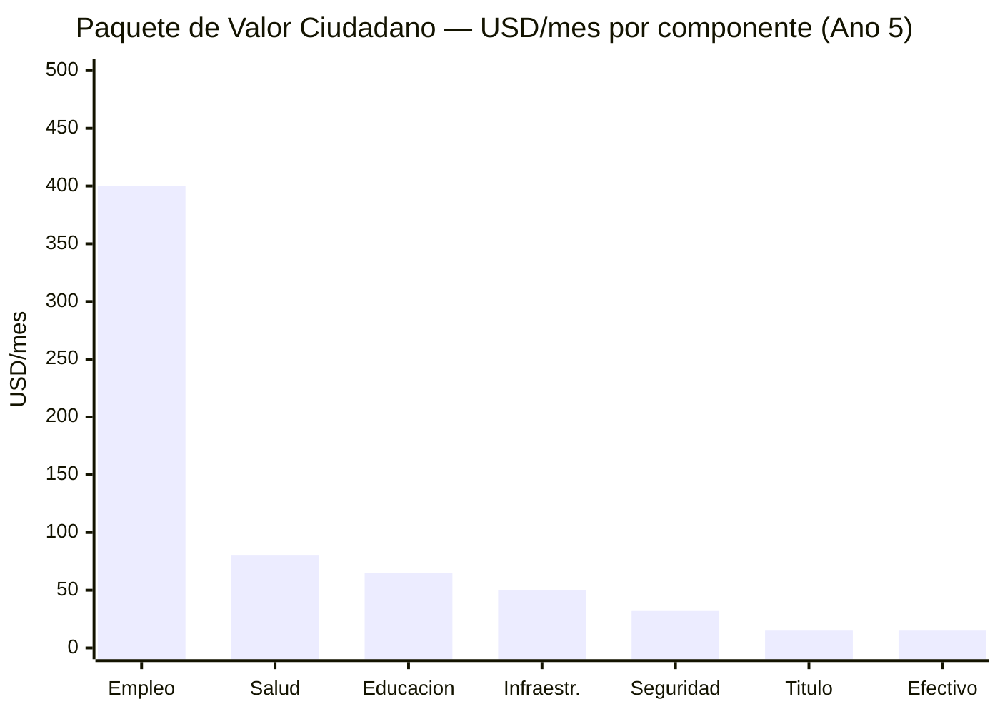

# The 32 Million Who Stayed

> The plan talks a lot about the diaspora (7.9M), international investors, and foreign models. What does it offer the 32 million people still in Venezuela, surviving on a minimum wage of USD 3.50/month?

:::danger Honest audit
If the plan doesn't address the daily life of the majority who stayed — public employees, informal workers, retirees, students — then it's a plan for elites and the diaspora, not for a country. This section examines the plan's current offering for the 32M and what's missing.
:::

---

## Profile of the 32 Million

| Segment | Estimated population | Current situation | Source |
|---------|---------------------|------------------|--------|
| **Informal sector** | ~12-15M (workers + families) | 70%+ of employment is informal; no social security, no contract | [ENCOVI/UCAB 2023](https://www.proyectoencovi.com/) |
| **Public employees** | ~3-4M (direct + dependents) | Average salary USD 20-50/month; many with second jobs | [ENCOVI/UCAB 2023](https://www.proyectoencovi.com/) |
| **Retirees/pensioners** | ~4-5M | Pension: USD 3.50/month (minimum wage) | [Observatorio Venezolano de Finanzas](https://observatoriodefinanzas.com/) |
| **Students** | ~7-8M (primary through university) | School enrollment dropped to ~70%; massive university dropout | [ENCOVI/UCAB 2023](https://www.proyectoencovi.com/) |
| **Surviving middle class** | ~3-4M | Dollarized, entrepreneurs, freelancers; adapting but without stability | [ENCOVI/UCAB 2023](https://www.proyectoencovi.com/) |
| **Indigenous communities** | ~700,000-1M | Marginalized from the economic model; affected by illegal mining | [IWGIA](https://www.iwgia.org/en/venezuela.html) |

**Poverty:** 82.8% of the population lives in poverty. 53.3% in extreme poverty ([ENCOVI/UCAB 2023](https://www.proyectoencovi.com/)).

---

## Audit: What Does the Current Plan Offer Them?

| Plan component | Offering for the 32M | Sufficient |
|---------------|----------------------|------------|
| [Sovereign fund](/02-motor-financiero/fondo-soberano) | Dividend USD 30-65/person/year (year 15) | Insufficient short-term; useful long-term |
| [Tax reform](/02-motor-financiero/transicion-fiscal) | Fewer informal taxes, more formalization | Partial: benefits those who already have income |
| [Security](/04-gobernanza/seguridad-fisica) | Crime reduction | Direct impact on quality of life |
| [Public health](/06-realidad/servicios-publicos) | Universal healthcare funded (4-5% GDP) | Transformational if executed |
| [Education](/05-transformacion/educacion) | Rebuilt education system | Impact in 10-15 years |
| [Digital state](/06-realidad/estado-digital) | Online procedures, less bureaucracy | Useful for connected users; 40%+ without reliable internet |
| [Infrastructure](/06-realidad/infraestructura-basica) | Electricity, water, transportation | Basic need covered |
| [Pensions](/06-realidad/pensiones-seguridad-social) | Contributory Pillar 1 | Doesn't solve current retirees who never contributed |
| [Tech hubs / ZEETs](/05-transformacion/hubs-tech) | Tech jobs | For a qualified minority; not for the informal majority |
| [Citizen investment](/03-ciudadanos/inversion-ciudadana) | Right to dividend as "shareholder" | Symbolic until the fund generates returns |

**Diagnosis:** The plan offers a lot long-term (years 10-15) but **little tangible in the first 5 years** for the majority. A retiree with USD 3.50/month can't wait 15 years.

---

## What's Missing: Immediate Economic Agency

The plan needs a concrete offering for the first 1-5 years. Not perpetual welfare — **tools for the 32M to become active economic agents.**

### "Active Shareholder" Program

#### 1. Property titles

[70%+ of homes in popular neighborhoods lack legal title](https://www.proyectoencovi.com/) (ENCOVI/UCAB). Without a title:
- You can't apply for credit
- You can't formally sell or bequeath property
- You have no incentive to invest in your home
- You don't exist for the financial system

| Action | Model | Goal | Cost |
|--------|-------|------|------|
| Digital cadastre + mass titling | [Peru (De Soto, 1990s)](https://www.ild.org.pe/): titled 1.2M properties in 5 years | 3-5M titles in 5 years | USD 500M-1B |
| Multiplier effect | De Soto documented that the informal assets of the world's poor are worth USD 9.3T — but without title they're not capital | USD 50-100B in unlocked assets | — |

#### 2. Informal employment formalization

| Action | Mechanism | Goal | Cost |
|--------|-----------|------|------|
| Simplified micro-enterprise regime | 1 form, 1 day, 0 cost for the first 2 years | 2M micro-enterprises formalized (year 5) | USD 100-200M |
| Monotax | Single monthly payment (USD 5-10) covers taxes + basic social security | Progressive universal coverage | Self-funded at scale |
| Universal digital banking | Free digital bank account linked to national ID (model: India [Jan Dhan](https://pmjdy.gov.in/)) | 30M accounts in 3 years | USD 100-200M |

#### 3. Infrastructure employment

The plan requires USD 550-750B in investment over 15 years. That means **massive construction**: roads, bridges, power plants, buildings, ports, schools, hospitals.

| Program | Model | Direct jobs | Salary |
|---------|-------|------------|--------|
| "Build Venezuela" | [India NREGA](https://nrega.nic.in/): guaranteed employment 100 days/year in public works | 500,000-1M jobs/year | USD 200-400/month |
| Infrastructure maintenance | Colombia "Caminos de prosperidad" | 200,000 jobs | USD 150-300/month |
| Housing rehabilitation | Assisted self-construction programs | 100,000 families/year | Materials + technical assistance |

**Estimated cost:** USD 2-4B/year (partially self-funded: infrastructure generates value)

**Reference:** [India NREGA](https://nrega.nic.in/) employs ~50M rural households/year with a budget of USD 10-12B. Venezuela scale: ~USD 2-4B for 1-2M households.

#### 4. Training with income

| Program | Duration | Income during training | Model |
|---------|----------|----------------------|-------|
| Technical bootcamps (tech, construction, healthcare) | 6-12 months | USD 150-250/month (stipend) | Singapore SkillsFuture |
| Reskilling oil workers to renewables/tech | 3-6 months | USD 200-300/month | EU energy transition |
| Technical agricultural training | 3-6 months | USD 100-200/month | Colombia SENA + plots |

**Goal:** 200,000 people/year in training-with-income programs. See [Human capital](/05-transformacion/capital-humano) for full detail.

#### 5. Community participation in concessions

When the State concessions infrastructure, telecoms, or services to private operators, local communities must have voice and benefit:

| Mechanism | How it works | Precedent |
|-----------|-------------|-----------|
| 5% local royalties | Each concession allocates 5% of revenue to the municipality where it operates | [Colombia: direct royalties to municipalities (SGR)](https://www.sgr.gov.co/) |
| Mandatory local hiring | 60%+ of non-specialized jobs must be local | Standard in global oil concessions |
| Community oversight committee | Neighbors elect representatives who audit the concession | Chile mining concession model |

---

## The Real Dividend: How to Reach USD 400/Month

:::danger The math on the cash dividend doesn't work
USD 400/month x 40M people x 12 months = **USD 192B/year**. Current GDP is USD 83B. Not even in year 15 (GDP ~USD 350B) is it possible to distribute USD 192B in checks. Alaska pays **USD 1,000/year** (USD 83/month) to 730,000 people — not to 40M. The cash dividend from the fund will always be symbolic: **USD 22-65/person/year** in the best case.
:::

### Redefinition: The dividend isn't a check — it's an ecosystem

The basic family basket costs **USD 677/month** for 5 people (~**USD 135/person/month**) ([CENDAS, Mar. 2026](https://lapatilla.com/2026/03/03/canasta-alimentaria-ya-cuesta-677-dolares-y-el-salario-no-alcanza-ni-para-el-1-segun-cendas/)). The plan doesn't get there with a check. It gets there with a **Citizen Value Package (CVP)** that combines 7 components:

| # | Component | Value/month (year 3) | Value/month (year 5) | How it's delivered |
|---|-----------|---------------------|---------------------|-------------------|
| 1 | **Free universal healthcare** | USD 40-60 | USD 60-100 | Rehabilitated hospitals, medications, surgeries at no cost. Saves what they currently spend on private clinics or die without care |
| 2 | **Free K-12 + university education** | USD 30-50 | USD 50-80 | Schools with paid teachers, materials, school meals. Saves on private tutors and supplies |
| 3 | **Formal employment** (the biggest impact) | USD 150-300 | USD 300-500 | From USD 3.50/month (current minimum wage) to USD 300-500/month in construction, services, tech, agro. The plan creates **1-3M direct jobs** |
| 4 | **Infrastructure that works** | USD 20-40 | USD 40-60 | 24/7 electricity, potable water, public transit. Today they spend on generators, water tanks, taxis due to lack of transportation |
| 5 | **Security** | USD 15-25 | USD 25-40 | Not getting robbed, not paying "protection money," not losing merchandise. Crime is an invisible tax on the poor |
| 6 | **Property title** | — | USD 10-20 | Home with title = credit, inheritance, investment. Unlocks USD 50-100B in informal assets (De Soto) |
| 7 | **Cash dividend** | USD 2-5 | USD 10-20 | From the sovereign fund. Symbolic at first, grows with the fund |
| | **TOTAL CVP** | **USD 260-480** | **USD 495-820** | |

### The key is employment, not the check

| Employment source | Direct jobs (year 5) | Average salary | Model |
|------------------|---------------------|----------------|-------|
| **Construction/infrastructure** | 500,000-1,000,000 | USD 300-500/month | [India NREGA](https://nrega.nic.in/) adapted |
| **Oil and gas** (JVs) | 100,000-200,000 | USD 500-1,500/month | Direct + value chain |
| **Services (healthcare, education, security)** | 300,000-500,000 | USD 300-600/month | Public positions with dignified salaries |
| **Tech/digital** | 50,000-100,000 | USD 800-2,500/month | Bootcamps to global remote employment |
| **Agroindustry** | 200,000-400,000 | USD 200-400/month | Formalization + modernization |
| **Tourism** | 100,000-200,000 | USD 250-500/month | Safe pilot zones |
| **Formalized commerce/services** | 500,000-1,000,000 | USD 200-400/month | Micro-enterprises + monotax |
| **TOTAL** | **1,750,000-3,400,000** | **USD 300-600 average** | |

:::tip Employment > dividend
A USD 400/month job generates **USD 4,800/year** per citizen — vs. USD 65/year in fund dividends. Employment is **74x more effective** than the cash dividend at lifting people out of poverty. The sovereign fund is for the long term (generations). Employment is for NOW.
:::

### Accelerator: From symbolic dividend to real dividend

| Year | Cash (fund) | Services | Employment | **Total CVP** |
|------|------------|----------|------------|--------------|
| 1 | USD 0 | USD 50-80/month | USD 100-200/month (emergency) | **USD 150-280/month** |
| 3 | USD 2-5/month | USD 120-180/month | USD 200-350/month | **USD 320-535/month** |
| 5 | USD 10-20/month | USD 180-260/month | USD 300-500/month | **USD 490-780/month** |
| 10 | USD 30-50/month | USD 250-350/month | USD 500-800/month | **USD 780-1,200/month** |
| 15 | USD 50-100/month | USD 300-400/month | USD 800-1,500/month | **USD 1,150-2,000/month** |

### The missing narrative

:::info The young man from Petare
The plan needs a story, not just tables. Imagine: a 22-year-old in Petare. Today he earns USD 50/month in the informal economy. In year 1, he enrolls in a 6-month bootcamp with a USD 200/month stipend. In year 2, he lands a remote job earning USD 800/month. He invested USD 10 in citizen bonds that are already worth USD 15. His mom goes to a rehabilitated hospital without paying. His younger sister has school with free meals. The street where he lives is no longer controlled by a gang.

That young man tells the story on TikTok. That's worth more than 100 pages of projections.

**Without that narrative, the plan is tables and charts. With it, it's a movement.**
:::

---

## Resolving the Conflict: Returnees vs. Residents

:::caution Predictable tension
When the diaspora returns with savings, international experience, and degrees, there will be tension with those who stayed — who endured, who lost more, who feel that "those who left had the easy option." Ignoring this guarantees social conflict.
:::

| Risk | International example | Mitigation |
|------|----------------------|-----------|
| Returnees buy properties and displace residents | Gentrification in post-conflict cities (Bogota, Beirut) | Purchase cap per returnee during the first 3 years; social housing priority for residents |
| Returnees capture qualified jobs | Post-dictatorship Spain: returnees with European degrees displaced locals | Quotas: 60% local hiring + 40% returnee in public projects |
| Social resentment | "We suffered, you left" | Recognition program for "those who held the country together" — not just rhetoric, but priority in titling, training, and employment |
| Capital gap | Returnees with USD 10-50K vs. residents with USD 0 | Exclusive microfinance program for residents ([Grameen model](https://grameenfoundation.org/)): USD 500-5,000 at 0% interest for the first 2 years |

---

## Total Cost: "Active Shareholder" Program

| Component | Investment (5 years) | Financing |
|-----------|---------------------|-----------|
| Mass titling (3-5M titles) | USD 500M-1B | Budget + international cooperation |
| Formalization + digital banking | USD 200-400M | Budget + fintech PPP |
| Infrastructure employment (1-2M/year) | USD 10-20B | Infrastructure budget (already included in plan) |
| Training with income (200K/year) | USD 2-4B | Sovereign fund returns + education budget |
| Resident microfinance | USD 500M-1B | PPP with banks + cooperation |
| **TOTAL** | **USD 13-26B (5 years)** | **Majority already included in infrastructure + education budget** |

:::info It's not new spending — it's prioritization
Most of this investment (infrastructure employment, training) is already contemplated in other chapters of the plan. What was missing was **giving it a name and a face**: these programs are for the 32M who stayed, not for investors or the diaspora.
:::

> *"A plan that doesn't speak to the woman selling empanadas in Petare, to the retiree in Maracaibo with USD 3.50/month, to the student without internet — is not a plan for Venezuela. It's a plan for the Venezuela we wish existed."*

---

## The Stories That Matter

> Tables convince economists. Stories move 40 million people.

:::tip Maria, 28 years old — Petare, Caracas
Maria has been selling empanadas in Petare since she was 19. She earns USD 80/month in a good month, USD 30 in a bad one. She's never had a bank account. Her national ID is her only document.

In March of year 2 of the plan, her neighbor shows her the Citizen Bonds app on her phone. "Look, I put in ten dollars and they already show up." Maria downloads the app, links her national ID, opens a digital account in 4 minutes. She invests USD 10 — what she earns on a good day of empanadas. The app shows her bond, her projected dividend, her status: **Shareholder of Venezuela**.

Three months later she gets her first notification: "Quarterly dividend: USD 0.47 deposited." It's nothing. But it's hers. She posts it on TikTok with the caption: *"My first dividend. Empanadas + popular capitalism."* It gets 340,000 views in 48 hours. Her mom, who has never used a financial app, asks her to open an account for her.
:::

:::tip Carlos, 55 years old — Punto Fijo, Falcon
Carlos worked 22 years at PDVSA. He could operate a catalytic cracking plant with his eyes closed. When the company collapsed, he was left without a job, without a real pension, without options. At 50, nobody hires a Venezuelan process engineer with experience on 1990s equipment.

In year 1 of the plan, the JV between PDVSA and Chevron in the Orinoco Belt launches a reskilling program for former oil workers. Carlos enrolls in a 4-month course: solar panel installation and maintenance — technology that shares thermal engineering principles he already masters. He receives a stipend of USD 250/month during training.

Upon graduating, he's hired by one of the concessionaires in the rural electrification plan. Salary: USD 800/month. On his first project, he installs panels at a school in the Sierra de Falcon that had gone 3 years without reliable electricity. The principal gives him a hug. Carlos feels again that he knows how to do something that matters. He's 55 and just started his second career.
:::

:::tip Valentina, 22 years old — Ciudad Guayana, Bolivar
Valentina studied two years of engineering at UNEXPO before the university ran out of professors. She went to work at a hardware store earning USD 60/month. She knew she could do more, but there was nowhere to go.

In year 2 of the plan, the first programming bootcamp opens in Ciudad Guayana — funded by the human capital fund and operated by an alliance between Platzi, a local startup, and the zone's tech hub. Valentina passes the admissions test. For 9 months, she studies full-time with a stipend of USD 200/month. She learns Python, databases, web development.

At 22, she gets her first job: junior developer at the Ciudad Guayana data center operated by the tech hub concessionaire. Salary: **USD 1,200/month** — more than her mom has ever earned in a single month. When her first paycheck deposits, she calls her mom. She can't speak. Her mom can't either. They both cry. Valentina buys her first own laptop and puts USD 50 into citizen bonds. On her LinkedIn profile she writes: "Software Developer | Ciudad Guayana, Venezuela."
:::

:::tip Jose, 35 years old — Miami to Maracaibo
Jose left Maracaibo for Miami in 2017 with a suitcase and USD 400. Eight years later he has residency, a construction job earning USD 4,500/month, and a daughter born in Florida. Venezuela is a memory that hurts.

One Sunday he sees an Instagram post from the return program: a Venezuelan civil engineer who came back and now leads the reconstruction of the Maracaibo port with 8% equity in the concession. Jose opens the citizen investment app. He explores the dashboard: real-time oil production, concession status, bond returns. He invests USD 5,000 in VIN shares.

Six months later, he applies to the co-founding program for the rehabilitation of the Lara-Zulia highway — a project he knows because he drove it a thousand times as a kid. He's accepted. They offer him 5% equity in the concession, a salary of USD 3,000/month, and subsidized housing in Maracaibo for 6 months. Jose talks to his wife. They decide to try it for a year. In January of year 3, he lands at Maiquetia with his family. His mom is waiting at the airport. They hadn't hugged in 8 years.
:::

:::info Why the stories matter
Each of these stories references real mechanisms from the plan: the [citizen bonds app](/03-ciudadanos/inversion-ciudadana), the [bootcamps with stipends](/05-transformacion/capital-humano), the [reskilling of former PDVSA employees](/05-transformacion/educacion), the [data centers in Ciudad Guayana](/05-transformacion/hubs-tech), the [return program with equity](/03-ciudadanos/retorno-diaspora), and the [Citizen Value Package](#the-real-dividend-how-to-reach-usd-400month). They're not fantasy — they're the logical concatenation of what the plan already envisions. What was missing was giving them a face.

**If Maria, Carlos, Valentina, and Jose aren't real in 5 years, the plan failed.**
:::

---

**Sources:** [ENCOVI/UCAB 2023](https://www.proyectoencovi.com/) | [De Soto — The Mystery of Capital](https://www.ild.org.pe/) | [India NREGA](https://nrega.nic.in/) | [Grameen Foundation](https://grameenfoundation.org/) | [Colombia SGR](https://www.sgr.gov.co/)
