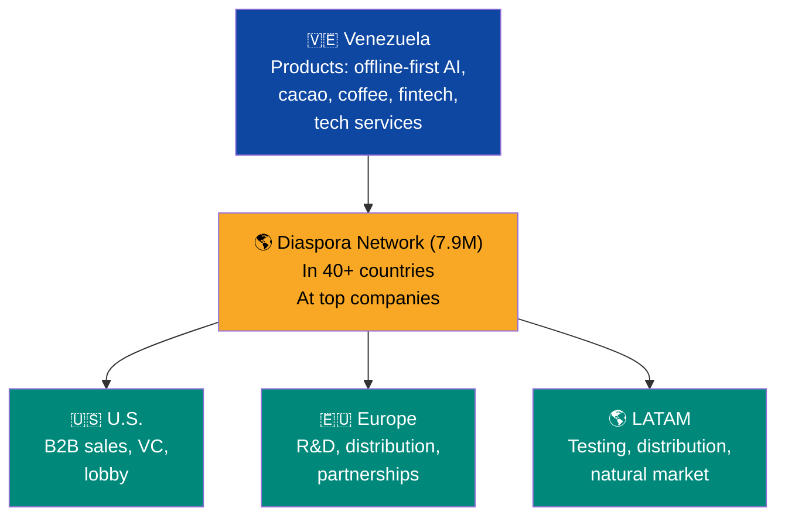

# Return Program: Bringing Talent Back

:::tip In a nutshell
7.9 million Venezuelans left. This plan gives them a concrete reason to come back: their FCV account is waiting, the labor market needs their experience, and they can be co-founders — not employees.
:::

:::caution Illustrative dates — phases are triggered by KPIs, not by calendar
References to "Year X" in this document are **illustrative**. Actual phases are triggered by verifiable conditions (GDP/capita, formalization, poverty). See [Activation KPIs](/07-ejecucion/kpis-activacion).
:::

> The diaspora is not just capital. It's 7.9 million people who acquired skills, languages, networks, and experience that Venezuela desperately needs.

## The Lost Human Capital

[7.9 million Venezuelans](https://www.unhcr.org/us/emergencies/venezuela-situation) abroad. Among them are doctors, engineers, programmers, professors, nurses, accountants — the professional class that emigrated between 2015 and 2024. They contribute [>USD 10,600M/year](https://www.cnn.com/2026/01/24/americas/venezuelans-in-exile-consider-return-latam-intl) to LATAM economies.

| Profile | Need in Venezuela | Return incentive |
|---------|------------------|-----------------|
| Doctors and nurses | Universal healthcare coverage | Competitive salary + housing + repatriation bonus |
| Engineers (oil, civil, electrical) | PDVSA reconstruction + infrastructure | Contract with majors + intl. salary |
| Programmers and tech | Tech hubs and data centers | Tech visa + competitive salary + startup equity |
| Professors | Education reform | Dignified salary + training programs |
| Entrepreneurs | Startup ecosystem | ZEET + 0% tax + seed capital |
| Professionals (accountants, lawyers, managers) | Digital state + financial sector | Degree recognition + fast-track placement |

## Why Coming Back Is a Better Deal Than Staying

:::danger Zero subsidies, zero bonuses, zero exemptions
This plan does NOT offer "repatriation bonuses," housing subsidies, or tax holidays. The 15% flat tax applies to **everyone** — returnees included. The reason to come back isn't what the government gives you. It's what the **market** offers: equity, competitive USD salaries, a market of 40M people rebuilding, and your FCV account accumulating from day 1.
:::

### What awaits you upon return (not a gift — it's your right as a citizen-shareholder)

| Mechanism | What it is | How it works |
|-----------|-----------|--------------|
| **FCV active from day 1** | Your Citizen Fund Venezuela (5 sub-accounts) activates when you formalize employment | Retirement 8% + Health 7% + Housing 4% + Education 2% + Unemployment 2% = 23% of your salary. If you have children, Venezuela S.A. contributes USD 150/month per child |
| **FCV Housing** | Sub-account for purchasing property | Accumulates from your first job. If you return with savings, the [digital cadastre](/06-realidad/estado-digital) guarantees clean titles — buy without intermediaries |
| **Degree recognition (30 days)** | Express validation of international credentials | Automated process via digital state. Eliminates the #1 barrier for returning professionals. [Chile](https://www.mineduc.cl/)/[Colombia](https://www.mineducacion.gov.co/) model |
| **15% flat tax** | Same tax as everyone else | There's no exemption. 15% is already lower than what you pay in Spain (45%), the U.S. (37%), Chile (35%), or Colombia (39%). **That IS the fiscal incentive** |
| **Equity in concessions and startups** | Real ownership in the reconstruction | See [Co-Founders](#co-founders-not-passive-investors) section below. It's not salary — it's ownership |
| **Access to capital** | For entrepreneurship, not for survival | Citizen bonds, VIN, [Semilla/Ignite Venezuela](/05-transformacion/startup-programs) programs. You invest your money, Venezuela S.A. matches. It's not a gift |

### Job placement: the market hires, not the government

| Channel | How it works |
|---------|-------------|
| **Matching platform** (Pre-Seed) | Connects returning talent with real jobs: oil JVs, infrastructure concessions, private hospitals, private schools, startups. The algorithm matches international experience with market demand |
| **Open competition** | No quotas or priority for returnees. The competitive advantage is international experience: languages, standards, networks. The market pays for that — you don't need a government program to certify it |
| **Entrepreneurship** | Same conditions as any citizen. Access to [Semilla/Ignite Venezuela](/05-transformacion/startup-programs) programs by merit. Your edge: you know destination markets that locals don't |

### Bilateral model: not everyone needs to come back

| Modality | Description | What you gain |
|----------|-------------|--------------|
| **Physical return** | Move to Venezuela | Active FCV + equity in concessions + full labor market access |
| **Partial return** | 3-6 months/year in Venezuela | Proportional FCV + remote contribution + residency in host country |
| **Remote contribution** | Remote work for Venezuelan companies | USD contract + proportional FCV + participation in equity programs |
| **Direct investment** | Invest in bonds/startups from abroad | Citizen bonds + VIN + market returns |
| **Mentorship** | Advise Venezuelan startups/institutions | Advisor network + symbolic equity in startups you advise |

### Goals

| Indicator | Year 3 | Year 7 | Year 15 |
|-----------|--------|--------|---------|
| Physical returnees | 100,000 | 500,000 | 1,500,000 |
| Remote contributors | 200,000 | 500,000 | 1,000,000 |
| Active diaspora investors | 79,000 (1% Pre-Seed) | 400,000 | 2,000,000 |

**Incremental return program cost:** USD 15-60M (matching platform USD 10-50M + degree recognition system USD 5-10M). The FCV already exists for all citizens. Concessions create the jobs (already budgeted). Equity programs are already in the plan. **No bonuses, no subsidies, no significant new spending.**

---

## Co-Founders, Not Passive Investors

:::danger Patriotism is not a return model
The diaspora won't return out of love for the homeland. Requarth (VivaReal, Venezuelan founder who built a unicorn in Brazil) said it clearly: "Venezuelans abroad have already rebuilt their lives. For them to return they need **equity** — real participation, not a USD 5,000 bonus and a speech." If the program only offers salary + housing, it competes against stable jobs in Madrid, Miami, Santiago, and Bogota. **It loses.** If it offers equity — being a co-founder of the reconstruction — it changes the equation.
:::

### Equity model for returnees

The difference between an employee who returns and a co-founder who returns is vast. The employee leaves when offered more elsewhere. The co-founder has skin in the game — their wealth is tied to the project's success.

| Program | What you get | Required commitment | Reference |
|---------|-------------|---------------------|-----------|
| **Equity in concessions** | 5-15% equity in infrastructure concessions (ports, highways, telecoms) for the returnee who leads the project | 3 years of residency + operational leadership | Israel — entrepreneurs from the [Talpiot](https://en.wikipedia.org/wiki/Talpiot_program) program receive equity in defense/tech companies they co-found |
| **Startup co-founding** | Matched equity (the fund matches the founder's investment) + fast-track tech visa + USD 50-100K in seed capital | Found and operate the company in Venezuela | Chile — [Start-Up Chile](https://www.startupchile.org/) grants USD 40-80K equity-free; Venezuela S.A. goes further with matched equity |
| **Technical leadership in SOEs** | Equity stake (2-8%) in PDVSA, CVG, CANTV divisions that the returnee restructures and brings to profitability | 5 years of executive commitment | Singapore — [Temasek Holdings](https://www.temasek.com.sg/) executives receive equity in portfolio companies they manage |
| **Academic return** | Equity in lab spin-offs + tenure track + research budget | 5 years at a Venezuelan university | China — [Thousand Talents Plan](https://en.wikipedia.org/wiki/Thousand_Talents_Plan) (without the espionage controversies): lab + funding + permanent position for returning researchers |

### The first 50 matter more than the next 5,000

Lee Kuan Yew documented this pattern in Singapore's construction: when the first 50 high-caliber professionals returned and **visibly thrived** — competitive salary, real equity, quality of life — the next 5,000 came on their own. The effect is exponential, not linear.

| Phase | Goal | Strategy |
|-------|------|----------|
| **The first 50** (year 1) | 50 high-profile technical leaders | Direct recruitment, aggressive equity packages, media coverage of each return |
| **The first 500** (year 2) | 500 qualified professionals | Structured program, matchmaking with concessions and startups |
| **The first 5,000** (years 3-5) | 5,000 returnees with equity | The network effect already works: the first 500 recruit from their international networks |

:::tip The TikTok effect of return
When engineer #23 posts on social media that they have 10% equity in the La Guaira port concession and their net worth tripled in 2 years, no recruitment program is needed. The story sells itself. **Co-founder success stories are the best return marketing.**
:::

---

## The Diaspora as a Distribution Network (Without Needing to Come Back)

> 7.9M Venezuelans in the world's power centers are a distribution, sales, and capital network that no free trade zone can create artificially. — [Parra Carrillo](https://www.linkedin.com/in/andresparracarrillo/)

The plan focuses on bringing people back. But the diaspora **where it is today** is already a productive asset — an organic distribution network for Venezuelan products and services.

### Network map

| Location | Estimated Venezuelans | Sectors they're in | Value as distribution network |
|----------|----------------------|---------------------|-------------------------------|
| **U.S.** (Miami, Houston, NYC) | ~800K | Finance, tech, oil, health | B2B sales channel for Venezuelan startups in the #1 market in the world. Gateway to American VC |
| **Spain** (Madrid, Barcelona) | ~400K | Services, health, hospitality | Gateway to European market. Connection with Spanish VC funds |
| **Colombia** (Bogota, Medellin) | ~3M | Services, commerce, entrepreneurship | Neighbor market + natural tester for LATAM products |
| **Chile** (Santiago) | ~500K | Tech, services, entrepreneurship | Mature startup ecosystem. Start-Up Chile as bridge |
| **Peru, Ecuador, Brazil** | ~1.5M | Commerce, services | Distribution network across all of South America |
| **Europe (other)** | ~400K | Academia, engineering, medicine | R&D partnerships, technology transfer |

### 3 activation models without physical return

| Model | How it works | Estimated revenue | Reference |
|-------|-------------|-------------------|-----------|
| **Tech sales network** | Venezuelans in the U.S./Europe sell offline-first AI solutions (developed in Venezuela) to companies in their countries of residence. 10-20% commission | USD 100-500M/year (at scale) | [Israel: 25% of GDP is tech exports sold by the diaspora in Silicon Valley](https://innovationisrael.org.il/) |
| **Investment channel** | Platform where the diaspora invests from abroad in Venezuelan startups and concessions. They don't need to return — they need access to deal flow | USD 1-5B/year in direct investment | [India: diaspora invests USD 80B/year in the domestic economy](https://www.worldbank.org/en/topic/migration/brief/migration-and-remittances) |
| **Product distribution** | Venezuelan products (cacao, coffee, software, services) distributed through Venezuelans already in those markets who know the channels | USD 200-800M/year in facilitated exports | [Ireland: the Irish diaspora in the U.S. is the primary investment channel into Ireland](https://www.idaireland.com/) |

:::info It's not return OR distribution — they're complementary
Those who return lead operations in Venezuela. Those who stay are the global distribution channel. **Both have equity** — the co-founder operating from Caracas and the sales representative operating from Miami. Israel works exactly this way: the companies are in Tel Aviv, the sales are in Silicon Valley.
:::

---

### Integration with the plan

The co-founding model connects directly with:
- **[Execution team](/07-ejecucion/equipo-ejecutor):** returnees with equity are natural candidates for VIN leadership positions
- **[Startups](/05-transformacion/startup-programs):** the Ignite Venezuela program already includes seed capital; matched equity amplifies it
- **[Concessions](/06-realidad/infraestructura-basica):** each infrastructure concession reserves 5-15% equity for the returning execution team
- **[Citizen investment](/03-ciudadanos/inversion-ciudadana):** returnees also participate as citizens in bonds and dividends — co-founding equity is **additional**

**Incremental cost:** USD 200-500M over 5 years (equity is participation in future value, not direct spending). The real cost is the risk that the returnee doesn't perform — mitigated by 3-5 year vesting and performance metrics.
