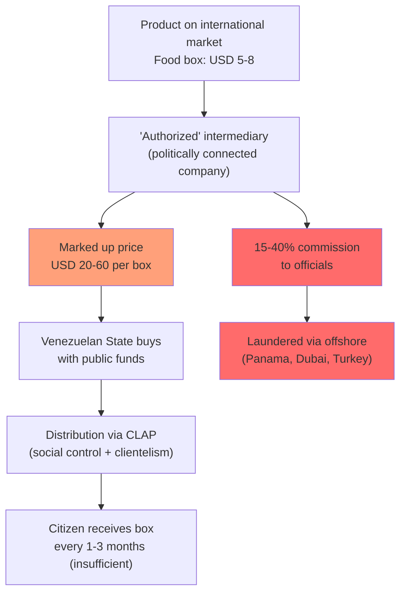
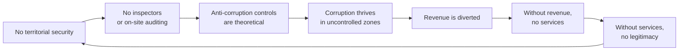
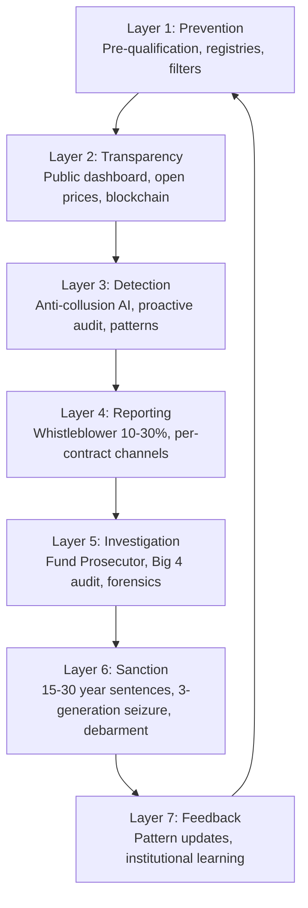
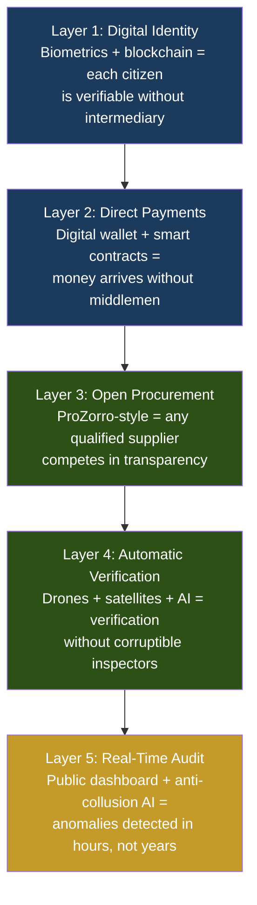

# Integrity Shield: Complete Vulnerability Map

:::tip In a nutshell
How do you prevent them from stealing again? Anti-corruption powered by technology: blockchain to trace every dollar, public dashboards, whistleblower rewards, and zero middlemen where hands can reach in.
:::

> Every area of the plan has specific corruption vectors. General rules are not enough — every door must be closed, one by one. This document maps **14 areas x 12 corruption patterns** with concrete mitigations.

:::danger Lesson from Venezuela 2000-2025
Corruption is not random. It follows predictable patterns that repeat in every area of public spending. [FONDEN diverted USD 300B+](https://transparenciave.org/) using the same mechanisms over and over: intermediaries, overpricing, shell companies, and regulatory capture. If you know the patterns, you can block them.
:::

---

## The 12 Venezuelan Corruption Patterns

| # | Pattern | Mechanism | Historical Example |
|---|---------|-----------|-------------------|
| 1 | **Shell company** | Ghost entity receives contract, collects advance, disappears | Thousands of FONDEN/CADIVI companies |
| 2 | **Overpricing / intermediaries** | State buyer pays 3-10x market price via intermediary | [CLAP: USD 5 boxes sold to the State for USD 20-60](https://armando.info/series/los-empresarios-del-hambre/) |
| 3 | **Regulatory capture** | Official designs regulation that benefits a specific company | CENCOEX: preferential dollar quotas for "allies" |
| 4 | **Ghost payroll** | Fictitious employees on public payroll collect salary | Ministries with 50%+ inflated payroll |
| 5 | **Commodity diversion** | Subsidized product diverted to black market or illegal export | Venezuelan gasoline -> Colombia; PDVAL rotting food |
| 6 | **Bid rigging** | Collusion among bidders; one company submits 3 different bids | PDVSA public works contracts |
| 7 | **Direct bribery** | Payment to official for approval, permit, or contract | "La mordida" in government procedures |
| 8 | **Concession laundering** | Public concession used to launder money from illicit activities | Illegal mining in Arco Minero |
| 9 | **Land/property fraud** | Falsified property titles or expropriation for resale | "Productive" expropriated land that never produces |
| 10 | **Military capture** | FANB controls economic activity and extracts rents | [Illegal mining, border smuggling, ports](https://insightcrime.org/) |
| 11 | **Customs fraud** | Under-invoicing, smuggling, discretionary exemptions | Customs as "toll" controlled by mafias |
| 12 | **Ghost certification** | Titles, diplomas, or certifications issued without meeting requirements | Universities selling degrees; fake labor certifications |

---

## The CLAP Pattern: Anatomy of Institutionalized Overpricing

:::danger This pattern is the most dangerous because it looks legitimate
The CLAP system (Local Supply and Production Committees) was presented as a social program. In reality, it was the largest food overpricing scheme in Venezuela's history: intermediaries bought food at international market prices and sold it to the Venezuelan State at **3-10x its value**, with 15-40% commissions for officials.
:::



**Estimated cost:** USD 10-20B in overpricing between 2016-2025 ([Armando.info](https://armando.info/series/los-empresarios-del-hambre/), [OCCRP](https://www.occrp.org/)).

### Anti-CLAP Protection in the Plan

| Control | Mechanism | Reference |
|---------|-----------|-----------|
| **Reference price database** | Every contract is compared to international market price. Deviation >15% -> automatic investigation | [KONEPS, South Korea](https://www.pps.go.kr/eng/) |
| **Prohibition of unregistered intermediaries** | Only direct suppliers or distributors with regulated maximum margin (<=12%) | [EU procurement directives](https://single-market-economy.ec.europa.eu/single-market/public-procurement_en) |
| **Supply chain audit** | Complete traceability: manufacturer -> importer -> distributor -> final destination | [ProZorro, Ukraine](https://prozorro.gov.ua/en) |
| **Supplier rotation** | No supplier >25% of total volume in any category | Anti-monopoly |
| **Open prices** | Every price paid by the State is public in real time | [Open Contracting Partnership](https://www.open-contracting.org/) |
| **Per-contract whistleblower channel** | Each contract has its own whistleblower channel. 10-30% reward on identified savings | [SEC Whistleblower, U.S.](https://www.sec.gov/whistleblower) |

---

## Vulnerability Map by Plan Area

### 1. Sovereign Fund

| Vulnerability | Pattern | Prob. | Mitigation |
|--------------|---------|-------|-----------|
| Board captured by populist government | Regulatory capture | High | 4 of 7 members selected by non-governmental entities; removal requires 4/5 supermajority + cause |
| Manipulated custody | Diversion | Medium | Offshore custody (JPMorgan/HSBC); quarterly Big 4 audit; public blockchain |
| Relaxed investment mandate | Regulatory capture | Medium | Constitutional limits: >=60% AAA sovereign fixed income, <=5% in a single asset |
| Excessive fees to managers | Overpricing | Medium | Public fee benchmark; minimum 3 quotes; independent compensation committee |
| Use of fund as debt collateral | Regulatory capture | Medium-High | Constitutional prohibition on using fund as collateral. Ref: [Alaska PFD](https://pfd.alaska.gov/) |

**Ref:** [Fund governance](/02-motor-financiero/fondo-soberano) · [Santiago Principles](https://www.ifswf.org/santiago-principles)

### 2. Oil and Gas

| Vulnerability | Pattern | Prob. | Mitigation |
|--------------|---------|-------|-----------|
| Inflated service contracts | Overpricing | High | Benchmarking with [Rystad Energy](https://www.rystadenergy.com/) by service type; minimum 3 bids |
| JV with shell companies | Shell company | Medium | Pre-qualification: 5+ years of operation, USD 100M+ in verifiable assets |
| Unreported production | Commodity diversion | Medium | Certified fiscal meters + satellite flaring audit |
| Intermediaries in crude sales | Overpricing/CLAP | Medium-High | Direct sales to refineries; no unregistered brokers; Brent - public discount price |
| Inflated transport contracts | Overpricing | Medium | Benchmark tariffs by route; open auctions |

**Ref:** [Forward contracts](/02-motor-financiero/contratos-forward) · [EITI](https://eiti.org/)

### 3. Debt and Restructuring

| Vulnerability | Pattern | Prob. | Mitigation |
|--------------|---------|-------|-----------|
| Legal advisors with conflicts of interest | Regulatory capture | Medium | Client disclosure; prohibition on representing creditors and debtor simultaneously |
| Excessive discounts in swap | Bribery | Medium-Low | Independent committee; comparison with similar restructurings (Ecuador 2020, Argentina 2020) |
| Side deals with preferred creditors | Bribery | Medium | Pari passu clause; full disclosure of agreements |
| Professional litigants capturing assets | Legal fraud | Medium | Coordinated legal defense; protection of critical assets (Citgo in trust) |

**Ref:** [Debt](/02-motor-financiero/deuda)

### 4. Infrastructure and PPP

| Vulnerability | Pattern | Prob. | Mitigation |
|--------------|---------|-------|-----------|
| Concessionaire without real capacity | Shell company | High | Pre-qualification: 3+ similar completed projects; capital >=10% of contract |
| Unjustified cost overruns | Overpricing | High | Public base budget; variations >15% require independent approval + audit |
| Chain subcontracting | Shell company | Medium-High | Maximum 2 levels of subcontracting; each level with same pre-qualification filters |
| Abandoned works | Fraud | Medium | Maximum 15% advance; milestone-verified disbursement; 20% performance bond |
| Corrupt inspectors | Bribery | Medium | Random inspector rotation; drones + satellite imagery as cross-verification |
| Overvalued land | Land fraud | Medium | 3 independent appraisals; comparison with recent transactions in the area |

**Ref:** [Infrastructure](/06-realidad/infraestructura-basica) · [Anti-fragile system](/04-gobernanza/sistema-antifragil)

### 5. Humanitarian Emergency (Phase 0)

| Vulnerability | Pattern | Prob. | Mitigation |
|--------------|---------|-------|-----------|
| Diverted medication | Commodity diversion | High | Lot-by-lot traceability; distribution via verified NGOs (MSF, Red Cross) |
| Overpriced food (CLAP pattern) | Overpricing | High | Direct purchase via WFP/UNICEF; verifiable market prices; no intermediaries |
| Ghost payroll in emergency program | Ghost payroll | Medium-High | Biometric beneficiary identification; random monthly audit |
| Social control via distribution | Regulatory capture | Medium | Decentralized distribution; multiple channels; no political conditioning |

**Ref:** [Phase 0](/01-fundamentos/fase-0-emergencia)

### 6. Education

| Vulnerability | Pattern | Prob. | Mitigation |
|--------------|---------|-------|-----------|
| Ghost certifications | Ghost certification | Medium-High | Digital attendance verification + standardized exams; outcome audits (employment, grades) |
| Schools that do not operate but charge | Shell company | Medium | Random inspection; digital enrollment registry; payment against verified attendance |
| Equipment purchased but never delivered | Overpricing | Medium | Destination verification; 2-year warranty; non-compliance penalty |
| Inflated education consulting contracts | Overpricing | Medium | Benchmark with international organization rates (UNESCO, IDB) |

**Ref:** [Education](/05-transformacion/educacion)

### 7. Healthcare

| Vulnerability | Pattern | Prob. | Mitigation |
|--------------|---------|-------|-----------|
| Medical equipment billed and not delivered | Overpricing | High | Destination verification + digital inventory + operational warranty |
| Expired or counterfeit medication | Diversion/fraud | Medium-High | Blockchain traceability; lot verification with WHO; purchasing via PAHO |
| Supply overpricing (CLAP-health pattern) | Overpricing | High | Reference price database (ref: [WHO Essential Medicines](https://www.who.int/groups/expert-committee-on-selection-and-use-of-essential-medicines)); maximum 12% margin |
| Ghost hospital payroll | Ghost payroll | Medium | Biometric attendance registry; random audit |

**Ref:** [Public services](/06-realidad/servicios-publicos)

### 8. Mining and Arco Minero

| Vulnerability | Pattern | Prob. | Mitigation |
|--------------|---------|-------|-----------|
| Legal front for illegal mining | Shell company / laundering | High | Mandatory beneficial owners; quarterly on-site inspection; blockchain origin traceability |
| FANB controls mining zones | Military capture | High | Gradual territorial recovery (years 1-5); professionalization; international cooperation |
| Unreported royalties | Commodity diversion | Medium-High | Independent production measurement; comparison with declared exports |
| Politically priced concessions | Regulatory capture | Medium | International public auction; market prices (ref: Botswana-De Beers) |

**Ref:** [Diversification](/05-transformacion/diversificacion) · [Physical security](/04-gobernanza/seguridad-fisica)

### 9. Tech, Startups and SEEZs

| Vulnerability | Pattern | Prob. | Mitigation |
|--------------|---------|-------|-----------|
| Fake startup to capture grants | Shell company | Medium | Disbursement in 3 milestone-based tranches; accelerator audit; mandatory demo day |
| Shell company in SEEZ for evasion | Concession laundering | Medium | Verifiable physical operation; minimum payroll; random annual audit |
| Fictitious billing in SEEZ | Fraud | Medium | Cross-reference with customs + client data; random inspection |
| Inflated data center contracts | Overpricing | Medium-Low | Benchmark with global prices (Equinix, Digital Realty); full transparency |

**Ref:** [Tech hubs](/05-transformacion/hubs-tech) · [Startup programs](/05-transformacion/startup-programs)

### 10. Pensions and Social Security

| Vulnerability | Pattern | Prob. | Mitigation |
|--------------|---------|-------|-----------|
| Ghost pensioners | Ghost payroll | High | Biometric registry; quarterly digital proof of life; cross-reference with civil registry |
| Poorly invested pension funds | Regulatory capture | Medium | Constitutional investment mandate; independent supervision; performance benchmark |
| Administrators with excessive fees | Overpricing | Medium | Maximum fee by law (1.5% AUM); benchmark with comparable systems (Chile AFP) |

**Ref:** [Pensions](/06-realidad/pensiones-seguridad-social)

### 11. Property and Land

| Vulnerability | Pattern | Prob. | Mitigation |
|--------------|---------|-------|-----------|
| Falsified property titles | Land fraud | High | Blockchain digital registry; cross-verification with cadaster + satellite imagery |
| Expropriation for resale to allies | Regulatory capture | Medium-High | Constitutional prohibition of expropriation without market compensation + judicial review |
| Manipulated appraisals | Bribery | Medium | 3 independent appraisals; expert rotation; comparison with market transactions |

**Ref:** [Rule of law](/04-gobernanza/estado-derecho-moneda) · [Those who stayed](/03-ciudadanos/los-que-se-quedaron)

### 12. Customs and Foreign Trade

| Vulnerability | Pattern | Prob. | Mitigation |
|--------------|---------|-------|-----------|
| Import under-invoicing | Customs fraud | High | 100% container scanning; cross-reference with export data from origin country (model [ASYCUDA, UNCTAD](https://asycuda.org/)) |
| Discretionary exemptions | Regulatory capture | Medium-High | Exemptions only by law (not discretionary); public list of beneficiaries |
| Extraction smuggling | Commodity diversion | Medium | Satellite border monitoring; cooperation with Colombia/Brazil/Guyana |

**Ref:** [Foreign trade](/05-transformacion/comercio-exterior)

### 13. Commodity Trading (Forwards)

| Vulnerability | Pattern | Prob. | Mitigation |
|--------------|---------|-------|-----------|
| Ghost intermediaries in forward contracts | Overpricing | Medium | Direct counterparties (majors: Shell, Chevron, TotalEnergies); no unregistered brokers |
| Excessive discount when selling forward | Regulatory capture | Medium | Independent pricing committee; benchmark with reference markets (Brent, WTI) |
| Undisclosed side deals | Bribery | Medium-Low | Full disclosure of all contracts; semi-annual Big 4 audit |

**Ref:** [Forward contracts](/02-motor-financiero/contratos-forward)

### 14. Diaspora and Citizen Investment

| Vulnerability | Pattern | Prob. | Mitigation |
|--------------|---------|-------|-----------|
| Fake organization captures investments | Shell company | Medium | Centralized platform with KYC/AML; fund usage audit; securities regulation |
| VIN (Venezuela Investment Notes) fraud | Fraud | Medium-Low | Regulated issuance (SEC-equivalent); custody on international exchange; quarterly audit |
| Political use of the platform | Regulatory capture | Low-Medium | Independent platform governance; propaganda prohibition on investment channel |

**Ref:** [Citizen investment](/03-ciudadanos/inversion-ciudadana) · [Diaspora](/03-ciudadanos/diaspora)

---

## 5 Structural Vulnerabilities Not Covered by Standard Controls

Beyond individual patterns, there are systemic vulnerabilities requiring design-level solutions:

### 1. Military Control of Economic Zones

FANB directly controls activities in: mining (Arco Minero), border smuggling (Tachira, Zulia, Bolivar), ports and customs, and food/fuel distribution ([InSight Crime, 2024](https://insightcrime.org/)).

**Mitigation:**
- Adapted DDR with economic component (productive reintegration)
- Gradual territorial recovery: pilot zones (SEEZs) -> progressive expansion
- International cooperation (Colombia, U.S.) as counterweight
- Military reform: 350,000 -> 120,000 personnel with dignified retirement packages
- **Prerequisite:** Without security first, anti-corruption protections are paper

### 2. Geopolitical Pressure vs. Transparency

The U.S. currently controls Venezuelan oil sales via OFAC licenses. China and Russia hold USD 50B+ in debt. Both can pressure to relax transparency controls as a condition of cooperation.

**Mitigation:**
- Transparency as a non-negotiable condition of any agreement
- [EITI](https://eiti.org/) accession as an international signal
- Partner diversification to avoid dependence on a single bloc
- Civil society + international press as watchdogs

### 3. Absorption Risk (Capacity Constraint)

Spending USD 550-750B over 15 years requires institutional capacity that does not exist. Without capacity, funds are wasted or stolen. [Angola lost ~30% of USD 68B in infrastructure due to inefficiency](https://www.brookings.edu/).

**Mitigation:**
- Gradual ramp-up: USD 3-5B/year (years 1-3) -> USD 12-15B (years 8-15)
- PPP concessions with experienced international operators
- [Human capital](/05-transformacion/capital-humano): 3 channels (diaspora + reskilling + foreign expertise)
- Per-project cost benchmarking vs. regional comparables

### 4. Substitution Effect (Corruption Migration)

When you block one corruption channel, money migrates to a less visible one. Example: when Venezuela closed CADIVI, corruption migrated to CENCOEX, then to CLAP, then to illegal mining.

**Mitigation:**
- Real-time integrity dashboard monitoring all channels simultaneously
- Anomalous pattern analysis with AI (model [KONEPS, South Korea](https://www.pps.go.kr/eng/))
- Whistleblower with rewards (10-30% of savings) as distributed sensor
- Proactive (not just reactive) forensic audit: random rotation of audited areas
- Continuous risk pattern updates (this document is version 1.0)

### 5. The Binding Constraint: Security



**This is risk #1 of the entire plan.** All anti-corruption protections assume that rule of law exists in the territory. In zones where armed groups operate (pranatos, extractive FANB, Colombian guerrillas, illegal mining), controls do not work.

**Mitigation:** See [Physical security](/04-gobernanza/seguridad-fisica) — territorial recovery is a prerequisite, not a consequence, of the economic plan.

---

## Heat Map: Pattern x Area

```
                    Fund  Oil  Debt Infra Emerg Edu  Salud Min  Tech Pens Prop Aduana Fwd  Dias
Empresa maletín      ·    ●    ·    ●●    ·    ●    ·    ●●    ●    ·    ·    ·     ·    ●
Sobreprecios/CLAP    ●    ●●   ·    ●●    ●●   ●    ●●   ·    ·    ●    ·    ·     ●    ·
Captura regulatoria  ●●   ·    ●    ·     ●    ·    ·    ●    ·    ●    ●●   ●●    ●    ·
Nómina fantasma      ·    ·    ·    ·     ●●   ·    ●    ·    ·    ●●   ·    ·     ·    ·
Desvío commodity     ·    ●    ·    ·     ●●   ·    ·    ●●   ·    ·    ·    ●●    ·    ·
Fraude licitación    ·    ●    ·    ●●    ·    ·    ·    ·    ·    ·    ·    ·     ·    ·
Soborno              ·    ·    ●    ●     ·    ·    ·    ·    ·    ·    ●    ●     ·    ·
Lavado concesión     ·    ·    ·    ·     ·    ·    ·    ●●   ●    ·    ·    ·     ·    ·
Fraude tierras       ·    ·    ·    ●     ·    ·    ·    ·    ·    ·    ●●   ·     ·    ·
Captura militar      ·    ·    ·    ·     ·    ·    ·    ●●   ·    ·    ·    ●     ·    ·
Fraude aduanero      ·    ·    ·    ·     ·    ·    ·    ·    ·    ·    ·    ●●    ·    ·
Certificación falsa  ·    ·    ·    ·     ·    ●●   ·    ·    ·    ·    ·    ·     ·    ·

·  = low risk or not applicable
●  = medium risk
●● = high risk (mitigation priority)
```

---

## Defense Stack: 7 Layers



Every State transaction must pass through at least **3 of the 7 layers**. If one layer fails, the next ones back it up. This is defense in depth applied to public integrity.

---

## Integrity KPIs (annual measurement)

| KPI | Year 1 Target | Year 5 Target | Year 10 Target | Benchmark |
|-----|--------------|--------------|---------------|-----------|
| % of contracts with price within +/-15% of reference | >70% | >90% | >95% | KONEPS: 97% |
| Average anomaly detection time | <90 days | <30 days | <7 days | Estonia: <5 days |
| % of registered beneficial owners | >80% | >95% | 100% | UK PSC: 98% |
| Reports processed / received | >60% | >80% | >90% | SEC: 85% |
| Contracts with post-award audit | >30% | >60% | >80% | Norway: 75% |
| CPI Index (Transparency International) | 20->25 | 35-40 | 50+ | Georgia: 16->52 in 10 years |
| Citizen satisfaction with transparency | Baseline | >50% | >70% | Estonia: 72% |

---

## Shield Cost

| Component | Estimated Annual Cost | Reference |
|-----------|----------------------|-----------|
| Digital procurement platform | USD 5-10M | [ProZorro cost USD 3M](https://prozorro.gov.ua/en) (adjusted for scale) |
| AI detection system | USD 10-15M | [KONEPS](https://www.pps.go.kr/eng/) |
| Big 4 audit (fund + contracts) | USD 20-30M | Sovereign audit benchmark |
| Fund Prosecutor + team | USD 5-8M | Singapore CPIB model |
| Independent inspectors (rotation) | USD 15-25M | ~500 inspectors + logistics |
| Whistleblower rewards | USD 10-50M (variable) | [SEC paid USD 1.3B in 12 years](https://www.sec.gov/whistleblower) |
| **Total** | **USD 65-138M/year** | **<0.1% of total plan spending** |

:::tip The shield pays for itself
If the system prevents **1% of corruption** on USD 50B/year in public spending, the savings are **USD 500M/year** — 4-8x the cost of the integrity system. Georgia reduced corruption from ~80% to ~5% in 2 years with a similar investment relative to its GDP.
:::

---

## Anti-Intermediary Principle: Zero Middlemen by Design

:::danger The CLAP pattern is the pattern of ALL Venezuelan corruption
CLAP was not an exception — it was the rule. **Every social program, public contract, and government service in Venezuela was captured by intermediaries who extracted 40-70% of the value.** CADIVI: intermediaries bought dollars at Bs. 6.30 and sold them at Bs. 100+. Social missions: intermediaries charged for "beneficiaries" who did not exist. PDVSA: intermediaries billed services at 3-10x market price. **The intermediary is the primary vector of corruption in Venezuela.**
:::

### The design principle

**Every State transaction with citizens, suppliers, or investors must have anti-intermediary architecture by default.** This is not an additional control — it is a design requirement. If a mechanism requires a human intermediary to function, the design is wrong.

### Anti-intermediary redesign table

| Program / Area | Traditional Design (WITH intermediary) | Anti-Intermediary Design | Enabling Technology | Estimated Savings | Cross-ref |
|---------------|---------------------------------------|--------------------------|---------------------|-------------------|-----------|
| **Social transfers** | Via local committee (CLAP) — intermediary decides who receives, how much, when. Extraction: **40-70%** | Direct to citizen's digital wallet — no committee, no intermediary, biometric verification | Blockchain + biometrics + digital identity ([India Aadhaar-DBT](https://dbtbharat.gov.in/): USD 33B saved) | **40-60%** of current cost | [Phase 0](/01-fundamentos/fase-0-emergencia) · [Citizens](/03-ciudadanos/los-que-se-quedaron) |
| **Public procurement** | Via broker or "friendly company" — price inflated 3-10x, kickback to official | Open marketplace like [ProZorro](https://prozorro.gov.ua/en) — public prices, any qualified supplier can bid, automatic award | E-procurement platform + anti-collusion AI + automatic reference prices | **30-50%** in eliminated overpricing | [Infrastructure](/06-realidad/infraestructura-basica) · [Healthcare](/06-realidad/servicios-publicos) |
| **Citizen investment (VIN)** | Via bank branch — bank charges commission, slow procedures, access limited to areas with branches | Direct app — digital KYC, VIN purchase from mobile, custody on international exchange | Fintech + smart contracts + digital custody ([Robinhood](https://robinhood.com/) / [eToro](https://www.etoro.com/) model) | **80-90%** in bank commissions | [Citizen investment](/03-ciudadanos/inversion-ciudadana) |
| **Infrastructure contracts** | Via intermediary company that subcontracts the actual builder — intermediary margin: **20-40%** | Direct to builder, milestone-verified disbursement with smart contract — automatic payment when drone/satellite confirms progress | Smart contracts + satellite verification + drones + milestone-based payments | **20-35%** of total project cost | [Infrastructure](/06-realidad/infraestructura-basica) · [PPP](#4-infrastructure-and-ppp) |
| **Healthcare: supplies and medication** | Via pharmaceutical distributor with **50-200%** markup (CLAP-health pattern) | Direct purchase via PAHO/WHO from manufacturer + blockchain supply chain from lot to lot to hospital | Blockchain supply chain + centralized purchasing via multilateral organizations + traceability | **40-60%** in supply overpricing | [Public services](/06-realidad/servicios-publicos) · [Healthcare](#7-healthcare) |
| **Education: materials and equipment** | Via "authorized" supplier — equipment billed and not delivered, or delivered non-functional | Direct purchase from manufacturer via open tender + delivery verification at destination with photo/video | E-procurement + destination verification + operational warranty linked to payment | **25-40%** in eliminated ghost purchases | [Education](/05-transformacion/educacion) · [Education](#6-education) |
| **Victim reparations** | Via intermediary NGO or lawyer charging 30-50% of reparation amount | Direct payment to biometrically verified victim's digital account | Digital identity + direct payment + automatic audit | **30-50%** in intermediary extraction | [Transitional justice](/04-gobernanza/justicia-transicional) |
| **Pensions** | Via administrator with opaque fees of **2-4% AUM** | Administrator with maximum **1.5% AUM** fee by law + public returns + free switching between administrators | Digital pension platform + public benchmark + portability | **50-70%** in excessive fees | [Pensions](/06-realidad/pensiones-seguridad-social) · [Pensions](#10-pensions-and-social-security) |

### The anti-intermediary technology stack



### Precedent: India Aadhaar-DBT

The most successful case of eliminating intermediaries at national scale:

| Metric | Before Aadhaar-DBT | After Aadhaar-DBT | Source |
|--------|---------------------|-------------------|--------|
| Ghost beneficiaries | **30-40%** of beneficiaries did not exist | **<3%** automatically filtered | [World Bank, 2023](https://www.worldbank.org/en/country/india) |
| Intermediaries in transfers | 3-5 levels of intermediaries | **Zero** — direct payment to Aadhaar account | [DBT Bharat](https://dbtbharat.gov.in/) |
| Cumulative savings | — | **USD 33B+** in direct transfers (2014-2024) | [Government of India, DBT Dashboard](https://dbtbharat.gov.in/) |
| Coverage | ~50% of the population | **1,400M** people with digital identity | [UIDAI](https://uidai.gov.in/) |

:::tip If India could eliminate intermediaries for 1,400M people, Venezuela can do it for 40M
The technology exists. The models are proven. The difference between USD 5 reaching the citizen and USD 5 disappearing through intermediaries is a design decision, not a budget decision.
:::

---

> **Corruption is a design problem, not a culture problem. If you design the system so that stealing is difficult, expensive, and visible, people stop stealing. If you design it so that stealing is easy, cheap, and invisible — like Venezuela 2000-2025 — everyone steals.**
