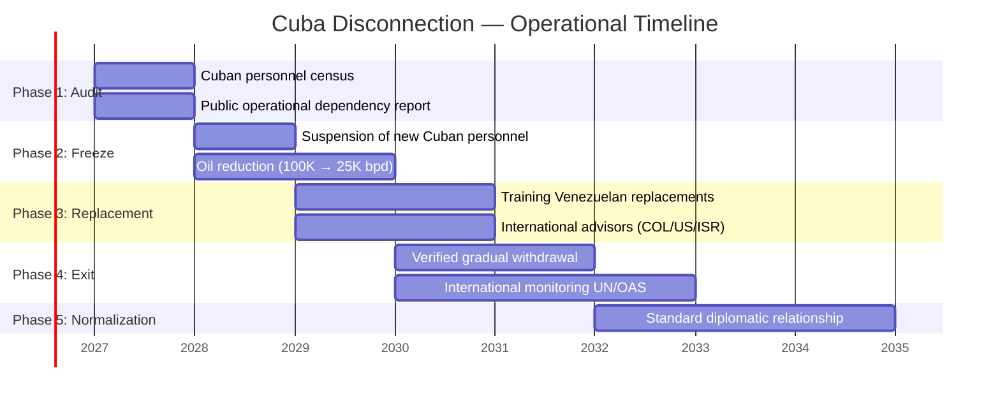

# Cuba: Security Apparatus Disconnection

> Without disconnecting Cuba from the Venezuelan security apparatus, there is no viable institutional reform, no sanctions relief, and no real sovereignty. This is not theoretical geopolitics — it is an operational prerequisite.

Cuba does not "advise" the Venezuelan security apparatus. It **designed it, operates it, and supervises it**. SEBIN was modeled on Cuba's G-2. DGCIM was created with direct assistance from Havana. FANB doctrine incorporates Cuban-style political control. As long as this structure exists, any security reform this plan proposes — from the [Georgia-model police purge](/04-gobernanza/seguridad-fisica) to FANB reform — faces an actor with direct incentives to sabotage it.

Marco Rubio, U.S. Secretary of State, has been explicit: Cuban influence in Venezuela is a red line for any bilateral normalization. Maria Corina Machado has identified it as a condition for a real democratic transition.

:::danger Critical blind spot
The plan's [geopolitics](/04-gobernanza/geopolitica) section does not mention Cuba. This was identified as a blind spot with a **1/10** rating in an independent evaluation. This section corrects it.
:::

---

## Current Cuban Presence

| Institution | Estimated Presence | Function | Impact on Sovereignty | Source |
|-------------|-------------------|---------|----------------------|--------|
| **FANB** (Armed Forces) | [Requires research] | Doctrinal advisors, political control of officers, military intelligence | Loyalty control + blocking of internal reform | [International Crisis Group](https://www.crisisgroup.org/) |
| **SEBIN** (Intelligence) | [Requires research] | Organizational structure modeled on Cuba's G-2, surveillance methods, embedded personnel | Venezuela does not control its own intelligence | [InSight Crime](https://insightcrime.org/) |
| **DGCIM** (Military Counterintelligence) | [Requires research] | Designed and supervised by Cubans, interrogations, internal FANB surveillance | Instrument of political control, not defense | [IISS](https://www.iiss.org/) |
| **Social missions** (health, education) | **~20,000–40,000** people [Requires research — figures vary widely] | Doctors, educators, social workers — legitimate functions with intelligence cover | Territorial information network + political legitimacy | [Reuters](https://www.reuters.com/) |
| **PDVSA** (oil sector) | [Requires research] | Personnel in operations, logistics, commercialization | Access to strategic commercial information | [Crisis Group](https://www.crisisgroup.org/) |

:::info Disputed figures
Estimates of Cuban personnel in Venezuela range from **20,000 to 60,000** depending on the source and whether social missions are included. No verifiable census exists. This section marks all figures as [Requires research] until reliable intelligence data is obtained post-transition.
:::

---

## Why Cuba Will Not Leave Voluntarily

Cuba depends economically on Venezuela. It is not ideology — it is fiscal survival.

| Flow from Venezuela to Cuba | Estimated Value | % of Cuban GDP (~USD 107B PPP) | Source |
|-----------------------------|----------------|--------------------------------|--------|
| Subsidized oil | **~100,000 bpd** -> ~USD 2.2B/year at USD 60/barrel | ~2% | [Reuters, 2024](https://www.reuters.com/) |
| Cash payments for services | **USD 400–800M/year** [Requires research] | ~0.5-0.7% | [Economist](https://www.economist.com/) |
| Access to foreign exchange via PDVSA | [Requires research] | — | — |
| **Total estimated** | **~USD 2.5–3.5B/year** | **~2.5-3.5%** | Consolidated |

**Venezuela is Cuba's second most important economic partner** after remittances from the Cuban diaspora. Losing this flow is equivalent to an economic crisis for Havana.

This means Cuba only withdraws under three scenarios:

1. **Economic alternative** — someone (China, Russia, or an international agreement) compensates the loss
2. **Unsustainable pressure** — the cost of staying exceeds the benefit (aggressive secondary sanctions)
3. **Negotiation with guarantees** — exit package with international monitoring

---

## Phased Disconnection Plan

| Phase | Period | Key Action | Precondition | Main Risk |
|-------|--------|-----------|-------------|----------|
| **1. Audit** | Year 0–1 | Complete census of Cuban personnel in each institution. Transparent public report. Assessment of operational dependency | Transition government installed | Cuba obstructs census; classified data destroyed |
| **2. Freeze** | Year 1–2 | Zero new Cuban personnel. Gradual freeze of oil shipments (100K -> 50K -> 25K bpd). Renegotiation of bilateral agreements | Audit completed + intelligence alternatives underway | Cuba retaliates with information sabotage |
| **3. Replacement** | Year 2–3 | Training of Venezuelan replacements. International advisors (Colombia, U.S., Israel). New national intelligence doctrine | Alternative personnel trained | Temporary operational capacity gap |
| **4. Exit** | Year 3–5 | Verified gradual withdrawal. International monitoring (UN/OAS). Declassification of archives | Venezuelan capacity operational at 80%+ | Resistance from pro-Cuba elements within FANB |
| **5. Normalization** | Year 5+ | Cuba as normal diplomatic partner. No security role. Standard commercial relationship | Withdrawal completed and verified | Covert reinfiltration |

---

## International Disconnection Models

| Case | Period | Mechanism | Result | Lesson for Venezuela | Source |
|------|--------|-----------|--------|---------------------|--------|
| **USSR -> Eastern Europe** | 1989–1991 | Soviet economic collapse + popular pressure + bilateral negotiation | Complete withdrawal in ~2 years. Institutional independence achieved | The patron's economic collapse accelerates withdrawal. But leaves capacity gap | [IISS](https://www.iiss.org/) |
| **Cuba -> Angola** | 1988–1991 | Tripartite Agreement (Cuba-South Africa-Angola). U.S. mediation. Withdrawal of **50,000 troops** in 27 months | Complete withdrawal verified by UN (UNAVEM) | A negotiated exit with international verification works. Cuba complies when there is incentive | [UN UNAVEM](https://peacekeeping.un.org/) |
| **USSR -> Egypt** | 1972 | Sadat expelled **~15,000** Soviet advisors unilaterally | Abrupt break. Egypt lost temporary military capability but gained sovereignty + U.S. alliance | Unilateral expulsion is possible but costly in the short term | [IISS](https://www.iiss.org/) |
| **Russia -> Syria** | 2024–2025 | Assad's fall eliminated the operating base | Forced withdrawal by regime change | Without a local patron, the presence collapses | Post-2024 analysis |

:::tip Key precedent: Angola
Cuba withdrew **50,000 troops** from Angola in 27 months under the 1988 Tripartite Agreement. It was verified by the UN's UNAVEM mission. If Cuba fulfilled a withdrawal of that scale with international verification, it can do so in Venezuela. The Angola model is the operational reference.
:::

---

## Cost of Disconnection

| Dimension | What Venezuela Loses (short term) | What Venezuela Gains (medium-long term) |
|-----------|----------------------------------|----------------------------------------|
| **Intelligence** | SEBIN/DGCIM operational capacity degrades temporarily (6–18 months) | Sovereign intelligence, alliances with Five Eyes/Mossad, own capability |
| **Military control** | Internal loyalty mechanisms weaken -> faction risk | Professional FANB with its own doctrine, not political control |
| **Social missions** | Temporary loss of Cuban doctors/educators in vulnerable areas | Own rural health program + international hiring |
| **Oil spending** | "Savings" of **~USD 2.2B/year** in oil that went to Cuba | USD 2.2B/year redirected to Sovereign Fund or domestic investment |
| **U.S. relationship** | — | **Unlocks sanctions relief** — Rubio condition satisfied |
| **Sovereignty** | — | Venezuela controls its own security institutions |

:::caution Net balance
The real cost is a **6–18 month intelligence capacity gap** that must be filled before the Cuban withdrawal is complete. Everything else is net gain. The key is the sequence: replacements first, withdrawal after.
:::

---

## U.S. Bilateral Requirement

Marco Rubio has been explicit in multiple statements: Cuban disconnection is a **precondition** for any normalization of relations with Venezuela.

| U.S. Condition | Status | Impact on the Plan |
|----------------|--------|-------------------|
| Elimination of Cuban influence in security | **Gating requirement** — without this, no significant sanctions relief | Blocks Phases 1-2 of the sanctions roadmap |
| Verified free elections | Political prerequisite | Wright: "probably" during Trump's term |
| Oil revenue transparency | In progress (U.S.-controlled accounts) | See [geopolitics](/04-gobernanza/geopolitica) |
| Anti-narcotics cooperation | Requires sovereign security capability | Depends on Cuban disconnection |

**Direct implication:** Without executing this disconnection plan, the sanctions roadmap stalls and the USD 183B oil investment does not materialize. Cuba is the geopolitical bottleneck of the plan.

---

## Risk: Cuban Retaliation

| Retaliation Scenario | Probability | Impact | Mitigation |
|---------------------|------------|--------|------------|
| **Intelligence sabotage** — archive destruction, disinformation, compromised agents | High | High | Back up information before audit. Cooperate with international agencies |
| **Activation of internal networks** — pro-Cuba elements in FANB/SEBIN sabotage transition | Medium-High | Critical | Early identification via audit. Selective purge with due process |
| **Classified information leak** — Cuba publishes/sells Venezuelan intelligence | Medium | High | Immediate change of protocols, codes, communication networks |
| **Destabilization via colectivos** — Cuba activates aligned paramilitary groups | Medium | High | Accelerated colectivo DDR. See [physical security](/04-gobernanza/seguridad-fisica) |
| **Diplomatic pressure** — Cuba mobilizes allies (Nicaragua, Bolivia) against Venezuela | Low | Low | Irrelevant if the U.S. backs the transition |

### Central Mitigation: New Intelligence Alliances

| Potential Partner | Capability | Precedent | Timeline |
|------------------|-----------|-----------|----------|
| **U.S. (CIA/DEA)** | HUMINT, SIGINT, anti-narcotics | Pre-Chavez cooperation (until 2005) | Immediate post-transition |
| **Colombia (DIJIN/Army)** | Border intelligence, counterinsurgency | Greatest regional experience against ELN/FARC | Year 1 |
| **Israel (Mossad/Shin Bet)** | Counterintelligence, cybersecurity, training | Advisors in Colombia, Georgia, Singapore | Year 1-2 |
| **United Kingdom (MI6/GCHQ)** | SIGINT, financial intelligence | Five Eyes affiliate | Year 2-3 |
| **France (DGSE)** | Caribbean/French Guiana intelligence | Direct regional presence | Year 2-3 |

---

## Connection with the Plan

| Plan Section | Dependency on Cuban Disconnection |
|-------------|----------------------------------|
| [Physical security](/04-gobernanza/seguridad-fisica) | Police and FANB reform requires eliminating Cuban control first |
| [Geopolitics](/04-gobernanza/geopolitica) | Rubio conditions sanctions relief on disconnection |
| [Transitional justice](/04-gobernanza/justicia-transicional) | SEBIN/DGCIM archives under Cuban control are key evidence |
| [Anti-corruption](/04-gobernanza/anticorrupcion-checklist) | Cuba protects corruption networks within FANB/PDVSA |
| [Anti-fragile system](/04-gobernanza/sistema-antifragil) | No resilient system exists with an external actor controlling intelligence |

:::danger Non-negotiable sequence
**Audit -> Replacement -> Withdrawal -> Verification.** Never in reverse. Expelling without replacing creates a vacuum that other actors (Russia, organized crime) can fill. The model is not Egypt 1972 (abrupt expulsion). The model is Angola 1988 (negotiated, verified withdrawal with timeline).
:::
