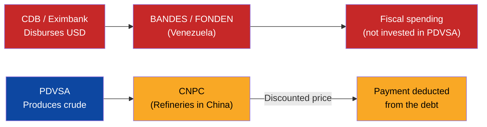
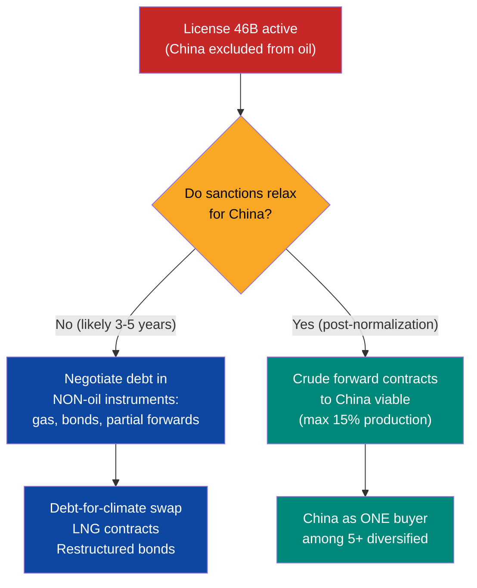
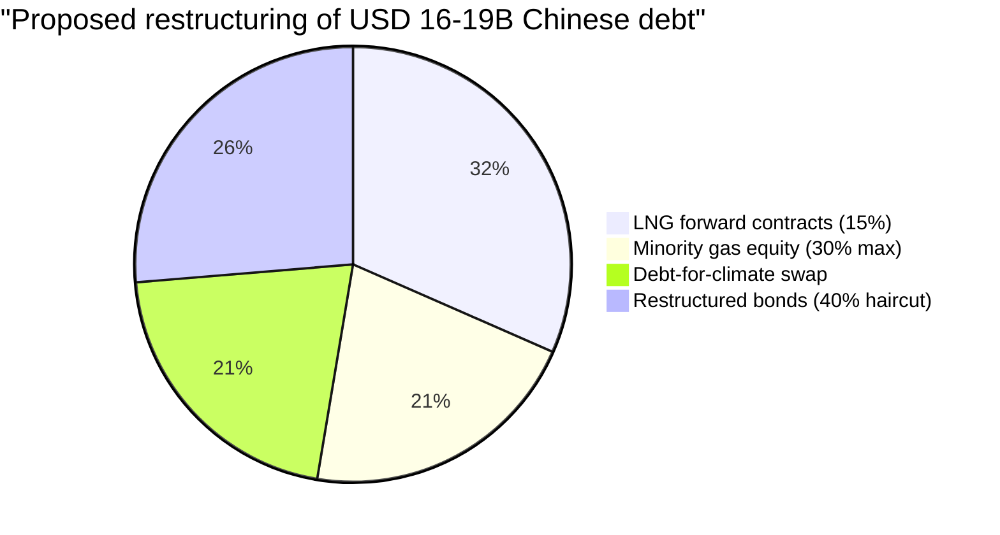
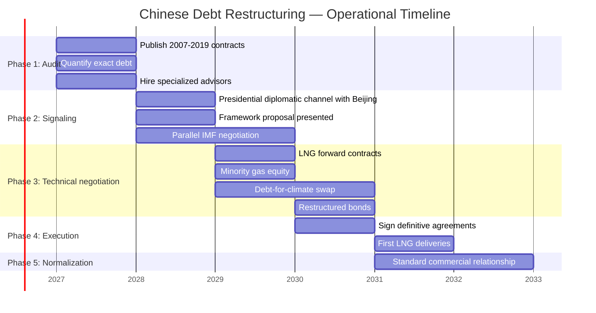

# China Strategy: Restructure USD 19B Without Surrendering Sovereignty

:::tip In a nutshell
Venezuela owes ~USD 19B to China from oil-backed loans. China does not forgive debt — it trades it for resource access. This section defines how to restructure that debt without handing over ports, telecoms, minerals, or sovereignty. The model: convert a dependency relationship into a normal commercial one.
:::

:::caution Illustrative dates — phases are triggered by KPIs, not by calendar
References to "Year X" in this document are **illustrative**. Actual phases are triggered by verifiable conditions (GDP/capita, formalization, poverty). See [Activation KPIs](/07-ejecucion/kpis-activacion).
:::

> China debt is the #1 blind spot in the plan's geopolitics. Previous score: **5/10** (China bilateral negotiator). You cannot restructure USD 150-170B in total debt while ignoring the most strategic and least transparent creditor. This section fixes that.

---

## The Debt: USD 19B in Oil-for-Loans

### Loan structure

China lent a total of **USD 62.3B** to Venezuela since 2007 — the largest amount of Chinese lending to any single country in the world. The primary vehicle was the **China-Venezuela Joint Fund (FCCV)**, operated between the China Development Bank (CDB) and BANDES (Venezuela's Economic and Social Development Bank).

| Creditor | Original amount | Instrument | Collateral | Estimated outstanding (2025) | Source |
|----------|----------------|------------|------------|------------------------------|--------|
| **CDB** (China Development Bank) | ~USD 50B+ (multiple tranches) | Oil-for-loans via FCCV | Crude deliveries to CNPC | **~USD 10-12B** | [AidData](https://www.aiddata.org/publications/banking-on-the-belt-and-road) |
| **China Eximbank** | ~USD 11.9B | Loans for oil operations and JVs | Production from CNPC-PDVSA JVs | **~USD 5-7B** | [AidData](https://china.aiddata.org/projects/39099/) |
| **TOTAL** | **~USD 62.3B disbursed** | — | — | **~USD 16-19B outstanding** | [Transparencia Venezuela](https://transparenciave.org/), [Brookings](https://www.brookings.edu/articles/how-china-lends/) |

:::info Where did the money go?
Of the USD 62.3B disbursed, Venezuela repaid ~USD 43-46B in crude deliveries between 2007 and 2019. Payments were significantly disrupted in 2016 due to PDVSA's production collapse. Since then, the debt has accumulated interest and arrears. The original contracts are **secret** — there is no public disclosure of rates, terms, or exact schedules.
:::

### How oil-for-loans works

**What went wrong:**

| Problem | Consequence | Source |
|---------|------------|--------|
| Single buyer (China received ~85% of crude) | Total dependency, no bargaining power | [Columbia CGEP](https://www.energypolicy.columbia.edu/venezuela-china-oil-ties-severely-impacted-by-us-action/) |
| Secret contracts with no oversight | Impossible to audit terms, rates, discounts | [Brookings](https://www.brookings.edu/articles/how-china-lends/) |
| Money did not go to PDVSA | Production collapsed from 3M to <1M bpd; repayment capacity destroyed | [Rystad Energy] |
| No volume cap or price floor | Venezuela sold crude at a discount with no protection | [AidData](https://www.aiddata.org/blog/how-chinas-oil-backed-lending-in-venezuela-fell-into-distress) |
| CDB classifies itself as "commercial" | Avoids multilateral restructuring frameworks (Paris Club, G20 Common Framework) | [Harvard MRC-BG](https://www.hks.harvard.edu/centers/mrcbg/publications/awp/awp248) |

---

## What China Wants

China is not a philanthropic creditor. It is a strategic creditor. Its objectives are clear and hierarchical:

| Priority | What China wants | Instrument | Flexibility level |
|----------|-----------------|------------|-------------------|
| **1. Oil access** | Secure supply of heavy crude for refineries in China | Deliveries via CNPC, forward contracts | **Medium** — will restructure if access is maintained |
| **2. Critical mineral access** | Coltan, rare earths, gold, bauxite from the [Arco Minero](/10-oportunidades/minerales-criticos) | Mining concessions, JVs | **High** — this is Beijing's new priority |
| **3. Geopolitical foothold** | Presence in the Western Hemisphere, counterweight to the U.S. | Ports, telecoms, logistics bases | **Low** — this is where Venezuela must say NO |
| **4. Capital recovery** | Collect the USD 16-19B outstanding | In-kind repayment, partial haircut | **Medium** — prefers resource access over cash |
| **5. Non-alignment** | That Venezuela is not 100% aligned with the U.S. | Diplomatic pressure, UN votes | **Low** — realistic, not decisive |

:::danger What China does not say but does
China's global pattern is **debt-for-asset**. Sri Lanka surrendered [Hambantota port for 99 years](https://www.nytimes.com/2018/06/25/world/asia/china-sri-lanka-port.html). Zambia delayed its restructuring [3 years](https://www.hks.harvard.edu/centers/mrcbg/publications/awp/awp248) due to CDB resistance. In Congo Brazzaville, negotiations took 2 years for a much smaller amount. China plays the long game — and waits for the debtor's urgency to generate concessions.
:::

---

## What Venezuela Wants

| Priority | What Venezuela wants | Condition | Red line |
|----------|---------------------|-----------|----------|
| **1. Significant haircut** | Reduce USD 16-19B to USD 8-12B (40-50% NPV haircut) | Maturity extension + grace period | Minimum 30% NPV haircut |
| **2. Sovereignty over minerals** | National control of the Arco Minero; China as buyer, not operator | JVs with max 30% Chinese participation in gas; 0% in strategic mining | Zero Chinese equity in strategic mining |
| **3. Geopolitical freedom** | Be a U.S. ally without losing China as a commercial partner | Dual model (see [comparables](#dual-model-how-other-countries-balance-the-us-and-china)) | Not sacrifice the U.S. relationship for China |
| **4. Contractual transparency** | Publish all China-Venezuela contracts | Full audit of 2007-2019 agreements | Zero secret contracts going forward |
| **5. Buyer diversification** | China max 15% of oil exports (vs 85% historically) | Forward contracts with 5+ buyers | Never >20% to a single buyer |

---

## The OFAC Constraint: License 46B and China

:::danger OFAC explicitly prohibits China
[OFAC License 46B](https://www.infobae.com/venezuela/2026/03/14/eeuu-autorizo-a-las-empresas-estadounidenses-realizar-negocios-con-el-sector-petrolero-venezolano/) (March 14, 2026) authorizes all U.S. companies to operate in Venezuela's oil sector **but explicitly excludes transactions involving persons located in China, Russia, Iran, North Korea, or Cuba.** This includes Venezuelan or U.S. entities controlled by Chinese companies.
:::

| Aspect | Impact on the China-Venezuela relationship |
|--------|---------------------------------------------|
| **CNPC/Sinovensa (PDVSA-CNPC JV)** | Operations in a legal gray area — existed pre-46B, but new investments blocked |
| **New oil contracts with China** | **Prohibited** under License 46B while in effect |
| **Crude trade with China** | Only via non-sanctioned routes; risk of secondary sanctions |
| **Mining (Arco Minero)** | License 46B authorizes gold for U.S. companies; China excluded |
| **Forward contracts with Chinese buyers** | Not viable while 46B is active with China restrictions |

**Strategic implication:** Negotiations with China **cannot include oil or gold** while License 46B is in effect with China restrictions. This limits repayment options but also protects Venezuela from handing oil assets to Beijing.

### Negotiation window

---

## Ecuador Precedent: What Worked and What Did Not

Ecuador is the most directly comparable case: oil-dependent country, significant Chinese debt, need for IMF support, democratic government negotiating.

### The data

In 2022, Finance Minister **Simon Cueva** renegotiated ~USD 4.6B in Chinese debt:

| Parameter | Ecuador | Venezuela (proposed) |
|-----------|---------|----------------------|
| **Total Chinese debt** | ~USD 4.6B (CDB + Eximbank) | ~USD 16-19B |
| **Haircut** | 0% (reprofiling, no reduction) | **30-50% NPV** (necessary given the volume) |
| **Mechanism** | Maturity extension (2027 CDB, 2032 Eximbank) | Extension + haircut + partial conversion |
| **Cash flow savings** | USD 1.4B through 2025 | [Requires modeling] |
| **Oil freed** | Yes — Ecuador freed crude from forced sales to China | **Critical** — same objective for Venezuela |
| **IMF support** | Yes — parallel IMF program facilitated negotiations | **Essential** — without the IMF, China does not negotiate |
| **Xi Jinping backing** | Yes — Lasso secured direct support from Xi | [Requires research: diplomatic channel] |
| **Timeline** | ~8 months of active negotiation | **3-5 years** (4x the debt, geopolitical complexity) |

**Sources:** [Bloomberg](https://www.bloomberg.com/news/articles/2022-02-11/warm-china-and-imf-relations-reward-ecuador-finance-chief-says), [Euronews](https://www.euronews.com/2022/09/21/ecuador-debt-china), [Ecuador Min. Finance](https://www.finanzas.gob.ec/wp-content/uploads/downloads/2022/09/REPROFILING-AGREEMENTS-CHINA.pdf)

### What worked in Ecuador

1. **Simultaneous IMF + China negotiation.** Cueva used the IMF program as a credibility signal for Beijing. China negotiated because Ecuador had a credible repayment plan.
2. **Direct presidential backing.** Lasso spoke with Xi. CDB decisions respond to the political logic of China's Ministry of Finance, not just financial logic.
3. **"Warm" relations with both sides.** Cueva stated that Ecuador maintained positive relations with China AND with the IMF/U.S. simultaneously.
4. **Oil liberation.** The main achievement was not cash savings — it was freeing Ecuadorian crude from forced discounted sales.

### What is different for Venezuela

| Factor | Ecuador | Venezuela | Implication |
|--------|---------|-----------|-------------|
| **Amount** | USD 4.6B | USD 16-19B | 4x more complex; China has more at stake and more resistance |
| **OFAC** | No sanctions | License 46B restricts China | Venezuela cannot offer oil to China under the current regime |
| **U.S. relationship** | Normal | U.S. controls oil sales | Any deal with China requires Washington's OK |
| **General default** | No | Default since 2017 on all debt | China negotiates differently when the debtor is in total default |
| **Minerals** | Not relevant | Arco Minero with coltan, rare earths, gold | China has additional incentive to negotiate — it wants minerals |
| **Government** | Established democracy | Post-intervention transition | Legitimacy of the counterpart is more fragile |

---

## Negotiation Framework

### Guiding principle: China as commercial partner, not dominant creditor

The strategy can be summarized in one sentence: **convert debt into a diversified commercial relationship, with caps, transparency, and no strategic assets as collateral.**

### Instrument 1: Natural Gas Forward Contracts (Not Oil)

While OFAC restricts Chinese operations in Venezuelan oil, natural gas is the most viable repayment instrument.

| Parameter | Proposal |
|-----------|----------|
| **Instrument** | LNG (liquefied natural gas) forward contracts |
| **Volume** | Max 15% of projected gas production |
| **Price** | Indexed to Henry Hub + premium, floor USD 3/MMBtu |
| **Term** | 10-15 years |
| **Estimated value** | USD 5-8B in present value [Requires modeling with gas projections] |
| **Advantage** | Gas is NOT under OFAC restrictions equivalent to oil; China needs LNG |

### Instrument 2: Minority Equity in Gas Projects

| Parameter | Proposal |
|-----------|----------|
| **Permitted sectors** | Natural gas upstream and midstream **ONLY** |
| **Maximum participation** | **30%** — Venezuela S.A. retains majority control |
| **Operator** | International company (non-Chinese) as technical operator |
| **Governance** | Board with proportional representation, Big Four audit |
| **Estimated value** | USD 3-5B in equity in exchange for debt reduction |

### Instrument 3: Debt-for-Climate Swap

An innovative model that reframes debt as green investment. Recent precedents:

| Country | Year | Amount | Mechanism | Source |
|---------|------|--------|-----------|--------|
| **Ecuador** | 2023 | USD 1.6B | Blue bonds + IDB guarantee + DFC insurance | [WEF](https://www.weforum.org/stories/2024/04/climate-finance-debt-nature-swap/) |
| **El Salvador** | 2024 | USD 1.0B | Debt-for-nature swap | [Brookings](https://www.brookings.edu/articles/debt-for-adaptation-swaps-a-financial-tool-to-help-climate-vulnerable-nations/) |
| **Gabon** | 2023 | USD 500M | Blue bonds | [WEF](https://www.weforum.org/stories/2024/04/climate-finance-debt-nature-swap/) |

**Proposal for Venezuela:**

| Parameter | Detail |
|-----------|--------|
| **Amount to convert** | USD 3-5B of Chinese debt |
| **Environmental commitment** | Arco Minero protection: mining formalization, reforestation, illegal mining reduction |
| **Guarantee** | IDB or CAF as guarantor; UNDP audit |
| **Benefit for China** | Improves its global image ("green lender"), positive precedent for BRI |
| **Benefit for Venezuela** | Reduces debt + finances Arco Minero environmental remediation |

:::info Would China accept?
UNDP published a [2025 study on debt-for-development swaps for Chinese institutions](https://www.undp.org/sites/g/files/zskgke326/files/2025-06/the_business_case_for_debt-for-development_swaps_for_chinese_institutions.pdf) arguing there is a business case for Chinese participation. There is no executed precedent with China yet, but international pressure and BRI's deteriorating image create incentive. Marked as **[Requires diplomatic validation]**.
:::

### Instrument 4: Restructured Bonds

| Parameter | Proposal |
|-----------|----------|
| **Haircut** | 40% of face value |
| **New bond** | 15-year maturity, 5-year grace period |
| **Coupon** | 3.5-4.5% (benchmarked to Ecuador 2020) |
| **Governing law** | New York law (not Chinese law) |
| **Amount covered** | USD 5-8B of residual balance post-forwards and swaps |

### Proposal summary

---

## Red Lines: What Is NOT Negotiable

:::danger Assets that are NEVER surrendered to China
These assets are sovereignty. They are non-negotiable under any restructuring scenario.
:::

| Asset | Why it is a red line | Negative precedent | Alternative |
|-------|---------------------|--------------------|-------------|
| **Ports** | Logistics control = commercial control | [Sri Lanka — Hambantota 99 years](https://www.nytimes.com/2018/06/25/world/asia/china-sri-lanka-port.html) | Concession to international operators (DP World, PSA, non-Chinese Hutchison) |
| **Telecoms / 5G** | National intelligence infrastructure | Huawei banned in Five Eyes, EU, India | Ericsson, Nokia, Samsung — Estonia model |
| **Majority control in any sector** | Economic sovereignty | CNPC controlled 85% of crude exports | Max 30% in gas; 0% in oil, mining, energy |
| **Agricultural land** | Food sovereignty | Restrictions in Australia, Canada, U.S. | Purchase of agricultural commodities, not land |
| **Energy infrastructure** | Dams, grids, pipelines | BRI model: build-own-operate | Build-transfer or temporary concession with reversion |
| **Arco Minero (operations)** | Critical minerals = 21st century national security | [CSIS: Venezuela as critical minerals target](https://www.csis.org/analysis/venezuela-critical-minerals-target) | China as buyer of processed minerals, not as extractive operator |

---

## Realistic Timeline: 3-5 Years

:::caution Not 1-3 years. It is 3-5 years.
The [debt section](/02-motor-financiero/deuda) assumed "Bilateral China resolution: Year 1-3." This is unrealistic. Zambia took [4 years](https://www.hks.harvard.edu/centers/mrcbg/publications/awp/awp248) to restructure with China. Congo Brazzaville took 2 years for a smaller amount. Venezuela has 4x Ecuador's debt and OFAC restrictions. **3-5 years is the correct timeline.**
:::

| Phase | Period | Action | Precondition | Deliverable |
|-------|--------|--------|-------------|-------------|
| **1. Audit and transparency** | Year 0-1 | Publish ALL China-Venezuela contracts 2007-2019. Quantify exact debt with interest. Hire advisors (Margaret Myers, Kevin Gallagher, China-specialist firm) | Transition government + restructuring mandate | Public report on Chinese debt: exact amount, conditions, collateral |
| **2. Signaling** | Year 1-2 | Diplomatic channel with Beijing (presidential level). Present framework proposal. Start IMF negotiations in parallel | Audit completed + IMF program underway | Memorandum of Understanding (MoU) with China |
| **3. Technical negotiation** | Year 2-3 | Negotiate instrument by instrument (forwards, equity, swaps, bonds). CDB and Eximbank separately | MoU signed + gas forward contracts designed | Heads of Terms for each instrument |
| **4. Execution** | Year 3-4 | Sign definitive agreements. Begin LNG deliveries. Issue restructured bonds. Execute debt-for-climate swap | Heads of Terms agreed + legal framework approved | Binding contracts executed |
| **5. Normalization** | Year 4-5 | Transition to standard commercial relationship. China as one buyer among 5+. Compliance monitoring | Agreements executed + first delivery cycle completed | Normalized bilateral relationship |

---

## Risks and Mitigation

| Risk | Probability | Impact | Mitigation |
|------|------------|--------|------------|
| **China blocks restructuring** — CDB refuses to negotiate, demands full repayment in crude | Medium-High | Critical | Negotiate CDB and Eximbank separately (Eximbank is more flexible). Use IMF program as leverage. Escalate to presidential level (Ecuador/Lasso-Xi model) |
| **China demands strategic assets** — ports, telecoms, Arco Minero as collateral | Medium | Critical | Red lines are public and non-negotiable. Offer alternatives (gas, bonds, climate swaps). Legal firewall modeled on CFIUS |
| **China dumps Venezuelan bonds** — sells positions on secondary market to pressure | Low | Medium | Bonds already trade at 27-32 cents; little room for additional pressure. Coordination with other creditors via CACs |
| **U.S. blocks any deal with China** — OFAC does not relax restrictions | Medium | High | Design instruments that do not require lifting 46B (gas, bonds, climate swaps). Consult with OFAC/Treasury before proposing |
| **China retaliates diplomatically** — blocks Venezuela at the UN, withdraws ambassador | Low | Low | China prioritizes resource access over diplomatic gestures. A Venezuela that pays (even less) is better than one in total default |
| **Timeline extends to 7+ years** — negotiations stall as in Zambia | Medium | High | Binding deadlines in MoU. Automatic escalation mechanism (ICC arbitration if no agreement within 5 years) |
| **China uses Arco Minero as leverage** — conditions restructuring on mineral access | High | High | Separate debt negotiation from mineral negotiation. Minerals are competitively tendered (China can bid but gets no preferential treatment) |

:::danger The pessimistic scenario
If China blocks restructuring and Venezuela cannot pay, the debt becomes a perpetual liability that prevents return to international markets. The cost of NOT negotiating is greater than the cost of any reasonable concession. That is why the plan proposes real concessions (gas, minority equity, climate swaps) — not an ideological confrontation.
:::

---

## Dual Model: How Other Countries Balance the U.S. and China

Venezuela is not the first country that needs to maintain productive relationships with both superpowers. There are functional models:

| Country | Relationship with U.S. | Relationship with China | Balancing mechanism | Lesson for Venezuela | Source |
|---------|----------------------|------------------------|--------------------|--------------------|--------|
| **Singapore** | Security ally, naval base, USD financial hub | Largest trading partner, massive bilateral investment | Strategic neutrality + clear sector-specific rules (no Huawei in 5G, yes to port investment) | **The ideal model.** Clear rules, not ideology. Each sector has its own logic | [CSIS](https://www.csis.org/analysis/china-and-middle-east) |
| **UAE** | Military base at Al Dhafra, F-35 purchase (under negotiation), counterterrorism ally | Largest non-oil trading partner, Huawei in 5G (partial), BRI investment | "Active neutrality" — [63% prefer non-alignment](https://www.wilsoncenter.org/article/americas-key-gulf-arab-partners-embrace-non-alignment-tilt-toward-china) | Balance by volume: U.S. = security, China = trade. But Huawei created friction with Washington — Venezuela must avoid that mistake | [Wilson Center](https://www.wilsoncenter.org/article/americas-key-gulf-arab-partners-embrace-non-alignment-tilt-toward-china) |
| **Saudi Arabia** | Security guarantor, arms buyer, petrodollars | Largest Saudi crude buyer, Vision 2030 investment, Iran mediation deal | Strategic hedging: security with U.S., trade with China, independent diplomacy | Saudis demonstrate that you can sell crude to China AND be a U.S. ally — but post-intervention Venezuela has less room than Riyadh | [ECFR](https://ecfr.eu/publication/east-meets-middle-chinas-blossoming-relationship-with-saudi-arabia-and-the-uae/) |
| **Chile** | Active FTA, Pacific ally, U.S. mining investment | Largest trading partner, #1 copper buyer, lithium investment | Sector-specific investment rules + buyer diversification | Chile sells copper to China and lithium to the U.S. without conflict. Venezuela can do the same with gas to China and oil to the U.S. | [Requires research] |
| **Brazil** | Trade ally, Alcantara base, U.S. agro investment | Largest trading partner (USD 150B+), 5G investment (partial), BRICS | Economic pragmatism + formal non-alignment | Brazil proves that LATAM can have productive relationships with both. But Venezuela has OFAC restrictions that Brazil does not | [Requires research] |

### The principle: segment by sector

```mermaid
flowchart TD
    A["Relationship with U.S."] --> B["Oil (100%)"]
    A --> C["Security + Intelligence"]
    A --> D["Tech / Data Centers / 5G"]
    A --> E["Financial system"]

    F["Relationship with China"] --> G["Natural gas (max 15%)"]
    F --> H["Purchase of processed minerals"]
    F --> I["Consumer goods / manufacturing"]
    F --> J["Debt-for-climate swaps"]

    K["Neutral / Competitive"] --> L["Infrastructure (open tender)"]
    K --> M["Tourism"]
    K --> N["Export agriculture"]

    style A fill:#0D47A1,color:#fff
    style B fill:#0D47A1,color:#fff
    style C fill:#0D47A1,color:#fff
    style D fill:#0D47A1,color:#fff
    style E fill:#0D47A1,color:#fff
    style F fill:#C62828,color:#fff
    style G fill:#C62828,color:#fff
    style H fill:#C62828,color:#fff
    style I fill:#C62828,color:#fff
    style J fill:#C62828,color:#fff
    style K fill:#00897B,color:#fff
    style L fill:#00897B,color:#fff
    style M fill:#00897B,color:#fff
    style N fill:#00897B,color:#fff
```

**Rule: The U.S. is the security and energy ally. China is a normal commercial partner. Sectors are segmented. They do not mix.**

---

## Negotiating Team: China Bilateral Negotiator Profile

The [executive team](/07-ejecucion/equipo-ejecutor) defines the China Bilateral Negotiator role. These are the most relevant reference profiles:

| Profile | Achievement | Direct relevance |
|---------|------------|-----------------|
| **Margaret Myers** — Director, [Asia & Latin America Program, Inter-American Dialogue](https://thedialogue.org/expert/margaret-myers) | Created the China-LATAM database. Testified before U.S. Congress | The leading Western expert on China-LATAM finance |
| **Kevin Gallagher** — Director, [BU Global Development Policy Center](https://www.bu.edu/gdp/profile/kevin-p-gallagher/) | Co-created the China-LATAM finance database. G20 Brazil advisor | Understands the financial architecture of Chinese loans |
| **Rebecca Ray** — Senior Researcher, [BU GDP Center](https://www.bu.edu/gdp/profile/rebecca-ray/) | Leads China-LAC Economic Bulletin. Expertise in debt-for-climate swaps | Tracking of Chinese development finance + green swaps |
| **Simon Cueva** — Former Finance Minister, Ecuador | Renegotiated ~USD 4.6B of Chinese debt in 2022 | **Direct experience** negotiating with CDB/Eximbank |

**Additional negotiator requirements:**
- Professional Mandarin (or team with bilingual capability)
- Direct experience with CDB or Eximbank (banker, advisor, or counterpart)
- Knowledge of BRI (Belt and Road Initiative) and its contractual patterns
- Independence from any government (neither pro-Beijing nor anti-Beijing — pragmatic)

---

## Connection to the Plan

| Plan section | Dependency on the China strategy |
|-------------|----------------------------------|
| [Debt](/02-motor-financiero/deuda) | USD 16-19B out of the total USD 150-170B debt. Without resolving China, the overall restructuring stalls. [RAND warns about this](https://www.rand.org/pubs/commentary/2026/01/china-could-play-spoiler-in-venezuelas-debt-restructuring.html) |
| [Geopolitics](/04-gobernanza/geopolitica) | China is the geopolitical counterweight to U.S. dependency. A poorly managed relationship = existential risk |
| [Forward contracts](/02-motor-financiero/contratos-forward) | The original mistake was a single buyer (China at 85%). The new forwards fix this: max 15% per buyer |
| [Sanctions roadmap](/04-gobernanza/roadmap-sanciones) | License 46B excludes China. Every China strategy must be OFAC-compliant |
| [Executive team](/07-ejecucion/equipo-ejecutor) | China bilateral negotiator is role #3 on the restructuring team |
| [Venezuela S.A. Investment Fund](/02-motor-financiero/fondo-soberano) | Reducing Chinese debt = more income to the fund. Every USD 1B haircut = ~USD 50M/year in saved debt service |
| [Critical minerals](/10-oportunidades/minerales-criticos) | China wants access to the Arco Minero. The strategy: sell processed minerals, not extractive concessions |
| [Cuba: Disconnection](/04-gobernanza/cuba-desconexion) | Cuba seeks China as an alternative patron post-Venezuela. Negotiations with China must anticipate this factor |

---

## Executive Summary for the Board

| Question | Answer |
|----------|--------|
| **How much do we owe?** | ~USD 16-19B (of USD 62.3B originally, ~USD 43-46B repaid in crude) |
| **To whom?** | CDB (~USD 10-12B) + Eximbank (~USD 5-7B) |
| **What does China want?** | Resource access (oil, gas, minerals) > collecting cash |
| **What can we offer?** | Gas (forward + 30% equity), restructured bonds, climate swaps. NOT oil (OFAC), NOT ports, NOT telecoms, NOT minerals |
| **How long does it take?** | 3-5 years (not 1-3 as previously assumed) |
| **What is the haircut target?** | 30-50% total NPV (mix of instruments) |
| **Is Ecuador replicable?** | Partially. Same mechanism, but 4x the debt and OFAC restrictions |
| **What if China says no?** | The debt becomes a perpetual liability. But China loses access to gas and minerals. Both lose — that is why they negotiate |
| **Who negotiates?** | Specialized team: Myers/Gallagher/Ray (advisors) + negotiator with CDB experience + law firm (Cleary Gottlieb or White & Case) |

---

**Primary sources:**
- [AidData — Banking on the Belt and Road (2021)](https://www.aiddata.org/publications/banking-on-the-belt-and-road)
- [Brookings — How China Lends (2023)](https://www.brookings.edu/articles/how-china-lends/)
- [RAND — China Could Play Spoiler (2026)](https://www.rand.org/pubs/commentary/2026/01/china-could-play-spoiler-in-venezuelas-debt-restructuring.html)
- [Columbia CGEP — Venezuela-China Oil Ties (2025)](https://www.energypolicy.columbia.edu/venezuela-china-oil-ties-severely-impacted-by-us-action/)
- [Harvard MRC-BG — Sovereign Debt Restructuring with China (2024)](https://www.hks.harvard.edu/centers/mrcbg/publications/awp/awp248)
- [Transparencia Venezuela — China-Venezuela Relations (2025)](https://transparenciave.org/wp-content/uploads/2025/03/China-Venezuela-Relations.-Financial-economic-and-production-management.-Transparencia-Venezuela-en-el-exilio.pdf)
- [CSIS — Is Venezuela a Critical Minerals Target? (2025)](https://www.csis.org/analysis/venezuela-critical-minerals-target)
- [UNDP — Debt-for-Development Swaps for Chinese Institutions (2025)](https://www.undp.org/sites/g/files/zskgke326/files/2025-06/the_business_case_for_debt-for-development_swaps_for_chinese_institutions.pdf)
- [Ecuador Min. Finance — Reprofiling Agreements China (2022)](https://www.finanzas.gob.ec/wp-content/uploads/downloads/2022/09/REPROFILING-AGREEMENTS-CHINA.pdf)
- [Wilson Center — Gulf Arab Partners Non-Alignment (2024)](https://www.wilsoncenter.org/article/americas-key-gulf-arab-partners-embrace-non-alignment-tilt-toward-china)
