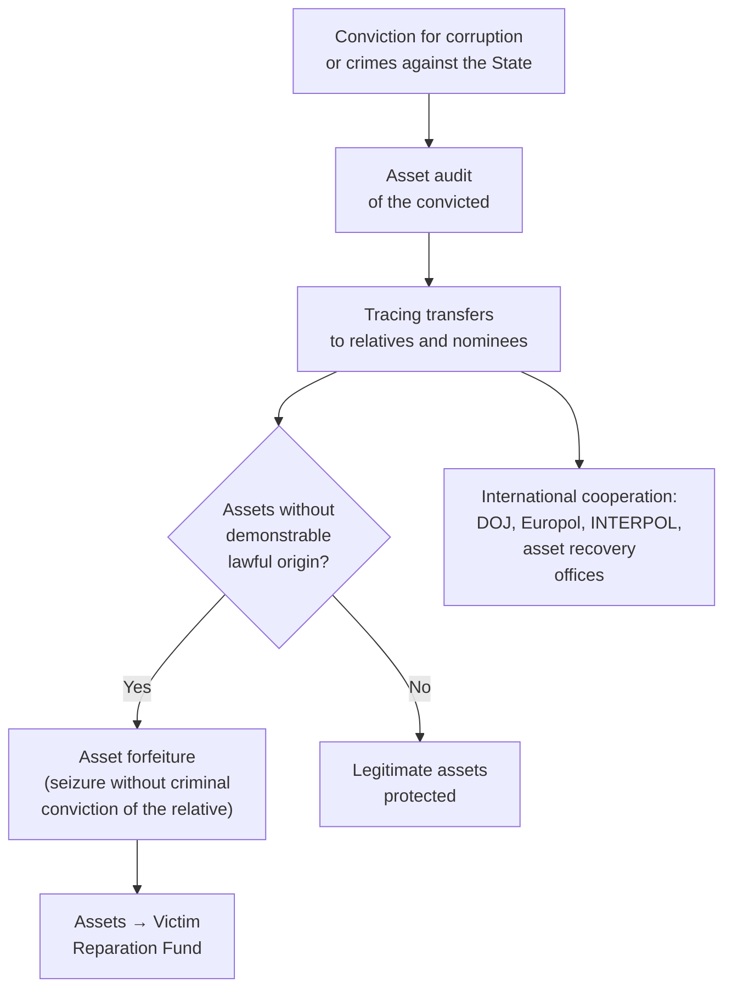
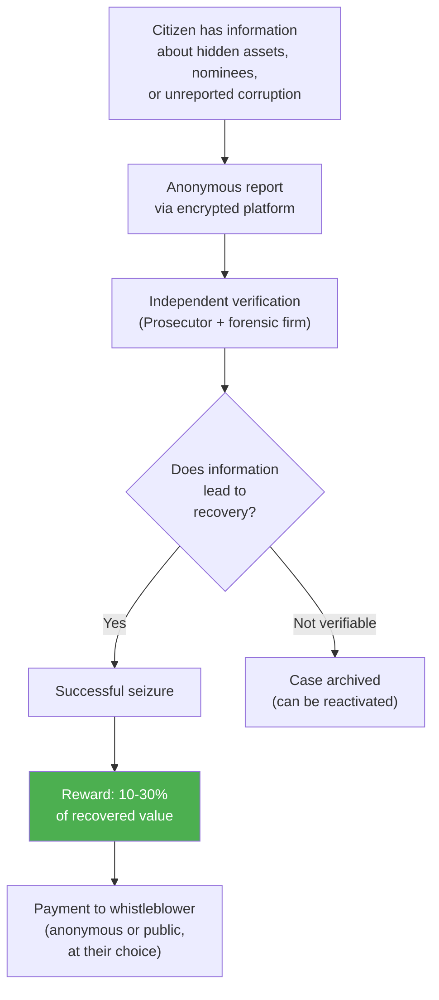
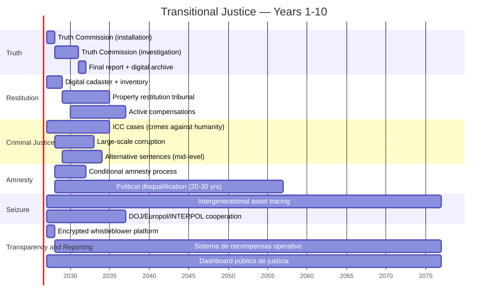

# Transitional Justice: The Dilemma No One Wants to Address

:::tip In a nutshell
What happens to those who stole, tortured, and destroyed the country? Transitional justice is the process of holding people accountable without revenge — so the country can turn the page and rebuild.
:::

> How do you build a rule of law when those who must build it were part of the problem? How do you deliver justice without blocking the transition?

:::caution The dilemma
**Full justice** (prosecute everyone) -> regime actors block the transition because they have nothing to gain.

**Total impunity** (forgive everyone) -> no rule of law, no trust, no investment.

**The answer lies in the middle**, and every country that has transitioned has found its own point of balance.
:::

---

## Inventory of Moral Debt

| Category | Scale | Source |
|----------|-------|--------|
| **Political prisoners** | 1,900+ detained since Jul. 2024 | [Foro Penal, Feb. 2025](https://foropenal.com/) |
| **Extrajudicial executions** | 19,000+ between 2016-2019 (FAES and others) | [OHCHR/Bachelet, Jul. 2019](https://www.ohchr.org/en/hr-bodies/hrc/co-i-venezuela/co-i-venezuela) |
| **Expropriations** | 1,500+ companies expropriated without fair compensation (2005-2015) | [CONINDUSTRIA](https://www.conindustria.org/) |
| **Forcibly displaced** | 7.9M emigrants (many due to persecution or induced collapse) | [UNHCR, Dec. 2025](https://www.unhcr.org/) |
| **Torture and cruel treatment** | Systematically documented by OHCHR, ICC, Foro Penal | [ICC Venezuela situation](https://www.icc-cpi.int/venezuela) |
| **Massive corruption** | USD 300,000+ M diverted (FONDEN + PDVSA + social programs) | [Transparencia Venezuela](https://transparenciave.org/) |
| **Institutional destruction** | Judiciary, electoral body, armed forces co-opted | [V-Dem Institute, 2024](https://www.v-dem.net/) |

---

## 5 International Models

| Country | Mechanism | Strength | Weakness | Result |
|---------|-----------|----------|----------|--------|
| **South Africa** (1994) | Truth and Reconciliation Commission (TRC): amnesty in exchange for full truth | Peaceful transition, historical documentation | Victims without economic reparation; inequality persisted | Stable democracy but extreme inequality ([TRC Report](https://www.justice.gov.za/trc/)) |
| **Colombia** (2016) | JEP (Special Jurisdiction for Peace): restorative justice + alternative sentences | Sophisticated legal framework; combines truth, justice, and reparation | Slow (8 years, first sentences in 2024); dissidents | Violence reduction but incomplete implementation ([JEP](https://www.jep.gov.co/)) |
| **Argentina** (1983) | Trials of military juntas + CONADEP + Nunca Mas | Set global precedent for accountability | 10 years of amnesties (1986-2003) before reopening trials | Delayed but effective justice; model for the region ([CONADEP](https://www.argentina.gob.ar/derechoshumanos/conadep)) |
| **Rwanda** (1994) | Gacaca courts (community-based) + international ICTR | Processed 1.9M cases in a decade | Victor's justice; authoritarian post-genocide government | Stability but without full democracy ([ICTR](https://unictr.irmct.org/)) |
| **Spain** (1975) | Pact of Forgetting: total amnesty, no truth commission | Fast and peaceful transition | Franco-era victims without justice for 45+ years | Consolidated democracy but open wounds ([Historical Memory Law, 2007](https://www.boe.es/)) |

---

## Hybrid Proposal: 4 Pillars

### Pillar 1: Truth and Memory Commission

| Dimension | Proposal |
|-----------|----------|
| Duration | 3 years (renewable once) |
| Composition | 7 commissioners: 2 international + 2 victims + 2 academics + 1 mediator |
| Mandate | Document human rights violations, corruption, and institutional destruction (2000-2025) |
| Power | Summon witnesses, access archives, witness protection |
| Output | Public report + accessible digital archive + binding recommendations |
| Model | South Africa TRC + Colombia Truth Commission |
| Estimated cost | USD 50-100M |

### Pillar 2: Property Restitution

| Type | Estimated Scale | Mechanism |
|------|----------------|-----------|
| Expropriated companies | 1,500+ companies | Return or compensation at fair market value (pre-expropriation) |
| Confiscated land | [Requires research] | Specialized court + digital cadaster |
| Personal homes/assets | [Requires research] | Simplified process with arbitration |
| PDVSA transferred assets | [Requires research] | International forensic audit |

**Estimated cost:** USD 5-15B over 10 years [Requires detailed research]

**Precedent:** Reunified Germany (1990) processed 2.5M property claims in 15 years ([Bundesamt fur zentrale Dienste und offene Vermogensfragen](https://www.badv.bund.de/)).

### Pillar 3: Selective Criminal Justice

Not everyone can be prosecuted. But the most serious crimes cannot go unpunished.

| Category | Treatment | Political Disqualification | Justification |
|----------|----------|---------------------------|---------------|
| **Crimes against humanity** (executions, systematic torture) | Full criminal prosecution — no amnesty | **Permanent** | Obligation under the Rome Statute; [ICC is already investigating](https://www.icc-cpi.int/venezuela). Whoever ordered killings cannot govern again. |
| **Large-scale corruption** (>USD 10M) | Prosecution + asset seizure + disqualification | **Permanent** | Asset recovery to fund reparations. USD 300B+ diverted is not forgiven with 10 years of waiting. |
| **Serious HR violations** (mid-level command) | Reduced sentences in exchange for full truth and cooperation | **25-30 years** | Colombia JEP model: 5-8 years of alternative sentences, but extended disqualification |
| **Minor officials with direct participation** | Truth Commission + public office ban | **15-20 years** | No prison sentence, but barred from public service for a generation |
| **Ordinary citizens** | No prosecution | — | Do not criminalize the population |

### Pillar 4: Conditional Amnesty

| Condition | Requirement |
|-----------|------------|
| Full truth | Complete declaration before the Truth Commission |
| No crimes against humanity | Absolute exclusion for torture, execution, disappearance |
| Symbolic reparation | Public acknowledgment + request for forgiveness |
| Cooperation in asset recovery | Identify and facilitate return of diverted funds |
| Political disqualification | **20-30 years** without public office (proportional to severity) |
| Intergenerational asset tracing | Unjustified assets in children, grandchildren, and great-grandchildren can be seized (see below) |

### Intergenerational Asset Tracing

:::danger Stolen assets do not become clean with time
USD 300,000+ M diverted did not disappear — they became properties in Madrid, Miami, Panama, Dubai. In accounts in Switzerland, Andorra, Cayman Islands. In companies under the names of children, nephews, nominees. **If asset seizure only reaches the official, 90% of what was stolen remains intact in the next generation.**
:::

| Scope | Mechanism | Precedent |
|-------|-----------|-----------|
| **Direct official** | Total seizure of unjustified assets | International standard |
| **Children** (1st generation) | Reversal of burden of proof: if they cannot demonstrate lawful origin, assets are seized | [Asset Forfeiture Law, Colombia](https://www.funcionpublica.gov.co/) |
| **Grandchildren** (2nd generation) | Tracing of transferred assets; seizure if nexus with illicit funds | [UK Unexplained Wealth Orders](https://www.legislation.gov.uk/ukpga/2017/22/part/1) |
| **Great-grandchildren** (3rd generation) | Active tracing for 50 years from sentencing; seizure of identified assets | [France: prescription period for receiving stolen goods, 30 years](https://www.legifrance.gouv.fr/) — extended to 50 |
| **Nominees and intermediaries** | Same rules as the direct official. Being a nominee is a standalone crime (10-15 years) | [OFAC SDN List](https://www.treasury.gov/ofac) |
| **Associates and partners under investigation** | Tracing of transfers and assets; seizure if demonstrable nexus with illicit funds. Reversal of burden of proof if there is a pattern of unexplained enrichment | [RICO Act, U.S.](https://www.law.cornell.edu/uscode/text/18/part-I/chapter-96) — pursues networks, not just individuals |

**Operational mechanism:**

**Key principles:**
- **Reversal of burden of proof** for assets of relatives and associates of convicted individuals: the possessor must demonstrate lawful origin, not the State demonstrate illicit origin. Model: [Colombia Law 1708 of 2014](https://www.funcionpublica.gov.co/).
- **Asset forfeiture is an in rem action, not criminal**: the asset is pursued, not the person. Children/grandchildren do not go to prison — but they lose assets they cannot justify.
- **Statute of limitations: 50 years** from sentencing. Venezuelan corruption assets do not expire in one generation.
- **Mandatory international cooperation**: bilateral treaties with the U.S., Spain, Panama, Portugal, Italy (countries where the Chavista elite diaspora concentrates assets).
- **Complete network, not just individuals**: the network is pursued (model [RICO Act](https://www.law.cornell.edu/uscode/text/18/part-I/chapter-96)), not just the official.

### Special Regime for Nominees

:::danger The nominee is the link that protects the corrupt
In Venezuela, most assets of corrupt officials are in the names of third parties: relatives, childhood friends, business partners, lawyers, and even domestic employees. Without targeting the nominee, asset seizure is useless.
:::

| Aspect | Rule |
|--------|------|
| **Definition** | Person who owns, manages, or controls assets on behalf of a public official or person under corruption investigation |
| **Standalone crime** | Being a nominee is an independent crime: **10-20 years** in prison + total seizure of linked assets |
| **Disqualification** | **Permanent** from public office and state contracting |
| **Reversal of burden** | If relationship with the investigated person + unexplained enrichment is demonstrated -> the nominee must prove lawful origin |
| **Effective cooperation** | Sentence reduction (50%) if the nominee cooperates fully: identifies assets, accounts, structures, and other nominees |
| **Witness protection** | Protection program for cooperating nominees (model [US Witness Protection, USMS](https://www.usmarshals.gov/)) |
| **No statute of limitations** | The crime of acting as a nominee does not expire while the assets remain hidden |

**Automatic red flags:**
- Person with no significant income history owning high-value properties
- Frequent transfers between the person and a public official or investigated individual
- Multiple properties/companies registered in short periods
- Person named in companies linked to public procurement with no prior business experience
- Travel/residence patterns coinciding with investigated officials

### Pillar 5: Full Transparency + Whistleblower Rewards

:::tip Citizen whistleblowing is the most powerful weapon against impunity
The State cannot find USD 300B+ in hidden assets alone. But 40 million Venezuelans + 7.9 million diaspora can. Whoever lives in Miami knows who has the penthouse. Whoever worked at PDVSA knows who signed. Whoever was a nominee knows where the accounts are. **That information must be turned into justice — and whoever provides it must be rewarded.**
:::

#### Public Transitional Justice Dashboard

The entire process is public and searchable in real time:

| Public Data | Detail | Access |
|------------|--------|--------|
| **List of investigated individuals** | Name, position, period, charges | Any citizen |
| **Identified assets** | Properties, accounts, seized companies — with photos, location, value | Any citizen |
| **Status of each case** | Investigation -> indictment -> trial -> sentencing -> seizure -> asset destination | Any citizen |
| **Identified nominees** | Name, relationship with investigated individual, assets under tracing | Any citizen |
| **Recovered funds** | Total amount recovered, breakdown by case, destination (Reparation Fund) | Any citizen |
| **Rewards paid** | Total amount paid to whistleblowers (without identifying the whistleblower) | Any citizen |
| **Sentences** | Full text of each sentence, penalties imposed, disqualifications | Any citizen |

**Model:** [ASSET Recovery Watch (Stolen Asset Recovery Initiative, World Bank/UNODC)](https://star.worldbank.org/) + [US DOJ Kleptocracy Asset Recovery Initiative](https://www.justice.gov/criminal/criminal-mlars)

#### Whistleblower Reward System

| Type of Report | Reward | Maximum Cap | Condition |
|---------------|--------|-------------|-----------|
| **Hidden assets abroad** (accounts, properties, companies) | **15-30%** of recovered value | USD 50M per case | Information must be original and directly lead to seizure |
| **Nominee identification** | **10-20%** of the nominee's asset value | USD 20M per case | Must include evidence of the relationship (documents, transfers, testimony) |
| **Active unreported corruption** | **10-15%** of the patrimonial damage avoided or recovered | USD 30M per case | Applicable to ongoing or recent schemes (<5 years) |
| **Laundering network** (complete structure) | **20-30%** of the total network value | USD 100M per case | Must dismantle the structure, not just identify one node |
| **Documentation of HR crimes** | **Fixed reward** USD 10,000-100,000 | — | Evidence leading to successful criminal prosecution |

**Reference:** [SEC Whistleblower Program](https://www.sec.gov/whistleblower): has paid **USD 2.2B+ in rewards** since 2012, recovering **USD 7B+** for the State. ROI: 3-4x. The most successful asset recovery program in the world through citizen whistleblowing.

#### Whistleblower Protections

| Protection | Mechanism |
|-----------|-----------|
| **Guaranteed anonymity** | End-to-end encrypted platform; identity protected by law even against court orders (model [EU Whistleblower Directive 2019/1937](https://eur-lex.europa.eu/legal-content/EN/TXT/?uri=celex%3A32019L1937)) |
| **Anti-retaliation** | Firing, threatening, or persecuting a whistleblower = standalone crime (5-10 years). Reversed burden of proof: the employer must prove the dismissal was not due to the report |
| **Physical protection** | Witness protection program for high-risk cases (model [USMS](https://www.usmarshals.gov/)) |
| **Relocation** | National or international relocation assistance if verified threat exists |
| **Partial immunity** | Whistleblowers who participated in the scheme but cooperate fully can receive immunity or sentence reduction (effective cooperation model) |
| **Free legal access** | Pro bono legal representation for low-income whistleblowers |

#### Reporting Channels

| Channel | Access | Purpose |
|---------|--------|---------|
| **Encrypted digital platform** | Web + app + Tor | Anonymous reports with document upload |
| **International phone line** | Toll-free from 30+ countries | Diaspora whistleblowers |
| **Physical offices** | In every state + 5 foreign cities (Miami, Madrid, Bogota, Lima, Santiago) | Reports with physical documentation |
| **Embassies and consulates** | After foreign service reform | Venezuelans in any country |
| **Allied NGOs** | Transparencia Venezuela, Foro Penal, PROVEA | Safe channeling of reports |

:::info Aligned incentive: the citizen wins when the corrupt loses
This system turns every Venezuelan into an auditor. If someone knows that former official X has a mansion in Panama under their brother-in-law's name, they can report it and earn 15-30% of the recovered value. That could be USD 100,000-500,000 for a Venezuelan family. **The economic incentive makes whistleblowing rational, not just moral.**
:::

---

## Funding

| Source | Estimated Amount | Mechanism |
|--------|-----------------|-----------|
| Recovery of diverted assets | USD 5-20B (of USD 300B+ diverted) | DOJ/EU cooperation + forensic firms + **citizen reports with rewards** |
| International cooperation | USD 500M-1B | UN, EU, U.S. (Colombia precedent: USD 1.2B in transitional justice) |
| National budget | USD 100-200M/year | 0.1-0.2% of GDP |
| Sovereign Fund (returns) | USD 200-500M/year (year 5+) | Specific allocation for reparations |
| Whistleblower rewards | USD 500M-3B (10-30% of amount recovered via reporting) | Self-funded: paid from recovered amount, not from the budget |

**Reference:** Colombia has spent ~USD 3B on its transitional justice system (JEP + Truth Commission + Search Unit) since 2017 ([World Bank](https://www.worldbank.org/)).

---

## Proposed Sequence

---

## Connection with the Plan

:::info Transitional justice is not optional
Without transitional justice:
- No rule of law -> no legal certainty -> no foreign investment
- No reconciliation -> no social cohesion -> no governability
- No asset recovery -> USD 5-20B that could fund reparations is lost

**It is a prerequisite of the plan, not a complement.** [Physical security](/04-gobernanza/seguridad-fisica) depends on DDR, which depends on conditional amnesties. The [Sovereign Fund](/02-motor-financiero/fondo-soberano) depends on governance, which depends on rule of law. [Investors](/08-pitch/resumen-ejecutivo) need to see that rules are respected.
:::

---

## Victim Reparation Fund

:::danger Recovered corruption assets do NOT go to the Sovereign Fund
The Sovereign Fund is fed by oil revenues. Assets seized from corrupt officials have a different destination: **direct reparation to victims.** Mixing both funds dilutes justice and creates perverse incentives (the government "profits" from past corruption). Stolen assets return to those who were robbed — period.
:::

### Governance: 5 members, victim majority

| Member | Selected By | Term | Restriction |
|--------|------------|------|-------------|
| **2 victim representatives** | Elected by registered victim organizations (Foro Penal, PROVEA, COFAVIC) | 4 years, 1 renewal | Must be documented victims or direct relatives |
| **1 OHCHR representative** | Office of the United Nations High Commissioner for Human Rights | 3 years, renewable | International guarantor of HR standards |
| **1 civil society representative** | Selected by NGO coalition (Transparencia Venezuela, Sinergia, UCAB) | 3 years, non-renewable | Cannot be an active public official or candidate |
| **1 rotating citizen** | Civic lottery from pre-qualified pool (professionals with audit/finance experience) | 2 years, non-renewable | Random selection eliminates political capture |

**Guiding principle:** the majority of the board (3 of 5) are victims or civil society. No government controls the reparation fund.

### Funding Sources and Destination

| Funding Source | Estimated Amount | Destination |
|---------------|-----------------|-------------|
| Assets seized from corrupt officials (real estate, accounts, companies) | **USD 5-20B** over 15 years | Direct reparation to documented victims |
| Assets recovered from nominees (intergenerational tracing) | **USD 2-5B** over 15 years | Direct reparation + scholarship fund for victims' children |
| DOJ/EU cooperation (frozen assets abroad) | **USD 1-3B** | Compensation for expropriated parties + families of extrajudicial executions |
| Fines on complicit companies (CLAP intermediaries, arms/surveillance suppliers) | **USD 500M-2B** [Requires research] | Mental health programs + community rebuilding |
| National budget contribution | **USD 100-200M/year** | Fund operations + symbolic reparations |

### Victim Categories and Reparation Types

| Victim Category | Estimated Number | Reparation Type | Estimated Amount per Victim |
|----------------|-----------------|-----------------|---------------------------|
| **Political prisoners** (2014-present) | **1,900+** current + thousands prior | Economic compensation + healthcare + workforce reintegration | USD 50,000-200,000 depending on detention time |
| **Families of extrajudicial executions** | **19,000+** families | Death compensation + pension for dependents + mental healthcare | USD 100,000-500,000 per family |
| **Expropriated companies** | **1,500+** companies | Return or fair pre-expropriation market value compensation | Variable (USD 100K-50M per company) |
| **Torture victims and victims of cruel treatment** | Thousands [Requires research] | Compensation + lifetime medical/psychological treatment | USD 50,000-300,000 |
| **Forcibly displaced** (direct persecution) | [Requires research: subset of 7.9M] | Return assistance + compensation + housing access | USD 10,000-50,000 |

### International Precedents

| Country | Fund/Mechanism | Amount Disbursed | Result | Source |
|---------|---------------|-----------------|--------|--------|
| **Colombia** | Victim Reparation Fund (Law 1448/2011) | **~USD 5B** over 12 years (2012-2024) | 9.5M registered victims; direct compensations + land restitution | [Victims Unit](https://www.unidadvictimas.gov.co/) |
| **South Africa** | TRC Reparations | **~USD 500M** (limited) | 22,000 victims received reparations; insufficient for the scale of damage | [TRC Report](https://www.justice.gov.za/trc/) |
| **Germany** | Holocaust victim compensation | **USD 80B+** over 70 years | Most extensive program in history; includes lifetime pensions | [Claims Conference](https://www.claimscon.org/) |

### Anti-Intermediary Mechanisms

Reparation funds are vulnerable to capture by intermediaries (lawyers charging 40%, ghost NGOs, officials who divert). Protections:

- **Direct payment** to the victim's digital account — no financial intermediaries
- **Biometric verification** of the beneficiary — prevents reparations to fake persons
- **Quarterly audit** by Big 4 firm + OHCHR — double verification
- **Public dashboard** of paid reparations — victim name (with consent), amount, date, status
- **Whistleblower** with 10-20% reward if fraud in reparations is detected

**Cross-ref:** See [Integrity shield](/04-gobernanza/blindaje-integridad) for anti-intermediary mechanisms applicable to all plan programs.

---

## Connection with the Plan

:::info Transitional justice is not optional
Without transitional justice:
- No rule of law -> no legal certainty -> no foreign investment
- No reconciliation -> no social cohesion -> no governability
- No asset recovery -> USD 5-20B that could fund reparations is lost

**It is a prerequisite of the plan, not a complement.** [Physical security](/04-gobernanza/seguridad-fisica) depends on DDR, which depends on conditional amnesties. The [Sovereign Fund](/02-motor-financiero/fondo-soberano) depends on governance, which depends on rule of law. [Investors](/08-pitch/resumen-ejecutivo) need to see that rules are respected.
:::

**Sources:** [OHCHR Venezuela](https://www.ohchr.org/en/hr-bodies/hrc/co-i-venezuela/co-i-venezuela) | [ICC Situation in Venezuela](https://www.icc-cpi.int/venezuela) | [Foro Penal](https://foropenal.com/) | [Colombia JEP](https://www.jep.gov.co/) | [ICTJ (International Center for Transitional Justice)](https://www.ictj.org/) | [Victims Unit Colombia](https://www.unidadvictimas.gov.co/)
