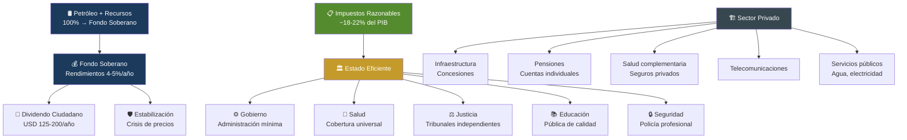
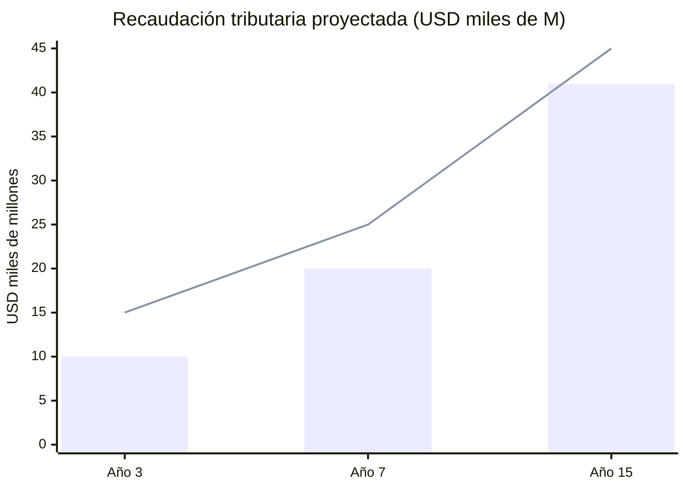
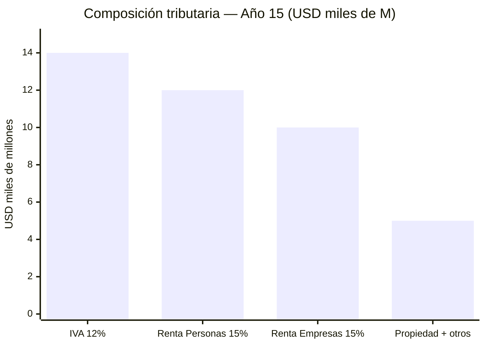
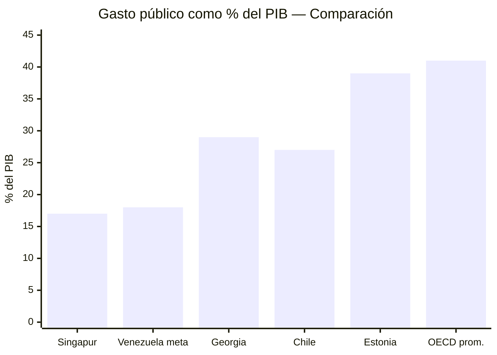
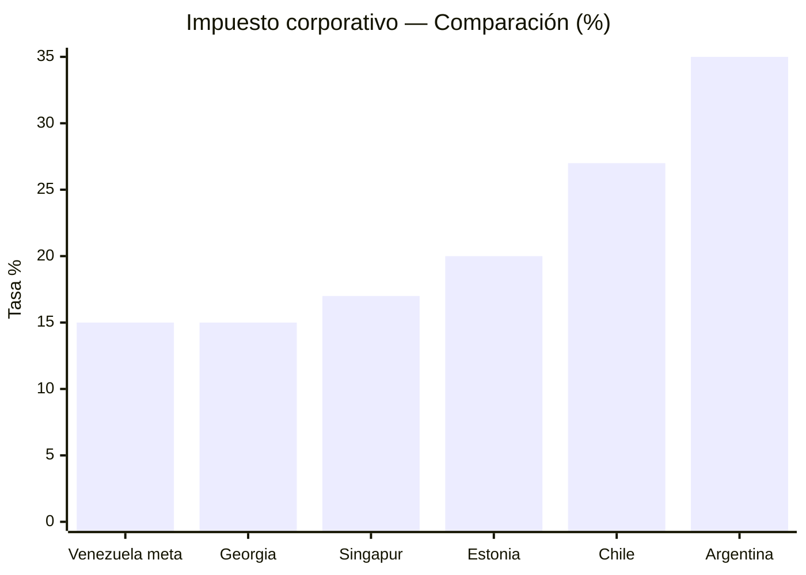
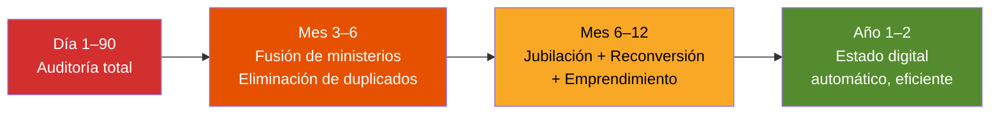
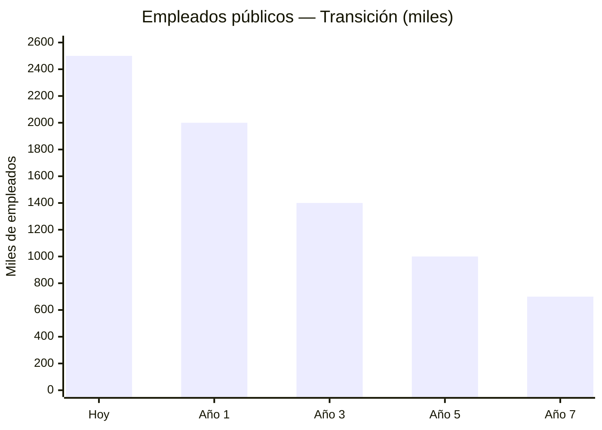
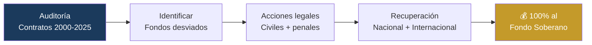

# Efficient State Model: Taxes, Not Oil

> The Venezuelan State must live on reasonable taxes — not oil. Oil goes to the Sovereign Fund. Taxes cover the essentials: government, healthcare, justice, education, and security. Everything else is operated by the private sector with state oversight. Everything that can be automated gets automated.

## Non-Negotiable Guarantees

Before the economic model, fundamental rights:

| Guarantee | Description | Rank |
|-----------|-------------|------|
| **Healthcare for all** | Universal coverage from Day 1 — regardless of income, location, or employment | Constitutional |
| **Dignified old age for all** | Universal basic pension that covers real needs (not USD 3/month) | Constitutional |
| **Freedom of life** | Every person decides how to live, with whom, where, without state interference | Constitutional |
| **Economic freedom** | Right to start businesses, trade, hire, and own property without obstacles | Constitutional |
| **Religious freedom** | Absolute respect for all beliefs or non-belief. Secular state | Constitutional |
| **Independence from the State** | The citizen does NOT depend on the government to eat, work, or have housing | Core objective |

:::danger The starting reality: 82.8% poverty
Venezuela has [82.8% poverty](https://www.cgdev.org/blog/barreling-blindly-ahead-seizure-venezuelas-oil) and a State that pays USD 3.50/month in pensions. You cannot switch overnight to a "everyone fend for yourself" model. The transition requires a social protection floor WHILE private institutions are built. The universal Pillar 1 (pensions, healthcare) exists for this: no one gets left behind while the system matures.
:::

## The Guiding Principle

**Golden rule:** If a service can be privately operated with state oversight and delivers a better outcome, the State does NOT operate it.

---

## What the State Pays For (With Taxes)

Five non-delegable functions. Everything else is a concession, contract, or regulated market.

| Function | % of Budget | Spending/GDP | Reference Model |
|----------|-------------|-------------|-----------------|
| **Central government** | 12–15% | 2–3% | [Singapore: 17% total spending/GDP](https://www.mof.gov.sg/singaporebudget) |
| **Healthcare (public pillar)** | 25–30% | 4–5% | [Singapore Medisave + MediShield](https://www.moh.gov.sg/healthcare-schemes-subsidies) |
| **Justice** | 8–10% | 1.5–2% | [Singapore](https://www.judiciary.gov.sg/) / Estonia |
| **Education** | 25–30% | 4–5% | [Estonia: #1 PISA Europe](https://digital-strategy.ec.europa.eu/en/factpages/estonia-2024-digital-decade-country-report) |
| **Security** | 15–20% | 3–4% | [Georgia: police reform](https://successfulsocieties.princeton.edu/sites/g/files/toruqf5601/files/Policy_Note_ID126.pdf) |
| **TOTAL** | 100% | **15–19% of GDP** | — |

:::info Why 15–19% of GDP?
[Singapore spends ~17% of GDP](https://www.mof.gov.sg/singaporebudget) on total government and has universal healthcare, world-class education, and the safest police in Asia. If Singapore can do it with 17%, Venezuela can aim for 18–22% during reconstruction and converge to 15–18% at maturity.
:::

---

## What the State Does NOT Pay For

These services are operated by concession, contract, or regulated private market. The State supervises, not operates.

### Infrastructure: Chile Concession Model

[Chile has awarded 82 concessions](https://www.mop.cl/Paginas/default.aspx) since 1993 for USD 28,000+ M in private investment: highways, airports, hospitals, prisons.

| Infrastructure | Model | Reference |
|---------------|-------|-----------|
| Highways and roads | 20–30 year concession with toll | [Chile Ruta 5 (3,364 km)](https://www.mop.cl/Paginas/default.aspx) |
| Airports | Operational concession | [Chile SCL Nuevo Pudahuel](https://www.nuevopudahuel.cl/) |
| Ports | Port concession | Colombia: Sociedad Portuaria |
| Water and sanitation | Concession + regulated tariff | [Chile: privatized water utilities](https://www.siss.gob.cl/) |
| Telecommunications | Competitive licenses | Standard LATAM model |
| Electricity (distribution) | Regulated concession | Chile: Enel/CGE |
| Hospitals (infrastructure) | BOT concession | [Chile: Maipu Hospital](https://www.mop.cl/Paginas/default.aspx) |
| Social housing | Demand-side subsidy (not state construction) | [Chile: housing subsidy](https://www.minvu.gob.cl/) |

:::tip Demand-side vs. supply-side subsidies
Chile does not build housing. It gives subsidies that families use to buy on the market. Result: [>2M subsidized homes](https://www.minvu.gob.cl/) in 40 years, without state construction companies. Venezuela should adopt the same model: the State finances, the private sector builds.
:::

### Pensions: Individual Accounts (Improved AFP Model)

The [Chilean AFP](https://www.spensiones.cl/) has been operating for 44 years but has problems: low replacement rates (~40%), high fees, and gender gaps. [Singapore's CPF](https://www.cpf.gov.sg/) is superior: higher contribution (37% vs. 10%), covers housing+healthcare+retirement, and is [ranked #5 globally](https://www.mercer.com/insights/investments/market-outlook-and-trends/mercer-cfa-global-pension-index/) (grade A).

| Aspect | Chile AFP | Singapore CPF | Venezuela (proposal) |
|--------|----------|--------------|----------------------|
| Total contribution | 10% (worker only) | 37% (20% + 17% employer) | 14% (8% worker + 6% employer) |
| Administration | Private AFPs | Government (CPF Board) | Mixed: private AFPs + public supervisory body |
| Covers | Retirement only | Housing + healthcare + retirement | Retirement + complementary healthcare |
| Replacement rate | [~40%](https://economia.lse.ac.uk/articles/10.31389/eco.420) | ~50–70% | Target: >50% |
| Fees | ~1.2% of fund | ~0.1–0.2% | Cap: 0.5% (regulated) |
| Global ranking | [Grade B](https://www.mercer.com/insights/investments/market-outlook-and-trends/mercer-cfa-global-pension-index/) | [Grade A, #5](https://www.mercer.com/insights/investments/market-outlook-and-trends/mercer-cfa-global-pension-index/) | Target: Grade B+ |
| Solidarity pillar | PGU (2008, reformed 2025) | Silver Support Scheme | Universal Pillar 1 (see [Pensions](/06-realidad/pensiones-seguridad-social)) |

**Venezuela Model:** Take the best of both:
- **From Chile:** Individual accounts with worker ownership, freedom of fund choice
- **From Singapore:** Shared employer/worker contribution, regulated low fees, expanded coverage

The universal Pillar 1 (USD 100–200/month) is funded by the public budget. Pillars 2 and 3 are private. See details in [Pensions and Social Security](/06-realidad/pensiones-seguridad-social).

### Healthcare: Dual System with Universal Floor

| Component | Operator | Funding | Model |
|-----------|----------|---------|-------|
| **Universal floor (FONASA)** | State | General taxes | [Chile FONASA](https://www.fonasa.cl/) / [Singapore subsidies](https://www.moh.gov.sg/) |
| **Mandatory insurance** | Regulated private insurers | 7% of salary (contribution) | [Chile ISAPRE](https://www.supersalud.gob.cl/) reformed |
| **Primary care** | Public + concessions | Public budget | [Colombia EPS](https://www.minsalud.gov.co/) |
| **Complex hospitals** | BOT concession (private builds, State operates) | Mixed | [Chile: concession hospitals](https://www.mop.cl/) |
| **Pharmaceuticals** | Private + centralized purchasing | Contribution + regulated copay | [Singapore Medisave](https://www.cpf.gov.sg/) |

:::info Why not 100% private or 100% public
Chile's ISAPRE covers only [~17% of the population](https://www.supersalud.gob.cl/) (higher-income earners). FONASA covers 83%. The lesson: the universal floor is indispensable, but private competition improves quality for those who can pay. Singapore achieves [health spending of only 4.1% of GDP](https://www.moh.gov.sg/) with first-world outcomes using this dual model.
:::

---

## Tax Model: Reasonable Taxes

### Principles

1. **Simple:** Few taxes, easy to understand and pay
2. **Low:** Competitive rates that attract investment, not scare it away
3. **Digital:** 100% online filing and payment (Estonia model)
4. **Progressive where it matters:** Those who earn more pay more — but without excess
5. **No oil dependency:** Taxes cover the budget WITHOUT oil

### Proposed Tax Structure

| Tax | Rate | Comparison | Justification |
|-----|------|------------|---------------|
| **Personal income** | 15% flat (with exempt minimum) | [Estonia: 20%](https://www.emta.ee/en), [Georgia: 20%](https://www.rs.ge/), Chile: 0–40% | Flat tax = simple, low compliance cost, reduces evasion |
| **Corporate income** | 15% (distributed profits) | [Singapore: 17%](https://www.iras.gov.sg/), [Estonia: 20% only when distributed](https://www.emta.ee/en), Chile: 27% | Reinvestment = 0% (Estonia model). Only pays when distributing dividends |
| **VAT** | 12% | [Singapore GST: 9%](https://www.iras.gov.sg/), Chile: 19%, Colombia: 19% | Competitive for LATAM. Basic basket exempt |
| **Capital gains** | 0% (first 10 years) | [Singapore: 0%](https://www.iras.gov.sg/), Hong Kong: 0% | Attract investment. After: 10% |
| **SEEZ (special zones)** | 0% corporate for 10 years | [Argentina RIGI](https://www.upi.com/Top_News/World-News/2025/10/30/bcpargentina-RIGI-foreign-invetments-report/1561761834454/) | 30-year stability |
| **Property tax** | 0.5–1% of cadastral value | [Singapore: 0–20% progressive](https://www.iras.gov.sg/) | Funds municipalities |
| **Tariffs** | 0–5% general | Singapore: 0% | Open economy |

### How Much Does This Model Collect?

| Tax Source | Year 3 | Year 7 | Year 15 |
|------------|--------|--------|---------|
| Personal income (15% flat) | USD 3,000M | USD 5,500M | USD 12,000M |
| Corporate income (15%) | USD 2,000M | USD 5,000M | USD 10,000M |
| VAT (12%) | USD 4,000M | USD 7,000M | USD 14,000M |
| Property + other | USD 1,000M | USD 2,500M | USD 5,000M |
| **Total tax revenue** | **USD 10,000M** | **USD 20,000M** | **USD 41,000M** |
| **% of GDP** | ~10% | ~15% | ~18% |
| **Required budget** | USD 15,000M | USD 25,000M | USD 45,000M |
| **Deficit covered by** | Oil (transitional) | Sovereign Fund + other | Self-sufficient |

:::caution The high-tax trap
Venezuela under Maduro charges [15% payroll tax](https://central-law.com/en/venezuela-law-on-the-protection-of-social-security-pensions/) just for pensions. Colombia charges 19% VAT. Argentina has 100+ different taxes. Result: massive evasion, informality, and corporate flight. The Venezuela S.A. model bets on LOW rates with a BROAD base (formalization + digital taxation).
:::

---

## Comparison: Efficient State Models

| Indicator | Singapore | Estonia | Georgia | Chile | Venezuela (target) |
|-----------|----------|---------|---------|-------|-------------------|
| Public spending/GDP | [~17%](https://www.mof.gov.sg/singaporebudget) | ~39%* | ~29% | ~27% | 18–22% (transition) -> 15–18% |
| Income tax (persons) | 0–24% | [20% flat](https://www.emta.ee/en) | [20% flat](https://www.rs.ge/) | 0–40% | 15% flat |
| Income tax (corporate) | [17%](https://www.iras.gov.sg/) | [20% (distributed only)](https://www.emta.ee/en) | [15%](https://www.rs.ge/) | 27% | 15% |
| VAT/GST | [9%](https://www.iras.gov.sg/) | 22% | 18% | 19% | 12% |
| Pensions | CPF (37%) | 3 pillars | Private | AFP (10%) | Mixed (14%) |
| Doing Business ranking | #2 | #18 | #7 | #59 | Target: Top 20 |
| Infrastructure | PPP | Digital | Reformed | Concessions | Concessions |

*Estonia: high spending/GDP because of EU membership — includes European social transfers. Actual state spending is lower.

---

## Roadmap

| Phase | Action | Timeline |
|-------|--------|----------|
| Day 1 | Decree: oil to the Sovereign Fund (see [Fiscal Transition](/02-motor-financiero/transicion-fiscal)) | Immediate |
| Month 1–6 | Express tax reform: 15% flat + 12% VAT + digitalization | Semester 1 |
| Year 1 | Concession law: infrastructure + hospitals + housing | Year 1 |
| Year 1–2 | Pension system: improved AFP + universal Pillar 1 | Year 1–2 |
| Year 2–3 | Dual healthcare system: FONASA + private insurance | Year 2–3 |
| Year 3–5 | Tax base >15% of GDP -> State self-sufficient without oil | Year 3–5 |
| Year 7+ | Convergence to Singapore model: public spending <18% GDP | Long term |
| Year 15 | **State lives 100% on taxes. Oil 100% to the fund.** | Final target |

---

## State Reform: Surgical Shock Therapy

> If you need to cut, you cut. But with a scalpel, not a machete. You eliminate redundancy, not essential services.

### Principle: Surgical, Not Blind Cuts

The Venezuelan State has ~2.5 million public employees, dozens of duplicated ministries, clientelist missions with no accountability, and state enterprises that lose money. The reform is **shock therapy**-style:

### What Gets Cut

| Action | Detail | Estimated Savings |
|--------|--------|-------------------|
| **Merge ministries** | From 34 ministries to 15–18. Eliminate duplicates (e.g., 3 energy ministries) | USD 500–1,000M/year |
| **Eliminate clientelist missions** | Missions without measurable results get shut down. Those that work are integrated into ministries | USD 1,000–3,000M/year |
| **Close deficit-ridden state enterprises** | Audit: if it loses money and is not strategic, privatize or close | USD 500–2,000M/year |
| **Eliminate redundant bureaucracy** | Processes that get automated no longer need officials | Progressive |
| **Eliminate distortive subsidies** | Free gasoline, free electricity -> market rates with targeted subsidy for the poor | USD 2,000–5,000M/year |

### What Happens to the People

No one gets thrown out on the street without an alternative. **Three options for every displaced public employee:**

| Option | For Whom | Mechanism |
|--------|----------|-----------|
| **Early retirement** | Officials >50 years old with >15 years of service | Pillar 1 pension + retirement bonus (6–12 months of salary) |
| **Workforce reconversion** | Officials <50 years old with reusable skills | 6-month training program (tech, concessions, healthcare, education) + relocation to private sector or concessions |
| **Entrepreneurship** | Officials with entrepreneurial drive | Direct access to Semilla/Ignite Venezuela programs (see [Startups](/05-transformacion/startup-programs)) + seed capital + 2-year tax exemption |

:::info From 2.5M to 700 thousand
Singapore governs 5.9M people with ~150 thousand public employees. Estonia governs 1.3M with ~130 thousand. Venezuela with 40M does NOT need 2.5M public officials. With automation + concessions, the target is ~700 thousand public employees by Year 7 — the best paid in LATAM, in the 5 essential functions.
:::

---

### Recovery of Diverted Public Funds

> Every person or company that received public funds for a project and did not deliver results must be held accountable.

| Action | Detail | Priority |
|--------|--------|----------|
| **Specialized prosecutor's office** | Unit dedicated to fraud against the State. Independent, with retroactive jurisdiction | Year 1 — begins investigating |
| **Audit of contracts 2000–2025** | Review all public contracts >USD 1M. Identify unfinished works, overbilling, ghost contracts | Year 1–2 |
| **Civil and criminal legal actions** | Lawsuits against companies and individuals who received funds and did not deliver | Year 1–5 (not top priority but in progress) |
| **International cooperation** | Asset tracing abroad via INTERPOL, OFAC, Transparency International | Year 1+ |
| **Whistleblower incentive** | 10–30% of recovered funds for whoever reports (model [SEC Whistleblower](https://www.sec.gov/whistleblower)) | From Day 1 |
| **Destination of recovered funds** | **100% to the Sovereign Fund** — not to the current budget | Permanent |

:::caution Not revenge — accountability
The objective is not political persecution. It is that whoever stole must return the money. Whoever failed to fulfill a contract must answer. This sends a clear signal to future contractors and officials: in Venezuela S.A., public money has an owner — 40 million shareholders.
:::

---

## Transition from Poverty: The Realistic Path

With 82.8% poverty, the final model is not implemented on Day 1. There is a transition:

| Phase | Country Status | Role of the State | Role of Private Sector | Funding |
|-------|---------------|-------------------|------------------------|---------|
| **Emergency (Year 1)** | Extreme poverty, no institutions | State provides EVERYTHING: basic healthcare, food, minimum pension, temporary public employment | Almost none — there is no market | 100% oil + humanitarian emergency |
| **Stabilization (Years 2–3)** | Poverty declining, dollarization stable | State maintains universal floor + begins tendering concessions | First concessions (telecommunications, ports) + AFPs are created | 80% oil + 20% growing taxes |
| **Construction (Years 4–7)** | Poverty <50%, formal economy growing | State reduces direct operations. Healthcare and education maintained. Infrastructure = concessions | AFPs operating, ISAPREs launching, concessions underway | 50% oil + 50% taxes |
| **Maturity (Years 8–15)** | Poverty <25%, growing middle class | State only: healthcare floor, justice, education, security | Private sector operates infrastructure, pensions, complementary healthcare | 100% taxes. Oil -> fund |

### Protection During the Transition

| Mechanism | For Whom | Duration |
|-----------|----------|----------|
| **Universal basic pension** (USD 50->200/month) | EVERY retiree, from Day 1 | Permanent (Pillar 1) |
| **Free basic healthcare** | EVERY citizen, from Day 1 | Permanent (FONASA) |
| **Food subsidy** | Households below poverty line | Transitional (Years 1–5) — decreases as income rises |
| **Temporary public employment** | Unemployed during reconstruction | Transitional (Years 1–3) — labor-intensive infrastructure |
| **Housing subsidy** | Homeless families or overcrowded households | Permanent (Chile model: demand-side subsidy) |
| **Free education** | EVERY child and young person, from Day 1 | Permanent |
| **Citizen dividend** | EVERY Venezuelan (when the fund allows it) | From Year 3+ (see [Citizen Investment](/03-ciudadanos/inversion-ciudadana)) |

:::info Not austerity — graduation
The objective is NOT to take away aid. It is for people to NO LONGER NEED IT because they have a job, their own pension, health insurance, and opportunities. The State does not disappear — it shrinks because people prosper. The best social policy is a good job.
:::

---

## Automated State: Minimum Friction, Maximum Results

> Everything that can be automated will be automated.

| Process | Today | Target | Model | Savings |
|---------|-------|--------|-------|---------|
| **Tax filing** | Manual, in-person, corrupt | Automatic, pre-filled by the system | [Estonia: 3 minutes](https://e-estonia.com/) | 95% of administrative cost |
| **Business registration** | 30+ steps, weeks | 1 click, 15 minutes | [Estonia e-Residency](https://e-estonia.com/) / [Georgia: #7 Doing Business](https://www.rs.ge/) | 90% of time |
| **Construction permits** | Months, bribes | Digital, automatic if it meets standards | Singapore: BCA | 80% of time |
| **Healthcare procedures** | In-person, queues | Digital prescriptions, unified medical records, telemedicine | [Estonia: 99% digital prescriptions](https://e-estonia.com/) | 70% of cost |
| **Civil justice** | Years | Months. 80% of cases resolved online | [UK: Online Courts](https://www.judiciary.uk/) | 60% of cost |
| **Policing** | Improvised patrolling | Predictive (AI), cameras, real-time data | [Singapore Safe City](https://www.police.gov.sg/) | Crime reduction |
| **Public procurement** | Opaque, corrupt | 100% digital, open, AI-auditable | [South Korea: KONEPS](https://www.pps.go.kr/eng/) | 15–20% savings + anti-corruption |
| **Citizen identity** | Physical ID card, forgeable | Digital identity with electronic signature | [Estonia ID](https://e-estonia.com/) | Foundation for everything else |

:::tip The automation dividend
[Estonia saves 2% of GDP](https://centreforpublicimpact.org/public-impact-fundamentals/e-estonia-the-information-society-since-1997/) with digital government. For Venezuela, that would mean USD 4,000+ M/year at the target GDP. Fewer officials, less corruption, fewer queues, more speed. The State does not need 2 million public employees if it automates 80% of processes.
:::

### Reducing State Dependency

| Today | Target |
|-------|--------|
| Millions depend on CLAP boxes to eat | Formal employment that allows buying food freely |
| USD 3.50/month pension = total dependency | Own AFP + dignified Pillar 1 = independence |
| Healthcare: go to the public hospital or die | Mandatory private insurance + FONASA for those who cannot afford it |
| Housing: waiting for the government to build | Demand-side subsidy: YOU choose where and how to live |
| Employment: cronyism and clientelist missions | Free labor market, SEEZs, startups, concessions |

**The State is not your parent. It is your platform.** It creates the conditions for every person to build their own life. And for those who cannot — yet — there is the universal floor until they can.

---

:::danger The ultimate objective
Year 15: Venezuela funds its State WITH taxes. Oil goes to the Sovereign Fund. Fund returns (4–5%) supplement. Pensions are private (AFP). Healthcare has a public floor + private option. Infrastructure is concession-based. The State is small, digital, automated, and efficient. Freedom of life, economic freedom, and religious freedom are constitutional. No one depends on the government to live. That is the model.
:::
