# Efficient State Model: Taxes, Not Oil

> The Venezuelan State must live on reasonable taxes — not oil. Oil goes to the Venezuela S.A. Investment Fund, managed by **Venezuela S.A.** (the corporate holding of 40M citizen-shareholders), not by the State. Taxes cover the essentials: government, healthcare, justice, education, and security. Everything else is operated by the private sector with state oversight. Everything that can be automated gets automated. The State regulates. Venezuela S.A. does business.

:::tip Executive Summary — Quick Navigation
This is the longest document in the plan (~1,000 lines). Here's what matters:

| Section | Content | Go to |
|---------|---------|-------|
| **Guarantees** | Universal health, dignified old age, economic and life freedoms | [Guarantees](#non-negotiable-guarantees) |
| **Guiding principle** | State collects taxes. VSA manages oil. Private sector operates | [Principle](#the-guiding-principle) |
| **What the State pays** | 5 functions: government, health, justice, education, security | [State pays](#what-the-state-pays-for-with-taxes) |
| **What it does NOT pay** | CFV (5 sub-accounts, 23% salary), voucher, health, housing, pensions | [CFV and services](#what-the-state-does-not-pay-for) |
| **Taxes** | 15% flat + 12% VAT + anti-regressivity mechanisms | [Tax model](#tax-model-reasonable-taxes) |
| **Comparison** | Chile, Singapore, Estonia, Norway, Georgia, UAE | [Comparison](#comparison-efficient-state-models) |
| **Reform** | 34→10 ministries, 2.5M→265K employees, NOT Milei-style | [Reform](#state-reform-surgical-shock-therapy) |
| **Poverty transition** | Safety net while institutions are being built | [Transition](#transition-from-poverty-the-realistic-path) |
| **Digital State** | Estonia-level automation, AI, procedures in minutes | [Digital](#automated-state-minimum-friction-maximum-results) |
| **Financing** | How everything is paid for, phase by phase | [Financing](#how-everything-is-funded-from-the-current-crisis-to-the-fcv-model) |
| **CFV example** | Real calculation: minimum wage → USD 463K by age 65 | [Example](#appendix-example--fcv-lifecycle-with-minimum-wage) |
:::

## Non-Negotiable Guarantees

Before the economic model, fundamental rights:

| Guarantee | Description | Rank |
|-----------|-------------|------|
| **Healthcare for all** | Universal coverage from Day 1 — regardless of income, location, or employment | Constitutional |
| **Dignified old age for all** | Universal basic pension that covers real needs (not USD 3/month) | Constitutional |
| **Freedom of life** | Every person decides how to live, with whom, where, without state interference | Constitutional |
| **Economic freedom** | Right to start businesses, trade, hire, and own property without obstacles | Constitutional |
| **Religious freedom** | Absolute respect for all beliefs or non-belief. Secular state | Constitutional |
| **Independence from the State** | The citizen does NOT depend on the government to eat, work, or have housing | Core objective |

:::danger The starting reality: 82.8% poverty
Venezuela has [82.8% poverty](https://www.cgdev.org/blog/barreling-blindly-ahead-seizure-venezuelas-oil) and a State that pays USD 3.50/month in pensions. You cannot switch overnight to a "everyone fend for yourself" model. The transition requires a social protection floor WHILE private institutions are built. The universal Pillar 1 (pensions, healthcare) exists for this: no one gets left behind while the system matures.
:::

## The Guiding Principle

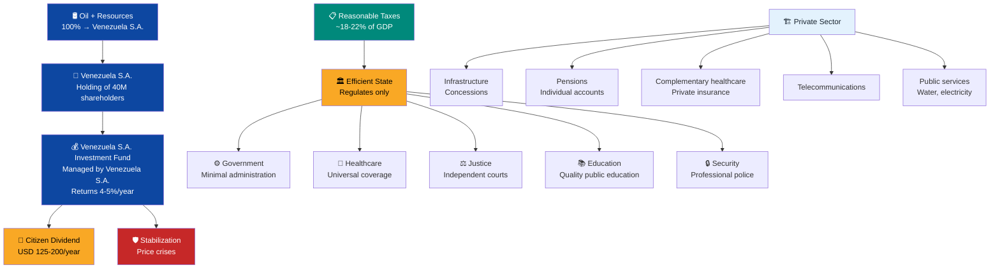

**Golden rule:** If a service can be privately operated with state oversight and delivers a better outcome, the State does NOT operate it. **In healthcare and education, the State FUNDS and SUPERVISES — it does not operate.** Oversight is tripartite: State + community + parents/patients. **Venezuela S.A.** — the citizen corporate holding — invests in base infrastructure, collects royalties from concessions, manages the Venezuela S.A. Investment Fund, and distributes dividends.

---

## What the State Pays For (With Taxes)

Five non-delegable functions. Everything else is a concession, contract, or regulated market.

| Function | % of Budget | Spending/GDP | Reference Model |
|----------|-------------|-------------|-----------------|
| **Central government** | 12–15% | 2–3% | [Singapore: 17% total spending/GDP](https://www.mof.gov.sg/singaporebudget) |
| **Healthcare (supervises, does not operate)** | 25–30% | 4–5% | [Chile FONASA](https://www.fonasa.cl/) — State collects 7% contribution and supervises quality. Private operators run hospitals |
| **Justice** | 8–10% | 1.5–2% | [Singapore](https://www.judiciary.gov.sg/) / Estonia |
| **Education (supervises, does not operate)** | 25–30% | 4–5% | State funds vouchers and supervises standards. Schools and universities operate autonomously |
| **Security** | 15–20% | 3–4% | [Georgia: police reform](https://successfulsocieties.princeton.edu/sites/g/files/toruqf5601/files/Policy_Note_ID126.pdf) |
| **TOTAL** | 100% | **15–19% of GDP** | — |

:::info Why 15–19% of GDP?
[Singapore spends ~17% of GDP](https://www.mof.gov.sg/singaporebudget) on total government and has universal healthcare, world-class education, and the safest police in Asia. If Singapore can do it with 17%, Venezuela can aim for 18–22% during reconstruction and converge to 15–18% at maturity.
:::

---

## What the State Does NOT Pay For

These services are operated by concession, contract, or regulated private market. The State supervises, not operates.

:::danger Guiding Principle: Every Service Has Sustainable Funding — No One Is Left Out
**Healthcare and education are universal: no Venezuelan is excluded for lack of money.** But they are not "free" — they are funded by sustainable mechanisms, not by state handouts.

| Service | Model | Funding | No one left out |
|---------|-------|---------|-----------------|
| **Healthcare** | [Improved FONASA](https://www.fonasa.cl/) (Chile) | Mandatory 7% salary contribution. Everyone contributes, everyone is covered | Tramo A/B (low income): 0% copay. Tramo C: 10%. Tramo D: 20% |
| **Education** | Chile voucher + [SEP](https://www.mineduc.cl/) | Universal voucher that follows the student. Schools compete as private enterprises | Voucher 50% higher for families below the poverty line. No one pays tuition |
| **Water** | Israel Mekorot / Singapore PUB | Cost-reflective tariff + scarcity pricing (conservation) | Voucher for first 13m3/month for those in extreme poverty |
| **Electricity** | Chile/Singapore competitive | Cost-reflective tariff (Venezuelan hydro = ~USD 0.05-0.06/kWh WITHOUT subsidy — naturally cheap) | Targeted voucher during transition |
| **Gasoline** | Market price (Saudi Arabia transition) | Market price: ~USD 0.50-0.80/liter at USD 60/barrel | None. Gradual 5-10 year transition |
| **Telecommunications** | Competitive 5G SA | Market tariff (operators compete) | Public WiFi hotspots at schools/plazas |

**Freebies destroyed Venezuela:** free gasoline = massive smuggling, free electricity = waste + blackouts. **The model is: sustainable funding (solidarity contribution for healthcare, voucher for education) + market tariffs for everything else.** [Chile FONASA covers 83% of the population](https://www.supersalud.gob.cl/) with solidarity contribution. [Israel recycles 85% of wastewater](https://www.haaretz.com/) because the price reflects scarcity.
:::

### Citizen Fund Venezuela (FCV): One Account, Zero Bureaucracy

**Why have a separate healthcare system from pensions from housing?** In [Singapore, the CPF](https://www.cpf.gov.sg/) is ONE single account with sub-accounts. The citizen sees all their savings in one place. A single institution manages it. Zero bureaucratic duplication.

Venezuela adopts the same principle: **the Citizen Fund Venezuela (FCV)** is a mandatory personal account that unifies healthcare, retirement, housing, education, and severance protection in a single vehicle.

:::danger Do not confuse: FCV ≠ Venezuela S.A. Investment Fund
They are **two different things** that complement each other:

| | **Venezuela S.A. Investment Fund** | **Citizen Fund Venezuela (FCV)** |
|---|---|---|
| **What it is** | Collective investment fund ([Norway NBIM](https://www.nbim.no/)-style) | Personal citizen account ([Singapore CPF](https://www.cpf.gov.sg/)-style) |
| **Whose is it** | Venezuela S.A.'s (40M shareholders collectively) | Each individual person's |
| **What it receives** | Oil, mining, gas revenues, JV royalties | 23% salary contribution (worker + employer) |
| **What it produces** | Annual citizen dividend (USD 65-200/year for everyone) | Pension + healthcare + housing + education + severance (personal) |
| **Can you touch it** | No — you only receive the dividend | Yes — it is YOUR account (withdraw for housing, use for health, collect severance) |

**The citizen receives from BOTH:** dividend from the Investment Fund + benefits from their personal FCV.
:::

| Sub-account | % of salary | Purpose | Ownership | Model |
|-------------|------------|---------|-----------|-------|
| **Retirement** | 8% | Pension upon retirement | The worker's — no one can take it | [Singapore CPF Special Account](https://www.cpf.gov.sg/) |
| **Health** | 7% | Hospitalization, medications, copays. Phase 1-5: 100% contributory. Phase 5+: contributory + individual savings | Contributory (phase 1) → individual (phase 3) | [Chile FONASA](https://www.fonasa.cl/) → [Singapore MediSave](https://www.moh.gov.sg/) |
| **Housing** | 4% | Down payment on own home. Mortgage credit | The worker's | [Singapore CPF Ordinary Account](https://www.cpf.gov.sg/) |
| **Education** | 2% | Own university education or children's | The worker's | [Singapore CPF Education Scheme](https://www.cpf.gov.sg/) |
| **Severance** | 2% | 3-6 month salary cushion if you lose your job. If unused, transfers to Retirement upon retirement | The worker's — immediately available if unemployed | [Chile AFC (Unemployment Insurance)](https://www.afc.cl/) |
| **TOTAL** | **23%** | | **(11% worker + 12% employer)** | Singapore CPF: 37% |

:::info At retirement: all unused balances consolidate into Retirement
When the citizen reaches retirement age, **all unused funds from other sub-accounts automatically consolidate into the Retirement Sub-account:**
- **Housing** unused (if they already bought a home or never used it) → Retirement
- **Education** unused (if they did not need it for university) → Retirement
- **Severance** unused (if they were never unemployed) → Retirement
- **Health** with individual balance (Medisave) → remains as medical fund for retirement

**Effect:** a disciplined worker who bought their home early, was never unemployed, and whose children earned merit-based university vouchers reaches retirement with a **significantly larger** retirement fund because they receive the balances of 3 additional sub-accounts. The system rewards effort and planning.
:::

:::danger If the citizen dies: the FCV is inheritable — 100%
The FCV is **the worker's property**, not the State's. If they die before retirement or during retirement:

| Situation | What happens to the FCV |
|-----------|------------------------|
| **Dies before retirement** | The full balance of all 5 sub-accounts passes to their **designated beneficiaries** (spouse, children, parents). No complex paperwork — automatic transfer to the beneficiaries' FCV accounts |
| **Dies during retirement** | The remaining Retirement + Health (Medisave) balance passes to beneficiaries. Not a single cent is lost |
| **No designated beneficiaries** | The legal order of succession applies (spouse → children → parents → siblings). It never reverts to the State |
| **Minors as beneficiaries** | The balance is deposited into the minor's FCV. VSA continues managing it until they turn 18 |

**This is NOT a state pension that dies with the retiree.** It is inheritable personal wealth. In the current system (IVSS), when the pensioner dies, the pension disappears. In the FCV, a lifetime of savings passes to the next generation. [Singapore CPF](https://www.cpf.gov.sg/) works exactly this way — the balance belongs to the citizen, not the government.
:::

#### Debts and insurance: integrated FCV protection

Every debt linked to the FCV (mortgage via Housing Sub-account, education loan via Education Sub-account) includes **mandatory integrated insurance**:

| Insurance type | What it covers | How it is paid | What happens if triggered |
|---------------|----------------|---------------|--------------------------|
| **Severance insurance** | If you lose your job, FCV debt payments freeze for 3-6 months | Included in the Severance Sub-account (2%) | Payments pause automatically. The Severance Sub-account covers the minimum. No penalty or negative credit report |
| **Life insurance** | If the holder dies, the debt is cancelled completely | Premium included in the loan rate (~0.3-0.5% additional) | **Debt = zero.** The family inherits the home/asset free of debt + remaining FCV balance |
| **Disability insurance** | If the holder becomes permanently incapacitated | Premium included in the loan rate | Debt is cancelled. FCV continues generating returns. Health Sub-account covers treatment |

**Concrete example:** A worker buys a home with Housing Sub-account + mortgage. At age 40 they die in an accident. Result:
- Mortgage → **cancelled by life insurance** (the family does NOT inherit debt)
- Home → **family's property** (free of liens)
- Remaining FCV → **inherited by beneficiaries** (retirement + health + education + severance)
- Minor children → continue receiving USD 150/month from VSA in their FCV + K-12 voucher

**No one inherits debt. They only inherit wealth.** The integrated insurance system within the FCV ensures that death or job loss does not destroy a family. The insurance cost is minimal (~0.3-0.5% on the rate) because it is distributed among millions of contributors — economies of scale.

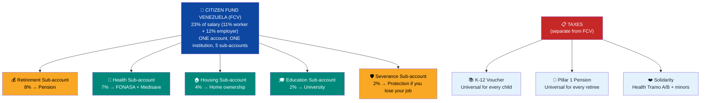

#### The FCV Starts at Birth — Venezuela S.A. Invests First

**The FCV does not start when you get a job. It starts when you are born.** Venezuela S.A. and the State open an FCV account for every newborn and deposit **USD 150/month** from month 1. From there, the child's healthcare and education are funded:

| Age | VSA deposits | Child's health | K-12 education | Net savings |
|-----|-------------|----------------|----------------|-------------|
| **0-4 years** | USD 150/month | USD 30/month (FONASA minor) | — (preschool) | USD 120/month → savings |
| **5-17 years** | USD 150/month | USD 30/month | USD 100/month (K-12 voucher) | USD 20/month → savings |

By age 18, the citizen has received **USD 32,400 in investment** from Venezuela S.A. Of that: USD 6,480 funded their healthcare, USD 15,600 their K-12 education, and **USD 20,218 remain as savings** (with compound interest at 5%). Those savings are distributed across the 4 FCV sub-accounts when the citizen starts working.

**Venezuela S.A. invests in the citizen BEFORE the citizen produces.** That is the difference with a pure market system: the country bets on every person from day 1. In return, the citizen contributes to the system during 47 years of working life.

**What complements the FCV** (funded by taxes):
- **Pillar 1 Pension**: universal, for every retiree — including those who never contributed
- **Health Tramo A/B**: additional solidarity for adults with no income/extreme poverty

#### Diaspora FCV: Incentive to Return

| Situation | Investment Fund dividend | FCV (5 sub-accounts) | How it works |
|-----------|------------------------|---------------------|--------------|
| **Venezuelan abroad — does NOT contribute** | Yes, receives dividend as Venezuela S.A. shareholder | No FCV accumulation | Maintains citizen-shareholder rights. If they return, starts contributing from that moment |
| **Venezuelan abroad — contributes voluntarily** | Yes, receives dividend | Yes, accumulates in all 5 sub-accounts | Pays 23% voluntarily on declared income. When returning: has health, housing, pension, education for children, and severance already accumulated |
| **Venezuelan who returns** | Yes, receives dividend | Yes, starts/continues FCV | Joins the system like any worker. Years contributed from abroad count |

:::tip The FCV is the greatest incentive to return
A Venezuelan in Miami earns USD 4,500/month but has NO FCV. If they contribute voluntarily at 23% (USD 1,035/month) for 10 years from abroad, they accumulate ~USD 170,000 in their FCV. When they return to Venezuela they have: a home (housing sub-account), healthcare covered (health sub-account), advanced pension (retirement sub-account), university for their children (education sub-account), and a severance cushion (severance sub-account). **The FCV turns "returning" from a risk into a calculated investment.**
:::

#### Foreigners Who Come to Venezuela: Same System

Foreigners who work legally in Venezuela contribute to the FCV **exactly like a Venezuelan**. The system does not discriminate by nationality — it discriminates by contribution.

| Situation | Fund dividend | FCV | How it works |
|-----------|-------------|-----|--------------|
| **Foreigner with work permit** | No dividend (not a VSA shareholder) | Yes, contributes and accumulates FCV from Day 1 | Same 5 sub-accounts. If they leave: withdraws accumulated minus costs (see below) |
| **Foreigner with permanent residency** | No dividend (unless naturalized) | Yes, full FCV | Same benefits. Children born in Venezuela: FCV from birth (VSA contributes) |
| **Naturalized foreigner** | Yes, receives dividend (is Venezuelan) | Yes, full FCV | Becomes a citizen-shareholder of Venezuela S.A. with all rights |
| **Children of foreigners born in Venezuela** | Yes, they are Venezuelan | Yes, FCV from birth (VSA contributes) | Born with FCV account. VSA deposits USD 150/month. Same rights as any Venezuelan |

#### What Happens When a Foreigner Leaves the Country

The foreigner's FCV is **withdrawable**, but the State recovers what it invested:

| Item | What happens |
|------|-------------|
| **Retirement sub-account** | 100% returned (it is their money) |
| **Health sub-account** | Unused balance returned |
| **Housing sub-account** | Balance returned (if no home was purchased) |
| **Education sub-account** | Unused balance returned |
| **Severance sub-account** | 100% of accumulated balance returned |
| **(-) VSA investment in their children** | Deducted: what Venezuela S.A. invested in education and healthcare of children born in Venezuela (USD 150/month x months covered) |
| **(-) Solidarity health used** | Deducted: cost of medical care received via the FCV solidarity component (hospitalization, surgeries, treatments funded by the common pool — not what they paid out-of-pocket via copay) |
| **(-) Administration fee** | Deducted: accumulated fund management fee (~0.5% annual on balance) |
| **= Amount received** | **Total accumulated - VSA investment in children - solidarity health used - fees** |

**Example:** A foreigner worked 8 years, accumulated USD 45,000 in FCV. Had 1 child (4 years old, VSA invested USD 7,200). Used USD 3,500 in solidarity health (one surgery + hospitalization). Fees: USD 1,200. **Receives: USD 45,000 - USD 7,200 - USD 3,500 - USD 1,200 = USD 33,100.**

:::info Attracting global talent with the FCV
The FCV is a competitive advantage for attracting foreign talent. A Colombian, Peruvian, or Argentine engineer working in Venezuela accumulates in 5 sub-accounts from Day 1 — something their home country probably does NOT offer in a single system. If they stay 10+ years, they have a home, healthcare, and pension. If they leave, they withdraw their money (minus what Venezuela invested in their children and fees). **It is fair: the system protects you while you contribute, and if you leave, it returns what is yours minus what the country invested in your family.**
:::

#### Gradual FCV Transition

| Phase | Activation KPI (not fixed years) | Total contribution | Distribution | What unlocks |
|-------|-----------------------------------|--------------------|-------------|-------------|
| **Emergency** | GDP per capita < USD 3,000 and/or informality > 60% | 14% | Retirement 8% + Health 6% (100% contributory) | Only retirement and health. Priority: basic coverage |
| **Stabilization** | GDP per capita > USD 3,000 and formalization > 40% | 18% | Retirement 8% + Health 6% + Housing 4% | Housing sub-account opens. Workers start saving for their own home |
| **Construction** | GDP per capita > USD 5,000 and formalization > 55% | 23% | Retirement 8% + Health 7% + Housing 4% + Education 2% + Severance 2% | Education and severance open. Health introduces individual Medisave |
| **Maturity** | GDP per capita > USD 8,000 and formalization > 70% | 27% | Retirement 10% + Health 7% + Housing 5% + Education 3% + Severance 2% | Full system. Convergence to Singapore model |

:::tip Phases activate by KPIs, not by calendar
**You do not say "in year 7 housing opens."** You say "when GDP per capita exceeds USD 3,000 and formalization exceeds 40%, housing opens." If that happens in year 4 because the economy grew fast, it accelerates. If it takes until year 9 because of a crisis, it waits. **The plan adapts to reality, not the other way around.** Singapore did not set dates for the CPF — it adjusted it 50+ times in 60 years based on real conditions.
:::

:::info Advantages of unified FCV vs. separate systems
| Separate (FONASA + AFP + housing subsidy + scholarship + severance) | Unified (FCV) |
|-----------------------------------------------------|---------------|
| 5 institutions, 5 bureaucracies, 5 accountability processes | **1 institution, 1 account, 1 app** |
| Citizen doesn't know their total balance | **Single dashboard: see retirement + health + housing + education + severance** |
| Each system has its own administrative cost | **Economies of scale: lower fees** |
| Fragmented funds invest separately | **One single fund invests the entire pool professionally** |
| Hard to reform (each system has its own lobby) | **One reform, one legal framework** |
| Singapore: 37% in 1 system = efficient | **Chile: 17% across 3 systems = inefficient** |
:::

### Infrastructure: Chile Concession Model

[Chile has awarded 82 concessions](https://www.mop.cl/Paginas/default.aspx) since 1993 for USD 28,000+ M in private investment: highways, airports, hospitals, prisons.

| Infrastructure | Model | Reference |
|---------------|-------|-----------|
| Highways and roads | 20–30 year concession with toll | [Chile Ruta 5 (3,364 km)](https://www.mop.cl/Paginas/default.aspx) |
| Airports | Operational concession | [Chile SCL Nuevo Pudahuel](https://www.nuevopudahuel.cl/) |
| Ports | Port concession | Colombia: Sociedad Portuaria |
| Water and sanitation | Concession + regulated tariff | [Chile: privatized water utilities](https://www.siss.gob.cl/) |
| Telecommunications | Competitive licenses | Standard LATAM model |
| Electricity (distribution) | Regulated concession | Chile: Enel/CGE |
| Hospitals (infrastructure) | BOT concession | [Chile: Maipu Hospital](https://www.mop.cl/Paginas/default.aspx) |
| Housing | Venezuela S.A. co-invests as equity (no subsidies) | [Singapore HDB](https://www.hdb.gov.sg/): 89.7% homeownership via CPF |

:::tip Housing: FCV + Venezuela S.A. as Co-Investor (Equity, Not Handout)
Workers accumulate savings in the **FCV Housing Sub-account** (4-5% of salary). Those savings are used as a down payment on their own home — as in [Singapore](https://www.cpf.gov.sg/) where 89.7% of the population owns their home thanks to the CPF.

**For low-income families:** Venezuela S.A. co-invests as equity in the home — no handouts, no subsidies. Example:

| Component | Contribution | % ownership |
|---|---|---|
| Family (FCV Housing) | USD 3,000 | **20%** |
| Venezuela S.A. (equity) | USD 9,000 | **60%** |
| Mortgage | USD 3,000 | **20%** |
| **Total home value** | **USD 15,000** | **100%** |

The family moves in from Day 1 (owns 20-40%). As they pay off the mortgage and the economy grows, they buy out VSA's share. If they sell, VSA recovers its percentage with appreciation. **VSA doesn't give away houses — it invests in housing as venture capital and recovers with returns.** The State doesn't build — the private sector builds, VSA participates as shareholder, and the citizen chooses where to live.
:::

### Pensions: FCV Retirement Sub-account

> Pensions are the **Retirement Sub-account** of the [Citizen Fund Venezuela (FCV)](#citizen-fund-venezuela-fcv-one-account-zero-bureaucracy). It is not a separate system — it is part of the citizen's unified account.

The [Chilean AFP](https://www.spensiones.cl/) has been operating for 44 years but has problems: low replacement rates (~40%), high fees, and gender gaps. [Singapore's CPF](https://www.cpf.gov.sg/) is superior: higher contribution (37% vs. 10%), covers housing+healthcare+retirement, and is [ranked #5 globally](https://www.mercer.com/insights/investments/market-outlook-and-trends/mercer-cfa-global-pension-index/) (grade A).

| Aspect | Chile AFP | Singapore CPF | Venezuela (proposal) |
|--------|----------|--------------|----------------------|
| Total contribution | 10% (worker only) | 37% (20% + 17% employer) | 23% (11% worker + 12% employer) via FCV |
| Administration | Private AFPs | Government (CPF Board) | FCV: autonomous public entity (CPF Board-type) |
| Covers | Retirement only | Housing + healthcare + retirement | Retirement + health + housing + education + severance (5 sub-accounts) |
| Replacement rate | [~40%](https://economia.lse.ac.uk/articles/10.31389/eco.420) | ~50–70% | Target: >50% |
| Fees | ~1.2% of fund | ~0.1–0.2% | Cap: 0.5% (regulated) |
| Global ranking | [Grade B](https://www.mercer.com/insights/investments/market-outlook-and-trends/mercer-cfa-global-pension-index/) | [Grade A, #5](https://www.mercer.com/insights/investments/market-outlook-and-trends/mercer-cfa-global-pension-index/) | Target: Grade B+ |
| Solidarity pillar | PGU (2008, reformed 2025) | Silver Support Scheme | Universal Pillar 1 (see [Pensions](/06-realidad/pensiones-seguridad-social)) |

**Venezuela Model:** Take the best of both:
- **From Chile:** Individual accounts with worker ownership, freedom of fund choice
- **From Singapore:** Shared employer/worker contribution, regulated low fees, expanded coverage

The universal Pillar 1 (USD 100–200/month) is funded by the public budget. Pillars 2 and 3 are private. See details in [Pensions and Social Security](/06-realidad/pensiones-seguridad-social).

### Healthcare: FCV Health Sub-account — Universal, Contributory, No Exclusions

> Healthcare is the **Health Sub-account** of the [Citizen Fund Venezuela (FCV)](#citizen-fund-venezuela-fcv-one-account-zero-bureaucracy). The 7% contribution goes to this sub-account. In years 1-5 it is 100% solidarity (FONASA). From year 5 onward, the individual component (Medisave) is introduced.

**It is not "free" — it is funded by mandatory contribution. But no one is left out.**

| Component | How it works | Funding | Model |
|-----------|-------------|---------|-------|
| **FONASA (solidarity insurance)** | Mandatory universal insurance. Everyone contributes, everyone is covered. Income-based tramos determine copay | 7% of gross salary (mandatory contribution) | [Chile FONASA](https://www.fonasa.cl/) — covers [83% of the population](https://www.supersalud.gob.cl/) |
| **Minors under 18: automatic coverage** | **Every minor has guaranteed healthcare automatically** — zero copay, zero paperwork, regardless of parents' employment status | Funded by system solidarity | Constitutional — right of the minor |
| **Tramo A (no income)** | Full coverage, zero copay. Indigent, unemployed, minimum pensioners | Funded by system solidarity + public budget | [FONASA Tramo A](https://www.fonasa.cl/) |
| **Tramo B (low income)** | Full coverage, zero copay | 7% contribution on low income | [FONASA Tramo B](https://www.fonasa.cl/) |
| **Tramo C (middle income)** | 10% copay on services | 7% contribution | Same as Chile FONASA |
| **Tramo D (high income)** | 20% copay on services | 7% contribution | Same as Chile FONASA |
| **ISAPRE (private option)** | Private insurance for those who want more coverage or shorter waits | Private premium (instead of FONASA) | [Chile ISAPRE](https://www.supersalud.gob.cl/) — an option, not an obligation |
| **Hospitals** | BOT concession (private builds and operates, Venezuela S.A. as shareholder in JV) | FONASA/ISAPRE payments | [Chile: concession hospitals](https://www.mop.cl/) |

:::info Universal coverage at 4-5% of GDP
Chile FONASA covers [83% of the population](https://www.supersalud.gob.cl/) with a mandatory 7% salary contribution. Since 2022, public care is effectively zero copay for all FONASA beneficiaries. Venezuela's cheap hydroelectric energy (USD 0.05-0.06/kWh) reduces hospital operating costs. With telemedicine ([Estonia: 99% digital prescriptions](https://e-estonia.com/)) + concession hospitals, Venezuela can achieve universal coverage at **4-5% of GDP**. The key: solidarity contribution + efficient private management + technology.
:::

#### Gradual Transition: FONASA → Hybrid FONASA + Medisave

With 82.8% poverty, you cannot start with Singapore-style individual savings (nobody has anything to save). Start with solidarity (FONASA) and gradually transition to a hybrid model as incomes rise:

| Phase | Years | 7% contribution | Split | Reason |
|-------|-------|-----------------|-------|--------|
| **Emergency** | 1-5 | 7% → 100% FONASA solidarity | All to solidarity fund. Universal coverage immediately | 82.8% poverty. No income for individual savings |
| **Medisave introduction** | 5-10 | 7% → 5% FONASA + 2% personal Medisave | Personal medical savings account created for copays, medications, dental, optical | Incomes rising. Growing middle class can save |
| **Maturation** | 10-15 | 7% → 4% FONASA + 3% Medisave | Medisave grows. FONASA focuses on Tramos A/B and catastrophic | Poverty <25%. Most have their own medical savings |
| **Equilibrium** | 15+ | 7% → 3% FONASA + 4% Medisave | Citizen owns their medical savings + guaranteed solidarity floor | Mature economy. Sustainable hybrid model |

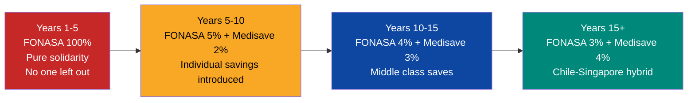

**The best of both worlds:**
- **From Chile (FONASA):** Solidarity, universal coverage from Day 1, no one excluded for lack of money
- **From Singapore (Medisave):** Individual ownership of savings, efficiency, cost awareness, 5% GDP with first-world outcomes

### Education: Universal Voucher + Schools as Autonomous Enterprises

> **K-12**: universal voucher funded by taxes (not by the FCV). **University**: merit-based voucher + **FCV Education Sub-account** (2-3% of salary). The worker accumulates savings that can be used for their own higher education or their children's.

**No child is left out. Every family chooses where their child studies — and the voucher pays.**

| Component | How it works | Model |
|-----------|-------------|-------|
| **Universal voucher (points system)** | Every child (K-12) receives a voucher with a **point cap** that covers: school + cafeteria + transport + 1 sport + 1 art/activity. **Price is set by the market** — each school and provider charges what they want, but the student pays with points up to the cap. If the school charges more than the cap, the family pays the difference. This generates competition: schools compete to offer more quality within the point range | [Chile SEP](https://www.mineduc.cl/) + [Finland: transport + cafeteria](https://www.oph.fi/) |
| **SEP voucher (+50%)** | Families below the poverty line receive a 50% larger voucher | [Chile Preferential School Subsidy](https://www.mineduc.cl/) |
| **Extracurricular voucher (points)** | The voucher includes a **point cap** for extracurricular activities. Mandatory minimum: **1 sport + 1 art or extra activity**. Points are spent at accredited providers — price is market-set, but the voucher has a cap. They do not need to be at the same school: the parent chooses any accredited provider (music academy, dojo, soccer school, robotics club, etc.). It is a plus if the school offers them internally | [Singapore CCA](https://www.moe.gov.sg/) — Co-Curricular Activities are mandatory |
| **Public schools → private enterprises** | Educational communities that organize to modernize and manage schools receive support: modernization funds + technical assistance + management autonomy | [Chile: subsidized schools](https://www.mineduc.cl/) — compete for vouchers |
| **Online schools** | Enabled as a valid option with official accreditation. Network of in-person and remote tutors for personalized support | [Uruguay Plan Ceibal](https://www.ceibal.edu.uy/) + [Khan Academy](https://www.khanacademy.org/) |
| **School auditing** | Every school that receives vouchers is audited: academic results, infrastructure, financial management. If it does not meet standards, it loses accreditation | [Chile: Education Quality Agency](https://www.agenciaeducacion.cl/) |
| **Teacher evaluation** | Teachers evaluated periodically on results, methodology, and professional development. Performance incentives: annual bonuses for the best | [Singapore: Enhanced Performance Management System](https://www.moe.gov.sg/) |

#### K-12 Voucher Amount (Up to Age 18)

| Component | Minimum | Optimal | Reference |
|-----------|---------|---------|-----------|
| Tuition / school operations | USD 80/month | USD 120/month | Teacher salaries + infrastructure. Chile: ~USD 100/month |
| School cafeteria | USD 25/month | USD 40/month | [Finland](https://www.oph.fi/): USD 50/month. [Chile JUNAEB](https://www.junaeb.cl/): USD 25/month |
| School transport | USD 15/month | USD 30/month | Concessioned routes. Finland: included |
| Extracurricular activities | USD 30/month | USD 50/month | 2-3 activities: language, sport, art/robotics |
| School materials + tablet | USD 10/month | USD 20/month | [Uruguay Ceibal](https://www.ceibal.edu.uy/): USD 10/month amortized |
| School insurance | USD 3/month | USD 5/month | Accident + liability |
| **TOTAL standard voucher** | **USD 163/month** | **USD 265/month** | **USD 1,956-3,180/year** (Chile: USD 3,200/year) |
| **SEP voucher (+50%)** | **USD 244/month** | **USD 397/month** | **USD 2,928-4,764/year** |

Gradual implementation (voucher grows with the economy):

| Phase | Standard voucher | SEP voucher | Coverage |
|-------|-----------------|-------------|----------|
| Emergency (Years 1-3) | USD 163/month | USD 244/month | Tuition + cafeteria + materials |
| Stabilization (Years 3-7) | USD 214/month | USD 321/month | + Transport |
| Construction (Years 7-12) | USD 265/month | USD 397/month | + Full extracurriculars |
| Maturity (Years 12+) | USD 295/month | USD 442/month | + Tablet/laptop + premium insurance |

#### New Curriculum Pillars

The curriculum is redesigned for the 21st century. Do not teach content from the 1990s — teach what will generate employment in 2035-2040:

| Pillar | From | Hours/week | Reference |
|--------|------|-----------|-----------|
| **Reading** | Preschool | 5-7 hrs (guided reading + library + home reading) | [Singapore: #1 PIRLS](https://pirls2021.org/results/achievement/overall/). [Finland: reading culture](https://worldpopulationreview.com/country-rankings/education-rankings-by-country) from preschool, libraries in every school |
| **English + second language** (Mandarin or Portuguese) | 1st grade | 10+ hrs (English), 3-5 hrs (2nd language) | [Singapore: mandatory bilingual from 1st grade](https://www.moe.gov.sg/) |
| **Sciences and STEM** | 1st grade | 6-8 hrs (lab + theory) | Singapore: #1 PISA science |
| **Robotics and programming** | 3rd grade | 3-5 hrs | [Estonia ProgeTiger](https://www.hitsa.ee/) from 1st grade |
| **Music, theater, arts** | 1st grade | 4-6 hrs | Finland: arts as a curricular pillar |
| **Financial literacy** | 5th grade | 2 hrs | Australia: financial literacy in national curriculum |
| **Critical thinking and debate** | 3rd grade | Integrated into all subjects | Finland: cross-curricular competencies |
| **Entrepreneurship** | 7th grade | 2 hrs | Junior Achievement: 100+ countries |

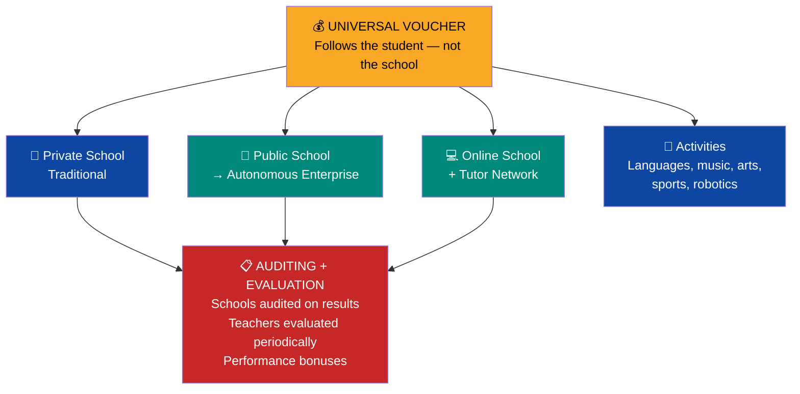

:::tip Why reading and languages as primary pillars?
**Reading:** [Singapore is #1 globally in PIRLS](https://pirls2021.org/results/achievement/overall/) (reading at age 10). Finland has the highest density of libraries per capita in the world. A child who reads at 7 learns everything else faster. **Reading is the multiplier for all other competencies.**

**Languages:** A developer who speaks English earns USD 3,000-6,000/month (global market) vs. USD 800-1,500/month in Spanish only. English multiplies income by 2-4x. Mandarin opens 1.4B people. Portuguese opens Brazil (220M). [Singapore](https://www.moe.gov.sg/) made mandatory bilingualism the foundation of its economic transformation.
:::

:::info Every school is a business and employment opportunity
When a school becomes an autonomous enterprise, it creates direct employment: principals, teachers, administrative staff, maintenance, kitchen, IT, security, online tutors. And it generates demand for goods and services: educational materials, technology, school meals, transport, uniforms.

The extracurricular voucher creates an **ecosystem of educational businesses**: musicians open music academies, artists teach visual arts, engineers develop edtech platforms, martial arts instructors open dojos, sports coaches create soccer/baseball/swimming schools — all competing for the student's voucher. Each activity is a viable business with guaranteed demand.

With ~25,000 educational centers + thousands of extracurricular providers, the system creates **500,000+ direct jobs** and an edtech market worth billions. All supervised and accredited by quality standards. The voucher is not just an educational mechanism — it is an economic engine.
:::

:::caution Lesson from Sweden and Chile: vouchers without controls lead to segregation
[Sweden](https://www.ifau.se/globalassets/pdf/se/2024/wp-2024-17-unpacking-the-impact-of-voucher-schools-evidence-from-sweden.pdf) and [Chile](https://www.newamerica.org/education-policy/edcentral/chiles-school-voucher-system-enabling-choice-or-perpetuating-social-inequality/) demonstrated that undifferentiated vouchers create segregation: private schools cherry-pick the best students. The solution: **differentiated voucher (SEP)** — higher value for lower-income students. Prohibition on income-based selection. [25 OECD countries](https://www.edchoice.org/school-voucher-systems-across-globe-make-case-school-choice-u-s/) use vouchers; those that work (Netherlands, post-SEP Chile) combine free choice + results auditing + differentiated funding.
:::

#### Education Risk Mitigation

| Risk | How it occurred elsewhere | Mitigation |
|------|--------------------------|-----------|
| **Income segregation** | Sweden and Chile: private schools select wealthy students | Prohibition on income-based selection. SEP voucher +50% for low income. Market and free choice correct |
| **Low-quality schools capture vouchers** | USA: unregulated charter schools produce worse outcomes | [Quality Agency](https://www.agenciaeducacion.cl/) audits annual results. School that fails standards loses accreditation; market loses trust, parents move vouchers elsewhere, school must take action or close |
| **Teachers not updating skills** | Current Venezuela: 1990s curriculum, no evaluation | Mandatory periodic evaluation. Performance bonuses. Funded continuing education. Non-compliance leads to improvement plan or reassignment |
| **Online schools without quality** | USA: virtual schools with 50% graduation rates | Mandatory in-person tutor network. Periodic in-person assessments. Study time monitoring |
| **Fraudulent extracurricular providers** | Collect voucher without delivering service | Mandatory accreditation + random audits + parent/student surveys. License revoked for fraud |
| **Teacher exodus** | Teachers with English skills emigrate for better pay | Competitive salaries from Day 1 (USD 500-800/month → USD 1,500-2,000 by year 10). Retention bonuses |
| **Unsafe transport** | Rural or high-crime areas | Concessioned school routes with security standards. GPS + real-time monitoring |

#### Higher Education: Merit-Based Voucher + Self-Sustaining Universities

**Every student has the opportunity to attend university — public or private. But the voucher is earned and maintained through effort.**

| Component | How it works | Model |
|-----------|-------------|-------|
| **VSA continues contributing (18-22)** | If the student attends university, **VSA continues depositing USD 120/month** to their FCV during the 4 years of study — same as during K-12. Investment in the citizen does not stop | [Singapore CPF](https://www.cpf.gov.sg/) — continuous contributions |
| **Merit-based university voucher** | Covers tuition (~USD 200/month). Obtained by academic performance (grades, admission) and maintained by semester effort. Funded by taxes | [Singapore: merit scholarships](https://www.moe.gov.sg/) + [Chile GRATUIDAD](https://www.mineduc.cl/) |
| **Maintaining the voucher (escalated loss)** | Semester requirements: pass minimum credits + minimum GPA. **Loss is gradual:** 1st underperforming semester: drops to 75% of voucher. 2nd: 50%. 3rd: 25%. 4th consecutive underperforming semester: loses voucher. Can recover 100% if they improve the following semester | Standard in international scholarships (Pell Grant, FAFSA) |
| **Parents' Education sub-account** | Parents accumulate 2-3% of their salary in the FCV Education Sub-account. Can transfer to children to supplement the university voucher | [Singapore CPF Education Scheme](https://www.cpf.gov.sg/) |
| **Special cases** | Illness, family emergency, disability: evaluation committee with clear protocols. Justified extensions, not automatic | [UK: mitigating circumstances](https://www.officeforstudents.org.uk/) |
| **Health + meals during studies** | Automatic FONASA health coverage with zero copay + university cafeteria for verified Tramo A/B students. **The student pays nothing out of pocket** | [Chile JUNAEB](https://www.junaeb.cl/) |
| **Public universities remain public** | UCV, USB, ULA, LUZ remain public institutions. They are not privatized. But they must seek partial self-sustainability | University autonomy maintained |

:::info How is university paid for? — 4 sources, zero debt for the student
| Source | Amount (4 years) | Who pays |
|--------|-----------------|----------|
| **Merit voucher** | USD 9,600 | Taxes (State) |
| **VSA continues contributing to FCV** | USD 5,760 | Sovereign fund (Venezuela S.A.) |
| **Parents' Education sub-account** | Variable | Parents' FCV |
| **Health + meals** | Covered | FONASA + JUNAEB |
| **Total invested** | **~USD 15,360** | **The student incurs ZERO debt** |

**ROI:** each USD 1 invested in university generates **USD 12** more in the citizen's FCV by age 65. A university graduate accumulates **USD 756K** vs. USD 463K without university — USD 190K more in difference and USD 348/month more in pension.
:::

#### Public Universities: Self-Sustainability Model

Public universities receive vouchers per student (not a fixed global budget), which compels them to compete on quality. Additionally, they generate their own income:

| Income source | How it works | Reference |
|--------------|-------------|-----------|
| **R&D + patents** | Research labs produce licensable patents. University retains % of royalties | [MIT: USD 2.1B in patent licenses](https://tlo.mit.edu/) |
| **Private alliances** | Companies fund chairs, labs, programs in exchange for access to talent and research | [Stanford: USD 1.8B/year in sponsored research](https://facts.stanford.edu/) |
| **Spin-offs and startups** | University incubators create companies. University retains minority equity | [Technion Israel: 1,600+ companies, USD 36B in value](https://www.technion.ac.il/) |
| **Consulting and services** | Faculties offer technical consulting to companies and government | [NUS Singapore: Enterprise](https://enterprise.nus.edu.sg/) |
| **Continuing education** | Executive courses, certifications, professional masters at market tuition | Standard at top global universities |
| **Donations and endowment** | Endowment fund that grows with alumni and corporate donations | [Harvard: USD 50B endowment](https://www.harvard.edu/) |

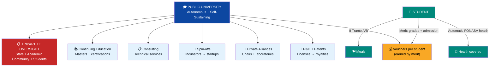

:::tip Universities as quality guarantors
The university is **responsible for the quality of the professionals it graduates**. If an engineering graduate cannot calculate, the university failed — not the student. Accreditation is linked to outcomes: graduate employability, research quality, self-generated income.

**The consequence is not fiscal — it is reputational:** a university that does not meet standards **loses accreditation**. That makes the market lose trust: employers do not hire its graduates, students do not choose it, companies do not form alliances. **Loss of accreditation forces the university to take concrete action** — reform programs, change leadership, improve infrastructure — to recover trust. The market punishes faster and harder than any state sanction.
:::

#### Governance: State as Supervisor, Not Operator

:::danger Governance principle: the State does NOT operate services — it supervises them
In healthcare and education, the State:
- **FUNDS**: collects FONASA contribution (healthcare) and assigns vouchers (education)
- **SUPERVISES**: defines quality standards and audits results
- **DOES NOT OPERATE**: does not manage hospitals, does not administer schools, does not run universities

Oversight is **tripartite**:

| Level | Who supervises | What they supervise |
|-------|---------------|-------------------|
| **State** | Quality Agency (education) + Health Superintendence | National standards, accreditation, use of public funds |
| **Community** | Local parent committees + neighborhood associations | Service quality, infrastructure, safety, treatment |
| **Users** | Parents/students (education) + patients (healthcare) | Satisfaction surveys, free choice (they vote with their feet) |

**Free choice IS oversight:** if a school is bad, parents move the voucher elsewhere. If a hospital gives poor service, the patient goes to another one. The market disciplines faster than any audit.
:::

---

## Tax Model: Reasonable Taxes

### Principles

1. **Simple:** Few taxes, easy to understand and pay
2. **Low:** Competitive rates that attract investment, not scare it away
3. **Digital:** 100% online filing and payment (Estonia model)
4. **Progressive where it matters:** Those who earn more pay more — but without excess
5. **No oil dependency:** Taxes cover the budget WITHOUT oil

### Proposed Tax Structure

| Tax | Rate | Comparison | Justification |
|-----|------|------------|---------------|
| **Personal income** | 15% flat (with exempt minimum) | [Estonia: 20%](https://www.emta.ee/en), [Georgia: 20%](https://www.rs.ge/), Chile: 0–40% | Flat tax = simple, low compliance cost, reduces evasion |
| **Corporate income** | 15% (distributed profits) | [Singapore: 17%](https://www.iras.gov.sg/), [Estonia: 20% only when distributed](https://www.emta.ee/en), Chile: 27% | Reinvestment = 0% (Estonia model). Only pays when distributing dividends |
| **VAT** | 12% | [Singapore GST: 9%](https://www.iras.gov.sg/), Chile: 19%, Colombia: 19% | Competitive for LATAM. Basic basket exempt |
| **Capital gains** | 0% (first 10 years) | [Singapore: 0%](https://www.iras.gov.sg/), Hong Kong: 0% | Attract investment. After: 10% |
| **SEEZ (special zones)** | 0% corporate for 10 years | [Argentina RIGI](https://www.upi.com/Top_News/World-News/2025/10/30/bcpargentina-RIGI-foreign-invetments-report/1561761834454/) | 30-year stability |
| **Property tax** | 0.5–1% of cadastral value | [Singapore: 0–20% progressive](https://www.iras.gov.sg/) | Funds municipalities |
| **Tariffs** | 0–5% general | Singapore: 0% | Open economy |

### How Much Does This Model Collect?

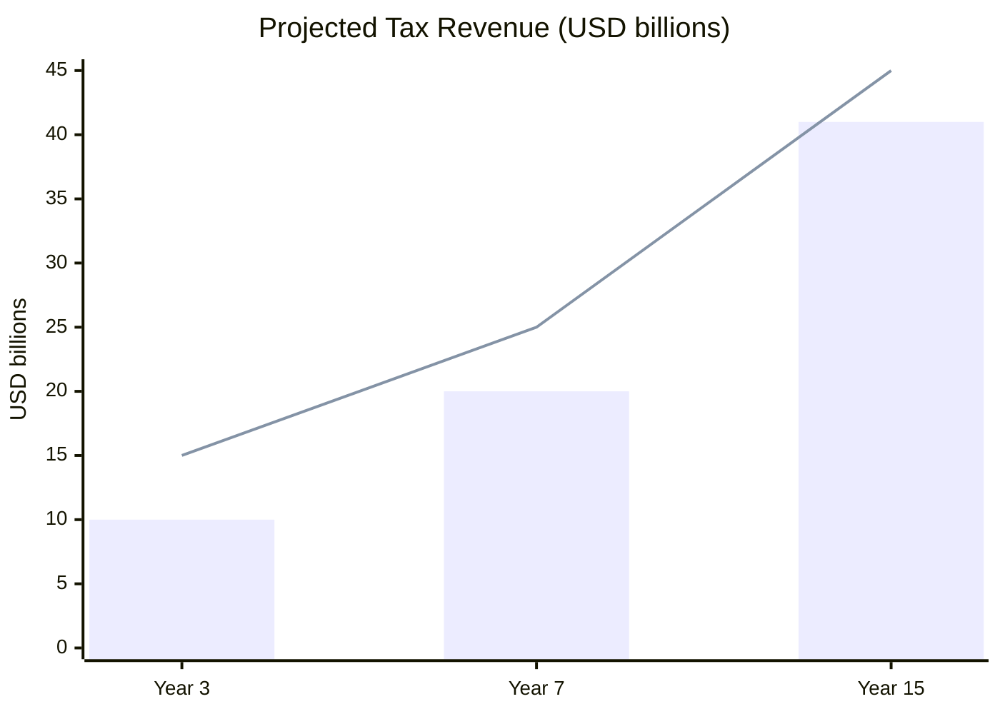

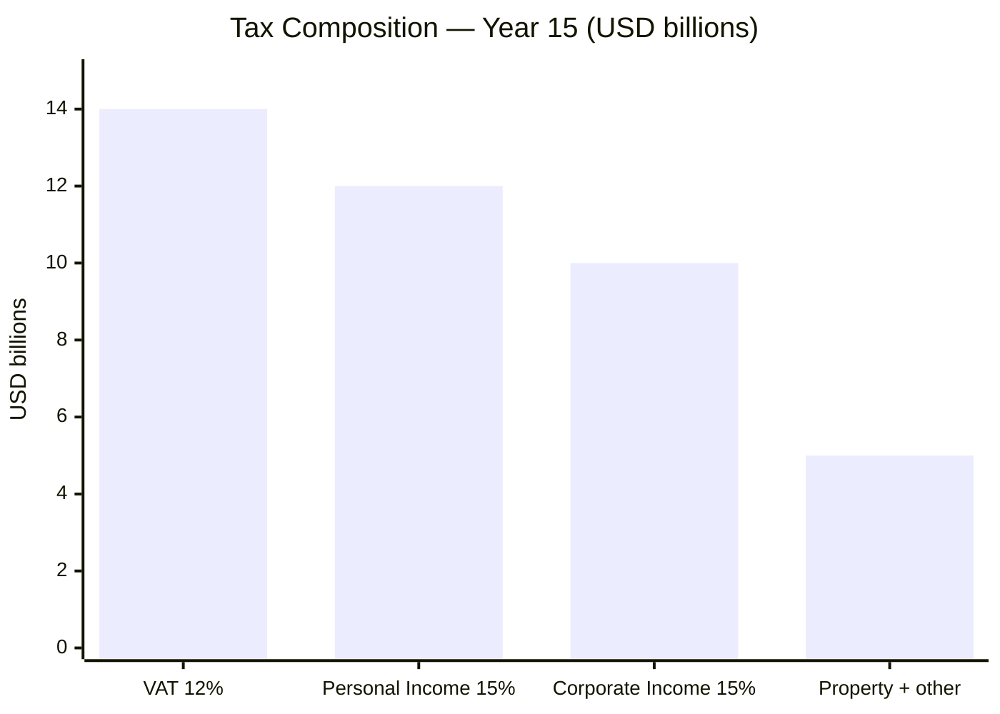

| Tax Source | Year 3 | Year 7 | Year 15 |
|------------|--------|--------|---------|
| Personal income (15% flat) | USD 3,000M | USD 5,500M | USD 12,000M |
| Corporate income (15%) | USD 2,000M | USD 5,000M | USD 10,000M |
| VAT (12%) | USD 4,000M | USD 7,000M | USD 14,000M |
| Property + other | USD 1,000M | USD 2,500M | USD 5,000M |
| **Total tax revenue** | **USD 10,000M** | **USD 20,000M** | **USD 41,000M** |
| **% of GDP** | ~10% | ~15% | ~18% |
| **Required budget** | USD 15,000M | USD 25,000M | USD 45,000M |
| **Deficit covered by** | Oil (transitional) | Investment Fund + other | Self-sufficient |

:::caution The high-tax trap
Venezuela under Maduro charges [15% payroll tax](https://central-law.com/en/venezuela-law-on-the-protection-of-social-security-pensions/) just for pensions. Colombia charges 19% VAT. Argentina has 100+ different taxes. Result: massive evasion, informality, and corporate flight. The Venezuela S.A. model bets on LOW rates with a BROAD base (formalization + digital taxation).
:::

---

## Comparison: Efficient State Models

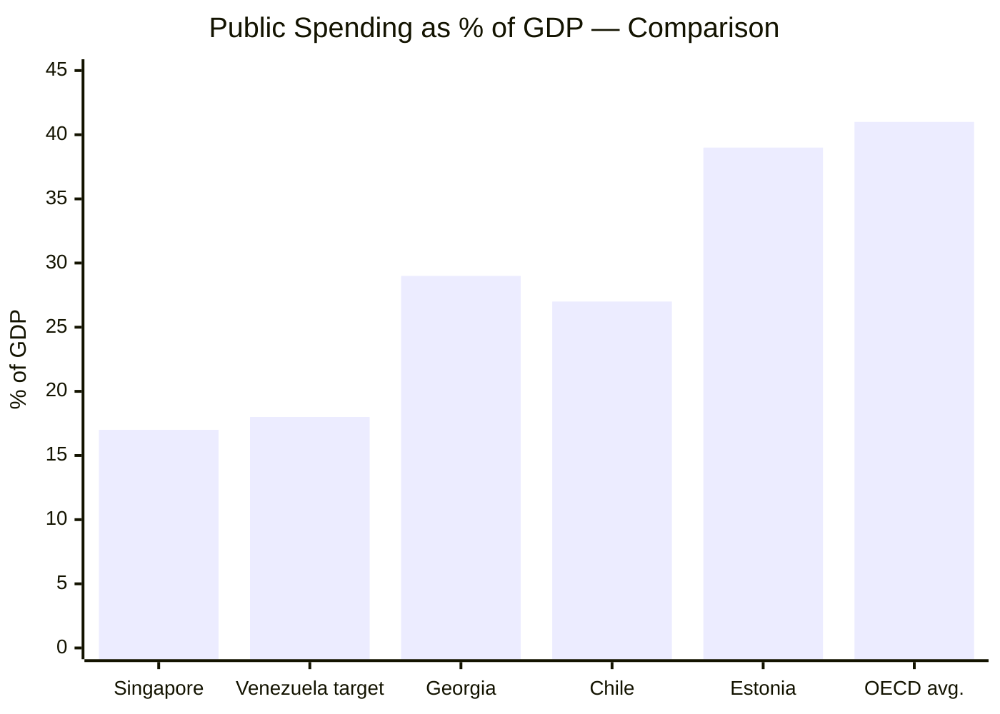

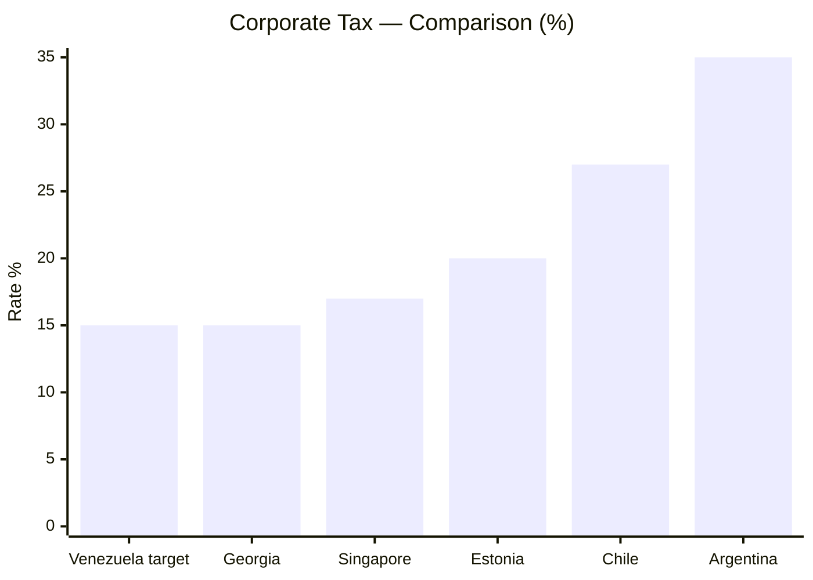

| Indicator | Singapore | Estonia | Georgia | Chile | Venezuela (target) |
|-----------|----------|---------|---------|-------|-------------------|
| Public spending/GDP | [~17%](https://www.mof.gov.sg/singaporebudget) | ~39%* | ~29% | ~27% | 18–22% (transition) -> 15–18% |
| Income tax (persons) | 0–24% | [20% flat](https://www.emta.ee/en) | [20% flat](https://www.rs.ge/) | 0–40% | 15% flat |
| Income tax (corporate) | [17%](https://www.iras.gov.sg/) | [20% (distributed only)](https://www.emta.ee/en) | [15%](https://www.rs.ge/) | 27% | 15% |
| VAT/GST | [9%](https://www.iras.gov.sg/) | 22% | 18% | 19% | 12% |
| Pensions | CPF (37%) | 3 pillars | Private | AFP (10%) | Unified FCV (23%) |
| Doing Business ranking | #2 | #18 | #7 | #59 | Target: Top 20 |
| Infrastructure | PPP | Digital | Reformed | Concessions | Concessions |

*Estonia: high spending/GDP because of EU membership — includes European social transfers. Actual state spending is lower.

---

## Roadmap

| Phase | Action | Timeline |
|-------|--------|----------|
| Day 1 | Decree: oil to the Venezuela S.A. Investment Fund (see [Fiscal Transition](/02-motor-financiero/transicion-fiscal)). [OFAC License 46B](https://www.infobae.com/venezuela/2026/03/14/eeuu-autorizo-a-las-empresas-estadounidenses-realizar-negocios-con-el-sector-petrolero-venezolano/) already enables all U.S. companies to operate (issued March 14, 2026) | Immediate |
| Month 1–6 | Express tax reform: 15% flat + 12% VAT + digitalization | Semester 1 |
| Year 1 | Concession law: infrastructure + hospitals + housing | Year 1 |
| Year 1–2 | Citizen Fund Venezuela (FCV): 5 sub-accounts (retirement + health + housing + education + severance) + universal Pillar 1 | Year 1–2 |
| Year 2–3 | FCV Health operational: universal coverage (contributory). ISAPRE as private option | Year 2–3 |
| Year 3–5 | Tax base >15% of GDP → State self-sufficient without oil | Year 3–5 |
| Year 7+ | Convergence to Singapore model: public spending <18% GDP | Long term |
| Year 15 | **State lives 100% on taxes. Oil 100% to the fund.** | Final target |

---

## State Reform: Surgical Shock Therapy

> If you need to cut, you cut. But with a scalpel, not a machete. You eliminate redundancy, not essential services.

### Principle: Surgical and Sequenced Cuts — Not Milei-Style Shock

:::caution This is NOT Milei-style austerity
The State shrinks 90% over 10 years — but **only when the private sector is ALREADY absorbing.** No ministry closes until concessions are operating. No one is fired without [3 options](#what-happens-to-the-people). Model: [Georgia 2004](https://www.worldbank.org/en/country/georgia) + [Singapore 1965](https://eresources.nlb.gov.sg/), not Argentina 2024. See [detailed comparison](/02-motor-financiero/transicion-fiscal#comparison-with-the-milei-model-argentina-this-is-not-shock-therapy).
:::

The Venezuelan State has ~2.5 million public employees, dozens of duplicated ministries, clientelist missions with no accountability, and state enterprises that lose money. State enterprises are privatized or transferred to Venezuela S.A. as assets of the citizen holding — the State does not operate companies. The reform is **surgical and sequenced** — each step requires the previous one to work:

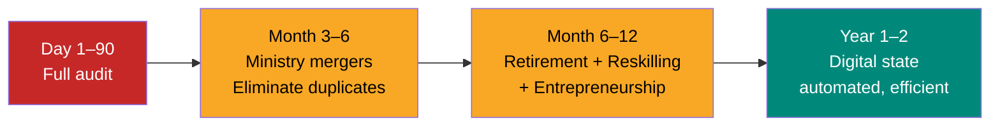

### From 34 Ministries to 10: Target Structure

:::danger 24 ministries are eliminated or merged
The State **supervises, does not operate**. Oil, mining, agriculture, tourism, housing, industry are operated by Venezuela S.A. or the private sector. The State does not need a ministry for every sector it does not manage.
:::

#### The 10 ministries and their functions

| # | Ministry | Functions | Target employees | Digital |
|---|----------|----------|-----------------|---------|
| 1 | **Presidency and Government** | Inter-ministerial coordination, strategic planning, relations with Venezuela S.A., cabinet | 1,500 | Real-time management dashboard |
| 2 | **Finance and FCV** | Tax collection (15% flat + 12% VAT), administration of the Citizen Fund Venezuela (5 sub-accounts), national budget, fiscal auditing | 12,000 | Automatic filing in 3 minutes ([Estonia](https://e-estonia.com/)). FCV: single app for 40M accounts |
| 3 | **Foreign Affairs** | Diplomacy, trade agreements, embassies/consulates (50+), protection of Venezuelans abroad, diaspora return | 3,000 | 100% online consular procedures |
| 4 | **Defense** | Complete armed forces (Army, Navy, Air Force, professionalized National Guard), borders (Colombia/Brazil/Guyana), Caribbean coast, counter-narcotics, intelligence, military cybersecurity. **Bolivarian militia: ELIMINATED** (political instrument, not military) | 80,000 active + 3,000 civilian admin | Drone + AI border surveillance. Professional force, not politicized |
| 5 | **Interior, Justice and Security** | National police (130K: [UN recommends 300/100K pop.](https://ourworldindata.org/grapher/police-officers-per-1000-people)), courts (8K), prison system (12K), civil registries, rights protection (women, indigenous, minorities), immigration | 155,000 | AI predictive policing. 80% virtual courts. Single digital case file. Cameras + recognition. Initially 170K police (high crime), decreases to 130K with AI |
| 6 | **Health** (supervisor) | Supervises quality of concession hospitals, accredits clinics, audits FCV Health, regulates medications, epidemiology | 3,000 | Single digital medical record. Telemedicine. 99% digital prescriptions ([Estonia](https://e-estonia.com/)) |
| 7 | **Education** (supervisor) | Supervises autonomous schools, accredits universities, defines national curriculum, administers K-12 vouchers, evaluates teachers | 3,000 | Digital voucher (points). Online evaluations. Quality dashboard per school |
| 8 | **Infrastructure and Services** | Supervises concessions: water, electricity, telecoms, transport, ports, airports. Environmental regulation. Digital permits | 2,500 | Automatic permits if standards met ([Singapore BCA](https://www.bca.gov.sg/)). IoT infrastructure monitoring |
| 9 | **Economy and Labor** | Labor regulation, formalization, competition, domestic/foreign trade, consumer protection, SEEZs | 2,000 | Company registration in 15 minutes. Digital monotax |
| 10 | **Digital and Technology** | Digital state (central platform), cybersecurity, digital identity, open data, government AI, interoperability | 5,000 | **IS** the digital infrastructure that enables the other 9 ministries |

#### The 24 ministries that are eliminated

| Current ministry | Destination | Reason |
|-----------------|------------|--------|
| Oil | → Venezuela S.A. | VSA manages oil JVs. Not a State function |
| Mining | → Venezuela S.A. | VSA manages mining JVs |
| Electric Energy | → Infrastructure | Regulated concessions |
| Water | → Infrastructure | Regulated concessions |
| Transport | → Infrastructure | Regulated concessions |
| Public Works | → Infrastructure | Regulated concessions |
| Housing | → **Eliminate** | FCV Housing + private sector builds |
| Agriculture | → **Eliminate** | Private sector. VSA shareholder in agricultural JVs |
| Fisheries | → **Eliminate** | Private sector |
| Tourism | → **Eliminate** | Private sector. Promotion from Economy |
| Industries | → **Eliminate** | Private sector |
| Domestic Commerce | → Economy | Merge |
| Food (CLAP) | → **Eliminate** | Free market + targeted voucher |
| Communes | → **Eliminate** | Clientelism with no justification |
| Sports | → **Eliminate** | Extracurricular voucher funds sports |
| Culture | → **Eliminate** | Extracurricular voucher + private sector |
| Youth | → **Eliminate** | FCV + voucher cover youth |
| Women and Equality | → Interior and Justice | Integrated legal protection |
| Indigenous Peoples | → Interior and Justice | Integrated constitutional rights |
| Communication and Information | → **Eliminate** | State should not own propaganda media |
| Ecosocialism | → **Eliminate** | Environmental regulation integrated into Infrastructure |
| Environment | → Infrastructure | Environmental regulation of concessions |
| Planning | → Presidency | Merge |
| Science and Technology | → Digital | Merge |
| University Education | → Education | One ministry supervises K-12 + university |

#### Public employees: target by phase

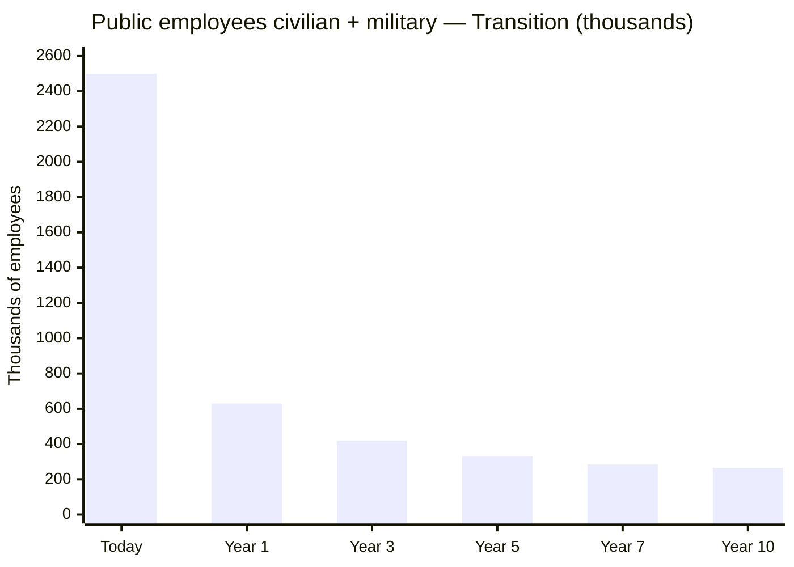

| Phase | Civilians | Armed Forces | Total | What changes |
|-------|-----------|-------------|-------|-------------|
| **Today** | **2,370,000** | **130,000** + 220K militia | **2,500,000+** | State operates EVERYTHING. Militia = political instrument |
| **Year 1** | **550,000** | **80,000** | **630,000** | Merge 34 → 10 ministries. Enterprises → VSA. Missions closed. Militia eliminated. Armed forces professionalized |
| **Year 3** | **340,000** | **80,000** | **420,000** | 50% teachers already in autonomous schools. Hospitals in concession |
| **Year 5** | **250,000** | **80,000** | **330,000** | 80% autonomous schools. AI in policing. Digital procedures |
| **Year 7** | **205,000** | **80,000** | **285,000** | 80% virtual courts. Automatic tax filing. 95% autonomous schools |
| **Year 10** | **185,000** | **80,000** | **265,000** | Mature digital state. All services in concession or autonomous |

**Target: 265,000 total employees** (185K civilians + 80K military) — the best paid in LATAM.

| Comparison | Civilians | Military | Total | Population | Ratio |
|------------|-----------|----------|-------|-----------|-------|
| [Singapore](https://www.careers.gov.sg/who-we-are/the-singapore-public-service/) | 158,000 | 50,000 | 208,000 | 5.9M | 1:28 |
| Chile | ~400,000 | 80,000 | 480,000 | 19M | 1:40 |
| **Venezuela target** | **185,000** | **80,000** | **265,000** | **40M** | **1:151** |
| Venezuela current | 2,370,000 | 350,000+ | 2,720,000 | 32M | 1:12 |

:::caution Lean but functional State
1:151 is aggressive but viable because: (1) 100% digital state — [Estonia saves 2% GDP](https://e-estonia.com/) with e-gov, (2) healthcare/education operated by private/autonomous entities — not public employees, (3) unified FCV replaces 5 bureaucracies, (4) AI in policing/justice/taxation, (5) U.S. as security ally reduces military needs. If digitalization fails, the model fails — that is why the Ministry of Digital is the backbone.
:::

#### Transition plan for 2.37M displaced officials

### What Happens to the People

No one gets thrown out on the street without an alternative. **Three options for every displaced public employee:**

| Option | For Whom | Mechanism |
|--------|----------|-----------|
| **Early retirement** | Officials >50 years old with >15 years of service | Pillar 1 pension + retirement bonus (6-12 months of salary) |
| **Workforce reconversion** | Officials <50 years old with reusable skills | 6-month training program (tech, concessions, healthcare, education) + relocation to private sector or concessions |
| **Entrepreneurship** | Officials with entrepreneurial drive | Direct access to Semilla/Ignite Venezuela programs (see [Startups](/05-transformacion/startup-programs)) + seed capital + 2-year tax exemption |

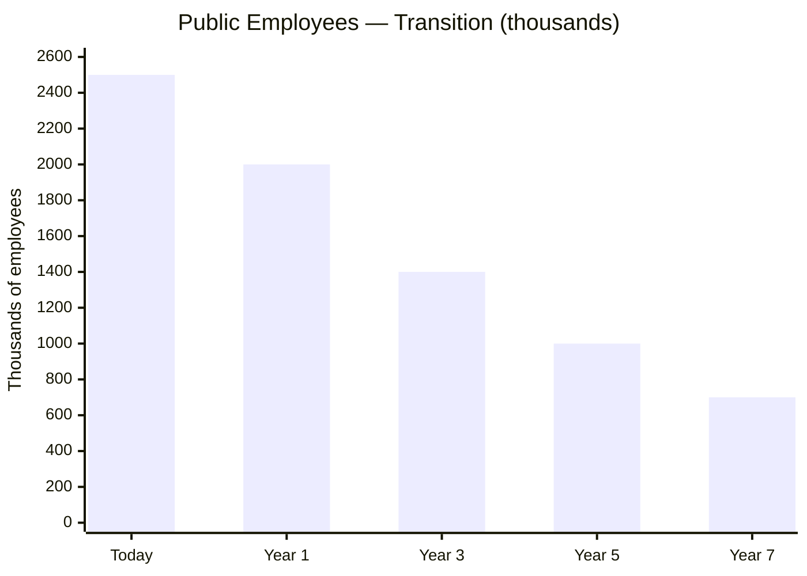

:::info From 2.5M to 700 thousand
Singapore governs 5.9M people with ~150 thousand public employees. Estonia governs 1.3M with ~130 thousand. Venezuela with 40M does NOT need 2.5M public officials. With automation + concessions, the target is ~700 thousand public employees by Year 7 — the best paid in LATAM, in the 5 essential functions.
:::

---

### Recovery of Diverted Public Funds

> Every person or company that received public funds for a project and did not deliver results must be held accountable.

| Action | Detail | Priority |
|--------|--------|----------|
| **Specialized prosecutor's office** | Unit dedicated to fraud against the State. Independent, with retroactive jurisdiction | Year 1 — begins investigating |
| **Audit of contracts 2000–2025** | Review all public contracts >USD 1M. Identify unfinished works, overbilling, ghost contracts | Year 1–2 |
| **Civil and criminal legal actions** | Lawsuits against companies and individuals who received funds and did not deliver | Year 1–5 (not top priority but in progress) |
| **International cooperation** | Asset tracing abroad via INTERPOL, OFAC, Transparency International | Year 1+ |
| **Whistleblower incentive** | 10–30% of recovered funds for whoever reports (model [SEC Whistleblower](https://www.sec.gov/whistleblower)) | From Day 1 |
| **Destination of recovered funds** | **100% to the Venezuela S.A. Investment Fund** — not to the current budget | Permanent |

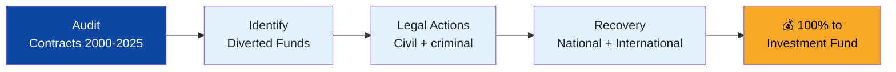

:::caution Not revenge — accountability
The objective is not political persecution. It is that whoever stole must return the money. Whoever failed to fulfill a contract must answer. This sends a clear signal to future contractors and officials: in Venezuela S.A., public money has an owner — 40 million shareholders.
:::

---

## Transition from Poverty: The Realistic Path

With 82.8% poverty, the final model is not implemented on Day 1. There is a transition:

| Phase | Country Status | Role of the State | Role of Private Sector | Funding |
|-------|---------------|-------------------|------------------------|---------|
| **Emergency (Year 1)** | Extreme poverty, no institutions | State provides basic services: healthcare, food, minimum pension, temporary public employment. Venezuela S.A. launches forward contracts and first concessions | Almost none — there is no market | 100% Venezuela S.A. revenue (oil) + humanitarian emergency |
| **Stabilization (Years 2–3)** | Poverty declining, dollarization stable | State maintains universal floor. Venezuela S.A. tenders concessions and collects royalties | First concessions (telecommunications, ports) + FCV operational (14%) | 80% Venezuela S.A. revenue + 20% growing taxes |
| **Construction (Years 4–7)** | Poverty <50%, formal economy growing | State reduces direct operations. Supervises health and education. Venezuela S.A. manages concessions + Investment Fund | FCV at 18% (housing sub-account opens), ISAPREs launching, concessions underway | 50% taxes + 50% Investment Fund (Venezuela S.A.) |
| **Maturity (Years 8–15)** | Poverty <25%, growing middle class | State only supervises the 5 functions. FCV at 23-27% self-funded | Mature FCV. Private sector operates infrastructure, hospitals, schools. ISAPRE active | 100% taxes. Oil → fund. FCV self-funded |

### Protection During the Transition

| Mechanism | For Whom | Duration |
|-----------|----------|----------|
| **Universal basic pension** (USD 50->200/month) | EVERY retiree, from Day 1 | Permanent (Pillar 1) |
| **Universal health: FCV Health from Day 1** | EVERY citizen covered from Day 1. 7% salary contribution (FCV Health Sub-account). Tramos A/B: 0% copay | Permanent (FCV Health solidarity + optional ISAPRE) |
| **Food voucher** | Households below poverty line, income-verified | Transitional (Years 1–5) — decreases as income rises |
| **Temporary public employment** | Unemployed during reconstruction | Transitional (Years 1–3) — labor-intensive infrastructure |
| **Housing voucher** | Homeless or overcrowded households, verified | Permanent (Chile model: demand-side voucher, family chooses where) |
| **Universal education: portable voucher** | EVERY child receives a voucher. Schools compete as private enterprises for vouchers. +50% for low income | Permanent (Chile SEP model — public schools transition to autonomous enterprises) |
| **Citizen dividend** | EVERY Venezuelan (when the fund allows it) | From Year 3+ (see [Citizen Investment](/03-ciudadanos/inversion-ciudadana)) |

:::info Not austerity — graduation
The objective is NOT to take away aid. It is for people to NO LONGER NEED IT because they have a job, their own pension, health insurance, and opportunities. The State does not disappear — it shrinks because people prosper. The best social policy is a good job.
:::

---

## Automated State: Minimum Friction, Maximum Results

> Everything that can be automated will be automated.

| Process | Today | Target | Model | Savings |
|---------|-------|--------|-------|---------|
| **Tax filing** | Manual, in-person, corrupt | Automatic, pre-filled by the system | [Estonia: 3 minutes](https://e-estonia.com/) | 95% of administrative cost |
| **Business registration** | 30+ steps, weeks | 1 click, 15 minutes | [Estonia e-Residency](https://e-estonia.com/) / [Georgia: #7 Doing Business](https://www.rs.ge/) | 90% of time |
| **Construction permits** | Months, bribes | Digital, automatic if it meets standards | Singapore: BCA | 80% of time |
| **Healthcare procedures** | In-person, queues | Digital prescriptions, unified medical records, telemedicine | [Estonia: 99% digital prescriptions](https://e-estonia.com/) | 70% of cost |
| **Civil justice** | Years | Months. 80% of cases resolved online | [UK: Online Courts](https://www.judiciary.uk/) | 60% of cost |
| **Policing** | Improvised patrolling | Predictive (AI), cameras, real-time data | [Singapore Safe City](https://www.police.gov.sg/) | Crime reduction |
| **Public procurement** | Opaque, corrupt | 100% digital, open, AI-auditable | [South Korea: KONEPS](https://www.pps.go.kr/eng/) | 15–20% savings + anti-corruption |
| **Citizen identity** | Physical ID card, forgeable | Digital identity with electronic signature | [Estonia ID](https://e-estonia.com/) | Foundation for everything else |

:::tip The automation dividend
[Estonia saves 2% of GDP](https://centreforpublicimpact.org/public-impact-fundamentals/e-estonia-the-information-society-since-1997/) with digital government. For Venezuela, that would mean USD 4,000+ M/year at the target GDP. Fewer officials, less corruption, fewer queues, more speed. The State does not need 2 million public employees if it automates 80% of processes.
:::

### Reducing State Dependency

| Today | Target |
|-------|--------|
| Millions depend on CLAP boxes to eat | Formal employment that allows buying food freely |
| USD 3.50/month pension = total dependency | FCV Retirement + dignified Pillar 1 = independence |
| Healthcare: go to the public hospital or die | FCV Health (7% contribution) + ISAPRE for those who want more |
| Housing: waiting for the government to build | FCV Housing (4-5% of salary) = own home. Targeted voucher only for extreme poverty |
| Employment: cronyism and clientelist missions | Free labor market, SEEZs, startups, concessions |

**The State is not your parent. It is your platform.** It creates the conditions for every person to build their own life. And for those who cannot — yet — there is the universal floor until they can.

---

:::danger The ultimate objective
Year 15: Venezuela funds its State WITH taxes. Oil goes to the Venezuela S.A. Investment Fund managed by Venezuela S.A. — not by the State. Fund returns (4-5%) supplement via citizen dividend. The unified FCV (retirement + health + housing + education + severance) makes every citizen the owner of their future. Infrastructure is operated by the private sector in concessions where Venezuela S.A. is a shareholder. The State is small, digital, automated, and efficient — it only supervises and provides its 5 functions. Freedom of life, economic freedom, and religious freedom are constitutional. No one depends on the government to live. That is the model.
:::

---

## How Everything Is Funded: From the Current Crisis to the FCV Model

> Where does the money come from? Venezuela has a GDP of USD 83B, 82.8% poverty, and a State that spends USD 22.7B/year. How do you pay for the FCV, the vouchers, universal healthcare, and pensions?

### Total Model Cost

| Component | Who pays | Annual cost (Year 1) | Annual cost (Year 7) | Annual cost (Year 15) |
|-----------|---------|---------------------|---------------------|----------------------|
| **FCV child contributions (0-17)** | Venezuela S.A. (Investment Fund + JVs) | USD 5B (partial, scaled up) | USD 10B | USD 14B |
| **FCV worker contributions (23%)** | Workers + employers | Self-funded | Self-funded | Self-funded |
| **University voucher (merit)** | Taxes | USD 0.5B | USD 1B | USD 2B |
| **Pillar 1 pension (current retirees)** | Taxes | USD 4B | USD 6B | USD 8B |
| **Health solidarity Tramo A/B** | Taxes | USD 3B | USD 2B | USD 1B (decreases with poverty) |
| **5 State functions** | Taxes | USD 10B | USD 15B | USD 25B |
| **TOTAL public spending** | | **USD 22.5B** | **USD 34B** | **USD 50B** |
| **TOTAL as % GDP** | | **27% (emergency)** | **17% (stabilization)** | **14% (maturity)** |

### Where the Money Comes From — Phase by Phase

```mermaid
xychart-beta
    title "Funding Sources by Phase (USD billions)"
    x-axis ["Year 1", "Year 3", "Year 7", "Year 15"]
    y-axis "USD billions" 0 --> 55
    bar [14, 16, 18, 10]
    bar [5, 8, 12, 25]
    bar [0, 2, 4, 15]
```

| Source | Year 1 | Year 3 | Year 7 | Year 15 |
|--------|--------|--------|--------|---------|
| **Oil** (Venezuela S.A.) | USD 14B (100%) | USD 16B (80%) | USD 18B (45%) | USD 10B (10% -> fund) |
| **Taxes** (State) | USD 5B (28%) | USD 8B (35%) | USD 12B (40%) | USD 25B (50%) |
| **FCV workers** (self-funded) | USD 1B | USD 4B | USD 8B | USD 15B |
| **Investment Fund returns** | USD 0 | USD 0.5B | USD 2B | USD 10B |
| **Concessions + JVs** | USD 0.5B | USD 2B | USD 5B | USD 8B |
| **TOTAL available** | **USD 20.5B** | **USD 30.5B** | **USD 45B** | **USD 68B** |

### Implementation Sequence from Current Situation

:::danger The sequence matters — you cannot do everything on Day 1
With USD 83B GDP and 82.8% poverty, the complete model (FCV at 23%, USD 265/month voucher, 5 sub-accounts) is impossible on Day 1. It is built in phases. **Each phase is funded by what the previous one generates.**
:::

| Phase | What is implemented | How it is funded | Cost |
|-------|-------------------|-----------------|------|
| **Day 1-90** | Pillar 1 pension (USD 50/month). Emergency healthcare. Temporary infrastructure employment | 100% oil (Venezuela S.A.) + humanitarian aid | USD 5-8B/year |
| **Months 3-12** | FCV launches at 14% (retirement 8% + health 6%). Basic K-12 voucher (USD 163/month). Teacher salaries x5 | Oil 80% + first taxes 20% | USD 15-18B/year |
| **Years 2-3** | FCV rises to 18% (housing 4% added). Voucher grows to USD 214/month. First concessions generate revenue | Oil 60% + taxes 35% + concessions 5% | USD 22-28B/year |
| **Years 4-7** | FCV at 23% (education 2% + severance 2% added). Voucher at USD 265/month. University with merit voucher. Investment Fund grows | Taxes 40% + oil 30% + FCV self-funded + fund 5% | USD 30-40B/year |
| **Years 8-15** | FCV at 27%. Maturity voucher (USD 295/month). Pillar 1 rises to USD 200/month. Health introduces individual Medisave | Taxes 50% + Investment Fund 20% + FCV self-funded + diversification | USD 45-55B/year |

### The Key: Worker FCV Is SELF-FUNDED

The biggest cost of the model is NOT public spending. The 23% FCV contribution is paid by **workers + employers** — not the government. That means:

| Year | Formal workers | Average salary | FCV 23% monthly | Total FCV/year |
|------|---------------|----------------|-----------------|----------------|
| 1 | 5M | USD 250/month | USD 57/month | **USD 3.4B** |
| 7 | 10M | USD 500/month | USD 115/month | **USD 13.8B** |
| 15 | 15M | USD 800/month | USD 184/month | **USD 33.1B** |

**USD 33B/year from FCV is not public spending** — it is mandatory savings by the citizen in their own account. The State only collects and supervises. The money belongs to the worker.

### What the Government DOES Pay (and How Much)

Only 4 items require direct public funding:

| Item | Year 1 | Year 7 | Year 15 | Source |
|------|--------|--------|---------|--------|
| **FCV children (VSA)**: USD 150/month x children | USD 5B | USD 10B | USD 14B | Venezuela S.A. (JV dividends + Investment Fund) |
| **Pillar 1 pension**: current retirees | USD 4B | USD 6B | USD 3B (decreases as FCV matures) | Taxes |
| **Health solidarity Tramo A/B** | USD 3B | USD 2B | USD 1B (decreases with economy) | Taxes |
| **University voucher** | USD 0.5B | USD 1B | USD 2B | Taxes |
| **TOTAL direct public burden** | **USD 12.5B** | **USD 19B** | **USD 20B** | |

The rest of the budget (government, justice, security) is funded by taxes like any normal country.

:::info Is it viable with USD 83B GDP?
**Year 1:** USD 22.5B total spending = 27% of GDP. High, but fundable because oil generates USD 14B and there is humanitarian aid. It is an emergency — spend what is needed.

**Year 7:** USD 34B total spending = 17% of a USD 200B GDP. Perfectly viable — Singapore spends 17%.

**Year 15:** USD 50B total spending = 14% of a USD 350B GDP. The most efficient State in LATAM. And the FCV's USD 33B/year is self-funded — it does not count as public spending.

**The model pays for itself because oil funds the transition and taxes take over.** Each year oil contributes less to the budget and more to the Venezuela S.A. Investment Fund. By year 15, 100% of oil goes to the fund and the State lives on taxes. That is the design.
:::

---

## Appendix: Example — FCV Lifecycle with Minimum Wage

> What happens to a Venezuelan who is born, studies, works on minimum wage their entire life, buys a home, has children, and retires? This example uses the most conservative numbers possible.

**Assumptions:** Fund return 5% annual (professionally invested like [Norway NBIM](https://www.nbim.no/en/) / [Singapore GIC](https://www.gic.com.sg/)). Minimum wage grows with the plan: USD 250 -> 1,200/month.

### Phase 1: Birth to Age 18 (VSA Invests)

Venezuela S.A. deposits **USD 150/month** to every child's FCV. From there, their healthcare and education are paid:

| Period | VSA deposits | Health (FONASA minor) | Education (K-12 voucher) | Net savings accumulated |
|--------|-------------|----------------------|--------------------------|------------------------|
| 0-4 years | USD 9,000 | USD 1,800 | — | **USD 8,355** |
| 5-17 years | USD 23,400 | USD 4,680 | USD 15,600 | **USD 20,218** |
| **TOTAL** | **USD 32,400** | **USD 6,480** | **USD 15,600** | **USD 20,218** |

**At age 18:** VSA invested USD 32,400 in this citizen. It funded 18 years of healthcare and 13 years of K-12 education. And **USD 20,218 in savings** remain thanks to compound interest.

### Phase 2: Age 18 to 65 (Worker + Employer Contribute)

Starts with USD 20,218 inherited from Phase 1 and a minimum-wage job:

| Age | Salary | Retirement | Health | Housing | Education | **Total FCV** |
|-----|--------|-----------|--------|---------|-----------|--------------|
| 25 | USD 600/month | USD 15,392 | USD 11,619 | USD 7,189 | USD 3,138 | **USD 37,339** |
| 30 | USD 800/month | USD 23,389 | USD 17,930 | USD 11,048 | USD 4,992 | **USD 57,359** |
| 32 | — | — | — | **Buys home** (USD 13,213 down payment) | — | — |
| 40 | USD 1,000/month | USD 51,572 | USD 38,638 | USD 5,210 | USD 12,173 | **USD 107,593** |
| 48 | — | — | — | — | **Child 1 → university** (USD 10,835) | — |
| 52 | — | — | — | — | **Child 2 → university** (USD 9,075) | — |
| 60 | USD 1,200/month | USD 182,962 | USD 134,806 | USD 36,887 | USD 13,270 | **USD 367,925** |
| **65** | **Retirement** | **USD 228,908** | **USD 168,419** | **USD 48,095** | **USD 18,085** | **USD 463,508** |

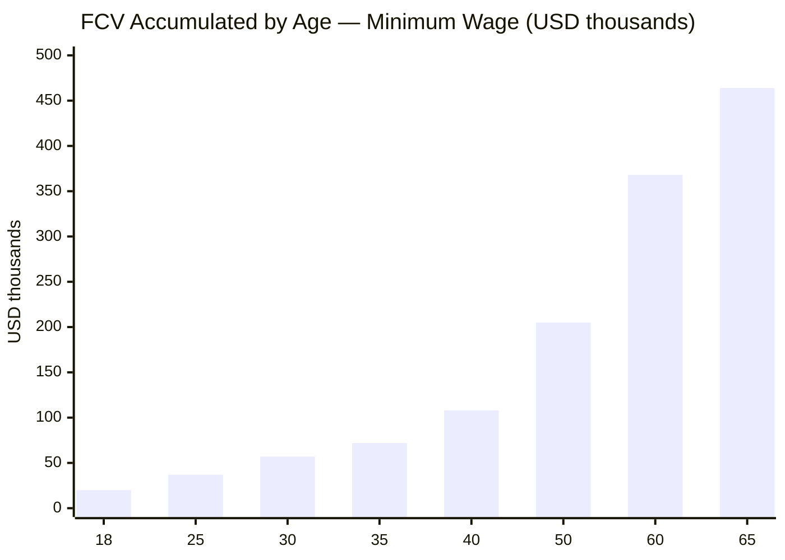

### Result at Age 65

| Achievement | Detail |
|-------------|--------|
| **Monthly pension** | **USD 1,408/month** (FCV Retirement + universal Pillar 1) |
| **Replacement rate** | **117%** of last salary |
| **Own home** | Purchased at 32 with housing sub-account + mortgage credit |
| **Children graduated** | 2 children with university paid from education sub-account |
| **Lifetime healthcare** | USD 168,419 accumulated + FONASA retiree |
| **Total FCV** | **USD 463,508** |

### The Compound Interest Math

| Source | Amount |
|--------|--------|
| VSA invested (0-17 years) | USD 32,400 |
| Worker + employer contributed (18-65) | USD 122,676 |
| **Compound interest generated** | **USD 320,614** |
| **TOTAL** | **USD 463,508** |

**Compound interest generated more than all contributions combined.** That is why the fund is professionally invested like [Norway](https://www.nbim.no/en/) (average return 6.3% real) or [Singapore GIC](https://www.gic.com.sg/) (return 3.9% real over 20 years).

:::info The social contract made tangible
Venezuela S.A. invests USD 32,400 in every citizen before they earn their first paycheck. In return, that citizen contributes to the system for 47 years, generates USD 463,508, buys their home, educates their children, and retires on USD 1,408/month. **They do not depend on the government. They do not need a subsidy. They own their life.** That is the Venezuela S.A. model: the country bets on you first, and you return it multiplied.
:::

### Why USD 32,400 Is Venezuela S.A.'s Best Investment

> It's not charity. It's the investment with the best ROI in the entire plan.

| Recovery Mechanism | Figure | How It Works |
|---|---|---|
| **FCV management fee** | 0.5% AUM/year | VSA manages the fund professionally. With 24M mature accounts (USD 463K average), AUM is ~USD 11T. Fee 0.5% = USD 55B/year |
| **The citizen self-funds from age 18** | 23% of salary | VSA stops contributing USD 150/month. The citizen contributes ~USD 115-460/month depending on salary. Payback: 12-23 years |
| **Taxes to the State** | 15% flat + 12% VAT | The productive citizen pays USD 900-3,600/year in taxes x 40 years = USD 36,000-144,000. The State recovers more than what VSA invested |
| **Heckman ROI** | USD 1 -> USD 7-13 | [James Heckman (Nobel)](https://heckmanequation.org/): every USD 1 in early childhood generates USD 7-13 in economic return (less crime, more productivity, less health spending) |
| **40M captive ecosystem users** | TAM USD 3-12B/year | Wallet, payments, insurance, credit, investment — all on FCV rails. [Parra Carrillo](/05-transformacion/hubs-tech#but-guri-is-just-the-hook): "40M disconnected people are not a problem, they are the largest virgin market on the continent" |

**Multiplier:** USD 32,400 invested -> USD 463,000 accumulated at age 65 = **14.3x**. No other investment in the plan has that return.

:::caution This example uses MINIMUM WAGE
If the worker earns more than minimum — which is likely in a growing economy — the numbers improve proportionally. A worker at average salary (2x minimum) would accumulate ~USD 900K. A tech professional (4x minimum) would surpass USD 1.5M in their FCV. The system works for everyone — but especially transforms the lives of the most humble.
:::
