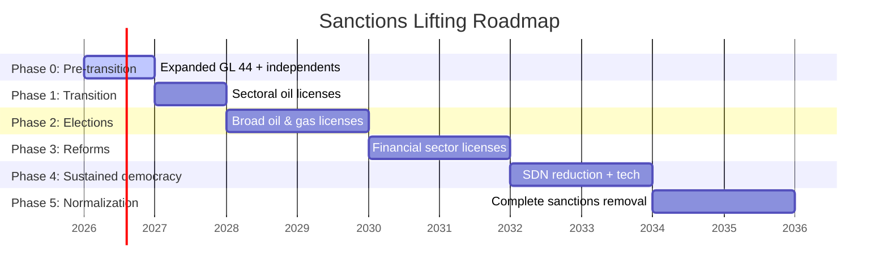
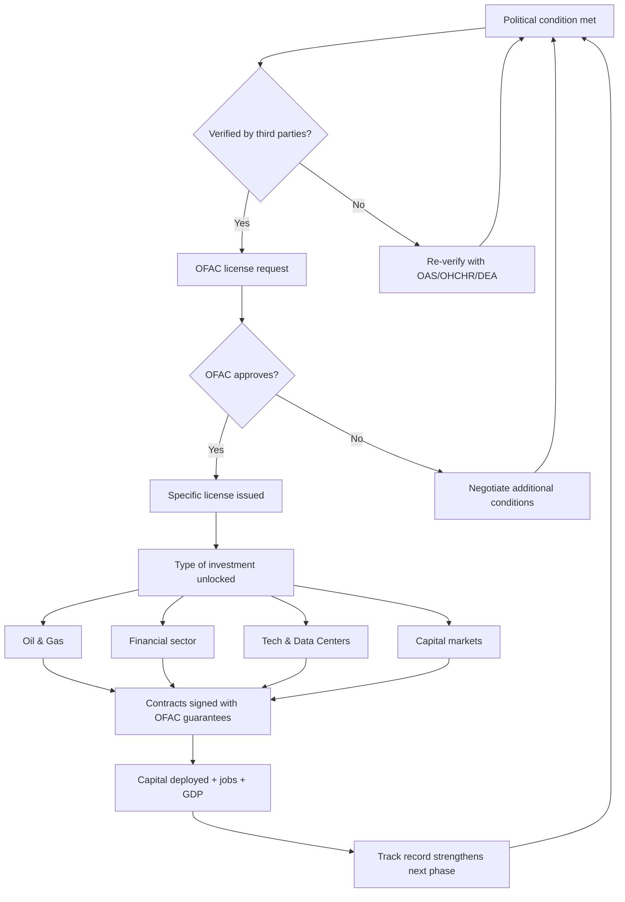

# Sanctions Roadmap: From OFAC to Investment Grade

:::tip In a nutshell
Venezuela is sanctioned by the U.S. and Europe. Sanctions are lifted step by step as conditions are met: elections, political prisoners released, reforms. Each condition fulfilled unlocks more investment.
:::

:::danger No sanctions roadmap = no investment
U.S. sanctions block **USD 6-20B** in tech investment and **USD 4-20B** in VC/PE. Without a verifiable roadmap for their progressive lifting, the reconstruction plan is limited to Chevron operations and diaspora capital. This document closes that gap.
:::

## Current Sanctions Landscape

Venezuela has accumulated **6 active Executive Orders** that block virtually all economic activity with the U.S.:

| Executive Order | Year | What It Blocks | Impact |
|----------------|------|---------------|--------|
| EO 13692 | 2015 | Assets of designated officials (SDN) | **112+ individuals** on SDN list |
| EO 13808 | 2017 | New government and PDVSA debt | Impossible to issue sovereign bonds |
| EO 13827 | 2018 | Government cryptocurrencies (Petro) | Blocks state digital finance |
| EO 13835 | 2018 | Purchase of existing Venezuelan debt | Secondary market frozen |
| EO 13850 | 2018 | Gold and mining sector | Blocks **USD 2-4B/year** in gold exports |
| EO 13884 | 2019 | Total government blockade | **The broadest**: freezes all State assets in U.S. jurisdiction |

**Source:** [OFAC Venezuela Sanctions Program](https://ofac.treasury.gov/sanctions-programs-and-country-information/venezuela-related-sanctions)

### Precedent: General License 44 (Chevron)

GL 44 (Nov. 2022, renewed) allows Chevron to operate in Venezuela under strict conditions:
- No royalties paid directly to the Maduro government
- Production limited to existing JVs
- Revenue to U.S.-controlled accounts
- **Result:** Chevron produces ~**200,000 bpd** with limited investment

:::info Key lesson from GL 44
Washington has already demonstrated it can grant conditional licenses without lifting sanctions. The model is: **verifiable condition -> specific license -> controlled investment**. The full roadmap follows this logic.
:::

## What Washington Needs (Marco Rubio)

Based on public statements by Secretary of State Rubio, the State Department, and Congress, the conditions are clear:

| Condition | Verifier | Standard |
|-----------|----------|----------|
| Free elections with international observation | OAS, EU, Carter Center | Formal invitation + full access |
| Release of political prisoners | OHCHR, NGOs (Foro Penal) | Verifiable list, prison access |
| Disconnection of the Cuban apparatus from FANB/SEBIN | U.S. intelligence | Verified departure of Cuban advisors |
| Anti-narcotics cooperation | DEA, SOUTHCOM | Extraditions + joint operations |
| Debt restructuring framework | IMF, creditors | Acceptable to bondholders |
| Humanitarian and HR access | OHCHR, UNHCR | Permanent office in Venezuela |

**Source:** Rubio's statements before the Senate (2025-2026), [Congressional Research Service — Venezuela Sanctions](https://crsreports.congress.gov/) [Requires research: compile specific URLs of Rubio's statements]

:::caution Rubio does not negotiate in the abstract
Unlike previous administrations, Rubio demands **verifiable conditions before each step**. There is no "good faith" lifting. Each license is earned with facts on the ground.
:::

## Phased Roadmap

This is the central table of the document. Each phase requires that the previous one be substantially fulfilled.

| Phase | Verifiable Condition | Expected OFAC License | Investment Unlocked | Estimated Amount | Timeline |
|-------|---------------------|----------------------|---------------------|-----------------|----------|
| **0: Pre-transition** (now) | Status quo: U.S. controls sales, Chevron operates | Expanded GL 44 to more operators | Chevron + independents (Maurel & Prom, Repsol) | **USD 3-5B** | 2026-2027 |
| **1: Transition + elections announced** | Transition government installed, electoral schedule with date, observers invited | Sectoral licenses for upstream oil | Oil major JVs (TotalEnergies, Shell, ENI) | **USD 10-20B** | 2027-2028 |
| **2: Elections + prisoners released** | Elections held (certified by OAS/EU), political prisoners released | Broad oil & gas licenses (upstream + downstream + gas) | Full upstream, natural gas (LNG), refineries | **USD 20-30B** | 2028-2030 |
| **3: Democratic government + reforms** | Elected government operating, judicial reforms initiated, anti-narcotics cooperation | Financial sector licenses | International banking, bonds, VIN structure | **USD 15-25B** | 2030-2032 |
| **4: Sustained democracy (2+ years)** | Two years of democratic government, verified HR, Cuba disconnected | SDN list reduction, tech/services licenses | Tech investment, data centers, VC/PE | **USD 6-16B** | 2032-2034 |
| **5: Full normalization** | Democratic track record, debt restructured, investment grade path | Complete sanctions removal | Sovereign bonds, investment grade, full capital markets | **USD 20-50B** | 2034-2036 |

**Total accumulated: USD 74-146B** progressively unlocked over ~10 years.

:::tip Each phase generates momentum
Phase 0 is already happening. Chevron is producing, Wright visited Caracas, there are **USD 5B+** in agreements. We are not starting from zero. Each successful phase reduces perceived risk and accelerates the next.
:::

## Visual Timeline

## Decision Tree

## International Comparables

Is it realistic to progressively lift sanctions in ~10 years? Yes. There are direct precedents:

| Country | Program | Conditions Demanded | Result | Timeline | Lesson for Venezuela |
|---------|---------|---------------------|--------|----------|---------------------|
| **Iran** (JCPOA) | U.S./EU/UN nuclear sanctions | Reduce uranium enrichment, IAEA inspections, dismantle centrifuges | **USD 100B+ in unfrozen assets**, oil from 1M to 2.5M bpd | 2013-2016 (3 years negotiation) | Verifiable technical conditions work. But: Trump exited the agreement in 2018. Lesson: **needs bipartisan support** |
| **Myanmar** | U.S. sanctions for military junta | 2010/2012 elections, release of Aung San Suu Kyi, political reforms | Foreign investment from USD 0.3B to **USD 9.5B/year**, GDP grew 7%/year | 2012-2016 (4 years) | Gradual lifting works. But: 2021 coup reversed everything. Lesson: **reforms must be irreversible** |
| **Sudan** | State sponsor of terrorism list | Anti-terrorism cooperation, payment to attack victims, Israel agreement | Removed from list, access to IMF/World Bank, debt relief **USD 50B** | 2017-2020 (3 years) | Security + financial compensation conditions. Lesson: **paying the political debt opens doors** |
| **Cuba** (Obama) | Partial sanctions relaxation | Prisoner release (swap), diplomatic restoration | Tourism from USD 0 to **USD 3B/year**, direct flights, remittances liberalized | 2014-2016 (2 years) | Partial works for specific sectors. But: Trump reversed it. Lesson: **partial lifting is fragile without legislation** |

**Source:** [Congressional Research Service](https://crsreports.congress.gov/), [Brookings Institution](https://www.brookings.edu/) [Requires research: specific URLs per case]

:::info Venezuela has an advantage none of these countries had
**303B barrels of proven reserves**. The U.S. has a direct economic incentive to lift sanctions. Iran was a strategic adversary. Myanmar was energetically irrelevant. Venezuela is the largest deposit in the Western Hemisphere. That changes the equation.
:::

## Plan B: If Sanctions Are NOT Lifted

Do not bet everything on one scenario. If lifting is delayed or stalls:

| Scenario | Strategy | Available Capital | Limitation |
|----------|----------|-------------------|-----------|
| Sanctions maintained 5+ years | Pre-Seed with diaspora (**7.9M** people), Chevron/GL 44 operations only | **USD 3-8B** (diaspora + Chevron) | No oil majors, no capital markets |
| Partial lifting (oil only) | Maximize upstream with sectoral licenses, sovereign fund with limited revenue | **USD 15-30B** | No tech investment, no investment grade |
| Non-U.S. investors | India (ONGC), Brazil (Petrobras), Gulf (ADNOC, Saudi Aramco) | **USD 10-20B** [Requires research] | Secondary sanctions risk, less available capital |
| Alternative finance | Non-USD bonds (yuan, euro), asset tokenization, DeFi for remittances | **USD 2-5B** [Requires research] | Limited liquidity, higher cost of capital |

:::danger Plan B works, but it is slow
Without sanctions lifting, reconstruction goes from **15 years to 25-30 years**. The diaspora Pre-Seed launches without depending on sanctions (see [Citizen Investment](/03-ciudadanos/inversion-ciudadana)), but the jump to USD 550-750B in total investment requires normalization with the U.S.
:::

## Alignment with Washington: How to Build Credibility

It is not enough to meet conditions. The relationship must be proactively built:

| Action | Responsible | Estimated Cost | Expected Impact |
|--------|-------------|----------------|----------------|
| Hire DC lobbying/advisory firm (Akin Gump, BGR Group, Mercury) | Transition government | **USD 2-5M/year** | Access to Congress, State Department, OFAC |
| Engagement with Congressional Venezuela Caucus | Embassy + lobbying | Included in advisory | Bipartisan allies for lifting legislation |
| Quarterly compliance reports | Government + international auditors | **USD 1-2M/year** | Verifiable evidence for each phase |
| Dedicated OFAC compliance team | Government + law firms (Sullivan & Cromwell, Cleary Gottlieb) | **USD 3-5M/year** | Zero violations = trust |
| Roadshows with investors in NY/Houston/London | Economic team | **USD 0.5-1M/event** | Investment pipeline ready for each phase |
| Full transparency: public dashboard of fulfilled conditions | Tech team | **USD 0.5M** (development) | Credibility with both citizens AND Washington |

**Total alignment investment: USD 7-13M/year.** Return: unlocking **USD 74-146B** in investment.

:::tip USD 10M to unlock USD 100B+
The cost-benefit ratio is absurd. A first-tier compliance and lobbying team costs what a building in Caracas costs. The return is access to the largest capital market in the world. Not doing it is negligence.
:::

## Connection with the Plan

| Plan Section | Sanctions Dependency |
|-------------|---------------------|
| [Financial Engine](/02-motor-financiero/inversion-inicial-fuentes) | Phases 1-3: oil majors, bonds, banking |
| [Tech Hubs / SEEZs](/05-transformacion/hubs-tech) | Phase 4: tech investment, data centers |
| [Sovereign Fund](/02-motor-financiero/fondo-soberano) | Phase 3+: VIN structure, Santiago Principles |
| [Geopolitical Reality](/04-gobernanza/geopolitica) | All phases: U.S. controls sales |
| [Diaspora Pre-Seed](/03-ciudadanos/inversion-ciudadana) | **Phase 0: Does NOT depend on sanctions** |

---

## BIT Venezuela-U.S.: Legal Protection for Investors

:::info No BIT exists between Venezuela and the U.S.
Unlike Colombia ([BIT with the U.S. in force since 2012](https://investmentpolicy.unctad.org/)), Peru (signed but not ratified) or Argentina (in force since 1994), **Venezuela has never signed a bilateral investment treaty with the United States.** This means that the **500,000+ Venezuelan-Americans in Florida** and U.S. investors have no formal legal protection against expropriation, discriminatory treatment, or denial of justice in Venezuela.
:::

### What a BIT Provides

| Protection | What It Means | Relevance for Venezuela |
|-----------|--------------|------------------------|
| **Access to ICSID arbitration** | If the government violates an investor's rights, they can sue before [ICSID (World Bank)](https://icsid.worldbank.org/) — a neutral tribunal | Venezuela left ICSID in 2012; a BIT would require re-entry or acceptance of ad hoc jurisdiction |
| **Protection against expropriation** | Expropriation only with fair, prompt, and effective compensation | Critical: 1,500+ companies expropriated without compensation (2005-2015) |
| **Fair and equitable treatment (FET)** | Government cannot apply arbitrary or discriminatory rules to investors | Eliminates risk of "changing the rules of the game" post-investment |
| **Free transfer of capital** | Investors can repatriate profits without exchange controls | Critical given the history of exchange controls (CADIVI, CENCOEX) |
| **Most favored nation clause (MFN)** | U.S. investors receive treatment at least equal to that of any other country | Prevents preferential deals with China/Russia to the detriment of U.S. investors |

### Proposed Timeline

| Roadmap Phase | BIT Action | Dependency |
|--------------|-----------|------------|
| **Phase 2-3** (2028-2032) | Initiate formal BIT negotiations during financial sanctions lifting process | Democratic government installed + judicial reforms initiated |
| **Phase 3-4** (2030-2034) | BIT signing + ratification by U.S. Senate and Venezuelan Parliament | 2+ year track record of respecting private property |
| **Phase 4-5** (2032-2036) | BIT operational + ICSID re-entry or equivalent arbitral mechanism | Full normalization of relations |

### Regional Precedents

| Country | BIT with U.S. | Year | Impact on FDI | Source |
|---------|--------------|------|--------------|--------|
| **Colombia** | In force | 2012 | FDI from USD 10B to **USD 17B/year** post-BIT | [UNCTAD BIT Database](https://investmentpolicy.unctad.org/) |
| **Peru** | Signed, not ratified | 2006 | FDI grew with FTA (which includes investment chapter) | [UNCTAD](https://investmentpolicy.unctad.org/) |
| **Argentina** | In force | 1994 | Protected investors during 2001 crisis; 62 ICSID claims against Argentina | [ICSID](https://icsid.worldbank.org/) |
| **Ecuador** | Terminated | 2018 (terminated by Correa) | FDI fell; Correa faced USD 2B+ in ICSID claims | [UNCTAD](https://investmentpolicy.unctad.org/) |

:::tip The BIT is the strongest signal for the investor diaspora
For the **500,000+ Venezuelan-Americans** who want to invest in reconstruction but fear another expropriation, the BIT is the difference between "I want to invest" and "I will invest." With a BIT, if the government expropriates, the investor sues at ICSID and collects. Without a BIT, the investor is at the mercy of Venezuelan courts — which have historically ruled in favor of the government.
:::

**Sources:** [UNCTAD BIT Database](https://investmentpolicy.unctad.org/) | [ICSID (World Bank)](https://icsid.worldbank.org/) [Requires research: specific URLs for Colombia-US and Argentina-US BITs]

---

> **Sanctions are not a wall. They are a door with conditions written on the lock. This roadmap is the key.**
