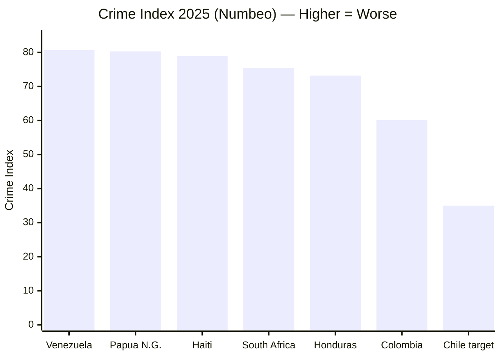
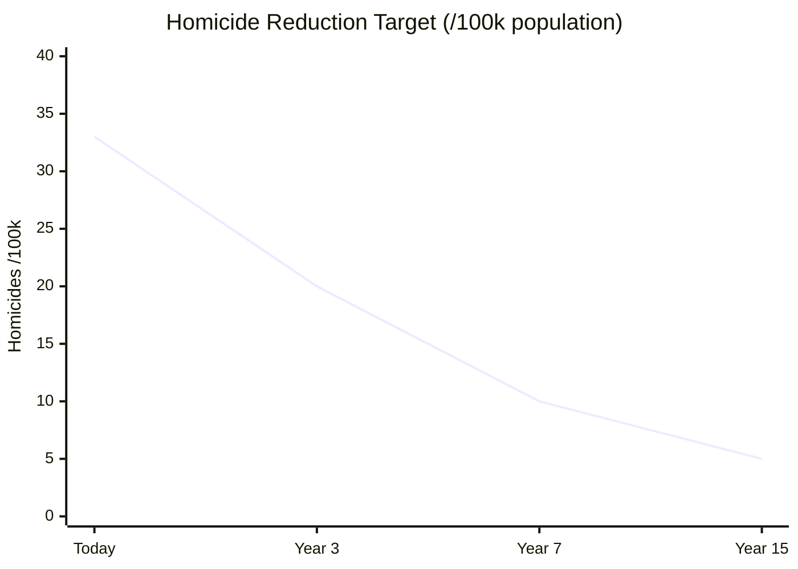
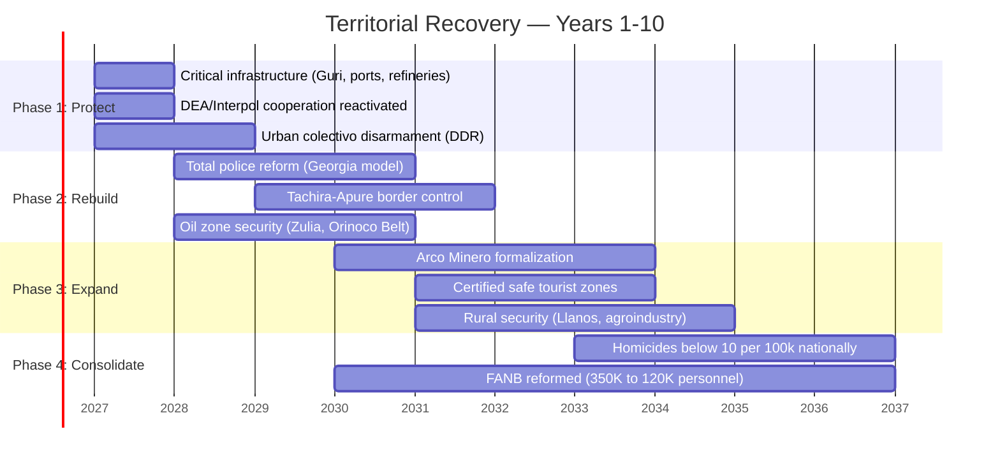
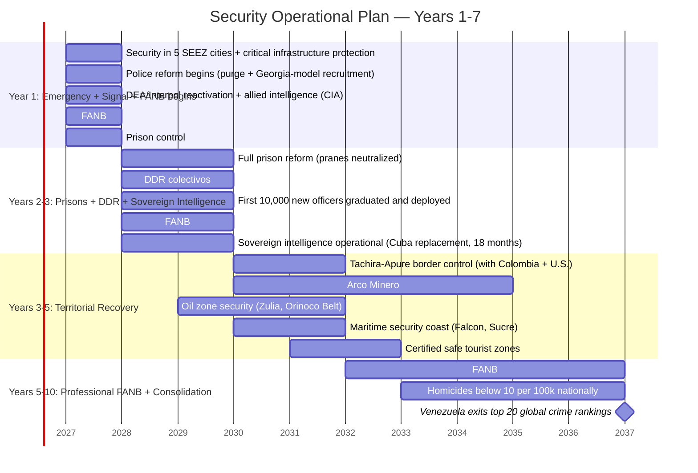

# Physical Security: No Security, No Investment

:::tip In a nutshell
Without security, nothing else works. Venezuela is the most violent country in the world. This section lays out how to reform the police, disarm armed groups, and make it safe to walk the streets again.
:::

> No Big Tech company puts a data center where there is kidnapping risk. No tourist visits a country with the highest homicide rate on the continent.

## Diagnosis: The Reality

Venezuela has the [highest crime index in the world](https://worldpopulationreview.com/country-rankings/crime-rate-by-country) (80.7 on the Numbeo Crime Index, 2025), above Papua New Guinea (80.3) and Haiti (78.9).

The homicide rate has dropped ~42% from its 2016 peak, but Venezuela remains among the most violent countries in the world. [Source: Macrotrends/UNODC](https://www.macrotrends.net/global-metrics/countries/ven/venezuela/murder-homicide-rate).

| Threat | Level | Description | Source |
|--------|-------|-------------|--------|
| **Tren de Aragua** | CRITICAL | [Most powerful criminal organization in Venezuela](https://insightcrime.org/venezuela-organized-crime-news/tren-de-aragua/), founded in 2014 in Tocoron prison. Transnational presence (Chile, Peru, Colombia, U.S.). Designated a [terrorist organization by Trump (Feb. 2025)](https://www.npr.org/2025/03/16/nx-s1-5329777/tren-de-aragua-all-you-need-to-know-about-the-venezuelan-gang) | InSight Crime; NPR |
| **Armed colectivos** | CRITICAL | Pro-government paramilitary groups with territorial control in urban areas | [OSAC](https://www.osac.gov/Content/Report/34f99e62-2161-412d-bfeb-1e752539f6bf) |
| **Drug trafficking** | CRITICAL | Venezuela as transit corridor to Central America and the U.S. | [OC Index 2025](https://ocindex.net/assets/downloads/2025/english/ocindex_profile_venezuela_2025.pdf) |
| **Megabandas** | HIGH | Yeico Masacre and other groups with international expansion | [InSight Crime](https://insightcrime.org/venezuela-organized-crime-news/tren-de-aragua/) |
| **ELN/FARC border** | HIGH | Guerrilla presence in border states (Tachira, Apure, Zulia) | OSAC |
| **Illegal mining (Arco Minero)** | HIGH | Criminal control of mining zones in Bolivar | [OC Index 2025](https://ocindex.net/assets/downloads/2025/english/ocindex_profile_venezuela_2025.pdf) |

## Successful Reform Models

| Country | Reform | Result | Source |
|---------|--------|--------|--------|
| **Georgia (2004)** | [Fired ~15,000 police officers in one day](https://successfulsocieties.princeton.edu/sites/g/files/toruqf5601/files/Policy_Note_ID126.pdf) (~85% of the force). Replaced with Patrol Police with clean records. Salaries multiplied 10x. | Violent crime dropped **66%**. Police became the [3rd most trusted institution](https://centreforpublicimpact.org/public-impact-fundamentals/seizing-the-moment-rebuilding-georgias-police/) in the country | Princeton; Centre for Public Impact |
| **Post-FARC Colombia** | DDR (Disarmament, Demobilization, Reintegration). 13,000+ ex-combatants in reintegration programs | Homicide rate: 60/100k (2002) to ~24/100k (2023) | UN; DANE data |
| **El Salvador (Bukele)** | State of emergency since 2022. Mass incarceration. CECOT construction (mega-prison) | Homicides: ~106/100k (2015) to ~2.4/100k (2024). Controversial for human rights | InSight Crime |
| **Singapore** | Competitive police salaries + technology + zero tolerance + severe penalties | Top 3 safest countries in the world | [CPIB](https://www.cpib.gov.sg/) |

:::caution Georgia Model vs. Bukele Model
Georgia reformed by **replacing** the police with well-paid professionals (institutional model). El Salvador reformed by **mass incarceration** (repressive model). The Venezuela S.A. plan proposes the **Georgia model**: rebuild institutions, not fill prisons. Institutions last; repression without institutions does not.
:::

## Venezuela S.A. Security Plan

### Phase 1: Emergency (Days 1–180)
| Action | Est. Cost | Model |
|--------|-----------|-------|
| Publication of criminal map (zones, actors, corridors) | USD 5–10M | Intelligence |
| Colectivo disarmament (DDR) | USD 500–1,000M | Post-FARC Colombia |
| Critical infrastructure protection (Guri, ports, refineries) | USD 200–500M | International standard |
| DEA/Interpol cooperation reactivated | Low cost | Bilateral agreements |

### Phase 2: Police Reconstruction (Years 1–3)
| Action | Est. Cost | Model |
|--------|-----------|-------|
| Total police purge and reconstruction | USD 1,000–2,000M | [Georgia 2004](https://foreignpolicy.com/2020/06/11/abolish-police-georgia-brutality-crime/) |
| Competitive police salaries (USD 800–1,200/month) | USD 500M/year | Georgia + Singapore |
| Cameras + technology in major cities | USD 500–1,000M | Singapore / Estonia |
| New police academy (12-month training) | USD 200–400M | Georgia Patrol Police |
| National Cybersecurity Center | USD 100–200M | Estonia CERT-EE |

### Phase 3: Consolidation (Years 3–7)
| Action | Est. Cost | Model |
|--------|-----------|-------|
| Arco Minero formalization (drones + satellite + legal mining) | USD 500–1,000M | Colombia/Peru |
| Predictive policing with ethical controls | USD 200–500M | Singapore |
| Homicide reduction to <15/100k | — | Target: current Colombia level |

**Total estimated investment (Phases 1-3):** USD 5,000–8,000M over 7 years. *See [updated estimate below](#updated-security-investment) which includes FANB reform and expanded DDR: USD 18-25B over 10 years.*

### Outcome Targets

| Indicator | Today | Year 3 | Year 7 | Year 15 |
|-----------|-------|--------|--------|---------|
| Homicide rate | ~25–40/100k (est.) | <20/100k | <10/100k | <5/100k (Chile level) |
| Crime index (Numbeo) | 80.7 (#1 worldwide) | <60 | <40 | <30 |
| Trust in police | <10% (est.) | >40% | >60% | >75% |

---

## The Elephant in the Room: Territorial Control

:::caution What no investment plan mentions
Before talking about data centers and SEEZs, we need to talk about who controls the territory where they are to be built.
:::

### Territorial Control Map

| Zone | Dominant Actor | Type | Economic Impact |
|------|---------------|------|-----------------|
| **Arco Minero (Bolivar)** | ELN, FARC dissidents, armed syndicates, pranatos | Criminal-guerrilla | Blocks mining formalization (USD 8-10B/year) |
| **Tachira-Apure border** | ELN + FANB (coexistence) | Guerrilla + military | Fuel smuggling, drug trafficking, extortion |
| **Zulia (south)** | Paramilitary groups + drug trafficking | Criminal | Blocks oil rehabilitation in Lake basins |
| **Tocoron/Aragua** | Tren de Aragua (weakened but active) | Transnational organized crime | Extortion, human trafficking, drug trafficking |
| **Urban barrios (Caracas, Valencia)** | Colectivos + megabandas | Paramilitary + criminal | Territorial control prevents urban investment |
| **Coast (Falcon, Sucre)** | Drug trafficking networks + illegal fishing | Criminal | Blocks coastal tourism and ports |
| **Orinoco Delta** | Illegal mining + state abandonment | Extractive | Environmental disaster + affected indigenous communities |

**Source:** [OC Index Venezuela 2025](https://ocindex.net/assets/downloads/2025/english/ocindex_profile_venezuela_2025.pdf) | [InSight Crime](https://insightcrime.org/venezuela-organized-crime-news/) | [OSAC](https://www.osac.gov/)

### FANB: The Most Complex Actor

The Bolivarian National Armed Forces (~350,000 personnel, [IISS Military Balance 2024](https://www.iiss.org/publications/the-military-balance)) are not just a security force — they are an economic conglomerate:

| FANB Activity | Estimated Scale | Source |
|--------------|----------------|--------|
| Mining control (gold/coltan) | USD 1-2B/year | [InSight Crime, 2023](https://insightcrime.org/) |
| Fuel smuggling | USD 500M-1B/year | [Reuters, 2024](https://www.reuters.com/) |
| Food imports (CLAP) | USD 2-3B/year in contracts | [Transparencia Venezuela](https://transparenciave.org/) |
| Military enterprises (construction, transport) | [Requires research] | — |
| Drug trafficking (individuals, not institutional) | [Requires research] | U.S. DOJ indictments |

**Implication:** Any economic reform that eliminates these rents without offering an alternative will face active resistance from an actor with 350,000 armed personnel.

### Security Prerequisites by Economic Engine

| Economic Engine | Security Prerequisite | Key Zone | Timeline |
|----------------|----------------------|----------|----------|
| Oil (USD 183B investment) | Zulia control + infrastructure protection | Lake Maracaibo, Orinoco Belt | Years 1-3 |
| Formal mining (USD 8-10B/year) | Displacement of armed groups from Arco Minero | Bolivar, Amazonas | Years 3-7 |
| Data centers / SEEZs | Physical + legal security in tech zones | Caracas, Valencia, Barquisimeto | Years 1-5 |
| Tourism (USD 4-10B/year) | <10 homicides/100k + verified safe zones | Los Roques, Canaima, Merida | Years 3-7 |
| Agroindustry | Property titles + rural security | Llanos, Barinas, Portuguesa | Years 1-5 |
| Gas (Dragon Field) | Maritime security on the north coast | Sucre, Nueva Esparta | Years 1-3 |

### Realistic Territorial Recovery Sequence

### Adapted DDR: International Lessons

| Dimension | Colombia (political) | El Salvador (criminal) | **Venezuela (hybrid)** |
|-----------|---------------------|----------------------|----------------------|
| Type of conflict | Ideological guerrilla | Gangs/Maras | Guerrilla + organized crime + paramilitaries + military |
| DDR model | Negotiation -> agreement -> reintegration | Mass incarceration | **Selective negotiation + institutional reform + justice** |
| Ex-combatants | ~13,000 FARC -> productive programs | ~70,000 incarcerated | ~50,000-80,000 (colectivos + gangs + ELN) [Requires research] |
| Cost | USD 1.2B (JEP + reintegration, [World Bank](https://www.worldbank.org/)) | USD 2-3B (prisons + police) | **USD 3-5B (DDR component)** |
| Result | Homicides: 60 to 24/100k in 20 years | Homicides: 106 to 2.4/100k in 8 years (HR questioned) | **Target: 33 to <10/100k in 10 years** |
| Main risk | Dissidents + drug trafficking + power vacuum | Authoritarianism + HR violations | **FANB resists + power vacuum in liberated zones** |

**Source:** [Colombia JEP](https://www.jep.gov.go/) | [Crisis Group El Salvador](https://www.crisisgroup.org/) | [Plan Colombia](https://www.state.gov/) (USD 12B+ U.S. investment)

See [Transitional Justice](/04-gobernanza/justicia-transicional) for the conditional amnesty legal framework that enables DDR.

### Updated Security Investment

:::danger Post-evaluation correction DDR (5.7/10): insufficient budget and front-loading needed
The security/DDR expert identified that USD 10-18B over 7 years is insufficient for the scale of the challenge (FANB + colectivos + ELN + pranes + narco + coast). Recommendation: **USD 18-25B over 10 years, with USD 8-10B front-loaded in Years 1-3.** The first 3 years determine whether the virtuous cycle (security->investment->employment->less crime) or the vicious one (insecurity->flight->unemployment->more crime) is activated.
:::

| Component | Previous Estimate | **Corrected Estimate** | Justification |
|-----------|-------------------|----------------------|---------------|
| Police reform (Georgia model) | USD 3-4B | **USD 4-5B** | 200K police surge (Years 1-5), scaling down to 130K. 10+ academies with 2,000/year capacity each. Salaries USD 800-1,200/month. Partners: [ILEA](https://www.state.gov/international-law-enforcement-academies/), Colombia, Israel |
| DDR (colectivos + gangs) | USD 3-5B | **USD 4-6B** | Command mapping 6 months. Negotiation 2-4 years. Reintegration: employment in infrastructure concessions, not just packages. Ref: Colombia 4+ years |
| FANB reform (350K->100K) | USD 2-4B | **USD 3-5B** | Militia dissolution (220K) Year 1. Directed retirement of mid-level command Years 2-3. Tiered buyout by rank (USD 5K-50K based on rank + replaced illicit rents). Full professionalization Year 10 |
| Prison control | Not estimated | **USD 1-2B** | Reclaim prisons from pranes in Phase 1 (before DDR). 5-10K new prison guards. Infrastructure. Ref: El Salvador CECOT adapted |
| Arco Minero (military operation + formalization) | Included in DDR | **USD 2-3B** | Plan Patriota-type operation (Colombia 2003). 7-10 years for full control. ELN has real military capability |
| Maritime security (coast) | Not estimated | **USD 1-1.5B** | Patrol boats, coastal radar, DEA maritime cooperation. Falcon-Sucre coast = narco corridor |
| Security infrastructure (cameras, centers) | USD 1-2B | USD 1-2B | No change |
| Sovereign intelligence (post-Cuba) | USD 0.5-1B | **USD 1.5-2B** | Replacement of Cuban capability in 18 months. CIA/DEA as bridge. Counterintelligence against stay-behind networks. Physical protection of transition leaders |
| Cybersecurity | USD 0.3-0.5B | USD 0.5-1B | Estonia standard |
| **TOTAL** | **USD 10-18B / 7 years** | **USD 18-25B / 10 years** | **Front-loaded: USD 8-10B in Years 1-3** |

### Temporal Distribution (front-loaded)

| Period | Investment | % of Total | Focus |
|--------|-----------|------------|-------|
| **Years 1-3** | **USD 8-10B** | **40-45%** | Militia dissolved, prisons reclaimed, 10K police, operational intelligence, infrastructure protected |
| **Years 4-7** | **USD 6-8B** | **30-35%** | Arco Minero, border, FANB professionalization, DDR complete, safe tourism |
| **Years 8-10** | **USD 4-7B** | **20-25%** | Consolidation, predictive technology, homicides <10/100K, exits top 20 crime rankings |

:::caution Cost of not investing in security
The cost of current insecurity is estimated at ~22% of GDP including homicides, extortion, lost investment, forced emigration, and healthcare costs ([UNDP](https://www.undp.org/)). The USD 10-18B investment over 10 years pays for itself if it reduces this loss by 50%.
:::

---

## Territorial Security Operational Plan

:::danger Precondition for the ENTIRE plan
Without territorial security, nothing works. This is not section 4 — it is the precondition for ALL sections. No investor puts up USD 500 if they get robbed leaving the bank. No data center gets built where there is extortion risk. No tourist visits a country where they get kidnapped on the highway. **Security is not a chapter — it is the foundation.**
:::

### Territorial Control Map by Actor Type

| Zone | Dominant Actor | Type | Direct Impact |
|------|---------------|------|---------------|
| **Prisons (Tocoron, Rodeo)** | Pranes — Tren de Aragua, Yeico Masacre | Transnational organized crime | National extortion, trafficking, drug trade. Operate from prisons as command centers |
| **Urban barrios (Caracas, Valencia, Barquisimeto)** | Colectivos — Tupamaros, La Piedrita, Colectivo Alexis Vive | Political-criminal paramilitary | Urban territorial control, commercial extortion, electoral intimidation |
| **Colombia border (Tachira, Apure, Zulia)** | ELN, FARC dissidents (ex-Segunda Marquetalia) | Guerrilla + drug trafficking | Fuel smuggling, drug trafficking, illegal mining, kidnapping |
| **Arco Minero (Bolivar, Amazonas)** | ELN + armed syndicates + pranatos | Criminal-guerrilla-extractive | Illegal gold and coltan mining. USD 2-4B/year in illicit economy |
| **FANB (nationwide)** | High command with economic interests | Military-economic | Smuggling, mining, CLAP, individual drug trafficking. ~USD 3-6B/year in rents |
| **Coast (Falcon, Sucre, Nueva Esparta)** | Drug trafficking networks + illegal fishing | Maritime criminal | Blocks coastal tourism, ports, maritime security |

**Source:** [InSight Crime](https://insightcrime.org/venezuela-organized-crime-news/) | [OC Index 2025](https://ocindex.net/assets/downloads/2025/english/ocindex_profile_venezuela_2025.pdf) | [OSAC](https://www.osac.gov/) | [Requires research for exact illicit economy figures]

### DDR Adapted for Venezuela: Hybrid Model

Venezuela is neither Colombia nor El Salvador. It is **both simultaneously** — political conflict (colectivos) + organized crime (pranes/megabandas) + cross-border guerrilla (ELN). A hybrid DDR is needed:

| Dimension | Colombia (political DDR) | El Salvador (criminal DDR) | **Venezuela (hybrid DDR)** |
|-----------|------------------------|---------------------------|---------------------------|
| **Core problem** | Ideological guerrilla with unified command | Gangs without ideology, territorial control | Guerrilla + crime + paramilitaries + military with economic interests |
| **Model applied** | Negotiation -> peace agreement -> productive reintegration | State of emergency -> mass incarceration -> mega-prisons | **Selective negotiation for colectivos that disarm + criminal justice for pranes/ELN + institutional FANB reform** |
| **What to negotiate** | Political participation, land, truth | Nothing — pure repression | **Colectivos: conditional amnesty + employment. FANB: dignified retirement + reconversion. Pranes/ELN: justice + reformed prisons** |
| **What NOT to negotiate** | — | — | **Extortion, drug trafficking, human trafficking. Zero tolerance.** |
| **Main risk** | Power vacuum -> dissidents | Authoritarianism + HR violations | **FANB resists reform + vacuum in liberated zones if not filled quickly** |
| **Estimated cost** | USD 1.2B (JEP + reintegration) | USD 2-3B (prisons + police) | **USD 3-5B (DDR component) + USD 2-4B (FANB reform)** |
| **Reference** | [JEP Colombia](https://www.jep.gov.co/) | [Crisis Group El Salvador](https://www.crisisgroup.org/) | Hybrid — both models + own innovation |

### Operational Recovery Sequence

### Security Prerequisites by Economic Sector

| Economic Sector | Security Prerequisite | Without Security | Required Timeline |
|----------------|----------------------|-----------------|-------------------|
| **Oil** (USD 183B investment) | Safe transit, pipeline/refinery protection, Zulia zone controlled | No major invests beyond the minimum. Production stalls at 1M bpd | **Year 1** |
| **Data centers** (USD 3-8B/year) | 24/7 physical security, zero kidnapping risk, electrical stability | No tech giant (Google, Microsoft, Amazon) places a server | **Year 2** |
| **Tourism** (USD 4-10B/year) | 24/7 safe tourist zones, reformed police, homicide rate <15/100k | Zero high-spending international tourists. Only adventurers | **Years 3-5** |
| **Agroindustry** (USD 5-8B/year) | Land tenure security, zero invasions, rural security | No one invests in farms that can be invaded tomorrow | **Years 2-3** |
| **Formal mining** (USD 8-10B/year) | Armed group displacement from Arco Minero, secure mining titles | Mining remains illegal and controlled by criminals | **Years 3-5** |
| **Capital markets** | Rule of law, enforceable contracts, zero expropriation | No one buys a Venezuelan bond. Rating remains in default | **Years 3-7** |

### Total Territorial Security Plan Cost

**USD 18-25B over 10 years** (see [detailed table above](#updated-security-investment)).

| International Reference | Investment | Period | Result |
|------------------------|-----------|--------|--------|
| **Plan Colombia** (U.S. + government) | USD 12B+ | 2000-2016 (16 years) | Homicides: 60 to 24/100k. FARC demobilized. But dissidents persist |
| **El Salvador (Bukele)** | USD 2-3B (est.) | 2019-2025 (6 years) | Homicides: 106 to 2.4/100k. Cost: human rights questioned |
| **Georgia (Saakashvili)** | USD 300-500M (est.) | 2004-2008 (4 years) | Crime: -66%. Police: most trusted institution. Cost: low |

**Source:** [Plan Colombia/State Dept](https://www.state.gov/) | [Crisis Group](https://www.crisisgroup.org/) | [ACLED](https://acleddata.com/) | [InSight Crime](https://insightcrime.org/) [Requires research for exact Georgia and El Salvador costs]

## Military Anti-Corruption: How to Dismantle a USD 3-6B/Year Conglomerate

:::danger The real problem is not the militia — it is the 500-2,000 officers who run the business
The militia (220K) dissolves easily: they have no economic power of their own. The problem is the **mid-level and senior FANB officers** who control mining (USD 1-2B), smuggling (USD 500M-1B), CLAP (USD 2-3B), and individual drug trafficking. A colonel earning USD 50K/year in illicit rents does not accept a USD 10K retirement package. You have to offer something better than crime — or make crime impossible.
:::

### The problem viewed as a business

If the FANB were a subsidiary of Venezuela S.A., a CEO would see it this way:

| Diagnosis | Figure | Corporate Action |
|---|---|---|
| Employees: 350K (overstaffed 3.5x) | Target: 100K | Restructuring with tiered packages |
| Off-books revenue: USD 3-6B/year | 100% illicit | Cut flows + offer legal alternative |
| Command with conflicts of interest: ~500-2,000 | Control logistics, ports, mines | Separate person from position + vetting |
| Brand: toxic (politicized, corrupt) | Zero public trust | Rebrand: FANB -> new Professional Force |

### 6 military anti-corruption mechanisms (Georgia + Singapore + Colombia model)

#### 1. Replace, don't reform (Georgia 2004 model)

Georgia did not reform its corrupt police — it **eliminated it and built a new one from scratch**. Saakashvili fired 85% of the police, hired new officers with clean records, and paid 10x more.

**Application to FANB:**
- You don't "reform" an army that operates as a cartel. You create a **new professional force** with exhaustive vetting
- Every service member who wishes to remain undergoes vetting: asset audit, judicial review, lifestyle audit, polygraph
- Those who fail vetting: 3 options (retirement, reconversion, entrepreneurship) — the same as the [displaced workers model](/04-gobernanza/modelo-estado#what-happens-to-the-people)
- **Target: retain only the 100K cleanest and most professional**

#### 2. Pay enough to make corruption not worth the risk (Singapore model)

| Rank | Current salary (est.) | Illicit rent (est.) | **Proposed salary** | Crime risk/return |
|---|---|---|---|---|
| Private | USD 30-50/month | USD 0-100/month | **USD 800-1,200/month** | Crime not worth it |
| Sergeant/Technician | USD 50-100/month | USD 200-500/month | **USD 1,500-2,000/month** | Crime marginal |
| Lieutenant/Captain | USD 100-200/month | USD 500-2,000/month | **USD 2,500-4,000/month** | Crime risky |
| Colonel/General | USD 200-500/month | USD 5,000-50,000/month | **USD 5,000-10,000/month** | Crime needs to be massive to justify the risk of losing salary + pension + freedom |

**Reference:** Singapore pays generals USD 500K-1M/year. Georgia multiplied police salaries 10x and corruption dropped to near zero. **Salary is the first line of defense against corruption.**

**Cost:** 100K military personnel x USD 2,500/month average x 12 = **USD 3B/year**. It's expensive. But it's cheaper than the USD 3-6B/year the current FANB steals.

#### 3. Cut the illicit economic flows

Paying well is not enough — you must **eliminate the opportunity to steal**:

| Illicit Flow | Est. Amount | How It Gets Cut |
|---|---|---|
| **Mining (Arco Minero)** | USD 1-2B/year | Military operation (Plan Patriota) + formal concessions to audited companies. FANB loses operational access to mines |
| **Fuel smuggling** | USD 500M-1B/year | Market-rate pricing eliminates smuggling margin. If gasoline costs what it's worth, there's no incentive to smuggle |
| **CLAP (food imports)** | USD 2-3B/year | CLAP gets eliminated. Free market + targeted voucher (FCV). No "state imports" left to skim |
| **Drug trafficking** | [Requires research] | DEA + bilateral cooperation. Financial intelligence. Not FANB's jurisdiction — it's police + prosecutors |
| **Ports/customs** | USD 500M-1B/year | Customs operated by international private concession (Georgia model). FANB loses control of ports |

**The key:** each illicit rent is eliminated by **removing the function**, not by reforming the person who exercises it. If the FANB doesn't operate mines, it can't steal from mines. If it doesn't import food, it can't skim CLAP commissions. If it doesn't control ports, it can't charge "tolls."

#### 4. Mandatory asset vetting (lifestyle audit)

| Mechanism | Applies to | Frequency | Consequence |
|---|---|---|---|
| **Asset declaration** | Every officer (captain+) | Annual, public | Removal + investigation if assets don't match income |
| **Lifestyle audit** | Every general + unit directors | Semi-annual by external firm | If lifestyle exceeds salary: automatic investigation |
| **Family audit** | Spouse, children, parents of senior officers | Annual | Shell owners detected through asset networks |
| **Blockchain military procurement** | Every acquisition > USD 10K | Every transaction | Public on citizen dashboard. AI detects overpricing |
| **Military whistleblower** | Any military or civilian with information | Permanent | Reward 10-20% of recovered assets. Full whistleblower protection |

**Reference:** [Singapore CPIB](https://www.cpib.gov.sg/) — the world's most effective anti-corruption agency. Operates independent of government, can investigate ministers and generals. **The plan proposes a Venezuelan CPIB with jurisdiction over the FANB.**

#### 5. Absolute civilian oversight (the military never supervises itself again)

| Principle | Implementation |
|---|---|
| **Public military budget** | Every dollar of the Defense budget visible on citizen dashboard. Zero "classified expenses" without audit |
| **Procurement by Venezuela S.A.** | Military purchases made by Venezuela S.A. (as holding), not by the FANB directly. Eliminates the overpricing channel |
| **Civilian Inspector General** | Appointed by the Venezuela S.A. Board, not the Ministry of Defense. Reports directly to citizens |
| **Separated intelligence** | Military intelligence reports to a civilian agency (not SEBIN or high command). Model: [DIA/FBI separation U.S.](https://www.dia.mil/) |
| **Mandatory rotation** | No officer can remain >3 years in a position with access to economic resources (ports, mines, customs). Eliminates patronage networks |

#### 6. Conditional golden parachute: the smart buyout

For the 500-2,000 officers who actually control the illicit conglomerate, the standard retirement package doesn't work. A **tiered buyout** that acknowledges the economic reality is needed:

| Tier | Who | Offer | Condition | If Rejected |
|---|---|---|---|---|
| **Tier 1** (generals, 50-100) | Control major operations (ports, mining, CLAP) | Retirement with USD 200-500K + dignified pension + partial immunity for economic (non-violent) offenses | Declare assets + return identifiable illicit assets + cooperate with transition | Full criminal investigation. Asset freeze. Extradition if U.S. indictment exists |
| **Tier 2** (colonels, 500-1,000) | Mid-level command with regional rents | Retirement with USD 50-100K + career reconversion + economic amnesty | Same: declare + return + cooperate | Purge + investigation |
| **Tier 3** (officers, 1,000-5,000) | Minor participants in networks | Standard retirement (6-12 months salary) + reconversion priority | Clean asset vetting | Purge without package |

**Cost of Tier 1+2 buyout:** ~100 x USD 350K + ~750 x USD 75K = **USD 91M**. That's nothing compared to the USD 3-6B/year they stop stealing.

:::info The lesson from Georgia: speed + salaries + replacement = zero corruption
Georgia eliminated police corruption in 2 years with 3 ingredients: (1) fired everyone and hired new, (2) multiplied salaries 10x, (3) the new force had no inherited corruption networks. Venezuela applies the same model to the FANB: new force, competitive salaries, zero legacy. Those who pass vetting stay with a dignified salary. Those who don't receive a package and leave. Those who resist face justice. There is no fourth option.
:::

---

:::tip Correct sequence: security -> investment -> growth -> more security
The virtuous cycle is: security attracts investment -> investment generates employment -> employment reduces crime -> less crime attracts more investment. The vicious cycle (current) is exactly the opposite. The Operational Plan breaks the vicious cycle by investing USD 18-25B to create the minimum conditions that enable the other USD 550-750B of the plan.
:::
